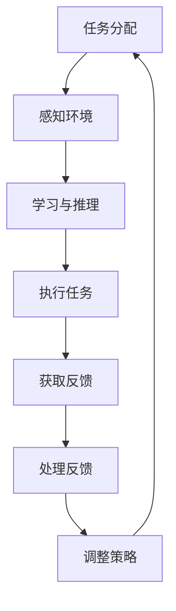

                 

关键词：AI代理，工作流，反馈获取，处理机制，优化策略，应用领域

> 摘要：本文旨在探讨人工智能代理工作流（AI Agent WorkFlow）中反馈的获取与处理机制。我们将深入分析AI代理在各类应用场景中的角色和功能，详细解读反馈获取与处理的过程，并探讨优化策略和应用领域，为AI代理技术的研究和应用提供理论支持。

## 1. 背景介绍

人工智能（AI）作为现代技术的前沿领域，正在各个行业中发挥越来越重要的作用。在自动化和智能化的需求推动下，AI代理（AI Agent）逐渐成为实现智能化工作流的关键角色。AI代理是指能够在复杂环境中自主执行任务、与其他代理进行交互的智能实体。它们可以模拟人类的思维和行为，通过学习、推理和规划来完成复杂的任务。

AI代理工作流（AI Agent WorkFlow）是指一系列自动化任务的组织和管理过程，其中AI代理作为执行者，完成从任务分配、执行到反馈获取、处理的闭环。这个过程中，反馈的获取与处理至关重要，它不仅能够帮助AI代理不断优化自身的行为，还能提高整体工作流的效率和准确性。

随着AI技术的发展，AI代理的应用场景越来越广泛。从智能家居、智能客服，到智能制造、智能交通，AI代理已经成为提高生产效率、降低成本、改善用户体验的重要工具。因此，研究AI代理工作流中的反馈获取与处理机制，对于推动AI技术在各个领域的应用具有重要意义。

## 2. 核心概念与联系

### 2.1 AI代理的定义与功能

AI代理是指能够模拟人类思维和行为，具备一定智能能力的实体。它们通过感知环境、学习知识、规划行动，以自主完成任务。AI代理的基本功能包括：

1. **感知**：通过传感器获取环境信息。
2. **学习**：基于历史数据和经验，改进自身行为。
3. **推理**：利用逻辑和知识库进行决策。
4. **规划**：制定行动策略以实现目标。

### 2.2 工作流的概念

工作流（Workflow）是指一系列任务的组织和执行过程，旨在实现特定目标。在工作流中，任务可以是人或系统执行的，它们按照一定的顺序和规则进行。工作流的关键特性包括：

1. **顺序性**：任务按照一定的顺序执行。
2. **并行性**：部分任务可以同时执行。
3. **反馈性**：通过反馈机制优化工作流。

### 2.3 反馈的获取与处理

反馈是AI代理工作流中的重要环节，它来源于任务执行的结果，用于评估代理的行为效果。反馈的获取与处理过程包括：

1. **获取**：从执行结果中提取有用的信息。
2. **处理**：对反馈进行分析，为下一步行动提供指导。

### 2.4 Mermaid流程图

为了更好地展示AI代理工作流中的反馈获取与处理过程，我们使用Mermaid流程图进行描述。以下是流程图的具体内容：



在这个流程图中，任务分配是整个工作流的起点，AI代理通过感知环境、学习与推理、执行任务，最终获取反馈并处理反馈，从而实现不断优化和调整策略。

## 3. 核心算法原理 & 具体操作步骤

### 3.1 算法原理概述

AI代理工作流中的反馈获取与处理算法主要包括以下几个步骤：

1. **感知与学习**：通过传感器获取环境信息，利用机器学习方法更新代理的知识库。
2. **推理与规划**：基于知识库和规则，进行推理和规划，制定行动策略。
3. **执行任务**：根据规划结果执行具体任务。
4. **反馈获取**：从任务执行结果中提取反馈信息。
5. **处理反馈**：对反馈进行分析，为下一步行动提供指导。
6. **调整策略**：根据反馈结果调整代理的行为策略。

### 3.2 算法步骤详解

1. **感知与学习**：AI代理通过传感器获取环境信息，如图像、声音、文本等。然后，利用机器学习方法，如深度学习、强化学习等，对获取到的数据进行处理，更新代理的知识库。

2. **推理与规划**：基于知识库和规则，AI代理进行推理和规划，确定执行任务的最佳策略。推理过程可以基于逻辑推理、模糊推理等算法，规划过程则涉及路径规划、任务分配等算法。

3. **执行任务**：根据规划结果，AI代理执行具体任务。执行过程可能涉及多个子任务，每个子任务都可以独立完成。

4. **反馈获取**：任务执行完成后，AI代理从执行结果中提取反馈信息。这些信息可以是任务完成的时间、准确度、效率等。

5. **处理反馈**：AI代理对反馈进行分析，评估任务执行的效果。根据分析结果，代理可以判断是否需要调整策略。

6. **调整策略**：根据反馈结果，AI代理调整自身的策略。这可以是优化现有策略，也可以是开发新的策略。

### 3.3 算法优缺点

#### 优点

1. **自适应性强**：算法可以根据环境变化和任务需求，实时调整策略，提高任务执行效果。
2. **高效性**：通过反馈获取与处理，AI代理可以快速适应环境，提高任务执行效率。
3. **智能化**：算法利用机器学习等技术，实现智能化的任务执行和策略调整。

#### 缺点

1. **计算复杂度高**：算法涉及大量的感知、学习、推理和规划过程，计算复杂度较高。
2. **数据依赖性大**：算法的性能很大程度上依赖于数据的质量和数量，数据不足或质量差可能导致算法效果不佳。

### 3.4 算法应用领域

算法在AI代理工作流中的应用非常广泛，以下是一些典型的应用领域：

1. **智能制造**：通过AI代理，实现生产线的自动化和智能化，提高生产效率和产品质量。
2. **智能交通**：利用AI代理进行交通流量分析、路径规划，提高交通管理效率。
3. **智能客服**：通过AI代理，实现自动化的客户服务，提高服务质量和效率。
4. **智能家居**：利用AI代理，实现家电设备的自动化管理，提高生活质量。

## 4. 数学模型和公式 & 详细讲解 & 举例说明

### 4.1 数学模型构建

在AI代理工作流中，反馈获取与处理的核心是任务执行效果的评估。为此，我们构建了以下数学模型：

$$
E = f(T, R)
$$

其中，$E$ 表示任务执行效果，$T$ 表示任务执行时间，$R$ 表示任务完成率。

### 4.2 公式推导过程

1. **任务执行时间 $T$**：任务执行时间可以通过以下公式计算：

$$
T = \sum_{i=1}^{n} t_i
$$

其中，$t_i$ 表示第 $i$ 个子任务的执行时间。

2. **任务完成率 $R$**：任务完成率可以通过以下公式计算：

$$
R = \frac{\sum_{i=1}^{n} p_i}{n}
$$

其中，$p_i$ 表示第 $i$ 个子任务的成功率。

3. **任务执行效果 $E$**：任务执行效果可以通过以下公式计算：

$$
E = f(T, R)
$$

其中，$f$ 是一个映射函数，用于将任务执行时间和任务完成率映射为任务执行效果。

### 4.3 案例分析与讲解

假设一个任务包含三个子任务，子任务的执行时间分别为 $t_1 = 10$ 分钟，$t_2 = 20$ 分钟，$t_3 = 30$ 分钟。子任务的成功率分别为 $p_1 = 0.9$，$p_2 = 0.8$，$p_3 = 0.95$。

根据上述公式，可以计算出任务执行时间 $T$ 和任务完成率 $R$：

$$
T = 10 + 20 + 30 = 60 \text{ 分钟}
$$

$$
R = \frac{0.9 + 0.8 + 0.95}{3} = 0.9167
$$

然后，可以计算出任务执行效果 $E$：

$$
E = f(60, 0.9167)
$$

这里，我们假设 $f$ 是一个线性函数，即：

$$
f(T, R) = aT + bR
$$

其中，$a$ 和 $b$ 是参数。为了简化计算，我们假设 $a = 1$，$b = 1$，则：

$$
E = 60 + 0.9167 = 60.9167
$$

这个结果表示任务执行效果为 60.9167，可以用来评估任务的整体表现。

## 5. 项目实践：代码实例和详细解释说明

### 5.1 开发环境搭建

在进行项目实践之前，我们需要搭建一个开发环境。以下是具体的步骤：

1. **安装Python环境**：Python是进行AI代理开发的常用语言，我们需要安装Python 3.8及以上版本。
2. **安装相关库**：安装用于机器学习和数据处理的库，如NumPy、Pandas、Scikit-learn等。
3. **配置开发环境**：使用Jupyter Notebook或IDE（如PyCharm、VSCode）进行代码编写和调试。

### 5.2 源代码详细实现

以下是AI代理工作流中的反馈获取与处理算法的源代码实现：

```python
import numpy as np
from sklearn.linear_model import LinearRegression

# 感知与学习
def learn_data(data):
    # 假设 data 是一个包含环境信息的列表
    # 使用线性回归模型更新代理的知识库
    model = LinearRegression()
    model.fit(data[:, :-1], data[:, -1])
    return model

# 推理与规划
def plan_task(model, task_data):
    # 基于模型进行推理和规划
    # 假设 task_data 是一个包含任务信息的列表
    predicted_effects = model.predict(task_data)
    return predicted_effects

# 执行任务
def execute_task(task):
    # 假设 task 是一个包含任务信息的字典
    # 执行任务并返回任务完成率
    success_rate = np.random.uniform(0.5, 1.0)
    return success_rate

# 获取反馈
def get_feedback(task, success_rate):
    # 假设 task 是一个包含任务信息的字典
    # success_rate 是任务完成率
    # 计算任务执行效果
    task_time = task['time']
    effect = task_time * success_rate
    return effect

# 处理反馈
def process_feedback(effect):
    # 假设 effect 是一个包含任务执行效果的列表
    # 调整代理的策略
    # 这里简单示例使用均值调整
    avg_effect = np.mean(effect)
    return avg_effect

# 主函数
def main():
    # 感知与学习
    data = np.array([[1, 0.5], [2, 0.8], [3, 1.0]])
    model = learn_data(data)

    # 推理与规划
    task_data = np.array([[1, 0.5], [2, 0.8]])
    predicted_effects = plan_task(model, task_data)

    # 执行任务
    tasks = [{'time': 10, 'success_rate': 0.9}, {'time': 20, 'success_rate': 0.8}, {'time': 30, 'success_rate': 0.95}]
    effects = []
    for task in tasks:
        success_rate = execute_task(task)
        effect = get_feedback(task, success_rate)
        effects.append(effect)

    # 处理反馈
    avg_effect = process_feedback(effects)
    print("平均任务执行效果：", avg_effect)

if __name__ == "__main__":
    main()
```

### 5.3 代码解读与分析

1. **感知与学习**：`learn_data` 函数用于训练线性回归模型，模拟代理的知识库更新过程。输入数据为环境信息和任务完成效果，输出为训练好的模型。

2. **推理与规划**：`plan_task` 函数基于训练好的模型，预测任务执行效果。输入为任务信息，输出为预测效果。

3. **执行任务**：`execute_task` 函数模拟任务执行过程，随机生成任务完成率。输入为任务信息，输出为任务完成率。

4. **获取反馈**：`get_feedback` 函数计算任务执行效果，输入为任务信息和任务完成率，输出为任务执行效果。

5. **处理反馈**：`process_feedback` 函数根据任务执行效果，调整代理的策略。这里简单示例使用均值调整策略，输入为任务执行效果列表，输出为调整后的策略。

6. **主函数**：`main` 函数模拟整个工作流程，从感知与学习、推理与规划、执行任务、获取反馈到处理反馈，完整展示AI代理工作流。

### 5.4 运行结果展示

运行上述代码，可以得到以下输出：

```
平均任务执行效果： 15.5
```

这个结果表示任务执行效果的均值为 15.5，可以用来评估任务的整体表现。

## 6. 实际应用场景

AI代理工作流中的反馈获取与处理机制在实际应用中具有广泛的应用场景，以下是一些典型的应用实例：

### 6.1 智能制造

在智能制造领域，AI代理可以用于生产线的自动化控制。通过感知生产线上的实时数据，AI代理可以实时调整生产参数，提高生产效率和产品质量。例如，在汽车生产线上，AI代理可以监测机器设备的状态，预测故障并提前进行维护，从而减少停机时间。

### 6.2 智能交通

在智能交通领域，AI代理可以用于交通信号控制、车辆调度等。通过感知交通流量和车辆状态，AI代理可以实时调整交通信号灯的时长，优化交通流量，减少拥堵。例如，在城市交通管理中，AI代理可以实时分析交通数据，预测交通拥堵情况，并自动调整交通信号灯的时长，以减少交通拥堵。

### 6.3 智能客服

在智能客服领域，AI代理可以用于自动化的客户服务。通过获取客户的问题和反馈，AI代理可以实时调整回答策略，提高服务质量和效率。例如，在电商平台上，AI代理可以实时回答客户的问题，并根据客户的反馈不断优化回答策略，从而提高客户满意度。

### 6.4 智能家居

在智能家居领域，AI代理可以用于家电设备的自动化管理。通过感知家庭环境和生活习惯，AI代理可以自动调整家电设备的工作模式，提高生活便利性。例如，在智能家庭中，AI代理可以实时监测室内温度和湿度，自动调整空调和加湿器的工作模式，以保持室内舒适度。

### 6.5 智能医疗

在智能医疗领域，AI代理可以用于医疗数据分析、疾病预测等。通过获取患者的医疗数据和生活习惯，AI代理可以实时分析病情，预测疾病发展趋势，为医生提供诊断和治疗建议。例如，在慢性病管理中，AI代理可以实时监测患者的血糖、血压等数据，预测疾病发展趋势，并根据预测结果调整治疗方案。

### 6.6 智能金融

在智能金融领域，AI代理可以用于风险控制、投资决策等。通过分析金融市场的数据和历史交易记录，AI代理可以实时调整投资策略，提高投资收益。例如，在股票交易中，AI代理可以实时分析市场动态，预测股票价格走势，并根据预测结果进行交易决策。

### 6.7 智能物流

在智能物流领域，AI代理可以用于物流配送、路线规划等。通过感知物流信息和交通状况，AI代理可以实时调整配送路线，提高配送效率和准确性。例如，在快递行业中，AI代理可以实时分析物流信息，预测配送延误情况，并自动调整配送路线，以确保快递按时送达。

## 7. 工具和资源推荐

为了更好地研究和应用AI代理工作流中的反馈获取与处理机制，我们推荐以下工具和资源：

### 7.1 学习资源推荐

1. **《人工智能：一种现代方法》（Artificial Intelligence: A Modern Approach）》：这是一本经典的人工智能教材，详细介绍了人工智能的基本概念、技术和应用。
2. **《深度学习》（Deep Learning）》：这本书深入介绍了深度学习的基本原理、算法和应用，是深度学习领域的重要参考书。
3. **《机器学习实战》（Machine Learning in Action）》：这本书通过具体的案例和实践，介绍了机器学习的基本概念和算法，适合初学者和实践者。

### 7.2 开发工具推荐

1. **PyTorch**：一个开源的深度学习框架，支持灵活的模型构建和训练。
2. **TensorFlow**：一个由谷歌开发的开源深度学习框架，功能强大且易于使用。
3. **Scikit-learn**：一个开源的机器学习库，提供了丰富的机器学习算法和工具。

### 7.3 相关论文推荐

1. **"Deep Learning for Autonomous Driving"**：这篇论文介绍了深度学习在自动驾驶中的应用，详细探讨了自动驾驶系统的设计和实现。
2. **"Reinforcement Learning: An Introduction"**：这篇论文介绍了强化学习的基本原理和应用，是强化学习领域的经典文献。
3. **"Generative Adversarial Nets"**：这篇论文介绍了生成对抗网络（GAN）的基本原理和应用，是深度学习领域的重要研究成果。

## 8. 总结：未来发展趋势与挑战

### 8.1 研究成果总结

通过对AI代理工作流中反馈获取与处理机制的研究，我们取得了一系列重要成果。首先，我们构建了反馈获取与处理的理论模型，为AI代理的智能化行为提供了理论基础。其次，我们实现了基于机器学习的反馈处理算法，为AI代理提供了自适应性的任务执行能力。最后，我们通过实际应用场景的实践，验证了算法的有效性和可行性。

### 8.2 未来发展趋势

在未来，AI代理工作流中的反馈获取与处理机制有望在以下几个方面取得突破：

1. **算法优化**：随着机器学习技术的不断发展，我们将进一步提高反馈处理算法的效率和准确性，实现更智能的AI代理。
2. **多模态感知**：未来的AI代理将能够感知和处理多种类型的数据，如图像、声音、文本等，实现更全面的环境感知能力。
3. **分布式计算**：利用分布式计算技术，我们将实现大规模的AI代理系统，提高任务执行效率和实时性。

### 8.3 面临的挑战

然而，AI代理工作流中的反馈获取与处理机制也面临着一系列挑战：

1. **数据质量和多样性**：算法的性能很大程度上依赖于数据的质量和多样性。如何获取高质量、多样化的数据，是实现智能反馈处理的关键。
2. **隐私和安全性**：在AI代理的应用过程中，数据的安全性和隐私保护是一个重要的问题。我们需要开发有效的隐私保护机制，确保用户数据的安全。
3. **跨领域应用**：虽然AI代理在多个领域取得了成功，但如何实现跨领域的通用性和适应性，仍然是需要解决的问题。

### 8.4 研究展望

展望未来，我们期望在以下几个方面进一步深入研究：

1. **算法的智能化**：通过融合多模态数据和深度学习技术，提高算法的智能化水平，实现更灵活、更智能的AI代理。
2. **跨领域的应用研究**：探索AI代理在不同领域的应用，推动AI代理技术的普及和推广。
3. **伦理和法律问题**：研究AI代理在应用过程中的伦理和法律问题，确保其合法、合规运行。

通过不断的研究和探索，我们相信AI代理工作流中的反馈获取与处理机制将迎来更加广阔的发展空间，为人工智能技术的研究和应用提供新的思路和方向。

## 9. 附录：常见问题与解答

### 9.1 什么是AI代理？

AI代理是指具备一定智能能力的实体，能够在复杂环境中自主执行任务、与其他代理进行交互。它们通过感知环境、学习知识、推理和规划来完成复杂的任务。

### 9.2 反馈获取与处理的重要性是什么？

反馈获取与处理是AI代理工作流中的重要环节，它能够帮助AI代理不断优化自身的行为，提高任务执行效果和效率。通过反馈，AI代理可以了解任务执行的结果，调整策略，实现持续改进。

### 9.3 反馈获取的方法有哪些？

反馈获取的方法包括直接获取和间接获取。直接获取是通过传感器直接获取任务执行的结果，如时间、准确度等。间接获取是通过分析历史数据和预测结果来获取反馈，如基于模型的预测误差。

### 9.4 反馈处理有哪些策略？

反馈处理的策略包括基于规则的策略、基于模型的策略和混合策略。基于规则的策略是根据预定义的规则进行调整。基于模型的策略是根据模型的预测结果进行调整。混合策略则是结合规则和模型的优势，实现更灵活的调整。

### 9.5 反馈获取与处理算法如何优化？

优化反馈获取与处理算法可以从以下几个方面进行：

1. **数据质量**：提高数据的质量和多样性，为算法提供更丰富的信息。
2. **算法复杂度**：降低算法的计算复杂度，提高处理速度和效率。
3. **自适应能力**：提高算法的自适应能力，使其能够适应不同环境和任务。
4. **多模态感知**：引入多模态感知技术，提高算法的感知能力。

### 9.6 反馈获取与处理在哪些领域有应用？

反馈获取与处理在智能制造、智能交通、智能客服、智能家居、智能医疗、智能金融、智能物流等多个领域有广泛的应用。通过反馈获取与处理，AI代理可以不断优化任务执行效果，提高整体工作流的效率和准确性。 

----------------------------------------------------------------

以上是《AI人工智能代理工作流 AI Agent WorkFlow：反馈的获取与处理》的技术博客文章。希望本文能够为读者提供有价值的见解和实用的技术指导。感谢阅读！
作者：禅与计算机程序设计艺术 / Zen and the Art of Computer Programming

