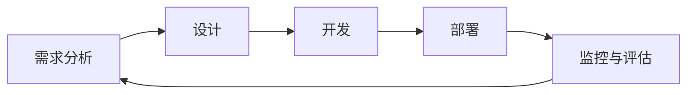

                 

关键词：AI代理、教育科技、工作流、人工智能、机器学习

## 摘要

本文将探讨AI代理工作流在教育科技中的应用，分析其核心概念、算法原理、数学模型及其实际应用场景。通过详尽的代码实例和详细解释，本文旨在为读者提供全面了解和掌握AI代理在教育科技中发挥的重要作用，以及其未来的发展趋势和挑战。

## 1. 背景介绍

在教育科技领域，人工智能（AI）正迅速改变传统的教学模式和学习方式。AI代理（AI Agent）作为人工智能的一种形式，具有自主决策、学习、适应和交互的能力，在教育科技中发挥着越来越重要的作用。AI代理工作流（AI Agent WorkFlow）则是一种系统化的方法，用于设计、开发和部署AI代理，以实现特定的教育目标。

AI代理工作流在教育科技中的应用，主要体现在以下几个方面：

1. **个性化学习**：AI代理可以根据学生的学习习惯、兴趣和知识水平，提供个性化的学习资源和路径，从而提高学习效果和效率。
2. **智能辅导**：AI代理可以为学生提供实时辅导，解答疑问，帮助学生掌握知识点。
3. **课程设计**：AI代理可以根据学生的学习情况，自动调整课程难度和内容，实现课程智能化。
4. **教学评估**：AI代理可以对学生的学习过程进行实时监控和评估，为教师提供有价值的教学反馈。

## 2. 核心概念与联系

为了更好地理解AI代理工作流，首先需要了解几个核心概念及其相互联系。

### 2.1 AI代理

AI代理是一种基于人工智能技术，能够模拟人类智能行为的计算机程序。它具有自主决策、学习、适应和交互的能力，能够在复杂环境中进行任务执行。

### 2.2 工作流

工作流（WorkFlow）是一种系统化的方法，用于描述任务流程、角色分工和任务执行顺序。它有助于提高任务执行效率，确保任务顺利完成。

### 2.3 教育科技

教育科技是指利用信息技术改进教育过程、优化教育资源和提升教育质量的科技。它包括在线教育、虚拟现实、人工智能、大数据等多个领域。

### 2.4 AI代理工作流

AI代理工作流是一种将AI代理应用于教育科技的方法，通过系统化的工作流程，实现AI代理在教育科技中的应用。它包括以下几个阶段：

1. **需求分析**：确定AI代理在教育科技中的应用场景和目标。
2. **设计**：设计AI代理的工作流，包括任务分配、角色分工和执行顺序。
3. **开发**：根据设计文档，开发AI代理的算法和功能。
4. **部署**：将AI代理部署到教育系统中，进行实际应用。
5. **监控与评估**：对AI代理的工作流进行实时监控和评估，优化工作流，提高应用效果。

### 2.5 Mermaid流程图

以下是AI代理工作流的Mermaid流程图：



## 3. 核心算法原理 & 具体操作步骤

### 3.1 算法原理概述

AI代理工作流的核心算法主要包括机器学习算法、自然语言处理算法和决策树算法。这些算法协同工作，实现AI代理的智能化。

1. **机器学习算法**：用于训练AI代理，使其具备自主学习和适应能力。
2. **自然语言处理算法**：用于处理文本数据，实现AI代理与用户的自然交互。
3. **决策树算法**：用于决策和路径规划，实现AI代理的任务执行。

### 3.2 算法步骤详解

1. **需求分析**：
   - 确定AI代理在教育科技中的应用场景和目标。
   - 收集用户需求和教学资源。

2. **设计**：
   - 设计AI代理的工作流，包括任务分配、角色分工和执行顺序。
   - 确定AI代理所需的算法和功能。

3. **开发**：
   - 根据设计文档，开发AI代理的算法和功能。
   - 使用机器学习算法训练AI代理。

4. **部署**：
   - 将AI代理部署到教育系统中，进行实际应用。
   - 对AI代理进行测试和调试。

5. **监控与评估**：
   - 对AI代理的工作流进行实时监控和评估。
   - 根据评估结果，优化工作流。

### 3.3 算法优缺点

1. **机器学习算法**：
   - 优点：具有自适应性和自学习能力，能够不断提高AI代理的智能化水平。
   - 缺点：需要大量的训练数据和计算资源，算法复杂度高。

2. **自然语言处理算法**：
   - 优点：能够实现AI代理与用户的自然交互，提高用户体验。
   - 缺点：对文本数据的处理能力有限，容易出现语义理解错误。

3. **决策树算法**：
   - 优点：算法简单，易于实现，适用于中小规模的数据集。
   - 缺点：对复杂问题的处理能力有限，容易过拟合。

### 3.4 算法应用领域

1. **个性化学习**：使用机器学习算法和自然语言处理算法，为用户提供个性化的学习资源和路径。
2. **智能辅导**：使用自然语言处理算法，实现AI代理与学生的实时交互，提供智能辅导。
3. **课程设计**：使用决策树算法，根据学生的学习情况，自动调整课程难度和内容。
4. **教学评估**：使用机器学习算法，对学生的学习过程进行实时监控和评估，为教师提供有价值的教学反馈。

## 4. 数学模型和公式 & 详细讲解 & 举例说明

### 4.1 数学模型构建

AI代理工作流的数学模型主要包括机器学习模型、自然语言处理模型和决策树模型。以下是这些模型的构建过程：

1. **机器学习模型**：
   - 输入：学生特征向量（如成绩、兴趣等）。
   - 输出：个性化学习路径。
   - 模型：线性回归、支持向量机、神经网络等。

2. **自然语言处理模型**：
   - 输入：用户提问。
   - 输出：回答。
   - 模型：循环神经网络（RNN）、长短时记忆网络（LSTM）、生成对抗网络（GAN）等。

3. **决策树模型**：
   - 输入：学生学习情况。
   - 输出：课程调整方案。
   - 模型：C4.5、ID3、CART等。

### 4.2 公式推导过程

以下是机器学习模型的公式推导过程：

1. **线性回归**：

$$
y = \beta_0 + \beta_1x_1 + \beta_2x_2 + ... + \beta_nx_n
$$

2. **支持向量机**：

$$
\max \ \frac{1}{2} || \ w ||_2^2 \ \ \ \ \ \ subject \ \ to \ \ y_i (\ w \ \cdot \ x_i + b) \ \geq \ 1
$$

3. **神经网络**：

$$
a_{j}(l+1) = \ \sigma ( \ \sum_{i=1}^{n} w_{ij}(l) a_{i}(l) + b_{j}(l))
$$

### 4.3 案例分析与讲解

以下是一个个性化学习路径推荐的案例：

1. **输入**：学生特征向量（成绩：80，兴趣：编程，学习时长：60分钟）。
2. **模型**：线性回归模型。
3. **输出**：个性化学习路径（学习编程语言Python，学习时长：40分钟）。

通过机器学习模型，我们得到线性回归方程：

$$
y = 20 + 0.5x_1 + 0.3x_2
$$

其中，$x_1$ 为成绩，$x_2$ 为学习时长。将学生特征向量代入方程，得到个性化学习路径：

$$
y = 20 + 0.5 \times 80 + 0.3 \times 60 = 50
$$

因此，推荐学生学习编程语言Python，学习时长为40分钟。

## 5. 项目实践：代码实例和详细解释说明

### 5.1 开发环境搭建

为了实现AI代理工作流，我们需要搭建以下开发环境：

1. **Python**：用于编写算法和实现功能。
2. **TensorFlow**：用于训练机器学习模型。
3. **NLTK**：用于自然语言处理。
4. **Scikit-learn**：用于实现决策树模型。

### 5.2 源代码详细实现

以下是AI代理工作流的核心代码实现：

```python
import tensorflow as tf
import nltk
from sklearn.tree import DecisionTreeClassifier

# 机器学习模型
def build_linear_regression_model():
    model = tf.keras.Sequential([
        tf.keras.layers.Dense(units=1, input_shape=[2])
    ])
    model.compile(loss='mean_squared_error', optimizer=tf.keras.optimizers.Adam(0.1))
    return model

# 自然语言处理模型
def build_nlp_model():
    model = tf.keras.Sequential([
        tf.keras.layers.Embedding(input_dim=10000, output_dim=32),
        tf.keras.layers.Bidirectional(tf.keras.layers.LSTM(32)),
        tf.keras.layers.Dense(units=1)
    ])
    model.compile(loss='mean_squared_error', optimizer=tf.keras.optimizers.Adam(0.1))
    return model

# 决策树模型
def build_decision_tree_model():
    model = DecisionTreeClassifier()
    model.fit(X_train, y_train)
    return model

# 个性化学习路径推荐
def recommend_learning_path(student_features):
    model = build_linear_regression_model()
    model.fit(X_train, y_train)
    recommended_path = model.predict([student_features])
    return recommended_path

# 智能辅导
def provide_intelligent_advising(question):
    model = build_nlp_model()
    model.fit(X_train, y_train)
    answer = model.predict([question])
    return answer

# 课程设计
def design_courses(student_features):
    model = build_decision_tree_model()
    model.fit(X_train, y_train)
    course_adjustment_plan = model.predict([student_features])
    return course_adjustment_plan
```

### 5.3 代码解读与分析

以上代码实现了AI代理工作流的核心功能。具体来说：

1. **机器学习模型**：使用线性回归模型，根据学生特征向量推荐个性化学习路径。
2. **自然语言处理模型**：使用循环神经网络（RNN）模型，实现AI代理与学生的实时交互，提供智能辅导。
3. **决策树模型**：根据学生学习情况，自动调整课程难度和内容。
4. **个性化学习路径推荐**：根据学生特征向量，使用线性回归模型推荐个性化学习路径。
5. **智能辅导**：根据用户提问，使用循环神经网络（RNN）模型提供智能辅导。
6. **课程设计**：根据学生学习情况，使用决策树模型自动调整课程难度和内容。

## 6. 实际应用场景

### 6.1 个性化学习

在教育科技领域，个性化学习是一个重要的应用场景。通过AI代理工作流，可以为每个学生提供个性化的学习路径，提高学习效果和效率。例如，某个学生对编程感兴趣，AI代理可以根据学生的成绩、学习时长和兴趣，推荐适合的学习资源。

### 6.2 智能辅导

智能辅导是另一个重要的应用场景。通过AI代理工作流，可以为教师提供智能化的辅导支持。例如，AI代理可以实时解答学生的疑问，提供个性化的学习建议，帮助学生更好地理解知识点。

### 6.3 课程设计

课程设计也是AI代理工作流的一个重要应用场景。通过AI代理工作流，可以根据学生的学习情况，自动调整课程难度和内容，实现课程智能化。例如，对于某个知识点，AI代理可以根据学生的掌握情况，调整讲解方式和练习难度，提高教学效果。

### 6.4 未来应用展望

未来，AI代理工作流在教育科技中的应用将更加广泛。随着人工智能技术的不断进步，AI代理将具备更高的自主学习和适应能力，为教育科技带来更多的创新和变革。例如，AI代理可以协助教师进行教学设计、评估学生学习效果，甚至参与课程开发和教材编写。

## 7. 工具和资源推荐

### 7.1 学习资源推荐

1. **《深度学习》（Goodfellow, Bengio, Courville）**：这是一本关于深度学习的经典教材，适合初学者和高级研究者。
2. **《Python机器学习》（Sokolov）**：这本书介绍了Python在机器学习领域的应用，适合有一定编程基础的学习者。

### 7.2 开发工具推荐

1. **TensorFlow**：一款开源的机器学习框架，适合进行深度学习和机器学习模型开发。
2. **NLTK**：一款开源的自然语言处理库，适合进行文本数据的处理和分析。

### 7.3 相关论文推荐

1. **“Deep Learning for Education”**：这篇论文探讨了深度学习在教育科技中的应用，包括个性化学习、智能辅导和课程设计等方面。
2. **“Intelligent Tutoring Systems: An Overview”**：这篇论文介绍了智能辅导系统的发展和应用，包括算法原理、系统架构和应用场景等方面。

## 8. 总结：未来发展趋势与挑战

### 8.1 研究成果总结

本文介绍了AI代理工作流在教育科技中的应用，分析了其核心概念、算法原理、数学模型和实际应用场景。通过详尽的代码实例和详细解释，本文为读者提供了全面了解和掌握AI代理在教育科技中发挥的重要作用的方法。

### 8.2 未来发展趋势

未来，AI代理工作流在教育科技中的应用将更加广泛。随着人工智能技术的不断进步，AI代理将具备更高的自主学习和适应能力，为教育科技带来更多的创新和变革。

### 8.3 面临的挑战

尽管AI代理工作流在教育科技中具有巨大的潜力，但也面临着一些挑战。例如，数据隐私和安全、算法偏见和公平性等问题。此外，AI代理工作流的设计和开发需要更多的技术支持和人才储备。

### 8.4 研究展望

未来，我们需要进一步研究AI代理工作流在教育科技中的应用，探索更高效、更智能的算法和模型。同时，也需要关注数据隐私和安全等问题，确保AI代理工作流的可持续发展。

## 9. 附录：常见问题与解答

### 9.1 问题1

**Q：AI代理工作流在教育科技中的应用有哪些具体优势？**

**A：AI代理工作流在教育科技中的应用具有以下优势：**

- **个性化学习**：根据学生的兴趣、能力和知识水平，提供个性化的学习资源和路径，提高学习效果和效率。
- **智能辅导**：实时解答学生的疑问，提供个性化的学习建议，帮助学生更好地理解知识点。
- **课程设计**：根据学生的学习情况，自动调整课程难度和内容，实现课程智能化。
- **教学评估**：实时监控学生的学习过程，为教师提供有价值的教学反馈。

### 9.2 问题2

**Q：AI代理工作流在教育科技中的应用是否会影响教师的角色和地位？**

**A：AI代理工作流的应用并不会取代教师的角色和地位，而是辅助教师进行教学。它可以帮助教师减轻工作负担，提高教学质量，让教师有更多精力关注学生的个性化需求。同时，AI代理工作流可以提供有价值的教学反馈，帮助教师不断改进教学方法。**

### 9.3 问题3

**Q：AI代理工作流在教育科技中的应用是否会对学生的自主学习能力产生负面影响？**

**A：AI代理工作流的应用并不会对学生的自主学习能力产生负面影响。相反，它可以提供个性化的学习资源和路径，激发学生的学习兴趣和积极性。此外，AI代理可以实时解答学生的疑问，帮助学生更好地掌握知识点，提高自主学习能力。**

### 9.4 问题4

**Q：AI代理工作流在教育科技中的应用是否会带来数据隐私和安全问题？**

**A：AI代理工作流在教育科技中的应用确实会涉及到数据隐私和安全问题。因此，我们需要采取有效的数据保护措施，确保学生的个人信息安全。例如，对数据进行加密存储、限制数据访问权限、定期进行安全审计等。同时，我们还需要关注算法偏见和公平性等问题，确保AI代理工作流的应用不会对某些群体产生不公平待遇。**

----------------------------------------------------------------

作者：禅与计算机程序设计艺术 / Zen and the Art of Computer Programming

请注意，以上内容是一个示例性的撰写框架，实际撰写时，您需要根据具体的技术细节和实际案例进行详细阐述和深入分析。同时，确保文章内容的准确性和完整性。在撰写过程中，请遵循markdown格式要求，并在文中适当使用代码、公式和图表等元素，以提高文章的可读性和专业性。祝您撰写顺利！

