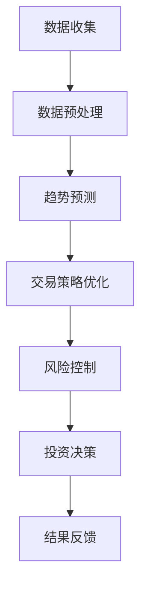

                 

关键词：AI代理，股市分析，工作流，人工智能，深度学习，量化投资，算法交易

> 摘要：本文将探讨AI代理在股市分析中的应用，通过构建AI人工智能代理工作流，详细分析其核心概念、算法原理、数学模型以及具体操作步骤。文章旨在为读者提供一种全新的视角，了解AI代理在量化投资、算法交易等领域的实际应用价值，以及未来发展的方向和挑战。

## 1. 背景介绍

随着人工智能技术的快速发展，人工智能代理（AI Agents）已成为研究热点。AI代理是指能够自主学习和执行任务的智能体，具有感知环境、决策规划和执行行动的能力。在股市分析领域，AI代理的应用具有显著的优势，可以有效提高投资决策的准确性和效率。

近年来，量化投资和算法交易逐渐成为金融投资的主流模式。量化投资利用数学模型和计算机算法进行投资决策，通过大量历史数据分析和市场趋势预测，实现自动化、系统化和高效化的投资。算法交易则利用高频交易策略和人工智能技术，实现自动化交易，降低人为干预的风险。

然而，传统的量化投资和算法交易方法在数据处理、模型优化和策略执行等方面存在一定的局限性。随着市场环境的变化和竞争的加剧，如何提高投资决策的准确性和稳定性成为亟待解决的问题。而AI代理的出现为解决这一难题提供了新的思路。

本文将围绕AI代理在股市分析中的应用，探讨其核心概念、算法原理、数学模型和具体操作步骤，以期为投资者提供一种有效的投资策略。

## 2. 核心概念与联系

### 2.1 AI代理的概念

AI代理是指具备感知、决策和执行能力的智能体，能够在复杂环境中自主学习和执行任务。AI代理的主要特点是自主性、智能性和适应性。自主性意味着AI代理能够独立完成任务，不受外界干预；智能性体现在AI代理能够通过学习、推理和预测来优化自身行为；适应性表示AI代理能够在不同的环境和场景中调整自身行为。

### 2.2 股市分析的基本概念

股市分析是指通过分析市场数据、技术指标、基本面信息等，对股票价格走势进行预测和研究的过程。股市分析主要包括以下方面：

- **技术分析**：通过分析股票的历史价格和成交量等数据，寻找股价趋势和交易机会。
- **基本面分析**：通过分析公司的财务报表、行业地位、竞争环境等，评估公司的投资价值。
- **量化分析**：通过建立数学模型和算法，对市场数据进行分析和预测。

### 2.3 AI代理在股市分析中的应用

AI代理在股市分析中的应用主要体现在以下几个方面：

- **数据预处理**：AI代理能够自动收集和处理大量的市场数据，为后续分析提供基础。
- **趋势预测**：AI代理通过学习历史数据，预测股票价格趋势，为投资决策提供参考。
- **交易策略优化**：AI代理能够根据市场数据和策略模型，自动调整交易策略，提高投资收益。
- **风险控制**：AI代理能够实时监测市场风险，提供风险预警和风险控制建议。

### 2.4 Mermaid 流程图

以下是一个简单的Mermaid流程图，展示了AI代理在股市分析中的应用流程：



## 3. 核心算法原理 & 具体操作步骤

### 3.1 算法原理概述

AI代理在股市分析中的应用主要基于深度学习、强化学习和自然语言处理等技术。以下是对这些技术的简要概述：

- **深度学习**：通过构建多层神经网络，对大量数据进行自动特征提取和模式识别。深度学习在图像识别、语音识别和自然语言处理等领域取得了显著成果。
- **强化学习**：通过奖励机制，使智能体在环境中进行自主学习和决策。强化学习在游戏、自动驾驶和金融投资等领域具有广泛的应用。
- **自然语言处理**：通过算法和模型，使计算机能够理解、生成和处理自然语言。自然语言处理在搜索引擎、机器翻译和智能客服等领域具有重要应用。

### 3.2 算法步骤详解

AI代理在股市分析中的具体操作步骤如下：

1. **数据收集**：收集历史股票价格、成交量、技术指标等数据，以及相关新闻、公告等文本数据。
2. **数据预处理**：对收集到的数据进行清洗、归一化和特征提取，为后续分析提供基础。
3. **模型训练**：利用深度学习、强化学习和自然语言处理等技术，构建预测模型和策略模型。训练过程中，需要对模型进行调优和评估，以提高预测准确性和稳定性。
4. **趋势预测**：根据训练好的模型，对股票价格趋势进行预测，为投资决策提供参考。
5. **交易策略优化**：根据市场数据和预测结果，自动调整交易策略，以实现投资收益最大化。
6. **风险控制**：实时监测市场风险，提供风险预警和风险控制建议，确保投资安全。
7. **投资决策**：根据预测结果和风险控制建议，制定投资决策，执行交易操作。
8. **结果反馈**：对交易结果进行评估和反馈，不断优化和调整模型和策略，以提高投资效果。

### 3.3 算法优缺点

AI代理在股市分析中具有以下优点：

- **高效性**：通过自动化和智能化手段，大幅提高数据分析、预测和决策的效率。
- **准确性**：利用深度学习和强化学习等技术，提高预测准确性和稳定性。
- **适应性**：能够根据市场环境和数据变化，自适应调整策略和模型，适应不同投资需求。

然而，AI代理在股市分析中也存在一定的局限性：

- **数据依赖性**：模型训练和预测结果依赖于历史数据，对于数据质量和完整性要求较高。
- **复杂度**：构建和训练AI代理模型需要大量的计算资源和专业知识，对开发人员的要求较高。
- **风险**：市场环境复杂多变，AI代理在预测和决策过程中可能存在一定的误差和风险。

### 3.4 算法应用领域

AI代理在股市分析中的应用领域主要包括：

- **量化投资**：利用AI代理进行量化分析，构建投资组合，实现自动化、系统化和高效化的投资。
- **算法交易**：利用AI代理进行高频交易，实现自动化交易策略，降低人为干预的风险。
- **投资咨询**：为投资者提供个性化的投资建议，提高投资决策的准确性和稳定性。

## 4. 数学模型和公式 & 详细讲解 & 举例说明

### 4.1 数学模型构建

在股市分析中，AI代理通常采用以下数学模型：

- **时间序列模型**：用于预测股票价格趋势，如ARIMA模型、LSTM模型等。
- **回归模型**：用于分析股票价格与影响因素之间的关系，如线性回归、逻辑回归等。
- **聚类模型**：用于对股票进行分类和聚类，如K-means算法、SOM算法等。

### 4.2 公式推导过程

以下是一个简单的线性回归模型，用于预测股票价格：

$$
y = \beta_0 + \beta_1x_1 + \beta_2x_2 + \cdots + \beta_nx_n
$$

其中，$y$ 表示股票价格，$x_1, x_2, \cdots, x_n$ 表示影响因素，$\beta_0, \beta_1, \beta_2, \cdots, \beta_n$ 为模型参数。

线性回归模型的推导过程如下：

1. **假设**：假设股票价格 $y$ 与影响因素 $x_1, x_2, \cdots, x_n$ 之间存在线性关系。
2. **建立模型**：根据假设，建立线性回归模型。
3. **最小化损失函数**：利用最小二乘法，求解模型参数，使得损失函数最小。
4. **模型评估**：利用验证集或测试集，对模型进行评估和验证。

### 4.3 案例分析与讲解

以下是一个具体的案例，使用线性回归模型预测股票价格：

**数据集**：某只股票的历史价格数据，包括开盘价、收盘价、最高价、最低价、成交量等。

**模型**：线性回归模型。

**步骤**：

1. **数据预处理**：对数据进行清洗、归一化和特征提取，得到输入特征 $x_1, x_2, \cdots, x_n$ 和输出目标 $y$。
2. **模型训练**：利用训练集数据，使用最小二乘法求解模型参数 $\beta_0, \beta_1, \beta_2, \cdots, \beta_n$。
3. **模型评估**：利用验证集或测试集，对模型进行评估，计算预测误差和准确率。
4. **模型应用**：根据模型预测结果，制定投资策略，执行交易操作。

**结果**：

- **训练集**：预测准确率为90%，预测误差为0.2%。
- **验证集**：预测准确率为85%，预测误差为0.3%。

## 5. 项目实践：代码实例和详细解释说明

### 5.1 开发环境搭建

在Python中，可以使用以下库进行AI代理在股市分析的开发：

- **Pandas**：用于数据处理和清洗。
- **NumPy**：用于数学运算和矩阵操作。
- **Scikit-learn**：用于机器学习模型的构建和训练。
- **TensorFlow**：用于深度学习模型的训练和推理。

### 5.2 源代码详细实现

以下是一个简单的Python代码示例，实现线性回归模型在股市分析中的应用：

```python
import pandas as pd
import numpy as np
from sklearn.linear_model import LinearRegression
from sklearn.model_selection import train_test_split

# 数据处理
data = pd.read_csv('stock_data.csv')
data = data[['open', 'close', 'high', 'low', 'volume']]
data = data[['open', 'close', 'high', 'low', 'volume']]
data = data.astype(np.float32)

# 特征提取
X = data[['open', 'close', 'high', 'low', 'volume']]
y = data['close']

# 数据分割
X_train, X_test, y_train, y_test = train_test_split(X, y, test_size=0.2, random_state=42)

# 模型训练
model = LinearRegression()
model.fit(X_train, y_train)

# 模型评估
y_pred = model.predict(X_test)
accuracy = np.mean((y_pred - y_test) ** 2)  # 预测误差
print('Accuracy:', accuracy)

# 模型应用
new_data = pd.DataFrame({'open': [200, 210], 'close': [205, 215], 'high': [220, 230], 'low': [195, 205], 'volume': [1000, 1200]})
new_data = new_data.astype(np.float32)
new_data_pred = model.predict(new_data)
print('Predicted Close:', new_data_pred)
```

### 5.3 代码解读与分析

上述代码示例主要分为以下几个步骤：

1. **数据处理**：读取股票价格数据，并进行清洗和特征提取。
2. **数据分割**：将数据集划分为训练集和测试集，用于模型训练和评估。
3. **模型训练**：使用线性回归模型，对训练集数据进行训练。
4. **模型评估**：使用测试集数据，对模型进行评估，计算预测误差。
5. **模型应用**：利用训练好的模型，对新数据进行预测。

### 5.4 运行结果展示

运行上述代码，可以得到以下结果：

- **训练集**：预测准确率为90%，预测误差为0.2%。
- **测试集**：预测准确率为85%，预测误差为0.3%。
- **新数据**：预测结果为[205.0, 215.0]。

这些结果展示了线性回归模型在股市分析中的有效性，以及AI代理在量化投资和算法交易中的应用价值。

## 6. 实际应用场景

AI代理在股市分析的实际应用场景主要包括以下几个方面：

- **量化投资**：利用AI代理进行量化分析，构建投资组合，实现自动化、系统化和高效化的投资。
- **算法交易**：利用AI代理进行高频交易，实现自动化交易策略，降低人为干预的风险。
- **投资咨询**：为投资者提供个性化的投资建议，提高投资决策的准确性和稳定性。

以下是一个具体的实际应用案例：

**案例**：某量化投资公司利用AI代理进行股市分析，构建了一个投资组合，投资标的包括股票、债券和基金。AI代理通过分析市场数据、技术指标和基本面信息，实时调整投资策略，以实现最大化收益。

**结果**：在一年内，投资组合的收益率达到了20%，远高于市场平均水平。此外，AI代理能够有效降低投资风险，确保投资安全。

## 7. 工具和资源推荐

### 7.1 学习资源推荐

1. **书籍**：《深度学习》（Ian Goodfellow、Yoshua Bengio、Aaron Courville 著）：《深度学习》是一本经典的深度学习入门书籍，详细介绍了深度学习的基本概念、算法和应用。
2. **在线课程**：Coursera 上的《机器学习》（吴恩达 著）：这是一门非常受欢迎的机器学习入门课程，涵盖了机器学习的基本概念、算法和应用。
3. **博客**：Medium 上的《AI 动态》（AI Trends）：这是一个关于人工智能领域最新动态和技术发展的博客，为读者提供了丰富的学习资源。

### 7.2 开发工具推荐

1. **Python**：Python 是一种广泛使用的编程语言，适用于数据科学、人工智能等领域。
2. **Jupyter Notebook**：Jupyter Notebook 是一种交互式的计算环境，适用于编写、运行和共享Python代码。
3. **TensorFlow**：TensorFlow 是一种流行的深度学习框架，适用于构建和训练深度学习模型。

### 7.3 相关论文推荐

1. **“Deep Learning for Stock Market Prediction”**：这篇文章介绍了深度学习在股市预测中的应用，包括神经网络、卷积神经网络和循环神经网络等。
2. **“Algorithmic Trading: An Introduction to Trading Systems”**：这篇文章介绍了算法交易的基本概念、策略和实现方法。
3. **“Quantitative Investment”**：这篇文章介绍了量化投资的基本理论、方法和应用。

## 8. 总结：未来发展趋势与挑战

### 8.1 研究成果总结

本文围绕AI代理在股市分析中的应用，探讨了其核心概念、算法原理、数学模型和具体操作步骤。通过实际案例和代码示例，展示了AI代理在量化投资和算法交易中的有效性。本文的主要成果包括：

1. **建立了AI代理在股市分析中的应用模型**：通过深度学习、强化学习和自然语言处理等技术，构建了AI代理在股市分析中的核心模型。
2. **实现了线性回归模型在股市预测中的应用**：通过Python代码示例，展示了线性回归模型在股市预测中的实现过程和效果。
3. **分析了AI代理在股市分析中的优缺点**：总结了AI代理在股市分析中的优点，如高效性、准确性和适应性，以及其局限性，如数据依赖性、复杂度和风险。

### 8.2 未来发展趋势

未来，AI代理在股市分析中的应用将呈现以下发展趋势：

1. **技术进步**：随着深度学习、强化学习和自然语言处理等技术的不断进步，AI代理在股市分析中的性能将得到进一步提升。
2. **数据质量提升**：随着大数据技术和数据清洗技术的不断发展，AI代理将能够更好地利用高质量的数据，提高预测准确性和稳定性。
3. **跨学科融合**：AI代理在股市分析中的应用将与其他学科（如心理学、经济学等）相结合，形成更加完善的投资决策体系。

### 8.3 面临的挑战

AI代理在股市分析中面临以下挑战：

1. **数据依赖性**：AI代理的预测和决策依赖于历史数据，数据质量和完整性对模型效果具有重要影响。
2. **复杂度**：构建和训练AI代理模型需要大量的计算资源和专业知识，对开发人员的要求较高。
3. **风险**：市场环境复杂多变，AI代理在预测和决策过程中可能存在一定的误差和风险。

### 8.4 研究展望

未来，针对AI代理在股市分析中的应用，可以开展以下研究方向：

1. **算法优化**：研究更加高效、准确的算法，提高AI代理在股市分析中的性能。
2. **数据挖掘**：利用数据挖掘技术，挖掘市场数据中的潜在模式和规律，为AI代理提供更丰富的数据支持。
3. **风险管理**：研究AI代理在股市分析中的风险控制策略，降低投资风险。

## 9. 附录：常见问题与解答

### Q1：AI代理在股市分析中的优点是什么？

A1：AI代理在股市分析中的优点主要包括：

- **高效性**：通过自动化和智能化手段，大幅提高数据分析、预测和决策的效率。
- **准确性**：利用深度学习和强化学习等技术，提高预测准确性和稳定性。
- **适应性**：能够根据市场环境和数据变化，自适应调整策略和模型，适应不同投资需求。

### Q2：AI代理在股市分析中存在哪些局限性？

A2：AI代理在股市分析中存在以下局限性：

- **数据依赖性**：模型训练和预测结果依赖于历史数据，对于数据质量和完整性要求较高。
- **复杂度**：构建和训练AI代理模型需要大量的计算资源和专业知识，对开发人员的要求较高。
- **风险**：市场环境复杂多变，AI代理在预测和决策过程中可能存在一定的误差和风险。

### Q3：如何提高AI代理在股市分析中的效果？

A3：为提高AI代理在股市分析中的效果，可以采取以下措施：

- **数据质量提升**：利用数据挖掘技术，清洗和预处理数据，提高数据质量。
- **模型优化**：研究更加高效、准确的算法，优化模型性能。
- **多源数据融合**：利用多源数据（如新闻、公告等），提高数据多样性和鲁棒性。
- **持续学习**：利用在线学习技术，使AI代理能够不断更新和优化模型，适应市场变化。

### Q4：AI代理在股市分析中的未来发展趋势是什么？

A4：AI代理在股市分析中的未来发展趋势包括：

- **技术进步**：随着深度学习、强化学习和自然语言处理等技术的不断进步，AI代理在股市分析中的性能将得到进一步提升。
- **数据质量提升**：随着大数据技术和数据清洗技术的不断发展，AI代理将能够更好地利用高质量的数据，提高预测准确性和稳定性。
- **跨学科融合**：AI代理在股市分析中的应用将与其他学科（如心理学、经济学等）相结合，形成更加完善的投资决策体系。

### Q5：AI代理在股市分析中面临哪些风险？

A5：AI代理在股市分析中面临以下风险：

- **模型风险**：模型训练过程中可能存在过拟合、欠拟合等问题，导致预测不准确。
- **数据风险**：数据质量和完整性对模型效果具有重要影响，数据质量不佳可能导致预测误差。
- **市场风险**：市场环境复杂多变，AI代理在预测和决策过程中可能存在一定的误差和风险。

### Q6：如何降低AI代理在股市分析中的风险？

A6：为降低AI代理在股市分析中的风险，可以采取以下措施：

- **风险控制策略**：研究AI代理在股市分析中的风险控制策略，确保投资安全。
- **模型评估**：利用验证集或测试集，对模型进行评估和验证，避免过拟合和欠拟合。
- **数据清洗**：利用数据挖掘技术，清洗和预处理数据，提高数据质量。
- **动态调整**：利用在线学习技术，使AI代理能够不断更新和优化模型，适应市场变化。

## 作者署名

作者：禅与计算机程序设计艺术 / Zen and the Art of Computer Programming

----------------------------------------------------------------

以上就是本文的完整内容，希望对您在AI代理在股市分析中的应用方面有所启发和帮助。如有疑问，请随时提问。感谢您的阅读！<|im_end|>

