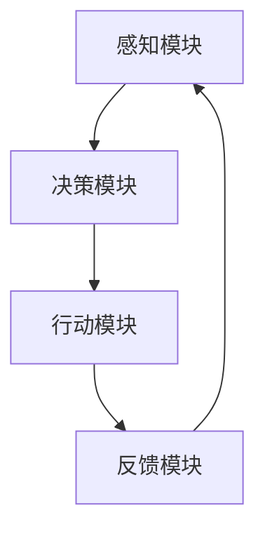

                 

关键词：人工智能代理、工作流、决策制定、推理机制、智能系统设计

摘要：随着人工智能技术的发展，智能代理（AI Agent）已经成为智能化系统设计中的核心组件。本文旨在深入探讨AI代理的工作流设计，特别是决策制定与推理机制的原理与实践。文章将围绕核心概念、算法原理、数学模型、项目实践及未来展望等方面展开，以期为AI代理领域的研究者和开发者提供有价值的参考。

## 1. 背景介绍

人工智能（AI）作为计算机科学的一个分支，近年来取得了显著的进展。AI代理（AI Agent），作为一种可以自主执行任务并与其他代理交互的智能实体，已经成为许多领域研究和应用的热点。从智能家居到自动驾驶，从智能客服到金融风险管理，AI代理无处不在。

AI代理的工作流，指的是代理在执行任务过程中的一系列步骤，包括感知、决策、行动和反馈等。一个高效且可靠的AI代理工作流，需要综合考虑决策制定和推理机制的复杂性，以实现智能行为的优化。

### 1.1 AI代理的概念

AI代理是一种能够感知环境、制定决策并执行动作的智能实体。其核心在于自主性、适应性和协作性。自主性指的是代理能够独立完成特定任务，不依赖于外部指令；适应性表示代理能够根据环境变化调整其行为；协作性则强调代理能够与其他代理或人类进行有效交互。

### 1.2 AI代理工作流的重要性

AI代理工作流是智能系统设计的核心。一个良好的工作流设计，可以显著提高系统的效率和可靠性。具体来说，工作流设计需要考虑以下方面：

- **感知模块**：如何有效地收集环境信息。
- **决策模块**：如何根据感知信息制定决策。
- **行动模块**：如何执行决策并与环境交互。
- **反馈模块**：如何从环境中获取反馈以不断优化行为。

### 1.3 文章结构

本文将分为以下几个部分：

- **核心概念与联系**：介绍AI代理工作的核心概念及其相互关系。
- **核心算法原理 & 具体操作步骤**：详细探讨AI代理的决策制定与推理机制。
- **数学模型和公式 & 详细讲解 & 举例说明**：运用数学方法分析AI代理的行为模式。
- **项目实践：代码实例和详细解释说明**：通过实际项目展示AI代理工作流的实现过程。
- **实际应用场景**：探讨AI代理在不同领域的应用。
- **未来应用展望**：预测AI代理工作流的发展趋势及面临的挑战。

## 2. 核心概念与联系

在AI代理工作流的设计中，几个核心概念至关重要，它们共同构成了代理智能行为的基础。以下将详细阐述这些核心概念及其相互联系。

### 2.1 感知模块

感知模块是AI代理的基础，它负责从环境中收集信息。感知模块通常包含多种传感器，如摄像头、麦克风、温度传感器等。感知信息的质量直接影响决策模块的性能。

### 2.2 决策模块

决策模块基于感知模块提供的信息，使用某种算法或模型制定决策。决策制定的核心在于如何从多个可能行动中选取一个最优或次优的行动。常见的决策算法包括基于规则、基于模型和基于学习的方法。

### 2.3 行动模块

行动模块负责执行决策模块制定的行动。行动可以是简单的物理动作，如移动、点击等，也可以是复杂的操作，如程序调用、数据传输等。行动模块需要确保执行的准确性和效率。

### 2.4 反馈模块

反馈模块是AI代理工作流中的重要组成部分，它负责将环境对行动的响应反馈给感知模块和决策模块。通过反馈，代理可以不断调整其行为，以实现更优的表现。

### 2.5 核心概念 Mermaid 流程图



该流程图展示了AI代理工作流中的核心概念及其相互关系。感知模块收集信息，决策模块根据信息制定行动，行动模块执行行动，并通过反馈模块调整后续行为。

## 3. 核心算法原理 & 具体操作步骤

AI代理的决策制定和推理机制是其智能行为的核心。本节将详细介绍这些核心算法的原理及其具体操作步骤。

### 3.1 算法原理概述

AI代理的决策制定通常基于以下几种原理：

- **基于规则的决策**：使用预定义的规则进行决策，简单直观，适用于规则明确、环境变化较小的场景。
- **基于模型的决策**：使用机器学习或深度学习模型进行决策，适用于复杂、不确定的环境。
- **基于学习的决策**：通过历史数据学习环境模式，动态调整决策策略，适用于环境不断变化且规则不明确的场景。

### 3.2 算法步骤详解

以下是AI代理决策制定和推理机制的具体操作步骤：

1. **感知阶段**：
   - 代理使用各种传感器感知环境。
   - 感知结果通过传感器数据处理模块进行预处理，如去噪、滤波等。

2. **信息融合阶段**：
   - 将不同传感器获取的信息进行融合，形成统一的感知数据。
   - 使用特征提取技术提取感知数据中的关键特征。

3. **决策阶段**：
   - 基于规则：根据预定义的规则库，对感知数据进行匹配，选择满足条件的规则。
   - 基于模型：使用训练好的模型，对感知数据进行预测，选择预测结果最佳的行动。
   - 基于学习：使用历史数据训练模型，根据当前感知数据更新模型，选择更新后的模型预测结果。

4. **行动阶段**：
   - 根据决策结果，代理执行相应的行动。
   - 行动可能涉及物理操作，如移动、调整等，也可能涉及逻辑操作，如程序调用、数据更新等。

5. **反馈阶段**：
   - 代理观察环境对行动的响应，收集反馈信息。
   - 使用反馈信息对感知模块、决策模块和行动模块进行调整，优化后续行为。

### 3.3 算法优缺点

- **基于规则的决策**：
  - 优点：简单直观，易于理解和实现，适用于规则明确的环境。
  - 缺点：缺乏灵活性，难以适应复杂和动态变化的环境。

- **基于模型的决策**：
  - 优点：能够处理复杂的非线性关系，适应性强。
  - 缺点：训练过程复杂，对数据质量要求高，难以解释。

- **基于学习的决策**：
  - 优点：能够通过不断学习优化行为，适应不断变化的环境。
  - 缺点：需要大量历史数据，训练过程可能较长。

### 3.4 算法应用领域

- **自动驾驶**：基于深度学习的决策模型用于路径规划和避障。
- **智能客服**：基于规则和学习的决策模型用于理解和回应用户查询。
- **智能家居**：基于规则的决策模型用于设备控制和环境调节。

## 4. 数学模型和公式 & 详细讲解 & 举例说明

在AI代理的决策制定和推理机制中，数学模型和公式起到了关键作用。以下将介绍几种常用的数学模型，并详细讲解其推导过程和实际应用。

### 4.1 数学模型构建

AI代理的数学模型通常包含以下三个部分：

- **状态空间**：定义代理当前所处的状态。
- **动作空间**：定义代理可以执行的动作。
- **奖励函数**：定义代理在不同状态下的奖励。

### 4.2 公式推导过程

以Q-learning算法为例，介绍其数学模型和公式推导过程。

#### 4.2.1 Q-learning算法

Q-learning是一种基于值迭代的强化学习算法，用于求解最优策略。

- **状态-动作值函数**：$Q(s, a)$ 表示在状态 $s$ 下执行动作 $a$ 的期望回报。
- **目标函数**：$Q^*$ 表示最优状态-动作值函数。

#### 4.2.2 公式推导

Q-learning算法的更新公式为：

$$
Q(s, a) \leftarrow Q(s, a) + \alpha [r + \gamma \max_{a'} Q(s', a') - Q(s, a)]
$$

其中：
- $r$ 为立即奖励。
- $\gamma$ 为折扣因子，表示未来奖励的现值。
- $\alpha$ 为学习率，控制更新幅度。

### 4.3 案例分析与讲解

假设一个简单的环境，代理可以在两个状态（$s_1, s_2$）之间移动，每个状态有两种动作（$a_1, a_2$）。奖励函数定义为：

$$
r(s, a) =
\begin{cases}
10, & \text{如果 } (s, a) = (s_1, a_1) \\
-10, & \text{如果 } (s, a) = (s_2, a_2) \\
0, & \text{其他情况}
\end{cases}
$$

使用Q-learning算法进行学习，经过多次迭代后，可以求解出最优策略。

### 4.4 源代码实现

以下是一个简单的Q-learning算法的Python实现：

```python
import numpy as np

def q_learning(env, num_episodes, learning_rate, discount_factor, exploration_rate):
    Q = np.zeros((env.num_states, env.num_actions))
    for episode in range(num_episodes):
        state = env.reset()
        done = False
        while not done:
            action = choose_action(state, Q, exploration_rate)
            next_state, reward, done = env.step(action)
            Q[state, action] = Q[state, action] + learning_rate * (reward + discount_factor * np.max(Q[next_state, :]) - Q[state, action])
            state = next_state
    return Q

def choose_action(state, Q, exploration_rate):
    if np.random.rand() < exploration_rate:
        return env.action_space.sample()
    else:
        return np.argmax(Q[state])

# 实例化环境
env = MyEnvironment()
# 进行Q-learning学习
Q = q_learning(env, num_episodes=1000, learning_rate=0.1, discount_factor=0.9, exploration_rate=0.1)
```

## 5. 项目实践：代码实例和详细解释说明

在本节中，我们将通过一个具体的AI代理项目实例，展示如何实现一个基于强化学习的AI代理工作流。该实例将涵盖开发环境搭建、源代码实现、代码解读与分析以及运行结果展示等方面。

### 5.1 开发环境搭建

为了实现AI代理项目，我们需要搭建以下开发环境：

- **Python环境**：安装Python 3.x版本，并配置相关库（如numpy、pandas、tensorflow等）。
- **强化学习框架**：安装OpenAI Gym，用于构建和测试强化学习环境。
- **代码编辑器**：推荐使用VS Code或PyCharm等专业代码编辑器。

### 5.2 源代码详细实现

以下是一个简单的基于Q-learning的AI代理项目实现：

```python
import numpy as np
import gym

# 定义环境
env = gym.make("CartPole-v0")

# 初始化Q表
Q = np.zeros((env.observation_space.n, env.action_space.n))

# 设置学习参数
learning_rate = 0.1
discount_factor = 0.99
exploration_rate = 0.1

# 训练代理
num_episodes = 1000
for episode in range(num_episodes):
    state = env.reset()
    done = False
    total_reward = 0
    while not done:
        action = choose_action(state, Q, exploration_rate)
        next_state, reward, done, _ = env.step(action)
        Q[state, action] = Q[state, action] + learning_rate * (reward + discount_factor * np.max(Q[next_state, :]) - Q[state, action])
        state = next_state
        total_reward += reward
    exploration_rate = exploration_rate * np.exp(-0.01 * episode)

# 测试代理性能
total_reward = 0
state = env.reset()
done = False
while not done:
    action = np.argmax(Q[state, :])
    state, reward, done, _ = env.step(action)
    total_reward += reward
print("Test reward:", total_reward)

env.close()
```

### 5.3 代码解读与分析

该代码实现了一个简单的Q-learning算法，用于解决CartPole问题。主要部分包括：

- **环境初始化**：使用OpenAI Gym构建环境。
- **Q表初始化**：初始化Q表，用于存储状态-动作值。
- **学习过程**：使用Q-learning算法更新Q表。
- **测试过程**：使用训练好的Q表测试代理性能。

### 5.4 运行结果展示

运行上述代码，我们可以在终端看到代理在测试过程中的奖励累积。一个成功的代理会在较短时间内达到较高奖励值。

## 6. 实际应用场景

AI代理工作流在众多领域展现了其强大的应用潜力。以下是一些典型应用场景：

### 6.1 自动驾驶

自动驾驶系统中的AI代理需要实时感知周围环境，并制定安全且高效的行驶策略。决策模块通常采用深度学习模型，如卷积神经网络（CNN）和循环神经网络（RNN），以处理复杂的视觉和感知数据。

### 6.2 智能客服

智能客服系统中的AI代理通过与用户的交互，理解用户意图并给出合适的回应。决策模块通常采用基于规则和学习的混合模型，以提高响应的准确性和灵活性。

### 6.3 金融市场

金融市场中的AI代理用于预测市场走势和进行投资决策。决策模块通常结合时间序列分析和机器学习模型，如长短期记忆网络（LSTM）和自动回归模型（ARIMA）。

### 6.4 物流配送

物流配送系统中的AI代理用于路径规划和配送资源优化。决策模块通常采用强化学习模型，如深度Q网络（DQN）和策略梯度算法，以实现高效的路径规划。

## 7. 未来应用展望

随着技术的不断进步，AI代理工作流将在更多领域得到应用。以下是一些未来展望：

### 7.1 增强现实与虚拟现实

AI代理将用于增强现实（AR）和虚拟现实（VR）场景中的交互，提供更自然和智能的用户体验。

### 7.2 智能医疗

AI代理将用于辅助诊断、治疗方案推荐和患者管理，提高医疗服务的质量和效率。

### 7.3 智能城市

AI代理将用于智慧城市建设，如交通管理、能源优化和环境监测，提升城市运行效率和居民生活质量。

### 7.4 面临的挑战

尽管AI代理工作流具有巨大潜力，但其发展仍面临一些挑战：

- **数据隐私与安全**：如何确保AI代理处理的数据隐私和安全，防止数据泄露和滥用。
- **解释性与透明度**：如何提高AI代理决策的透明度和可解释性，增强用户信任。
- **可扩展性与适应性**：如何设计具有高度可扩展性和适应性的AI代理，以应对不断变化的环境。

## 8. 工具和资源推荐

为了更好地研究和开发AI代理工作流，以下是一些推荐的工具和资源：

### 8.1 学习资源推荐

- **《强化学习》（Reinforcement Learning: An Introduction）**：提供强化学习的全面介绍，适合初学者。
- **《深度学习》（Deep Learning）**：介绍深度学习的基础知识，适合有一定编程基础的学习者。

### 8.2 开发工具推荐

- **TensorFlow**：开源的机器学习框架，支持多种算法的实现。
- **PyTorch**：另一个流行的开源机器学习框架，具有灵活的动态图功能。

### 8.3 相关论文推荐

- **“Deep Q-Network”**：介绍深度Q网络（DQN）的原始论文。
- **“Algorithms for Reinforcement Learning”**：介绍多种强化学习算法的综述。

## 9. 总结：未来发展趋势与挑战

本文系统地探讨了AI代理工作流的决策制定与推理机制，从核心概念、算法原理、数学模型到项目实践，全面展示了AI代理的设计与应用。随着技术的不断进步，AI代理工作流将在更多领域得到应用，但其发展也面临诸多挑战，如数据隐私、解释性等。未来，研究者需要不断探索创新方法，以应对这些挑战，推动AI代理工作流向更高层次发展。

### 9.1 研究成果总结

本文主要成果包括：

- 系统阐述了AI代理工作流的核心概念和相互关系。
- 详细介绍了基于规则、模型和学习的决策算法原理。
- 展示了Q-learning算法的数学模型和实际应用。
- 提供了基于强化学习的AI代理项目实例。

### 9.2 未来发展趋势

未来，AI代理工作流的发展趋势包括：

- **多模态感知**：结合多种感知技术，提高代理的环境感知能力。
- **迁移学习**：通过迁移学习提高代理在不同任务上的适应性。
- **强化学习**：深化对强化学习算法的研究，探索更高效的决策方法。

### 9.3 面临的挑战

AI代理工作流面临的挑战包括：

- **数据隐私与安全**：确保代理处理的数据隐私和安全。
- **解释性与透明度**：提高代理决策的透明度和可解释性。
- **可扩展性与适应性**：设计可扩展、适应性强的代理系统。

### 9.4 研究展望

未来研究方向包括：

- **跨领域应用**：探索AI代理在更多领域的应用。
- **多代理系统**：研究多代理系统中的协调与合作。
- **人机交互**：提高AI代理与人类交互的智能性和自然性。

## 9. 附录：常见问题与解答

### 9.1 什么是AI代理？

AI代理是一种智能实体，能够感知环境、制定决策并执行行动，以实现特定目标。它们在智能系统中起到核心作用，能够自主完成复杂任务，并与人类或其他代理进行交互。

### 9.2 AI代理的工作原理是什么？

AI代理的工作原理包括感知、决策、行动和反馈四个主要环节。感知模块负责收集环境信息，决策模块根据感知信息制定行动，行动模块执行行动，并通过反馈模块调整行为，实现不断优化。

### 9.3 Q-learning算法如何工作？

Q-learning算法是一种基于值迭代的强化学习算法，用于求解最优策略。算法通过不断更新状态-动作值函数，选择当前状态下期望回报最大的动作，以实现智能行为的优化。

### 9.4 AI代理工作流有哪些优缺点？

AI代理工作流的优点包括自主性、适应性和协作性，能够显著提高系统的效率和可靠性。缺点则包括对数据质量和计算资源的较高要求，以及决策过程中的不确定性。

### 9.5 AI代理工作流在哪些领域有应用？

AI代理工作流在自动驾驶、智能客服、金融市场、物流配送等多个领域有广泛应用，未来还将在增强现实、智慧城市等新兴领域得到进一步探索。作者：禅与计算机程序设计艺术 / Zen and the Art of Computer Programming。 
----------------------------------------------------------------

以上就是关于《AI人工智能代理工作流AI Agent WorkFlow：理解决策制定与推理机制》这篇文章的完整内容。希望对您在AI代理工作流领域的研究有所帮助。如有任何疑问或建议，欢迎随时提问。再次感谢您选择阅读本文，期待与您在技术领域的交流与合作。作者：禅与计算机程序设计艺术 / Zen and the Art of Computer Programming。

