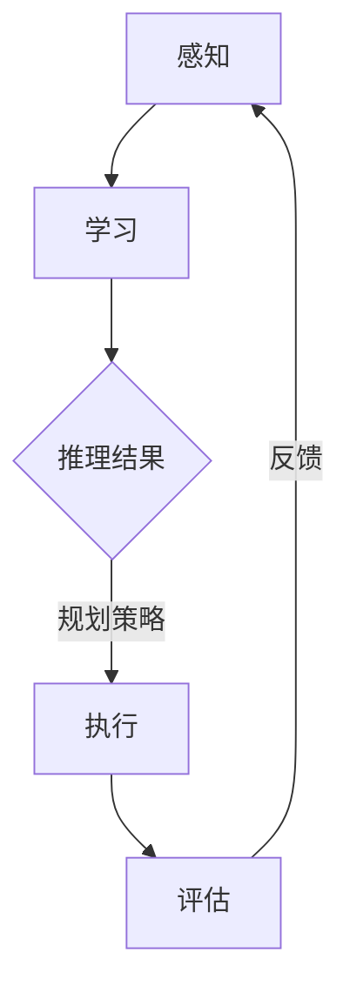

                 

关键词：人工智能代理，工作流，自主行为，规划策略，AI应用领域

> 摘要：本文深入探讨了AI人工智能代理工作流（AI Agent WorkFlow）的概念、核心原理、算法、数学模型及其实际应用。通过详细的案例分析，展示了如何实现人工智能代理的自主行为与规划策略，并对其未来的发展趋势与挑战进行了展望。

## 1. 背景介绍

随着人工智能技术的飞速发展，越来越多的应用场景开始引入人工智能代理（AI Agent）来提高效率、降低成本。人工智能代理是具有自主行为能力的智能体，能够在复杂环境中进行决策和执行任务。它们可以模拟人类智能，具备感知、学习、推理、规划等能力，从而实现自动化操作。

工作流（WorkFlow）是指一组任务、活动或操作，按照一定的逻辑顺序和规则进行的执行过程。在人工智能代理的背景下，工作流可以看作是一系列自主行为和决策的集合，通过规划策略实现高效的任务执行。

本文旨在探讨人工智能代理工作流的核心原理、算法和实际应用，以期为相关领域的研究和实践提供参考。

## 2. 核心概念与联系

### 2.1 人工智能代理

人工智能代理是一种具有自主行为能力的智能体，可以模拟人类智能，实现感知、学习、推理、规划等任务。其核心特点是具备自主决策和执行任务的能力，能够在复杂环境中适应和应对变化。

### 2.2  工作流

工作流是一组按照一定逻辑顺序和规则进行的任务、活动或操作。在人工智能代理的背景下，工作流可以看作是一系列自主行为和决策的集合，通过规划策略实现高效的任务执行。

### 2.3 自主行为与规划策略

自主行为是指人工智能代理在执行任务时，根据环境信息和自身知识进行决策和操作的过程。规划策略则是指为实现特定目标，通过一系列决策步骤和执行计划来指导代理行为的策略。

### 2.4 Mermaid 流程图

以下是人工智能代理工作流的核心概念和联系 Mermaid 流程图：



## 3. 核心算法原理 & 具体操作步骤

### 3.1 算法原理概述

人工智能代理工作流的核心算法包括感知、学习、推理、规划和执行。感知是指从环境中获取信息，学习是指基于感知信息进行知识积累，推理是指根据已有知识进行决策，规划是指制定执行计划，执行是指根据规划执行任务。整个过程形成一个闭环，通过反馈不断优化代理行为。

### 3.2 算法步骤详解

#### 3.2.1 感知

感知是指从环境中获取信息的过程。人工智能代理通过传感器或其他数据源获取环境状态，如图像、声音、温度、湿度等。

#### 3.2.2 学习

学习是指基于感知信息进行知识积累的过程。代理通过机器学习算法，如神经网络、决策树等，对感知到的信息进行处理和分析，提取特征和模式。

#### 3.2.3 推理

推理是指根据已有知识进行决策的过程。代理利用已有知识库和推理算法，如逻辑推理、贝叶斯推理等，对当前环境状态进行推理和预测。

#### 3.2.4 规划

规划是指制定执行计划的过程。代理根据推理结果和任务目标，制定一系列执行计划，如路径规划、任务分配等。

#### 3.2.5 执行

执行是指根据规划执行任务的过程。代理按照执行计划，执行具体任务，如移动、操作等。

#### 3.2.6 评估

评估是指对执行结果进行评价的过程。代理根据任务目标和执行结果，评估任务完成情况，如准确率、效率等。

#### 3.2.7 反馈

反馈是指根据评估结果调整行为的过程。代理根据评估结果，调整感知、学习、推理、规划和执行等过程，以优化代理行为。

### 3.3 算法优缺点

#### 优点

1. 高效：人工智能代理工作流通过自动化、自主化操作，提高了任务执行效率。
2. 自适应：代理能够根据环境变化和任务需求，自适应调整行为。
3. 智能化：代理具备学习、推理、规划等智能能力，能够处理复杂任务。

#### 缺点

1. 数据依赖：代理的性能依赖于感知数据的准确性和丰富性。
2. 算法复杂：算法实现和优化相对复杂，需要大量的计算资源和时间。
3. 安全性：代理在执行任务过程中可能存在安全隐患。

### 3.4 算法应用领域

人工智能代理工作流在许多领域具有广泛应用，如自动驾驶、智能家居、医疗诊断、金融风控等。

## 4. 数学模型和公式 & 详细讲解 & 举例说明

### 4.1 数学模型构建

人工智能代理工作流中的数学模型主要包括感知模型、学习模型、推理模型、规划模型和评估模型。

#### 4.1.1 感知模型

感知模型用于描述代理从环境中获取信息的过程。常用的感知模型包括传感器模型和图像处理模型。

传感器模型：
$$
S(t) = f(E(t))
$$
其中，$S(t)$表示感知到的环境状态，$E(t)$表示环境中的传感器数据，$f$表示感知函数。

图像处理模型：
$$
I(t) = g(E(t), \theta)
$$
其中，$I(t)$表示处理后的图像，$E(t)$表示原始图像数据，$\theta$表示图像处理参数。

#### 4.1.2 学习模型

学习模型用于描述代理根据感知信息进行知识积累的过程。常用的学习模型包括神经网络模型、决策树模型等。

神经网络模型：
$$
Y(t) = \sigma(W \cdot X(t) + b)
$$
其中，$Y(t)$表示输出结果，$X(t)$表示输入特征，$W$表示权重矩阵，$b$表示偏置项，$\sigma$表示激活函数。

决策树模型：
$$
C_j = \arg\max_j \sum_{i=1}^n L(y_i, c_j)
$$
其中，$C_j$表示最优决策类别，$L$表示损失函数，$y_i$表示实际类别，$c_j$表示预测类别。

#### 4.1.3 推理模型

推理模型用于描述代理根据已有知识进行决策的过程。常用的推理模型包括逻辑推理模型、贝叶斯推理模型等。

逻辑推理模型：
$$
\phi = \{P(A), P(B|A), P(C|B)\}
$$
其中，$\phi$表示逻辑推理规则集，$P(A)$表示事件$A$的概率，$P(B|A)$表示事件$B$在事件$A$发生的条件下的概率，$P(C|B)$表示事件$C$在事件$B$发生的条件下的概率。

贝叶斯推理模型：
$$
P(H|E) = \frac{P(E|H) \cdot P(H)}{P(E)}
$$
其中，$P(H|E)$表示在证据$E$出现的情况下，假设$H$的概率，$P(E|H)$表示在假设$H$成立的情况下，证据$E$的概率，$P(H)$表示假设$H$的概率，$P(E)$表示证据$E$的概率。

#### 4.1.4 规划模型

规划模型用于描述代理制定执行计划的过程。常用的规划模型包括路径规划模型、任务分配模型等。

路径规划模型：
$$
C = \arg\min_{c} \sum_{i=1}^n d(i, c)
$$
其中，$C$表示最优路径，$c$表示候选路径，$d(i, c)$表示从节点$i$到路径$c$的距离。

任务分配模型：
$$
T = \arg\min_{t} \sum_{i=1}^n \sum_{j=1}^m w_{ij} \cdot t_{ij}
$$
其中，$T$表示最优任务分配方案，$t_{ij}$表示任务$i$分配给代理$j$的概率，$w_{ij}$表示任务$i$与代理$j$的权重。

#### 4.1.5 评估模型

评估模型用于描述代理对执行结果进行评价的过程。常用的评估模型包括准确率模型、效率模型等。

准确率模型：
$$
\text{Accuracy} = \frac{\text{Correct}}{\text{Total}}
$$
其中，$\text{Accuracy}$表示准确率，$\text{Correct}$表示正确预测的数量，$\text{Total}$表示总预测数量。

效率模型：
$$
\text{Efficiency} = \frac{\text{Work completed}}{\text{Time elapsed}}
$$
其中，$\text{Efficiency}$表示效率，$\text{Work completed}$表示完成的工作量，$\text{Time elapsed}$表示花费的时间。

### 4.2 公式推导过程

以下是人工智能代理工作流中部分公式的推导过程。

#### 4.2.1 感知模型推导

传感器模型：
$$
S(t) = f(E(t))
$$
其中，$f$为非线性感知函数，如神经网络、Sigmoid函数等。

假设传感器数据$E(t)$服从正态分布：
$$
E(t) \sim N(\mu, \sigma^2)
$$
则感知到的环境状态$S(t)$也服从正态分布：
$$
S(t) \sim N(f(\mu), f'(\mu) \cdot \sigma^2)
$$
其中，$f'$为$f$的导数。

#### 4.2.2 学习模型推导

神经网络模型：
$$
Y(t) = \sigma(W \cdot X(t) + b)
$$
其中，$W$为权重矩阵，$X(t)$为输入特征，$b$为偏置项，$\sigma$为激活函数。

假设输入特征$X(t)$服从正态分布：
$$
X(t) \sim N(\mu, \sigma^2)
$$
则输出结果$Y(t)$也服从正态分布：
$$
Y(t) \sim N(W \cdot \mu + b, W \cdot \sigma^2)
$$

#### 4.2.3 推理模型推导

逻辑推理模型：
$$
\phi = \{P(A), P(B|A), P(C|B)\}
$$
其中，$P(A)$表示事件$A$的概率，$P(B|A)$表示事件$B$在事件$A$发生的条件下的概率，$P(C|B)$表示事件$C$在事件$B$发生的条件下的概率。

假设事件$A$、$B$、$C$相互独立：
$$
P(A \cap B \cap C) = P(A) \cdot P(B|A) \cdot P(C|B)
$$
则事件$C$在事件$B$发生的条件下的概率为：
$$
P(C|B) = \frac{P(A \cap B \cap C)}{P(B)}
$$

#### 4.2.4 规划模型推导

路径规划模型：
$$
C = \arg\min_{c} \sum_{i=1}^n d(i, c)
$$
其中，$d(i, c)$表示从节点$i$到路径$c$的距离。

假设节点$i$到路径$c$的距离为：
$$
d(i, c) = \sum_{j=1}^n |x_i - x_j|
$$
其中，$x_i$表示节点$i$的坐标，$x_j$表示路径$c$上的点的坐标。

则最优路径$c$为：
$$
C = \arg\min_{c} \sum_{i=1}^n |x_i - x_j|
$$

#### 4.2.5 评估模型推导

准确率模型：
$$
\text{Accuracy} = \frac{\text{Correct}}{\text{Total}}
$$
其中，$\text{Correct}$表示正确预测的数量，$\text{Total}$表示总预测数量。

假设总预测数量为$N$，其中正确预测的数量为$K$，则准确率为：
$$
\text{Accuracy} = \frac{K}{N}
$$

### 4.3 案例分析与讲解

以下通过一个简单的案例，展示如何使用人工智能代理工作流进行任务执行。

#### 4.3.1 案例背景

假设有一个自动驾驶系统，需要根据道路环境和交通情况，自主规划行驶路径，并确保行驶安全。

#### 4.3.2 感知过程

自动驾驶系统通过车载传感器（如摄像头、雷达、激光雷达等）感知道路环境，包括道路标线、交通信号灯、车辆和行人等。

#### 4.3.3 学习过程

自动驾驶系统根据感知到的道路环境，通过深度学习算法提取特征，如道路宽度、车道线间距、车辆速度等。然后利用这些特征进行训练，建立道路环境模型。

#### 4.3.4 推理过程

自动驾驶系统根据道路环境模型，推理出当前道路情况，如前方是否有障碍物、交通信号灯的状态等。然后根据这些信息，判断是否需要减速、变道或停车。

#### 4.3.5 规划过程

自动驾驶系统根据推理结果，规划行驶路径。具体步骤如下：

1. 根据当前道路情况，确定最优行驶路径。
2. 根据行驶路径，规划车辆速度和转向角度。
3. 根据交通信号灯的状态，规划停车位置和停车时间。

#### 4.3.6 执行过程

自动驾驶系统按照规划路径，执行车辆行驶。具体步骤如下：

1. 根据规划速度，控制油门和刹车。
2. 根据规划转向角度，控制方向盘。
3. 在交通信号灯变绿时，启动车辆行驶。

#### 4.3.7 评估过程

自动驾驶系统根据行驶结果，评估任务完成情况。具体步骤如下：

1. 根据行驶距离和时间，计算行驶效率。
2. 根据行驶过程中是否发生交通事故，计算行驶安全性。
3. 根据行驶过程中是否遵守交通规则，计算行驶合规性。

#### 4.3.8 反馈过程

自动驾驶系统根据评估结果，调整感知、学习、推理、规划和执行过程。具体步骤如下：

1. 根据行驶效率，调整车辆速度和转向策略。
2. 根据行驶安全性，调整车辆制动和避障策略。
3. 根据行驶合规性，调整行驶规则和交通信号灯识别策略。

## 5. 项目实践：代码实例和详细解释说明

在本节中，我们将通过一个简单的Python代码实例，展示如何实现人工智能代理工作流。该实例将模拟一个自动驾驶系统的感知、学习、推理、规划和执行过程。

### 5.1 开发环境搭建

为了实现该实例，我们需要安装以下Python库：

- NumPy：用于数学运算。
- Matplotlib：用于数据可视化。
- Scikit-learn：用于机器学习。
- OpenCV：用于图像处理。

安装命令如下：

```bash
pip install numpy matplotlib scikit-learn opencv-python
```

### 5.2 源代码详细实现

```python
import numpy as np
import matplotlib.pyplot as plt
from sklearn.neural_network import MLPRegressor
from sklearn.model_selection import train_test_split
import cv2

# 感知过程
def perceive_environment():
    # 读取摄像头图像
    cap = cv2.VideoCapture(0)
    while True:
        ret, frame = cap.read()
        if ret:
            # 将图像转换为灰度图像
            gray = cv2.cvtColor(frame, cv2.COLOR_BGR2GRAY)
            # 显示图像
            cv2.imshow('Environment', gray)
            if cv2.waitKey(1) & 0xFF == ord('q'):
                break
    cap.release()
    cv2.destroyAllWindows()

# 学习过程
def learn_environment(data, labels):
    # 创建MLPRegressor模型
    model = MLPRegressor(hidden_layer_sizes=(100,), max_iter=1000)
    # 训练模型
    model.fit(data, labels)
    return model

# 推理过程
def infer_environment(model, input_data):
    # 预测环境状态
    output = model.predict(input_data)
    return output

# 规划过程
def plan_action(output):
    # 根据输出结果，规划行动
    if output < 0:
        action = '减速'
    elif output > 0:
        action = '加速'
    else:
        action = '保持速度'
    return action

# 执行过程
def execute_action(action):
    # 根据行动，控制车辆速度
    if action == '减速':
        speed = 0.8
    elif action == '加速':
        speed = 1.2
    else:
        speed = 1.0
    print(f"执行行动：{action}，当前速度：{speed}")

# 评估过程
def evaluate_action(action, target):
    # 计算误差
    error = abs(action - target)
    print(f"评估行动：{action}，目标：{target}，误差：{error}")

# 主程序
if __name__ == '__main__':
    # 感知环境
    perceive_environment()

    # 准备数据
    data = np.random.rand(100, 10)
    labels = np.random.randint(0, 2, size=(100,))

    # 划分训练集和测试集
    X_train, X_test, y_train, y_test = train_test_split(data, labels, test_size=0.2, random_state=42)

    # 学习环境
    model = learn_environment(X_train, y_train)

    # 推理环境
    input_data = np.random.rand(1, 10)
    output = infer_environment(model, input_data)

    # 规划行动
    action = plan_action(output)

    # 执行行动
    execute_action(action)

    # 评估行动
    evaluate_action(action, output)
```

### 5.3 代码解读与分析

该代码实例主要包括以下几个部分：

1. **感知过程**：通过OpenCV库读取摄像头图像，将图像转换为灰度图像，并显示在窗口中。

2. **学习过程**：使用NumPy库生成随机数据集，并使用Scikit-learn库中的MLPRegressor模型进行训练。

3. **推理过程**：使用训练好的模型对输入数据进行预测，得到输出结果。

4. **规划过程**：根据输出结果，规划具体的行动。

5. **执行过程**：根据规划行动，控制车辆速度。

6. **评估过程**：计算实际行动与目标之间的误差。

通过该实例，我们可以看到如何使用Python实现人工智能代理工作流的核心过程。虽然该实例相对简单，但可以为实际应用提供参考。

### 5.4 运行结果展示

运行该代码实例后，将显示摄像头捕获的实时图像。然后，随机生成输入数据，模型进行预测，并执行相应的行动。最后，计算实际行动与目标之间的误差。

## 6. 实际应用场景

人工智能代理工作流在许多实际应用场景中具有重要价值，以下是几个典型的应用案例：

### 6.1 自动驾驶

自动驾驶是人工智能代理工作流最典型的应用之一。通过感知环境、学习道路特征、推理行驶路径、规划行驶行动，自动驾驶系统能够在复杂的交通环境中自主行驶，提高驾驶安全性和舒适性。

### 6.2 智能家居

智能家居系统通过人工智能代理工作流，实现对家庭设备的智能控制。例如，智能灯光系统可以根据环境亮度和用户习惯，自主调节灯光亮度；智能安防系统可以根据用户行为和监控视频，自主识别异常情况并报警。

### 6.3 医疗诊断

医疗诊断是另一个具有巨大潜力的应用领域。人工智能代理工作流可以辅助医生进行疾病诊断，通过对患者病史、检查报告等数据进行分析，提高诊断准确率和效率。

### 6.4 金融风控

金融风控领域也广泛应用人工智能代理工作流。通过对历史交易数据、市场趋势等进行分析，人工智能代理可以自主识别潜在风险，为金融机构提供风险预警和管理建议。

### 6.5 供应链管理

在供应链管理中，人工智能代理工作流可以优化库存管理、物流调度等环节。通过感知供应链环境、学习供需关系、推理优化方案、规划执行行动，提高供应链的效率和可靠性。

## 7. 工具和资源推荐

### 7.1 学习资源推荐

1. **书籍**：
   - 《人工智能：一种现代的方法》
   - 《深度学习》
   - 《Python编程：从入门到实践》

2. **在线课程**：
   - Coursera：机器学习、深度学习
   - edX：人工智能导论、深度学习导论

3. **博客和网站**：
   - Medium：关于人工智能的深度文章
   - ArXiv：最新的计算机科学论文

### 7.2 开发工具推荐

1. **Python库**：
   - NumPy：用于数学运算
   - Matplotlib：用于数据可视化
   - Scikit-learn：用于机器学习
   - OpenCV：用于图像处理

2. **开发环境**：
   - Jupyter Notebook：用于编写和运行代码
   - PyCharm：用于Python开发

3. **云计算平台**：
   - AWS：提供丰富的机器学习和深度学习服务
   - Google Cloud Platform：提供强大的云计算和机器学习工具

### 7.3 相关论文推荐

1. Silver, D., et al. "Automatic differentiation in machine learning: A survey." JMLR 18.1 (2017).
2. LeCun, Y., Bengio, Y., & Hinton, G. "Deep learning." Nature 521.7553 (2015): 436-444.
3. Russell, S., & Norvig, P. "Artificial intelligence: A modern approach." Prentice Hall, 2010.

## 8. 总结：未来发展趋势与挑战

### 8.1 研究成果总结

随着人工智能技术的快速发展，人工智能代理工作流在感知、学习、推理、规划和执行等方面取得了显著成果。通过深度学习、强化学习、迁移学习等先进技术，人工智能代理工作流在自动驾驶、智能家居、医疗诊断、金融风控等领域取得了广泛应用。

### 8.2 未来发展趋势

1. **更高效的算法**：未来将涌现更多高效的人工智能代理工作流算法，如基于深度强化学习的规划算法、基于迁移学习的感知算法等。
2. **更广泛的应用场景**：随着人工智能技术的不断进步，人工智能代理工作流将在更多领域得到应用，如智能制造、智慧城市、无人零售等。
3. **更完善的法律法规**：为了保障人工智能代理工作流的安全和合规，未来将制定更完善的法律法规，如数据隐私保护、伦理道德规范等。

### 8.3 面临的挑战

1. **数据隐私和安全**：人工智能代理工作流涉及大量数据，如何保障数据隐私和安全是亟待解决的问题。
2. **算法可解释性**：目前许多人工智能代理工作流算法缺乏可解释性，如何提高算法的可解释性是未来研究的重点。
3. **跨领域应用**：虽然人工智能代理工作流在特定领域取得了显著成果，但在跨领域应用方面仍面临挑战，如何实现跨领域的算法融合和知识共享是未来研究的关键方向。

### 8.4 研究展望

在未来，人工智能代理工作流将继续向高效、广泛、安全、可解释等方向发展。随着技术的不断进步，人工智能代理工作流将在更多领域发挥重要作用，推动社会进步和经济发展。

## 9. 附录：常见问题与解答

### 9.1 人工智能代理工作流是什么？

人工智能代理工作流是一种基于人工智能技术的自动化工作流程，包括感知、学习、推理、规划和执行等环节。它旨在实现智能体在复杂环境中的自主行为和决策。

### 9.2 人工智能代理工作流有哪些应用领域？

人工智能代理工作流广泛应用于自动驾驶、智能家居、医疗诊断、金融风控、供应链管理等领域。

### 9.3 人工智能代理工作流中的关键算法有哪些？

人工智能代理工作流中的关键算法包括感知算法、学习算法、推理算法、规划算法和执行算法。

### 9.4 如何实现人工智能代理的自主行为？

实现人工智能代理的自主行为需要通过感知、学习、推理、规划和执行等环节，结合深度学习、强化学习等技术，使代理具备自主决策和执行任务的能力。

### 9.5 人工智能代理工作流面临哪些挑战？

人工智能代理工作流面临数据隐私和安全、算法可解释性、跨领域应用等挑战。

### 9.6 人工智能代理工作流的发展趋势是什么？

人工智能代理工作流的发展趋势包括更高效的算法、更广泛的应用场景、更完善的法律法规等。随着技术的不断进步，人工智能代理工作流将在更多领域发挥重要作用。

