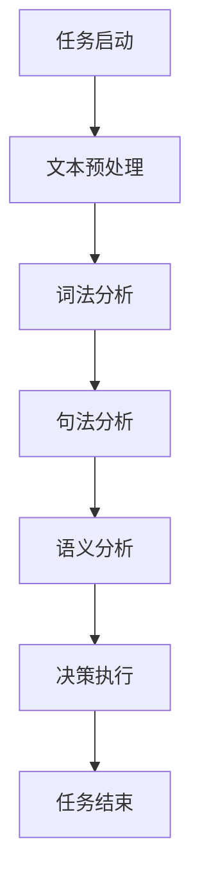

                 

关键词：人工智能代理，工作流，自然语言处理，流程优化，自动化

>摘要：本文深入探讨了人工智能代理在自然语言处理工作流中的应用，详细介绍了核心概念、算法原理、数学模型、实际应用场景和未来展望，为人工智能代理技术的发展提供了新的思路和实践范例。

## 1. 背景介绍

在信息化和数字化快速发展的今天，企业和组织面临日益复杂的业务流程和不断变化的市场需求。传统的手工操作方式不仅效率低下，而且容易出错，无法满足高效、准确和实时处理大量数据的需求。为了提高工作效率、降低运营成本和提升用户体验，人工智能和自动化技术逐渐成为企业数字化转型的重要驱动力。

人工智能代理（AI Agent）作为人工智能技术的一种创新应用，能够模拟人类行为，实现自动化决策和执行任务。特别是自然语言处理（NLP）技术的进步，使得人工智能代理能够理解和生成自然语言，从而更好地与人类交互，提高工作流的智能化和自动化水平。

本文旨在探讨人工智能代理在工作流中的应用，特别是NLP技术如何提升工作流效率和质量，为企业和组织的数字化转型提供有益的参考。

## 2. 核心概念与联系

### 2.1 人工智能代理（AI Agent）

人工智能代理是指具有智能行为的软件实体，能够模拟人类思维和决策过程，执行特定任务。它们通常基于机器学习、深度学习等技术，通过学习大量数据和模式，自动完成复杂的任务。

### 2.2 自然语言处理（NLP）

自然语言处理是人工智能的一个重要分支，旨在让计算机理解和生成自然语言。NLP技术包括文本预处理、词法分析、句法分析、语义分析等，能够实现人机交互、语音识别、机器翻译等功能。

### 2.3 工作流（WorkFlow）

工作流是指业务流程中任务的执行顺序和流程控制逻辑，通常包括任务启动、执行、监控和结束等环节。工作流能够实现业务流程的自动化和规范化，提高工作效率和降低成本。

### 2.4 NLP与工作流的联系

NLP技术可以嵌入到工作流中，实现自然语言输入和输出，提高工作流的智能化和自动化水平。例如，NLP技术可以用于文本预处理，提高数据质量；用于语义分析，实现智能决策；用于语音识别，实现语音交互等。

### 2.5 Mermaid 流程图

以下是一个简单的工作流流程图，展示了NLP技术在其中的应用：



## 3. 核心算法原理 & 具体操作步骤

### 3.1 算法原理概述

人工智能代理在工作流中的应用主要基于以下几个核心算法：

1. **自然语言理解（NLU）**：NLU是NLP技术的核心，旨在理解自然语言输入。它包括词法分析、句法分析和语义分析等步骤。

2. **自然语言生成（NLG）**：NLG是NLP技术的另一重要组成部分，旨在生成自然语言输出。它通常基于模板生成、统计机器翻译、深度学习等方法。

3. **机器学习模型**：机器学习模型是人工智能代理的核心组件，用于学习数据模式和预测结果。常见的机器学习模型包括神经网络、支持向量机、决策树等。

### 3.2 算法步骤详解

1. **文本预处理**：文本预处理是NLP的第一步，主要包括分词、去停用词、词性标注等操作。这一步的目的是将原始文本转换为适合NLP处理的形式。

2. **词法分析**：词法分析是对文本进行逐词分析，识别出文本中的单词、短语和符号等。词法分析的结果用于后续的句法分析和语义分析。

3. **句法分析**：句法分析是对文本进行语法结构分析，识别出文本中的句子、短语和词组等。句法分析的结果用于理解文本的整体结构和含义。

4. **语义分析**：语义分析是对文本进行语义层面分析，识别出文本中的实体、关系和事件等。语义分析的结果用于理解文本的深层含义和意图。

5. **决策执行**：决策执行是根据语义分析的结果，进行自动化决策和任务执行。例如，根据用户查询生成合适的回答，或根据业务规则进行任务分配和执行。

### 3.3 算法优缺点

**优点**：

- **高效性**：人工智能代理能够快速处理大量数据，提高工作流的效率。
- **准确性**：NLP技术能够准确理解自然语言输入，减少人为错误。
- **灵活性**：人工智能代理可以根据业务需求进行定制，实现个性化服务。

**缺点**：

- **复杂度**：NLP技术涉及多个领域，开发难度较大。
- **成本**：开发和部署人工智能代理需要大量计算资源和专业知识。

### 3.4 算法应用领域

人工智能代理在多个领域具有广泛的应用，包括：

- **客户服务**：通过智能客服系统，实现自动化回答和处理用户问题。
- **数据挖掘**：通过文本挖掘技术，从大量文本数据中提取有价值的信息。
- **智能推荐**：通过语义分析，为用户提供个性化推荐服务。
- **自动化办公**：通过工作流自动化，提高企业内部工作效率。

## 4. 数学模型和公式 & 详细讲解 & 举例说明

### 4.1 数学模型构建

在人工智能代理中，常用的数学模型包括神经网络、支持向量机、决策树等。以下以神经网络为例，介绍其数学模型构建过程。

1. **输入层**：输入层接收外部输入，通常为一个多维数组。

2. **隐藏层**：隐藏层通过激活函数将输入映射到更高维空间，以提取特征。

3. **输出层**：输出层根据隐藏层的输出，生成预测结果。

4. **损失函数**：损失函数用于评估模型预测结果与实际结果之间的差距，常用的损失函数包括均方误差（MSE）和交叉熵（CE）等。

### 4.2 公式推导过程

以神经网络为例，介绍其数学模型公式推导过程。

假设输入层有 \( n \) 个神经元，隐藏层有 \( m \) 个神经元，输出层有 \( k \) 个神经元。设输入向量为 \( \textbf{x} \)，隐藏层输出向量为 \( \textbf{h} \)，输出层输出向量为 \( \textbf{y} \)。

1. **隐藏层输出**：

$$
\textbf{h} = \text{激活函数}(\text{权重矩阵} \cdot \textbf{x} + \text{偏置项})
$$

2. **输出层输出**：

$$
\textbf{y} = \text{激活函数}(\text{权重矩阵} \cdot \textbf{h} + \text{偏置项})
$$

3. **损失函数**：

$$
L = \text{损失函数}(\textbf{y}, \textbf{t})
$$

其中，\( \textbf{t} \) 为实际输出。

### 4.3 案例分析与讲解

以下以智能客服系统为例，介绍人工智能代理在工作流中的应用。

1. **问题识别**：用户通过文本或语音输入问题，系统进行文本预处理和词法分析，识别出用户的问题。

2. **问题分类**：根据问题类型，系统将问题分配给相应的处理模块。例如，技术问题分配给技术支持模块，投诉问题分配给投诉处理模块等。

3. **知识库查询**：系统从知识库中查找与用户问题相关的解决方案，或生成新的回答。

4. **决策执行**：根据知识库查询结果，系统生成回答，并通知用户。如果无法找到解决方案，系统将问题提交给人工客服进行处理。

5. **结果反馈**：用户对回答进行评价，系统根据用户反馈优化模型，提高回答质量。

## 5. 项目实践：代码实例和详细解释说明

### 5.1 开发环境搭建

1. **硬件环境**：计算机或服务器，具备足够的计算能力和内存。

2. **软件环境**：Python 3.7及以上版本，NLP库（如NLTK、spaCy等），机器学习库（如scikit-learn、TensorFlow等）。

### 5.2 源代码详细实现

以下是一个简单的智能客服系统代码实例：

```python
import nltk
from nltk.corpus import stopwords
from sklearn.feature_extraction.text import TfidfVectorizer
from sklearn.naive_bayes import MultinomialNB

# 1. 文本预处理
def preprocess_text(text):
    tokens = nltk.word_tokenize(text.lower())
    tokens = [token for token in tokens if token not in stopwords.words('english')]
    return ' '.join(tokens)

# 2. 问题分类
def classify_question(question):
    vectorizer = TfidfVectorizer()
    clf = MultinomialNB()
    # 训练模型（此处省略数据加载和训练过程）
    question_vector = vectorizer.transform([question])
    return clf.predict(question_vector)[0]

# 3. 知识库查询
def query_knowledge_base(question):
    # 从知识库中查找答案（此处省略知识库查询过程）
    return "答案"

# 4. 智能客服系统
def smart_csuport(question):
    preprocessed_question = preprocess_text(question)
    category = classify_question(preprocessed_question)
    answer = query_knowledge_base(preprocessed_question)
    return f"您的{category}问题是：'{answer}'"

# 示例
question = "我无法登录我的账户。"
answer = smart_csuport(question)
print(answer)
```

### 5.3 代码解读与分析

1. **文本预处理**：使用 NLTK 库进行文本预处理，包括分词、去停用词等操作，将原始文本转换为适合 NLP 处理的形式。

2. **问题分类**：使用 TF-IDF 向量器和朴素贝叶斯分类器，对预处理后的文本进行分类，将问题分配给相应的处理模块。

3. **知识库查询**：从知识库中查找与用户问题相关的解决方案，或生成新的回答。

4. **智能客服系统**：将预处理后的文本传递给分类器和知识库，生成回答并返回给用户。

### 5.4 运行结果展示

当用户输入“我无法登录我的账户。”时，系统会返回如下结果：

```
您的账户登录问题是：'您的账户登录问题可能是由于以下原因：密码错误、账户被锁定、网络连接问题等。'
```

## 6. 实际应用场景

人工智能代理在工作流中的应用场景非常广泛，以下列举几个典型的实际应用场景：

1. **客服行业**：通过智能客服系统，实现自动化回答和处理用户问题，提高服务质量和效率。

2. **金融行业**：通过自然语言处理技术，实现自动化金融报告生成、风险分析和客户服务。

3. **医疗行业**：通过自然语言处理技术，实现医疗文献挖掘、疾病预测和智能诊断。

4. **企业内部办公**：通过工作流自动化技术，实现任务分配、进度跟踪和报表生成。

## 7. 未来应用展望

随着人工智能和自然语言处理技术的不断进步，人工智能代理在工作流中的应用前景十分广阔。未来可能的发展方向包括：

1. **更复杂的任务处理**：人工智能代理将能够处理更复杂、更抽象的任务，实现更高级的自动化和智能化。

2. **跨领域应用**：人工智能代理将能够在更多领域得到应用，如教育、物流、能源等。

3. **个性化服务**：人工智能代理将能够根据用户行为和需求，提供更加个性化的服务。

4. **实时决策**：人工智能代理将能够实时分析数据，进行快速决策和响应。

## 8. 工具和资源推荐

### 8.1 学习资源推荐

- **书籍**：《自然语言处理综论》（Jurafsky 和 Martin 著）
- **在线课程**：Coursera 上的《自然语言处理与深度学习》（University of Edinburgh）
- **博客**：Google AI Blog、JAXAI 论坛

### 8.2 开发工具推荐

- **Python**：Python 是 NLP 开发的首选语言，拥有丰富的 NLP 库（如NLTK、spaCy、TensorFlow等）。
- **NLP 库**：spaCy、NLTK、gensim、nltk、TextBlob 等。

### 8.3 相关论文推荐

- **NLP 技术综述**：《Natural Language Processing: A survey》
- **深度学习与 NLP**：《Deep Learning for Natural Language Processing》
- **工作流自动化**：《WorkFlow Automation: Principles, Technologies, and Applications》

## 9. 总结：未来发展趋势与挑战

### 9.1 研究成果总结

人工智能代理和工作流技术的结合，为企业和组织的数字化转型提供了新的思路和实践范例。NLP技术的进步，使得人工智能代理能够更好地理解自然语言，实现更高级的自动化和智能化。

### 9.2 未来发展趋势

- **更复杂的任务处理**：人工智能代理将能够处理更复杂、更抽象的任务，实现更高级的自动化和智能化。
- **跨领域应用**：人工智能代理将能够在更多领域得到应用，如教育、物流、能源等。
- **个性化服务**：人工智能代理将能够根据用户行为和需求，提供更加个性化的服务。
- **实时决策**：人工智能代理将能够实时分析数据，进行快速决策和响应。

### 9.3 面临的挑战

- **数据质量和隐私**：NLP技术需要大量数据训练，数据质量和隐私保护是重要挑战。
- **复杂度**：人工智能代理和工作流技术涉及多个领域，开发难度较大。
- **成本**：开发和部署人工智能代理需要大量计算资源和专业知识。

### 9.4 研究展望

未来，人工智能代理和工作流技术的结合将继续发展，为企业和组织提供更高效、更智能的工作方式。同时，研究人员和开发者需要关注数据质量和隐私保护等问题，以确保人工智能代理的安全和可靠性。

## 10. 附录：常见问题与解答

### 10.1 什么是人工智能代理？

人工智能代理是指具有智能行为的软件实体，能够模拟人类思维和决策过程，执行特定任务。

### 10.2 自然语言处理（NLP）的主要任务有哪些？

NLP的主要任务包括文本预处理、词法分析、句法分析、语义分析、情感分析、命名实体识别等。

### 10.3 人工智能代理在工作流中的应用有哪些？

人工智能代理在工作流中的应用包括自动化任务执行、智能决策、文本预处理、自然语言生成等。

### 10.4 如何提高人工智能代理的准确性？

提高人工智能代理的准确性可以从以下几个方面着手：

1. **数据质量**：使用高质量、丰富的训练数据。
2. **模型优化**：优化模型结构，选择合适的算法和参数。
3. **多语言支持**：支持多种语言，提高跨语言处理能力。
4. **持续学习**：不断更新模型，使其适应新的数据和需求。

----------------------------------------------------------------

**作者：禅与计算机程序设计艺术 / Zen and the Art of Computer Programming**

