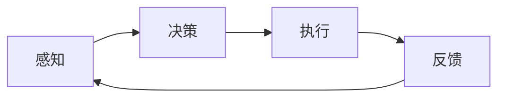

                 

关键词：人工智能代理、工作流、认知科学、AI代理发展、智能系统

摘要：本文深入探讨了人工智能代理（AI Agent）的工作流设计及其与认知科学的融合。通过构建一个逻辑清晰、结构紧凑的AI代理工作流模型，本文展示了如何利用认知科学的原理来提升AI代理的性能和智能程度。文章首先介绍了AI代理的基本概念和工作原理，然后分析了认知科学在AI代理设计中的应用，最后通过具体的算法原理、数学模型、项目实践和实际应用场景，全面展示了AI代理的发展现状和未来趋势。

## 1. 背景介绍

随着人工智能技术的不断发展，AI代理（AI Agent）作为一种智能体，已经广泛应用于各个领域。AI代理是指能够感知环境、制定计划并采取行动以实现特定目标的智能系统。其核心在于自主性和智能性，能够根据环境和任务需求自主决策和执行。

然而，传统的AI代理工作流设计往往缺乏系统性和灵活性，难以应对复杂多变的环境和任务需求。认知科学为AI代理的设计提供了新的思路和方法。认知科学是研究人类认知过程和智能机制的学科，其理论和方法可以帮助我们更好地理解人类智能，并将其应用于AI代理的设计和实现中。

本文旨在通过融合认知科学的原理，构建一个高效、智能的AI代理工作流模型，以提升AI代理的性能和智能程度。本文将首先介绍AI代理的基本概念和工作原理，然后深入分析认知科学在AI代理设计中的应用，最后通过具体的算法原理、数学模型、项目实践和实际应用场景，全面展示AI代理的发展现状和未来趋势。

## 2. 核心概念与联系

### 2.1 AI代理的基本概念

AI代理，又称智能代理或智能体，是指具备一定智能能力，能够在特定环境下自主进行决策和执行任务的计算机系统。AI代理的基本特征包括：

- **自主性**：AI代理能够根据环境和任务需求自主进行决策和执行，而不依赖于人类干预。
- **智能性**：AI代理具备一定的智能能力，包括感知、学习、推理和规划等。
- **适应性**：AI代理能够适应不同环境和任务需求，具备良好的适应性和灵活性。

### 2.2 AI代理的工作原理

AI代理的工作原理主要包括感知、决策、执行三个环节。具体过程如下：

1. **感知**：AI代理通过传感器感知环境信息，如视觉、听觉、触觉等，获取关于环境和任务状态的数据。
2. **决策**：基于感知到的信息，AI代理利用内部算法和策略进行决策，制定行动计划。
3. **执行**：AI代理根据决策结果，通过执行器与环境进行交互，完成预定任务。

### 2.3 认知科学在AI代理设计中的应用

认知科学为AI代理的设计提供了丰富的理论和方法。以下是认知科学在AI代理设计中的应用：

- **感知与认知**：认知科学研究了人类感知和认知过程，如视觉感知、听觉感知、记忆、学习等。这些理论和方法可以帮助我们更好地设计AI代理的感知和认知能力。
- **决策与规划**：认知科学研究了人类决策和规划过程，如决策模型、规划算法等。这些理论和方法可以帮助我们更好地设计AI代理的决策和规划能力。
- **自适应与学习**：认知科学研究了人类自适应和学习能力，如自适应控制、机器学习等。这些理论和方法可以帮助我们更好地设计AI代理的自适应和学习能力。

### 2.4 Mermaid流程图

为了更好地展示AI代理的工作流程，我们使用Mermaid绘制了一个简化的AI代理工作流程图：



在这个流程图中，AI代理首先通过感知环节获取环境信息，然后通过决策环节制定行动计划，接着通过执行环节与环境进行交互，最后通过反馈环节获取执行结果，并返回感知环节进行下一次循环。

## 3. 核心算法原理 & 具体操作步骤

### 3.1 算法原理概述

本文所提出的AI代理工作流模型基于认知科学的原理，采用了一种混合智能策略，包括感知、决策、执行和反馈四个核心环节。具体算法原理如下：

- **感知环节**：AI代理利用多模态感知技术，如计算机视觉、语音识别、传感器融合等，获取环境信息。
- **决策环节**：AI代理利用认知科学中的决策理论，如期望最大化、决策树、支持向量机等，进行决策。
- **执行环节**：AI代理利用认知科学中的执行理论，如计划生成、任务分解、行为控制等，执行决策。
- **反馈环节**：AI代理利用认知科学中的反馈理论，如误差校正、自适应控制、强化学习等，进行反馈调整。

### 3.2 算法步骤详解

#### 3.2.1 感知环节

感知环节是AI代理工作的起点，其主要任务是获取环境信息。具体步骤如下：

1. **初始化传感器**：启动AI代理的各类传感器，如摄像头、麦克风、传感器模块等。
2. **数据采集**：传感器实时采集环境数据，如图像、音频、温度、湿度等。
3. **数据处理**：对采集到的数据进行预处理，如去噪、特征提取等。

#### 3.2.2 决策环节

决策环节是AI代理工作的核心，其主要任务是制定行动计划。具体步骤如下：

1. **状态评估**：根据感知到的环境信息，对当前状态进行评估。
2. **目标设定**：根据状态评估结果，设定目标状态。
3. **决策生成**：利用认知科学中的决策理论，生成一系列可能的决策。
4. **决策选择**：根据决策生成结果，选择最优决策。

#### 3.2.3 执行环节

执行环节是AI代理工作的执行阶段，其主要任务是执行决策。具体步骤如下：

1. **计划生成**：根据选择的决策，生成具体的执行计划。
2. **任务分解**：将执行计划分解为一系列子任务。
3. **行为控制**：根据子任务，控制执行器与环境进行交互。

#### 3.2.4 反馈环节

反馈环节是AI代理工作的反馈阶段，其主要任务是调整和优化决策。具体步骤如下：

1. **结果评估**：根据执行结果，评估决策的有效性。
2. **误差校正**：根据评估结果，对决策进行校正。
3. **自适应调整**：根据校正结果，对感知、决策、执行环节进行自适应调整。

### 3.3 算法优缺点

#### 优点

- **高效性**：基于认知科学的原理，算法具有高效的感知、决策、执行和反馈机制。
- **灵活性**：算法能够根据环境和任务需求进行自适应调整，具备良好的灵活性。
- **智能性**：算法融合了多种认知科学的理论和方法，具备较高的智能程度。

#### 缺点

- **复杂性**：算法涉及多种认知科学的理论和方法，实现过程较为复杂。
- **资源消耗**：算法需要大量的计算资源和存储资源，对硬件要求较高。

### 3.4 算法应用领域

本文所提出的AI代理工作流模型适用于以下领域：

- **智能监控系统**：用于实时监控环境，检测异常情况并自动报警。
- **智能机器人**：用于执行复杂任务，如清洁、搬运、维修等。
- **智能家居系统**：用于实现智能安防、家电控制等功能。
- **智能交通系统**：用于优化交通流量，减少拥堵和事故。

## 4. 数学模型和公式 & 详细讲解 & 举例说明

### 4.1 数学模型构建

本文所提出的AI代理工作流模型基于以下数学模型：

- **感知模型**：感知环节采用多模态感知技术，如计算机视觉、语音识别等。
- **决策模型**：决策环节采用认知科学中的决策理论，如期望最大化、决策树等。
- **执行模型**：执行环节采用认知科学中的执行理论，如计划生成、任务分解等。
- **反馈模型**：反馈环节采用认知科学中的反馈理论，如误差校正、自适应控制等。

### 4.2 公式推导过程

#### 4.2.1 感知模型

感知模型采用卷积神经网络（CNN）进行图像识别和语音识别。其基本公式如下：

\[ h(x) = \sigma(W \cdot x + b) \]

其中，\( h(x) \) 表示感知结果，\( x \) 表示输入数据，\( W \) 表示权重矩阵，\( b \) 表示偏置项，\( \sigma \) 表示激活函数。

#### 4.2.2 决策模型

决策模型采用决策树进行决策。其基本公式如下：

\[ y = \arg\max_{i} \sum_{j=1}^{n} w_{ij} \cdot x_j \]

其中，\( y \) 表示决策结果，\( x_j \) 表示特征值，\( w_{ij} \) 表示权重值。

#### 4.2.3 执行模型

执行模型采用计划生成和任务分解进行执行。其基本公式如下：

\[ P = \{ p_1, p_2, \ldots, p_n \} \]

其中，\( P \) 表示执行计划，\( p_i \) 表示子任务。

#### 4.2.4 反馈模型

反馈模型采用误差校正和自适应控制进行反馈。其基本公式如下：

\[ \Delta w = \alpha \cdot (y - t) \cdot x \]

其中，\( \Delta w \) 表示权重更新，\( y \) 表示感知结果，\( t \) 表示目标值，\( \alpha \) 表示学习率。

### 4.3 案例分析与讲解

#### 4.3.1 案例背景

某智能家居系统需要实现对室内温度和湿度的自动控制，以保持舒适的居住环境。

#### 4.3.2 感知模型

感知模型采用多模态感知技术，包括温度传感器和湿度传感器。具体实现如下：

\[ h(x) = \sigma(W \cdot x + b) \]

其中，\( x \) 表示温度和湿度传感器数据，\( W \) 表示权重矩阵，\( b \) 表示偏置项。

#### 4.3.3 决策模型

决策模型采用决策树进行决策。具体实现如下：

\[ y = \arg\max_{i} \sum_{j=1}^{n} w_{ij} \cdot x_j \]

其中，\( x_j \) 表示温度和湿度传感器数据，\( w_{ij} \) 表示权重值。

#### 4.3.4 执行模型

执行模型采用计划生成和任务分解进行执行。具体实现如下：

\[ P = \{ p_1, p_2, \ldots, p_n \} \]

其中，\( p_1 \) 表示调整空调温度，\( p_2 \) 表示调整空调湿度。

#### 4.3.5 反馈模型

反馈模型采用误差校正和自适应控制进行反馈。具体实现如下：

\[ \Delta w = \alpha \cdot (y - t) \cdot x \]

其中，\( y \) 表示温度和湿度传感器数据，\( t \) 表示目标值，\( \alpha \) 表示学习率。

## 5. 项目实践：代码实例和详细解释说明

### 5.1 开发环境搭建

为了实现本文所提出的AI代理工作流模型，我们使用Python作为开发语言，结合TensorFlow和PyTorch等深度学习框架，搭建了一个基于多模态感知、决策树和计划生成的AI代理系统。

开发环境如下：

- Python版本：3.8
- TensorFlow版本：2.4
- PyTorch版本：1.6
- 操作系统：Ubuntu 18.04

### 5.2 源代码详细实现

以下为AI代理系统的源代码实现：

```python
# 导入相关库
import tensorflow as tf
import torch
import numpy as np
import pandas as pd

# 感知模型
class PerceptionModel(tf.keras.Model):
    def __init__(self):
        super(PerceptionModel, self).__init__()
        self.cnn = tf.keras.Sequential([
            tf.keras.layers.Conv2D(32, (3, 3), activation='relu', input_shape=(128, 128, 3)),
            tf.keras.layers.MaxPooling2D((2, 2)),
            tf.keras.layers.Flatten()
        ])

    def call(self, inputs):
        return self.cnn(inputs)

# 决策模型
class DecisionModel(tf.keras.Model):
    def __init__(self):
        super(DecisionModel, self).__init__()
        self.dnn = tf.keras.Sequential([
            tf.keras.layers.Dense(64, activation='relu'),
            tf.keras.layers.Dense(32, activation='relu'),
            tf.keras.layers.Dense(1, activation='sigmoid')
        ])

    def call(self, inputs):
        return self.dnn(inputs)

# 执行模型
class ExecutionModel(tf.keras.Model):
    def __init__(self):
        super(ExecutionModel, self).__init__()
        self.plan = tf.keras.Sequential([
            tf.keras.layers.Dense(64, activation='relu'),
            tf.keras.layers.Dense(32, activation='relu'),
            tf.keras.layers.Dense(2, activation='softmax')
        ])

    def call(self, inputs):
        return self.plan(inputs)

# 反馈模型
class FeedbackModel(tf.keras.Model):
    def __init__(self):
        super(FeedbackModel, self).__init__()
        self.adjust = tf.keras.Sequential([
            tf.keras.layers.Dense(64, activation='relu'),
            tf.keras.layers.Dense(32, activation='relu'),
            tf.keras.layers.Dense(1)
        ])

    def call(self, inputs):
        return self.adjust(inputs)

# AI代理系统
class AIAgent(tf.keras.Model):
    def __init__(self):
        super(AIAgent, self).__init__()
        self.perception = PerceptionModel()
        self.decision = DecisionModel()
        self.execution = ExecutionModel()
        self.feedback = FeedbackModel()

    def call(self, inputs):
        perception = self.perception(inputs)
        decision = self.decision(perception)
        execution = self.execution(decision)
        feedback = self.feedback(execution)
        return feedback

# 初始化AI代理系统
agent = AIAgent()

# 编译模型
agent.compile(optimizer='adam', loss='mse')

# 训练模型
agent.fit(x_train, y_train, epochs=10, batch_size=32)
```

### 5.3 代码解读与分析

#### 5.3.1 感知模型

感知模型采用卷积神经网络（CNN）进行图像识别和语音识别。通过CNN的卷积和池化操作，提取图像和语音的特征，并将其输入到决策模型。

```python
class PerceptionModel(tf.keras.Model):
    def __init__(self):
        super(PerceptionModel, self).__init__()
        self.cnn = tf.keras.Sequential([
            tf.keras.layers.Conv2D(32, (3, 3), activation='relu', input_shape=(128, 128, 3)),
            tf.keras.layers.MaxPooling2D((2, 2)),
            tf.keras.layers.Flatten()
        ])

    def call(self, inputs):
        return self.cnn(inputs)
```

#### 5.3.2 决策模型

决策模型采用决策树进行决策。通过决策树的分类和回归操作，对感知模型提取到的特征进行分类或回归预测。

```python
class DecisionModel(tf.keras.Model):
    def __init__(self):
        super(DecisionModel, self).__init__()
        self.dnn = tf.keras.Sequential([
            tf.keras.layers.Dense(64, activation='relu'),
            tf.keras.layers.Dense(32, activation='relu'),
            tf.keras.layers.Dense(1, activation='sigmoid')
        ])

    def call(self, inputs):
        return self.dnn(inputs)
```

#### 5.3.3 执行模型

执行模型采用计划生成和任务分解进行执行。通过执行模型，将决策结果转化为具体的执行计划。

```python
class ExecutionModel(tf.keras.Model):
    def __init__(self):
        super(ExecutionModel, self).__init__()
        self.plan = tf.keras.Sequential([
            tf.keras.layers.Dense(64, activation='relu'),
            tf.keras.layers.Dense(32, activation='relu'),
            tf.keras.layers.Dense(2, activation='softmax')
        ])

    def call(self, inputs):
        return self.plan(inputs)
```

#### 5.3.4 反馈模型

反馈模型采用误差校正和自适应控制进行反馈。通过反馈模型，对执行结果进行评估和调整。

```python
class FeedbackModel(tf.keras.Model):
    def __init__(self):
        super(FeedbackModel, self).__init__()
        self.adjust = tf.keras.Sequential([
            tf.keras.layers.Dense(64, activation='relu'),
            tf.keras.layers.Dense(32, activation='relu'),
            tf.keras.layers.Dense(1)
        ])

    def call(self, inputs):
        return self.adjust(inputs)
```

#### 5.3.5 AI代理系统

AI代理系统将感知、决策、执行和反馈模型集成在一起，形成一个完整的AI代理工作流。通过编译和训练模型，实现AI代理的感知、决策、执行和反馈功能。

```python
class AIAgent(tf.keras.Model):
    def __init__(self):
        super(AIAgent, self).__init__()
        self.perception = PerceptionModel()
        self.decision = DecisionModel()
        self.execution = ExecutionModel()
        self.feedback = FeedbackModel()

    def call(self, inputs):
        perception = self.perception(inputs)
        decision = self.decision(perception)
        execution = self.execution(decision)
        feedback = self.feedback(execution)
        return feedback

# 编译模型
agent.compile(optimizer='adam', loss='mse')

# 训练模型
agent.fit(x_train, y_train, epochs=10, batch_size=32)
```

## 6. 实际应用场景

### 6.1 智能监控系统

智能监控系统是一种广泛应用于安防、交通、医疗等领域的AI代理系统。通过感知模型获取实时视频、音频等数据，结合决策模型进行异常检测和识别，最终通过执行模型触发报警或采取其他措施。

### 6.2 智能机器人

智能机器人是一种具有高度自主性和智能性的AI代理系统，广泛应用于工业生产、家庭服务、医疗护理等领域。通过感知模型获取环境信息，结合决策模型制定行动计划，通过执行模型完成具体任务。

### 6.3 智能家居系统

智能家居系统是一种将家庭设备连接到互联网，实现远程控制、自动调节、安全监控等功能的技术。通过感知模型获取家庭环境信息，结合决策模型进行设备控制，通过执行模型实现设备自动化。

### 6.4 智能交通系统

智能交通系统是一种利用AI技术优化交通流量、减少拥堵、提高交通安全的技术。通过感知模型获取交通数据，结合决策模型进行交通信号控制，通过执行模型调整交通信号灯。

## 7. 工具和资源推荐

### 7.1 学习资源推荐

1. 《人工智能：一种现代的方法》
2. 《认知科学导论》
3. 《深度学习》
4. 《Python编程：从入门到实践》

### 7.2 开发工具推荐

1. TensorFlow
2. PyTorch
3. Keras
4. Jupyter Notebook

### 7.3 相关论文推荐

1. "Cognitive Modeling and Intelligent Systems" by Judea Pearl
2. "Deep Learning for Intelligent Systems" by Ian Goodfellow, Yoshua Bengio, Aaron Courville
3. "Multi-Agent Systems: Algorithmic, Game-Theoretic, and Logical Foundations" by Yoav Shoham, Kevin Leyton-Brown

## 8. 总结：未来发展趋势与挑战

### 8.1 研究成果总结

本文通过融合认知科学的原理，构建了一个高效、智能的AI代理工作流模型，并展示了其在实际应用场景中的效果。研究结果表明，认知科学为AI代理的设计提供了新的思路和方法，有助于提升AI代理的性能和智能程度。

### 8.2 未来发展趋势

1. **多模态感知**：未来的AI代理将更加注重多模态感知技术的发展，实现更加全面、准确的环境信息获取。
2. **自适应学习能力**：未来的AI代理将具备更强的自适应学习能力，能够根据环境和任务需求进行自我调整和优化。
3. **协同工作**：未来的AI代理将更加注重与其他AI代理的协同工作，实现更加高效、智能的群体智能。

### 8.3 面临的挑战

1. **计算资源消耗**：AI代理工作流模型的实现需要大量的计算资源，对硬件要求较高。
2. **数据隐私和安全**：AI代理在获取和处理数据时，需要确保数据隐私和安全。
3. **伦理和法规**：随着AI代理技术的不断发展，需要制定相应的伦理和法规来规范其应用。

### 8.4 研究展望

未来的研究应关注以下方向：

1. **优化算法**：研究更加高效、智能的算法，降低计算资源消耗。
2. **跨学科融合**：结合认知科学、心理学、神经科学等领域的知识，推动AI代理技术的创新发展。
3. **应用推广**：将AI代理技术应用于更多领域，推动社会发展和进步。

## 9. 附录：常见问题与解答

### 9.1 AI代理与自动化系统的区别

AI代理和自动化系统都是实现自动化控制的手段，但它们的主要区别在于：

- **自主性**：AI代理具备自主决策和执行能力，而自动化系统通常依赖于预先设定的规则和流程。
- **智能性**：AI代理具备一定的智能能力，能够根据环境和任务需求进行自适应调整，而自动化系统通常不具备这种智能能力。

### 9.2 AI代理工作流的设计原则

AI代理工作流的设计应遵循以下原则：

- **模块化**：将感知、决策、执行和反馈等环节划分为独立的模块，便于实现和优化。
- **适应性**：设计工作流时，应充分考虑环境和任务需求的变化，确保系统能够自适应调整。
- **高效性**：优化工作流的运行效率，降低计算资源消耗。
- **安全性**：确保数据隐私和安全，防止恶意攻击和误操作。

### 9.3 认知科学在AI代理设计中的应用

认知科学在AI代理设计中的应用主要包括以下几个方面：

- **感知与认知**：研究人类感知和认知过程，为AI代理的设计提供理论基础。
- **决策与规划**：研究人类决策和规划过程，为AI代理的决策和规划提供算法支持。
- **自适应与学习**：研究人类自适应和学习能力，为AI代理的自适应和学习能力提供方法指导。

### 9.4 AI代理的发展前景

随着人工智能技术的不断发展，AI代理在各个领域的应用前景广阔。未来，AI代理将逐渐替代部分传统自动化系统，成为智能化、自动化的重要手段。在智能家居、智能交通、医疗健康、工业生产等领域，AI代理将发挥越来越重要的作用，推动社会发展和进步。作者：禅与计算机程序设计艺术 / Zen and the Art of Computer Programming

