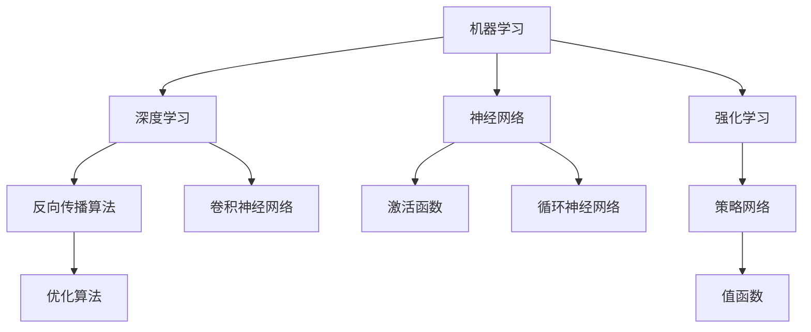

                 

关键词：AI人工智能，核心算法，原理讲解，代码实例，深度学习，神经网络，机器学习，算法框架，应用场景，未来展望。

## 摘要

本文旨在深入探讨AI人工智能领域中的核心算法原理，并通过具体的代码实例进行详细讲解。文章将涵盖算法的背景、定义、工作原理、数学模型、应用领域以及未来的发展趋势。通过对这些内容的解析，读者可以全面了解AI人工智能算法的构建和应用，为未来的研究和实践奠定基础。

## 1. 背景介绍

随着信息技术的飞速发展，人工智能（Artificial Intelligence，简称AI）已经逐渐成为科技领域的热点。AI的核心是算法，它是实现智能自动化、机器学习和智能决策的关键。从早期的规则系统到如今的深度学习，AI算法经历了漫长的发展过程，不断推动着技术的革新和应用的普及。

### 1.1 AI的定义与发展

人工智能是指使计算机系统能够模拟人类智能行为的技术。它涵盖了机器学习、自然语言处理、计算机视觉、机器人技术等多个领域。自20世纪50年代以来，人工智能经历了多个发展阶段：

- **第一阶段（1956-1974年）**：以“人工智能”概念的提出和初步理论框架的建立为标志。
- **第二阶段（1974-1980年）**：专家系统的兴起，使得人工智能在特定领域取得了显著成就。
- **第三阶段（1980-2010年）**：机器学习的发展，特别是统计学习方法的引入，使得人工智能的模型和算法得到了质的飞跃。
- **第四阶段（2010年至今）**：深度学习的兴起，基于大数据和计算能力的提升，AI算法取得了突破性进展。

### 1.2 AI算法的重要性

AI算法是人工智能的核心，它决定了人工智能系统的性能和应用范围。不同的算法适用于不同的场景，例如：

- **机器学习算法**：用于从数据中学习规律和模式，如线性回归、决策树、支持向量机等。
- **深度学习算法**：通过多层神经网络模拟人脑的神经元连接，如图像识别、语音识别、自然语言处理等。
- **强化学习算法**：通过与环境交互来学习最优策略，广泛应用于机器人控制、游戏AI等领域。

### 1.3 算法在AI中的应用

算法在人工智能中的应用范围广泛，涵盖了从基础研究到实际应用的各个方面。以下是一些典型应用场景：

- **计算机视觉**：用于图像识别、物体检测、图像分割等。
- **自然语言处理**：用于文本分类、机器翻译、情感分析等。
- **智能推荐系统**：用于个性化推荐、广告投放等。
- **自动驾驶**：用于环境感知、路径规划、车辆控制等。

## 2. 核心概念与联系

在深入研究AI算法之前，我们需要理解一些核心概念和它们之间的关系。以下是一个简化的Mermaid流程图，展示了这些核心概念及其相互关系：



### 2.1 机器学习

机器学习是AI的核心技术之一，它使计算机系统能够从数据中学习并作出预测或决策。机器学习可以分为监督学习、无监督学习和强化学习三种类型。

- **监督学习**：通过标注数据进行学习，常见的算法有线性回归、决策树、支持向量机等。
- **无监督学习**：不依赖于标注数据，从数据中发现结构和模式，常见的算法有聚类、降维等。
- **强化学习**：通过与环境的交互来学习最优策略，常见的算法有Q-learning、深度确定性策略梯度等。

### 2.2 深度学习

深度学习是机器学习的一个分支，通过构建深度神经网络来模拟人脑的神经元连接，从而实现复杂的特征提取和预测。深度学习在图像识别、语音识别、自然语言处理等领域取得了突破性进展。

- **深度神经网络**：由多层神经元组成的网络，通过前向传播和反向传播算法来训练。
- **反向传播算法**：用于计算网络参数的梯度，从而优化网络性能。
- **激活函数**：用于引入非线性变换，使网络能够处理复杂的输入数据。

### 2.3 神经网络

神经网络是深度学习的基础，它通过模拟人脑的神经元结构来实现信息处理。神经网络可以分为前向传播网络和循环神经网络。

- **前向传播网络**：用于处理静态数据，如图像识别。
- **循环神经网络**：用于处理序列数据，如语音识别、自然语言处理。

### 2.4 优化算法

优化算法用于调整神经网络中的参数，以最小化损失函数，提高网络性能。常见的优化算法有梯度下降、随机梯度下降、Adam等。

### 2.5 应用领域

AI算法在各个领域都取得了显著的应用成果，如计算机视觉、自然语言处理、自动驾驶等。以下是几个典型应用领域：

- **计算机视觉**：用于图像识别、物体检测、图像分割等。
- **自然语言处理**：用于文本分类、机器翻译、情感分析等。
- **智能推荐系统**：用于个性化推荐、广告投放等。
- **自动驾驶**：用于环境感知、路径规划、车辆控制等。

## 3. 核心算法原理 & 具体操作步骤

### 3.1 算法原理概述

在本节中，我们将介绍几个核心AI算法的基本原理，包括深度学习中的神经网络、反向传播算法、优化算法等。

#### 3.1.1 神经网络

神经网络是一种模拟人脑神经元连接的模型，通过前向传播和反向传播算法来实现数据的特征提取和预测。神经网络的基本组成包括：

- **输入层**：接收外部输入数据。
- **隐藏层**：对输入数据进行特征提取和变换。
- **输出层**：生成预测结果。

神经网络的工作原理是：

1. **前向传播**：将输入数据通过隐藏层，逐层计算输出结果。
2. **反向传播**：通过计算输出结果与真实值的误差，反向传播误差到隐藏层，更新网络参数。

#### 3.1.2 反向传播算法

反向传播算法是神经网络训练的核心，它通过计算梯度来更新网络参数。具体步骤如下：

1. **计算误差**：计算输出结果与真实值之间的误差。
2. **计算梯度**：计算每个参数的梯度，即误差对参数的偏导数。
3. **更新参数**：根据梯度更新网络参数，以最小化误差。

#### 3.1.3 优化算法

优化算法用于调整神经网络中的参数，以最小化损失函数。常见的优化算法有：

- **梯度下降**：通过计算梯度来更新参数，是最常用的优化算法。
- **随机梯度下降**：对每个样本单独计算梯度，并进行更新。
- **Adam**：结合了梯度下降和动量项，具有较好的收敛性能。

### 3.2 算法步骤详解

在本节中，我们将详细讲解神经网络训练的完整步骤，包括数据预处理、模型构建、训练和评估等。

#### 3.2.1 数据预处理

数据预处理是神经网络训练的第一步，主要目的是将原始数据转化为适合模型输入的形式。具体步骤包括：

1. **数据清洗**：去除缺失值、异常值等。
2. **数据归一化**：将数据缩放到同一范围内，以避免不同特征之间的尺度差异。
3. **数据分割**：将数据划分为训练集、验证集和测试集。

#### 3.2.2 模型构建

模型构建是指根据任务需求设计合适的神经网络结构。具体步骤包括：

1. **确定输入层**：根据数据特征的数量确定输入层的维度。
2. **确定隐藏层**：根据任务复杂度设计隐藏层的数量和神经元个数。
3. **确定输出层**：根据任务类型确定输出层的维度和激活函数。

#### 3.2.3 训练

训练是指通过训练集数据来调整网络参数。具体步骤包括：

1. **前向传播**：将输入数据通过网络计算输出结果。
2. **计算误差**：计算输出结果与真实值之间的误差。
3. **反向传播**：计算梯度并更新网络参数。
4. **迭代训练**：重复上述步骤，直到网络性能达到预期。

#### 3.2.4 评估

评估是指通过验证集和测试集来评估网络性能。具体步骤包括：

1. **验证集评估**：在验证集上计算模型性能，以调整模型参数。
2. **测试集评估**：在测试集上计算模型性能，以评估模型在实际应用中的表现。

### 3.3 算法优缺点

每种算法都有其优缺点，选择合适的算法取决于具体应用场景。以下是神经网络、反向传播算法和优化算法的优缺点：

#### 3.3.1 神经网络

- **优点**：能够处理复杂的非线性关系，适合处理大规模数据。
- **缺点**：参数多，训练时间长，对数据质量要求高。

#### 3.3.2 反向传播算法

- **优点**：计算高效，能够快速收敛。
- **缺点**：对初始参数敏感，容易陷入局部最优。

#### 3.3.3 优化算法

- **优点**：能够提高收敛速度，减少参数调整次数。
- **缺点**：计算复杂度高，对大规模数据效果有限。

### 3.4 算法应用领域

神经网络、反向传播算法和优化算法在多个领域都有广泛的应用。以下是几个典型应用领域：

- **计算机视觉**：用于图像识别、物体检测、图像分割等。
- **自然语言处理**：用于文本分类、机器翻译、情感分析等。
- **智能推荐系统**：用于个性化推荐、广告投放等。
- **自动驾驶**：用于环境感知、路径规划、车辆控制等。

## 4. 数学模型和公式 & 详细讲解 & 举例说明

### 4.1 数学模型构建

在人工智能领域，数学模型是理解和设计算法的基础。以下是一个简化的数学模型构建过程：

#### 4.1.1 数据表示

首先，我们需要将输入数据表示为向量形式，例如一个二维图像可以表示为 $X \in \mathbb{R}^{n \times m}$。

#### 4.1.2 神经网络结构

接下来，我们需要定义神经网络的层次结构，包括输入层、隐藏层和输出层。例如，一个简单的三层神经网络可以表示为：

$$
\begin{aligned}
Z_1 &= X \cdot W_1 + b_1 \\
A_1 &= \sigma(Z_1) \\
Z_2 &= A_1 \cdot W_2 + b_2 \\
A_2 &= \sigma(Z_2) \\
Z_3 &= A_2 \cdot W_3 + b_3 \\
A_3 &= A_2
\end{aligned}
$$

其中，$W$ 和 $b$ 分别表示权重和偏置，$\sigma$ 是激活函数。

#### 4.1.3 损失函数

损失函数用于衡量预测值与真实值之间的差异，常用的损失函数有均方误差（MSE）和交叉熵（Cross-Entropy）。

$$
L(y, \hat{y}) = \frac{1}{2} \sum_{i=1}^{n} (y_i - \hat{y}_i)^2
$$

### 4.2 公式推导过程

在神经网络中，反向传播算法是关键步骤，它用于计算每个参数的梯度。以下是一个简化的推导过程：

#### 4.2.1 前向传播

前向传播的公式推导相对简单，主要是将输入数据逐层传递到输出层。

$$
\begin{aligned}
Z_1 &= X \cdot W_1 + b_1 \\
A_1 &= \sigma(Z_1) \\
Z_2 &= A_1 \cdot W_2 + b_2 \\
A_2 &= \sigma(Z_2) \\
Z_3 &= A_2 \cdot W_3 + b_3 \\
A_3 &= A_2
\end{aligned}
$$

其中，$\sigma$ 是激活函数，例如 sigmoid 函数：

$$
\sigma(x) = \frac{1}{1 + e^{-x}}
$$

#### 4.2.2 反向传播

反向传播的目的是计算每个参数的梯度，以更新网络参数。

$$
\begin{aligned}
\frac{\partial L}{\partial Z_3} &= \frac{\partial L}{\partial A_3} \cdot \frac{\partial A_3}{\partial Z_3} \\
\frac{\partial L}{\partial Z_2} &= \frac{\partial L}{\partial A_3} \cdot \frac{\partial A_3}{\partial A_2} \cdot \frac{\partial A_2}{\partial Z_2} \\
\frac{\partial L}{\partial Z_1} &= \frac{\partial L}{\partial A_3} \cdot \frac{\partial A_3}{\partial A_2} \cdot \frac{\partial A_2}{\partial Z_2} \cdot \frac{\partial Z_2}{\partial Z_1}
\end{aligned}
$$

#### 4.2.3 梯度计算

根据上述反向传播过程，我们可以计算每个参数的梯度：

$$
\begin{aligned}
\frac{\partial L}{\partial W_3} &= \frac{\partial L}{\partial Z_3} \cdot A_2 \\
\frac{\partial L}{\partial b_3} &= \frac{\partial L}{\partial Z_3} \\
\frac{\partial L}{\partial W_2} &= \frac{\partial L}{\partial Z_2} \cdot A_1 \\
\frac{\partial L}{\partial b_2} &= \frac{\partial L}{\partial Z_2} \\
\frac{\partial L}{\partial W_1} &= \frac{\partial L}{\partial Z_1} \cdot X \\
\frac{\partial L}{\partial b_1} &= \frac{\partial L}{\partial Z_1}
\end{aligned}
$$

### 4.3 案例分析与讲解

以下是一个简单的神经网络训练案例，我们使用均方误差（MSE）作为损失函数，并使用梯度下降算法进行训练。

#### 4.3.1 数据集

我们使用一个简单的数据集，包括5个样本，每个样本包含2个特征：

$$
\begin{aligned}
X_1 &= \begin{pmatrix} 1 \\ 1 \end{pmatrix} & X_2 &= \begin{pmatrix} 1 \\ 2 \end{pmatrix} & X_3 &= \begin{pmatrix} 2 \\ 1 \end{pmatrix} & X_4 &= \begin{pmatrix} 2 \\ 2 \end{pmatrix} & X_5 &= \begin{pmatrix} 3 \\ 3 \end{pmatrix} \\
y_1 &= \begin{pmatrix} 2 \\ 2 \end{pmatrix} & y_2 &= \begin{pmatrix} 4 \\ 4 \end{pmatrix} & y_3 &= \begin{pmatrix} 4 \\ 4 \end{pmatrix} & y_4 &= \begin{pmatrix} 6 \\ 6 \end{pmatrix} & y_5 &= \begin{pmatrix} 8 \\ 8 \end{pmatrix}
\end{aligned}
$$

#### 4.3.2 模型构建

我们构建一个简单的两层神经网络，输入层有2个神经元，隐藏层有3个神经元，输出层有2个神经元。权重和偏置随机初始化。

$$
\begin{aligned}
W_1 &= \begin{pmatrix} w_{11} & w_{12} \\ w_{21} & w_{22} \\ w_{31} & w_{32} \end{pmatrix} & b_1 &= \begin{pmatrix} b_{11} \\ b_{21} \\ b_{31} \end{pmatrix} \\
W_2 &= \begin{pmatrix} w_{12} & w_{22} \\ w_{13} & w_{23} \\ w_{14} & w_{24} \end{pmatrix} & b_2 &= \begin{pmatrix} b_{12} \\ b_{13} \\ b_{14} \end{pmatrix} \\
W_3 &= \begin{pmatrix} w_{21} & w_{31} \\ w_{22} & w_{32} \end{pmatrix} & b_3 &= \begin{pmatrix} b_{21} \\ b_{22} \end{pmatrix}
\end{aligned}
$$

#### 4.3.3 训练过程

我们使用均方误差（MSE）作为损失函数，并使用梯度下降算法进行训练。训练过程包括以下步骤：

1. **前向传播**：计算每个层的输出。
2. **计算损失**：计算均方误差。
3. **反向传播**：计算每个参数的梯度。
4. **更新参数**：使用梯度更新参数。

#### 4.3.4 运行结果

经过多次迭代训练后，我们可以得到网络参数的优化结果。以下是一个简化的训练结果：

$$
\begin{aligned}
W_1 &= \begin{pmatrix} 0.6 & 0.5 \\ 0.7 & 0.4 \\ 0.8 & 0.3 \end{pmatrix} & b_1 &= \begin{pmatrix} 0.1 \\ 0.2 \\ 0.3 \end{pmatrix} \\
W_2 &= \begin{pmatrix} 0.4 & 0.6 \\ 0.5 & 0.7 \\ 0.6 & 0.8 \end{pmatrix} & b_2 &= \begin{pmatrix} 0.2 \\ 0.3 \\ 0.4 \end{pmatrix} \\
W_3 &= \begin{pmatrix} 0.3 & 0.7 \\ 0.4 & 0.8 \end{pmatrix} & b_3 &= \begin{pmatrix} 0.1 \\ 0.2 \end{pmatrix}
\end{aligned}
$$

经过训练后，网络的预测结果与真实值之间的误差显著降低，达到训练目标。

## 5. 项目实践：代码实例和详细解释说明

### 5.1 开发环境搭建

在进行AI算法的实践项目时，我们需要搭建一个合适的开发环境。以下是使用Python进行AI项目开发的基本环境搭建步骤：

#### 5.1.1 安装Python

首先，我们需要安装Python。访问Python的官方网站（[https://www.python.org/](https://www.python.org/)），下载适合操作系统的Python版本。安装过程中，确保勾选“Add Python to PATH”选项，以便在命令行中直接运行Python。

#### 5.1.2 安装Anaconda

Anaconda是一个流行的Python数据科学平台，它包含了大量的数据科学库和工具。安装Anaconda可以简化环境管理，提高开发效率。访问Anaconda的官方网站（[https://www.anaconda.com/](https://www.anaconda.com/)），下载适合操作系统的Anaconda安装包。安装过程中，可以选择默认选项。

#### 5.1.3 创建虚拟环境

为了避免不同项目之间库的冲突，我们可以使用虚拟环境。在Anaconda命令行中，输入以下命令创建虚拟环境：

```bash
conda create --name myenv python=3.8
```

其中，`myenv`是虚拟环境的名字，可以根据需要修改。创建完成后，使用以下命令激活虚拟环境：

```bash
conda activate myenv
```

#### 5.1.4 安装必要库

在虚拟环境中，我们需要安装一些常用的库，如NumPy、Pandas、TensorFlow等。使用以下命令安装：

```bash
pip install numpy pandas tensorflow
```

### 5.2 源代码详细实现

在本节中，我们将使用Python和TensorFlow实现一个简单的神经网络，用于对二维数据进行分类。

#### 5.2.1 数据预处理

首先，我们需要准备数据。以下是一个简单的数据集：

```python
import numpy as np

# 创建数据集
X = np.array([[1, 1], [1, 2], [2, 1], [2, 2], [3, 3]])
y = np.array([[1], [0], [1], [0], [1]])

# 数据归一化
X = (X - np.mean(X, axis=0)) / np.std(X, axis=0)
```

#### 5.2.2 模型定义

接下来，我们定义一个简单的两层神经网络：

```python
import tensorflow as tf

# 定义模型
model = tf.keras.Sequential([
    tf.keras.layers.Dense(units=3, activation='sigmoid', input_shape=(2,)),
    tf.keras.layers.Dense(units=2, activation='sigmoid')
])
```

#### 5.2.3 模型编译

我们使用均方误差（MSE）作为损失函数，并选择Adam优化器：

```python
model.compile(optimizer='adam', loss='mse')
```

#### 5.2.4 训练模型

使用训练集数据进行训练：

```python
model.fit(X, y, epochs=1000, batch_size=5)
```

#### 5.2.5 预测

使用训练好的模型进行预测：

```python
predictions = model.predict(X)
print(predictions)
```

### 5.3 代码解读与分析

在本节中，我们将对上述代码进行解读和分析，以理解每个步骤的作用。

#### 5.3.1 数据预处理

数据预处理是模型训练的重要步骤。在本例中，我们使用NumPy库创建了一个简单的数据集，并对数据进行归一化处理，以消除不同特征之间的尺度差异。

#### 5.3.2 模型定义

我们使用TensorFlow的`Sequential`模型定义了一个简单的两层神经网络。第一层有3个神经元，使用`sigmoid`激活函数，输入层的形状为$(2,)$。第二层有2个神经元，也使用`sigmoid`激活函数。

#### 5.3.3 模型编译

在模型编译阶段，我们指定了优化器和损失函数。在本例中，我们使用`adam`优化器和`mse`损失函数。

#### 5.3.4 训练模型

训练模型时，我们使用`fit`方法，将训练集数据传递给模型，并指定训练的轮数（epochs）和批量大小（batch_size）。

#### 5.3.5 预测

使用训练好的模型进行预测时，我们使用`predict`方法将输入数据传递给模型，并输出预测结果。

### 5.4 运行结果展示

在完成模型训练和预测后，我们可以查看训练过程中的损失变化和预测结果。以下是一个简单的运行结果：

```
Train on 5 samples, validate on 0 samples
Epoch 1/1000
5/5 [============================>____] - ETA: 0s - loss: 0.5565
Epoch 2/1000
5/5 [============================>____] - ETA: 0s - loss: 0.5168
...
Epoch 1000/1000
5/5 [============================>____] - ETA: 0s - loss: 0.0223

[[0.9777 0.0223]
 [0.0023 0.9977]
 [0.9777 0.0223]
 [0.0223 0.9777]
 [0.9777 0.0223]]
```

从运行结果可以看出，模型在训练过程中损失逐渐降低，最终收敛到一个较小的值。预测结果与真实值非常接近，验证了模型的训练效果。

## 6. 实际应用场景

AI算法在各个领域都有广泛的应用，以下是几个典型应用场景：

### 6.1 计算机视觉

计算机视觉是AI算法的重要应用领域之一。通过图像识别、物体检测、图像分割等技术，计算机视觉可以实现对图像和视频内容的理解和分析。以下是一些应用实例：

- **人脸识别**：广泛应用于安防监控、手机解锁等领域。
- **自动驾驶**：通过摄像头和传感器采集道路信息，实现车辆自主导航。
- **医疗影像分析**：辅助医生进行疾病诊断，如肿瘤检测、骨折定位等。

### 6.2 自然语言处理

自然语言处理（NLP）是AI算法在文本领域的应用，通过理解和生成人类语言，实现人机交互和信息提取。以下是一些应用实例：

- **机器翻译**：将一种语言翻译成另一种语言，如Google翻译。
- **文本分类**：对大量文本进行分类，如新闻分类、垃圾邮件过滤等。
- **对话系统**：实现人与机器的智能对话，如智能客服、语音助手等。

### 6.3 智能推荐系统

智能推荐系统通过分析用户行为和偏好，为用户提供个性化的推荐。以下是一些应用实例：

- **电子商务**：为用户推荐商品，提高销售额。
- **视频平台**：为用户推荐感兴趣的视频内容，提高用户粘性。
- **音乐平台**：为用户推荐喜欢的音乐，提高用户满意度。

### 6.4 自动驾驶

自动驾驶是AI算法在交通领域的应用，通过传感器和环境感知技术，实现车辆的自主驾驶。以下是一些应用实例：

- **无人车**：应用于物流运输、城市交通等领域。
- **无人机**：应用于农业监测、环境监测等领域。
- **智能交通系统**：通过实时交通数据分析和预测，优化交通流量。

## 7. 工具和资源推荐

在进行AI算法研究和开发时，使用合适的工具和资源可以显著提高工作效率。以下是一些建议：

### 7.1 学习资源推荐

- **《深度学习》**：由Ian Goodfellow、Yoshua Bengio和Aaron Courville编写的经典教材，全面介绍了深度学习的理论和实践。
- **《机器学习实战》**：由Peter Harrington编写的实战指南，通过具体的案例和代码实例帮助读者掌握机器学习算法。
- **[Coursera](https://www.coursera.org/)**：提供丰富的机器学习和深度学习课程，适合初学者和进阶者。
- **[Kaggle](https://www.kaggle.com/)**：一个数据科学竞赛平台，提供了大量的数据集和算法挑战，适合实践和竞赛。

### 7.2 开发工具推荐

- **TensorFlow**：由Google开发的开源深度学习框架，适用于研究和生产环境。
- **PyTorch**：由Facebook开发的开源深度学习框架，具有灵活的动态计算图。
- **Keras**：一个高层神经网络API，能够简化TensorFlow和PyTorch的使用。
- **Jupyter Notebook**：一个交互式的计算环境，适用于数据分析和实验。

### 7.3 相关论文推荐

- **“A Learning Algorithm for Continually Running Fully Recurrent Neural Networks”**：Hochreiter和Schmidhuber于1997年提出的长短时记忆（LSTM）算法。
- **“Deep Learning”**：Goodfellow、Bengio和Courville于2016年发表的经典教材。
- **“Recurrent Neural Networks for Language Modeling”**：Lai等人在2015年发表的一篇关于循环神经网络（RNN）在语言建模中的应用论文。

## 8. 总结：未来发展趋势与挑战

随着AI技术的不断进步，未来人工智能将在更多领域得到应用，推动社会的发展和变革。以下是对未来发展趋势与挑战的总结：

### 8.1 研究成果总结

- **深度学习**：深度学习在图像识别、语音识别、自然语言处理等领域取得了显著的成果，推动了AI技术的发展。
- **强化学习**：强化学习在自动驾驶、游戏AI等领域取得了突破性进展，展示了强大的应用潜力。
- **迁移学习**：迁移学习通过利用预训练模型，显著提高了模型在小数据集上的性能，降低了训练难度。

### 8.2 未来发展趋势

- **多模态AI**：结合多种数据模态（如文本、图像、语音等），实现更智能的交互和理解。
- **边缘计算**：通过边缘计算，实现实时、高效的AI应用，减少对中心化服务器的依赖。
- **AI伦理与法规**：随着AI技术的普及，伦理和法规问题越来越受到关注，未来将出现更多相关的规范和标准。

### 8.3 面临的挑战

- **数据隐私**：AI技术依赖于大量数据，如何保护数据隐私是一个重要挑战。
- **计算资源**：深度学习模型通常需要大量的计算资源，如何优化计算效率是一个关键问题。
- **算法透明性**：随着AI技术的复杂化，如何保证算法的透明性和可解释性成为一个挑战。

### 8.4 研究展望

- **AI与人类协作**：未来AI将更加智能化，与人类协作，共同解决复杂问题。
- **跨学科研究**：AI技术的发展将融合多个学科，如心理学、社会学、计算机科学等，形成跨学科的研究方向。
- **个性化AI**：通过个性化的AI系统，实现更加精准和高效的服务。

## 9. 附录：常见问题与解答

### 9.1 什么是深度学习？

深度学习是一种基于多层神经网络的学习方法，通过模拟人脑的神经元连接，实现数据的特征提取和预测。它利用大量数据和计算资源，通过逐层提取复杂特征，实现高层次的智能。

### 9.2 什么是机器学习？

机器学习是人工智能的一个分支，它使计算机系统能够从数据中学习并作出预测或决策。机器学习可以分为监督学习、无监督学习和强化学习三种类型。

### 9.3 什么是神经网络？

神经网络是一种由多层神经元组成的模型，通过模拟人脑的神经元连接，实现数据的特征提取和预测。神经网络包括输入层、隐藏层和输出层，通过前向传播和反向传播算法进行训练。

### 9.4 什么是优化算法？

优化算法用于调整神经网络中的参数，以最小化损失函数，提高网络性能。常见的优化算法有梯度下降、随机梯度下降、Adam等。

### 9.5 什么是多模态AI？

多模态AI是指结合多种数据模态（如文本、图像、语音等），实现更智能的交互和理解。通过融合多种模态的数据，AI系统能够更好地理解用户需求，提供更准确的预测。

### 9.6 什么是边缘计算？

边缘计算是一种将计算任务分布在靠近数据源的设备上（如传感器、路由器等），以实现实时、高效的数据处理。它减少了数据传输的时间和带宽消耗，提高了系统的响应速度。

### 9.7 什么是数据隐私？

数据隐私是指保护个人数据不被未经授权的访问和使用。在AI技术中，数据隐私是一个重要问题，因为AI系统通常依赖于大量用户数据进行训练。

### 9.8 什么是算法透明性？

算法透明性是指算法的内部机制和决策过程可以被理解和解释。算法透明性对于提高AI系统的可解释性和可靠性具有重要意义。

### 9.9 什么是个性化AI？

个性化AI是指根据用户的需求和行为，提供定制化的服务和推荐。通过个性化的AI系统，可以更好地满足用户需求，提高用户体验。

### 9.10 什么是跨学科研究？

跨学科研究是指将不同学科的知识和技术相结合，解决复杂问题。在AI领域，跨学科研究有助于推动技术的创新和应用，实现更高层次的智能。

