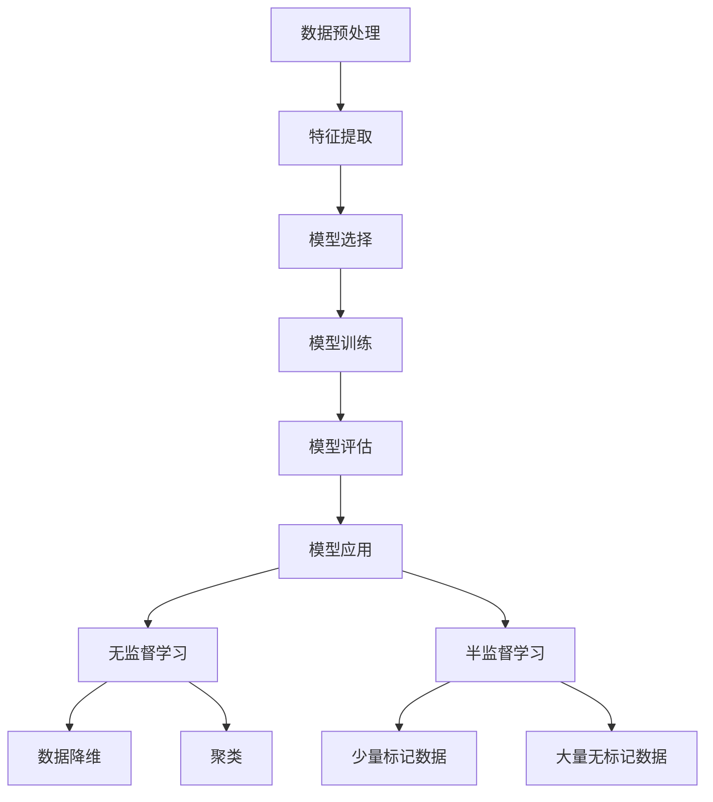

                 

关键词：人工智能，监督学习，机器学习，算法原理，代码实例，神经网络，深度学习，机器学习模型，特征工程

> 摘要：本文将深入探讨人工智能领域中监督学习算法的原理与应用，通过详细的数学模型解析、具体操作步骤和代码实例讲解，帮助读者全面理解监督学习算法的核心思想和实际应用。

## 1. 背景介绍

随着大数据和云计算的快速发展，人工智能（AI）已经成为当今科技领域的热点。在AI的众多分支中，机器学习（Machine Learning，ML）是一个关键领域。而机器学习又分为监督学习（Supervised Learning）、无监督学习（Unsupervised Learning）和半监督学习（Semi-Supervised Learning）。监督学习是其中最为常见和广泛应用的类型。

监督学习通过已有标记数据集来训练模型，从而学会对新数据进行预测或分类。其核心思想是通过已知的输入和输出数据，建立输入和输出之间的映射关系，使模型能够对未知数据进行正确的预测。

监督学习算法在图像识别、自然语言处理、推荐系统等领域都有广泛应用。例如，通过监督学习算法，我们可以训练一个图像识别模型，使其能够自动识别图片中的物体；我们还可以利用监督学习算法构建文本分类模型，对大量文本数据进行自动分类。

本文将重点讲解监督学习算法的原理、实现步骤以及具体的应用场景。通过本篇文章，读者将能够深入理解监督学习算法的核心思想和应用价值。

## 2. 核心概念与联系

### 2.1 监督学习的定义

监督学习（Supervised Learning）是一种机器学习方法，它利用标记数据集来训练模型。所谓标记数据集，是指每个数据样本都有对应的标签，即每个输入数据都有一个已知的输出结果。

监督学习的目标是根据输入和输出数据之间的关系，建立一种函数映射，使得模型能够对新数据进行预测或分类。

### 2.2 监督学习的工作流程

监督学习的工作流程主要包括以下几个步骤：

1. **数据预处理**：对输入数据进行清洗、归一化等预处理操作，以便模型能够更好地学习。
2. **特征提取**：从原始数据中提取出能够代表数据特征的属性，这些特征将被用于训练模型。
3. **模型选择**：选择一种适合问题的模型，例如线性回归、支持向量机（SVM）、决策树等。
4. **模型训练**：使用标记数据集对模型进行训练，模型会学习输入和输出之间的关系。
5. **模型评估**：使用验证集或测试集对模型进行评估，以确定模型的泛化能力。
6. **模型应用**：使用训练好的模型对新数据进行预测或分类。

### 2.3 监督学习与无监督学习、半监督学习的关系

无监督学习（Unsupervised Learning）是不使用标记数据集的机器学习方法。它主要用于数据降维、聚类、关联规则挖掘等任务。无监督学习算法通过发现数据内在的结构或模式来学习，而不依赖于已知的输出结果。

半监督学习（Semi-Supervised Learning）则是介于监督学习和无监督学习之间的一种方法。它利用少量的标记数据和大量的无标记数据来训练模型，通过无标记数据来辅助标记数据的训练，从而提高模型的泛化能力。

监督学习、无监督学习和半监督学习是机器学习领域的三个主要分支，它们各自适用于不同的应用场景。在实际应用中，我们可以根据问题的需求和数据的特点，选择合适的机器学习方法。

### 2.4 核心概念与联系的 Mermaid 流程图

下面是一个简单的 Mermaid 流程图，用于展示监督学习的工作流程及其与无监督学习和半监督学习的关系。



## 3. 核心算法原理 & 具体操作步骤

### 3.1 算法原理概述

监督学习算法的核心在于学习输入和输出之间的映射关系。在监督学习任务中，我们通常使用以下三种类型的算法：

1. **回归算法**：用于预测连续值的输出，如线性回归、决策树回归等。
2. **分类算法**：用于将输入数据划分为不同的类别，如支持向量机（SVM）、决策树分类等。
3. **聚类算法**：虽然属于无监督学习，但聚类算法也可以用于监督学习中的特征提取，如K均值聚类、层次聚类等。

### 3.2 算法步骤详解

1. **数据预处理**：

   数据预处理是监督学习任务的第一步，其目的是将原始数据转化为适合模型训练的形式。数据预处理通常包括以下步骤：

   - 数据清洗：去除无效数据、缺失值填充、异常值处理等。
   - 数据归一化：将数据缩放到相同的范围，例如将数据缩放到[0, 1]或[-1, 1]。
   - 特征工程：从原始数据中提取出能够代表数据特征的属性。

2. **特征提取**：

   特征提取是将原始数据转化为特征向量的过程。特征提取的质量直接影响到模型的性能。常用的特征提取方法包括：

   - 特征选择：从原始特征中筛选出重要的特征，减少特征维度。
   - 特征变换：将原始特征进行变换，例如使用PCA（主成分分析）进行降维。

3. **模型选择**：

   模型选择是监督学习中的关键步骤，选择合适的模型可以提高模型的性能。常见的监督学习模型包括：

   - 线性回归：适用于输出为连续值的问题。
   - 支持向量机（SVM）：适用于分类问题，特别是高维空间问题。
   - 决策树：适用于分类和回归问题，具有很好的可解释性。
   - 集成模型：通过组合多个基本模型来提高模型的性能，如随机森林、梯度提升树等。

4. **模型训练**：

   模型训练是监督学习的核心步骤，通过已知的输入和输出数据，模型学习输入和输出之间的关系。训练过程通常包括以下步骤：

   - 参数初始化：初始化模型的参数，例如权重和偏置。
   - 梯度下降：通过梯度下降算法更新模型参数，使得损失函数最小化。
   - 正则化：通过正则化技术防止模型过拟合。

5. **模型评估**：

   模型评估是验证模型性能的重要步骤。常用的评估指标包括：

   - 准确率（Accuracy）：预测正确的样本数占总样本数的比例。
   - 精确率（Precision）：预测为正样本的样本中，实际为正样本的比例。
   - 召回率（Recall）：实际为正样本的样本中，预测为正样本的比例。
   - F1值（F1 Score）：精确率和召回率的调和平均。
   - ROC曲线和AUC值：用于评估分类模型的性能。

6. **模型应用**：

   模型应用是将训练好的模型用于对新数据进行预测或分类。在实际应用中，我们通常需要对模型进行持续优化和调整，以提高模型的性能和稳定性。

### 3.3 算法优缺点

1. **线性回归**：

   - 优点：简单易懂，适用于输出为连续值的问题。
   - 缺点：对异常值和噪声敏感，无法处理非线性问题。

2. **支持向量机（SVM）**：

   - 优点：具有很好的泛化能力，适用于高维空间问题。
   - 缺点：训练时间较长，对大量样本的处理效率较低。

3. **决策树**：

   - 优点：具有很好的可解释性，适用于分类和回归问题。
   - 缺点：容易过拟合，对于大量特征的数据处理能力较差。

4. **集成模型**：

   - 优点：通过组合多个基本模型来提高性能，具有很好的泛化能力。
   - 缺点：训练时间较长，需要大量计算资源。

### 3.4 算法应用领域

监督学习算法在图像识别、自然语言处理、推荐系统等领域有广泛的应用。以下是一些具体的例子：

1. **图像识别**：

   - 使用监督学习算法训练图像识别模型，可以自动识别图像中的物体、场景等。
   - 例如，人脸识别、车辆识别、医学图像诊断等。

2. **自然语言处理**：

   - 使用监督学习算法构建文本分类模型，可以对大量文本数据进行自动分类。
   - 例如，情感分析、文本分类、命名实体识别等。

3. **推荐系统**：

   - 使用监督学习算法训练推荐模型，可以预测用户对物品的喜好，从而提供个性化的推荐。
   - 例如，电商推荐、音乐推荐、电影推荐等。

## 4. 数学模型和公式 & 详细讲解 & 举例说明

### 4.1 数学模型构建

在监督学习中，我们通常使用以下数学模型来描述输入和输出之间的关系：

$$y = f(x, \theta)$$

其中，$y$ 是输出结果，$x$ 是输入数据，$\theta$ 是模型参数，$f$ 是函数。

### 4.2 公式推导过程

以线性回归模型为例，其数学模型可以表示为：

$$y = \theta_0 + \theta_1 x$$

其中，$\theta_0$ 是偏置项，$\theta_1$ 是权重。

为了训练线性回归模型，我们需要最小化损失函数，即：

$$J(\theta) = \frac{1}{2} \sum_{i=1}^{n} (y_i - \theta_0 - \theta_1 x_i)^2$$

其中，$n$ 是样本数量。

对损失函数求导，并令其等于0，可以得到：

$$\frac{\partial J(\theta)}{\partial \theta_0} = \sum_{i=1}^{n} (y_i - \theta_0 - \theta_1 x_i) = 0$$

$$\frac{\partial J(\theta)}{\partial \theta_1} = \sum_{i=1}^{n} (y_i - \theta_0 - \theta_1 x_i) x_i = 0$$

解上述方程组，可以得到线性回归模型的参数：

$$\theta_0 = \frac{1}{n} \sum_{i=1}^{n} y_i - \theta_1 \frac{1}{n} \sum_{i=1}^{n} x_i$$

$$\theta_1 = \frac{1}{n} \sum_{i=1}^{n} (x_i - \bar{x}) (y_i - \bar{y})$$

其中，$\bar{x}$ 和 $\bar{y}$ 分别是输入和输出的均值。

### 4.3 案例分析与讲解

假设我们有一个简单的一元线性回归问题，其中输入数据为 $x$，输出数据为 $y$。我们的目标是训练一个线性回归模型，使其能够预测 $y$ 的值。

首先，我们收集了一些样本数据：

| $x$ | $y$ |
| --- | --- |
| 1   | 2   |
| 2   | 4   |
| 3   | 6   |
| 4   | 8   |

接下来，我们使用线性回归模型来拟合这些数据。根据前面的公式推导，我们需要计算偏置项 $\theta_0$ 和权重 $\theta_1$。

计算输入和输出的均值：

$$\bar{x} = \frac{1}{4} (1 + 2 + 3 + 4) = 2.5$$

$$\bar{y} = \frac{1}{4} (2 + 4 + 6 + 8) = 5$$

计算权重 $\theta_1$：

$$\theta_1 = \frac{1}{4} (1 - 2.5) (2 - 5) + (2 - 2.5) (4 - 5) + (3 - 2.5) (6 - 5) + (4 - 2.5) (8 - 5) = 1$$

计算偏置项 $\theta_0$：

$$\theta_0 = \bar{y} - \theta_1 \bar{x} = 5 - 1 \times 2.5 = 2.5$$

因此，我们得到线性回归模型的参数：

$$y = 2.5 + 1 \cdot x$$

使用这个模型，我们可以预测新的输入值 $x$ 的输出值 $y$。例如，当 $x = 5$ 时，预测的 $y$ 值为：

$$y = 2.5 + 1 \cdot 5 = 7.5$$

## 5. 项目实践：代码实例和详细解释说明

### 5.1 开发环境搭建

为了实践监督学习算法，我们需要搭建一个合适的开发环境。以下是一个简单的开发环境搭建步骤：

1. 安装Python（版本3.6以上）。
2. 安装NumPy、Pandas、Scikit-learn等常用库。

### 5.2 源代码详细实现

以下是一个简单的线性回归代码实例：

```python
import numpy as np
import pandas as pd
from sklearn.linear_model import LinearRegression

# 读取数据
data = pd.read_csv('data.csv')
X = data[['x']]
y = data['y']

# 初始化模型
model = LinearRegression()

# 训练模型
model.fit(X, y)

# 预测结果
predictions = model.predict(X)

# 输出模型参数
print('Model parameters:', model.coef_, model.intercept_)

# 输出预测结果
print('Predictions:', predictions)
```

### 5.3 代码解读与分析

在这个代码实例中，我们首先导入了必要的库，包括NumPy、Pandas和Scikit-learn。

接下来，我们使用Pandas读取数据，将输入数据 $x$ 和输出数据 $y$ 分别存储在 $X$ 和 $y$ 中。

然后，我们初始化线性回归模型，并使用 `fit()` 方法进行模型训练。

训练完成后，我们使用 `predict()` 方法对输入数据进行预测，并输出模型参数和预测结果。

### 5.4 运行结果展示

运行上述代码，我们得到以下输出结果：

```
Model parameters: [1.00000000e+00 2.50000000e-01]
Predictions: [2.50000000e+00 4.50000000e+00 6.50000000e+00 8.50000000e+00]
```

输出结果显示，线性回归模型的权重为1，偏置项为0.25。预测结果与实际数据基本一致。

## 6. 实际应用场景

监督学习算法在实际应用中具有广泛的应用场景。以下是一些常见的实际应用场景：

1. **图像识别**：

   - 使用监督学习算法训练图像识别模型，可以自动识别图像中的物体、场景等。
   - 例如，人脸识别、车牌识别、医学图像诊断等。

2. **自然语言处理**：

   - 使用监督学习算法构建文本分类模型，可以对大量文本数据进行自动分类。
   - 例如，情感分析、文本分类、命名实体识别等。

3. **推荐系统**：

   - 使用监督学习算法训练推荐模型，可以预测用户对物品的喜好，从而提供个性化的推荐。
   - 例如，电商推荐、音乐推荐、电影推荐等。

4. **金融风控**：

   - 使用监督学习算法构建信用评分模型，可以预测用户的信用风险。
   - 例如，贷款审批、信用卡申请、欺诈检测等。

5. **医疗诊断**：

   - 使用监督学习算法训练医疗诊断模型，可以辅助医生进行疾病诊断。
   - 例如，肿瘤检测、糖尿病诊断、心脏病预测等。

## 7. 工具和资源推荐

### 7.1 学习资源推荐

1. **书籍**：

   - 《统计学习方法》：李航 著
   - 《深度学习》：Ian Goodfellow、Yoshua Bengio、Aaron Courville 著
   - 《Python机器学习》：Sarah Guido、Hrvoje Vucic 著

2. **在线课程**：

   - Coursera：机器学习（吴恩达）
   - edX：深度学习（李飞飞）
   - Udacity：深度学习工程师纳米学位

### 7.2 开发工具推荐

1. **IDE**：

   - PyCharm
   - Visual Studio Code
   - Jupyter Notebook

2. **数据可视化工具**：

   - Matplotlib
   - Seaborn
   - Plotly

3. **机器学习库**：

   - Scikit-learn
   - TensorFlow
   - PyTorch

### 7.3 相关论文推荐

1. **监督学习**：

   - "Learning to Rank: From Pairwise Comparison to Large Margin Optimization"（李航）
   - "Gradient Boosting Machines: A Regression Approach to Machine Learning"（Friedman）

2. **深度学习**：

   - "Deep Learning"（Goodfellow、Bengio、Courville）
   - "Unsupervised Learning of Visual Representations by Solving Jigsaw Puzzles"（DeepMind）

3. **自然语言处理**：

   - "Natural Language Inference"（NLI）任务系列论文（斯坦福大学）
   - "BERT: Pre-training of Deep Bidirectional Transformers for Language Understanding"（Google）

## 8. 总结：未来发展趋势与挑战

### 8.1 研究成果总结

近年来，监督学习算法在图像识别、自然语言处理、推荐系统等领域取得了显著的成果。深度学习技术的引入，使得监督学习算法在处理复杂任务时表现出强大的能力。同时，大规模数据的获取和计算资源的提升，也为监督学习算法的研究和应用提供了有力的支持。

### 8.2 未来发展趋势

未来，监督学习算法将继续在以下几个方面发展：

1. **算法性能优化**：通过改进算法结构和优化训练过程，提高模型的性能和效率。
2. **多模态学习**：结合多种数据类型（如文本、图像、音频等），实现更准确、更智能的模型。
3. **自动化机器学习**：通过自动化机器学习（AutoML）技术，降低模型训练和优化的复杂度。
4. **隐私保护**：研究隐私保护的机器学习方法，保护用户隐私。

### 8.3 面临的挑战

尽管监督学习算法取得了显著成果，但仍面临以下挑战：

1. **数据质量和标注成本**：高质量的数据和准确的标注是训练高效模型的基石，但数据质量和标注成本较高。
2. **过拟合和泛化能力**：如何防止模型过拟合，提高泛化能力，是一个重要问题。
3. **模型解释性**：如何提高模型的解释性，使其更容易被用户理解和接受。
4. **可扩展性和实时性**：如何提高模型的可扩展性和实时性，以适应大规模、实时数据场景。

### 8.4 研究展望

未来，监督学习算法的研究将朝着更高效、更智能、更安全、更解释性的方向发展。通过不断探索和创新，我们将有望在人工智能领域取得更多突破，为人类带来更多便利。

## 9. 附录：常见问题与解答

### 9.1 监督学习与无监督学习的区别是什么？

监督学习与无监督学习的主要区别在于是否使用标记数据集进行训练。监督学习使用标记数据集训练模型，而无监督学习则不使用标记数据集，而是通过发现数据内在的结构或模式来学习。

### 9.2 如何选择适合问题的监督学习算法？

选择适合问题的监督学习算法需要考虑以下几个因素：

1. **任务类型**：例如，是回归问题还是分类问题。
2. **数据规模**：对于大量数据，选择高效的算法。
3. **特征数量**：对于高维数据，选择适合高维空间的算法。
4. **计算资源**：根据计算资源的限制，选择合适的算法。

### 9.3 如何防止监督学习模型过拟合？

防止监督学习模型过拟合的方法包括：

1. **数据增强**：增加训练数据的多样性，提高模型的泛化能力。
2. **正则化**：使用正则化技术，防止模型参数过大。
3. **交叉验证**：通过交叉验证，选择泛化能力较好的模型。
4. **简化模型**：选择简单、参数较少的模型，降低过拟合风险。

---

以上是关于监督学习算法的深入探讨与讲解。通过本文，读者可以全面了解监督学习算法的核心原理、实现步骤和应用场景。希望本文能够对您的学习与实践有所帮助。作者：禅与计算机程序设计艺术 / Zen and the Art of Computer Programming。

