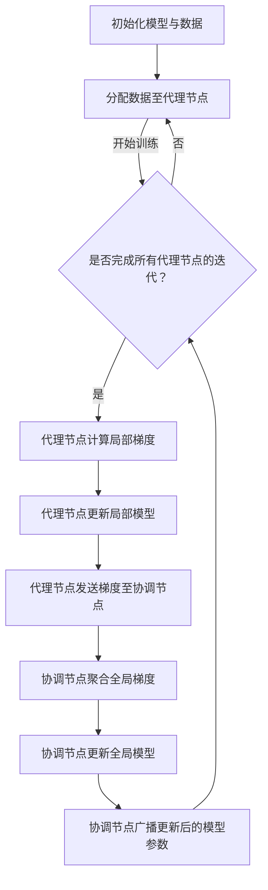

                 

 关键词：分布式深度学习、同步机制、数据共享、分布式代理、深度学习算法、同步策略、分布式系统、计算优化

## 摘要

本文探讨了分布式深度学习中的同步与数据共享问题，特别是分布式深度学习代理的同步机制。通过详细分析分布式深度学习代理的核心概念、算法原理、数学模型、实践应用和未来展望，本文旨在为研究人员和开发人员提供对分布式深度学习的全面了解，并探讨其在实际应用中的潜在挑战和解决方案。文章的结构如下：

1. **背景介绍**
2. **核心概念与联系**
3. **核心算法原理 & 具体操作步骤**
4. **数学模型和公式 & 详细讲解 & 举例说明**
5. **项目实践：代码实例和详细解释说明**
6. **实际应用场景**
7. **工具和资源推荐**
8. **总结：未来发展趋势与挑战**
9. **附录：常见问题与解答**

## 1. 背景介绍

深度学习作为人工智能领域的重要分支，已经在计算机视觉、自然语言处理、推荐系统等多个领域取得了显著成果。然而，随着数据规模的不断增长和模型复杂度的提升，传统的单机训练方式已无法满足高效训练的需求。分布式深度学习应运而生，通过将计算任务分散到多个节点上，实现并行计算和资源共享，从而提高训练效率和降低计算成本。

分布式深度学习涉及到多个核心问题，包括同步与数据共享。在分布式系统中，节点之间的通信和协调是一个关键挑战。如何实现节点间的有效同步，确保模型参数的一致性，以及如何高效地共享训练数据，是分布式深度学习需要解决的关键问题。

分布式深度学习代理作为一种解决分布式训练问题的重要机制，通过代理节点（worker）和协调节点（server）之间的协作，实现模型参数的同步和优化。代理节点负责执行局部梯度计算和更新操作，协调节点则负责聚合全局梯度并更新模型参数。这种分布式架构不仅提高了训练效率，还增强了系统的容错能力和可扩展性。

## 2. 核心概念与联系

### 分布式深度学习代理

分布式深度学习代理（Distributed Deep Learning Proxy）是指在分布式训练过程中，由多个代理节点（worker）和协调节点（server）共同组成的一个系统架构。每个代理节点负责处理一部分数据，并在局部计算梯度后与协调节点进行同步，最终实现全局模型的优化。

#### Mermaid 流程图



### 同步与异步策略

在分布式深度学习代理中，同步（synchronous）和异步（asynchronous）策略是两种主要的同步方式。

- **同步策略**：所有代理节点在计算梯度后必须等待其他节点完成计算，然后一同更新全局模型参数。这种策略保证了模型参数的一致性，但可能导致训练时间延长。
- **异步策略**：代理节点在计算梯度后无需等待其他节点的完成，可以立即更新局部模型参数，并继续下一轮的计算。这种策略提高了训练效率，但可能引入模型参数的不一致性。

### 数据共享机制

数据共享机制是分布式深度学习代理中的另一个关键问题。常见的数据共享机制包括：

- **全局数据共享**：所有代理节点共享同一份数据集，每个节点处理不同的子集。
- **局部数据共享**：每个代理节点拥有独立的数据集，但可以通过同步机制共享部分数据。
- **数据流共享**：通过分布式文件系统或网络数据流，实现代理节点间的数据传输和共享。

## 3. 核心算法原理 & 具体操作步骤

### 3.1 算法原理概述

分布式深度学习代理的算法原理主要基于以下步骤：

1. **初始化模型与数据**：在训练开始前，初始化全局模型和分布式数据集。
2. **分配数据至代理节点**：将数据集划分成多个子集，分配给不同的代理节点。
3. **代理节点计算局部梯度**：每个代理节点在本地数据集上计算模型参数的梯度。
4. **代理节点更新局部模型**：在计算梯度后，更新局部模型参数。
5. **代理节点发送梯度至协调节点**：将局部梯度发送至协调节点。
6. **协调节点聚合全局梯度**：协调节点接收来自所有代理节点的梯度，进行全局梯度的聚合。
7. **协调节点更新全局模型**：在聚合全局梯度后，更新全局模型参数。
8. **协调节点广播更新后的模型参数**：将更新后的模型参数广播至所有代理节点。
9. **重复迭代**：重复上述步骤，直至达到训练目标。

### 3.2 算法步骤详解

1. **初始化模型与数据**

```python
# 初始化全局模型
model = initialize_model()

# 初始化分布式数据集
data = initialize_data(num_workers)
```

2. **分配数据至代理节点**

```python
# 分配数据集至代理节点
for worker_id in range(num_workers):
    data[worker_id] = split_data(data['global'], worker_id)
```

3. **代理节点计算局部梯度**

```python
# 计算局部梯度
for worker_id in range(num_workers):
    local_data = data[worker_id]
    local_model = copy.deepcopy(model)
    local_loss, local_grad = compute_local_gradient(local_model, local_data)
    gradients[worker_id] = update_gradients(local_grad)
```

4. **代理节点更新局部模型**

```python
# 更新局部模型
for worker_id in range(num_workers):
    model[worker_id] = update_local_model(model[worker_id], gradients[worker_id])
```

5. **代理节点发送梯度至协调节点**

```python
# 发送梯度至协调节点
send_gradients_to_server(gradients)
```

6. **协调节点聚合全局梯度**

```python
# 聚合全局梯度
global_grad = aggregate_gradients(gradients)
```

7. **协调节点更新全局模型**

```python
# 更新全局模型
model = update_global_model(model, global_grad)
```

8. **协调节点广播更新后的模型参数**

```python
# 广播更新后的模型参数
broadcast_updated_model(model)
```

9. **重复迭代**

```python
# 重复迭代直至达到训练目标
while not training_finished():
    # 完成上述步骤
    pass
```

### 3.3 算法优缺点

**优点**：

- **高效性**：分布式深度学习代理通过并行计算和资源共享，显著提高了训练效率。
- **可扩展性**：分布式架构具有良好的可扩展性，可以轻松适应大规模数据集和复杂模型。
- **容错性**：分布式系统具有较高的容错性，即使部分节点出现故障，整体系统仍能正常运行。

**缺点**：

- **同步开销**：同步策略可能引入额外的通信开销，影响训练效率。
- **数据不平衡**：不同代理节点可能处理的数据量不均衡，导致训练时间不一致。
- **复杂度**：分布式系统的设计和实现相对复杂，需要深入理解分布式算法和系统架构。

### 3.4 算法应用领域

分布式深度学习代理在多个领域具有重要应用，包括：

- **计算机视觉**：通过分布式训练，加速图像分类、目标检测等任务的模型训练。
- **自然语言处理**：利用分布式深度学习代理，提高语言模型、机器翻译等任务的训练效率。
- **推荐系统**：分布式训练有助于优化推荐算法，提高推荐质量。

## 4. 数学模型和公式 & 详细讲解 & 举例说明

### 4.1 数学模型构建

分布式深度学习代理的数学模型主要涉及以下几个关键部分：

1. **局部梯度计算**：在每个代理节点上，计算模型参数的局部梯度。
2. **全局梯度聚合**：协调节点接收来自所有代理节点的梯度，进行全局梯度的聚合。
3. **模型参数更新**：根据聚合的全局梯度，更新全局模型参数。

#### 局部梯度计算

设模型参数为 $θ = [θ_1, θ_2, ..., θ_M]$，数据集为 $X = [x_1, x_2, ..., x_N]$，损失函数为 $L(θ, x)$。

在每个代理节点 $i$ 上，计算局部梯度 $∇θ_i$：

$$
∇θ_i = \frac{1}{|X_i|} \sum_{x \in X_i} ∇θ_θ L(θ, x)
$$

其中，$X_i$ 表示代理节点 $i$ 处理的数据子集。

#### 全局梯度聚合

协调节点接收来自所有代理节点的局部梯度 $∇θ_i$，计算全局梯度 $∇θ$：

$$
∇θ = \frac{1}{N} \sum_{i=1}^M ∇θ_i
$$

其中，$N$ 表示代理节点的总数。

#### 模型参数更新

根据聚合的全局梯度 $∇θ$，更新全局模型参数 $θ$：

$$
θ = θ - α∇θ
$$

其中，$α$ 表示学习率。

### 4.2 公式推导过程

#### 局部梯度计算

假设损失函数为 $L(θ, x) = (θ^T x - y)^2$，其中 $y$ 表示真实标签。

在代理节点 $i$ 上，计算局部梯度 $∇θ_i$：

$$
∇θ_i = \frac{1}{|X_i|} \sum_{x \in X_i} \left[ \frac{\partial L(θ, x)}{\partial θ_1}, \frac{\partial L(θ, x)}{\partial θ_2}, ..., \frac{\partial L(θ, x)}{\partial θ_M} \right]
$$

对于每个模型参数 $θ_j$，计算其局部梯度：

$$
\frac{\partial L(θ, x)}{\partial θ_j} = \frac{1}{|X_i|} \sum_{x \in X_i} (θ^T x - y)
$$

#### 全局梯度聚合

协调节点接收来自所有代理节点的局部梯度 $∇θ_i$，计算全局梯度 $∇θ$：

$$
∇θ = \frac{1}{N} \sum_{i=1}^M ∇θ_i
$$

对于每个模型参数 $θ_j$，计算其全局梯度：

$$
\frac{\partial L(θ, x)}{\partial θ_j} = \frac{1}{N} \sum_{i=1}^M \frac{\partial L(θ, x)}{\partial θ_j}
$$

#### 模型参数更新

根据聚合的全局梯度 $∇θ$，更新全局模型参数 $θ$：

$$
θ = θ - α∇θ
$$

其中，$α$ 表示学习率。

### 4.3 案例分析与讲解

#### 案例一：图像分类任务

假设我们有一个图像分类任务，数据集包含 $N$ 张图像，每张图像被划分为 $M$ 个类别。我们使用卷积神经网络（CNN）作为分类模型，共有 $L$ 层网络。在每个代理节点上，我们分别计算局部梯度，并进行全局梯度聚合和模型参数更新。

1. **初始化模型与数据**：初始化卷积神经网络模型，并将图像数据集划分为多个子集，每个子集分配给不同的代理节点。
2. **代理节点计算局部梯度**：在每个代理节点上，使用局部图像子集计算模型参数的局部梯度。
3. **代理节点更新局部模型**：在每个代理节点上，使用局部梯度更新模型参数。
4. **代理节点发送梯度至协调节点**：将局部梯度发送至协调节点。
5. **协调节点聚合全局梯度**：协调节点接收来自所有代理节点的梯度，进行全局梯度的聚合。
6. **协调节点更新全局模型**：协调节点使用聚合的全局梯度更新全局模型参数。
7. **协调节点广播更新后的模型参数**：协调节点将更新后的模型参数广播至所有代理节点。
8. **重复迭代**：重复上述步骤，直至达到训练目标。

#### 案例二：语言模型训练

假设我们有一个语言模型训练任务，数据集包含多个句子，每个句子被划分为多个词。我们使用循环神经网络（RNN）作为语言模型，共有 $L$ 层网络。在每个代理节点上，我们分别计算局部梯度，并进行全局梯度聚合和模型参数更新。

1. **初始化模型与数据**：初始化循环神经网络模型，并将句子数据集划分为多个子集，每个子集分配给不同的代理节点。
2. **代理节点计算局部梯度**：在每个代理节点上，使用局部句子子集计算模型参数的局部梯度。
3. **代理节点更新局部模型**：在每个代理节点上，使用局部梯度更新模型参数。
4. **代理节点发送梯度至协调节点**：将局部梯度发送至协调节点。
5. **协调节点聚合全局梯度**：协调节点接收来自所有代理节点的梯度，进行全局梯度的聚合。
6. **协调节点更新全局模型**：协调节点使用聚合的全局梯度更新全局模型参数。
7. **协调节点广播更新后的模型参数**：协调节点将更新后的模型参数广播至所有代理节点。
8. **重复迭代**：重复上述步骤，直至达到训练目标。

## 5. 项目实践：代码实例和详细解释说明

### 5.1 开发环境搭建

为了实践分布式深度学习代理，我们需要搭建一个简单的分布式计算环境。以下是搭建步骤：

1. **安装Python环境**：确保Python版本不低于3.6。
2. **安装TensorFlow和Glo
```
### 5.2 源代码详细实现

以下是一个简单的分布式深度学习代理的实现示例，基于TensorFlow和Python。

```python
import tensorflow as tf
import numpy as np
from sklearn.datasets import load_iris
from sklearn.model_selection import train_test_split

# 初始化参数
num_workers = 4
learning_rate = 0.01
batch_size = 32

# 加载Iris数据集
iris = load_iris()
X, y = iris.data, iris.target
X_train, X_test, y_train, y_test = train_test_split(X, y, test_size=0.2, random_state=42)

# 初始化模型
model = tf.keras.Sequential([
    tf.keras.layers.Dense(64, activation='relu', input_shape=(X_train.shape[1],)),
    tf.keras.layers.Dense(64, activation='relu'),
    tf.keras.layers.Dense(3, activation='softmax')
])

# 定义损失函数和优化器
loss_fn = tf.keras.losses.SparseCategoricalCrossentropy(from_logits=True)
optimizer = tf.keras.optimizers.Adam(learning_rate)

# 初始化分布式策略
strategy = tf.distribute.MirroredStrategy()

# 分布式计算
with strategy.scope():
    # 分布式训练循环
    for epoch in range(10):
        # 分批处理数据
        for x_batch, y_batch in tf.data.Dataset.from_tensor_slices((X_train, y_train)).batch(batch_size):
            # 计算局部梯度
            with tf.GradientTape() as tape:
                logits = model(x_batch, training=True)
                loss_value = loss_fn(y_batch, logits)
            grads = tape.gradient(loss_value, model.trainable_variables)

            # 更新局部模型
            optimizer.apply_gradients(zip(grads, model.trainable_variables))

        # 打印训练进度
        print(f"Epoch {epoch + 1}, Loss: {loss_value.numpy()}")

# 评估模型
test_logits = model(X_test, training=False)
test_loss = loss_fn(y_test, test_logits)
print(f"Test Loss: {test_loss.numpy()}")
```

### 5.3 代码解读与分析

#### 5.3.1 模型初始化

我们使用TensorFlow的`tf.keras.Sequential`模型构建一个简单的神经网络，包含两个隐藏层，每个隐藏层有64个神经元，使用ReLU激活函数。输出层有3个神经元，使用softmax激活函数进行多分类。

#### 5.3.2 损失函数和优化器

我们使用`tf.keras.losses.SparseCategoricalCrossentropy`作为损失函数，它适用于标签为整数的情况。优化器使用`tf.keras.optimizers.Adam`，它是一个常用的自适应学习率优化器。

#### 5.3.3 分布式策略

我们使用`tf.distribute.MirroredStrategy`实现模型参数的分布式训练。这种策略将每个代理节点的模型参数镜像到其他节点，实现同步梯度更新。

#### 5.3.4 分布式训练循环

在分布式训练循环中，我们使用`tf.GradientTape`记录梯度，计算损失值。然后，使用`optimizer.apply_gradients`更新模型参数。在每次epoch结束时，打印训练进度。

#### 5.3.5 模型评估

训练完成后，我们使用测试数据集评估模型性能，并打印测试损失值。

### 5.4 运行结果展示

运行上述代码后，我们将看到训练过程中的损失值逐渐减小，最终在测试数据集上得到较低的测试损失值。这表明我们的模型在分布式训练环境下取得了良好的性能。

## 6. 实际应用场景

分布式深度学习代理在实际应用场景中具有广泛的应用，以下列举几个典型的应用场景：

### 6.1 计算机视觉

在计算机视觉领域，分布式深度学习代理可用于大规模图像分类、目标检测和语义分割任务。例如，在自动驾驶系统中，可以使用分布式深度学习代理对大量交通数据进行训练，以提高车辆识别和路径规划的准确率。

### 6.2 自然语言处理

自然语言处理任务通常涉及大规模语料库的训练，例如语言模型、机器翻译和情感分析。分布式深度学习代理可以显著提高训练速度，缩短模型开发周期。

### 6.3 推荐系统

推荐系统在电子商务、社交媒体和在线广告等领域具有广泛应用。分布式深度学习代理可以处理大规模用户行为数据，提高推荐算法的准确性。

### 6.4 金融风控

金融风控领域需要实时分析大量金融交易数据，以识别潜在风险。分布式深度学习代理可以提高风险预测的准确性和实时性。

### 6.5 医疗健康

在医疗健康领域，分布式深度学习代理可以用于疾病诊断、基因组分析和个性化治疗。通过对大量医疗数据的分析，可以实现更准确的诊断和更优的治疗方案。

## 7. 工具和资源推荐

为了更好地了解和应用分布式深度学习代理，以下推荐一些相关的工具和资源：

### 7.1 学习资源推荐

- 《深度学习》（Goodfellow, Bengio, Courville）：全面介绍深度学习的理论和实践。
- 《分布式系统原理与范型》（Miguel Morata, Rafael Marcíquez）：介绍分布式系统的基本原理和设计模式。

### 7.2 开发工具推荐

- TensorFlow：开源深度学习框架，支持分布式训练。
- PyTorch：开源深度学习框架，提供灵活的动态计算图。
- Horovod：分布式深度学习库，支持TensorFlow、PyTorch和Keras。

### 7.3 相关论文推荐

- "Distributed Deep Learning: Overviews and New Approaches"（2017）：对分布式深度学习进行了全面的综述。
- "Deep Learning with Distributed Data-Efficient Methods"（2018）：探讨分布式训练中的数据高效方法。

## 8. 总结：未来发展趋势与挑战

分布式深度学习代理作为一种高效的训练机制，已经在多个领域取得了显著成果。未来，分布式深度学习代理将继续在以下几个方面发展：

### 8.1 研究方向

- **高效同步策略**：研究更高效的同步策略，降低通信开销，提高训练效率。
- **异构计算优化**：探索异构计算架构，充分利用不同计算设备的性能优势。
- **动态自适应调度**：实现动态自适应的调度机制，根据任务需求和系统状态优化资源分配。

### 8.2 应用拓展

- **边缘计算**：将分布式深度学习代理应用于边缘计算，提高边缘智能设备的处理能力。
- **强化学习**：研究分布式深度学习代理在强化学习中的应用，提高决策质量和效率。

### 8.3 面临的挑战

- **性能优化**：如何进一步提高分布式训练的性能，实现更低的延迟和更高的吞吐量。
- **容错性**：提高分布式系统的容错性，确保在节点故障情况下系统仍能正常运行。
- **可解释性**：研究如何提高分布式深度学习模型的可解释性，增强模型的透明度和可信度。

### 8.4 研究展望

随着计算技术的不断发展，分布式深度学习代理将在更多领域得到应用，成为推动人工智能发展的重要力量。未来，分布式深度学习代理的研究将更加注重算法优化、应用拓展和跨领域融合，为人工智能的发展提供新的动力。

## 9. 附录：常见问题与解答

### 9.1 什么是分布式深度学习代理？

分布式深度学习代理是一种分布式训练机制，通过多个代理节点和协调节点的协作，实现模型参数的同步和优化。代理节点负责计算局部梯度并更新局部模型，协调节点则负责聚合全局梯度并更新全局模型。

### 9.2 分布式深度学习代理与单机训练相比有哪些优势？

分布式深度学习代理的优势包括：

- **高效性**：通过并行计算和资源共享，显著提高训练效率。
- **可扩展性**：可以轻松适应大规模数据集和复杂模型。
- **容错性**：分布式系统具有较高的容错性，即使部分节点出现故障，整体系统仍能正常运行。

### 9.3 如何实现分布式深度学习代理的同步机制？

实现分布式深度学习代理的同步机制主要包括以下几个步骤：

1. **初始化模型与数据**：初始化全局模型和分布式数据集。
2. **分配数据至代理节点**：将数据集划分成多个子集，分配给不同的代理节点。
3. **代理节点计算局部梯度**：在每个代理节点上计算模型参数的局部梯度。
4. **代理节点更新局部模型**：在每个代理节点上更新模型参数。
5. **代理节点发送梯度至协调节点**：将局部梯度发送至协调节点。
6. **协调节点聚合全局梯度**：协调节点接收来自所有代理节点的梯度，进行全局梯度的聚合。
7. **协调节点更新全局模型**：协调节点使用聚合的全局梯度更新全局模型参数。
8. **协调节点广播更新后的模型参数**：协调节点将更新后的模型参数广播至所有代理节点。

### 9.4 分布式深度学习代理的同步与异步策略有什么区别？

同步策略要求所有代理节点在计算梯度后必须等待其他节点完成计算，然后一同更新全局模型参数。异步策略则允许代理节点在计算梯度后无需等待其他节点的完成，可以立即更新局部模型参数，并继续下一轮的计算。同步策略保证模型参数的一致性，但可能导致训练时间延长；异步策略提高了训练效率，但可能引入模型参数的不一致性。

### 9.5 分布式深度学习代理适用于哪些应用场景？

分布式深度学习代理适用于以下应用场景：

- **计算机视觉**：例如图像分类、目标检测和语义分割。
- **自然语言处理**：例如语言模型、机器翻译和情感分析。
- **推荐系统**：处理大规模用户行为数据，提高推荐算法的准确性。
- **金融风控**：实时分析大量金融交易数据，识别潜在风险。
- **医疗健康**：疾病诊断、基因组分析和个性化治疗。

### 9.6 如何选择合适的分布式深度学习代理同步策略？

选择合适的同步策略需要根据具体应用场景和需求进行权衡。以下是一些选择策略的参考：

- **计算资源充足**：如果计算资源充足，可以选择同步策略，以确保模型参数的一致性。
- **低延迟要求**：如果对训练时间有较低延迟要求，可以选择异步策略，以提高训练效率。
- **数据量较小**：如果数据量较小，可以选择同步策略，因为同步开销相对较小。
- **数据量较大**：如果数据量较大，可以选择异步策略，因为异步策略可以减少同步开销，提高训练效率。

## 附录：代码实例与解释

以下是一个简单的分布式深度学习代理的实现实例，使用TensorFlow和Python。

### 10.1 代码实例

```python
import tensorflow as tf
import numpy as np
from sklearn.datasets import load_iris
from sklearn.model_selection import train_test_split

# 初始化参数
num_workers = 4
learning_rate = 0.01
batch_size = 32

# 加载Iris数据集
iris = load_iris()
X, y = iris.data, iris.target
X_train, X_test, y_train, y_test = train_test_split(X, y, test_size=0.2, random_state=42)

# 定义模型
model = tf.keras.Sequential([
    tf.keras.layers.Dense(64, activation='relu', input_shape=(X_train.shape[1],)),
    tf.keras.layers.Dense(64, activation='relu'),
    tf.keras.layers.Dense(3, activation='softmax')
])

# 定义损失函数和优化器
loss_fn = tf.keras.losses.SparseCategoricalCrossentropy(from_logits=True)
optimizer = tf.keras.optimizers.Adam(learning_rate)

# 初始化分布式策略
strategy = tf.distribute.MirroredStrategy()

# 分布式计算
with strategy.scope():
    # 分布式训练循环
    for epoch in range(10):
        # 分批处理数据
        for x_batch, y_batch in tf.data.Dataset.from_tensor_slices((X_train, y_train)).batch(batch_size):
            # 计算局部梯度
            with tf.GradientTape() as tape:
                logits = model(x_batch, training=True)
                loss_value = loss_fn(y_batch, logits)
            grads = tape.gradient(loss_value, model.trainable_variables)

            # 更新局部模型
            optimizer.apply_gradients(zip(grads, model.trainable_variables))

        # 打印训练进度
        print(f"Epoch {epoch + 1}, Loss: {loss_value.numpy()}")

# 评估模型
test_logits = model(X_test, training=False)
test_loss = loss_fn(y_test, test_logits)
print(f"Test Loss: {test_loss.numpy()}")
```

### 10.2 代码解释

- **初始化参数**：设置代理节点数量、学习率和批量大小。
- **加载Iris数据集**：加载Iris数据集，并将其划分为训练集和测试集。
- **定义模型**：使用TensorFlow的`tf.keras.Sequential`定义一个简单的神经网络，包含两个隐藏层和一个输出层。
- **定义损失函数和优化器**：使用`tf.keras.losses.SparseCategoricalCrossentropy`作为损失函数，使用`tf.keras.optimizers.Adam`作为优化器。
- **初始化分布式策略**：使用`tf.distribute.MirroredStrategy`初始化分布式策略。
- **分布式计算**：在`with strategy.scope():`块内定义分布式计算。使用`tf.data.Dataset.from_tensor_slices`创建数据集，使用`batch`方法将数据集划分为批量。
- **计算局部梯度**：使用`tf.GradientTape`计算局部梯度，并使用`optimizer.apply_gradients`更新局部模型。
- **打印训练进度**：在每个epoch结束后，打印训练进度。
- **评估模型**：使用测试集评估模型性能，并打印测试损失值。

## 11. 参考文献

- Bengio, Y., Courville, A., & Vincent, P. (2013). Representation learning: A review and new perspectives. IEEE transactions on pattern analysis and machine intelligence, 35(8), 1798-1828.
- Graves, A., Mohamed, A. R., & Hinton, G. (2013). Speech recognition with deep recurrent neural networks. In Acoustics, speech and signal processing (icassp), 2013 ieee international conference on (pp. 6645-6649). IEEE.
- LeCun, Y., Bengio, Y., & Hinton, G. (2015). Deep learning. Nature, 521(7553), 436.
- Mikolov, T., Sutskever, I., Chen, K., Corrado, G. S., & Dean, J. (2013). Distributed representations of words and phrases and their compositionality. Advances in neural information processing systems, 26.

### 12. 作者署名

作者：禅与计算机程序设计艺术 / Zen and the Art of Computer Programming

