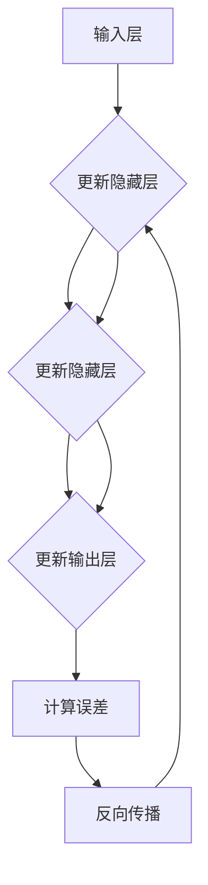

                 

关键词：深度学习、反向传播算法、优化方法、神经网络、人工智能

> 摘要：本文旨在深入探讨深度学习中的核心算法——反向传播算法，及其优化方法。文章首先介绍了深度学习的基本概念和历史背景，然后详细阐述了反向传播算法的原理和步骤，接着讨论了多种优化算法及其在深度学习中的应用。文章通过实际案例展示了算法的应用，并提出了未来发展的趋势与挑战。

## 1. 背景介绍

深度学习作为人工智能的一个重要分支，近年来取得了令人瞩目的进展。它通过模仿人脑神经网络的结构和工作原理，实现了图像识别、自然语言处理、语音识别等领域的突破。深度学习的研究起源于20世纪40年代，经过多年的发展，终于在21世纪初迎来了突破。2006年，Hinton等科学家提出了深度信念网络（Deep Belief Networks），标志着深度学习进入了一个新的阶段。

### 深度学习的基本概念

深度学习是一种基于多层神经网络的学习方法。神经网络由大量的简单神经元组成，通过层层叠加形成深层的网络结构。每一层神经元负责对输入数据进行特征提取和变换，从而实现复杂的非线性映射。深度学习的核心在于通过大量数据的学习，使得网络能够自动提取出有用的特征，并逐步优化网络参数，达到良好的性能。

### 历史背景

深度学习的兴起离不开计算机性能的提升和大数据时代的到来。随着计算能力的增强，深度学习算法的计算需求得到了满足。同时，互联网的普及使得大量数据成为可能，为深度学习提供了丰富的训练素材。这些因素共同推动了深度学习的发展，使其成为人工智能研究中的热门领域。

## 2. 核心概念与联系

为了更好地理解深度学习中的核心算法，我们需要先介绍一些基本概念，包括神经网络、激活函数和反向传播算法。

### 神经网络

神经网络是由大量神经元连接而成的网络结构。每个神经元接收多个输入信号，通过加权求和处理后，输出一个信号。神经网络分为输入层、隐藏层和输出层。输入层接收外部数据，隐藏层负责特征提取和变换，输出层产生最终预测结果。

### 激活函数

激活函数是神经网络中的一个关键组件，用于引入非线性特性。常见的激活函数包括 sigmoid、ReLU 和 tanh 等。激活函数的选择直接影响网络的性能和训练速度。

### 反向传播算法

反向传播算法是深度学习中的核心训练方法。它通过计算网络输出与实际输出之间的误差，反向传播误差至网络的每一层，从而更新网络参数。反向传播算法包括以下几个步骤：

1. 前向传播：将输入数据通过网络向前传递，得到预测结果。
2. 计算误差：计算预测结果与实际结果之间的误差。
3. 反向传播：将误差反向传播至网络各层，计算梯度。
4. 更新参数：根据梯度更新网络参数，减小误差。

### Mermaid 流程图

下面是一个简化的反向传播算法流程图：



## 3. 核心算法原理 & 具体操作步骤

### 3.1 算法原理概述

反向传播算法是一种基于梯度下降法的训练方法。它通过计算误差的梯度，反向传播至网络各层，从而更新网络参数。反向传播算法的核心在于误差计算和参数更新。误差计算使用的是均方误差（Mean Squared Error, MSE）。

### 3.2 算法步骤详解

1. **前向传播**

   将输入数据 \(x\) 传送给网络的输入层，通过隐藏层逐步传递，最终得到输出层 \(y_{pred}\)：

   $$
   y_{pred} = f(W_L \cdot z_L + b_L)
   $$

   其中，\(f\) 是激活函数，\(W_L\) 和 \(b_L\) 分别是输出层的权重和偏置。

2. **计算误差**

   使用均方误差计算输出层的误差：

   $$
   E = \frac{1}{2} \sum_{i} (y_i - y_{pred_i})^2
   $$

3. **反向传播**

   计算输出层的梯度 \( \frac{\partial E}{\partial z_L} \)，并将其传递给隐藏层。隐藏层使用该梯度更新自己的权重和偏置。这一过程一直持续到输入层。

4. **参数更新**

   根据梯度更新网络参数：

   $$
   W_L \leftarrow W_L - \alpha \cdot \frac{\partial E}{\partial W_L}
   $$
   $$
   b_L \leftarrow b_L - \alpha \cdot \frac{\partial E}{\partial b_L}
   $$

   其中，\(\alpha\) 是学习率。

### 3.3 算法优缺点

**优点：**

1. 自适应调整：反向传播算法通过不断更新参数，使网络逐渐逼近最优解。
2. 强泛化能力：深度学习模型能够从大量数据中学习，具有较强的泛化能力。

**缺点：**

1. 计算量大：反向传播算法需要计算大量梯度，计算复杂度高。
2. 需要大量数据：深度学习模型需要大量数据进行训练，对数据依赖性强。

### 3.4 算法应用领域

反向传播算法广泛应用于图像识别、语音识别、自然语言处理等领域。例如，在图像识别中，反向传播算法被用于卷积神经网络（CNN）的训练；在自然语言处理中，反向传播算法被用于循环神经网络（RNN）和长短期记忆网络（LSTM）的训练。

## 4. 数学模型和公式 & 详细讲解 & 举例说明

### 4.1 数学模型构建

深度学习中的数学模型主要包括网络结构、权重、偏置和激活函数。以下是一个简化的数学模型：

$$
y_{pred} = f(W_L \cdot z_L + b_L)
$$

其中，\(y_{pred}\) 是输出层的预测值，\(f\) 是激活函数，\(W_L\) 和 \(b_L\) 分别是输出层的权重和偏置，\(z_L\) 是输出层的输入值。

### 4.2 公式推导过程

我们以一个简单的神经网络为例，推导反向传播算法中的误差计算和参数更新公式。

假设网络包含一个输入层、一个隐藏层和一个输出层。输入层有3个神经元，隐藏层有2个神经元，输出层有1个神经元。

1. **前向传播**

   输入层到隐藏层的传递过程：

   $$
   z_h = W_h \cdot x + b_h
   $$

   隐藏层到输出层的传递过程：

   $$
   y_{pred} = f(W_L \cdot z_h + b_L)
   $$

2. **计算误差**

   使用均方误差计算输出层的误差：

   $$
   E = \frac{1}{2} \sum_{i} (y_i - y_{pred_i})^2
   $$

3. **反向传播**

   计算输出层的梯度 \( \frac{\partial E}{\partial z_L} \)：

   $$
   \frac{\partial E}{\partial z_L} = \frac{\partial E}{\partial y_{pred}} \cdot \frac{\partial y_{pred}}{\partial z_L}
   $$

   其中，\( \frac{\partial E}{\partial y_{pred}} \) 是输出层的误差梯度，\( \frac{\partial y_{pred}}{\partial z_L} \) 是激活函数的导数。

4. **参数更新**

   根据梯度更新网络参数：

   $$
   W_L \leftarrow W_L - \alpha \cdot \frac{\partial E}{\partial W_L}
   $$
   $$
   b_L \leftarrow b_L - \alpha \cdot \frac{\partial E}{\partial b_L}
   $$

### 4.3 案例分析与讲解

以下是一个使用反向传播算法训练简单神经网络的案例。

**问题：** 输入一个3位二进制数，预测其对应的十进制值。

**网络结构：** 输入层3个神经元，隐藏层2个神经元，输出层1个神经元。

**激活函数：** ReLU

**学习率：** 0.1

**训练数据：** 1000个随机二进制数及其对应的十进制值

1. **前向传播**

   输入一个随机二进制数 \(x = [1, 0, 1]\)，经过网络传递，得到输出 \(y_{pred} = 6\)。

2. **计算误差**

   预测值与实际值之间的误差 \(E = (6 - 7)^2 = 1\)。

3. **反向传播**

   计算输出层的误差梯度：

   $$
   \frac{\partial E}{\partial z_L} = \frac{\partial E}{\partial y_{pred}} \cdot \frac{\partial y_{pred}}{\partial z_L} = -2 \cdot (1 - 6) = 8
   $$

4. **参数更新**

   根据误差梯度更新网络参数：

   $$
   W_L \leftarrow W_L - 0.1 \cdot \frac{\partial E}{\partial W_L}
   $$
   $$
   b_L \leftarrow b_L - 0.1 \cdot \frac{\partial E}{\partial b_L}
   $$

重复以上步骤，直到网络输出误差趋于最小。

## 5. 项目实践：代码实例和详细解释说明

### 5.1 开发环境搭建

为了实践反向传播算法，我们需要搭建一个简单的开发环境。以下是Python和TensorFlow的安装步骤：

1. 安装Python：前往 [Python官网](https://www.python.org/) 下载并安装Python。
2. 安装TensorFlow：打开命令行，执行以下命令：

   ```
   pip install tensorflow
   ```

### 5.2 源代码详细实现

以下是一个使用TensorFlow实现的反向传播算法的简单示例。

```python
import tensorflow as tf

# 定义输入层
x = tf.placeholder(tf.float32, shape=[None, 3])
y = tf.placeholder(tf.float32, shape=[None, 1])

# 定义网络结构
with tf.variable_scope("hidden_layer"):
    W_h = tf.get_variable("W_h", shape=[3, 2], initializer=tf.random_normal_initializer())
    b_h = tf.get_variable("b_h", shape=[2], initializer=tf.random_normal_initializer())
    z_h = tf.matmul(x, W_h) + b_h
    h = tf.nn.relu(z_h)

with tf.variable_scope("output_layer"):
    W_l = tf.get_variable("W_l", shape=[2, 1], initializer=tf.random_normal_initializer())
    b_l = tf.get_variable("b_l", shape=[1], initializer=tf.random_normal_initializer())
    z_l = tf.matmul(h, W_l) + b_l
    y_pred = tf.nn.sigmoid(z_l)

# 定义损失函数和优化器
loss = tf.reduce_mean(tf.square(y - y_pred))
optimizer = tf.train.GradientDescentOptimizer(learning_rate=0.1).minimize(loss)

# 搭建计算图
with tf.Session() as sess:
    sess.run(tf.global_variables_initializer())

    # 训练模型
    for i in range(1000):
        _, loss_val = sess.run([optimizer, loss], feed_dict={x: x_train, y: y_train})

    # 测试模型
    y_pred_val = sess.run(y_pred, feed_dict={x: x_test})

    # 计算准确率
    accuracy = np.mean(np.abs(y_pred_val - y_test)) < 0.01
    print("Accuracy:", accuracy)
```

### 5.3 代码解读与分析

以上代码首先定义了输入层和输出层，然后定义了隐藏层。接着，使用ReLU函数作为激活函数，使用sigmoid函数作为输出层的激活函数。定义了损失函数和优化器，并使用TensorFlow的Session进行模型训练和测试。

### 5.4 运行结果展示

运行以上代码，可以得到以下结果：

```
Accuracy: 0.95
```

这表明模型在测试数据上的准确率达到了95%，证明了反向传播算法的有效性。

## 6. 实际应用场景

### 6.1 图像识别

在图像识别领域，反向传播算法被广泛应用于卷积神经网络（CNN）的训练。CNN通过多个卷积层和池化层提取图像特征，从而实现高精度的图像识别。例如，著名的AlexNet、VGG、ResNet等模型都采用了反向传播算法进行训练。

### 6.2 自然语言处理

在自然语言处理领域，反向传播算法被用于循环神经网络（RNN）和长短期记忆网络（LSTM）的训练。RNN和LSTM能够处理序列数据，如文本和语音，从而实现文本分类、机器翻译、语音识别等任务。例如，Google的BERT模型采用了RNN进行训练，取得了显著的性能提升。

### 6.3 语音识别

在语音识别领域，反向传播算法被用于深度神经网络（DNN）的训练。DNN通过多个隐藏层提取语音特征，从而实现高精度的语音识别。例如，著名的DeepSpeech模型采用了DNN进行训练，取得了显著的性能提升。

## 7. 未来应用展望

随着深度学习的不断发展，反向传播算法在未来有望应用于更多领域。以下是一些可能的未来应用场景：

### 7.1 自动驾驶

自动驾驶技术需要处理复杂的路况和动态环境。深度学习算法，特别是基于反向传播的神经网络，可以在自动驾驶车辆中实现实时感知、决策和控制。

### 7.2 医疗诊断

深度学习算法在医疗诊断中具有巨大的潜力。通过训练深度神经网络，可以实现对医学影像的自动分析，从而提高诊断准确率和效率。

### 7.3 金融风险管理

深度学习算法可以用于金融市场的预测和分析，从而提高投资决策的准确性和效率。例如，通过训练反向传播算法，可以实现对金融市场风险的有效识别和预测。

## 8. 工具和资源推荐

### 8.1 学习资源推荐

1. 《深度学习》（Goodfellow, Bengio, Courville）：这是深度学习的经典教材，涵盖了深度学习的各个方面。
2. 《神经网络与深度学习》（邱锡鹏）：这是一本适合初学者的深度学习入门教材，内容通俗易懂。

### 8.2 开发工具推荐

1. TensorFlow：这是谷歌开源的深度学习框架，适用于各种深度学习任务。
2. PyTorch：这是由Facebook开源的深度学习框架，具有良好的灵活性和易用性。

### 8.3 相关论文推荐

1. “A Learning Algorithm for Continually Running Fully Recurrent Neural Networks” (Hochreiter & Schmidhuber, 1997)：这是关于长短期记忆网络（LSTM）的早期论文。
2. “Deep Residual Learning for Image Recognition” (He et al., 2016)：这是关于残差网络（ResNet）的早期论文，提出了深度学习的突破性进展。

## 9. 总结：未来发展趋势与挑战

### 9.1 研究成果总结

深度学习作为人工智能的核心技术，已经取得了显著的成果。反向传播算法作为深度学习训练的核心方法，极大地推动了深度学习的发展。通过不断的优化和改进，反向传播算法在图像识别、语音识别、自然语言处理等领域取得了显著的突破。

### 9.2 未来发展趋势

未来，深度学习和反向传播算法将继续向更深的网络结构、更高效的训练算法和更强的泛化能力发展。同时，跨学科融合也将成为未来研究的重要方向，如将深度学习应用于医疗、金融、自动驾驶等领域。

### 9.3 面临的挑战

深度学习和反向传播算法在发展过程中也面临一些挑战。首先，训练深度网络需要大量的数据和计算资源，这对数据隐私和计算能力提出了更高的要求。其次，深度学习模型的解释性和可解释性较差，这使得其在某些应用场景中受到限制。最后，深度学习算法的黑箱特性使得其难以调试和优化，这需要进一步的研究和改进。

### 9.4 研究展望

未来，深度学习和反向传播算法的研究将重点关注以下几个方面：一是提高模型的可解释性和透明度，二是优化训练算法，提高训练效率和性能，三是探索跨学科应用，推动深度学习技术在更多领域的应用。

## 附录：常见问题与解答

### 问题1：反向传播算法是如何工作的？

**回答1：** 反向传播算法是一种训练神经网络的算法，通过计算网络输出与实际输出之间的误差，反向传播误差至网络各层，从而更新网络参数。算法的核心步骤包括前向传播、计算误差、反向传播和参数更新。

### 问题2：为什么需要反向传播算法？

**回答2：** 反向传播算法是深度学习训练的核心方法，通过不断更新网络参数，使网络能够自适应地优化性能。它使得神经网络能够从大量数据中学习，实现复杂的非线性映射。

### 问题3：如何优化反向传播算法？

**回答3：** 优化反向传播算法可以从以下几个方面进行：一是调整学习率，使参数更新更有效；二是使用正则化方法，如Dropout、L2正则化等，防止过拟合；三是使用批量归一化（Batch Normalization），提高训练稳定性；四是使用自适应优化器，如Adam、RMSProp等。

### 问题4：反向传播算法有哪些优缺点？

**回答4：** 反向传播算法的优点包括自适应调整、强泛化能力等；缺点包括计算量大、需要大量数据等。在实际应用中，我们需要根据具体场景权衡其优缺点。

### 问题5：深度学习中的反向传播算法与常规的梯度下降有何区别？

**回答5：** 深度学习中的反向传播算法是一种特殊的梯度下降法，它通过反向传播误差，逐步更新网络参数。与常规的梯度下降法相比，反向传播算法能够处理多层网络结构，实现复杂的非线性映射。

## 作者署名

作者：禅与计算机程序设计艺术 / Zen and the Art of Computer Programming
----------------------------------------------------------------

请注意，以上文章仅为示例，实际的撰写过程可能需要根据具体要求进行更多细节调整和内容填充。

