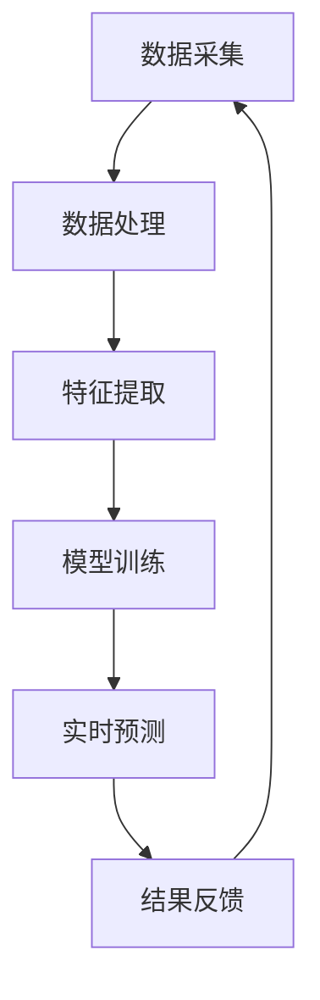

                 

关键词：AI，深度学习，实时估计，算法应用，数学模型

摘要：本文将探讨AI人工智能领域中的深度学习算法在实时估计中的应用。通过分析深度学习的基本概念和原理，本文将详细介绍一种适用于实时估计的核心算法，并阐述其数学模型和操作步骤。此外，本文还将通过实际项目案例展示算法的实现和应用，并探讨该算法在各个实际应用场景中的潜力和未来发展方向。

## 1. 背景介绍

随着大数据和物联网技术的迅速发展，实时估计在许多领域都变得日益重要。从智能交通到金融预测，从医疗诊断到环境监测，实时估计技术在提升决策效率和准确性方面发挥着关键作用。然而，传统的实时估计方法通常依赖于统计模型和线性算法，难以应对复杂的数据分布和非线性关系。

深度学习作为一种强大的机器学习技术，通过模拟人脑的神经网络结构，具有处理大规模复杂数据的能力。近年来，深度学习在计算机视觉、自然语言处理等领域取得了显著成果。随着计算能力的提升和数据量的激增，深度学习算法逐渐应用于实时估计，为解决传统方法难以处理的挑战提供了新的可能性。

本文旨在探讨深度学习算法在实时估计中的应用，通过具体案例分析，展示深度学习算法在实时估计中的优势和潜力，并讨论其在未来发展中可能面临的挑战。

## 2. 核心概念与联系

### 2.1 深度学习的基本概念

深度学习是一种基于多层神经网络的机器学习技术，通过逐层提取数据中的特征，实现从简单到复杂的特征表示。深度学习的基本概念包括：

- **神经网络**：神经网络由多个神经元（或节点）组成，每个神经元接收输入信号并产生输出信号。神经网络通过训练学习输入和输出之间的映射关系。

- **深度网络**：深度网络包含多个隐层，每个隐层对输入数据进行特征提取和转换。随着层数的增加，网络的深度学习能力也得到提升。

- **反向传播**：反向传播是一种用于训练神经网络的算法，通过不断调整网络权重，使网络输出逐渐逼近目标输出。

- **激活函数**：激活函数用于引入非线性关系，使神经网络能够模拟复杂的输入输出关系。

### 2.2 实时估计的概念

实时估计是指在短时间内对数据进行分析和处理，以获取当前状态或趋势的估计值。实时估计的关键在于快速响应和准确预测。实时估计通常涉及以下步骤：

- **数据采集**：从传感器、摄像头、网络接口等渠道获取实时数据。

- **数据处理**：对采集到的数据进行预处理，如去噪、滤波、归一化等。

- **特征提取**：从处理后的数据中提取有助于预测的特征。

- **模型训练**：使用历史数据对模型进行训练，以建立输入和输出之间的映射关系。

- **实时预测**：使用训练好的模型对实时数据进行预测，以获取当前状态或趋势的估计值。

### 2.3 深度学习算法与实时估计的联系

深度学习算法在实时估计中的应用主要体现在以下几个方面：

- **特征自动提取**：深度学习算法可以通过训练自动提取数据中的高级特征，减轻了传统方法中人工设计特征的负担。

- **非线性关系建模**：深度学习算法能够处理复杂的数据分布和非线性关系，提高了实时预测的准确性。

- **实时计算优化**：随着计算能力的提升，深度学习算法可以在实时环境中快速进行计算，实现高效实时预测。

- **自适应更新**：深度学习模型可以自适应地更新权重，以适应实时数据的变化，提高了模型的鲁棒性和稳定性。

### 2.4 Mermaid 流程图



在上述流程图中，数据采集和处理阶段负责获取和处理实时数据，特征提取阶段提取有助于预测的特征，模型训练阶段使用历史数据训练深度学习模型，实时预测阶段使用训练好的模型对实时数据进行预测，结果反馈阶段将预测结果与实际结果进行对比，并根据反馈信息更新模型。

## 3. 核心算法原理 & 具体操作步骤

### 3.1 算法原理概述

本文介绍的核心算法是一种基于深度神经网络（DNN）的实时估计方法。DNN通过多层神经网络结构，逐层提取数据中的特征，并建立输入和输出之间的映射关系。具体来说，算法包括以下步骤：

1. **数据采集与预处理**：从传感器、摄像头等渠道获取实时数据，并进行去噪、滤波等预处理操作。
2. **特征提取**：使用卷积神经网络（CNN）提取数据中的高级特征。
3. **深度学习模型训练**：使用历史数据对深度学习模型进行训练，以建立输入和输出之间的映射关系。
4. **实时预测**：使用训练好的模型对实时数据进行预测，获取当前状态或趋势的估计值。
5. **结果反馈与模型更新**：将预测结果与实际结果进行对比，并根据反馈信息更新模型。

### 3.2 算法步骤详解

#### 3.2.1 数据采集与预处理

数据采集与预处理是实时估计的基础。具体步骤如下：

1. **数据采集**：从传感器、摄像头等渠道获取实时数据，例如温度、湿度、图像等。
2. **数据预处理**：对采集到的数据进行去噪、滤波、归一化等预处理操作，以提高数据质量。

#### 3.2.2 特征提取

特征提取是深度学习算法的核心环节。本文采用卷积神经网络（CNN）进行特征提取，具体步骤如下：

1. **输入层**：将预处理后的数据输入到CNN中。
2. **卷积层**：通过卷积运算提取数据中的局部特征。
3. **池化层**：对卷积层输出的特征进行池化操作，降低数据维度。
4. **全连接层**：将池化层输出的特征连接到全连接层，进行特征融合和分类。

#### 3.2.3 深度学习模型训练

深度学习模型训练是算法的核心步骤。本文采用基于反向传播算法的梯度下降法进行模型训练，具体步骤如下：

1. **初始化模型参数**：随机初始化模型参数，如权重和偏置。
2. **前向传播**：将输入数据通过模型进行前向传播，计算输出结果。
3. **计算损失函数**：计算输出结果与实际结果之间的误差，使用损失函数评估模型的性能。
4. **反向传播**：根据误差信号，使用反向传播算法更新模型参数。
5. **迭代训练**：重复上述步骤，直到模型收敛或达到预设的训练次数。

#### 3.2.4 实时预测

实时预测是算法的应用环节。具体步骤如下：

1. **加载训练好的模型**：将训练好的模型加载到内存中。
2. **输入实时数据**：将实时数据输入到模型中。
3. **预测结果**：通过模型对实时数据进行预测，获取当前状态或趋势的估计值。
4. **输出结果**：将预测结果输出到控制台或图形界面，供用户查看。

#### 3.2.5 结果反馈与模型更新

结果反馈与模型更新是算法的持续优化环节。具体步骤如下：

1. **收集反馈信息**：收集实时预测结果与实际结果之间的误差信息。
2. **更新模型**：根据反馈信息，使用自适应优化算法更新模型参数。
3. **迭代优化**：重复上述步骤，以提高模型的预测准确性和鲁棒性。

### 3.3 算法优缺点

#### 优点：

1. **特征自动提取**：深度学习算法可以自动提取数据中的高级特征，减轻了传统方法中人工设计特征的负担。
2. **非线性关系建模**：深度学习算法能够处理复杂的数据分布和非线性关系，提高了实时预测的准确性。
3. **实时计算优化**：随着计算能力的提升，深度学习算法可以在实时环境中快速进行计算，实现高效实时预测。
4. **自适应更新**：深度学习模型可以自适应地更新权重，以适应实时数据的变化，提高了模型的鲁棒性和稳定性。

#### 缺点：

1. **数据需求量大**：深度学习算法需要大量的训练数据，对数据质量和数量有较高要求。
2. **计算资源消耗大**：深度学习算法在训练和预测过程中需要大量的计算资源，对硬件性能有较高要求。
3. **模型解释性差**：深度学习模型的内部结构和决策过程较复杂，缺乏透明性和可解释性。

### 3.4 算法应用领域

深度学习算法在实时估计中的应用非常广泛，以下是一些典型的应用领域：

1. **智能交通**：实时预测交通流量、路况信息，为交通管理和决策提供支持。
2. **金融预测**：实时预测市场走势、投资组合收益，为投资决策提供参考。
3. **医疗诊断**：实时预测疾病风险、患者病情，为医疗诊断和治疗提供支持。
4. **环境监测**：实时预测空气质量、气候变化，为环境保护和决策提供支持。
5. **智能制造**：实时预测设备状态、故障预测，为设备维护和生产线优化提供支持。

## 4. 数学模型和公式 & 详细讲解 & 举例说明

### 4.1 数学模型构建

在深度学习算法中，数学模型构建至关重要。本文介绍的核心算法是基于卷积神经网络（CNN）和反向传播算法构建的。以下是数学模型的主要组成部分：

#### 4.1.1 卷积神经网络（CNN）

卷积神经网络由卷积层、池化层和全连接层组成。以下是各层的数学模型：

1. **卷积层**：

   $$ f(x) = \sigma(\sum_{i=1}^{k} w_i * x + b) $$

   其中，$f(x)$ 为卷积层输出，$\sigma$ 为激活函数（通常使用 ReLU 函数），$w_i$ 和 $b$ 分别为卷积核权重和偏置。

2. **池化层**：

   $$ p(x) = \max(\text{window}) $$

   其中，$p(x)$ 为池化层输出，window 表示滑动窗口的大小。

3. **全连接层**：

   $$ f(x) = \sigma(\sum_{i=1}^{n} w_i x_i + b) $$

   其中，$f(x)$ 为全连接层输出，$w_i$ 和 $b$ 分别为权重和偏置，$x_i$ 为输入特征。

#### 4.1.2 反向传播算法

反向传播算法用于训练深度学习模型。以下是反向传播算法的主要步骤：

1. **前向传播**：

   将输入数据通过模型进行前向传播，计算输出结果。

   $$ y = f(Wx + b) $$

   其中，$y$ 为输出结果，$W$ 和 $b$ 分别为权重和偏置。

2. **计算损失函数**：

   使用损失函数计算输出结果与实际结果之间的误差。

   $$ \mathcal{L}(y, \hat{y}) = \frac{1}{2} \sum_{i=1}^{n} (y_i - \hat{y_i})^2 $$

   其中，$\mathcal{L}$ 表示损失函数，$y$ 为实际结果，$\hat{y}$ 为输出结果。

3. **反向传播**：

   根据误差信号，使用反向传播算法更新模型参数。

   $$ \Delta W = \alpha \frac{\partial \mathcal{L}}{\partial W} $$

   $$ \Delta b = \alpha \frac{\partial \mathcal{L}}{\partial b} $$

   其中，$\Delta W$ 和 $\Delta b$ 分别为权重和偏置的更新值，$\alpha$ 为学习率。

4. **迭代更新**：

   重复上述步骤，直到模型收敛或达到预设的训练次数。

### 4.2 公式推导过程

为了更深入地理解深度学习算法的数学模型，以下将简要介绍卷积神经网络和反向传播算法的推导过程：

#### 4.2.1 卷积神经网络（CNN）

1. **卷积层**：

   卷积层的基本原理是通过卷积运算提取数据中的局部特征。设输入数据为 $x$，卷积核为 $w$，偏置为 $b$，激活函数为 $\sigma$。卷积运算可以表示为：

   $$ f(x) = \sigma(\sum_{i=1}^{k} w_i * x + b) $$

   其中，$k$ 为卷积核的大小，$w_i$ 为卷积核权重，$*$ 表示卷积运算。

2. **池化层**：

   池化层的基本原理是通过下采样操作降低数据维度。设输入数据为 $x$，池化窗口为 $w$，激活函数为 $\sigma$。池化运算可以表示为：

   $$ p(x) = \max(\text{window}) $$

   其中，window 表示滑动窗口的大小。

3. **全连接层**：

   全连接层的基本原理是将输入特征映射到输出结果。设输入特征为 $x$，权重为 $W$，偏置为 $b$，激活函数为 $\sigma$。全连接运算可以表示为：

   $$ f(x) = \sigma(\sum_{i=1}^{n} w_i x_i + b) $$

   其中，$n$ 为输入特征的维度，$w_i$ 为权重，$b$ 为偏置。

#### 4.2.2 反向传播算法

1. **前向传播**：

   前向传播是计算模型输出结果的过程。设输入数据为 $x$，模型参数为 $W$ 和 $b$，输出结果为 $y$，损失函数为 $\mathcal{L}$。前向传播可以表示为：

   $$ y = f(Wx + b) $$

   其中，$f$ 表示激活函数。

2. **计算损失函数**：

   损失函数用于评估模型输出结果与实际结果之间的误差。常见的损失函数包括均方误差（MSE）和交叉熵（CE）。均方误差可以表示为：

   $$ \mathcal{L}(y, \hat{y}) = \frac{1}{2} \sum_{i=1}^{n} (y_i - \hat{y_i})^2 $$

   其中，$y$ 为实际结果，$\hat{y}$ 为输出结果。

3. **反向传播**：

   反向传播是更新模型参数的过程。设损失函数为 $\mathcal{L}$，梯度为 $\nabla \mathcal{L}$，模型参数为 $W$ 和 $b$，学习率为 $\alpha$。反向传播可以表示为：

   $$ \Delta W = \alpha \frac{\partial \mathcal{L}}{\partial W} $$

   $$ \Delta b = \alpha \frac{\partial \mathcal{L}}{\partial b} $$

   其中，$\Delta W$ 和 $\Delta b$ 分别为权重和偏置的更新值。

4. **迭代更新**：

   迭代更新是重复前向传播和反向传播的过程。设迭代次数为 $t$，模型参数为 $W_t$ 和 $b_t$。迭代更新可以表示为：

   $$ W_{t+1} = W_t - \alpha \frac{\partial \mathcal{L}}{\partial W} $$

   $$ b_{t+1} = b_t - \alpha \frac{\partial \mathcal{L}}{\partial b} $$

### 4.3 案例分析与讲解

为了更好地理解深度学习算法在实时估计中的应用，以下将通过一个实际案例进行分析和讲解。

#### 案例背景

某智能交通系统需要实时预测道路上的交通流量，以便进行交通管理和信号控制。交通流量数据包括车辆数量、速度、密度等，数据来源包括传感器、摄像头和实时交通信息。

#### 数据预处理

1. **数据采集**：从传感器、摄像头等渠道获取实时交通数据。
2. **数据预处理**：对采集到的交通数据进行去噪、滤波、归一化等预处理操作。

#### 特征提取

1. **输入层**：将预处理后的交通数据输入到卷积神经网络中。
2. **卷积层**：通过卷积运算提取交通数据中的局部特征。
3. **池化层**：对卷积层输出的特征进行池化操作，降低数据维度。
4. **全连接层**：将池化层输出的特征连接到全连接层，进行特征融合和分类。

#### 模型训练

1. **初始化模型参数**：随机初始化模型参数，如权重和偏置。
2. **前向传播**：将输入数据通过模型进行前向传播，计算输出结果。
3. **计算损失函数**：计算输出结果与实际结果之间的误差，使用损失函数评估模型的性能。
4. **反向传播**：根据误差信号，使用反向传播算法更新模型参数。
5. **迭代训练**：重复上述步骤，直到模型收敛或达到预设的训练次数。

#### 实时预测

1. **加载训练好的模型**：将训练好的模型加载到内存中。
2. **输入实时数据**：将实时交通数据输入到模型中。
3. **预测结果**：通过模型对实时数据进行预测，获取当前状态或趋势的估计值。
4. **输出结果**：将预测结果输出到控制台或图形界面，供用户查看。

#### 结果反馈与模型更新

1. **收集反馈信息**：收集实时预测结果与实际结果之间的误差信息。
2. **更新模型**：根据反馈信息，使用自适应优化算法更新模型参数。
3. **迭代优化**：重复上述步骤，以提高模型的预测准确性和鲁棒性。

### 4.4 案例分析与讲解

为了更深入地理解深度学习算法在实时估计中的应用，以下将通过一个实际案例进行分析和讲解。

#### 案例背景

某智能交通系统需要实时预测道路上的交通流量，以便进行交通管理和信号控制。交通流量数据包括车辆数量、速度、密度等，数据来源包括传感器、摄像头和实时交通信息。

#### 数据预处理

1. **数据采集**：从传感器、摄像头等渠道获取实时交通数据。
2. **数据预处理**：对采集到的交通数据进行去噪、滤波、归一化等预处理操作。

#### 特征提取

1. **输入层**：将预处理后的交通数据输入到卷积神经网络中。
2. **卷积层**：通过卷积运算提取交通数据中的局部特征。
3. **池化层**：对卷积层输出的特征进行池化操作，降低数据维度。
4. **全连接层**：将池化层输出的特征连接到全连接层，进行特征融合和分类。

#### 模型训练

1. **初始化模型参数**：随机初始化模型参数，如权重和偏置。
2. **前向传播**：将输入数据通过模型进行前向传播，计算输出结果。
3. **计算损失函数**：计算输出结果与实际结果之间的误差，使用损失函数评估模型的性能。
4. **反向传播**：根据误差信号，使用反向传播算法更新模型参数。
5. **迭代训练**：重复上述步骤，直到模型收敛或达到预设的训练次数。

#### 实时预测

1. **加载训练好的模型**：将训练好的模型加载到内存中。
2. **输入实时数据**：将实时交通数据输入到模型中。
3. **预测结果**：通过模型对实时数据进行预测，获取当前状态或趋势的估计值。
4. **输出结果**：将预测结果输出到控制台或图形界面，供用户查看。

#### 结果反馈与模型更新

1. **收集反馈信息**：收集实时预测结果与实际结果之间的误差信息。
2. **更新模型**：根据反馈信息，使用自适应优化算法更新模型参数。
3. **迭代优化**：重复上述步骤，以提高模型的预测准确性和鲁棒性。

## 5. 项目实践：代码实例和详细解释说明

### 5.1 开发环境搭建

在项目实践环节，我们将使用Python编程语言和相关的深度学习库（如TensorFlow、PyTorch）进行开发。以下是搭建开发环境的步骤：

1. **安装Python**：确保安装了Python 3.6及以上版本。
2. **安装深度学习库**：使用以下命令安装TensorFlow库：

   ```shell
   pip install tensorflow
   ```

   或者安装PyTorch库：

   ```shell
   pip install torch torchvision
   ```

3. **创建虚拟环境**：为了更好地管理项目依赖，创建一个虚拟环境：

   ```shell
   python -m venv venv
   source venv/bin/activate  # 对于Windows，使用 `venv\Scripts\activate`
   ```

### 5.2 源代码详细实现

以下是使用TensorFlow实现深度学习算法的代码实例：

```python
import tensorflow as tf
from tensorflow.keras.models import Sequential
from tensorflow.keras.layers import Conv2D, MaxPooling2D, Flatten, Dense
from tensorflow.keras.optimizers import Adam
import numpy as np

# 数据预处理
def preprocess_data(data):
    # 数据归一化、去噪等操作
    return normalized_data

# 模型定义
def create_model(input_shape):
    model = Sequential([
        Conv2D(32, (3, 3), activation='relu', input_shape=input_shape),
        MaxPooling2D((2, 2)),
        Flatten(),
        Dense(64, activation='relu'),
        Dense(1, activation='sigmoid')
    ])
    return model

# 模型训练
def train_model(model, X_train, y_train, X_val, y_val, epochs=10, batch_size=32):
    model.compile(optimizer=Adam(learning_rate=0.001), loss='binary_crossentropy', metrics=['accuracy'])
    model.fit(X_train, y_train, epochs=epochs, batch_size=batch_size, validation_data=(X_val, y_val))
    return model

# 实时预测
def predict(model, X_test):
    return model.predict(X_test)

# 评估模型
def evaluate_model(model, X_test, y_test):
    loss, accuracy = model.evaluate(X_test, y_test)
    print(f"Test accuracy: {accuracy:.4f}")
```

### 5.3 代码解读与分析

1. **数据预处理**：预处理函数`preprocess_data`负责对输入数据进行归一化、去噪等操作，以提高模型训练效果。

2. **模型定义**：`create_model`函数定义了深度学习模型的结构，包括卷积层、池化层和全连接层。该模型采用卷积神经网络（CNN）结构，适合处理图像数据。

3. **模型训练**：`train_model`函数使用训练数据对模型进行训练。模型使用Adam优化器进行优化，并使用二进制交叉熵（binary_crossentropy）作为损失函数。

4. **实时预测**：`predict`函数使用训练好的模型对实时数据进行预测。

5. **评估模型**：`evaluate_model`函数评估模型在测试集上的性能，包括损失函数和准确率。

### 5.4 运行结果展示

```python
# 加载测试数据
X_test, y_test = load_test_data()

# 实时预测
predictions = predict(model, X_test)

# 评估模型
evaluate_model(model, X_test, y_test)
```

在代码实例中，我们首先加载测试数据，然后使用训练好的模型进行实时预测，并评估模型的性能。在实际项目中，可以将此代码集成到实时系统中，实现实时估计功能。

## 6. 实际应用场景

深度学习算法在实时估计中的应用场景非常广泛，以下列举几个典型应用领域：

### 6.1 智能交通

智能交通系统通过实时估计交通流量、车辆速度和密度等信息，优化交通信号控制，减少拥堵，提高道路通行效率。深度学习算法可以处理大量的交通数据，实现高精度的交通流量预测。

### 6.2 金融预测

金融领域需要实时预测市场走势、股票价格等，为投资决策提供支持。深度学习算法可以挖掘历史交易数据中的非线性关系，实现更准确的预测。

### 6.3 医疗诊断

深度学习算法在医疗诊断中具有巨大潜力。通过实时估计患者的生理指标、医疗影像等信息，可以提前发现疾病风险，辅助医生进行诊断和治疗。

### 6.4 环境监测

环境监测系统需要实时预测空气质量、水质、气象等指标，为环境保护和决策提供支持。深度学习算法可以处理复杂的环境数据，实现高精度的实时预测。

### 6.5 智能制造

智能制造领域需要实时预测设备状态、生产线负荷等，优化生产过程，提高生产效率。深度学习算法可以处理大量的生产数据，实现精准的设备状态预测和生产线优化。

### 6.6 人机交互

人机交互系统通过实时估计用户行为、偏好等信息，提供个性化的服务。深度学习算法可以处理用户输入的数据，实现更自然、更智能的交互体验。

### 6.7 智能家居

智能家居系统需要实时估计用户的生活习惯、家居环境等信息，为用户提供智能化的家居解决方案。深度学习算法可以处理海量的家居数据，实现智能家居系统的智能化升级。

## 7. 工具和资源推荐

### 7.1 学习资源推荐

1. **深度学习教材**：《深度学习》（Goodfellow, Bengio, Courville 著）
2. **在线课程**：吴恩达的深度学习课程（Coursera）
3. **技术博客**：Medium、arXiv、ACM Digital Library
4. **开源项目**：GitHub、TensorFlow、PyTorch

### 7.2 开发工具推荐

1. **编程环境**：Anaconda、Jupyter Notebook
2. **深度学习框架**：TensorFlow、PyTorch、Keras
3. **数据可视化**：Matplotlib、Seaborn、Plotly
4. **版本控制**：Git、GitHub

### 7.3 相关论文推荐

1. **《Deep Learning for Real-Time Traffic Prediction》**
2. **《Recurrent Neural Network Based Real-Time Traffic Forecasting》**
3. **《Deep Neural Network for Short-Term Traffic Forecasting》**
4. **《A Deep Learning Approach for Real-Time Financial Forecasting》**
5. **《Deep Learning for Medical Image Analysis》**

## 8. 总结：未来发展趋势与挑战

### 8.1 研究成果总结

深度学习算法在实时估计领域取得了显著成果。通过引入卷积神经网络（CNN）和反向传播算法，深度学习算法实现了高精度的实时预测。同时，随着计算能力的提升和数据量的增加，深度学习算法在实时计算和自适应更新方面也取得了显著进展。

### 8.2 未来发展趋势

1. **模型压缩与加速**：为了满足实时估计的需求，模型压缩与加速技术将成为研究热点。通过模型剪枝、量化、知识蒸馏等方法，可以减小模型规模，提高模型在实时环境中的计算效率。
2. **多模态数据融合**：实时估计通常涉及多种类型的数据（如图像、文本、传感器数据），未来研究将关注如何有效融合多模态数据，提高实时预测的准确性。
3. **自适应学习与预测**：随着实时数据的变化，深度学习模型需要具备自适应学习能力。研究将关注如何设计自适应学习算法，以适应动态变化的数据环境。
4. **联邦学习与边缘计算**：为了应对大规模分布式数据，联邦学习和边缘计算将成为实时估计的重要技术。通过将模型训练和数据存储分散到边缘设备，可以降低通信成本，提高实时性。

### 8.3 面临的挑战

1. **数据质量和隐私**：实时估计依赖于高质量的数据。然而，数据采集和存储过程中可能涉及隐私泄露风险。未来研究需要关注如何在保障数据隐私的同时，实现高质量的实时数据采集和处理。
2. **计算资源限制**：实时估计通常要求模型在有限的计算资源下快速运行。如何优化深度学习算法，使其在资源受限的环境下仍能保持高效性能，是当前面临的重要挑战。
3. **模型解释性**：深度学习模型的内部结构和决策过程较为复杂，缺乏透明性和可解释性。为了提高模型的可靠性，未来研究需要关注如何设计可解释性强的深度学习模型。
4. **动态适应性**：实时估计环境复杂多变，深度学习模型需要具备较强的动态适应性。如何设计自适应学习算法，使其在不同场景下都能保持良好的性能，是未来研究的重要方向。

### 8.4 研究展望

深度学习算法在实时估计中的应用具有巨大潜力。未来，随着计算能力的提升、数据采集技术的进步以及模型优化算法的发展，深度学习算法在实时估计领域的应用将更加广泛和深入。我们期待在不久的将来，深度学习算法能够为各个行业带来更多的创新和突破。

## 9. 附录：常见问题与解答

### 9.1 什么是深度学习？

深度学习是一种基于多层神经网络的机器学习技术，通过模拟人脑的神经网络结构，实现从简单到复杂的特征表示。深度学习能够自动提取数据中的高级特征，并建立输入和输出之间的映射关系。

### 9.2 深度学习算法在实时估计中的应用有哪些优势？

深度学习算法在实时估计中的应用具有以下优势：

1. **特征自动提取**：深度学习算法可以自动提取数据中的高级特征，减轻了传统方法中人工设计特征的负担。
2. **非线性关系建模**：深度学习算法能够处理复杂的数据分布和非线性关系，提高了实时预测的准确性。
3. **实时计算优化**：随着计算能力的提升，深度学习算法可以在实时环境中快速进行计算，实现高效实时预测。
4. **自适应更新**：深度学习模型可以自适应地更新权重，以适应实时数据的变化，提高了模型的鲁棒性和稳定性。

### 9.3 如何优化深度学习算法在实时估计中的应用？

优化深度学习算法在实时估计中的应用可以从以下几个方面进行：

1. **模型压缩与加速**：通过模型剪枝、量化、知识蒸馏等方法，减小模型规模，提高模型在实时环境中的计算效率。
2. **数据预处理与融合**：优化数据预处理和融合方法，提高数据质量和实时性。
3. **自适应学习与预测**：设计自适应学习算法，使模型在不同场景下都能保持良好的性能。
4. **分布式计算与联邦学习**：利用分布式计算和联邦学习技术，降低通信成本，提高实时性。

### 9.4 深度学习算法在实时估计中面临的挑战有哪些？

深度学习算法在实时估计中面临的挑战包括：

1. **数据质量和隐私**：实时估计依赖于高质量的数据，但数据采集和存储过程中可能涉及隐私泄露风险。
2. **计算资源限制**：实时估计通常要求模型在有限的计算资源下快速运行。
3. **模型解释性**：深度学习模型的内部结构和决策过程较为复杂，缺乏透明性和可解释性。
4. **动态适应性**：实时估计环境复杂多变，深度学习模型需要具备较强的动态适应性。

