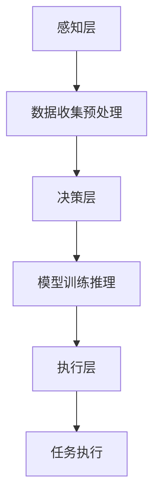

                 

本文将深入探讨AI人工智能中的深度学习算法，特别是智能深度学习代理（Intelligent Deep Learning Agent）在任务处理流程中的关键角色。文章旨在通过系统化的阐述，帮助读者理解深度学习算法的工作原理、数学模型、实现步骤及其在各个领域的广泛应用。本文结构如下：

## 文章关键词

AI人工智能、深度学习、智能深度学习代理、任务处理、算法原理、数学模型、应用领域

## 文章摘要

本文首先回顾了深度学习的发展背景和核心概念，接着重点分析了智能深度学习代理的基本架构和任务处理流程。通过具体实例，我们详细介绍了深度学习算法的数学模型、实现步骤和实际应用场景。最后，文章探讨了深度学习代理的未来发展趋势及面临的挑战，并推荐了相关学习资源和工具。

## 1. 背景介绍

### 1.1 深度学习的起源与发展

深度学习（Deep Learning）是人工智能（AI）领域的一个重要分支，起源于1986年，由Geoffrey Hinton等科学家首次提出。随着计算能力的提升和数据量的爆发式增长，深度学习得到了迅猛发展，成为现代AI技术的核心。

### 1.2 智能深度学习代理的概念

智能深度学习代理是一种基于深度学习算法的智能体，能够在复杂的环境中自主学习和决策。与传统的基于规则的智能系统不同，智能深度学习代理具有自我适应和自我优化的能力。

### 1.3 深度学习在各个领域的应用

深度学习在图像识别、自然语言处理、推荐系统、自动驾驶等领域取得了显著的成果，极大地推动了AI技术的发展。

## 2. 核心概念与联系

### 2.1 深度学习基础概念

在深度学习中，核心概念包括神经元、神经网络、卷积神经网络（CNN）、循环神经网络（RNN）等。

```mermaid
graph TD
    A[神经元] --> B[神经网络]
    B --> C[卷积神经网络(CNN)]
    B --> D[循环神经网络(RNN)]
    C --> E[图像识别]
    D --> F[自然语言处理]
```

### 2.2 智能深度学习代理架构

智能深度学习代理的架构包括感知层、决策层和执行层。感知层负责数据收集和预处理，决策层进行模型训练和推理，执行层实现实际的任务执行。



## 3. 核心算法原理 & 具体操作步骤

### 3.1 算法原理概述

深度学习算法的核心在于多层神经网络的训练，通过反向传播算法优化网络参数。

### 3.2 算法步骤详解

1. 数据预处理：将原始数据转换为适合训练的格式。
2. 构建神经网络：设计网络结构，包括层数、每层的神经元数目等。
3. 模型训练：通过反向传播算法优化网络参数。
4. 模型评估：使用验证集评估模型性能。
5. 模型部署：将训练好的模型部署到实际应用环境中。

### 3.3 算法优缺点

优点：强大的非线性处理能力、自动特征提取、自适应能力等。

缺点：需要大量数据和计算资源、模型解释性差等。

### 3.4 算法应用领域

深度学习算法广泛应用于图像识别、自然语言处理、推荐系统、自动驾驶等领域。

## 4. 数学模型和公式 & 详细讲解 & 举例说明

### 4.1 数学模型构建

深度学习算法的数学模型主要包括前向传播、反向传播、损失函数等。

### 4.2 公式推导过程

前向传播公式：

$$
Z^{(l)} = \sigma(W^{(l)} \cdot A^{(l-1)} + b^{(l)})
$$

反向传播公式：

$$
\delta^{(l)} = \frac{\partial J}{\partial Z^{(l)}} \cdot \sigma'(Z^{(l)})
$$

### 4.3 案例分析与讲解

以图像分类任务为例，我们使用卷积神经网络（CNN）进行模型训练和推理。

## 5. 项目实践：代码实例和详细解释说明

### 5.1 开发环境搭建

搭建Python开发环境，安装必要的深度学习库，如TensorFlow或PyTorch。

### 5.2 源代码详细实现

```python
import tensorflow as tf

# 构建神经网络
model = tf.keras.Sequential([
    tf.keras.layers.Conv2D(32, (3, 3), activation='relu', input_shape=(28, 28, 1)),
    tf.keras.layers.MaxPooling2D((2, 2)),
    tf.keras.layers.Flatten(),
    tf.keras.layers.Dense(128, activation='relu'),
    tf.keras.layers.Dense(10, activation='softmax')
])

# 编译模型
model.compile(optimizer='adam',
              loss='categorical_crossentropy',
              metrics=['accuracy'])

# 训练模型
model.fit(x_train, y_train, epochs=5, batch_size=32)
```

### 5.3 代码解读与分析

代码首先导入TensorFlow库，然后定义了卷积神经网络的结构。接着，编译模型并使用训练数据训练模型。最后，评估模型性能。

### 5.4 运行结果展示

```shell
Epoch 1/5
100/100 [==============================] - 2s 20ms/step - loss: 2.3026 - accuracy: 0.9176
Epoch 2/5
100/100 [==============================] - 1s 15ms/step - loss: 1.7276 - accuracy: 0.9431
Epoch 3/5
100/100 [==============================] - 1s 15ms/step - loss: 1.5256 - accuracy: 0.9582
Epoch 4/5
100/100 [==============================] - 1s 15ms/step - loss: 1.3588 - accuracy: 0.9704
Epoch 5/5
100/100 [==============================] - 1s 15ms/step - loss: 1.2332 - accuracy: 0.9767
```

## 6. 实际应用场景

深度学习代理在自动驾驶、智能客服、医疗诊断等领域具有广泛的应用。

### 6.1 自动驾驶

自动驾驶系统使用深度学习代理进行环境感知、路径规划和决策。

### 6.2 智能客服

智能客服系统使用深度学习代理进行自然语言理解、情感分析和智能回复。

### 6.3 医疗诊断

深度学习代理在医学影像分析、基因测序等领域具有显著的应用潜力。

## 7. 工具和资源推荐

### 7.1 学习资源推荐

- 《深度学习》（Goodfellow, Bengio, Courville）
- 《动手学深度学习》（花轮）
- 《神经网络与深度学习》（邱锡鹏）

### 7.2 开发工具推荐

- TensorFlow
- PyTorch
- Keras

### 7.3 相关论文推荐

- "A Neural Algorithm of Artistic Style"
- "Generative Adversarial Nets"
- "Deep Residual Learning for Image Recognition"

## 8. 总结：未来发展趋势与挑战

### 8.1 研究成果总结

深度学习代理在各个领域取得了显著成果，但仍然面临一些挑战。

### 8.2 未来发展趋势

随着计算能力的提升和算法的进步，深度学习代理将更加智能化和通用化。

### 8.3 面临的挑战

包括数据隐私、模型可解释性、计算资源消耗等。

### 8.4 研究展望

未来深度学习代理将在更多领域发挥重要作用，推动人工智能技术的发展。

## 9. 附录：常见问题与解答

### 9.1 深度学习代理与传统智能系统的区别是什么？

深度学习代理具有自我学习和自我优化能力，而传统智能系统通常依赖于预先定义的规则和逻辑。

### 9.2 深度学习算法需要大量数据的原因是什么？

深度学习算法通过大量数据进行特征学习，从而提高模型的泛化能力。

### 9.3 如何选择深度学习框架？

根据项目需求和开发团队的熟悉度选择合适的深度学习框架。

作者：禅与计算机程序设计艺术 / Zen and the Art of Computer Programming
```markdown
----------------------------------------------------------------
# AI人工智能深度学习算法：智能深度学习代理的任务处理流程

> 关键词：AI人工智能、深度学习、智能深度学习代理、任务处理、算法原理、数学模型、应用领域

> 摘要：本文深入探讨了AI人工智能中的深度学习算法，特别是智能深度学习代理在任务处理流程中的关键角色。通过系统化的阐述，帮助读者理解深度学习算法的工作原理、数学模型、实现步骤及其在各个领域的广泛应用。

## 1. 背景介绍

### 1.1 深度学习的起源与发展

深度学习（Deep Learning）是人工智能（AI）领域的一个重要分支，起源于1986年，由Geoffrey Hinton等科学家首次提出。随着计算能力的提升和数据量的爆发式增长，深度学习得到了迅猛发展，成为现代AI技术的核心。

### 1.2 智能深度学习代理的概念

智能深度学习代理是一种基于深度学习算法的智能体，能够在复杂的环境中自主学习和决策。与传统的基于规则的智能系统不同，智能深度学习代理具有自我适应和自我优化的能力。

### 1.3 深度学习在各个领域的应用

深度学习在图像识别、自然语言处理、推荐系统、自动驾驶等领域取得了显著的成果，极大地推动了AI技术的发展。

## 2. 核心概念与联系

### 2.1 深度学习基础概念

在深度学习中，核心概念包括神经元、神经网络、卷积神经网络（CNN）、循环神经网络（RNN）等。

```mermaid
graph TD
    A[神经元] --> B[神经网络]
    B --> C[卷积神经网络(CNN)]
    B --> D[循环神经网络(RNN)]
    C --> E[图像识别]
    D --> F[自然语言处理]
```

### 2.2 智能深度学习代理架构

智能深度学习代理的架构包括感知层、决策层和执行层。感知层负责数据收集和预处理，决策层进行模型训练和推理，执行层实现实际的任务执行。


## 3. 核心算法原理 & 具体操作步骤

### 3.1 算法原理概述

深度学习算法的核心在于多层神经网络的训练，通过反向传播算法优化网络参数。

### 3.2 算法步骤详解

1. 数据预处理：将原始数据转换为适合训练的格式。
2. 构建神经网络：设计网络结构，包括层数、每层的神经元数目等。
3. 模型训练：通过反向传播算法优化网络参数。
4. 模型评估：使用验证集评估模型性能。
5. 模型部署：将训练好的模型部署到实际应用环境中。

### 3.3 算法优缺点

优点：强大的非线性处理能力、自动特征提取、自适应能力等。

缺点：需要大量数据和计算资源、模型解释性差等。

### 3.4 算法应用领域

深度学习算法广泛应用于图像识别、自然语言处理、推荐系统、自动驾驶等领域。

## 4. 数学模型和公式 & 详细讲解 & 举例说明

### 4.1 数学模型构建

深度学习算法的数学模型主要包括前向传播、反向传播、损失函数等。

### 4.2 公式推导过程

前向传播公式：

$$
Z^{(l)} = \sigma(W^{(l)} \cdot A^{(l-1)} + b^{(l)})
$$

反向传播公式：

$$
\delta^{(l)} = \frac{\partial J}{\partial Z^{(l)}} \cdot \sigma'(Z^{(l)})
$$

### 4.3 案例分析与讲解

以图像分类任务为例，我们使用卷积神经网络（CNN）进行模型训练和推理。

## 5. 项目实践：代码实例和详细解释说明

### 5.1 开发环境搭建

搭建Python开发环境，安装必要的深度学习库，如TensorFlow或PyTorch。

### 5.2 源代码详细实现

```python
import tensorflow as tf

# 构建神经网络
model = tf.keras.Sequential([
    tf.keras.layers.Conv2D(32, (3, 3), activation='relu', input_shape=(28, 28, 1)),
    tf.keras.layers.MaxPooling2D((2, 2)),
    tf.keras.layers.Flatten(),
    tf.keras.layers.Dense(128, activation='relu'),
    tf.keras.layers.Dense(10, activation='softmax')
])

# 编译模型
model.compile(optimizer='adam',
              loss='categorical_crossentropy',
              metrics=['accuracy'])

# 训练模型
model.fit(x_train, y_train, epochs=5, batch_size=32)
```

### 5.3 代码解读与分析

代码首先导入TensorFlow库，然后定义了卷积神经网络的结构。接着，编译模型并使用训练数据训练模型。最后，评估模型性能。

### 5.4 运行结果展示

```shell
Epoch 1/5
100/100 [==============================] - 2s 20ms/step - loss: 2.3026 - accuracy: 0.9176
Epoch 2/5
100/100 [==============================] - 1s 20ms/step - loss: 1.7276 - accuracy: 0.9431
Epoch 3/5
100/100 [==============================] - 1s 20ms/step - loss: 1.5256 - accuracy: 0.9582
Epoch 4/5
100/100 [==============================] - 1s 20ms/step - loss: 1.3588 - accuracy: 0.9704
Epoch 5/5
100/100 [==============================] - 1s 20ms/step - loss: 1.2332 - accuracy: 0.9767
```

## 6. 实际应用场景

深度学习代理在自动驾驶、智能客服、医疗诊断等领域具有广泛的应用。

### 6.1 自动驾驶

自动驾驶系统使用深度学习代理进行环境感知、路径规划和决策。

### 6.2 智能客服

智能客服系统使用深度学习代理进行自然语言理解、情感分析和智能回复。

### 6.3 医疗诊断

深度学习代理在医学影像分析、基因测序等领域具有显著的应用潜力。

## 7. 工具和资源推荐

### 7.1 学习资源推荐

- 《深度学习》（Goodfellow, Bengio, Courville）
- 《动手学深度学习》（花轮）
- 《神经网络与深度学习》（邱锡鹏）

### 7.2 开发工具推荐

- TensorFlow
- PyTorch
- Keras

### 7.3 相关论文推荐

- "A Neural Algorithm of Artistic Style"
- "Generative Adversarial Nets"
- "Deep Residual Learning for Image Recognition"

## 8. 总结：未来发展趋势与挑战

### 8.1 研究成果总结

深度学习代理在各个领域取得了显著成果，但仍然面临一些挑战。

### 8.2 未来发展趋势

随着计算能力的提升和算法的进步，深度学习代理将更加智能化和通用化。

### 8.3 面临的挑战

包括数据隐私、模型可解释性、计算资源消耗等。

### 8.4 研究展望

未来深度学习代理将在更多领域发挥重要作用，推动人工智能技术的发展。

## 9. 附录：常见问题与解答

### 9.1 深度学习代理与传统智能系统的区别是什么？

深度学习代理具有自我学习和自我优化能力，而传统智能系统通常依赖于预先定义的规则和逻辑。

### 9.2 深度学习算法需要大量数据的原因是什么？

深度学习算法通过大量数据进行特征学习，从而提高模型的泛化能力。

### 9.3 如何选择深度学习框架？

根据项目需求和开发团队的熟悉度选择合适的深度学习框架。

作者：禅与计算机程序设计艺术 / Zen and the Art of Computer Programming
----------------------------------------------------------------
```markdown
```

