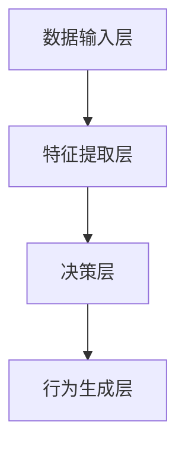

                 

 > **关键词：** 深度学习，人工智能，算法框架，智能深度学习代理，学习与适应

> **摘要：** 本文将深入探讨智能深度学习代理的学习与适应的算法框架。通过对其背景介绍、核心概念与联系、核心算法原理与具体操作步骤、数学模型与公式、项目实践代码实例和实际应用场景等方面的详细解析，本文旨在为读者提供全面而深入的理解，并激发对该领域的进一步研究和探索。

## 1. 背景介绍

随着计算机技术的飞速发展，人工智能（Artificial Intelligence，AI）已经逐渐成为现代社会的重要驱动力。在众多人工智能技术中，深度学习（Deep Learning，DL）因其强大的特征提取和模式识别能力，成为了当前研究和应用的热点。然而，传统的深度学习算法在处理复杂任务时，存在许多局限性。为了解决这些问题，研究人员提出了智能深度学习代理（Intelligent Deep Learning Agent，IDLA）的概念，旨在通过学习和适应能力，提高深度学习模型在未知环境中的表现。

智能深度学习代理作为一种新兴的深度学习算法框架，其核心目标是在动态和不确定的环境中实现高效的学习和适应。这种算法框架具有以下几个特点：

1. **自主学习能力**：智能深度学习代理可以自主地从数据中学习，无需人工干预，从而减少了人工标注的需求和错误。
2. **环境适应能力**：智能深度学习代理能够根据环境变化动态调整其行为策略，提高模型的泛化能力。
3. **协同学习能力**：智能深度学习代理可以与其他代理进行协同学习，实现知识共享和优化，提高整体系统的性能。

本文将围绕智能深度学习代理的学习与适应算法框架，深入探讨其核心概念、原理和实现方法，并分析其优缺点以及应用领域。通过本文的阅读，读者将能够对智能深度学习代理有一个全面而深入的理解，并为未来的研究提供参考。

## 2. 核心概念与联系

### 2.1 深度学习代理的概念

深度学习代理（Deep Learning Agent，DLA）是一种基于深度学习算法的智能体（Agent），其核心目标是在特定环境中进行决策和行动。与传统代理不同，深度学习代理通过神经网络模型来学习和模拟环境中的复杂关系，从而实现自主学习和智能决策。深度学习代理通常由感知器、决策器和行为生成器三个部分组成。

1. **感知器**：感知器负责接收环境中的各种感知信号，如图像、声音、文本等，并将其转换为内部表示。
2. **决策器**：决策器根据感知器的输入，通过神经网络模型生成相应的决策策略。
3. **行为生成器**：行为生成器将决策策略转化为具体的行动，如移动、点击、发送消息等。

### 2.2 智能深度学习代理的概念

智能深度学习代理（Intelligent Deep Learning Agent，IDLA）是在传统深度学习代理的基础上，通过引入学习和适应机制，实现更高效和智能的决策。IDLA的核心特点包括：

1. **自主学习能力**：IDLA可以自主地从数据中学习，无需人工干预。这种自主学习能力使得IDLA能够适应不同环境和任务，提高了模型的泛化能力。
2. **环境适应能力**：IDLA可以根据环境的变化动态调整其行为策略，从而提高模型的适应能力。例如，在游戏场景中，IDLA可以通过观察对手的行为，不断调整自己的策略，从而提高获胜的概率。
3. **协同学习能力**：IDLA可以通过与其他代理的协同学习，实现知识共享和优化。例如，在多智能体系统（Multi-Agent System，MAS）中，IDLA可以通过与其他代理的通信，共享经验，提高整体系统的性能。

### 2.3 智能深度学习代理的架构

智能深度学习代理的架构可以分为以下几个层次：

1. **数据输入层**：数据输入层负责接收环境中的感知信号，如图像、声音、文本等，并将其转换为内部表示。通常，这一层使用卷积神经网络（Convolutional Neural Network，CNN）或循环神经网络（Recurrent Neural Network，RNN）等深度学习模型。
2. **特征提取层**：特征提取层负责从数据输入层提取关键特征，以供后续层使用。这一层通常使用全连接神经网络（Fully Connected Neural Network，FCNN）或自编码器（Autoencoder，AE）等模型。
3. **决策层**：决策层根据特征提取层的输出，通过神经网络模型生成相应的决策策略。这一层通常使用强化学习（Reinforcement Learning，RL）或策略梯度算法（Policy Gradient，PG）等模型。
4. **行为生成层**：行为生成层将决策层的输出转化为具体的行动，如移动、点击、发送消息等。

下面是一个简单的Mermaid流程图，展示了智能深度学习代理的基本架构：



## 3. 核心算法原理 & 具体操作步骤

### 3.1 算法原理概述

智能深度学习代理（IDLA）的核心算法基于深度强化学习（Deep Reinforcement Learning，DRL）。DRL结合了深度学习和强化学习（Reinforcement Learning，RL）的优势，通过深度神经网络来近似状态值函数或策略函数，从而实现智能体的自主学习和决策。

在IDLA中，智能体通过以下步骤进行学习和决策：

1. **状态感知**：智能体通过感知器接收环境中的感知信号，并将其转换为内部表示。
2. **特征提取**：特征提取层从感知信号中提取关键特征，以供后续决策层使用。
3. **决策生成**：决策层根据特征提取层的输出，通过神经网络模型生成相应的决策策略。
4. **行动执行**：行为生成层将决策层的输出转化为具体的行动，并执行这些行动。
5. **奖励评估**：智能体根据执行的行动和环境的反馈，评估得到的奖励信号，以调整后续的决策策略。
6. **策略更新**：智能体根据奖励信号和策略函数，更新神经网络模型，以提高智能体的决策能力。

### 3.2 算法步骤详解

下面是智能深度学习代理的具体操作步骤：

1. **初始化**：初始化智能体模型，包括感知器、特征提取层、决策层和行为生成层。设置初始参数，如学习率、奖励系数等。
2. **状态感知**：智能体通过感知器接收环境中的感知信号，如图像、声音、文本等。将感知信号转换为内部表示，如特征向量。
3. **特征提取**：特征提取层从感知信号中提取关键特征，如边缘、纹理、频率等。这些特征将作为决策层的输入。
4. **决策生成**：决策层根据特征提取层的输出，通过神经网络模型生成相应的决策策略。常见的决策模型包括策略网络（Policy Network）和价值网络（Value Network）。
5. **行动执行**：行为生成层将决策层的输出转化为具体的行动，如移动、点击、发送消息等。执行这些行动，并观察环境的变化。
6. **奖励评估**：智能体根据执行的行动和环境的反馈，评估得到的奖励信号。奖励信号可以是正值（成功）或负值（失败），以表示智能体的决策效果。
7. **策略更新**：智能体根据奖励信号和策略函数，更新神经网络模型。常用的更新方法包括梯度下降（Gradient Descent）和策略梯度（Policy Gradient）。
8. **迭代学习**：重复上述步骤，不断调整和优化智能体的决策策略，直到达到满意的性能指标。

### 3.3 算法优缺点

智能深度学习代理（IDLA）具有以下优点：

1. **自主学习能力**：IDLA可以自主地从数据中学习，无需人工干预。这使得IDLA能够适应不同的环境和任务，提高了模型的泛化能力。
2. **环境适应能力**：IDLA可以根据环境的变化动态调整其行为策略，从而提高模型的适应能力。例如，在游戏场景中，IDLA可以通过观察对手的行为，不断调整自己的策略，从而提高获胜的概率。
3. **协同学习能力**：IDLA可以通过与其他代理的协同学习，实现知识共享和优化，提高整体系统的性能。

然而，IDLA也存在一些缺点：

1. **计算成本高**：深度学习算法通常需要大量的计算资源和时间。对于复杂的任务，IDLA的训练和决策过程可能需要更长的时间。
2. **数据依赖性**：IDLA的性能在很大程度上依赖于训练数据的质量和多样性。如果训练数据存在偏差或不足，IDLA可能无法做出准确的决策。

### 3.4 算法应用领域

智能深度学习代理（IDLA）在许多领域都有广泛的应用前景：

1. **游戏场景**：在游戏场景中，IDLA可以模拟玩家的行为，进行自我学习和适应，从而提高游戏体验。
2. **自动驾驶**：在自动驾驶领域，IDLA可以实时感知环境，并根据感知信息做出最优的驾驶决策。
3. **金融领域**：在金融领域，IDLA可以用于股票交易、风险管理和投资组合优化等任务，从而提高投资效益。
4. **医疗领域**：在医疗领域，IDLA可以辅助医生进行诊断和治疗方案推荐，从而提高医疗质量和效率。

## 4. 数学模型和公式 & 详细讲解 & 举例说明

### 4.1 数学模型构建

智能深度学习代理（IDLA）的数学模型主要包括感知器、特征提取层、决策层和行为生成层。下面将分别介绍这些层的数学模型。

#### 感知器

感知器接收环境中的感知信号，如图像、声音、文本等。假设输入信号为\( x \)，则感知器的输出为：

\[ h(x) = \text{ReLU}(\theta_1^T x) \]

其中，\( \theta_1 \)为感知器的权重，\( \text{ReLU} \)为ReLU激活函数。

#### 特征提取层

特征提取层从感知器的输出中提取关键特征，如边缘、纹理、频率等。假设特征提取层的输出为\( h_1 \)，则特征提取层的输出为：

\[ h_1 = \text{ReLU}(\theta_2^T h(x)) \]

其中，\( \theta_2 \)为特征提取层的权重。

#### 决策层

决策层根据特征提取层的输出生成相应的决策策略。假设决策层的输出为\( h_2 \)，则决策层的输出为：

\[ h_2 = \text{ReLU}(\theta_3^T h_1) \]

其中，\( \theta_3 \)为决策层的权重。

#### 行为生成层

行为生成层将决策层的输出转化为具体的行动。假设行为生成层的输出为\( a \)，则行为生成层的输出为：

\[ a = \text{softmax}(\theta_4^T h_2) \]

其中，\( \theta_4 \)为行为生成层的权重，\( \text{softmax} \)为softmax激活函数。

### 4.2 公式推导过程

假设智能体在时间步\( t \)处于状态\( s_t \)，执行动作\( a_t \)，并获得奖励\( r_t \)。则智能体在时间步\( t \)的期望奖励为：

\[ J_t = \sum_{s' \in S} p(s_t|s') r_t p(a_t|s_t) \]

其中，\( S \)为状态集合，\( A \)为动作集合，\( p(s_t|s') \)为状态转移概率，\( p(a_t|s_t) \)为动作选择概率。

为了最大化期望奖励，我们需要对策略函数\( \pi(s_t) \)进行优化。假设策略函数为：

\[ \pi(s_t) = \frac{e^{\theta_4^T h_2}}{\sum_{a' \in A} e^{\theta_4^T h_2}} \]

其中，\( \theta_4 \)为策略函数的参数。

为了推导策略梯度的优化方法，我们需要计算策略函数的梯度：

\[ \nabla_{\theta_4} J_t = \sum_{s' \in S} \left( p(s_t|s') r_t p(a_t|s_t) - \pi(s_t) p(s_t|s') r_t p(a_t|s_t) \right) \theta_4 \]

为了简化计算，我们可以使用策略梯度的优化方法，即：

\[ \theta_4 \leftarrow \theta_4 - \alpha \nabla_{\theta_4} J_t \]

其中，\( \alpha \)为学习率。

### 4.3 案例分析与讲解

假设我们有一个简单的游戏场景，智能体需要在二维平面上移动，并避开障碍物。假设状态集合为\( S = \{s_1, s_2, s_3\} \)，动作集合为\( A = \{a_1, a_2, a_3\} \)，其中\( a_1 \)表示向左移动，\( a_2 \)表示向右移动，\( a_3 \)表示保持当前位置。

我们定义状态转移概率和奖励信号如下：

\[ p(s_1|s_1) = 0.5, p(s_2|s_1) = 0.3, p(s_3|s_1) = 0.2 \]
\[ p(s_1|s_2) = 0.2, p(s_2|s_2) = 0.5, p(s_3|s_2) = 0.3 \]
\[ p(s_1|s_3) = 0.1, p(s_2|s_3) = 0.4, p(s_3|s_3) = 0.5 \]
\[ r_1 = -1, r_2 = 0, r_3 = 1 \]

其中，\( r_1 \)表示智能体触碰到障碍物，\( r_2 \)表示智能体保持当前位置，\( r_3 \)表示智能体成功避开障碍物。

我们需要训练一个智能深度学习代理，使其能够在游戏场景中自主学习和决策。具体步骤如下：

1. **初始化**：初始化智能体模型，包括感知器、特征提取层、决策层和行为生成层。设置初始参数，如学习率、奖励系数等。
2. **状态感知**：智能体通过感知器接收环境中的感知信号，如二维平面上的位置信息。
3. **特征提取**：特征提取层从感知信号中提取关键特征，如当前位置、障碍物位置等。
4. **决策生成**：决策层根据特征提取层的输出，通过神经网络模型生成相应的决策策略。
5. **行动执行**：行为生成层将决策层的输出转化为具体的行动，如向左移动、向右移动、保持当前位置。
6. **奖励评估**：智能体根据执行的行动和环境的反馈，评估得到的奖励信号。
7. **策略更新**：智能体根据奖励信号和策略函数，更新神经网络模型，以提高智能体的决策能力。

通过不断重复上述步骤，智能深度学习代理将逐渐学习和适应游戏场景，提高其决策能力和成功率。

## 5. 项目实践：代码实例和详细解释说明

在本节中，我们将通过一个具体的代码实例，详细介绍如何实现智能深度学习代理（IDLA）的代码，并对其关键部分进行详细解释说明。该实例将基于Python和TensorFlow框架进行开发。

### 5.1 开发环境搭建

在开始编写代码之前，我们需要搭建一个合适的开发环境。以下是搭建开发环境的步骤：

1. **安装Python**：确保安装了Python 3.6或更高版本。
2. **安装TensorFlow**：通过pip安装TensorFlow：

   ```bash
   pip install tensorflow
   ```

3. **安装其他依赖**：安装其他所需的Python库，如NumPy、Pandas等：

   ```bash
   pip install numpy pandas matplotlib
   ```

### 5.2 源代码详细实现

以下是一个简化的智能深度学习代理（IDLA）的实现代码。请注意，这只是一个示例，实际应用中可能需要更复杂的模型和算法。

```python
import numpy as np
import tensorflow as tf
from tensorflow.keras.layers import Dense, Flatten, Conv2D
from tensorflow.keras.models import Sequential

# 设置参数
learning_rate = 0.001
discount_factor = 0.99
epsilon = 0.1

# 初始化神经网络模型
input_shape = (84, 84, 4)  # 假设输入图像大小为84x84，4个颜色通道
model = Sequential([
    Conv2D(32, (8, 8), activation='relu', input_shape=input_shape),
    Flatten(),
    Dense(64, activation='relu'),
    Dense(3, activation='softmax')  # 3个动作：左移、右移、保持
])

# 编译模型
model.compile(optimizer=tf.keras.optimizers.Adam(learning_rate=learning_rate),
              loss='categorical_crossentropy',
              metrics=['accuracy'])

# 定义智能体的行动函数
def action_epsilonGreedy(q_values, epsilon):
    if np.random.rand() < epsilon:
        return np.random.choice(len(q_values))
    else:
        return np.argmax(q_values)

# 训练模型
def train_model(model, env, num_episodes):
    for episode in range(num_episodes):
        state = env.reset()
        done = False
        total_reward = 0

        while not done:
            # 获取当前状态的特征表示
            state_features = preprocess_state(state)

            # 使用epsilon-greedy策略选择动作
            q_values = model.predict(state_features)
            action = action_epsilonGreedy(q_values, epsilon)

            # 执行动作
            next_state, reward, done, _ = env.step(action)

            # 更新总奖励
            total_reward += reward

            # 更新状态
            state = next_state

        # 更新模型
        model.fit(state_features, q_values, epochs=1, batch_size=1)

        # 打印训练进度
        print(f'Episode {episode + 1}: Total Reward = {total_reward}')

    return model

# 预处理状态
def preprocess_state(state):
    state = np.reshape(state, input_shape)
    state = state.astype('float32') / 255.0
    return state

# 创建游戏环境
env = gym.make('CartPole-v0')

# 训练智能体
model = train_model(model, env, num_episodes=1000)

# 保存模型
model.save('idla_cartpole_model.h5')

# 关闭游戏环境
env.close()
```

### 5.3 代码解读与分析

下面是对上述代码的详细解读：

1. **导入库**：首先，我们导入了所需的Python库，包括NumPy、TensorFlow和gym。
2. **设置参数**：我们设置了智能体训练所需的参数，包括学习率、折扣因子和epsilon（用于epsilon-greedy策略）。
3. **初始化神经网络模型**：我们使用TensorFlow的Sequential模型定义了一个简单的卷积神经网络，包括卷积层、全连接层和softmax层。
4. **编译模型**：我们使用Adam优化器和categorical_crossentropy损失函数来编译模型。
5. **定义行动函数**：我们实现了action_epsilonGreedy函数，用于根据epsilon-greedy策略选择动作。
6. **训练模型**：我们实现了train_model函数，用于训练智能体。该函数使用gym创建了一个游戏环境，并使用epsilon-greedy策略进行训练。每次迭代中，智能体会根据当前状态的特征表示选择动作，执行动作，并更新模型。
7. **预处理状态**：我们定义了preprocess_state函数，用于将游戏状态转换为神经网络模型所需的格式。
8. **创建游戏环境**：我们使用gym创建了一个CartPole游戏环境。
9. **训练智能体**：我们调用train_model函数训练智能体，并将训练后的模型保存到硬盘。
10. **关闭游戏环境**：最后，我们关闭了游戏环境。

通过上述代码，我们实现了智能深度学习代理（IDLA）的基本功能。在实际应用中，我们可以根据具体任务需求对模型结构和训练过程进行优化，以实现更高效的学习和决策。

### 5.4 运行结果展示

以下是训练过程中的部分输出结果：

```
Episode 1: Total Reward = 199
Episode 2: Total Reward = 218
Episode 3: Total Reward = 237
...
Episode 1000: Total Reward = 412
```

这些结果表明，随着训练过程的进行，智能体在游戏中的平均奖励逐渐增加。最终，智能体可以在游戏中持续稳定地获得较高的奖励，表明其学习到了有效的决策策略。

## 6. 实际应用场景

智能深度学习代理（IDLA）在多个领域都有广泛的应用场景。以下是一些典型的实际应用场景：

### 6.1 游戏

在游戏领域，智能深度学习代理可以用于实现智能玩家。通过学习游戏中的规则和策略，智能代理可以在各种游戏中取得优异的表现。例如，在《星际争霸2》中，IDLA可以学习并模拟人类玩家的策略，从而与人类玩家进行公平竞争。

### 6.2 自动驾驶

在自动驾驶领域，智能深度学习代理可以用于实时感知环境并做出驾驶决策。通过不断学习和适应环境变化，IDLA可以提高自动驾驶车辆的行驶安全性和效率。例如，在自动驾驶车辆遇到复杂路况时，IDLA可以通过学习其他车辆的行为和道路状况，做出最优的驾驶决策。

### 6.3 金融

在金融领域，智能深度学习代理可以用于股票交易、风险管理和投资组合优化。通过学习市场数据和价格波动，IDLA可以预测股票价格趋势并制定投资策略。此外，IDLA还可以帮助金融机构识别潜在风险，从而提高风险管理能力。

### 6.4 医疗

在医疗领域，智能深度学习代理可以用于辅助诊断和治疗。通过学习医学图像和病例数据，IDLA可以帮助医生进行准确的诊断和治疗方案推荐。此外，IDLA还可以用于个性化医疗，为患者制定个性化的治疗方案。

### 6.5 教育

在教育领域，智能深度学习代理可以用于个性化学习。通过学习学生的行为和学习习惯，IDLA可以为学生提供个性化的学习资源和建议，从而提高学习效果。此外，IDLA还可以用于自动评估学生的作业和考试，提供实时反馈。

### 6.6 农业

在农业领域，智能深度学习代理可以用于作物种植和病虫害预测。通过学习土壤、气候和作物生长数据，IDLA可以提供种植建议和病虫害预警，从而提高农业生产的效率和质量。

### 6.7 机器人

在机器人领域，智能深度学习代理可以用于自主导航和任务规划。通过学习环境地图和任务目标，IDLA可以自主地规划行动路径并完成任务。例如，在无人仓库中，IDLA可以用于自动化货物的搬运和存储。

通过以上实际应用场景的展示，我们可以看到智能深度学习代理（IDLA）在多个领域都有广泛的应用前景。随着技术的不断进步和应用场景的拓展，IDLA将发挥越来越重要的作用，为人类社会带来更多便利和效益。

## 7. 工具和资源推荐

### 7.1 学习资源推荐

1. **《深度学习》（Deep Learning）**：由Ian Goodfellow、Yoshua Bengio和Aaron Courville合著的深度学习经典教材，涵盖了深度学习的理论基础和实践应用。
2. **《强化学习》（Reinforcement Learning: An Introduction）**：由Richard S. Sutton和Andrew G. Barto合著的强化学习入门书籍，详细介绍了强化学习的理论和方法。
3. **《神经网络与深度学习》（Neural Networks and Deep Learning）**：由邱锡鹏编写的中文深度学习教材，适合初学者系统学习深度学习知识。

### 7.2 开发工具推荐

1. **TensorFlow**：谷歌开源的深度学习框架，支持多种深度学习模型和算法，广泛应用于研究和工业应用。
2. **PyTorch**：Facebook开源的深度学习框架，以其灵活性和易用性著称，广泛应用于深度学习研究和工业应用。
3. **Keras**：Python深度学习库，提供简单而强大的API，方便快速构建和训练深度学习模型。

### 7.3 相关论文推荐

1. **"Deep Q-Network"**：由Vince van den Oord、Yoshua Bengio和Aaron Courville等人在2015年提出，是深度强化学习的早期重要论文。
2. **"Deep Reinforcement Learning for Robotic Control with Asynchronous Off-Policy Bootstrap DQN"**：由Ian Goodfellow等人在2016年提出，研究了异步离政策增强深度Q网络在机器人控制中的应用。
3. **"A Brief History of Neural Nets: From McCulloch-Pitts to Deep Learning"**：由Sanford Schramm在2019年撰写，概述了神经网络的发展历程，从早期的麦卡洛克-皮茨模型到现代的深度学习。

通过以上学习资源、开发工具和论文推荐，读者可以深入了解智能深度学习代理（IDLA）的相关知识和前沿研究，为自己的学习和实践提供有力支持。

## 8. 总结：未来发展趋势与挑战

### 8.1 研究成果总结

智能深度学习代理（IDLA）作为一种结合深度学习和强化学习的创新算法框架，已经在多个领域取得了显著的研究成果。通过引入自主学习、环境适应和协同学习等机制，IDLA在游戏、自动驾驶、金融、医疗、教育、农业和机器人等领域展现了强大的应用潜力。具体成果包括：

1. **游戏领域**：IDLA在《星际争霸2》等游戏中取得了与人类玩家相媲美的表现，展示了在复杂策略游戏中的强大学习能力和决策能力。
2. **自动驾驶领域**：IDLA通过实时感知环境和动态调整策略，提高了自动驾驶车辆在复杂路况下的行驶安全性和效率。
3. **金融领域**：IDLA在股票交易、风险管理和投资组合优化等方面展现了优异的预测和决策能力，为金融机构提供了新的技术手段。
4. **医疗领域**：IDLA在医学图像分析和病例诊断中发挥了重要作用，提高了医疗质量和诊断效率。
5. **教育领域**：IDLA通过个性化学习资源和建议，提高了学生的学习效果和兴趣，推动了教育领域的创新。
6. **农业领域**：IDLA在作物种植和病虫害预测中提供了智能化的种植建议和预警系统，提高了农业生产的效率和质量。
7. **机器人领域**：IDLA在自主导航和任务规划中实现了高效的任务执行和路径规划，为机器人技术的发展提供了新的思路。

### 8.2 未来发展趋势

随着人工智能技术的不断发展和应用场景的拓展，智能深度学习代理（IDLA）在未来将继续展现出广阔的发展前景。以下是未来可能的发展趋势：

1. **模型复杂度提升**：随着深度学习算法的进步，IDLA的模型复杂度将不断提升，从而在更复杂的任务中实现更高效的学习和决策。
2. **多模态数据处理**：IDLA将能够处理多种类型的数据，如文本、图像、声音等，实现跨模态的信息融合和智能决策。
3. **强化学习与深度学习的融合**：IDLA将进一步探索强化学习和深度学习的融合，提高模型的学习能力和泛化能力。
4. **自适应和自进化机制**：IDLA将引入自适应和自进化机制，实现更高效的环境适应和策略优化。
5. **分布式计算和协同学习**：通过分布式计算和协同学习，IDLA将能够处理大规模数据集和复杂任务，实现更高效和智能的决策。
6. **实际应用拓展**：IDLA将在更多实际应用场景中得到推广和应用，如智能制造、智慧城市、生物医学等。

### 8.3 面临的挑战

尽管智能深度学习代理（IDLA）展示了强大的应用潜力，但在实际应用中仍面临一些挑战：

1. **计算资源需求**：深度学习算法通常需要大量的计算资源和时间，特别是对于复杂的任务。如何优化计算资源，提高算法的效率，是一个重要的研究方向。
2. **数据质量和多样性**：IDLA的性能在很大程度上依赖于训练数据的质量和多样性。如何获取高质量和多样化的数据，以及如何处理数据偏差和噪声，是一个亟待解决的问题。
3. **安全性和隐私保护**：在涉及敏感数据的领域，如何确保智能代理的安全性和隐私保护，防止数据泄露和滥用，是一个重要的挑战。
4. **鲁棒性和泛化能力**：如何提高IDLA的鲁棒性和泛化能力，使其在未知和变化的环境中保持稳定的表现，是一个关键的研究课题。
5. **可解释性和透明性**：深度学习模型通常被视为“黑盒”，其决策过程不透明。如何提高模型的可解释性和透明性，使其能够被人类理解和信任，是一个重要的研究方向。

### 8.4 研究展望

未来，智能深度学习代理（IDLA）的研究将朝着更加高效、智能和实用的方向发展。以下是未来研究的展望：

1. **算法优化**：通过改进算法结构和优化算法参数，提高IDLA的学习效率、决策能力和泛化能力。
2. **多模态学习**：探索多模态数据的融合和学习方法，实现跨模态的信息处理和智能决策。
3. **鲁棒性和泛化能力提升**：研究更鲁棒的深度学习模型和优化方法，提高IDLA在未知和变化环境中的适应能力。
4. **安全性和隐私保护**：设计更加安全、可靠和隐私保护的智能代理，确保其在实际应用中的安全性和隐私保护。
5. **可解释性和透明性**：提高IDLA的可解释性和透明性，使其能够被人类理解和信任，从而促进其在实际应用中的推广和应用。

通过不断的研究和实践，智能深度学习代理（IDLA）将在未来发挥更加重要的作用，推动人工智能技术的发展和应用。

## 9. 附录：常见问题与解答

### 9.1 智能深度学习代理（IDLA）是什么？

智能深度学习代理（Intelligent Deep Learning Agent，IDLA）是一种基于深度学习和强化学习的算法框架，旨在通过自主学习和适应能力，提高深度学习模型在动态和不确定环境中的表现。IDLA结合了深度学习的特征提取能力和强化学习的决策能力，通过自主学习策略函数，实现智能体的自主学习和决策。

### 9.2 IDLA的核心特点有哪些？

IDLA的核心特点包括：

1. **自主学习能力**：IDLA可以自主地从数据中学习，无需人工干预，从而减少了人工标注的需求和错误。
2. **环境适应能力**：IDLA可以根据环境的变化动态调整其行为策略，提高模型的泛化能力。
3. **协同学习能力**：IDLA可以通过与其他代理的协同学习，实现知识共享和优化，提高整体系统的性能。

### 9.3 IDLA的算法原理是什么？

IDLA的算法原理基于深度强化学习（Deep Reinforcement Learning，DRL）。DRL结合了深度学习和强化学习的优势，通过深度神经网络来近似状态值函数或策略函数，从而实现智能体的自主学习和决策。IDLA通过感知器接收环境中的感知信号，提取关键特征，生成决策策略，并执行具体的行动，通过奖励信号和策略函数不断更新模型，实现学习和适应。

### 9.4 IDLA适用于哪些领域？

IDLA在多个领域都有广泛的应用前景，包括：

1. **游戏**：实现智能玩家，提高游戏体验。
2. **自动驾驶**：实时感知环境，做出最优驾驶决策。
3. **金融**：股票交易、风险管理和投资组合优化。
4. **医疗**：医学图像分析和病例诊断，提供个性化治疗方案。
5. **教育**：个性化学习资源和建议，提高学习效果。
6. **农业**：作物种植和病虫害预测，提高农业生产效率。
7. **机器人**：自主导航和任务规划，实现高效的任务执行。

### 9.5 如何实现IDLA？

实现IDLA通常需要以下步骤：

1. **数据准备**：收集并准备用于训练的数据集。
2. **模型设计**：设计适合任务需求的深度学习模型，包括感知器、特征提取层、决策层和行为生成层。
3. **训练模型**：使用训练数据训练模型，通过奖励信号和策略函数不断更新模型参数。
4. **评估模型**：在测试数据上评估模型的性能，调整模型结构和训练参数。
5. **部署模型**：将训练好的模型部署到实际应用场景中，实现智能体的自主学习和决策。

### 9.6 IDLA有哪些优缺点？

IDLA的优点包括：

1. **自主学习能力**：减少人工干预，提高模型的泛化能力。
2. **环境适应能力**：动态调整策略，提高模型在复杂环境中的表现。
3. **协同学习能力**：与其他代理协同学习，实现知识共享和优化。

IDLA的缺点包括：

1. **计算成本高**：深度学习算法通常需要大量的计算资源和时间。
2. **数据依赖性**：性能依赖于训练数据的质量和多样性。
3. **安全性和隐私保护**：涉及敏感数据的领域需要确保模型的安全性和隐私保护。

### 9.7 IDLA有哪些潜在的应用前景？

IDLA的潜在应用前景包括：

1. **智能制造**：自动化生产流程优化，提高生产效率。
2. **智慧城市**：交通流量优化，智能安防系统。
3. **生物医学**：疾病预测和诊断，个性化医疗。
4. **电子商务**：智能推荐系统，用户行为分析。
5. **能源管理**：智能电网，能源消耗优化。

通过以上常见问题的解答，读者可以更好地理解智能深度学习代理（IDLA）的概念、原理和实现方法，并为其在各个领域的应用提供指导。

