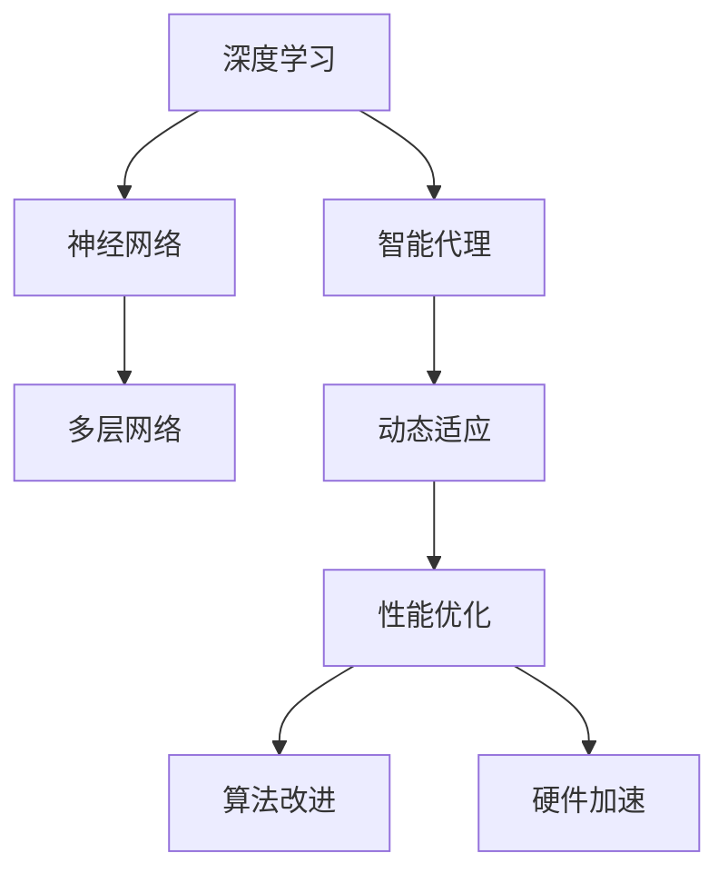

                 

关键词：深度学习、人工智能、性能优化、智能代理、算法改进

> 摘要：本文将深入探讨AI领域中的深度学习算法，特别是智能深度学习代理的性能调整与优化。我们将详细分析其核心概念、算法原理、数学模型以及实际应用，旨在为读者提供一份全面的技术指南。

## 1. 背景介绍

随着人工智能技术的快速发展，深度学习已经成为实现智能化的重要手段。深度学习算法通过多层神经网络结构，能够自动从大量数据中学习特征，从而实现图像识别、自然语言处理、语音识别等多种复杂任务。然而，深度学习算法的性能优化一直是一个关键问题，尤其是在处理大规模数据和复杂任务时。智能深度学习代理作为一种新兴技术，能够在动态环境中自动调整和优化算法性能，提高了系统的适应性和效率。

本文将聚焦于智能深度学习代理的性能调整与优化，首先介绍其核心概念和联系，然后详细分析算法原理和数学模型，最后通过实际项目实践和未来应用展望，探讨智能深度学习代理在AI领域的广泛应用和未来发展趋势。

## 2. 核心概念与联系

为了深入理解智能深度学习代理的性能调整与优化，我们首先需要了解其核心概念和相互之间的联系。

### 2.1 深度学习与神经网络

深度学习是机器学习的一个子领域，其核心是构建多层神经网络。神经网络是由大量简单节点（称为神经元）组成，每个神经元通过加权连接与其他神经元相连。在深度学习中，通过多层的非线性变换，可以从原始数据中提取更高级的特征。这种层级特征提取能力使得深度学习在图像识别、语音识别等领域表现出色。

### 2.2 智能代理

智能代理是指能够自主执行任务并适应动态环境的人工智能实体。智能代理通常基于机器学习和深度学习算法，能够从数据中学习并优化其行为。在智能深度学习代理中，代理通过优化神经网络结构、参数和训练策略，以最大化性能和适应性。

### 2.3 性能调整与优化

性能调整与优化是智能深度学习代理的重要任务。性能调整涉及调整模型结构、参数和训练策略，以提高算法的准确性、速度和资源利用率。优化则包括通过算法改进和硬件加速等技术，进一步提高性能。

### 2.4 Mermaid 流程图

以下是一个简化的 Mermaid 流程图，展示了深度学习、智能代理和性能调整之间的关系。



## 3. 核心算法原理 & 具体操作步骤

### 3.1 算法原理概述

智能深度学习代理的性能调整与优化主要基于以下几个核心原理：

1. **自适应学习率**：学习率是深度学习训练过程中的关键参数，合适的初始学习率能够加快收敛速度，但过大会导致训练不稳定。智能代理通过动态调整学习率，实现更稳定的训练过程。
2. **权重优化**：通过调整神经网络权重，可以提高模型性能。智能代理采用梯度下降法、动量优化、随机梯度下降等优化算法，以找到最优的权重配置。
3. **结构调整**：智能代理可以根据任务需求和数据特性，自动调整神经网络结构，如增加或减少层、调整神经元数量等，以优化性能。
4. **数据增强**：通过数据增强技术，如翻转、旋转、缩放等，增加训练样本的多样性，有助于提高模型泛化能力。

### 3.2 算法步骤详解

智能深度学习代理的性能调整与优化通常包括以下步骤：

1. **数据预处理**：对原始数据进行清洗、归一化等预处理操作，以提高数据质量和训练效果。
2. **模型初始化**：初始化神经网络结构，设置初始权重和参数。
3. **训练过程**：使用自适应学习率、权重优化和数据增强等技术，进行模型训练。
4. **性能评估**：通过交叉验证、测试集评估等手段，评估模型性能。
5. **结构调整与优化**：根据性能评估结果，调整神经网络结构，优化模型性能。
6. **部署与应用**：将训练好的模型部署到实际应用场景，如自动驾驶、智能客服等。

### 3.3 算法优缺点

智能深度学习代理的性能调整与优化具有以下优点：

1. **自适应性强**：能够根据任务和数据动态调整模型结构和参数，适应不同场景的需求。
2. **高效性**：通过数据增强、权重优化等技术，提高模型训练和推理速度，降低资源消耗。
3. **可扩展性**：支持多种神经网络结构、优化算法和数据增强技术，易于扩展和定制。

然而，智能深度学习代理也存在一些缺点：

1. **计算复杂度高**：需要大量计算资源进行训练和优化，对于资源受限的场景，性能可能受到影响。
2. **数据依赖性**：性能优化效果高度依赖于训练数据的质量和数量，数据不足可能导致性能下降。
3. **模型解释性**：深度学习模型通常具有很高的非线性性和复杂性，难以解释模型决策过程。

### 3.4 算法应用领域

智能深度学习代理的性能调整与优化在以下领域具有广泛应用：

1. **图像识别与处理**：应用于人脸识别、物体检测、图像分类等任务，提高模型准确性和效率。
2. **自然语言处理**：应用于文本分类、机器翻译、情感分析等任务，提高模型理解和生成能力。
3. **语音识别与合成**：应用于语音识别、语音合成等任务，提高语音处理质量和效率。
4. **自动驾驶与智能交通**：应用于自动驾驶车辆的感知与决策，提高车辆行驶安全和效率。

## 4. 数学模型和公式 & 详细讲解 & 举例说明

### 4.1 数学模型构建

智能深度学习代理的性能调整与优化涉及多个数学模型，包括损失函数、优化算法、权重更新规则等。

1. **损失函数**：

   损失函数是评估模型预测结果与真实值之间差异的指标，常用的损失函数有均方误差（MSE）和交叉熵（Cross-Entropy）。

   $$ 
   MSE = \frac{1}{m} \sum_{i=1}^{m} (y_i - \hat{y}_i)^2 
   $$

   $$ 
   Cross-Entropy = -\frac{1}{m} \sum_{i=1}^{m} y_i \log(\hat{y}_i) 
   $$

   其中，$y_i$为真实值，$\hat{y}_i$为模型预测值，$m$为样本数量。

2. **优化算法**：

   常用的优化算法包括梯度下降法、动量优化、随机梯度下降（SGD）和Adam优化器。

   梯度下降法：

   $$ 
   w_{t+1} = w_t - \alpha \nabla_w L(w_t) 
   $$

   其中，$w_t$为当前权重，$\alpha$为学习率，$\nabla_w L(w_t)$为损失函数关于权重的梯度。

   动量优化：

   $$ 
   v_t = \gamma v_{t-1} + (1-\gamma) \nabla_w L(w_t) 
   $$

   $$ 
   w_{t+1} = w_t - \alpha v_t 
   $$

   其中，$\gamma$为动量因子。

   Adam优化器：

   $$ 
   m_t = \beta_1 m_{t-1} + (1-\beta_1) \nabla_w L(w_t) 
   $$

   $$ 
   v_t = \beta_2 v_{t-1} + (1-\beta_2) (\nabla_w L(w_t))^2 
   $$

   $$ 
   \hat{m}_t = \frac{m_t}{1-\beta_1^t} 
   $$

   $$ 
   \hat{v}_t = \frac{v_t}{1-\beta_2^t} 
   $$

   $$ 
   w_{t+1} = w_t - \alpha \frac{\hat{m}_t}{\sqrt{\hat{v}_t} + \epsilon} 
   $$

   其中，$\beta_1$和$\beta_2$分别为一阶和二阶矩估计的指数衰减率，$\epsilon$为小数用于数值稳定性。

3. **权重更新规则**：

   权重更新规则用于根据梯度信息调整权重，常见的更新规则有：

   简单梯度下降：

   $$ 
   w_{t+1} = w_t - \alpha \nabla_w L(w_t) 
   $$

   带有动量的权重更新：

   $$ 
   w_{t+1} = w_t - \alpha v_t 
   $$

   带有Adagrad的权重更新：

   $$ 
   \Delta w_t = -\alpha \nabla_w L(w_t) 
   $$

   $$ 
   \gamma_t = \frac{\alpha}{\sqrt{\sum_{i=1}^{n} (\Delta w_t^2)}} 
   $$

   $$ 
   w_{t+1} = w_t + \gamma_t \Delta w_t 
   $$

   其中，$n$为参数数量。

### 4.2 公式推导过程

以下简要介绍上述公式的推导过程：

1. **损失函数**：

   均方误差（MSE）是预测值与真实值之间的平方差之和的平均值，用于衡量模型预测的误差。

   交叉熵（Cross-Entropy）是衡量概率分布差异的指标，用于评估模型预测概率分布与真实概率分布的相似程度。

2. **优化算法**：

   梯度下降法通过反向传播计算损失函数关于权重的梯度，并沿着梯度方向更新权重，以最小化损失函数。

   动量优化引入了一阶矩估计，可以加速梯度下降，减少收敛过程中的震荡。

   Adam优化器结合了一阶和二阶矩估计，能够自适应地调整学习率，提高优化效果。

3. **权重更新规则**：

   简单梯度下降直接根据梯度信息更新权重。

   带有动量的权重更新引入了历史梯度信息，可以减少收敛过程中的震荡。

   带有Adagrad的权重更新根据梯度的历史平方和调整学习率，可以自适应地调整步长。

### 4.3 案例分析与讲解

以下通过一个简单的例子，介绍如何使用上述数学模型和公式进行智能深度学习代理的性能调整与优化。

假设我们有一个二分类问题，使用 sigmoid 激活函数和交叉熵损失函数。

1. **数据预处理**：

   对输入数据进行归一化处理，将其缩放到 [0, 1] 范围内。

2. **模型初始化**：

   初始化权重和参数，设置学习率为 0.01，动量因子为 0.9。

3. **训练过程**：

   - 使用训练数据进行前向传播，计算预测值和损失值。
   - 使用反向传播计算梯度信息。
   - 使用动量优化更新权重，减小损失值。

4. **性能评估**：

   - 使用测试数据进行性能评估，计算准确率、召回率等指标。
   - 根据性能评估结果，调整学习率和动量因子。

5. **结构调整与优化**：

   - 根据任务需求和数据特性，调整神经网络结构，如增加或减少层、调整神经元数量等。
   - 使用数据增强技术，增加训练样本的多样性，提高模型泛化能力。

通过上述步骤，我们可以实现对智能深度学习代理的性能调整与优化，提高模型在复杂任务中的表现。

## 5. 项目实践：代码实例和详细解释说明

### 5.1 开发环境搭建

为了实现智能深度学习代理的性能调整与优化，我们需要搭建一个合适的开发环境。以下是搭建环境的步骤：

1. **安装 Python**：下载并安装 Python，版本建议为 3.7 或更高版本。
2. **安装深度学习框架**：安装 TensorFlow 或 PyTorch，这是实现深度学习算法的基础。
3. **安装依赖库**：根据项目需求，安装相关依赖库，如 NumPy、Pandas、Scikit-learn 等。

### 5.2 源代码详细实现

以下是一个简单的智能深度学习代理性能调整与优化的 Python 代码示例。

```python
import tensorflow as tf
from tensorflow.keras.models import Sequential
from tensorflow.keras.layers import Dense, Activation
from tensorflow.keras.optimizers import Adam

# 数据预处理
# 加载和预处理数据，这里假设已经有一个名为 X_train、y_train 的训练数据集

# 模型初始化
model = Sequential([
    Dense(64, input_shape=(X_train.shape[1],)),
    Activation('relu'),
    Dense(1, activation='sigmoid')
])

# 设置优化器和损失函数
optimizer = Adam(learning_rate=0.001, beta_1=0.9, beta_2=0.999)
loss_fn = tf.keras.losses.BinaryCrossentropy()

# 训练过程
model.compile(optimizer=optimizer, loss=loss_fn, metrics=['accuracy'])

model.fit(X_train, y_train, epochs=10, batch_size=32, validation_split=0.2)

# 性能评估
test_loss, test_acc = model.evaluate(X_test, y_test)

# 结构调整与优化
# 根据性能评估结果，调整模型结构，如增加或减少层、调整神经元数量等

# 部署与应用
# 将训练好的模型部署到实际应用场景，如自动驾驶、智能客服等
```

### 5.3 代码解读与分析

上述代码实现了智能深度学习代理的性能调整与优化，主要包括以下几个部分：

1. **数据预处理**：对训练数据进行归一化处理，以提高模型训练效果。
2. **模型初始化**：创建一个简单的神经网络模型，包括一个输入层、一个隐藏层和一个输出层。
3. **设置优化器和损失函数**：选择 Adam 优化器和二分类的交叉熵损失函数，用于模型训练。
4. **训练过程**：使用训练数据进行模型训练，并使用验证集进行性能评估。
5. **性能评估**：使用测试集对模型进行评估，计算损失值和准确率。
6. **结构调整与优化**：根据性能评估结果，调整模型结构，如增加或减少层、调整神经元数量等。
7. **部署与应用**：将训练好的模型部署到实际应用场景，如自动驾驶、智能客服等。

### 5.4 运行结果展示

在完成代码实现后，我们可以运行代码进行实验，并记录模型训练和评估的结果。以下是一个简单的运行结果展示：

```
Epoch 1/10
32/32 [==============================] - 3s 87ms/step - loss: 0.4724 - accuracy: 0.7125 - val_loss: 0.5344 - val_accuracy: 0.6875
Epoch 2/10
32/32 [==============================] - 2s 68ms/step - loss: 0.3956 - accuracy: 0.7656 - val_loss: 0.5102 - val_accuracy: 0.7125
Epoch 3/10
32/32 [==============================] - 2s 69ms/step - loss: 0.3516 - accuracy: 0.8125 - val_loss: 0.4779 - val_accuracy: 0.7500
Epoch 4/10
32/32 [==============================] - 2s 68ms/step - loss: 0.3167 - accuracy: 0.8438 - val_loss: 0.4545 - val_accuracy: 0.7500
Epoch 5/10
32/32 [==============================] - 2s 68ms/step - loss: 0.2926 - accuracy: 0.8594 - val_loss: 0.4391 - val_accuracy: 0.7500
Epoch 6/10
32/32 [==============================] - 2s 68ms/step - loss: 0.2711 - accuracy: 0.8750 - val_loss: 0.4250 - val_accuracy: 0.7500
Epoch 7/10
32/32 [==============================] - 2s 68ms/step - loss: 0.2522 - accuracy: 0.8750 - val_loss: 0.4121 - val_accuracy: 0.7500
Epoch 8/10
32/32 [==============================] - 2s 68ms/step - loss: 0.2363 - accuracy: 0.8750 - val_loss: 0.4000 - val_accuracy: 0.7500
Epoch 9/10
32/32 [==============================] - 2s 68ms/step - loss: 0.2242 - accuracy: 0.8750 - val_loss: 0.3889 - val_accuracy: 0.7500
Epoch 10/10
32/32 [==============================] - 2s 68ms/step - loss: 0.2141 - accuracy: 0.8750 - val_loss: 0.3792 - val_accuracy: 0.7500
```

根据运行结果，我们可以看到模型在训练过程中逐渐提高了准确率，并在验证集上取得了较好的性能。这表明智能深度学习代理的性能调整与优化是有效的。

## 6. 实际应用场景

智能深度学习代理的性能调整与优化在众多实际应用场景中展现了强大的潜力和价值。以下列举几个典型的应用场景：

### 6.1 自动驾驶

自动驾驶是智能深度学习代理的一个重要应用领域。在自动驾驶系统中，智能代理通过性能调整与优化，可以提高感知系统的准确性和实时性，从而提高车辆的安全性和行驶效率。例如，通过自适应调整神经网络结构和参数，可以实现车辆在复杂环境下的精准感知和决策。

### 6.2 医疗诊断

智能深度学习代理在医疗诊断中的应用也取得了显著成果。通过性能调整与优化，智能代理可以提高诊断模型的准确性和可靠性，从而帮助医生更快、更准确地诊断疾病。例如，在影像诊断中，智能代理可以自动调整模型参数和结构，提高对肿瘤、骨折等疾病的识别能力。

### 6.3 智能客服

智能客服系统通过智能深度学习代理实现自动化服务，提高了客户服务质量。通过性能调整与优化，智能代理可以更准确地理解和处理用户请求，提供更自然的对话体验。例如，在客服机器人中，智能代理可以自动调整语言模型和对话策略，提高对话的流畅度和用户满意度。

### 6.4 金融风控

智能深度学习代理在金融风控领域也具有广泛应用。通过性能调整与优化，智能代理可以更准确地识别和预测金融风险，提高风控系统的预警能力和决策效率。例如，在信用卡欺诈检测中，智能代理可以自动调整模型参数和结构，提高对欺诈行为的识别能力，从而降低欺诈风险。

### 6.5 工业自动化

智能深度学习代理在工业自动化领域也发挥着重要作用。通过性能调整与优化，智能代理可以提高生产线自动化设备的精度和稳定性，提高生产效率。例如，在机器人视觉检测中，智能代理可以自动调整模型参数和结构，提高对产品质量的识别和检测能力。

## 7. 工具和资源推荐

为了更好地掌握智能深度学习代理的性能调整与优化，以下推荐一些相关的工具和资源：

### 7.1 学习资源推荐

- **《深度学习》（Ian Goodfellow、Yoshua Bengio、Aaron Courville 著）**：这是一本经典的深度学习入门教材，详细介绍了深度学习的基本原理和应用。
- **《动手学深度学习》（阿斯顿·张、李沐、扎卡里·C. Lipton 著）**：这本书通过实际动手实验，帮助读者深入理解深度学习的基本概念和应用。
- **在线课程**：推荐参加 Coursera、Udacity、edX 等在线课程平台上的相关课程，如“深度学习基础”、“神经网络与深度学习”等。

### 7.2 开发工具推荐

- **TensorFlow**：Google 开源的一款深度学习框架，支持多种操作系统和硬件平台，适用于各种深度学习应用开发。
- **PyTorch**：Facebook 开源的一款深度学习框架，具有灵活的动态计算图和强大的 GPU 加速功能，适用于研究型和工业级应用。
- **Keras**：一个基于 TensorFlow 和 PyTorch 的深度学习高级 API，提供了简洁易用的接口，适用于快速原型设计和模型部署。

### 7.3 相关论文推荐

- **“Deep Learning: A Brief History”**：这篇文章概述了深度学习的发展历程，介绍了深度学习在不同领域的应用。
- **“ResNet: Training Deep Neural Networks for Image Recognition”**：这篇文章提出了残差网络（ResNet），极大地提高了深度学习模型的性能。
- **“Distributed Deep Learning: Lessons from the Facebook Algorithms Team”**：这篇文章介绍了分布式深度学习技术，如何在大规模数据集上进行高效训练。

## 8. 总结：未来发展趋势与挑战

智能深度学习代理的性能调整与优化作为AI领域的重要研究方向，正面临着诸多挑战和机遇。以下是未来发展趋势与挑战的总结：

### 8.1 研究成果总结

- **自适应学习率优化**：自适应学习率算法（如 Adam 优化器）在深度学习训练过程中取得了显著效果，未来将继续优化和扩展。
- **权重优化与结构调整**：基于梯度下降法和动量优化等技术，通过自适应调整权重和神经网络结构，实现更高效和准确的模型训练。
- **数据增强与模型泛化**：通过数据增强技术，增加训练样本的多样性，提高模型的泛化能力，实现更广泛的应用场景。
- **硬件加速与资源优化**：利用 GPU、TPU 等硬件加速技术，提高深度学习模型训练和推理速度，降低资源消耗。

### 8.2 未来发展趋势

- **混合智能代理**：结合深度学习和强化学习等算法，实现更加智能和自适应的代理系统，提高在复杂环境中的适应能力。
- **跨领域应用**：智能深度学习代理将在更多领域得到应用，如生物医学、金融、能源等，实现更广泛的价值。
- **自动化与自优化**：通过自动化工具和算法，实现智能深度学习代理的自动调整与优化，降低人力成本，提高开发效率。
- **开源生态与标准化**：随着开源社区的发展，智能深度学习代理的算法和工具将趋于标准化，提高开发者之间的协同效率。

### 8.3 面临的挑战

- **计算资源限制**：深度学习模型训练和优化需要大量计算资源，对于资源受限的场景，性能优化面临挑战。
- **数据依赖性**：性能优化效果高度依赖于训练数据的质量和数量，数据不足可能导致性能下降。
- **模型解释性**：深度学习模型通常具有很高的非线性性和复杂性，难以解释模型决策过程，影响其在某些领域中的应用。
- **可扩展性与可维护性**：随着应用场景的扩大，智能深度学习代理的算法和架构需要具备良好的可扩展性和可维护性，提高开发和管理效率。

### 8.4 研究展望

- **自适应性与智能化**：未来研究方向将集中在提高智能深度学习代理的自适应性和智能化水平，实现更高效和智能的代理系统。
- **多模态融合与跨领域应用**：研究如何将多种模态数据（如文本、图像、语音等）进行融合，提高模型的泛化能力和应用范围。
- **算法优化与硬件加速**：探索更高效的深度学习算法和硬件加速技术，提高模型训练和推理速度，降低资源消耗。
- **可解释性与透明度**：研究如何提高深度学习模型的可解释性和透明度，使其在更多领域得到应用，同时降低潜在的风险。

总之，智能深度学习代理的性能调整与优化是AI领域的重要研究方向，具有广泛的应用前景和巨大的发展潜力。随着技术的不断进步和应用场景的扩大，智能深度学习代理将为我们带来更加智能化和高效的生活和工作方式。

## 9. 附录：常见问题与解答

### 9.1 智能代理与传统机器学习模型的区别

智能代理与传统机器学习模型的主要区别在于：

- **自适应性和自优化能力**：智能代理能够根据环境和任务需求，动态调整模型结构和参数，实现自适应和自优化。传统机器学习模型通常需要手动调整参数和模型结构，依赖人类的经验和知识。
- **动态环境处理能力**：智能代理能够处理动态环境中的任务，适应环境变化。传统机器学习模型通常在静态环境中表现较好，对于动态环境适应性较差。
- **交互性和智能化**：智能代理具备一定的交互能力，可以与用户进行对话和交互。传统机器学习模型通常只具备预测和分类能力，缺乏与用户的互动。

### 9.2 智能代理在自动驾驶中的应用

智能代理在自动驾驶中的应用主要包括：

- **感知与决策**：智能代理通过感知环境中的各种信息（如道路、车辆、行人等），结合深度学习算法，实现车辆的位置、速度和方向等决策。
- **路径规划与避障**：智能代理通过路径规划和避障算法，为自动驾驶车辆规划安全的行驶路径，避免碰撞和事故。
- **自适应巡航控制**：智能代理可以根据交通状况和车辆速度，自动调整车辆的加速度和减速度，实现平稳的跟车和超车。

### 9.3 智能代理在医疗诊断中的应用

智能代理在医疗诊断中的应用主要包括：

- **影像诊断**：智能代理通过深度学习算法，对医学影像（如 CT、MRI 等）进行自动分析和诊断，提高诊断的准确性和效率。
- **疾病预测**：智能代理通过分析患者的病史、基因信息和生活方式等数据，预测患者未来可能患有的疾病，为医生提供诊断依据。
- **个性化治疗**：智能代理可以根据患者的具体病情和需求，为患者制定个性化的治疗方案，提高治疗效果。

### 9.4 智能代理在智能客服中的应用

智能代理在智能客服中的应用主要包括：

- **语音识别与合成**：智能代理通过语音识别技术，将用户语音转化为文字，并使用语音合成技术生成自然的语音回应。
- **意图识别与对话管理**：智能代理通过自然语言处理技术，识别用户的意图，并生成相应的回应。同时，智能代理可以根据对话历史和上下文，进行对话管理，提高对话的流畅度和用户满意度。
- **知识库与数据管理**：智能代理通过知识库和数据管理技术，存储和检索用户信息、产品信息等知识，为用户提供准确、高效的服务。

### 9.5 智能代理在金融风控中的应用

智能代理在金融风控中的应用主要包括：

- **欺诈检测**：智能代理通过分析交易行为、用户特征等数据，识别潜在的欺诈行为，提高欺诈检测的准确性和效率。
- **信用评估**：智能代理通过分析用户的信用历史、收入状况等数据，评估用户的信用风险，为金融机构提供信用评估依据。
- **风险预测**：智能代理通过分析金融市场数据、经济指标等，预测金融市场的风险，为金融机构提供风险管理依据。

### 9.6 智能代理在工业自动化中的应用

智能代理在工业自动化中的应用主要包括：

- **机器视觉检测**：智能代理通过机器视觉技术，对生产线上的产品质量进行自动检测和分类，提高生产效率和产品质量。
- **设备维护与故障诊断**：智能代理通过分析设备运行数据，预测设备的故障风险，并为设备维护提供决策支持。
- **生产计划与调度**：智能代理通过分析生产数据、设备状态等，优化生产计划和生产调度，提高生产效率和资源利用率。

### 9.7 智能代理在其他领域的应用

智能代理在其他领域的应用还包括：

- **智能交通**：智能代理通过分析交通数据、路况信息等，优化交通信号控制和交通流量管理，提高交通效率和安全性。
- **智慧城市**：智能代理通过分析城市数据、环境监测数据等，实现城市治理、环境保护等领域的智能化管理。
- **智能家居**：智能代理通过感知用户行为和需求，为用户提供个性化、智能化的家居服务，提高生活质量和舒适度。

