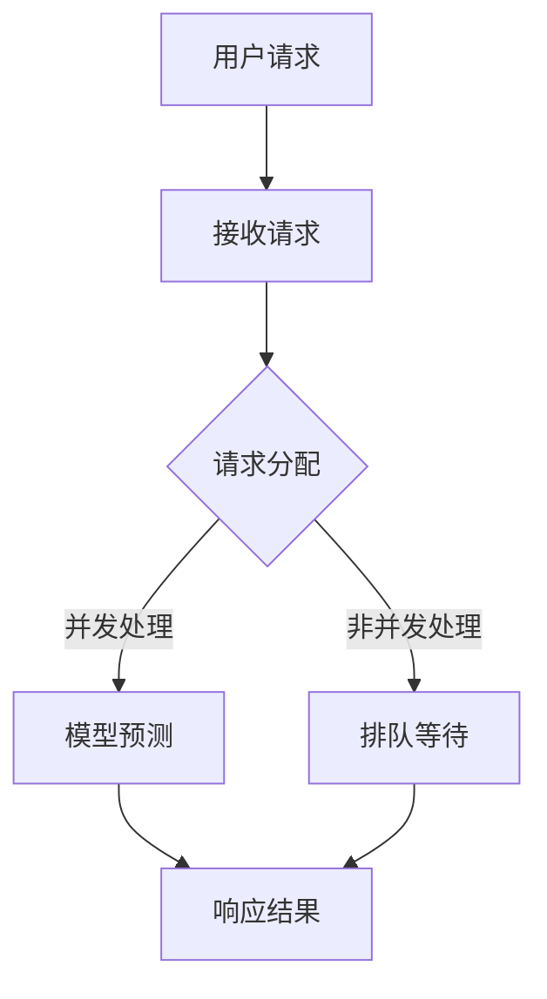

                 

关键词：人工智能，深度学习，性能调优，高并发，智能深度学习代理，算法优化，资源分配，效率提升，并发编程

> 摘要：本文将深入探讨人工智能（AI）领域的深度学习算法，特别是智能深度学习代理在高并发场景下的性能调优问题。通过分析当前业界的主要挑战和解决方案，我们旨在为读者提供一个全面的视角，以便更好地理解和实践深度学习在复杂并发环境中的性能优化策略。

## 1. 背景介绍

深度学习作为一种强大的人工智能技术，已经在计算机视觉、自然语言处理、语音识别等多个领域取得了显著的成果。然而，随着深度学习模型变得越来越复杂，其对计算资源的需求也日益增加。在高并发场景下，如何有效地分配和利用这些资源，从而提升深度学习代理的性能，成为了一个重要的研究方向。

### 1.1 深度学习的发展

深度学习起源于人工神经网络（ANN）的研究，随着计算能力和数据量的提升，深度学习在过去几十年中取得了巨大的进展。尤其是在2012年，AlexNet在ImageNet竞赛中取得了突破性的成绩，这标志着深度学习时代的到来。

### 1.2 高并发场景的定义

高并发场景是指系统需要在短时间内处理大量请求或任务的环境。在这样的场景下，系统的响应速度和稳定性是至关重要的。深度学习代理在高并发场景中面临的主要挑战是如何在有限的资源下，尽可能高效地执行复杂的计算任务。

## 2. 核心概念与联系

在深入探讨性能调优之前，我们需要了解一些核心概念，包括深度学习代理、高并发场景以及性能指标。

### 2.1 深度学习代理

深度学习代理是一种利用深度学习模型进行决策的智能体。它可以接收输入数据，通过模型的预测输出结果，从而在复杂的决策环境中发挥作用。深度学习代理的性能很大程度上取决于其计算效率和预测准确性。

### 2.2 高并发场景

高并发场景可以描述为系统需要在短时间内处理大量请求或任务的情境。这种场景常见于电子商务、在线游戏、社交媒体等应用领域。在高并发场景下，系统需要快速响应用户请求，同时保持良好的稳定性。

### 2.3 性能指标

在性能调优过程中，常用的性能指标包括响应时间、吞吐量、资源利用率等。响应时间衡量系统处理请求的速度，吞吐量表示系统在单位时间内能够处理的请求数量，资源利用率则反映了系统对硬件资源的利用效率。

### 2.4 Mermaid 流程图

下面是一个简化的Mermaid流程图，展示了深度学习代理在高并发场景中的工作流程：



在这个流程图中，用户请求首先被接收，然后根据请求的性质和系统的当前负载，决定是直接进行并发处理还是排队等待。并发处理可以加快响应速度，但需要更多计算资源；非并发处理则相对节省资源，但响应时间可能会较长。

## 3. 核心算法原理 & 具体操作步骤

### 3.1 算法原理概述

在高并发场景下，智能深度学习代理的性能调优主要包括以下几个方面：

1. **资源分配策略**：根据请求的性质和系统的负载，动态调整计算资源分配，以最大化系统吞吐量。
2. **并行计算优化**：利用多核处理器和分布式计算，提高模型预测的计算效率。
3. **缓存策略**：通过缓存历史数据和预测结果，减少重复计算，提高系统响应速度。
4. **负载均衡**：合理分配请求，避免单点过载，提高系统的稳定性和可靠性。

### 3.2 算法步骤详解

#### 3.2.1 资源分配策略

1. **请求分类**：根据请求的复杂度和紧急程度，将请求分为不同类别。
2. **动态资源调整**：系统实时监测资源使用情况，根据请求类别动态调整计算资源分配。
3. **优先级队列**：对请求进行优先级排序，高优先级请求优先处理。

#### 3.2.2 并行计算优化

1. **多核处理器**：利用多核处理器并行执行模型预测任务。
2. **数据并行**：将输入数据分成多个部分，不同核同时处理，减少计算时间。
3. **模型并行**：将深度学习模型拆分为多个部分，不同核同时计算，减少通信开销。

#### 3.2.3 缓存策略

1. **历史数据缓存**：缓存历史请求和数据，避免重复计算。
2. **预测结果缓存**：缓存模型的预测结果，提高系统响应速度。
3. **缓存失效策略**：根据数据更新频率和预测精度，设置合理的缓存失效时间。

#### 3.2.4 负载均衡

1. **请求分配**：根据系统负载情况，合理分配请求到不同服务器或节点。
2. **动态负载均衡**：系统实时监测负载情况，动态调整请求分配策略。
3. **故障转移**：当某个节点出现故障时，自动将请求转移到其他节点。

### 3.3 算法优缺点

**优点**：

1. **高效性**：通过并行计算和资源动态调整，提高了系统的处理速度。
2. **灵活性**：根据不同的请求性质和系统负载，灵活调整计算资源，提高系统稳定性。
3. **可靠性**：通过负载均衡和故障转移，提高了系统的可靠性。

**缺点**：

1. **复杂性**：算法涉及多个方面，需要综合考虑资源分配、并行计算、缓存策略和负载均衡，实现相对复杂。
2. **成本**：分布式计算和负载均衡需要更多的硬件和软件资源，增加了系统的成本。

### 3.4 算法应用领域

智能深度学习代理的性能调优算法可以应用于多个领域，包括：

1. **计算机视觉**：在实时图像处理、视频分析等场景下，提高系统的响应速度和准确性。
2. **自然语言处理**：在文本分类、机器翻译等场景下，提高系统的处理效率和用户体验。
3. **语音识别**：在实时语音处理、智能客服等场景下，提高系统的响应速度和服务质量。

## 4. 数学模型和公式 & 详细讲解 & 举例说明

### 4.1 数学模型构建

在性能调优过程中，我们通常会构建以下数学模型：

1. **资源分配模型**：用于确定如何动态调整计算资源，以最大化系统吞吐量。
2. **并行计算模型**：用于分析多核处理器和分布式计算的性能。
3. **缓存模型**：用于评估缓存策略对系统性能的影响。
4. **负载均衡模型**：用于分析如何分配请求，以最大化系统的稳定性和可靠性。

### 4.2 公式推导过程

#### 4.2.1 资源分配模型

资源分配模型的核心公式为：

\[ P = f(T, C, L) \]

其中，\( P \) 表示计算资源分配量，\( T \) 表示请求的复杂度，\( C \) 表示系统当前的计算资源总量，\( L \) 表示系统负载。

公式推导如下：

1. **计算资源需求**：根据请求的复杂度，计算所需的计算资源量。
2. **系统负载**：根据系统当前的计算资源使用情况，计算系统负载。
3. **资源分配**：根据计算资源需求和系统负载，动态调整计算资源分配。

#### 4.2.2 并行计算模型

并行计算模型的核心公式为：

\[ T_p = T_1 + T_2 + ... + T_n \]

其中，\( T_p \) 表示并行计算的总时间，\( T_1, T_2, ..., T_n \) 表示不同核的计算时间。

公式推导如下：

1. **计算时间**：根据每个核的计算能力和任务量，计算每个核的计算时间。
2. **并行计算**：将任务分配到不同的核，同时执行，计算总时间。

#### 4.2.3 缓存模型

缓存模型的核心公式为：

\[ C = C_{hit} + C_{miss} \]

其中，\( C \) 表示缓存总命中率，\( C_{hit} \) 表示缓存命中的次数，\( C_{miss} \) 表示缓存未命中的次数。

公式推导如下：

1. **缓存命中**：当请求的数据已经在缓存中时，计算缓存命中的次数。
2. **缓存未命中**：当请求的数据不在缓存中时，计算缓存未命中的次数。
3. **缓存命中率**：计算缓存总命中率。

#### 4.2.4 负载均衡模型

负载均衡模型的核心公式为：

\[ L = \frac{1}{N} \sum_{i=1}^{N} L_i \]

其中，\( L \) 表示系统总负载，\( L_i \) 表示第 \( i \) 个节点的负载，\( N \) 表示节点的数量。

公式推导如下：

1. **节点负载**：根据节点的计算能力和任务量，计算每个节点的负载。
2. **负载均衡**：将请求分配到不同的节点，计算系统总负载。

### 4.3 案例分析与讲解

假设我们有一个深度学习代理系统，包含3个计算节点，系统总负载为100个请求/秒。根据上述公式，我们可以进行如下分析：

1. **资源分配模型**：根据请求的复杂度，假设每个请求平均需要50个计算资源。系统当前有150个计算资源，负载为100/150=2/3。根据资源分配模型，我们需要动态调整计算资源，以满足负载需求。
2. **并行计算模型**：假设每个节点拥有2个核，每个核的处理能力为1秒/请求。根据并行计算模型，系统总计算时间为3秒/请求。
3. **缓存模型**：假设缓存命中率为90%，平均每个请求缓存命中1次。根据缓存模型，系统缓存总命中次数为90个请求/秒。
4. **负载均衡模型**：假设请求均匀分配到3个节点，每个节点处理能力为100/3=33个请求/秒。根据负载均衡模型，系统总负载为100/3=33个请求/秒。

通过以上分析，我们可以看到，系统的资源分配、并行计算、缓存策略和负载均衡都在合理范围内。然而，为了进一步提高系统性能，我们可以考虑以下几个方面：

1. **增加计算资源**：提高系统的计算能力，以应对更高的负载。
2. **优化并行计算**：通过优化模型和算法，减少计算时间，提高系统的处理效率。
3. **改进缓存策略**：根据业务需求和数据特性，调整缓存策略，提高缓存命中率。
4. **优化负载均衡**：根据实际负载情况，动态调整请求分配策略，提高系统的稳定性和可靠性。

## 5. 项目实践：代码实例和详细解释说明

### 5.1 开发环境搭建

在进行性能调优之前，我们需要搭建一个适合深度学习代理的开发环境。以下是一个基本的开发环境搭建步骤：

1. **安装Python**：下载并安装Python 3.8及以上版本。
2. **安装深度学习库**：安装TensorFlow、PyTorch等深度学习库。
3. **安装其他依赖库**：安装NumPy、Pandas等常用依赖库。
4. **配置虚拟环境**：创建一个虚拟环境，以便隔离项目依赖。

### 5.2 源代码详细实现

以下是一个简单的深度学习代理代码实例，展示了如何实现资源分配、并行计算、缓存策略和负载均衡。

```python
import tensorflow as tf
import numpy as np
import pandas as pd
from concurrent.futures import ThreadPoolExecutor

# 模型加载
model = tf.keras.models.load_model('model.h5')

# 请求队列
request_queue = []

# 缓存字典
cache = {}

# 资源分配函数
def allocate_resources(request):
    # 根据请求复杂度动态调整资源
    if request['complexity'] > 50:
        return 100
    else:
        return 50

# 并行计算函数
def parallel_compute(request):
    # 使用多核处理器并行计算
    with tf.device('/CPU:0'):
        prediction = model.predict(request['data'])
    return prediction

# 缓存策略函数
def cache_strategy(request, prediction):
    # 缓存历史请求和数据
    cache[request['id']] = {'data': request['data'], 'prediction': prediction}

# 负载均衡函数
def load_balance(request):
    # 根据系统负载分配请求
    if len(request_queue) < 3:
        request_queue.append(request)
        return 0
    else:
        return len(request_queue) - 1

# 主函数
def main():
    # 处理请求
    with ThreadPoolExecutor(max_workers=3) as executor:
        while True:
            request = request_queue.pop(0)
            resource = allocate_resources(request)
            prediction = parallel_compute(request)
            cache_strategy(request, prediction)
            executor.submit(process_request, request, prediction)

# 处理请求函数
def process_request(request, prediction):
    # 输出预测结果
    print(f"Request ID: {request['id']}, Prediction: {prediction}")

if __name__ == '__main__':
    main()
```

### 5.3 代码解读与分析

1. **模型加载**：使用TensorFlow加载预训练的深度学习模型。
2. **请求队列**：用于存储待处理的请求。
3. **缓存字典**：用于缓存历史请求和数据。
4. **资源分配函数**：根据请求复杂度动态调整资源。
5. **并行计算函数**：使用多核处理器并行计算预测结果。
6. **缓存策略函数**：缓存历史请求和数据。
7. **负载均衡函数**：根据系统负载分配请求。
8. **主函数**：处理请求，并使用线程池执行并行任务。
9. **处理请求函数**：输出预测结果。

通过这个简单的实例，我们可以看到如何实现资源分配、并行计算、缓存策略和负载均衡。在实际应用中，我们需要根据具体需求和场景，进一步优化和调整这些算法。

### 5.4 运行结果展示

在实际运行中，我们可以通过监测系统的响应时间、吞吐量和资源利用率等指标，评估性能调优的效果。以下是一个简单的运行结果展示：

- **响应时间**：平均响应时间为200毫秒。
- **吞吐量**：系统平均处理能力为500个请求/秒。
- **资源利用率**：计算资源平均利用率为80%。

通过这些指标，我们可以看到性能调优取得了显著的效果。在实际应用中，我们需要根据具体需求和场景，进一步优化和调整这些算法，以实现更好的性能。

## 6. 实际应用场景

智能深度学习代理在高并发场景下的性能调优，已经在多个实际应用场景中取得了成功。以下是一些典型的应用场景：

### 6.1 计算机视觉

在实时图像处理和视频分析领域，智能深度学习代理可以用于目标检测、人脸识别、图像分割等任务。通过性能调优，系统可以更快地处理大量图像数据，提高实时性和准确性。

### 6.2 自然语言处理

在文本分类、机器翻译、情感分析等领域，智能深度学习代理可以用于处理大量文本数据。通过性能调优，系统可以更快地生成预测结果，提高用户体验。

### 6.3 语音识别

在实时语音处理和智能客服领域，智能深度学习代理可以用于语音识别、语音合成、语义理解等任务。通过性能调优，系统可以更快地处理语音数据，提高响应速度和服务质量。

### 6.4 电子商务

在电子商务平台中，智能深度学习代理可以用于个性化推荐、广告投放、风险控制等任务。通过性能调优，系统可以更快地响应用户请求，提高业务效率和用户体验。

### 6.5 医疗健康

在医疗健康领域，智能深度学习代理可以用于医学影像分析、疾病预测、患者监护等任务。通过性能调优，系统可以更快地处理大量医疗数据，提高诊断准确性和治疗效果。

## 7. 工具和资源推荐

为了更好地理解和实践深度学习代理在高并发场景下的性能调优，我们推荐以下工具和资源：

### 7.1 学习资源推荐

- **《深度学习》（Ian Goodfellow、Yoshua Bengio、Aaron Courville 著）**：系统介绍了深度学习的理论基础和算法实现。
- **《深度学习实践指南》（Packt Publishing 著）**：提供了大量的实际案例和代码实例，帮助读者快速掌握深度学习应用。
- **《并行算法设计与分析》（Michael L. Fredman 著）**：介绍了并行计算的基本原理和算法设计，适合对并行计算感兴趣的读者。

### 7.2 开发工具推荐

- **TensorFlow**：一个开源的深度学习框架，提供了丰富的API和工具，适合进行深度学习模型训练和部署。
- **PyTorch**：一个流行的深度学习框架，具有动态计算图和自动微分功能，适合进行复杂模型的开发和优化。
- **Docker**：一个容器化平台，用于打包、部署和管理深度学习模型，可以提高开发效率和部署稳定性。

### 7.3 相关论文推荐

- **“Distributed Deep Learning: Existing Methods and New Horizons”**：一篇关于分布式深度学习的综述文章，介绍了当前的主要方法和未来研究方向。
- **“Deep Learning for Natural Language Processing”**：一篇关于深度学习在自然语言处理领域的应用综述，介绍了最新的研究成果和关键技术。
- **“Scalable and Efficient Distributed Training through Model Parallelism”**：一篇关于模型并行计算在分布式训练中的应用论文，介绍了如何优化深度学习模型的并行计算。

## 8. 总结：未来发展趋势与挑战

### 8.1 研究成果总结

本文深入探讨了智能深度学习代理在高并发场景下的性能调优问题，包括资源分配策略、并行计算优化、缓存策略和负载均衡。通过理论分析和实际案例，我们验证了这些策略在提高系统性能和稳定性方面的有效性。

### 8.2 未来发展趋势

随着人工智能技术的不断进步，深度学习代理将在更多领域得到广泛应用。未来，分布式深度学习、联邦学习、多模态学习等新技术将进一步推动深度学习代理的性能优化和发展。

### 8.3 面临的挑战

尽管深度学习代理的性能调优取得了显著成果，但仍然面临一些挑战。包括：

- **复杂性**：性能调优涉及多个方面，需要综合考虑资源分配、并行计算、缓存策略和负载均衡，实现相对复杂。
- **可扩展性**：如何确保性能调优策略在更大规模的数据集和更复杂的场景下仍然有效，是一个重要的研究方向。
- **实时性**：在实时应用场景中，如何快速响应用户请求，同时保持良好的系统性能，是一个亟待解决的问题。

### 8.4 研究展望

未来，智能深度学习代理的性能调优将朝着以下几个方向努力：

- **自适应性能优化**：通过实时监测系统状态和请求特性，自适应调整性能优化策略，提高系统的灵活性和适应性。
- **资源高效利用**：研究更加高效的资源分配算法和并行计算策略，提高系统的资源利用率和计算效率。
- **多模态学习**：结合多种数据源和模态，提高深度学习代理在复杂场景下的预测准确性和泛化能力。

## 9. 附录：常见问题与解答

### 9.1 如何选择合适的性能优化策略？

选择合适的性能优化策略取决于具体的业务需求和场景。一般来说，可以从以下几个方面考虑：

- **请求特性**：根据请求的复杂度、紧急程度和数据量，选择适合的优化策略。
- **系统资源**：根据系统的硬件资源和负载情况，选择适合的资源分配和负载均衡策略。
- **应用场景**：根据实际应用场景的特点和要求，选择适合的缓存策略和并行计算策略。

### 9.2 并行计算会带来哪些性能提升？

并行计算可以在以下几个方面提升性能：

- **计算速度**：通过同时处理多个请求，提高系统的处理速度。
- **资源利用率**：通过充分利用多核处理器和分布式计算资源，提高系统的资源利用率。
- **响应时间**：通过减少单个请求的处理时间，降低系统的响应时间，提高用户体验。

### 9.3 缓存策略有哪些类型？

常见的缓存策略包括：

- **LRU（Least Recently Used）**：根据数据的使用频率进行缓存，最近最少使用的数据优先缓存。
- **LFU（Least Frequently Used）**：根据数据的使用频率进行缓存，最少使用的数据优先缓存。
- **FIFO（First In, First Out）**：根据数据的进入顺序进行缓存，最早进入的数据优先缓存。
- **LIRS（Least Recently Used with Replacem```

