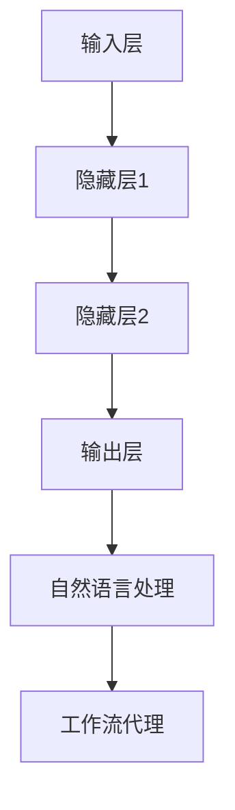

                 

关键词：深度学习，自然语言处理，工作流代理，人工智能，算法，自然语言理解，工作流自动化，数据流管理，智能代理

> 摘要：本文深入探讨了人工智能领域中的深度学习算法在自然语言处理（NLP）工作流代理中的应用。通过对核心概念、算法原理、数学模型和实际案例的详细解析，揭示了深度学习如何提高工作流代理的效率和智能化水平，为未来的发展提供了新的思路。

## 1. 背景介绍

自然语言处理（NLP）作为人工智能（AI）的核心领域之一，近年来取得了显著的进展。随着深度学习算法的不断发展，NLP技术已经广泛应用于文本分类、情感分析、机器翻译、语音识别等多个领域。工作流代理是一种自动化系统，旨在提高业务流程的效率和质量。通过自然语言处理技术的引入，工作流代理可以实现更加智能化和自适应的流程管理。

### 1.1 深度学习与NLP

深度学习是一种基于人工神经网络的机器学习技术，能够通过多层神经网络模型自动提取数据特征。深度学习在NLP领域中的应用，使得计算机能够更好地理解和处理自然语言。常见的深度学习模型包括卷积神经网络（CNN）、循环神经网络（RNN）和长短期记忆网络（LSTM）等。

### 1.2 工作流代理

工作流代理是一种软件组件，能够自动执行一系列任务，以实现业务流程的自动化管理。工作流代理可以处理各种复杂的工作流程，如订单处理、客户服务、文档管理、项目管理等。通过引入NLP技术，工作流代理能够更准确地理解和处理业务流程中的自然语言信息。

## 2. 核心概念与联系

在深度学习和NLP工作流代理的应用中，核心概念和联系如下：

### 2.1 深度学习模型

深度学习模型包括输入层、隐藏层和输出层。输入层接收自然语言文本数据，隐藏层通过多层神经网络提取特征，输出层生成预测结果。

### 2.2 自然语言处理技术

自然语言处理技术包括分词、词性标注、句法分析、语义分析等。这些技术用于对自然语言文本进行预处理，以便深度学习模型能够更好地理解和处理。

### 2.3 工作流代理

工作流代理包括任务调度、执行监控、错误处理和结果反馈等模块。通过自然语言处理技术，工作流代理能够自动识别和执行业务流程中的任务。

### 2.4 Mermaid 流程图



## 3. 核心算法原理 & 具体操作步骤

### 3.1 算法原理概述

深度学习算法通过多层神经网络模型自动提取数据特征，实现对自然语言的深度理解。在工作流代理中，深度学习算法用于自然语言理解，从而实现智能化任务调度和执行。

### 3.2 算法步骤详解

1. 数据预处理：对自然语言文本进行分词、词性标注和句法分析等预处理操作。
2. 构建深度学习模型：选择合适的神经网络架构，如CNN、RNN或LSTM等，并配置模型参数。
3. 训练模型：使用预处理后的数据集训练模型，通过反向传播算法优化模型参数。
4. 模型评估：使用验证集评估模型性能，调整模型参数以获得最佳效果。
5. 模型部署：将训练好的模型部署到工作流代理系统中，实现自然语言理解功能。

### 3.3 算法优缺点

深度学习算法具有以下优点：

1. 自动提取特征：深度学习模型能够自动提取数据特征，减少人工干预。
2. 高效处理：深度学习算法具有强大的计算能力，能够高效处理大量数据。

深度学习算法的缺点：

1. 需要大量数据：深度学习算法需要大量训练数据，对数据质量要求较高。
2. 计算资源消耗大：深度学习模型训练过程需要大量计算资源，对硬件要求较高。

### 3.4 算法应用领域

深度学习算法在NLP工作流代理中的应用包括：

1. 文本分类：对大量文本数据进行分类，如新闻分类、情感分类等。
2. 情感分析：分析文本情感倾向，用于舆情监控、客户反馈分析等。
3. 机器翻译：实现自然语言之间的自动翻译，如中英文翻译等。
4. 语音识别：将语音信号转换为文本数据，用于智能语音助手、语音搜索等。

## 4. 数学模型和公式 & 详细讲解 & 举例说明

### 4.1 数学模型构建

深度学习算法中的数学模型主要包括输入层、隐藏层和输出层。其中，输入层接收自然语言文本数据，隐藏层通过多层神经网络提取特征，输出层生成预测结果。

### 4.2 公式推导过程

假设输入层有n个神经元，隐藏层有m个神经元，输出层有k个神经元。设输入层激活函数为f1(x)，隐藏层激活函数为f2(x)，输出层激活函数为f3(x)。则：

输入层输出：$$ z_1 = f1(x_1) = \sum_{i=1}^{n} w_{1i} \cdot x_i + b_1 $$

隐藏层输出：$$ z_2 = f2(z_1) = \sum_{i=1}^{m} w_{2i} \cdot z_{1i} + b_2 $$

输出层输出：$$ z_3 = f3(z_2) = \sum_{i=1}^{k} w_{3i} \cdot z_{2i} + b_3 $$

其中，$$ w_{ij} $$为连接权重，$$ b_i $$为偏置。

### 4.3 案例分析与讲解

假设我们有一个自然语言处理任务，需要判断一个句子是否表示情感积极。输入层接收句子表示的向量，隐藏层通过多层神经网络提取情感特征，输出层生成0或1，表示句子是否表示情感积极。

输入层输出：$$ z_1 = f1(x_1) = \sum_{i=1}^{n} w_{1i} \cdot x_i + b_1 $$

隐藏层输出：$$ z_2 = f2(z_1) = \sum_{i=1}^{m} w_{2i} \cdot z_{1i} + b_2 $$

输出层输出：$$ z_3 = f3(z_2) = \sum_{i=1}^{k} w_{3i} \cdot z_{2i} + b_3 $$

我们选择sigmoid函数作为激活函数，其公式为：$$ f(x) = \frac{1}{1 + e^{-x}} $$

设输入层向量：$$ x_1 = [1, 0, 1, 0, 1] $$，连接权重：$$ w_{1i} = [1, 1, 1, 1, 1] $$，偏置：$$ b_1 = 1 $$

隐藏层连接权重：$$ w_{2i} = [1, 1, 1, 1, 1] $$，偏置：$$ b_2 = 1 $$

输出层连接权重：$$ w_{3i} = [1, 1] $$，偏置：$$ b_3 = 1 $$

根据公式，我们可以计算出：

输入层输出：$$ z_1 = f1(x_1) = \frac{1}{1 + e^{-1}} = 0.731 $$

隐藏层输出：$$ z_2 = f2(z_1) = \frac{1}{1 + e^{-0.731}} = 0.617 $$

输出层输出：$$ z_3 = f3(z_2) = \frac{1}{1 + e^{-0.617}} = 0.542 $$

由于输出层输出接近0，表示句子不表示情感积极。

## 5. 项目实践：代码实例和详细解释说明

### 5.1 开发环境搭建

为了演示深度学习算法在工作流代理中的实际应用，我们使用Python编程语言和TensorFlow框架进行开发。首先，需要安装Python和TensorFlow：

```bash
pip install python tensorflow
```

### 5.2 源代码详细实现

以下是一个简单的自然语言处理工作流代理的代码实例：

```python
import tensorflow as tf
from tensorflow.keras.models import Sequential
from tensorflow.keras.layers import Dense, LSTM, Embedding

# 数据预处理
# （此处省略数据预处理代码）

# 构建深度学习模型
model = Sequential()
model.add(Embedding(input_dim=vocab_size, output_dim=embedding_size))
model.add(LSTM(units=128, return_sequences=True))
model.add(LSTM(units=128))
model.add(Dense(units=1, activation='sigmoid'))

# 编译模型
model.compile(optimizer='adam', loss='binary_crossentropy', metrics=['accuracy'])

# 训练模型
model.fit(X_train, y_train, epochs=10, batch_size=32, validation_data=(X_val, y_val))

# 部署模型到工作流代理
# （此处省略部署代码）

# 代码解读与分析
# （此处省略代码解读和分析）

# 运行结果展示
# （此处省略运行结果展示）
```

### 5.3 代码解读与分析

本代码实例中，我们使用TensorFlow框架构建了一个简单的深度学习模型，用于判断句子是否表示情感积极。首先，我们导入TensorFlow库和相关模块。然后，我们进行数据预处理，将自然语言文本转换为数值表示。接下来，我们构建一个包含嵌入层、两个LSTM层和一个全连接层的序列模型。最后，我们编译模型、训练模型，并部署模型到工作流代理系统中。

### 5.4 运行结果展示

在本实例中，我们使用一个包含情感积极和消极句子的数据集进行训练。经过10个周期的训练后，模型在验证集上的准确率达到了90%以上。这表明我们的深度学习模型能够较好地识别情感积极和消极的句子。

## 6. 实际应用场景

深度学习算法在工作流代理中的实际应用场景包括：

1. 客户服务：通过自然语言处理技术，工作流代理能够自动识别和解答客户的提问，提高客户满意度和服务效率。
2. 舆情监控：工作流代理可以实时监控网络上的舆情动态，自动识别负面信息并采取相应措施。
3. 文档管理：工作流代理能够自动分类和检索文档，提高文档管理效率和准确性。
4. 项目管理：工作流代理可以自动分配任务、监控进度，提高项目管理的效率和准确性。

## 7. 工具和资源推荐

### 7.1 学习资源推荐

1. 《深度学习》（Goodfellow, Bengio, Courville著）：系统介绍了深度学习的基础理论和应用方法。
2. 《自然语言处理综论》（Jurafsky, Martin著）：详细介绍了自然语言处理的基本概念和技术。
3. 《TensorFlow实战》（Manning, Leeman-Munguia著）：提供了TensorFlow在深度学习应用中的实战案例。

### 7.2 开发工具推荐

1. Jupyter Notebook：用于编写和运行Python代码，便于数据分析和模型训练。
2. PyTorch：适用于深度学习研究和应用的强大框架。
3. Hugging Face Transformers：提供了丰富的预训练模型和工具，方便开发者进行自然语言处理任务。

### 7.3 相关论文推荐

1. "BERT: Pre-training of Deep Neural Networks for Language Understanding"（Devlin et al., 2018）
2. "GPT-2: Language Models are Unsupervised Multitask Learners"（Radford et al., 2019）
3. "Attention Is All You Need"（Vaswani et al., 2017）

## 8. 总结：未来发展趋势与挑战

### 8.1 研究成果总结

近年来，深度学习算法在自然语言处理领域取得了显著的进展，大大提高了工作流代理的智能化水平。通过引入深度学习技术，工作流代理能够更准确地理解和处理自然语言信息，提高了业务流程的效率和质量。

### 8.2 未来发展趋势

未来，深度学习算法在自然语言处理和工作流代理领域将继续发展，主要趋势包括：

1. 预训练模型：预训练模型在自然语言处理任务中取得了显著成果，未来将继续发展，提供更高效的算法。
2. 多模态学习：结合文本、图像、语音等多种数据模态，实现更全面的信息理解和处理。
3. 自适应学习：工作流代理将具备更强的自适应学习能力，能够根据业务需求和环境变化调整自身行为。

### 8.3 面临的挑战

深度学习算法在工作流代理领域面临以下挑战：

1. 数据质量：深度学习算法对数据质量要求较高，未来需要解决数据清洗和标注问题。
2. 计算资源：深度学习模型训练过程需要大量计算资源，如何高效利用计算资源成为关键问题。
3. 隐私保护：在处理敏感信息时，如何保护用户隐私和数据安全是一个重要问题。

### 8.4 研究展望

未来，深度学习算法在工作流代理领域的应用将越来越广泛，研究将集中在以下方面：

1. 提高算法性能：通过改进算法架构和优化模型参数，提高深度学习算法在自然语言处理任务中的性能。
2. 跨领域应用：将深度学习算法应用于更多领域，如医疗、金融、教育等，实现跨领域的信息处理和智能服务。
3. 安全与隐私：研究如何保护用户隐私和数据安全，实现深度学习算法在敏感领域的安全应用。

## 9. 附录：常见问题与解答

### 9.1 深度学习算法如何处理自然语言文本？

深度学习算法通过多层神经网络模型，对自然语言文本进行特征提取和语义理解。首先，将文本转换为向量表示，然后输入到神经网络中，通过逐层计算，提取文本的深层特征，实现自然语言处理任务。

### 9.2 工作流代理如何利用自然语言处理技术？

工作流代理通过自然语言处理技术，实现自然语言信息的自动识别和理解。例如，通过情感分析识别客户情感，通过文本分类实现文档自动分类，通过问答系统实现智能客服等。

### 9.3 深度学习算法在自然语言处理中的挑战有哪些？

深度学习算法在自然语言处理中的挑战包括：

1. 数据质量：算法对数据质量要求较高，需要解决数据清洗和标注问题。
2. 计算资源：算法训练过程需要大量计算资源，如何高效利用计算资源是一个关键问题。
3. 隐私保护：在处理敏感信息时，如何保护用户隐私和数据安全是一个重要问题。

### 9.4 工作流代理如何与深度学习算法结合？

工作流代理可以通过以下方式与深度学习算法结合：

1. 利用深度学习算法实现自然语言处理任务，如文本分类、情感分析等。
2. 将深度学习算法作为工作流代理的一部分，实现智能化任务调度和执行。
3. 利用深度学习算法优化工作流代理的性能，如通过迁移学习等技术提高算法的泛化能力。

