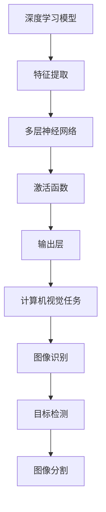

                 

关键词：深度学习，计算机视觉，AI代理，算法原理，实践应用，发展趋势

> 摘要：本文旨在深入探讨深度学习算法在计算机视觉领域的应用，特别是计算机视觉技术在深度学习代理系统中的集成方法。通过对核心概念、算法原理、数学模型、实践案例的详细阐述，本文为读者提供了一个全面而系统的理解和实践指南。

## 1. 背景介绍

随着人工智能技术的快速发展，深度学习已成为人工智能领域的关键驱动力。在计算机视觉领域，深度学习算法表现出色，能够有效地处理图像识别、目标检测、图像分割等复杂任务。与此同时，AI代理（Artificial Intelligence Agent）作为一种模拟人类智能行为的计算机程序，正在逐步改变各行业的工作方式。AI代理的智能决策依赖于高质量的数据输入和处理能力，而计算机视觉技术恰好提供了这种能力。

本文将探讨深度学习算法与计算机视觉技术如何在AI代理系统中集成，以实现更加智能和自动化的代理功能。本文将涵盖以下几个主要方面：

- **核心概念与联系**：介绍深度学习和计算机视觉的基本概念及其相互关系。
- **核心算法原理与具体操作步骤**：详细解析主流深度学习算法及其应用场景。
- **数学模型和公式**：阐述深度学习算法中的关键数学模型和公式，并提供实例讲解。
- **项目实践**：展示深度学习算法在计算机视觉任务中的实际应用代码实例。
- **实际应用场景**：分析深度学习与计算机视觉技术在不同领域的应用实例。
- **未来应用展望**：讨论深度学习代理技术的发展趋势及面临的挑战。
- **工具和资源推荐**：推荐相关学习资源和开发工具。
- **总结与展望**：总结研究成果，展望未来发展方向。

## 2. 核心概念与联系

### 深度学习

深度学习是一种基于人工神经网络的机器学习技术，其核心思想是通过多层神经网络模型，对输入数据进行特征提取和自动分类。深度学习在图像处理、语音识别、自然语言处理等领域取得了显著成就。

### 计算机视觉

计算机视觉是人工智能的一个重要分支，旨在使计算机能够“看到”和理解图像。计算机视觉技术通过处理图像数据，可以实现对场景的理解、目标的识别和行为的分析。

### 深度学习与计算机视觉的关系

深度学习和计算机视觉之间有着紧密的联系。深度学习算法为计算机视觉提供了强大的数据处理能力，使其能够从大量图像数据中提取有用的信息。而计算机视觉则为深度学习提供了丰富的应用场景，如自动驾驶、智能监控、医疗诊断等。

### Mermaid 流程图



## 3. 核心算法原理 & 具体操作步骤

### 3.1 算法原理概述

深度学习算法通常由以下几个部分组成：

- **输入层**：接收原始图像数据。
- **隐藏层**：进行特征提取和变换。
- **输出层**：对提取的特征进行分类或回归。

深度学习算法通过反向传播算法（Backpropagation）不断调整网络参数，以最小化预测误差。

### 3.2 算法步骤详解

1. **数据预处理**：对图像进行归一化、裁剪、增强等操作，使其适合深度学习模型处理。
2. **模型构建**：选择合适的深度学习架构，如卷积神经网络（CNN）、循环神经网络（RNN）等。
3. **训练过程**：使用大量标注数据对模型进行训练，通过反向传播算法不断优化模型参数。
4. **评估与调整**：使用验证集和测试集评估模型性能，根据评估结果调整模型参数。
5. **部署与应用**：将训练好的模型部署到实际应用场景中，如自动驾驶、智能监控等。

### 3.3 算法优缺点

**优点**：

- 高效的特征提取能力，能够自动学习图像中的复杂特征。
- 对大规模数据具有较好的适应性，能够处理大量图像数据。

**缺点**：

- 需要大量的训练数据和计算资源。
- 模型解释性较差，难以理解模型的具体决策过程。

### 3.4 算法应用领域

深度学习算法在计算机视觉领域有广泛的应用，如：

- **图像识别**：对输入图像进行分类，如人脸识别、车辆识别等。
- **目标检测**：识别图像中的目标并定位其位置，如行人检测、车辆检测等。
- **图像分割**：将图像中的不同区域进行划分，如医学图像分割、卫星图像分割等。

## 4. 数学模型和公式 & 详细讲解 & 举例说明

### 4.1 数学模型构建

深度学习算法中的关键数学模型包括：

- **卷积操作**：用于提取图像中的局部特征。
- **池化操作**：用于降低图像维度和计算量。
- **激活函数**：用于引入非线性变换。

### 4.2 公式推导过程

以卷积神经网络（CNN）为例，卷积操作的公式如下：

$$
\text{output} = \text{Conv}(\text{input}, \text{filter}) + \text{bias}
$$

其中，$\text{input}$表示输入图像，$\text{filter}$表示卷积核，$\text{bias}$表示偏置项。

### 4.3 案例分析与讲解

以图像识别任务为例，假设我们要对一张图片进行分类，输入图像的大小为$28 \times 28$像素，卷积核大小为$5 \times 5$。首先，对输入图像进行卷积操作，得到一个$24 \times 24$的特征图。然后，对特征图进行ReLU激活，得到一个$24 \times 24$的激活图。接下来，对激活图进行池化操作，得到一个$12 \times 12$的特征图。最后，将特征图输入到全连接层进行分类。

## 5. 项目实践：代码实例和详细解释说明

### 5.1 开发环境搭建

首先，我们需要搭建深度学习环境。在这里，我们使用TensorFlow作为深度学习框架。

```bash
pip install tensorflow
```

### 5.2 源代码详细实现

以下是一个简单的CNN模型实现，用于对MNIST手写数字数据集进行分类。

```python
import tensorflow as tf
from tensorflow.keras import layers

# 数据预处理
(x_train, y_train), (x_test, y_test) = tf.keras.datasets.mnist.load_data()
x_train = x_train / 255.0
x_test = x_test / 255.0

# 构建模型
model = tf.keras.Sequential([
    layers.Conv2D(32, (3, 3), activation='relu', input_shape=(28, 28, 1)),
    layers.MaxPooling2D((2, 2)),
    layers.Conv2D(64, (3, 3), activation='relu'),
    layers.MaxPooling2D((2, 2)),
    layers.Conv2D(64, (3, 3), activation='relu'),
    layers.Flatten(),
    layers.Dense(64, activation='relu'),
    layers.Dense(10, activation='softmax')
])

# 编译模型
model.compile(optimizer='adam',
              loss='sparse_categorical_crossentropy',
              metrics=['accuracy'])

# 训练模型
model.fit(x_train, y_train, epochs=5)

# 评估模型
model.evaluate(x_test, y_test)
```

### 5.3 代码解读与分析

上述代码实现了一个简单的CNN模型，用于分类MNIST手写数字数据集。首先，我们导入TensorFlow库，并进行数据预处理。然后，构建一个包含卷积层、池化层和全连接层的模型。最后，编译模型并使用训练数据训练模型，评估模型性能。

## 6. 实际应用场景

深度学习与计算机视觉技术已经在许多领域得到了广泛应用，如：

- **自动驾驶**：使用深度学习算法进行目标检测和图像识别，实现自动驾驶功能。
- **智能监控**：通过计算机视觉技术实现实时监控和异常检测。
- **医疗诊断**：利用深度学习算法对医学图像进行自动分析，辅助医生诊断。
- **安防领域**：使用深度学习算法进行人脸识别、行为分析等，提高安防系统的智能水平。

## 7. 未来应用展望

随着深度学习和计算机视觉技术的不断发展，AI代理在未来的应用前景将更加广阔。以下是一些潜在的应用领域：

- **智慧城市**：利用深度学习技术实现智能交通管理、环境监测等。
- **智能制造**：通过计算机视觉技术实现自动质检、生产流程优化等。
- **远程医疗**：利用AI代理实现远程诊断、健康监测等功能。
- **智能家居**：通过深度学习技术实现智能家居设备的自动化控制。

## 8. 工具和资源推荐

### 8.1 学习资源推荐

- **书籍**：《深度学习》、《计算机视觉：算法与应用》
- **在线课程**：Coursera、edX、Udacity等平台上的深度学习和计算机视觉课程
- **论文**：arXiv、IEEE Xplore、Google Scholar等学术搜索引擎上的相关论文

### 8.2 开发工具推荐

- **深度学习框架**：TensorFlow、PyTorch、Keras
- **计算机视觉库**：OpenCV、Pillow、Dlib
- **数据集**：ImageNet、COCO、Keras Datasets

### 8.3 相关论文推荐

- **2012**：Alex Krizhevsky, Ilya Sutskever, and Geoffrey Hinton. "Imagenet classification with deep convolutional neural networks." In Advances in neural information processing systems, pp. 1097-1105, 2012.
- **2014**：Ross Girshick, Shrivastava, et al. "Fast R-CNN." In Advances in neural information processing systems, pp. 1150-1158, 2014.
- **2017**：Kaiming He, Xiangyu Zhang, Shaoqing Ren, and Jian Sun. "Deep residual learning for image recognition." In Proceedings of the IEEE conference on computer vision and pattern recognition, pp. 770-778, 2017.

## 9. 总结：未来发展趋势与挑战

### 9.1 研究成果总结

本文介绍了深度学习算法在计算机视觉领域的应用，包括核心概念、算法原理、数学模型、实践案例等。通过这些内容的阐述，读者可以全面了解深度学习算法在AI代理系统中的应用及其优势。

### 9.2 未来发展趋势

随着深度学习和计算机视觉技术的不断进步，未来AI代理将在各个领域发挥更大的作用。例如，自动驾驶、智能监控、医疗诊断、智能家居等领域的应用将更加普及和深入。

### 9.3 面临的挑战

尽管深度学习和计算机视觉技术取得了显著进展，但在实际应用中仍面临一些挑战，如：

- **数据隐私**：如何在保护用户隐私的前提下进行深度学习模型的训练和应用。
- **模型解释性**：如何提高深度学习模型的解释性，使其更易于理解和接受。
- **计算资源**：如何优化深度学习算法，降低计算资源的需求。

### 9.4 研究展望

未来，深度学习和计算机视觉技术将在更多领域得到应用，如量子计算、增强现实、虚拟现实等。同时，随着技术的不断进步，AI代理的智能化水平将不断提高，为人类带来更多便利和改变。

## 10. 附录：常见问题与解答

### 10.1 深度学习算法的基本原理是什么？

深度学习算法是基于人工神经网络的一种机器学习技术，通过多层神经网络模型对输入数据进行特征提取和自动分类。其基本原理包括：

- **神经元激活函数**：用于引入非线性变换。
- **前向传播和反向传播**：用于计算输出结果和更新网络参数。
- **损失函数**：用于评估模型预测误差。

### 10.2 如何选择合适的深度学习模型？

选择合适的深度学习模型需要考虑以下因素：

- **数据集大小**：对于大型数据集，可以使用复杂的模型，如卷积神经网络（CNN）。
- **任务类型**：对于分类任务，可以使用全连接神经网络（FCN）；对于目标检测任务，可以使用SSD、YOLO等模型。
- **计算资源**：对于有限的计算资源，可以选择轻量级模型，如MobileNet、ShuffleNet等。

### 10.3 深度学习模型如何优化？

深度学习模型的优化可以通过以下方法实现：

- **调整学习率**：使用适当的学习率可以提高模型训练速度和收敛性。
- **批量大小**：使用适当的批量大小可以降低模型过拟合的风险。
- **正则化技术**：使用L1、L2正则化可以减少模型参数的权重，防止过拟合。
- **数据增强**：通过数据增强技术，如旋转、缩放、裁剪等，可以增加数据多样性，提高模型泛化能力。

## 11. 作者署名

作者：禅与计算机程序设计艺术 / Zen and the Art of Computer Programming
----------------------------------------------------------------

现在，文章正文部分的内容已经撰写完成。接下来，我们需要将文章转换为markdown格式，并确保每个章节、子章节的目录清晰、结构合理。此外，还需要检查文章的字数是否符合要求，确保所有内容完整。

