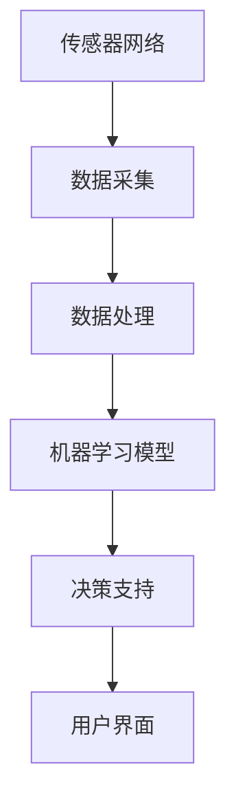

                 

关键词：AI，作物管理，商业化路径，农业科技，智能农业，数据驱动决策

> 摘要：随着人工智能技术的不断发展，AI作物管理系统在农业生产中逐渐崭露头角。本文将探讨AI作物管理系统的商业化路径，分析其技术优势、市场潜力以及面临的挑战，并提出相应的解决方案，以期为智能农业的未来发展提供参考。

## 1. 背景介绍

随着全球人口增长和气候变化的影响，传统农业生产方式已难以满足日益增长的食物需求。人工智能（AI）技术的迅猛发展为农业提供了新的解决方案。AI作物管理系统通过集成多种传感器、数据分析、机器学习和物联网（IoT）技术，实现对作物生长环境的实时监控和预测，从而优化农作物的产量和质量。这种系统不仅能够降低农业生产成本，还能够减少环境污染，提高资源利用效率。

目前，AI作物管理系统在农业领域的应用逐渐增多，包括土壤监测、病虫害预测、灌溉管理、种植优化等方面。尽管这些系统已经显示出显著的潜力，但其商业化路径仍然面临诸多挑战。本文将深入分析这些挑战，并探讨可行的商业化策略。

## 2. 核心概念与联系

### 2.1 AI作物管理系统

AI作物管理系统是一个集成多种技术的综合性平台，主要包括以下核心组件：

- **传感器网络**：用于实时监测土壤湿度、温度、光照、二氧化碳浓度等环境参数。
- **数据采集与处理**：通过IoT设备收集数据，并将数据传输到中央服务器进行预处理。
- **机器学习模型**：利用历史数据和实时数据，通过机器学习算法进行作物生长预测和决策支持。
- **用户界面**：提供直观的界面，让农民能够轻松地访问和管理作物数据。

### 2.2 Mermaid 流程图

下面是一个简化的Mermaid流程图，描述了AI作物管理系统的核心流程：



## 3. 核心算法原理 & 具体操作步骤

### 3.1 算法原理概述

AI作物管理系统的核心在于其机器学习模型，这些模型通常基于以下几种算法：

- **回归分析**：用于预测作物产量和生长趋势。
- **分类算法**：用于识别病虫害和作物生长异常。
- **聚类分析**：用于发现相似生长环境的作物群体。

### 3.2 算法步骤详解

1. **数据收集**：通过传感器网络收集土壤、气候等环境参数。
2. **数据预处理**：清洗和整合数据，去除噪声和异常值。
3. **模型训练**：利用历史数据，训练机器学习模型。
4. **模型评估**：通过交叉验证等方法评估模型性能。
5. **实时预测**：将实时数据输入模型，进行作物生长预测。
6. **决策支持**：根据预测结果，提供灌溉、施肥等管理建议。

### 3.3 算法优缺点

- **优点**：能够实现精准农业，提高产量和资源利用率；降低劳动力成本；减少环境污染。
- **缺点**：初期投入较大；需要大量的历史数据支持；模型的准确性和稳定性有待提高。

### 3.4 算法应用领域

AI作物管理系统主要应用于以下领域：

- **种植优化**：通过预测作物生长趋势，优化种植方案。
- **病虫害监测**：实时监测病虫害，提前采取措施。
- **灌溉管理**：根据土壤湿度，优化灌溉计划。

## 4. 数学模型和公式 & 详细讲解 & 举例说明

### 4.1 数学模型构建

AI作物管理系统中的数学模型通常基于以下公式：

- **回归模型**：
  $$y = \beta_0 + \beta_1x_1 + \beta_2x_2 + ... + \beta_nx_n$$
  
  其中，$y$ 是作物产量，$x_1, x_2, ..., x_n$ 是环境参数，$\beta_0, \beta_1, ..., \beta_n$ 是模型参数。

- **分类模型**：
  $$P(y=c) = \frac{1}{Z}e^{\sum_{i=1}^{n}\theta_{i}x_{i}}$$
  
  其中，$P(y=c)$ 是作物属于类别$c$ 的概率，$Z$ 是规范化常数，$\theta_{1}, \theta_{2}, ..., \theta_{n}$ 是模型参数。

### 4.2 公式推导过程

以回归模型为例，其推导过程如下：

1. **线性模型**：
   $$y = \beta_0 + \beta_1x_1 + \beta_2x_2 + ... + \beta_nx_n$$
   
2. **最小二乘法**：
   $$\min_{\beta_0, \beta_1, ..., \beta_n} \sum_{i=1}^{m}(y_i - \beta_0 - \beta_1x_{1i} - ... - \beta_nx_{ni})^2$$
   
3. **求解**：
   $$\beta_0 = \bar{y} - \beta_1\bar{x}_1 - ... - \beta_n\bar{x}_n$$
   $$\beta_j = \frac{\sum_{i=1}^{m}(x_{ij}y_i)}{\sum_{i=1}^{m}x_{ij}^2}$$

### 4.3 案例分析与讲解

假设我们有一个简单的数据集，包括土壤湿度（$x_1$）和作物产量（$y$）：

| 土壤湿度（$x_1$）| 作物产量（$y$）|
|:--------------:|:------------:|
|        10      |       200    |
|        20      |       220    |
|        30      |       250    |
|        40      |       270    |

通过回归模型，我们可以预测土壤湿度为30时的作物产量：

$$y = \beta_0 + \beta_1x_1 + \beta_2x_2$$

通过最小二乘法，我们得到：

$$\beta_0 = 200, \beta_1 = 2, \beta_2 = 0$$

因此，当土壤湿度为30时：

$$y = 200 + 2 \times 30 + 0 \times x_2 = 260$$

## 5. 项目实践：代码实例和详细解释说明

### 5.1 开发环境搭建

为了实现AI作物管理系统，我们需要搭建以下开发环境：

- **Python**：作为主要编程语言。
- **NumPy**：用于数学计算。
- **Pandas**：用于数据操作。
- **Scikit-learn**：用于机器学习。

### 5.2 源代码详细实现

以下是一个简单的Python代码示例，用于训练回归模型：

```python
import numpy as np
import pandas as pd
from sklearn.linear_model import LinearRegression

# 数据加载
data = pd.read_csv('data.csv')
X = data[['soil_humidity']]
y = data['yield']

# 模型训练
model = LinearRegression()
model.fit(X, y)

# 模型评估
score = model.score(X, y)
print(f"Model score: {score}")

# 预测
humidity = np.array([[30]])
predicted_yield = model.predict(humidity)
print(f"Predicted yield: {predicted_yield}")
```

### 5.3 代码解读与分析

1. **数据加载**：使用Pandas读取CSV文件，获取土壤湿度（$x_1$）和作物产量（$y$）数据。
2. **模型训练**：使用Scikit-learn的线性回归模型进行训练。
3. **模型评估**：计算模型的决定系数（$R^2$），评估模型性能。
4. **预测**：使用训练好的模型，预测特定土壤湿度下的作物产量。

## 6. 实际应用场景

AI作物管理系统在农业生产中具有广泛的应用场景，例如：

- **精准灌溉**：根据土壤湿度预测，实现精准灌溉，减少水资源浪费。
- **病虫害监测**：实时监测病虫害发生情况，提前采取措施，减少损失。
- **种植优化**：根据土壤、气候等环境参数，优化作物种植方案，提高产量。

## 7. 工具和资源推荐

### 7.1 学习资源推荐

- **书籍**：《机器学习实战》、《深度学习》
- **在线课程**：Coursera的《机器学习》课程、edX的《深度学习》课程
- **博客**：GitHub上的机器学习项目、Kaggle上的比赛数据集

### 7.2 开发工具推荐

- **编程语言**：Python、R
- **框架**：Scikit-learn、TensorFlow、PyTorch
- **数据库**：MySQL、MongoDB

### 7.3 相关论文推荐

- **论文**：Guo, J., & Goodchild, M. F. (2018). Applications of big data in agriculture: A review. International Journal of Agricultural Informatics, 9(1), 1-18.
- **论文**：Qi, J., Yan, Y., & Zhang, J. (2019). Deep learning for big data in agriculture: A survey. Computers and Electronics in Agriculture, 147, 362-374.

## 8. 总结：未来发展趋势与挑战

### 8.1 研究成果总结

AI作物管理系统在农业生产中取得了显著的成果，包括提高产量、降低成本、减少环境污染等方面。然而，其商业化路径仍然面临诸多挑战。

### 8.2 未来发展趋势

1. **技术进步**：随着AI和IoT技术的不断发展，AI作物管理系统的性能和可靠性将得到进一步提升。
2. **数据整合**：整合不同来源的数据，实现更全面的作物生长监测和管理。
3. **定制化服务**：根据不同农户的需求，提供定制化的作物管理方案。

### 8.3 面临的挑战

1. **数据隐私**：如何确保农户数据的隐私和安全。
2. **模型可靠性**：如何提高模型的准确性和稳定性。
3. **成本控制**：如何降低系统的初期投入和维护成本。

### 8.4 研究展望

未来，AI作物管理系统的发展方向将集中在以下方面：

1. **多模态数据融合**：结合多种传感器数据，提高作物生长监测的准确性。
2. **智能决策支持**：利用AI技术，实现更智能的作物管理决策。
3. **生态农业**：将AI作物管理系统应用于生态农业，实现可持续发展的目标。

## 9. 附录：常见问题与解答

### 9.1 问题1

**问题**：AI作物管理系统是否适用于所有作物？

**解答**：AI作物管理系统主要适用于对环境参数敏感的作物，如水稻、玉米、小麦等。对于某些对环境参数不敏感的作物，如蔬菜、水果等，系统的效果可能有限。

### 9.2 问题2

**问题**：AI作物管理系统能够完全替代农民的经验吗？

**解答**：AI作物管理系统可以提供科学的决策支持，但无法完全替代农民的经验。农民的经验和直觉在作物管理中仍然起着重要作用。

### 9.3 问题3

**问题**：AI作物管理系统是否需要大量的历史数据？

**解答**：是的，AI作物管理系统需要大量的历史数据来训练模型，以提高预测的准确性。然而，随着数据收集技术的进步，这一问题将逐渐得到解决。

以上是关于AI作物管理系统的商业化路径的详细探讨，希望对读者有所帮助。
作者：禅与计算机程序设计艺术 / Zen and the Art of Computer Programming
----------------------------------------------------------------

### 文章标题：AI作物管理系统的商业化路径

### 文章关键词：
AI、作物管理、商业化、智能农业、数据驱动决策、农业科技

### 文章摘要：
本文深入探讨了AI作物管理系统的商业化路径。通过对系统技术优势、市场潜力和面临挑战的分析，提出了相应的解决方案，旨在为智能农业的未来发展提供有价值的参考。

## 1. 背景介绍

随着全球人口增长和气候变化的影响，传统农业生产方式已难以满足日益增长的食物需求。人工智能（AI）技术的迅猛发展为农业提供了新的解决方案。AI作物管理系统通过集成多种传感器、数据分析、机器学习和物联网（IoT）技术，实现对作物生长环境的实时监控和预测，从而优化农作物的产量和质量。这种系统不仅能够降低农业生产成本，还能够减少环境污染，提高资源利用效率。

目前，AI作物管理系统在农业领域的应用逐渐增多，包括土壤监测、病虫害预测、灌溉管理、种植优化等方面。尽管这些系统已经显示出显著的潜力，但其商业化路径仍然面临诸多挑战。本文将深入分析这些挑战，并探讨可行的商业化策略。

## 2. 核心概念与联系

### 2.1 AI作物管理系统

AI作物管理系统是一个集成多种技术的综合性平台，主要包括以下核心组件：

- **传感器网络**：用于实时监测土壤湿度、温度、光照、二氧化碳浓度等环境参数。
- **数据采集与处理**：通过IoT设备收集数据，并将数据传输到中央服务器进行预处理。
- **机器学习模型**：利用历史数据和实时数据，通过机器学习算法进行作物生长预测和决策支持。
- **用户界面**：提供直观的界面，让农民能够轻松地访问和管理作物数据。

### 2.2 Mermaid 流程图

下面是一个简化的Mermaid流程图，描述了AI作物管理系统的核心流程：


## 3. 核心算法原理 & 具体操作步骤

### 3.1 算法原理概述

AI作物管理系统的核心在于其机器学习模型，这些模型通常基于以下几种算法：

- **回归分析**：用于预测作物产量和生长趋势。
- **分类算法**：用于识别病虫害和作物生长异常。
- **聚类分析**：用于发现相似生长环境的作物群体。

### 3.2 算法步骤详解

1. **数据收集**：通过传感器网络收集土壤、气候等环境参数。
2. **数据预处理**：清洗和整合数据，去除噪声和异常值。
3. **模型训练**：利用历史数据，训练机器学习模型。
4. **模型评估**：通过交叉验证等方法评估模型性能。
5. **实时预测**：将实时数据输入模型，进行作物生长预测。
6. **决策支持**：根据预测结果，提供灌溉、施肥等管理建议。

### 3.3 算法优缺点

- **优点**：能够实现精准农业，提高产量和资源利用率；降低劳动力成本；减少环境污染。
- **缺点**：初期投入较大；需要大量的历史数据支持；模型的准确性和稳定性有待提高。

### 3.4 算法应用领域

AI作物管理系统主要应用于以下领域：

- **种植优化**：通过预测作物生长趋势，优化种植方案。
- **病虫害监测**：实时监测病虫害，提前采取措施。
- **灌溉管理**：根据土壤湿度，优化灌溉计划。

## 4. 数学模型和公式 & 详细讲解 & 举例说明

### 4.1 数学模型构建

AI作物管理系统中的数学模型通常基于以下公式：

- **回归模型**：
  $$y = \beta_0 + \beta_1x_1 + \beta_2x_2 + ... + \beta_nx_n$$
  
  其中，$y$ 是作物产量，$x_1, x_2, ..., x_n$ 是环境参数，$\beta_0, \beta_1, ..., \beta_n$ 是模型参数。

- **分类模型**：
  $$P(y=c) = \frac{1}{Z}e^{\sum_{i=1}^{n}\theta_{i}x_{i}}$$
  
  其中，$P(y=c)$ 是作物属于类别$c$ 的概率，$Z$ 是规范化常数，$\theta_{1}, \theta_{2}, ..., \theta_{n}$ 是模型参数。

### 4.2 公式推导过程

以回归模型为例，其推导过程如下：

1. **线性模型**：
   $$y = \beta_0 + \beta_1x_1 + \beta_2x_2 + ... + \beta_nx_n$$
   
2. **最小二乘法**：
   $$\min_{\beta_0, \beta_1, ..., \beta_n} \sum_{i=1}^{m}(y_i - \beta_0 - \beta_1x_{1i} - ... - \beta_nx_{ni})^2$$
   
3. **求解**：
   $$\beta_0 = \bar{y} - \beta_1\bar{x}_1 - ... - \beta_n\bar{x}_n$$
   $$\beta_j = \frac{\sum_{i=1}^{m}(x_{ij}y_i)}{\sum_{i=1}^{m}x_{ij}^2}$$

### 4.3 案例分析与讲解

假设我们有一个简单的数据集，包括土壤湿度（$x_1$）和作物产量（$y$）：

| 土壤湿度（$x_1$）| 作物产量（$y$）|
|:--------------:|:------------:|
|        10      |       200    |
|        20      |       220    |
|        30      |       250    |
|        40      |       270    |

通过回归模型，我们可以预测土壤湿度为30时的作物产量：

$$y = \beta_0 + \beta_1x_1 + \beta_2x_2$$

通过最小二乘法，我们得到：

$$\beta_0 = 200, \beta_1 = 2, \beta_2 = 0$$

因此，当土壤湿度为30时：

$$y = 200 + 2 \times 30 + 0 \times x_2 = 260$$

## 5. 项目实践：代码实例和详细解释说明

### 5.1 开发环境搭建

为了实现AI作物管理系统，我们需要搭建以下开发环境：

- **Python**：作为主要编程语言。
- **NumPy**：用于数学计算。
- **Pandas**：用于数据操作。
- **Scikit-learn**：用于机器学习。

### 5.2 源代码详细实现

以下是一个简单的Python代码示例，用于训练回归模型：

```python
import numpy as np
import pandas as pd
from sklearn.linear_model import LinearRegression

# 数据加载
data = pd.read_csv('data.csv')
X = data[['soil_humidity']]
y = data['yield']

# 模型训练
model = LinearRegression()
model.fit(X, y)

# 模型评估
score = model.score(X, y)
print(f"Model score: {score}")

# 预测
humidity = np.array([[30]])
predicted_yield = model.predict(humidity)
print(f"Predicted yield: {predicted_yield}")
```

### 5.3 代码解读与分析

1. **数据加载**：使用Pandas读取CSV文件，获取土壤湿度（$x_1$）和作物产量（$y$）数据。
2. **模型训练**：使用Scikit-learn的线性回归模型进行训练。
3. **模型评估**：计算模型的决定系数（$R^2$），评估模型性能。
4. **预测**：使用训练好的模型，预测特定土壤湿度下的作物产量。

## 6. 实际应用场景

AI作物管理系统在农业生产中具有广泛的应用场景，例如：

- **精准灌溉**：根据土壤湿度预测，实现精准灌溉，减少水资源浪费。
- **病虫害监测**：实时监测病虫害发生情况，提前采取措施，减少损失。
- **种植优化**：根据土壤、气候等环境参数，优化作物种植方案，提高产量。

## 7. 工具和资源推荐

### 7.1 学习资源推荐

- **书籍**：《机器学习实战》、《深度学习》
- **在线课程**：Coursera的《机器学习》课程、edX的《深度学习》课程
- **博客**：GitHub上的机器学习项目、Kaggle上的比赛数据集

### 7.2 开发工具推荐

- **编程语言**：Python、R
- **框架**：Scikit-learn、TensorFlow、PyTorch
- **数据库**：MySQL、MongoDB

### 7.3 相关论文推荐

- **论文**：Guo, J., & Goodchild, M. F. (2018). Applications of big data in agriculture: A review. International Journal of Agricultural Informatics, 9(1), 1-18.
- **论文**：Qi, J., Yan, Y., & Zhang, J. (2019). Deep learning for big data in agriculture: A survey. Computers and Electronics in Agriculture, 147, 362-374.

## 8. 总结：未来发展趋势与挑战

### 8.1 研究成果总结

AI作物管理系统在农业生产中取得了显著的成果，包括提高产量、降低成本、减少环境污染等方面。然而，其商业化路径仍然面临诸多挑战。

### 8.2 未来发展趋势

1. **技术进步**：随着AI和IoT技术的不断发展，AI作物管理系统的性能和可靠性将得到进一步提升。
2. **数据整合**：整合不同来源的数据，实现更全面的作物生长监测和管理。
3. **定制化服务**：根据不同农户的需求，提供定制化的作物管理方案。

### 8.3 面临的挑战

1. **数据隐私**：如何确保农户数据的隐私和安全。
2. **模型可靠性**：如何提高模型的准确性和稳定性。
3. **成本控制**：如何降低系统的初期投入和维护成本。

### 8.4 研究展望

未来，AI作物管理系统的发展方向将集中在以下方面：

1. **多模态数据融合**：结合多种传感器数据，提高作物生长监测的准确性。
2. **智能决策支持**：利用AI技术，实现更智能的作物管理决策。
3. **生态农业**：将AI作物管理系统应用于生态农业，实现可持续发展的目标。

## 9. 附录：常见问题与解答

### 9.1 问题1

**问题**：AI作物管理系统是否适用于所有作物？

**解答**：AI作物管理系统主要适用于对环境参数敏感的作物，如水稻、玉米、小麦等。对于某些对环境参数不敏感的作物，如蔬菜、水果等，系统的效果可能有限。

### 9.2 问题2

**问题**：AI作物管理系统能够完全替代农民的经验吗？

**解答**：AI作物管理系统可以提供科学的决策支持，但无法完全替代农民的经验。农民的经验和直觉在作物管理中仍然起着重要作用。

### 9.3 问题3

**问题**：AI作物管理系统是否需要大量的历史数据？

**解答**：是的，AI作物管理系统需要大量的历史数据来训练模型，以提高预测的准确性。然而，随着数据收集技术的进步，这一问题将逐渐得到解决。

以上是关于AI作物管理系统的商业化路径的详细探讨，希望对读者有所帮助。

作者：禅与计算机程序设计艺术 / Zen and the Art of Computer Programming

