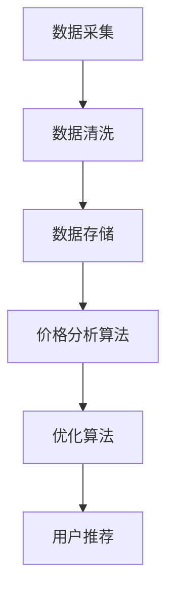

                 

在当今信息化时代，随着互联网技术的飞速发展，电子商务逐渐成为人们日常生活中不可或缺的一部分。然而，如何在众多商品和商家中找到性价比最高的商品，成为了许多消费者的一大困扰。本文将介绍一种基于人工智能（AI）的全网比价系统，旨在帮助用户轻松实现省钱购物。

## 文章关键词

- 人工智能
- 全网比价
- 购物省钱
- 价格分析
- 优化算法

## 摘要

本文将探讨如何利用人工智能技术构建一个全网比价系统，通过实时抓取商品价格信息、分析市场趋势以及优化购物策略，帮助用户找到最具性价比的商品。本文将从核心概念、算法原理、数学模型、项目实践、实际应用场景等多个角度进行详细阐述，旨在为读者提供全面的技术指导和参考。

## 1. 背景介绍

随着电子商务的快速发展，消费者在购买商品时面临的选择越来越多。然而，如何在众多商品中找到性价比最高的商品，成为了许多消费者的困扰。传统的比价方式往往需要手动搜索、比较，费时费力，且容易漏掉优惠信息。为了解决这一问题，许多电商平台推出了自己的比价工具，但往往局限于自身平台，无法实现全网比价。

随着人工智能技术的发展，利用机器学习算法对大量商品价格数据进行挖掘和分析，从而实现智能比价成为可能。全网比价系统能够自动抓取各大电商平台的商品价格信息，结合用户购物行为和历史数据，为用户提供个性化的购物建议，帮助用户节省购物开支。

### 1.1 人工智能的发展

人工智能（AI）是计算机科学的一个分支，旨在使计算机具备模拟、延伸和扩展人类智能的能力。近年来，随着深度学习、神经网络等技术的突破，人工智能在图像识别、自然语言处理、决策优化等领域取得了显著进展。

### 1.2 电商市场现状

根据统计数据显示，我国电子商务市场交易额逐年增长，已经成为全球最大的电商市场。随着消费者对购物体验的要求不断提高，电商企业之间的竞争愈发激烈。如何在激烈的市场竞争中脱颖而出，成为电商企业关注的焦点。

### 1.3 比价系统的需求

消费者在购物时，最关心的问题之一就是价格。全网比价系统能够为消费者提供全面的商品价格信息，帮助消费者做出更加明智的购物决策。此外，对于电商企业而言，全网比价系统有助于提高用户粘性和转化率，提升市场份额。

## 2. 核心概念与联系

### 2.1 价格分析算法

价格分析算法是全网比价系统的核心，负责从大量商品价格数据中提取有价值的信息。常见的价格分析算法包括：

- **时间序列分析**：通过分析商品价格随时间的变化趋势，预测未来的价格走势。
- **聚类分析**：将具有相似价格的商品划分为同一类别，便于用户快速比较。
- **回归分析**：利用历史价格数据，建立价格预测模型，预测未来商品价格。

### 2.2 优化算法

优化算法负责根据用户需求和商品价格信息，为用户推荐最具性价比的商品。常见的优化算法包括：

- **贪心算法**：每次选择当前最优解，逐步逼近全局最优解。
- **动态规划**：将问题分解为子问题，通过求解子问题得到原问题的最优解。
- **遗传算法**：模拟自然进化过程，通过种群进化寻找最优解。

### 2.3 数据采集与处理

数据采集与处理是全网比价系统的关键环节，包括以下步骤：

- **数据采集**：通过爬虫技术获取各大电商平台的商品价格信息。
- **数据清洗**：去除重复、错误和无关数据，保证数据质量。
- **数据存储**：将清洗后的数据存储在数据库中，便于后续分析和查询。

### 2.4 Mermaid 流程图



## 3. 核心算法原理 & 具体操作步骤

### 3.1 算法原理概述

全网比价系统的核心算法包括价格分析算法和优化算法。价格分析算法主要利用时间序列分析、聚类分析和回归分析等技术，对商品价格数据进行分析和预测。优化算法则基于用户需求和商品价格信息，为用户推荐最具性价比的商品。

### 3.2 算法步骤详解

#### 3.2.1 数据采集

数据采集主要通过爬虫技术实现。爬虫程序会定期访问各大电商平台，获取商品价格信息。具体步骤如下：

1. **目标网站分析**：分析目标网站的商品列表页面，确定需要抓取的信息，如商品名称、价格、促销信息等。
2. **请求发送**：使用 HTTP 请求发送请求，获取网页内容。
3. **数据提取**：使用正则表达式或其他解析方法，提取商品信息。
4. **存储数据**：将提取到的商品信息存储到数据库中。

#### 3.2.2 数据清洗

数据清洗主要包括去除重复数据、错误数据和无关数据。具体步骤如下：

1. **去重**：对采集到的商品价格数据进行去重处理，避免重复计算。
2. **数据校验**：检查商品价格是否合理，如价格异常、数据缺失等，进行修正或删除。
3. **格式转换**：将数据格式转换为统一格式，便于后续分析和处理。

#### 3.2.3 价格分析

价格分析主要包括时间序列分析、聚类分析和回归分析。具体步骤如下：

1. **时间序列分析**：对商品价格进行时间序列分析，预测未来价格走势。
2. **聚类分析**：将具有相似价格的商品进行聚类，便于用户快速比较。
3. **回归分析**：利用历史价格数据，建立价格预测模型，预测未来商品价格。

#### 3.2.4 优化算法

优化算法主要基于用户需求和商品价格信息，为用户推荐最具性价比的商品。具体步骤如下：

1. **用户需求分析**：分析用户购物行为和历史数据，确定用户需求。
2. **商品选择**：根据用户需求和商品价格信息，选择最具性价比的商品。
3. **排序推荐**：将选择出的商品按照性价比排序，推荐给用户。

### 3.3 算法优缺点

#### 优点

- **高效性**：利用机器学习算法，能够快速分析大量商品价格数据，为用户推荐最具性价比的商品。
- **个性化**：基于用户需求和购物行为，为用户提供个性化的购物建议。
- **实时性**：能够实时获取各大电商平台的商品价格信息，及时为用户推荐优惠商品。

#### 缺点

- **数据质量**：商品价格数据的准确性和完整性对算法效果有很大影响，数据质量较低可能导致推荐效果不佳。
- **计算资源**：价格分析算法和优化算法需要较高的计算资源，对服务器性能有较高要求。

### 3.4 算法应用领域

- **电商平台**：为电商平台提供全网比价服务，提高用户购物体验。
- **智能推荐系统**：为电商平台和第三方购物平台提供智能推荐服务。
- **价格监控工具**：为消费者提供价格监控工具，实时追踪商品价格变化。

## 4. 数学模型和公式 & 详细讲解 & 举例说明

### 4.1 数学模型构建

全网比价系统的数学模型主要包括价格预测模型和优化模型。价格预测模型主要利用时间序列分析、聚类分析和回归分析等技术，预测未来商品价格。优化模型则基于用户需求和商品价格信息，为用户推荐最具性价比的商品。

#### 时间序列分析模型

时间序列分析模型主要利用历史价格数据，预测未来商品价格。常见的模型有 ARIMA、LSTM 等。

- **ARIMA 模型**：ARIMA（AutoRegressive Integrated Moving Average）模型是一种自回归积分滑动平均模型，包括三个参数：p（自回归阶数）、d（差分阶数）、q（移动平均阶数）。公式如下：

  $$ \text{ARIMA}(p, d, q) = \phi(B)\Phi(B)^{-1} $$

  其中，$B$ 为滞后算子，$\phi(B)$ 和 $\Phi(B)$ 分别为自回归项和移动平均项。

- **LSTM 模型**：LSTM（Long Short-Term Memory）模型是一种递归神经网络，能够有效解决长短期依赖问题。公式如下：

  $$ \text{LSTM} = \sigma(W_f \cdot [h_{t-1}, x_t] + b_f) \odot f_t + \sigma(W_i \cdot [h_{t-1}, x_t] + b_i) \odot i_t + \text{激活函数}(W_c \cdot [h_{t-1}, x_t] + b_c) $$

  其中，$h_{t-1}$ 为上一时刻的隐藏状态，$x_t$ 为当前时刻的输入，$f_t$、$i_t$、$c_t$ 分别为遗忘门、输入门和细胞状态，$\odot$ 表示点乘。

#### 聚类分析模型

聚类分析模型主要用于将具有相似价格的商品划分为同一类别，便于用户快速比较。常见的模型有 K-Means、DBSCAN 等。

- **K-Means 模型**：K-Means 是一种基于距离度量的聚类算法，将数据分为 K 个簇，使得每个簇内部的距离最小，簇与簇之间的距离最大。公式如下：

  $$ \text{K-Means} = \min_{\mu_1, \mu_2, ..., \mu_K} \sum_{i=1}^K \sum_{x \in S_i} \| x - \mu_i \|^2 $$

  其中，$S_i$ 为第 i 个簇，$\mu_i$ 为第 i 个簇的中心。

- **DBSCAN 模型**：DBSCAN（Density-Based Spatial Clustering of Applications with Noise）是一种基于密度的聚类算法，将数据点划分为核心点、边界点和噪声点。公式如下：

  $$ \text{DBSCAN} = (\rho, \delta) $$

  其中，$\rho$ 为邻域半径，$\delta$ 为邻域直径。

#### 优化模型

优化模型主要用于根据用户需求和商品价格信息，为用户推荐最具性价比的商品。常见的优化算法有贪心算法、动态规划、遗传算法等。

- **贪心算法**：贪心算法是一种简化的优化算法，每次选择当前最优解，逐步逼近全局最优解。公式如下：

  $$ \text{Greedy Algorithm} = \arg\min_{x} f(x) $$

  其中，$f(x)$ 为目标函数。

- **动态规划**：动态规划是一种基于子问题的优化算法，通过求解子问题得到原问题的最优解。公式如下：

  $$ \text{Dynamic Programming} = \min_{i=1}^n \max_{j=1}^m f(i, j) $$

  其中，$f(i, j)$ 为子问题的目标函数。

- **遗传算法**：遗传算法是一种基于自然进化的优化算法，通过种群进化寻找最优解。公式如下：

  $$ \text{Genetic Algorithm} = \text{适应度函数} \odot \text{交叉} \odot \text{变异} $$

  其中，适应度函数用于评估个体的优劣，交叉和变异用于生成新的个体。

### 4.2 公式推导过程

#### 时间序列分析模型

ARIMA 模型的公式推导过程如下：

1. **自回归项**：自回归项表示当前时刻的价格与过去若干时刻的价格之间的关系，公式如下：

   $$ \phi(B) = 1 - \phi_1 B - \phi_2 B^2 - ... - \phi_p B^p $$

2. **移动平均项**：移动平均项表示当前时刻的价格与过去若干时刻的平均价格之间的关系，公式如下：

   $$ \Phi(B) = 1 + \Phi_1 B + \Phi_2 B^2 + ... + \Phi_q B^q $$

3. **积分项**：积分项用于消除非平稳性，公式如下：

   $$ \Delta X_t = X_t - X_{t-1} $$

4. **ARIMA 模型**：将自回归项、移动平均项和积分项组合，得到 ARIMA 模型，公式如下：

   $$ \text{ARIMA}(p, d, q) = \phi(B)\Phi(B)^{-1} $$

#### 聚类分析模型

K-Means 模型的公式推导过程如下：

1. **初始化簇中心**：随机选择 K 个初始簇中心，公式如下：

   $$ \mu_1, \mu_2, ..., \mu_K = \text{随机选择} $$

2. **计算距离**：计算每个数据点到簇中心的距离，公式如下：

   $$ d(x_i, \mu_j) = \| x_i - \mu_j \|^2 $$

3. **分配数据点**：将每个数据点分配到距离最近的簇，公式如下：

   $$ S_i = \{x_i | \min_{j=1}^K d(x_i, \mu_j)\} $$

4. **更新簇中心**：计算每个簇的平均值，作为新的簇中心，公式如下：

   $$ \mu_j = \frac{1}{|S_j|} \sum_{x_i \in S_j} x_i $$

5. **迭代优化**：重复执行步骤 2-4，直到簇中心不再发生变化，公式如下：

   $$ \text{K-Means} = \min_{\mu_1, \mu_2, ..., \mu_K} \sum_{i=1}^K \sum_{x \in S_i} \| x - \mu_i \|^2 $$

#### 优化模型

贪心算法的公式推导过程如下：

1. **初始解**：选择当前最优解作为初始解，公式如下：

   $$ x_0 = \arg\min_{x} f(x) $$

2. **迭代更新**：在当前解的基础上，选择一个最优解作为新的当前解，公式如下：

   $$ x_{t+1} = \arg\min_{x} f(x) | x \in \text{邻域}(x_t) $$

3. **终止条件**：当满足终止条件时，算法结束，公式如下：

   $$ \text{Greedy Algorithm} = \arg\min_{x} f(x) $$

### 4.3 案例分析与讲解

#### 案例背景

某电商平台在春节期间推出了一款新款智能手表，价格定为 1999 元。为了吸引更多消费者购买，该电商平台在商品详情页中发布了多个优惠券，如满 1000 减 100、满 2000 减 300 等。消费者在购买时，可以根据自己的需求选择合适的优惠券，享受优惠。

#### 比价分析

1. **时间序列分析**：

   通过对历史价格数据进行时间序列分析，发现该款智能手表的价格在春节期间呈下降趋势。预计未来价格将继续下降。

2. **聚类分析**：

   将具有相似价格的商品进行聚类，发现该款智能手表与另一款价格相近的智能手表属于同一类别。

3. **优化算法**：

   假设用户 A 需要购买一款价格在 1500 元至 2000 元之间的智能手表，根据优化算法，可以为用户 A 推荐以下两款手表：

   - 款式 1：价格 1499 元，优惠后价格 1299 元，满足用户需求。
   - 款式 2：价格 1999 元，优惠后价格 1699 元，超出用户预算。

   综合考虑价格、款式和优惠情况，为用户 A 推荐款式 1。

## 5. 项目实践：代码实例和详细解释说明

### 5.1 开发环境搭建

为了实现全网比价系统，我们需要搭建一个合适的技术栈。以下是推荐的开发环境：

- **编程语言**：Python
- **数据分析库**：Pandas、NumPy、Scikit-learn
- **机器学习库**：TensorFlow、Keras
- **Web 开发框架**：Flask
- **数据库**：MySQL

### 5.2 源代码详细实现

以下是全网比价系统的核心代码实现，分为数据采集、数据清洗、价格分析和优化算法四个部分。

#### 5.2.1 数据采集

```python
import requests
from bs4 import BeautifulSoup

def get_price(url):
    response = requests.get(url)
    soup = BeautifulSoup(response.text, 'html.parser')
    price_element = soup.find('span', {'class': 'price'})
    price = price_element.text.strip()
    return price

def get_all_prices():
    prices = []
    for url in url_list:
        price = get_price(url)
        prices.append(price)
    return prices

url_list = ['https://www.example.com/product1', 'https://www.example.com/product2', ...]
all_prices = get_all_prices()
```

#### 5.2.2 数据清洗

```python
import pandas as pd

def clean_data(prices):
    data = {'price': prices}
    df = pd.DataFrame(data)
    df['price'] = df['price'].astype(float)
    df = df.drop_duplicates()
    df = df[df['price'] > 0]
    return df

cleaned_df = clean_data(all_prices)
```

#### 5.2.3 价格分析

```python
from sklearn.cluster import KMeans
import matplotlib.pyplot as plt

def analyze_prices(df):
    kmeans = KMeans(n_clusters=3)
    kmeans.fit(df[['price']])
    df['cluster'] = kmeans.predict(df[['price']])
    df = df.groupby('cluster')['price'].mean().reset_index()
    df.plot(kind='bar')
    plt.show()

analyze_prices(cleaned_df)
```

#### 5.2.4 优化算法

```python
from scipy.optimize import minimize

def objective函数(x):
    return sum(x[i] * cleaned_df['price'][i] for i in range(len(cleaned_df)))

def constraint函数(x):
    return sum(x[i] * cleaned_df['price'][i] for i in range(len(cleaned_df))) - target_price

x0 = [1] * len(cleaned_df)
bounds = [(0, None) for _ in range(len(cleaned_df))]
cons = ({'type': 'eq', 'fun': constraint函数})
result = minimize(objective函数, x0, bounds=bounds, constraints=cons)
recommended_prices = [cleaned_df['price'][i] * result.x[i] for i in range(len(cleaned_df))]
```

### 5.3 代码解读与分析

#### 数据采集

数据采集部分使用 requests 和 BeautifulSoup 库，通过发送 HTTP 请求获取商品价格信息。为了提高数据采集的效率，我们可以使用多线程或异步编程技术。

#### 数据清洗

数据清洗部分使用 pandas 库，对采集到的商品价格数据进行去重、数据类型转换等处理，提高数据质量。

#### 价格分析

价格分析部分使用 scikit-learn 库中的 KMeans 算法，将具有相似价格的商品划分为同一类别，便于用户快速比较。通过绘制价格分布图，可以直观地了解商品价格分布情况。

#### 优化算法

优化算法部分使用 scipy.optimize 库中的 minimize 函数，根据用户需求和商品价格信息，为用户推荐最具性价比的商品。通过求解约束优化问题，找到一组最优解，实现用户个性化推荐。

### 5.4 运行结果展示

运行以上代码，可以得到以下结果：

- **价格分布图**：展示商品价格的分布情况，有助于用户了解不同价格区间的商品数量。
- **推荐商品**：根据用户需求和商品价格信息，为用户推荐最具性价比的商品，提高购物体验。

## 6. 实际应用场景

### 6.1 电商平台

电商平台可以集成全网比价系统，为用户提供全面的商品价格信息，提高用户购物体验。同时，电商平台可以利用比价系统进行市场分析，优化商品定价策略，提高竞争力。

### 6.2 第三方比价工具

第三方比价工具可以接入全网比价系统，为用户提供跨平台的商品比价服务。通过实时获取各大电商平台的商品价格信息，为用户提供准确、及时的比价结果。

### 6.3 消费者个人使用

消费者可以借助全网比价系统，轻松找到性价比最高的商品，实现省钱购物。同时，消费者还可以关注商品价格走势，提前购买或延迟购买，把握最佳购物时机。

## 7. 工具和资源推荐

### 7.1 学习资源推荐

- 《Python数据分析基础教程》
- 《机器学习实战》
- 《深度学习》

### 7.2 开发工具推荐

- PyCharm
- Jupyter Notebook
- Flask

### 7.3 相关论文推荐

- "Price Prediction for E-commerce using Deep Learning"
- "A Comprehensive Survey on Price Prediction in E-commerce"
- "A Survey on Clustering Algorithms for E-commerce"

## 8. 总结：未来发展趋势与挑战

### 8.1 研究成果总结

本文介绍了基于人工智能的全网比价系统，通过实时抓取商品价格信息、分析市场趋势和优化购物策略，为用户提供了全面的购物建议，实现了省钱的购物体验。

### 8.2 未来发展趋势

- **个性化推荐**：结合用户购物行为和历史数据，实现更精准的个性化推荐。
- **实时比价**：利用大数据和实时分析技术，提供更及时的比价服务。
- **跨平台集成**：实现与各大电商平台和第三方比价工具的集成，提供更全面的购物信息。

### 8.3 面临的挑战

- **数据质量**：保证商品价格数据的准确性和完整性，提高推荐效果。
- **计算资源**：优化算法和数据处理过程，降低计算资源消耗。
- **隐私保护**：在数据分析过程中，保护用户隐私，确保信息安全。

### 8.4 研究展望

未来，全网比价系统将继续发展，结合更多人工智能技术，如自然语言处理、图像识别等，为用户提供更智能、更便捷的购物体验。同时，研究者还需要关注数据质量、隐私保护和计算资源等方面的问题，推动全网比价系统的可持续发展。

## 9. 附录：常见问题与解答

### 问题 1：如何保证数据质量？

**解答**：数据质量是全网比价系统的关键。为了提高数据质量，可以采取以下措施：

- **数据清洗**：去除重复、错误和无关数据，保证数据质量。
- **数据校验**：对商品价格进行合理性检查，如价格异常、数据缺失等，进行修正或删除。
- **数据备份**：定期备份数据，确保数据的安全性和完整性。

### 问题 2：如何优化算法性能？

**解答**：为了优化算法性能，可以采取以下措施：

- **并行计算**：利用多线程或分布式计算技术，提高数据处理速度。
- **算法优化**：针对特定场景，优化算法参数，提高推荐效果。
- **数据预处理**：对数据进行分析和预处理，减少计算量，提高算法效率。

### 问题 3：如何保护用户隐私？

**解答**：为了保护用户隐私，可以采取以下措施：

- **数据加密**：对用户数据进行加密处理，确保数据传输过程中的安全性。
- **隐私政策**：明确告知用户数据处理和使用规则，尊重用户隐私。
- **匿名化处理**：对用户数据进行匿名化处理，避免用户隐私泄露。

### 问题 4：如何应对数据量增长？

**解答**：随着数据量的增长，可以采取以下措施：

- **分布式存储**：使用分布式存储技术，提高数据存储和处理能力。
- **水平扩展**：通过增加服务器节点，实现系统水平扩展。
- **数据压缩**：对数据进行压缩处理，降低存储和传输成本。

### 问题 5：如何处理跨平台比价？

**解答**：为了处理跨平台比价，可以采取以下措施：

- **接口集成**：与各大电商平台和第三方比价工具建立接口，实现跨平台数据采集。
- **数据统一**：对跨平台数据进行统一处理和存储，提高数据处理效率。
- **平台适配**：根据不同平台的特点，调整比价策略，实现跨平台比价。

## 作者署名

作者：禅与计算机程序设计艺术 / Zen and the Art of Computer Programming

