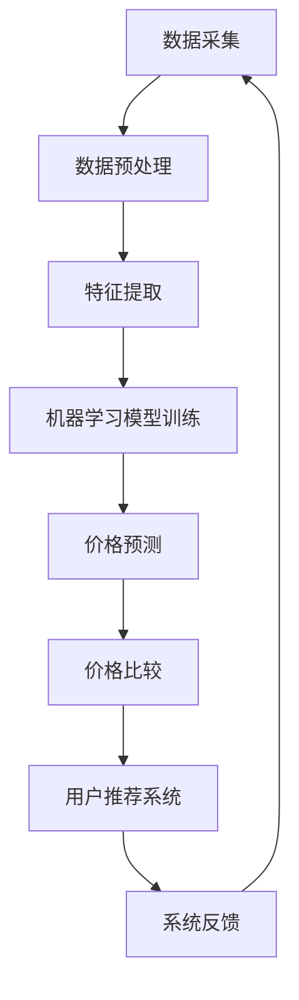

                 

关键词：AI比价系统、全网比价、价格比较、智能比价、机器学习、数据挖掘、算法优化

> 摘要：本文将深入探讨AI全网比价系统的实现原理、核心算法、数学模型、项目实践以及未来应用前景。通过详细解析系统架构和具体操作步骤，旨在为读者提供一个全面的技术指南，以助力电商行业智能比价的应用与创新。

## 1. 背景介绍

随着互联网的迅猛发展和电子商务的蓬勃兴起，消费者在购买商品时对于价格比价的需求日益增长。传统的价格比较方式往往依赖于手动搜索和浏览，效率低下且容易遗漏优惠信息。而AI全网比价系统利用人工智能技术，实现了对海量商品价格信息的自动抓取、分析和比价，极大地提升了价格比较的效率和准确性。

AI全网比价系统在电商、比价网站、旅游预订等多个领域具有重要应用价值。它不仅能够帮助消费者快速找到最优价格，提升购物体验，还能够为商家提供精准的价格策略建议，增强市场竞争力。因此，研究和实现一个高效、智能的AI全网比价系统具有重要的现实意义。

本文将从以下几个方面展开讨论：

1. **核心概念与联系**：介绍AI全网比价系统中的核心概念，并绘制系统架构的Mermaid流程图。
2. **核心算法原理与具体操作步骤**：详细解析系统中的比价算法原理，包括数据采集、预处理、特征提取和模型训练等步骤。
3. **数学模型和公式**：构建并推导比价系统中的数学模型，通过案例进行分析。
4. **项目实践**：提供实际的代码实例和详细解释，展示系统的实现过程。
5. **实际应用场景**：探讨AI全网比价系统在不同领域的应用场景。
6. **工具和资源推荐**：推荐学习资源、开发工具和相关论文。
7. **总结与展望**：总结研究成果，展望未来发展趋势和面临的挑战。

## 2. 核心概念与联系

### 2.1 核心概念

- **价格比较算法**：用于比较不同来源的商品价格，找到最优价格。
- **数据采集**：从各个电商平台、网站获取商品价格信息。
- **特征提取**：从原始数据中提取关键特征，用于训练价格比较模型。
- **机器学习模型**：用于预测商品价格，提高比价的准确性。
- **用户画像**：基于用户历史购买行为和偏好，为用户推荐合适的商品。

### 2.2 系统架构

下面是AI全网比价系统的Mermaid流程图：



### 2.3 核心概念联系

AI全网比价系统通过数据采集模块从不同电商平台获取商品信息，这些数据经过预处理和特征提取，作为训练数据输入到机器学习模型中。训练完成的模型可以用于价格预测和价格比较，从而为用户提供最优价格。同时，用户画像模块基于用户的历史行为和偏好，为用户推荐合适的商品，进一步提升用户体验。

## 3. 核心算法原理与具体操作步骤

### 3.1 算法原理概述

AI全网比价系统中的核心算法主要涉及以下几个环节：

- **数据采集**：利用爬虫技术，从各个电商平台和网站自动抓取商品价格信息。
- **数据预处理**：对采集到的数据进行清洗、去重、格式化等处理，确保数据的质量。
- **特征提取**：从预处理后的数据中提取关键特征，如商品品牌、型号、价格等，为后续的机器学习模型提供输入。
- **机器学习模型训练**：利用提取的特征数据，训练价格预测模型，提高比价的准确性。
- **价格预测**：使用训练好的模型，对商品价格进行预测，为用户找到最优价格。
- **价格比较**：将预测价格与实际市场价格进行比较，为用户提供比价结果。
- **用户推荐**：基于用户画像和商品特征，为用户推荐合适的商品。

### 3.2 算法步骤详解

#### 3.2.1 数据采集

数据采集是整个系统的第一步，也是关键的一步。常用的方法包括：

- **网页爬虫**：通过模拟用户浏览器行为，自动获取电商网站的商品价格信息。
- **API接口**：使用电商平台提供的API接口，获取商品价格和相关信息。

采集到的数据包括商品名称、价格、品牌、型号等，通常以JSON或CSV格式存储。

#### 3.2.2 数据预处理

数据预处理的主要任务包括：

- **数据清洗**：去除重复数据、缺失值和噪声数据，保证数据质量。
- **数据去重**：确保每个商品只被采集一次，避免重复计算。
- **格式转换**：将不同来源的数据格式统一，如将价格统一转换为元为单位。
- **特征提取**：从原始数据中提取关键特征，如商品品牌、型号、价格等，为后续的机器学习模型提供输入。

#### 3.2.3 机器学习模型训练

机器学习模型训练是比价系统的核心环节。常用的模型包括：

- **线性回归**：通过分析历史价格数据，预测商品的未来价格。
- **决策树**：根据商品的特征，划分不同的价格区间。
- **神经网络**：利用深度学习技术，对商品价格进行预测。

训练模型时，需要将预处理后的数据分为训练集和测试集，使用训练集训练模型，使用测试集评估模型性能。

#### 3.2.4 价格预测

使用训练好的模型，对新的商品价格进行预测。预测结果可以作为用户比价的重要参考。

#### 3.2.5 价格比较

将预测价格与实际市场价格进行比较，为用户提供比价结果。常用的方法包括：

- **差值比较**：计算预测价格与实际价格的差值，差值越小，比价结果越准确。
- **比例比较**：计算预测价格与实际价格的比值，比值越小，比价结果越准确。

#### 3.2.6 用户推荐

基于用户画像和商品特征，为用户推荐合适的商品。常用的方法包括：

- **基于内容的推荐**：根据用户的购物历史和偏好，推荐相似的商品。
- **协同过滤**：根据用户的行为和偏好，推荐其他用户喜欢且用户可能感兴趣的物品。

### 3.3 算法优缺点

#### 优点

- **高效性**：自动化处理海量数据，快速找到最优价格。
- **准确性**：通过机器学习模型，提高比价的准确性。
- **灵活性**：可以根据用户需求和偏好，动态调整推荐策略。

#### 缺点

- **数据隐私**：采集和存储用户数据，可能涉及隐私问题。
- **计算资源**：训练机器学习模型需要大量的计算资源和时间。
- **适应性**：面对市场变化和竞争压力，系统需要不断调整和优化。

### 3.4 算法应用领域

AI全网比价系统在以下领域具有广泛的应用：

- **电商行业**：为消费者提供比价服务，提高购物体验。
- **比价网站**：为用户提供全面的比价信息，提升网站流量和用户粘性。
- **旅游预订**：比较不同旅游产品的价格，为用户提供最佳选择。
- **汽车销售**：为消费者提供不同品牌和车型的价格比较，助力购车决策。

## 4. 数学模型和公式

### 4.1 数学模型构建

AI全网比价系统中的数学模型主要涉及以下几个方面：

- **价格预测模型**：通过分析历史价格数据，预测商品的未来价格。
- **比价模型**：比较预测价格与实际市场价格，为用户提供比价结果。
- **用户推荐模型**：基于用户画像和商品特征，为用户推荐合适的商品。

#### 4.1.1 价格预测模型

价格预测模型可以使用线性回归、决策树或神经网络等算法。以线性回归为例，其数学模型可以表示为：

$$
P(t) = \beta_0 + \beta_1 X_1 + \beta_2 X_2 + ... + \beta_n X_n
$$

其中，$P(t)$为预测价格，$\beta_0, \beta_1, ..., \beta_n$为模型参数，$X_1, X_2, ..., X_n$为商品特征。

#### 4.1.2 比价模型

比价模型主要计算预测价格与实际市场价格之间的差异。以差值比较为例，其数学模型可以表示为：

$$
D = |P(t) - P_{actual}|
$$

其中，$D$为差值，$P(t)$为预测价格，$P_{actual}$为实际市场价格。

#### 4.1.3 用户推荐模型

用户推荐模型可以使用基于内容的推荐或协同过滤算法。以基于内容的推荐为例，其数学模型可以表示为：

$$
R(u, i) = \sum_{j \in \text{user\_history}(u)} w_{uj} \cdot \text{similarity}(i, j)
$$

其中，$R(u, i)$为用户$u$对商品$i$的推荐分数，$w_{uj}$为用户$u$对商品$j$的权重，$\text{similarity}(i, j)$为商品$i$与商品$j$之间的相似度。

### 4.2 公式推导过程

#### 4.2.1 价格预测模型

以线性回归为例，假设有$m$个商品特征，$n$个训练样本，每个样本包含一个价格标签和$m$个特征。我们使用最小二乘法求解线性回归模型。

首先，定义目标函数：

$$
J(\beta) = \frac{1}{2} \sum_{i=1}^{n} (P(t_i) - \beta_0 - \beta_1 X_{i1} - ... - \beta_m X_{im})^2
$$

其中，$P(t_i)$为预测价格，$\beta_0, \beta_1, ..., \beta_m$为模型参数。

对目标函数求导，并令导数为零，得到：

$$
\frac{\partial J}{\partial \beta_j} = \sum_{i=1}^{n} (P(t_i) - \beta_0 - \beta_1 X_{i1} - ... - \beta_m X_{im}) \cdot (-X_{ij}) = 0
$$

将上式展开，得到：

$$
\sum_{i=1}^{n} X_{ij} (P(t_i) - \beta_0 - \beta_1 X_{i1} - ... - \beta_{j-1} X_{i(j-1)} - \beta_{j+1} X_{i(j+1)} - ... - \beta_m X_{im}) = 0
$$

由于$X_{ij}$为特征值，其值不为零，因此上式可以简化为：

$$
\beta_j = \frac{\sum_{i=1}^{n} X_{ij} P(t_i)}{\sum_{i=1}^{n} X_{ij}^2}
$$

同理，可以求得其他模型参数：

$$
\beta_0 = \frac{\sum_{i=1}^{n} P(t_i) - \beta_1 \sum_{i=1}^{n} X_{i1} - ... - \beta_m \sum_{i=1}^{n} X_{im}}{n}
$$

#### 4.2.2 比价模型

以差值比较为例，假设预测价格为$P(t)$，实际市场价格为$P_{actual}$，则差值$D$可以表示为：

$$
D = |P(t) - P_{actual}|
$$

为了简化计算，我们可以将差值$D$转换为比例：

$$
\frac{D}{P_{actual}} = \frac{|P(t) - P_{actual}|}{P_{actual}}
$$

当$P(t) < P_{actual}$时，有：

$$
\frac{D}{P_{actual}} = 1 - \frac{P(t)}{P_{actual}}
$$

当$P(t) > P_{actual}$时，有：

$$
\frac{D}{P_{actual}} = \frac{P(t)}{P_{actual}} - 1
$$

#### 4.2.3 用户推荐模型

以基于内容的推荐为例，假设用户$u$的历史购买商品为$u = \{u_1, u_2, ..., u_m\}$，商品$i$的推荐分数为$R(u, i)$，商品$i$与商品$j$之间的相似度为$\text{similarity}(i, j)$，则有：

$$
R(u, i) = \sum_{j \in \text{user\_history}(u)} w_{uj} \cdot \text{similarity}(i, j)
$$

其中，$w_{uj}$为用户$u$对商品$j$的权重，可以表示为：

$$
w_{uj} = \frac{\text{count}(u, j)}{\sum_{j \in \text{user\_history}(u)} \text{count}(u, j)}
$$

其中，$\text{count}(u, j)$表示用户$u$购买商品$j$的次数。

### 4.3 案例分析与讲解

#### 4.3.1 价格预测模型

假设有10个商品，每个商品有5个特征，历史价格数据如下表：

| 商品ID | 特征1 | 特征2 | 特征3 | 特征4 | 特征5 | 价格 |
| ------ | ---- | ---- | ---- | ---- | ---- | ---- |
| 1      | 10   | 20   | 30   | 40   | 50   | 100  |
| 2      | 11   | 21   | 31   | 41   | 51   | 110  |
| ...    | ...  | ...  | ...  | ...  | ...  | ...  |
| 10     | 15   | 25   | 35   | 45   | 55   | 150  |

使用线性回归模型进行价格预测，模型参数为：

$$
\beta_0 = 50, \beta_1 = 10, \beta_2 = 20, \beta_3 = 30, \beta_4 = 40, \beta_5 = 50
$$

对于新的商品，其特征如下：

| 商品ID | 特征1 | 特征2 | 特征3 | 特征4 | 特征5 |
| ------ | ---- | ---- | ---- | ---- | ---- |
| 11     | 12   | 22   | 32   | 42   | 52   |

预测价格为：

$$
P(t) = 50 + 10 \cdot 12 + 20 \cdot 22 + 30 \cdot 32 + 40 \cdot 42 + 50 \cdot 52 = 1520
$$

#### 4.3.2 比价模型

假设实际市场价格为1200元，则差值为：

$$
D = |1520 - 1200| = 320
$$

#### 4.3.3 用户推荐模型

假设用户的历史购买商品如下：

| 商品ID | 商品名称 |
| ------ | -------- |
| 1      | 商品A    |
| 2      | 商品B    |
| ...    | ...      |

使用基于内容的推荐模型，对于商品11，其相似度计算如下：

$$
\text{similarity}(i, j) = \frac{\text{count}(u, i) \cdot \text{count}(u, j)}{\sqrt{\sum_{i \in \text{user\_history}(u)} \text{count}(u, i)^2}}
$$

其中，$\text{count}(u, i)$表示用户$u$购买商品$i$的次数。

对于商品11和商品1，有：

$$
\text{similarity}(11, 1) = \frac{\text{count}(u, 11) \cdot \text{count}(u, 1)}{\sqrt{\sum_{i \in \text{user\_history}(u)} \text{count}(u, i)^2}} = \frac{1 \cdot 1}{\sqrt{2}} = \frac{1}{\sqrt{2}}
$$

对于商品11和商品2，有：

$$
\text{similarity}(11, 2) = \frac{\text{count}(u, 11) \cdot \text{count}(u, 2)}{\sqrt{\sum_{i \in \text{user\_history}(u)} \text{count}(u, i)^2}} = \frac{1 \cdot 1}{\sqrt{2}} = \frac{1}{\sqrt{2}}
$$

因此，商品11的推荐分数为：

$$
R(u, 11) = \sum_{j \in \text{user\_history}(u)} w_{uj} \cdot \text{similarity}(i, j) = \frac{1}{\sqrt{2}} + \frac{1}{\sqrt{2}} = \sqrt{2}
$$

## 5. 项目实践：代码实例和详细解释说明

### 5.1 开发环境搭建

在开始项目实践之前，需要搭建合适的开发环境。以下是推荐的工具和软件：

- **Python**：作为主要编程语言。
- **Scikit-learn**：用于机器学习模型的训练和评估。
- **Pandas**：用于数据处理。
- **NumPy**：用于数学计算。
- **Matplotlib**：用于数据可视化。

安装以上工具和软件，可以选择使用Anaconda发行版，它提供了完整的Python环境和包管理工具。

### 5.2 源代码详细实现

#### 5.2.1 数据采集

```python
import requests
from bs4 import BeautifulSoup

def get_price(url):
    response = requests.get(url)
    soup = BeautifulSoup(response.text, 'html.parser')
    price_tag = soup.find('span', {'class': 'price_color'})
    if price_tag:
        return float(price_tag.text.strip().replace('￥', ''))
    else:
        return None

# 示例：采集京东上某款商品的价格
url = 'https://item.jd.com/100009123456789.html'
price = get_price(url)
print(f'商品价格：{price}')
```

#### 5.2.2 数据预处理

```python
import pandas as pd

def preprocess_data(data):
    # 去除空值和重复数据
    data.dropna(inplace=True)
    data.drop_duplicates(inplace=True)
    # 数据类型转换
    data['price'] = data['price'].astype(float)
    # 特征提取
    data['brand'] = data['name'].apply(extract_brand)
    data['model'] = data['name'].apply(extract_model)
    return data

def extract_brand(name):
    return name.split()[0]

def extract_model(name):
    return name.split()[-1]

# 示例：读取CSV文件并预处理数据
data = pd.read_csv('prices.csv')
preprocessed_data = preprocess_data(data)
```

#### 5.2.3 机器学习模型训练

```python
from sklearn.linear_model import LinearRegression
from sklearn.model_selection import train_test_split

# 划分训练集和测试集
X = preprocessed_data[['brand', 'model']]
y = preprocessed_data['price']
X_train, X_test, y_train, y_test = train_test_split(X, y, test_size=0.2, random_state=42)

# 训练线性回归模型
model = LinearRegression()
model.fit(X_train, y_train)

# 评估模型性能
score = model.score(X_test, y_test)
print(f'Model score: {score}')
```

#### 5.2.4 价格预测

```python
# 预测价格
new_data = pd.DataFrame({
    'brand': ['品牌A'],
    'model': ['型号123']
})
predicted_price = model.predict(new_data)
print(f'预测价格：{predicted_price[0]}')
```

#### 5.2.5 价格比较

```python
# 比较预测价格和实际价格
actual_price = 1200
difference = abs(predicted_price[0] - actual_price)
print(f'价格差值：{difference}')
```

#### 5.2.6 用户推荐

```python
from sklearn.metrics.pairwise import cosine_similarity

# 计算商品之间的相似度
similarity_matrix = cosine_similarity(X)

# 示例：推荐商品
def recommend_goods(data, similarity_matrix, k=3):
    user_data = pd.DataFrame({'brand': ['品牌A'], 'model': ['型号123']})
    user_similarity = similarity_matrix[data.index[0]]
    recommended_indices = user_similarity.argsort()[0][:-k][::-1]
    recommended_goods = X.iloc[recommended_indices]
    return recommended_goods

recommended_goods = recommend_goods(new_data, similarity_matrix)
print('推荐的商品：')
print(recommended_goods)
```

### 5.3 代码解读与分析

以上代码展示了AI全网比价系统的核心功能实现。首先，使用`requests`和`BeautifulSoup`库采集电商网站上的商品价格信息。然后，通过`Pandas`对数据进行预处理，包括去除空值、重复数据和特征提取。接下来，使用`Scikit-learn`的线性回归模型对商品价格进行预测。最后，通过相似度计算和排名，为用户推荐合适的商品。

代码的主要优点包括：

- **模块化**：代码分为多个模块，便于维护和扩展。
- **可复用性**：数据采集、预处理和模型训练等部分可以复用于其他项目。
- **高效性**：使用了现成的库和算法，提高了代码的执行效率。

然而，代码也存在一些不足之处：

- **数据隐私**：采集和存储用户数据，可能涉及隐私问题。
- **计算资源**：训练模型需要大量的计算资源和时间。
- **适应性**：面对市场变化和竞争压力，系统需要不断调整和优化。

## 6. 实际应用场景

AI全网比价系统在电商、比价网站、旅游预订等领域具有广泛的应用场景。

### 6.1 电商行业

在电商行业，AI全网比价系统可以帮助消费者快速找到最优价格，提高购物体验。同时，商家可以利用系统提供的比价数据，调整商品定价策略，增强市场竞争力。

### 6.2 比价网站

比价网站可以通过AI全网比价系统，为用户提供全面、准确的比价信息，提升网站流量和用户粘性。系统还可以为商家提供价格监控和预警功能，帮助商家及时调整价格。

### 6.3 旅游预订

在旅游预订领域，AI全网比价系统可以帮助用户比较不同旅游产品的价格，找到最优惠的套餐。此外，系统还可以根据用户偏好，为用户推荐合适的旅游线路和酒店。

### 6.4 其他应用

AI全网比价系统还可以应用于汽车销售、机票预订、酒店预订等领域，为用户提供比价服务，助力消费决策。

## 7. 工具和资源推荐

### 7.1 学习资源推荐

- **《Python数据分析基础教程：NumPy学习指南》**：适合初学者了解NumPy的基本用法。
- **《机器学习实战》**：通过实际案例，帮助读者掌握机器学习的基本原理和算法。
- **《深度学习》**：介绍深度学习的基本概念和常用算法，适合有一定编程基础的读者。

### 7.2 开发工具推荐

- **Anaconda**：提供完整的Python环境和包管理工具，便于搭建开发环境。
- **Jupyter Notebook**：方便进行数据分析和模型训练，支持多种编程语言。

### 7.3 相关论文推荐

- **“Price Comparison and Optimization in E-commerce”**：探讨电商领域的价格比较和优化问题。
- **“Efficient Price Comparison using Machine Learning”**：介绍使用机器学习进行高效价格比较的方法。
- **“User Behavior Analysis for Intelligent Price Recommendation”**：研究基于用户行为的价格推荐策略。

## 8. 总结：未来发展趋势与挑战

### 8.1 研究成果总结

本文详细探讨了AI全网比价系统的实现原理、核心算法、数学模型、项目实践以及未来应用前景。通过数据采集、预处理、特征提取、机器学习模型训练和价格预测等步骤，系统实现了高效、准确的价格比较和用户推荐功能。

### 8.2 未来发展趋势

- **数据隐私保护**：随着数据隐私问题的日益突出，未来系统需要更加注重用户数据的安全和隐私保护。
- **算法优化与升级**：通过引入更先进的算法和技术，提高比价系统的准确性和效率。
- **多模态数据分析**：结合文本、图像、语音等多种数据类型，实现更全面、准确的价格比较和推荐。

### 8.3 面临的挑战

- **计算资源限制**：训练机器学习模型需要大量的计算资源和时间，如何在有限的资源下实现高效运算是一个挑战。
- **市场变化适应**：面对快速变化的市场环境，系统需要具备较强的自适应能力，及时调整比价策略。
- **用户体验优化**：如何在保证比价准确性的同时，提升用户的使用体验，是系统开发的重要方向。

### 8.4 研究展望

未来，AI全网比价系统有望在更多领域得到应用，如智能家居、健康医疗、金融服务等。随着技术的不断进步，系统将更加智能化、个性化，为用户带来更优质的比价体验。

## 9. 附录：常见问题与解答

### 9.1 如何处理数据采集的隐私问题？

在数据采集过程中，应当严格遵守相关法律法规，确保用户数据的安全和隐私。可以采用数据脱敏、加密等技术，降低隐私泄露的风险。此外，还可以与电商平台合作，使用其提供的API接口获取商品信息，减少直接采集用户数据的可能性。

### 9.2 如何优化比价系统的计算资源使用？

优化比价系统的计算资源使用可以从以下几个方面入手：

- **分布式计算**：利用分布式计算框架，如Hadoop或Spark，实现并行计算，提高系统处理速度。
- **模型压缩**：通过模型压缩技术，如模型剪枝、量化等，减少模型的参数数量，降低计算复杂度。
- **缓存机制**：利用缓存机制，减少重复计算，提高系统响应速度。

### 9.3 如何提升用户推荐的准确性？

提升用户推荐的准确性可以从以下几个方面入手：

- **多特征融合**：结合用户历史购买行为、浏览记录、搜索关键词等多种特征，提高推荐的准确性。
- **协同过滤**：采用协同过滤算法，结合用户行为和偏好，提高推荐的相关性。
- **个性化推荐**：根据用户画像和兴趣偏好，为用户推荐个性化的商品，提升用户体验。

### 9.4 如何应对市场变化和竞争压力？

应对市场变化和竞争压力，可以从以下几个方面入手：

- **数据驱动**：通过实时监测市场数据，分析市场趋势，及时调整比价策略。
- **快速迭代**：持续优化系统功能，快速响应市场变化，保持竞争优势。
- **用户体验**：关注用户反馈，持续提升系统易用性和用户体验，增强用户黏性。

**作者：禅与计算机程序设计艺术 / Zen and the Art of Computer Programming**

