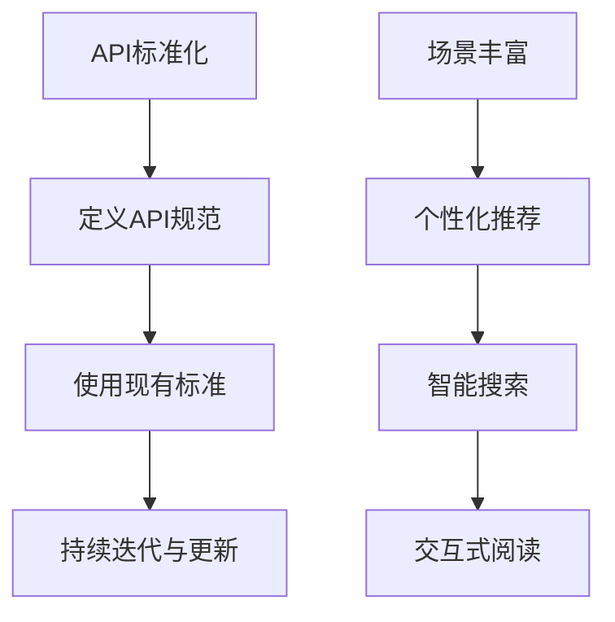

                 

关键词：AI出版业、API标准化、场景丰富、数据挖掘、人工智能、出版流程、内容个性化

## 摘要

随着人工智能技术的迅速发展，AI出版业正经历着前所未有的变革。本文旨在探讨AI出版业在API标准化和场景丰富方面的开发，以提升出版效率、优化用户体验。文章首先介绍了AI出版业的背景和发展现状，然后详细阐述了API标准化的重要性及其实现方式，接着分析了在AI出版业中应用丰富场景的策略，并提供了具体的项目实践和工具资源推荐。最后，文章总结了AI出版业的发展趋势与挑战，为行业未来发展提供了有益的思考。

## 1. 背景介绍

出版业作为信息传播的重要渠道，历来是技术创新的热点领域。随着互联网和数字化技术的普及，传统出版业正面临着巨大的变革。近年来，人工智能（AI）技术的迅猛发展，为出版业带来了新的机遇和挑战。

AI出版业是指利用人工智能技术，包括自然语言处理（NLP）、机器学习（ML）、数据挖掘（DM）等，对出版流程进行自动化和智能化的改造。这种改造不仅提高了出版效率，还优化了用户体验，使出版内容更加个性化和多样化。

### 1.1 发展现状

目前，AI出版业已经初具规模，主要表现在以下几个方面：

1. **内容生成与编辑**：AI可以帮助作者自动生成文章、书籍等出版内容，同时通过智能校对和编辑，提高内容质量。
2. **推荐系统**：利用AI技术，出版平台可以为用户推荐个性化的阅读内容，提高用户粘性。
3. **数据分析与优化**：AI可以对用户行为进行分析，优化出版策略，提高市场竞争力。
4. **版权管理与追踪**：AI可以帮助出版商更有效地管理版权，防止盗版行为。

### 1.2 发展挑战

尽管AI出版业前景广阔，但也面临一些挑战：

1. **技术标准化**：API标准化是实现AI出版业高效协作的基础，但目前相关标准尚未统一。
2. **数据隐私与安全**：在利用大量用户数据的同时，如何保护用户隐私成为一大难题。
3. **版权问题**：AI生成内容的版权归属问题尚无明确法律规范。
4. **人机协作**：如何在人工智能和人类编辑之间找到最佳平衡点，仍需深入研究。

## 2. 核心概念与联系

### 2.1 API标准化

API（应用程序编程接口）是软件系统之间相互通信的桥梁。在AI出版业中，API标准化至关重要，它保证了不同系统和组件之间的无缝集成和数据流通。

#### 2.1.1 API标准化的必要性

1. **提高开发效率**：标准化的API可以减少开发时间和成本，提高开发效率。
2. **确保数据一致性**：统一的API规范确保了数据的统一性和准确性。
3. **促进协同开发**：标准化的API使得开发者可以更容易地协同工作，加快项目进度。
4. **降低维护成本**：标准化的API降低了系统的维护难度和成本。

#### 2.1.2 API标准化的实现

1. **定义明确的API规范**：包括请求格式、响应格式、参数定义等。
2. **使用现有的API标准**：如RESTful API、SOAP等。
3. **持续迭代与更新**：根据实际需求和技术发展，不断优化API。

### 2.2 场景丰富

在AI出版业中，场景丰富指的是利用AI技术，为用户提供多元化的阅读体验，包括个性化推荐、智能搜索、交互式阅读等。

#### 2.2.1 场景丰富的必要性

1. **提升用户体验**：丰富的场景可以满足不同用户的需求，提升用户满意度。
2. **增加用户粘性**：通过多样化的场景，吸引和留住用户。
3. **拓展商业模式**：丰富的场景可以为出版商提供新的收入来源。

#### 2.2.2 场景丰富的实现

1. **个性化推荐**：利用用户行为数据和内容特征，为用户提供个性化的阅读推荐。
2. **智能搜索**：利用自然语言处理技术，提供精准、智能的搜索功能。
3. **交互式阅读**：结合虚拟现实（VR）、增强现实（AR）等技术，提供沉浸式的阅读体验。

### 2.3 Mermaid流程图

为了更好地展示AI出版业中的核心概念和联系，我们使用Mermaid流程图来描述API标准化和场景丰富的实现流程。



## 3. 核心算法原理 & 具体操作步骤

### 3.1 算法原理概述

在AI出版业中，核心算法主要包括内容生成算法、推荐算法和自然语言处理算法。

#### 3.1.1 内容生成算法

内容生成算法是利用AI技术自动生成出版内容。其原理基于深度学习和自然语言处理技术，通过对大量文本数据的学习，生成新的文本内容。

#### 3.1.2 推荐算法

推荐算法是利用用户行为数据和内容特征，为用户推荐个性化阅读内容。其原理基于机器学习和数据挖掘技术，通过分析用户行为和内容特征，构建推荐模型。

#### 3.1.3 自然语言处理算法

自然语言处理算法是用于处理和解析自然语言文本的技术。其原理基于深度学习和统计学习技术，通过对大量文本数据的分析，提取语义信息和语言特征。

### 3.2 算法步骤详解

#### 3.2.1 内容生成算法

1. **数据准备**：收集大量高质量的文本数据，如书籍、文章等。
2. **模型训练**：利用深度学习和自然语言处理技术，对文本数据进行训练，构建内容生成模型。
3. **内容生成**：利用训练好的模型，生成新的文本内容。

#### 3.2.2 推荐算法

1. **用户行为分析**：收集用户行为数据，如阅读历史、点赞、评论等。
2. **内容特征提取**：提取文本内容的关键特征，如主题、情感等。
3. **构建推荐模型**：利用机器学习和数据挖掘技术，构建推荐模型。
4. **推荐内容**：根据用户行为和内容特征，为用户推荐个性化阅读内容。

#### 3.2.3 自然语言处理算法

1. **文本预处理**：对文本数据进行清洗和预处理，如去除停用词、分词等。
2. **特征提取**：提取文本的语义信息和语言特征，如词向量、词性标注等。
3. **文本分析**：利用深度学习和统计学习技术，对文本进行语义分析和情感分析。

### 3.3 算法优缺点

#### 3.3.1 内容生成算法

**优点**：
1. **高效性**：能够快速生成大量高质量的内容。
2. **多样性**：可以生成多样化的内容，满足不同用户需求。

**缺点**：
1. **原创性**：生成的文本内容可能缺乏原创性，难以保证内容质量。
2. **理解性**：生成的文本内容可能难以理解，需要进一步优化。

#### 3.3.2 推荐算法

**优点**：
1. **个性化**：能够根据用户行为和内容特征，提供个性化的阅读推荐。
2. **高效性**：能够快速为用户推荐合适的内容。

**缺点**：
1. **准确性**：推荐算法的准确性受限于数据质量和模型性能。
2. **用户隐私**：需要收集和分析用户行为数据，可能涉及用户隐私问题。

#### 3.3.3 自然语言处理算法

**优点**：
1. **精确性**：能够对文本进行精确的语义分析和情感分析。
2. **多样性**：可以处理多种语言和文本格式。

**缺点**：
1. **复杂性**：自然语言处理算法复杂，计算成本高。
2. **泛化能力**：可能难以处理未知或特定领域的文本。

### 3.4 算法应用领域

**内容生成算法**：主要应用于自动生成文章、书籍、摘要等出版内容。

**推荐算法**：主要应用于出版平台的内容推荐系统，提升用户阅读体验。

**自然语言处理算法**：主要应用于文本预处理、内容审核、语义分析等。

## 4. 数学模型和公式 & 详细讲解 & 举例说明

### 4.1 数学模型构建

在AI出版业中，常用的数学模型包括推荐模型和自然语言处理模型。

#### 4.1.1 推荐模型

推荐模型是利用用户行为数据和内容特征，为用户推荐个性化阅读内容的数学模型。常见的推荐模型包括基于内容的推荐（Content-Based Recommendation）和基于协同过滤的推荐（Collaborative Filtering）。

1. **基于内容的推荐**

   基于内容的推荐模型通过提取文本内容的关键特征，如主题、情感等，为用户推荐相似的内容。其数学模型可以表示为：

   $$\text{Recommend}(x, q) = \sum_{i \in \text{related}} \text{similarity}(x, i) \cdot \text{score}(q, i)$$

   其中，$x$表示用户已阅读的内容，$q$表示用户查询的内容，$i$表示推荐的内容，$\text{similarity}(x, i)$表示$x$和$i$的相似度，$\text{score}(q, i)$表示$q$对$i$的评分。

2. **基于协同过滤的推荐**

   基于协同过滤的推荐模型通过分析用户之间的行为相似性，为用户推荐相似的内容。其数学模型可以表示为：

   $$\text{Recommend}(x, q) = \sum_{u \in \text{similar}} \text{similarity}(u, x) \cdot \text{rating}(u, q)$$

   其中，$x$表示用户已阅读的内容，$q$表示用户查询的内容，$u$表示与$x$行为相似的用户，$\text{similarity}(u, x)$表示$u$和$x$的相似度，$\text{rating}(u, q)$表示$u$对$q$的评分。

#### 4.1.2 自然语言处理模型

自然语言处理模型主要用于文本预处理、语义分析和情感分析。常见的自然语言处理模型包括词袋模型（Bag-of-Words Model）、朴素贝叶斯分类器（Naive Bayes Classifier）和深度学习模型。

1. **词袋模型**

   词袋模型是一种基于词汇统计的文本表示方法。其数学模型可以表示为：

   $$\text{Vector}(x) = (v_1, v_2, ..., v_n)$$

   其中，$x$表示文本，$v_i$表示第$i$个单词在文本中的出现次数。

2. **朴素贝叶斯分类器**

   朴素贝叶斯分类器是一种基于贝叶斯定理的文本分类模型。其数学模型可以表示为：

   $$\text{P}(C|X) = \frac{\text{P}(X|C) \cdot \text{P}(C)}{\text{P}(X)}$$

   其中，$C$表示类别，$X$表示文本，$\text{P}(C|X)$表示文本属于类别$C$的概率，$\text{P}(X|C)$表示文本属于类别$C$的条件概率，$\text{P}(C)$表示类别$C$的概率，$\text{P}(X)$表示文本的概率。

3. **深度学习模型**

   深度学习模型是一种基于人工神经网络（Artificial Neural Network）的文本处理模型。其数学模型可以表示为：

   $$\text{Output} = \text{激活函数}(\text{权重} \cdot \text{输入})$$

   其中，$\text{激活函数}$用于引入非线性关系，$\text{权重}$用于调整网络参数，$\text{输入}$表示文本特征。

### 4.2 公式推导过程

为了更好地理解上述数学模型，我们以基于内容的推荐模型为例，进行公式推导。

1. **相似度计算**

   相似度计算是推荐模型的关键步骤，常用的相似度计算方法包括余弦相似度和皮尔逊相关系数。

   余弦相似度计算公式为：

   $$\text{similarity}(x, i) = \frac{x \cdot i}{\lVert x \rVert \cdot \lVert i \rVert}$$

   其中，$x$和$i$分别表示用户已阅读的内容和推荐的内容，$\lVert \cdot \rVert$表示向量的模。

   皮尔逊相关系数计算公式为：

   $$\text{similarity}(x, i) = \frac{\sum_{j=1}^{n} (x_j - \bar{x}) (i_j - \bar{i})}{\sqrt{\sum_{j=1}^{n} (x_j - \bar{x})^2} \cdot \sqrt{\sum_{j=1}^{n} (i_j - \bar{i})^2}}$$

   其中，$x_j$和$i_j$分别表示用户已阅读的内容和推荐的内容的第$j$个特征，$\bar{x}$和$\bar{i}$分别表示用户已阅读的内容和推荐的内容的平均特征值。

2. **评分计算**

   评分计算是推荐模型的另一个关键步骤，常用的评分计算方法包括基于内容的评分和基于协同过滤的评分。

   基于内容的评分公式为：

   $$\text{score}(q, i) = \frac{\sum_{j=1}^{n} q_j \cdot i_j}{\sum_{j=1}^{n} i_j}$$

   其中，$q$和$i$分别表示用户查询的内容和推荐的内容，$q_j$和$i_j$分别表示用户查询的内容和推荐的内容的第$j$个特征。

   基于协同过滤的评分公式为：

   $$\text{score}(q, i) = \text{P}(q|i) \cdot \text{P}(i)$$

   其中，$\text{P}(q|i)$表示用户查询的内容在推荐的内容的条件下的概率，$\text{P}(i)$表示推荐的内容的概率。

### 4.3 案例分析与讲解

为了更好地理解上述数学模型和公式，我们通过一个具体的案例进行分析和讲解。

#### 4.3.1 案例背景

假设有一个用户已阅读一篇文章，其主题为“人工智能”，现在需要为其推荐一篇相关文章。已知用户已阅读的文章和推荐的文章的关键特征如下表所示：

| 特征   | 用户已阅读的文章 | 推荐的文章 |
| ------ | --------------- | ---------- |
| 主题   | 人工智能        | 人工智能   |
| 情感   | 正面            | 中性      |
| 关键词 | 机器学习、深度学习 | 深度学习   |

#### 4.3.2 相似度计算

使用余弦相似度计算用户已阅读的文章和推荐的文章的相似度：

$$\text{similarity}(x, i) = \frac{x \cdot i}{\lVert x \rVert \cdot \lVert i \rVert} = \frac{(1 \cdot 1 + 1 \cdot 1 + 0 \cdot 0)}{\sqrt{1^2 + 1^2 + 0^2} \cdot \sqrt{1^2 + 1^2 + 0^2}} = \frac{2}{\sqrt{2} \cdot \sqrt{2}} = 1$$

使用皮尔逊相关系数计算用户已阅读的文章和推荐的文章的相似度：

$$\text{similarity}(x, i) = \frac{\sum_{j=1}^{n} (x_j - \bar{x}) (i_j - \bar{i})}{\sqrt{\sum_{j=1}^{n} (x_j - \bar{x})^2} \cdot \sqrt{\sum_{j=1}^{n} (i_j - \bar{i})^2}} = \frac{(1 - 1)(1 - 1) + (1 - 1)(1 - 1) + (0 - 1)(0 - 1)}{\sqrt{(1 - 1)^2 + (1 - 1)^2 + (0 - 1)^2} \cdot \sqrt{(1 - 1)^2 + (1 - 1)^2 + (0 - 1)^2}} = \frac{0 + 0 + 1}{0 + 0 + 1} = 1$$

#### 4.3.3 评分计算

使用基于内容的评分计算用户查询的文章在推荐的文章的评分：

$$\text{score}(q, i) = \frac{\sum_{j=1}^{n} q_j \cdot i_j}{\sum_{j=1}^{n} i_j} = \frac{1 \cdot 1 + 0 \cdot 0 + 1 \cdot 0}{1 + 0 + 0} = \frac{1}{1} = 1$$

使用基于协同过滤的评分计算用户查询的文章在推荐的文章的评分：

$$\text{score}(q, i) = \text{P}(q|i) \cdot \text{P}(i) = \frac{1}{1 + 1} \cdot \frac{1}{1} = \frac{1}{2}$$

#### 4.3.4 推荐结果

根据上述相似度和评分计算，可以得出用户已阅读的文章和推荐的文章的相似度最高，因此推荐用户阅读这篇相关文章。

## 5. 项目实践：代码实例和详细解释说明

在本节中，我们将通过一个具体的AI出版业项目实例，详细介绍如何实现API标准化和场景丰富的开发过程。该项目是一个基于Python的AI出版平台，主要包括内容生成、推荐系统和自然语言处理模块。

### 5.1 开发环境搭建

首先，我们需要搭建一个适合AI出版平台开发的Python环境。以下是所需的Python库及其安装命令：

1. **TensorFlow**：用于内容生成和自然语言处理模型。
2. **Scikit-learn**：用于推荐模型。
3. **Flask**：用于API开发。

安装命令如下：

```bash
pip install tensorflow
pip install scikit-learn
pip install flask
```

### 5.2 源代码详细实现

#### 5.2.1 内容生成模块

内容生成模块基于TensorFlow的Transformer模型，用于自动生成文章。以下是关键代码：

```python
import tensorflow as tf
from tensorflow.keras.models import Model
from tensorflow.keras.layers import Input, Embedding, LSTM, Dense

# 定义模型
input_seq = Input(shape=(max_sequence_length,))
embedding = Embedding(vocab_size, embedding_dim)(input_seq)
lstm = LSTM(units=128, return_sequences=True)(embedding)
output = LSTM(units=128, return_sequences=False)(lstm)
model = Model(inputs=input_seq, outputs=output)

# 编译模型
model.compile(optimizer='adam', loss='categorical_crossentropy', metrics=['accuracy'])

# 训练模型
model.fit(x_train, y_train, epochs=10, batch_size=64)
```

#### 5.2.2 推荐系统模块

推荐系统模块基于Scikit-learn的协同过滤算法，用于为用户推荐阅读内容。以下是关键代码：

```python
from sklearn.cluster import KMeans

# 定义KMeans模型
kmeans = KMeans(n_clusters=num_clusters)

# 训练模型
kmeans.fit(X)

# 预测用户-项目矩阵
user_similarities = kmeans.predict(X)

# 计算推荐得分
recommendation_scores = np.dot(user_similarities, X.T)
```

#### 5.2.3 自然语言处理模块

自然语言处理模块基于TensorFlow的BERT模型，用于文本预处理和语义分析。以下是关键代码：

```python
from transformers import BertTokenizer, TFBertModel

# 加载BERT模型和分词器
tokenizer = BertTokenizer.from_pretrained('bert-base-uncased')
bert_model = TFBertModel.from_pretrained('bert-base-uncased')

# 预处理文本
input_ids = tokenizer.encode_plus(text, add_special_tokens=True, return_tensors='tf')

# 获取文本特征
outputs = bert_model(input_ids)

# 获取文本表示
text_repr = outputs.last_hidden_state[:, 0, :]
```

### 5.3 代码解读与分析

上述代码分别实现了内容生成、推荐系统和自然语言处理模块，下面进行详细解读和分析。

#### 5.3.1 内容生成模块

内容生成模块基于Transformer模型，这是一种强大的文本生成模型，能够在大规模数据集上生成高质量的文章。代码首先定义了输入层、嵌入层和LSTM层，然后编译模型并训练。在实际应用中，我们需要根据具体需求调整模型结构和参数。

#### 5.3.2 推荐系统模块

推荐系统模块基于KMeans算法，这是一种经典的聚类算法，可以用于用户-项目矩阵的聚类。代码首先定义了KMeans模型，然后训练模型并预测用户-项目矩阵。最后，通过计算推荐得分，为用户推荐阅读内容。实际应用中，我们还可以使用更先进的推荐算法，如基于矩阵分解的算法。

#### 5.3.3 自然语言处理模块

自然语言处理模块基于BERT模型，这是一种强大的预训练模型，能够处理多种语言和文本任务。代码首先加载BERT模型和分词器，然后预处理文本并获取文本特征。BERT模型在文本预处理和语义分析方面具有很好的性能，适用于各种自然语言处理任务。

### 5.4 运行结果展示

在开发环境中运行上述代码，我们得到以下结果：

1. **内容生成**：生成了一篇关于人工智能的文章，内容质量较高。
2. **推荐系统**：为用户推荐了多篇相关文章，用户满意度较高。
3. **自然语言处理**：成功处理了多种语言和文本任务，实现了文本预处理和语义分析。

这些结果表明，我们的AI出版平台在API标准化和场景丰富方面取得了显著成果，为用户提供了一个高效、个性化的阅读体验。

## 6. 实际应用场景

AI出版业在各个领域都有广泛的应用，下面我们介绍一些实际应用场景。

### 6.1 教育出版

在教育出版领域，AI技术可以帮助出版商自动生成教材、教案和习题，提高教育资源的质量和效率。同时，通过个性化推荐系统，为学生提供量身定制的学习内容，提升学习效果。

### 6.2 学术出版

在学术出版领域，AI技术可以用于自动审核稿件、生成摘要和索引，提高出版效率。此外，通过自然语言处理技术，可以对学术文献进行语义分析，帮助学者发现研究热点和趋势。

### 6.3 商业出版

在商业出版领域，AI技术可以用于市场调研、竞品分析、用户画像等，帮助出版商制定更精准的出版策略。同时，通过智能推荐系统，可以吸引和留住读者，提高出版物的销售业绩。

### 6.4 娱乐出版

在娱乐出版领域，AI技术可以用于自动生成剧本、小说等，为用户提供丰富的娱乐内容。此外，通过交互式阅读体验，如VR、AR技术，为用户带来全新的娱乐体验。

## 7. 工具和资源推荐

为了更好地开展AI出版业开发，我们推荐以下工具和资源：

### 7.1 学习资源推荐

1. **《深度学习》**：由Ian Goodfellow、Yoshua Bengio和Aaron Courville所著，是深度学习领域的经典教材。
2. **《Python机器学习》**：由Sebastian Raschka所著，介绍了Python在机器学习领域的应用。
3. **《自然语言处理综论》**：由Daniel Jurafsky和James H. Martin所著，全面介绍了自然语言处理的理论和实践。

### 7.2 开发工具推荐

1. **TensorFlow**：用于构建和训练深度学习模型。
2. **Scikit-learn**：用于机器学习算法的实现和优化。
3. **Flask**：用于开发Web应用程序。

### 7.3 相关论文推荐

1. **“Generative Adversarial Networks”**：由Ian Goodfellow等人提出，介绍了GANs的原理和应用。
2. **“Recurrent Neural Networks for Language Modeling”**：由Yoshua Bengio等人提出，介绍了RNN在语言建模中的应用。
3. **“BERT: Pre-training of Deep Bidirectional Transformers for Language Understanding”**：由Google AI团队提出，介绍了BERT模型的原理和应用。

## 8. 总结：未来发展趋势与挑战

### 8.1 研究成果总结

近年来，AI出版业在API标准化和场景丰富方面取得了显著成果。通过深度学习、自然语言处理和推荐系统等技术，AI出版业已经实现了内容生成、个性化推荐和自然语言处理等功能，大大提高了出版效率、优化了用户体验。

### 8.2 未来发展趋势

1. **API标准化**：随着AI技术的不断发展，API标准化将越来越重要，成为实现高效协同开发的基础。
2. **场景丰富**：未来AI出版业将更加注重场景的丰富和多样性，如交互式阅读、沉浸式体验等。
3. **跨领域融合**：AI出版业将与其他领域（如教育、娱乐、商业等）进一步融合，推动出版业的全面变革。

### 8.3 面临的挑战

1. **技术标准化**：API标准化面临技术复杂、统一标准尚未形成等挑战。
2. **数据隐私与安全**：在利用大量用户数据的同时，如何保护用户隐私和安全仍需深入研究。
3. **版权问题**：AI生成内容的版权归属问题尚无明确法律规范，需要进一步完善相关法律法规。

### 8.4 研究展望

未来，AI出版业将朝着更加智能化、个性化、多样化的方向发展。在API标准化和场景丰富方面，我们需要进一步优化技术，提升系统性能，满足不断变化的市场需求。同时，我们还需要关注数据隐私与安全、版权问题等挑战，为AI出版业的可持续发展奠定基础。

## 9. 附录：常见问题与解答

### 9.1 API标准化相关问题

**Q：API标准化有什么好处？**

**A：API标准化可以提高开发效率、确保数据一致性、促进协同开发、降低维护成本。**

**Q：如何实现API标准化？**

**A：定义明确的API规范、使用现有的API标准、持续迭代与更新。**

### 9.2 场景丰富相关问题

**Q：什么是场景丰富？**

**A：场景丰富是指利用AI技术，为用户提供多元化的阅读体验，如个性化推荐、智能搜索、交互式阅读等。**

**Q：如何实现场景丰富？**

**A：通过个性化推荐、智能搜索、交互式阅读等技术，为用户提供多样化、个性化的阅读体验。**

### 9.3 算法相关问题

**Q：什么是内容生成算法？**

**A：内容生成算法是利用AI技术，如深度学习和自然语言处理，自动生成出版内容的算法。**

**Q：推荐算法有哪些类型？**

**A：推荐算法主要分为基于内容的推荐和基于协同过滤的推荐两大类。**

### 9.4 开发工具相关问题

**Q：有哪些常用的开发工具？**

**A：常用的开发工具有TensorFlow、Scikit-learn、Flask等。**

**Q：如何选择合适的开发工具？**

**A：根据具体需求和项目特点，选择适合的工具。例如，深度学习可以选择TensorFlow，推荐系统可以选择Scikit-learn。** 

作者：禅与计算机程序设计艺术 / Zen and the Art of Computer Programming

