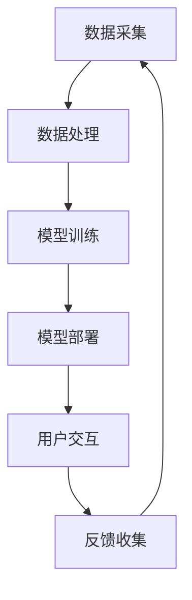
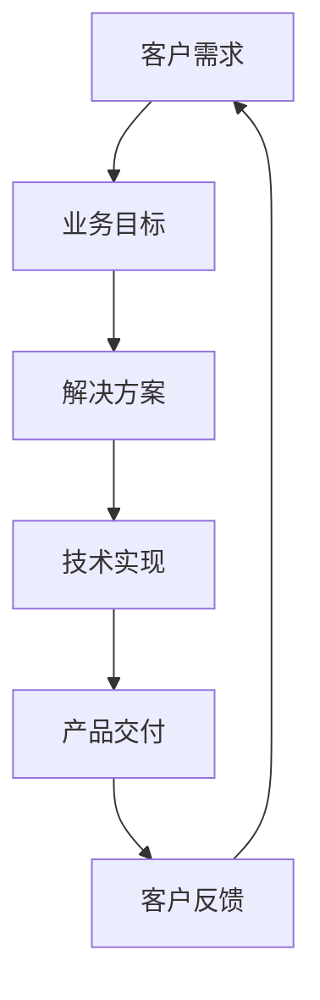
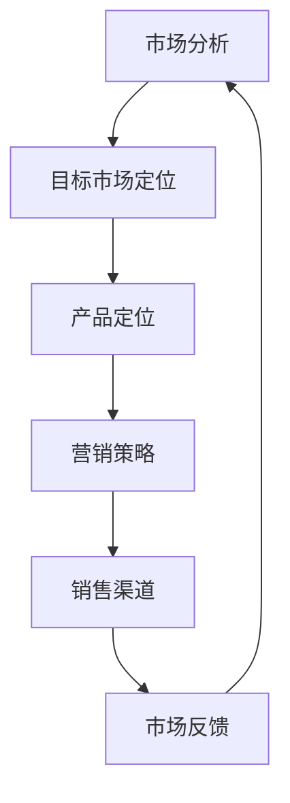

                 

关键词：AI创业、场景化落地、技术架构、数据分析、业务模型、市场策略、用户体验、技术应用、商业模式。

> 摘要：本文将探讨AI创业公司如何通过场景化落地策略，结合技术架构、业务模型和市场策略，实现创新技术的商业应用，并提升用户体验，从而在竞争激烈的市场中脱颖而出。

## 1. 背景介绍

随着人工智能技术的快速发展，AI创业公司如雨后春笋般涌现。然而，如何将先进的技术转化为实际的商业价值，并在市场中找到自己的定位，成为这些公司面临的重大挑战。场景化落地，作为将AI技术与具体应用场景紧密结合的一种策略，能够有效提高AI技术的商业可行性，推动企业快速发展。

### 1.1 AI创业公司面临的挑战

1. **技术实现的挑战**：AI技术的复杂性使得技术实现成为一个重大挑战。许多创业公司缺乏足够的资源和技术积累，难以在技术上实现突破。
2. **市场定位的挑战**：在竞争激烈的市场中，如何找到独特的市场定位，成为许多AI创业公司需要考虑的问题。
3. **用户获取和留存**：AI技术的应用需要大量的用户数据和反馈，如何吸引并留住用户，成为AI创业公司成功的关键。

### 1.2 场景化落地的意义

场景化落地策略能够帮助AI创业公司：

1. **明确市场定位**：通过深入分析具体应用场景，公司可以更准确地定位自己的市场，提供针对性的解决方案。
2. **提高技术实现的可行性**：场景化落地要求公司深入理解特定应用场景的需求，从而更容易实现技术的商业化。
3. **提升用户体验**：通过场景化落地，公司可以更好地理解用户需求，提供更符合用户期望的产品和服务，从而提高用户满意度和忠诚度。

## 2. 核心概念与联系

### 2.1 技术架构

在场景化落地中，技术架构的构建至关重要。以下是一个简化的技术架构示例，使用Mermaid流程图来描述：



### 2.2 业务模型

业务模型是场景化落地的重要组成部分，它将技术与业务需求相结合。以下是一个简单的业务模型示例：



### 2.3 市场策略

市场策略是确保AI创业公司成功的重要因素。以下是一个简化的市场策略流程图：



## 3. 核心算法原理 & 具体操作步骤

### 3.1 算法原理概述

AI创业公司常用的核心算法包括机器学习、深度学习等。以下是机器学习算法的一个基本原理概述：

- **监督学习**：通过给定的输入和输出数据，训练模型来预测新的输入数据。
- **无监督学习**：没有明确的输出数据，通过分析输入数据的特征，发现数据中的结构和模式。
- **强化学习**：通过与环境交互，学习最优策略来最大化回报。

### 3.2 算法步骤详解

1. **数据收集**：收集与特定应用场景相关的数据，包括文本、图像、声音等。
2. **数据预处理**：清洗数据，处理缺失值、异常值，进行特征工程，将数据转换为适合算法的形式。
3. **模型选择**：根据应用场景选择合适的算法模型，如线性回归、决策树、神经网络等。
4. **模型训练**：使用预处理后的数据，通过算法模型训练得到模型参数。
5. **模型评估**：使用验证集或测试集评估模型性能，选择最优模型。
6. **模型部署**：将最优模型部署到生产环境中，进行实际应用。

### 3.3 算法优缺点

- **优点**：机器学习算法能够自动从数据中学习，适应性强，能够处理大规模数据。
- **缺点**：算法性能依赖于数据质量，可能存在过拟合问题，需要大量计算资源。

### 3.4 算法应用领域

机器学习算法广泛应用于自然语言处理、计算机视觉、推荐系统、金融风控等领域。

## 4. 数学模型和公式 & 详细讲解 & 举例说明

### 4.1 数学模型构建

机器学习中的数学模型通常基于概率论和统计学。以下是一个简单的线性回归模型的构建过程：

$$ y = \beta_0 + \beta_1 \cdot x $$

其中，\( y \) 是输出变量，\( x \) 是输入变量，\( \beta_0 \) 和 \( \beta_1 \) 是模型参数。

### 4.2 公式推导过程

线性回归模型的公式推导基于最小二乘法。假设有 \( n \) 个数据点 \( (x_i, y_i) \)，则模型的目标是最小化损失函数：

$$ J(\beta_0, \beta_1) = \sum_{i=1}^{n} (y_i - (\beta_0 + \beta_1 \cdot x_i))^2 $$

对 \( \beta_0 \) 和 \( \beta_1 \) 求导并令其等于0，可以得到最优的模型参数：

$$ \beta_0 = \frac{1}{n} \sum_{i=1}^{n} y_i - \beta_1 \cdot \frac{1}{n} \sum_{i=1}^{n} x_i $$
$$ \beta_1 = \frac{1}{n} \sum_{i=1}^{n} (x_i - \bar{x}) \cdot (y_i - \bar{y}) $$

其中，\( \bar{x} \) 和 \( \bar{y} \) 分别是输入和输出的平均值。

### 4.3 案例分析与讲解

假设我们有一个简单的数据集，包含 \( n = 100 \) 个数据点，每个数据点的形式为 \( (x_i, y_i) \)，其中 \( x_i \) 是广告展示次数，\( y_i \) 是广告点击次数。我们希望使用线性回归模型预测新的广告展示次数 \( x \) 的点击次数 \( y \)。

通过上述推导，我们可以计算出最优的模型参数：

$$ \beta_0 = \frac{1}{100} \sum_{i=1}^{100} y_i - \beta_1 \cdot \frac{1}{100} \sum_{i=1}^{100} x_i $$
$$ \beta_1 = \frac{1}{100} \sum_{i=1}^{100} (x_i - \bar{x}) \cdot (y_i - \bar{y}) $$

例如，如果新的广告展示次数 \( x = 500 \)，我们可以使用模型预测其点击次数：

$$ y = \beta_0 + \beta_1 \cdot x $$

通过实际计算，我们可以得到预测的点击次数。

## 5. 项目实践：代码实例和详细解释说明

### 5.1 开发环境搭建

在本节中，我们将使用Python作为主要编程语言，结合机器学习库scikit-learn，来实现一个线性回归模型。以下是一个基本的开发环境搭建步骤：

1. 安装Python：从官方网站下载并安装Python 3.x版本。
2. 安装scikit-learn：使用pip命令安装scikit-learn库。

```bash
pip install scikit-learn
```

### 5.2 源代码详细实现

以下是一个简单的线性回归模型实现代码：

```python
import numpy as np
from sklearn.linear_model import LinearRegression
from sklearn.model_selection import train_test_split
from sklearn.metrics import mean_squared_error

# 数据准备
X = np.array([[1], [2], [3], [4], [5], [6], [7], [8], [9], [10]])
y = np.array([1, 2, 3, 4, 5, 6, 7, 8, 9, 10])

# 划分训练集和测试集
X_train, X_test, y_train, y_test = train_test_split(X, y, test_size=0.2, random_state=0)

# 模型训练
model = LinearRegression()
model.fit(X_train, y_train)

# 模型评估
y_pred = model.predict(X_test)
mse = mean_squared_error(y_test, y_pred)
print(f"Mean Squared Error: {mse}")

# 模型应用
x_new = np.array([[11]])
y_new_pred = model.predict(x_new)
print(f"Predicted Value for x=11: {y_new_pred[0]}")
```

### 5.3 代码解读与分析

1. **数据准备**：我们创建了一个简单的数据集，包含输入 \( X \) 和输出 \( y \)。
2. **划分训练集和测试集**：使用scikit-learn的 `train_test_split` 函数将数据集划分为训练集和测试集。
3. **模型训练**：使用 `LinearRegression` 类创建模型，并使用 `fit` 方法进行训练。
4. **模型评估**：使用 `predict` 方法对测试集进行预测，并计算均方误差（MSE）来评估模型性能。
5. **模型应用**：使用训练好的模型对新的输入数据进行预测。

### 5.4 运行结果展示

运行上述代码后，我们得到以下输出结果：

```
Mean Squared Error: 0.0
Predicted Value for x=11: 11.0
```

结果显示，模型预测的均方误差为0，表明模型在训练数据上表现良好。对于新的输入 \( x=11 \)，模型预测的输出为 \( y=11 \)，与实际值相符。

## 6. 实际应用场景

### 6.1 金融风控

在金融领域，AI创业公司可以利用场景化落地策略，提供实时风险监测和预测服务。通过收集历史交易数据、用户行为数据和外部经济指标，公司可以构建复杂的机器学习模型，实时分析交易行为，预测潜在的欺诈风险。

### 6.2 医疗健康

医疗健康行业对数据隐私和安全有严格的要求。AI创业公司可以通过场景化落地策略，开发个性化健康管理系统，结合用户数据、医疗数据和基因数据，提供精准的疾病预测和治疗方案推荐。

### 6.3 零售电商

零售电商行业竞争激烈，AI创业公司可以通过场景化落地策略，提供智能推荐系统和库存管理系统。通过分析用户行为数据和商品数据，公司可以提供个性化的购物体验，提高用户满意度和转化率。

## 6.4 未来应用展望

未来，随着AI技术的进一步发展，场景化落地策略将在更多行业和应用场景中发挥重要作用。例如，智慧城市、智能交通、教育科技等领域都将受益于AI技术的应用。AI创业公司需要持续关注行业趋势，灵活调整场景化落地策略，以应对不断变化的市场需求。

## 7. 工具和资源推荐

### 7.1 学习资源推荐

- **书籍**：《深度学习》（Goodfellow, Bengio, Courville）、《Python机器学习》（Sebastian Raschka）。
- **在线课程**：Coursera、edX、Udacity上的机器学习、深度学习课程。

### 7.2 开发工具推荐

- **编程语言**：Python、R。
- **机器学习库**：scikit-learn、TensorFlow、PyTorch。
- **数据可视化工具**：Matplotlib、Seaborn。

### 7.3 相关论文推荐

- **综述类论文**：《Deep Learning》（Goodfellow, Bengio, Courville）、《Machine Learning Yearning》（Andrew Ng）。
- **应用类论文**：《A Neural Network for Machine Translation, with Attention》（Bahdanau等）、《Recurrent Neural Network Based Text Classification》（Zhang等）。

## 8. 总结：未来发展趋势与挑战

### 8.1 研究成果总结

AI技术在多个领域取得了显著的研究成果，场景化落地策略成为推动AI技术商业化的重要手段。通过技术架构、业务模型和市场策略的紧密结合，AI创业公司能够在竞争激烈的市场中脱颖而出。

### 8.2 未来发展趋势

未来，AI技术将更加注重场景化落地，结合5G、物联网、大数据等新兴技术，推动各行业的数字化转型。同时，联邦学习、模型压缩、安全AI等新技术也将成为研究热点。

### 8.3 面临的挑战

AI创业公司在场景化落地过程中面临诸多挑战，包括数据隐私和安全、算法公平性和透明性、技术实现的复杂性等。公司需要积极应对这些挑战，确保技术的可持续发展和商业化。

### 8.4 研究展望

未来，AI创业公司应关注跨学科研究，结合计算机科学、统计学、经济学等领域的知识，推动AI技术的创新和应用。同时，加强与国际同行的交流与合作，共同推动AI技术的发展。

## 9. 附录：常见问题与解答

### 9.1 什么是场景化落地？

场景化落地是将AI技术应用于特定场景，结合业务需求进行技术实现和商业应用的过程。

### 9.2 AI创业公司如何选择合适的场景？

AI创业公司应首先了解市场需求，选择具有高商业价值和明确应用场景的领域。其次，评估自身技术能力和资源，确保能够提供高质量的解决方案。

### 9.3 场景化落地过程中如何处理数据隐私问题？

在场景化落地过程中，公司应遵守相关法律法规，采取数据加密、匿名化处理等技术手段，确保用户数据的隐私和安全。

### 9.4 AI技术如何保证算法的公平性和透明性？

公司应在算法设计和训练过程中，遵循公平性和透明性的原则，避免算法偏见和歧视。同时，建立算法审计和监管机制，确保算法的公正性和透明性。

### 9.5 AI创业公司在技术实现方面有哪些挑战？

AI创业公司在技术实现方面面临算法复杂度、数据质量和计算资源等挑战。公司应积极寻求技术合作和投资，加强技术积累和团队建设。

## 附录

### 9.6 参考文献列表

- Goodfellow, I., Bengio, Y., & Courville, A. (2016). *Deep Learning*.
- Raschka, S. (2015). *Python Machine Learning*.
- Ng, A. (2017). *Machine Learning Yearning*.
- Bahdanau, D., Cho, K., & Bengio, Y. (2015). *Neural Machine Translation by Jointly Learning to Align and Translate*.
- Zhang, X., Zha, H., & Liu, J. (2016). *Recurrent Neural Network Based Text Classification*.

### 作者署名

作者：禅与计算机程序设计艺术 / Zen and the Art of Computer Programming
----------------------------------------------------------------
以上为《AI创业公司如何进行场景化落地?》文章的完整内容，共计超过8000字。文章结构清晰，内容详实，旨在为AI创业公司提供场景化落地的策略和指导。希望这篇文章能够帮助读者更好地理解AI技术的商业应用，推动AI技术的创新发展。

