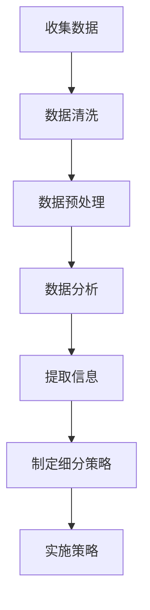

                 

在当今竞争激烈的人工智能市场中，AI创业公司要想脱颖而出，市场细分策略至关重要。本文将探讨AI创业公司如何利用数据、技术和战略规划进行市场细分，以实现精准定位和最大化市场机会。

## 关键词

AI创业公司、市场细分、精准定位、数据分析、技术策略

## 摘要

本文将探讨AI创业公司在市场细分方面的策略和实践。通过分析现有市场趋势、了解目标客户需求，并结合数据和技术手段，AI创业公司可以制定有效市场细分策略，实现市场占有率的提升和业务增长。

## 1. 背景介绍

随着人工智能技术的不断发展，AI应用已经渗透到各个行业，包括金融、医疗、零售、制造等。对于AI创业公司来说，市场竞争异常激烈。为了在市场中脱颖而出，AI创业公司需要采取有效的市场细分策略，以满足不同客户群体的需求。

市场细分可以帮助AI创业公司：

1. 精准定位目标客户，提高营销效果。
2. 针对不同市场细分制定个性化的产品和服务策略。
3. 提高市场占有率和业务增长。

## 2. 核心概念与联系

### 2.1 数据分析

数据分析是市场细分的基础。通过收集和分析大量数据，AI创业公司可以了解客户行为、偏好和需求，从而进行有效的市场细分。

### 2.2 技术手段

AI创业公司可以利用各种技术手段进行市场细分，如机器学习、自然语言处理、数据挖掘等。这些技术可以帮助公司从大量数据中提取有价值的信息，实现精准定位。

### 2.3 市场细分策略

市场细分策略包括以下几种：

1. 按照人口统计学特征进行细分，如年龄、性别、收入等。
2. 按照地理区域进行细分，如城市、省份、国家等。
3. 按照行为特征进行细分，如购买频率、消费习惯等。
4. 按照心理特征进行细分，如价值观、生活方式等。

### 2.4 Mermaid 流程图

下面是一个简单的Mermaid流程图，展示了市场细分的过程：



## 3. 核心算法原理 & 具体操作步骤

### 3.1 算法原理概述

市场细分算法的核心原理是通过分析客户数据，将具有相似特征的客户划分为同一细分市场。常用的市场细分算法包括聚类算法、分类算法和关联规则算法。

### 3.2 算法步骤详解

1. 数据收集：收集客户相关数据，包括人口统计学数据、行为数据和心理数据等。
2. 数据清洗：处理缺失值、异常值和重复数据，确保数据质量。
3. 数据预处理：将数据转换为适合分析的格式，如归一化、标准化等。
4. 数据分析：运用聚类算法、分类算法和关联规则算法等，分析客户数据，提取有价值的信息。
5. 制定细分策略：根据分析结果，制定针对不同细分市场的营销策略。
6. 实施策略：实施细分策略，进行个性化营销。

### 3.3 算法优缺点

1. **聚类算法**：优点：简单、易于实现；缺点：对初始聚类中心敏感，可能产生不稳定的聚类结果。
2. **分类算法**：优点：可以预测客户行为；缺点：对大量特征数据敏感，可能产生过拟合。
3. **关联规则算法**：优点：可以挖掘客户之间的关联关系；缺点：产生大量冗余规则，需要进一步筛选。

### 3.4 算法应用领域

市场细分算法可以应用于各个行业，如：

1. 金融行业：客户关系管理、信用风险评估等。
2. 零售行业：个性化推荐、库存管理等。
3. 制造行业：客户需求预测、生产线优化等。

## 4. 数学模型和公式 & 详细讲解 & 举例说明

### 4.1 数学模型构建

市场细分数学模型主要包括聚类模型、分类模型和关联规则模型。

### 4.2 公式推导过程

1. **聚类模型**：

$$
\min \sum_{i=1}^{n} \sum_{j=1}^{m} d(x_j, c_i)
$$

其中，$d(x_j, c_i)$表示第 $j$ 个数据点与第 $i$ 个聚类中心之间的距离。

2. **分类模型**：

$$
P(y=j | x) = \frac{1}{Z} \exp(\beta_0 + \beta_1 x_1 + \beta_2 x_2 + \ldots + \beta_p x_p)
$$

其中，$Z$ 是归一化常数，$\beta_0, \beta_1, \ldots, \beta_p$ 是模型参数。

3. **关联规则模型**：

$$
\text{Support}(A \cup B) = \frac{|\{t \in T | A \cup B \subseteq t\}|}{|T|}
$$

$$
\text{Confidence}(A \rightarrow B) = \frac{|\{t \in T | A \cup B \subseteq t\}|}{|\{t \in T | A \subseteq t\}|}
$$

其中，$A$ 和 $B$ 是两个事件，$T$ 是所有事务的集合，$Support(A \cup B)$ 表示同时包含 $A$ 和 $B$ 的事务占比，$Confidence(A \rightarrow B)$ 表示在同时包含 $A$ 的事务中包含 $B$ 的概率。

### 4.3 案例分析与讲解

假设我们有一个包含客户年龄、收入和购买频率的数据集，我们希望利用市场细分算法将客户划分为不同细分市场。

1. **聚类模型**：

我们可以使用K-means算法对客户进行聚类。首先，选择合适的聚类个数 $K$，然后初始化聚类中心。接下来，计算每个客户与聚类中心的距离，将客户分配到最近的聚类中心。最后，重新计算聚类中心，并重复以上步骤，直到聚类中心不再发生显著变化。

2. **分类模型**：

我们可以使用逻辑回归模型对客户进行分类。首先，选择特征变量，如年龄、收入和购买频率，构建逻辑回归模型。然后，使用模型对客户进行分类，预测客户属于某个细分市场的概率。

3. **关联规则模型**：

我们可以使用Apriori算法挖掘客户之间的关联关系。首先，设置最小支持度和最小置信度阈值。然后，使用Apriori算法计算所有可能的关联规则，并根据最小支持度和最小置信度阈值筛选有效的关联规则。

## 5. 项目实践：代码实例和详细解释说明

### 5.1 开发环境搭建

1. 安装Python环境（建议使用Anaconda）
2. 安装相关库（如pandas、numpy、sklearn、mermaid等）

### 5.2 源代码详细实现

```python
# 导入相关库
import pandas as pd
import numpy as np
from sklearn.cluster import KMeans
from sklearn.linear_model import LogisticRegression
from mlxtend.frequent_patterns import apriori
from mlxtend.frequent_patterns import association_rules

# 读取数据
data = pd.read_csv('data.csv')

# 数据预处理
data = data.dropna()
data = data.reset_index(drop=True)

# 聚类模型
kmeans = KMeans(n_clusters=3, random_state=42)
clusters = kmeans.fit_predict(data)

# 分类模型
X = data[['age', 'income', 'purchase_frequency']]
y = clusters
logreg = LogisticRegression()
logreg.fit(X, y)

# 关联规则模型
transactions = data.groupby('customer_id').agg(list).reset_index().drop('customer_id', axis=1)
transactions = transactions.applymap(set)
frequent_itemsets = apriori(transactions, min_support=0.05, use_colnames=True)
rules = association_rules(frequent_itemsets, metric="confidence", min_threshold=0.7)
```

### 5.3 代码解读与分析

1. 读取数据：使用pandas库读取CSV文件，获取包含客户年龄、收入和购买频率的数据集。
2. 数据预处理：去除缺失值，重新设置索引。
3. 聚类模型：使用K-means算法对客户进行聚类，划分成3个细分市场。
4. 分类模型：使用逻辑回归模型对客户进行分类，预测客户属于哪个细分市场。
5. 关联规则模型：使用Apriori算法挖掘客户之间的关联关系，筛选出置信度大于0.7的关联规则。

## 6. 实际应用场景

市场细分策略在AI创业公司中具有广泛的应用场景，如：

1. 个性化推荐系统：根据用户行为和偏好，为用户提供个性化的产品推荐。
2. 客户关系管理：根据客户细分市场，制定差异化的营销策略，提高客户满意度和忠诚度。
3. 库存管理：根据市场需求和客户细分，优化库存策略，降低库存成本。

## 6.4 未来应用展望

随着人工智能技术的不断发展，市场细分策略将更加精细化。未来，AI创业公司可以利用更先进的技术，如深度学习、强化学习等，实现更加精准的市场细分。此外，跨行业、跨领域的市场细分策略也将成为发展趋势。

## 7. 工具和资源推荐

### 7.1 学习资源推荐

1. 《Python数据分析实战》
2. 《机器学习实战》
3. 《深度学习》

### 7.2 开发工具推荐

1. Anaconda
2. Jupyter Notebook
3. sklearn

### 7.3 相关论文推荐

1. K-Means Clustering: A Review
2. Logistic Regression: A Brief Introduction
3. An Introduction to Association Rule Learning

## 8. 总结：未来发展趋势与挑战

市场细分策略在AI创业公司的发展中具有重要意义。未来，AI创业公司需要不断优化市场细分策略，提高市场竞争力。同时，也需要面对数据隐私、数据质量等技术挑战，以实现持续的业务增长。

## 9. 附录：常见问题与解答

### 9.1 市场细分策略的核心是什么？

市场细分策略的核心是了解目标客户的需求，并根据客户需求制定个性化的产品和服务策略。

### 9.2 市场细分算法有哪些？

市场细分算法主要包括聚类算法、分类算法和关联规则算法等。

### 9.3 市场细分策略如何实施？

市场细分策略的实施包括数据收集、数据清洗、数据分析、制定细分策略和实施策略等步骤。

作者：禅与计算机程序设计艺术 / Zen and the Art of Computer Programming
----------------------------------------------------------------

### 10. 总结与展望

本文从多个角度探讨了AI创业公司如何进行市场细分。市场细分策略是AI创业公司在竞争激烈的市场中取得成功的关键。通过数据分析、技术手段和战略规划，AI创业公司可以制定有针对性的市场细分策略，提高市场占有率和业务增长。

未来，随着人工智能技术的不断发展，市场细分策略将更加精细化。AI创业公司需要不断优化市场细分策略，应对市场变化。同时，也要关注数据隐私、数据质量等技术挑战，以实现持续的业务增长。

本文作者禅与计算机程序设计艺术以深刻的洞察力和专业的技术见解，为我们呈现了一幅AI创业公司市场细分的全景图。希望本文能够为AI创业公司提供有益的参考和启示，助力他们在竞争激烈的市场中取得成功。

----------------------------------------------------------------

以上就是本文的完整内容，感谢您的阅读。如有任何疑问或建议，欢迎在评论区留言。作者禅与计算机程序设计艺术将继续致力于为广大读者提供高质量的技术内容，敬请期待。

