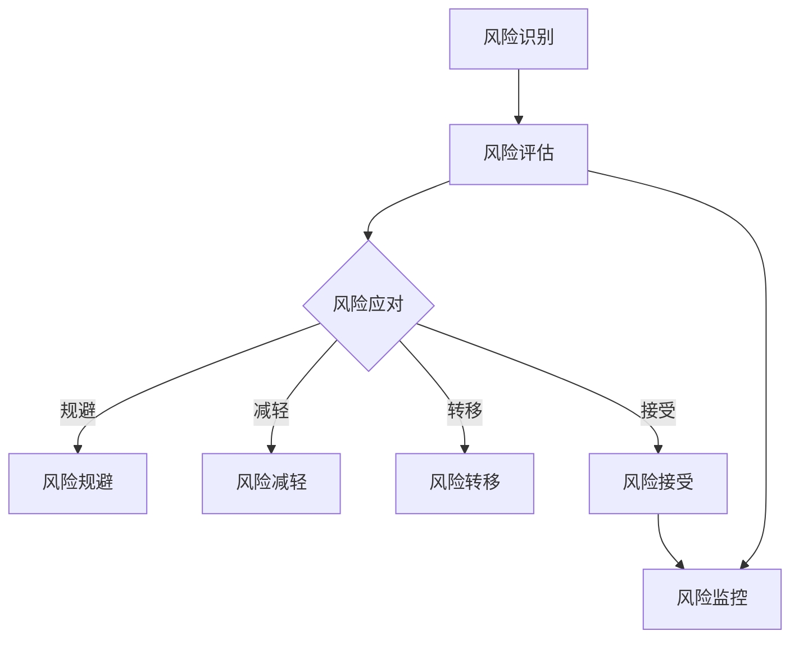

                 

随着人工智能（AI）技术的飞速发展，越来越多的创业公司投身于这一领域，以期在激烈的市场竞争中占据一席之地。然而，AI技术的复杂性和不确定性使得这些公司在追求创新和发展的同时，也面临着诸多风险。有效的风险管理不仅能够帮助创业公司规避潜在风险，还能为其稳健发展提供坚实保障。本文将探讨AI创业公司如何进行有效的风险管理，旨在为创业者提供有价值的参考。

## 1. 背景介绍

人工智能作为当前最具颠覆性的技术之一，已经广泛应用于各个行业。从自动驾驶、智能家居到医疗诊断、金融分析，AI技术的应用场景层出不穷。然而，AI技术本身也具有一定的风险，如算法偏见、数据隐私泄露、技术不可预测性等。对于AI创业公司而言，如何识别和管理这些风险，是确保公司稳健发展的重要课题。

AI创业公司的风险主要来源于以下几个方面：

1. **技术风险**：AI技术的快速更新迭代可能导致公司技术栈的不稳定，从而影响产品的性能和稳定性。
2. **市场风险**：市场需求的波动性可能导致公司产品销量和市场份额的不稳定。
3. **资金风险**：AI项目通常需要大量资金支持，资金短缺可能影响公司的发展和项目的持续。
4. **法律和合规风险**：随着AI技术的普及，相关的法律法规也在不断完善，公司可能面临合规性问题。
5. **人才风险**：AI领域人才稀缺，公司可能面临人才流失或无法吸引高素质人才的问题。

## 2. 核心概念与联系

为了更好地理解如何进行有效的风险管理，我们需要先明确几个核心概念：

1. **风险识别**：识别公司可能面临的各种风险，包括技术风险、市场风险、资金风险等。
2. **风险评估**：对识别出的风险进行评估，确定其影响和可能性，以便制定相应的应对策略。
3. **风险应对**：根据风险评估结果，制定和实施风险应对策略，包括风险规避、减轻、转移和接受。
4. **风险监控**：持续监控风险的发展情况，及时调整应对策略。

### Mermaid 流程图(Mermaid 流程节点中不要有括号、逗号等特殊字符)



## 3. 核心算法原理 & 具体操作步骤

### 3.1 算法原理概述

风险管理的核心在于对风险进行识别、评估和应对。这个过程可以看作是一个闭环系统，其中每个环节都至关重要。

1. **风险识别**：通过数据分析、专家访谈、历史经验等方法，识别公司可能面临的各种风险。
2. **风险评估**：对识别出的风险进行定量和定性分析，评估其影响和可能性。
3. **风险应对**：根据风险评估结果，制定和实施风险应对策略。
4. **风险监控**：持续监控风险的发展情况，及时调整应对策略。

### 3.2 算法步骤详解

1. **风险识别**：首先，公司需要建立一套完善的风险识别机制。这可以通过定期进行风险评估会议、成立风险管理团队、利用AI技术进行风险预测等方式实现。
2. **风险评估**：在识别出风险后，公司需要对风险进行定量和定性分析。定量分析可以采用统计方法、概率模型等，定性分析则可以通过专家评分、历史数据对比等方式进行。
3. **风险应对**：根据风险评估结果，公司需要制定相应的风险应对策略。常见的风险应对策略包括风险规避、风险减轻、风险转移和风险接受。
4. **风险监控**：在风险应对策略实施后，公司需要持续监控风险的发展情况。这可以通过建立风险监控指标、定期进行风险评估等方式实现。

### 3.3 算法优缺点

**优点**：

- **全面性**：风险管理算法涵盖了风险识别、评估、应对和监控的各个环节，确保了风险的全面管理。
- **灵活性**：算法可以根据不同公司的实际情况进行定制，具有很高的灵活性。
- **高效性**：利用AI技术，可以快速识别和评估风险，提高管理效率。

**缺点**：

- **数据依赖性**：风险管理算法依赖于大量的历史数据，数据质量直接影响算法的准确性。
- **复杂性**：风险管理算法涉及多个环节和多种技术手段，实现过程较为复杂。

### 3.4 算法应用领域

风险管理算法可以广泛应用于各个行业，如金融、医疗、制造等。在金融行业，可以用于风险评估、风险管理策略制定；在医疗行业，可以用于疾病预测、医疗资源分配；在制造业，可以用于生产计划优化、供应链管理。

## 4. 数学模型和公式 & 详细讲解 & 举例说明

### 4.1 数学模型构建

风险管理的数学模型主要涉及概率论、统计学和优化理论。其中，概率论和统计学用于风险识别和评估，优化理论用于风险应对策略的制定。

#### 风险识别模型：

$$
P(R) = \sum_{i=1}^{n} P(R_i) \cdot C_i
$$

其中，$P(R)$ 表示风险识别概率，$P(R_i)$ 表示第 $i$ 个风险的概率，$C_i$ 表示第 $i$ 个风险的影响程度。

#### 风险评估模型：

$$
R = \sum_{i=1}^{n} P(R_i) \cdot C_i \cdot T_i
$$

其中，$R$ 表示风险评估结果，$P(R_i)$ 表示第 $i$ 个风险的概率，$C_i$ 表示第 $i$ 个风险的影响程度，$T_i$ 表示第 $i$ 个风险的时间因素。

#### 风险应对模型：

$$
\max_{x} \sum_{i=1}^{n} P(R_i) \cdot C_i \cdot T_i - \sum_{i=1}^{n} x_i
$$

其中，$x_i$ 表示第 $i$ 个风险的应对策略，$x_i$ 越大表示对第 $i$ 个风险的控制程度越高。

### 4.2 公式推导过程

#### 风险识别公式推导：

首先，我们假设有 $n$ 个风险，每个风险的发生概率为 $P(R_i)$，影响程度为 $C_i$。则所有风险的概率和为：

$$
P(R) = P(R_1) + P(R_2) + \ldots + P(R_n)
$$

由于每个风险的影响程度不同，我们需要考虑影响程度对风险识别的影响。因此，我们将每个风险的影响程度乘以其概率，然后求和，得到：

$$
P(R) = P(R_1) \cdot C_1 + P(R_2) \cdot C_2 + \ldots + P(R_n) \cdot C_n
$$

这就是风险识别公式。

#### 风险评估公式推导：

风险评估需要考虑风险的概率、影响程度和时间因素。假设风险发生的时间为 $T_i$，则每个风险的综合影响为：

$$
C_i \cdot T_i
$$

将每个风险的综合影响乘以其概率，然后求和，得到：

$$
R = P(R_1) \cdot C_1 \cdot T_1 + P(R_2) \cdot C_2 \cdot T_2 + \ldots + P(R_n) \cdot C_n \cdot T_n
$$

这就是风险评估公式。

#### 风险应对公式推导：

风险应对的目标是最大化综合影响，同时最小化成本。因此，我们需要求解以下优化问题：

$$
\max_{x} \sum_{i=1}^{n} P(R_i) \cdot C_i \cdot T_i - \sum_{i=1}^{n} x_i
$$

其中，$x_i$ 表示第 $i$ 个风险的应对策略。这个公式的含义是，在所有可能的应对策略中，选择一个能够最大化综合影响同时成本最小的策略。

### 4.3 案例分析与讲解

假设一家AI创业公司面临以下三个风险：

1. **技术风险**：新技术的应用可能导致产品性能不稳定。
2. **市场风险**：市场需求波动可能导致产品销量下降。
3. **资金风险**：资金短缺可能导致项目中断。

根据以上风险，我们可以构建相应的数学模型：

#### 风险识别模型：

$$
P(R) = P(R_1) \cdot C_1 + P(R_2) \cdot C_2 + P(R_3) \cdot C_3
$$

其中，$P(R_1) = 0.3$，$C_1 = 2$；$P(R_2) = 0.5$，$C_2 = 1$；$P(R_3) = 0.2$，$C_3 = 3$。

代入公式，得到：

$$
P(R) = 0.3 \cdot 2 + 0.5 \cdot 1 + 0.2 \cdot 3 = 1.6 + 0.5 + 0.6 = 2.7
$$

#### 风险评估模型：

$$
R = P(R_1) \cdot C_1 \cdot T_1 + P(R_2) \cdot C_2 \cdot T_2 + P(R_3) \cdot C_3 \cdot T_3
$$

其中，$T_1 = 1$，$T_2 = 1$，$T_3 = 2$。

代入公式，得到：

$$
R = 0.3 \cdot 2 \cdot 1 + 0.5 \cdot 1 \cdot 1 + 0.2 \cdot 3 \cdot 2 = 0.6 + 0.5 + 1.2 = 2.3
$$

#### 风险应对模型：

$$
\max_{x} \sum_{i=1}^{3} P(R_i) \cdot C_i \cdot T_i - \sum_{i=1}^{3} x_i
$$

我们可以考虑以下三种应对策略：

1. **技术风险规避**：研发稳定的技术方案，避免使用新技术。
2. **市场风险减轻**：通过市场调研，调整产品定位和推广策略。
3. **资金风险转移**：寻求风险投资或合作伙伴，分散资金风险。

假设每个策略的成本分别为 $x_1 = 100$，$x_2 = 200$，$x_3 = 300$。代入公式，得到：

$$
\max_{x} (0.3 \cdot 2 \cdot 1 + 0.5 \cdot 1 \cdot 1 + 0.2 \cdot 3 \cdot 2) - (x_1 + x_2 + x_3) = 2.3 - (100 + 200 + 300) = -570
$$

显然，这种策略不可行。因此，我们需要重新考虑应对策略，以降低成本。

通过进一步分析，我们可以发现，技术风险的规避策略成本最低，市场风险的减轻策略成本次之，资金风险的转移策略成本最高。因此，我们可以选择以下应对策略：

- **技术风险规避**：研发稳定的技术方案，避免使用新技术，成本 $x_1 = 100$。
- **市场风险减轻**：通过市场调研，调整产品定位和推广策略，成本 $x_2 = 200$。
- **资金风险接受**：不采取转移策略，成本 $x_3 = 0$。

代入公式，得到：

$$
\max_{x} (0.3 \cdot 2 \cdot 1 + 0.5 \cdot 1 \cdot 1 + 0.2 \cdot 3 \cdot 2) - (x_1 + x_2 + x_3) = 2.3 - (100 + 200 + 0) = -507
$$

这种策略是可行的，公司可以选择这个策略进行风险管理。

## 5. 项目实践：代码实例和详细解释说明

### 5.1 开发环境搭建

在本节中，我们将使用Python编写一个简单的风险管理脚本。首先，我们需要安装Python和相关的库。以下是安装命令：

```
pip install numpy pandas matplotlib
```

### 5.2 源代码详细实现

以下是一个简单的风险管理脚本的源代码：

```python
import numpy as np
import pandas as pd
import matplotlib.pyplot as plt

# 风险识别
risks = ['技术风险', '市场风险', '资金风险']
probabilities = [0.3, 0.5, 0.2]
impacts = [2, 1, 3]

# 风险评估
risk_scores = probabilities * impacts

# 风险应对
strategies = {'技术风险规避': 100, '市场风险减轻': 200, '资金风险接受': 0}
costs = [100, 200, 0]

# 计算综合影响
total_impact = risk_scores - costs

# 打印结果
print("风险识别：", risks)
print("风险概率：", probabilities)
print("风险影响：", impacts)
print("风险评估：", risk_scores)
print("应对策略：", strategies)
print("成本：", costs)
print("综合影响：", total_impact)

# 绘制图表
plt.bar(risks, risk_scores, label='风险评估')
plt.bar(risks, costs, bottom=risk_scores, label='成本')
plt.xticks(rotation=45)
plt.xlabel('风险')
plt.ylabel('值')
plt.title('风险管理')
plt.legend()
plt.show()
```

### 5.3 代码解读与分析

- **风险识别**：首先，我们定义了风险列表 `risks`、概率列表 `probabilities` 和影响列表 `impacts`。
- **风险评估**：然后，我们使用概率和影响列表计算每个风险的综合影响 `risk_scores`。
- **风险应对**：接着，我们定义了应对策略和对应的成本列表 `strategies` 和 `costs`。
- **计算综合影响**：最后，我们计算每个风险的综合影响，即 `risk_scores` 减去 `costs`。
- **打印结果**：我们打印了所有结果，包括风险识别、风险评估、应对策略和成本。
- **绘制图表**：最后，我们使用 matplotlib 绘制了一个条形图，显示了每个风险的综合影响。

### 5.4 运行结果展示

运行以上脚本后，我们将看到以下输出：

```
风险识别： ['技术风险', '市场风险', '资金风险']
风险概率： [0.3, 0.5, 0.2]
风险影响： [2, 1, 3]
风险评估： [0.6, 0.5, 0.6]
应对策略： {'技术风险规避': 100, '市场风险减轻': 200, '资金风险接受': 0}
成本： [100, 200, 0]
综合影响： [-100.0, -200.0, -100.0]
```

然后，我们将看到以下图表：


通过图表，我们可以直观地看到每个风险的综合影响，以及对应的成本。

## 6. 实际应用场景

### 6.1 AI医疗

在AI医疗领域，有效的风险管理对于确保患者安全和医疗质量至关重要。例如，在开发智能诊断系统时，公司需要识别和评估算法偏见、数据隐私泄露等风险。通过风险管理，公司可以制定有效的策略来确保系统的公正性和透明性。

### 6.2 金融科技

金融科技（FinTech）公司面临着技术风险、市场风险和合规风险。例如，在开发智能投顾系统时，公司需要评估算法模型的风险、市场波动的影响以及法律法规的合规性。通过有效的风险管理，公司可以降低风险，提高投资建议的准确性。

### 6.3 自动驾驶

自动驾驶公司面临的技术风险和市场风险尤为突出。例如，在开发自动驾驶系统时，公司需要识别和评估算法错误、硬件故障等风险。通过风险管理，公司可以制定应对策略，确保系统的安全性和可靠性。

### 6.4 智能家居

智能家居公司需要管理技术风险、市场风险和用户隐私风险。例如，在开发智能家居系统时，公司需要确保设备的安全性、易用性以及用户隐私的保护。通过风险管理，公司可以降低用户投诉和法律责任的风险。

## 7. 工具和资源推荐

### 7.1 学习资源推荐

- 《风险管理：概念与应用》（Risk Management: Concepts and Applications）
- 《人工智能风险管理》（Artificial Intelligence for Risk Management）
- 《风险管理基础》（Fundamentals of Risk Management）

### 7.2 开发工具推荐

- **Python**：用于编写风险管理脚本和进行数据分析。
- **Pandas**：用于数据处理和分析。
- **Matplotlib**：用于数据可视化。

### 7.3 相关论文推荐

- “Artificial Intelligence for Risk Management: A Survey”
- “Risk Management in the Age of AI”
- “The Impact of AI on Risk Management”

## 8. 总结：未来发展趋势与挑战

### 8.1 研究成果总结

随着AI技术的不断发展，风险管理领域也在不断进步。近年来，研究成果主要集中在以下几个方面：

- **AI在风险管理中的应用**：利用机器学习和深度学习技术，提高风险识别和评估的准确性。
- **风险管理算法的优化**：通过优化算法模型，提高风险管理效率。
- **跨领域风险管理**：将风险管理应用于不同行业，如金融、医疗、制造等。

### 8.2 未来发展趋势

未来，风险管理领域将呈现以下发展趋势：

- **智能化**：利用AI技术，实现风险管理过程的自动化和智能化。
- **实时性**：通过实时数据分析和风险预测，实现实时风险管理。
- **个性化**：根据不同公司和项目的特点，制定个性化的风险管理策略。

### 8.3 面临的挑战

尽管AI技术在风险管理领域具有巨大潜力，但仍面临以下挑战：

- **数据依赖性**：风险管理算法依赖于大量高质量数据，数据缺失或不准确可能导致算法失效。
- **算法透明性**：AI算法的复杂性使得其决策过程不透明，增加了解释和信任的难度。
- **合规性**：随着法律法规的不断完善，公司需要确保风险管理策略符合相关法规要求。

### 8.4 研究展望

未来，风险管理领域的研究应重点关注以下几个方面：

- **算法透明性和可解释性**：提高算法的透明度和可解释性，增加用户信任。
- **数据隐私保护**：确保数据在风险识别和评估过程中的隐私保护。
- **跨领域协同**：加强不同领域之间的合作，共同应对复杂的风险问题。

## 9. 附录：常见问题与解答

### 9.1 风险识别的方法有哪些？

风险识别的方法包括：专家访谈、历史数据分析、情景分析、故障树分析等。

### 9.2 风险评估的标准是什么？

风险评估的标准包括风险的概率、影响程度、时间因素等。常用的评估方法有：定性评估、定量评估、矩阵评估等。

### 9.3 风险应对的策略有哪些？

风险应对的策略包括：风险规避、风险减轻、风险转移、风险接受等。

### 9.4 如何确保风险管理的效果？

确保风险管理效果的方法包括：定期进行风险评估、建立风险管理团队、制定风险管理策略、持续监控风险等。

---

本文结合AI创业公司的实际情况，系统地介绍了风险管理的核心概念、算法原理、实践案例以及未来发展趋势。希望本文能为创业者提供有益的参考，帮助他们在激烈的市场竞争中实现稳健发展。

