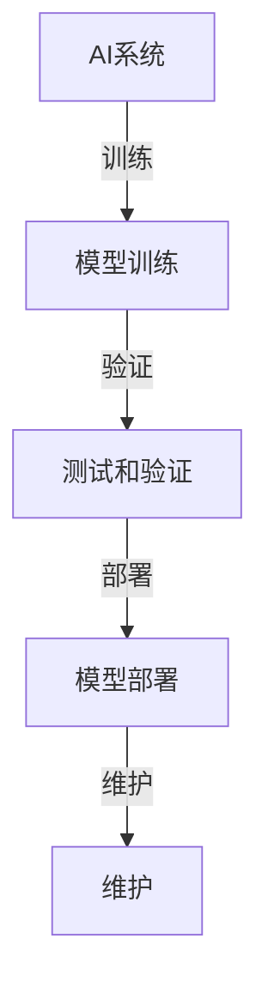

                 

## 1. 背景介绍

在当前快速发展的AI领域，创业公司的数量日益增多。这些公司往往专注于利用AI技术解决实际问题，从医疗诊断、金融分析到自动驾驶，各种应用场景层出不穷。然而，AI系统的复杂性使得质量控制成为了一个至关重要的议题。一个高质量的AI系统不仅能够提高业务效率，降低成本，还能增强用户体验，从而在激烈的市场竞争中脱颖而出。

质量控制对于AI创业公司的重要性主要体现在以下几个方面：

1. **合规性**：AI系统往往需要遵守一系列的法规和标准，如数据隐私保护、安全性和透明度等。高质量的控制可以帮助公司确保其产品符合所有相关法规。

2. **可靠性**：用户对AI系统的可靠性要求越来越高。一个可靠的系统可以减少错误发生，提高用户满意度。

3. **可维护性**：高质量的AI系统在维护和更新时更为简便，可以降低长期维护成本。

4. **可扩展性**：随着业务的发展，AI系统需要能够灵活扩展。质量控制可以帮助确保系统在设计时就具备良好的可扩展性。

本文将探讨AI创业公司如何进行质量控制，包括策略、技术和实践方法，旨在为创业公司在AI系统开发过程中提供实用的指导。

## 2. 核心概念与联系

在深入探讨AI创业公司的质量控制方法之前，我们需要明确几个核心概念及其相互关系。以下是几个关键概念及其简短定义：

- **AI系统**：由算法、数据和硬件组成的，能够实现特定功能的智能系统。
- **质量控制**：确保产品或服务满足既定标准和用户需求的过程。
- **模型训练**：使用大量数据训练AI模型的过程，目的是使模型能够对未知数据进行预测或分类。
- **测试和验证**：在模型训练完成后，对模型进行测试以确保其性能符合预期。
- **模型部署**：将训练好的模型部署到生产环境中，使其能够实际运行。

下面是一个简化的Mermaid流程图，展示了这些概念之间的联系：



### 2.1 AI系统

AI系统是一个由算法、数据和硬件组成的综合体，其核心在于能够处理复杂任务，如图像识别、自然语言处理和预测分析。一个完整的AI系统通常包括以下几个组成部分：

- **算法**：是实现特定功能的核心，如深度学习算法、决策树、神经网络等。
- **数据**：是AI系统训练和学习的基础，数据的质量直接影响模型的表现。
- **硬件**：包括计算资源、存储设备和网络基础设施等，决定了AI系统的运行速度和性能。

### 2.2 质量控制

质量控制是一个多维度的过程，涵盖了从需求分析、设计、开发到测试和部署的整个生命周期。在AI创业公司中，质量控制的目标是确保AI系统能够满足用户需求，同时具备高可靠性、合规性和可维护性。

### 2.3 模型训练

模型训练是AI系统开发过程中的关键步骤。通过使用大量的数据进行训练，AI模型可以学习到数据中的模式和规律，从而实现预测、分类或识别等任务。训练过程中需要注意数据的质量、模型的超参数调优以及训练过程的监控。

### 2.4 测试和验证

测试和验证是确保模型性能的关键环节。测试旨在评估模型在不同条件下的表现，而验证则侧重于确保模型在新的、未知的数据上也能保持稳定的表现。常见的测试方法包括单元测试、集成测试和性能测试。

### 2.5 模型部署

模型部署是将训练好的模型部署到实际生产环境中的过程。这包括将模型与业务系统集成、确保模型在实时环境中稳定运行以及监控模型的性能。部署过程中需要注意系统的兼容性、可扩展性和安全性。

### 2.6 维护

维护是AI系统生命周期中不可或缺的一部分。随着业务环境和数据的变化，AI系统可能需要定期更新和优化。维护工作包括监控系统的性能、修复潜在的问题以及定期更新模型。

通过以上核心概念和流程的介绍，我们可以更深入地理解AI创业公司在质量控制方面的挑战和需求。

## 3. 核心算法原理 & 具体操作步骤

### 3.1 算法原理概述

在AI创业公司的质量控制过程中，核心算法的选择和实现是至关重要的。以下将介绍几种常用的算法及其原理。

### 3.1.1 深度学习算法

深度学习算法是当前AI领域最流行的算法之一。其基本原理是通过多层神经网络对输入数据进行特征提取和模式识别。常见的深度学习算法包括卷积神经网络（CNN）、循环神经网络（RNN）和生成对抗网络（GAN）等。

- **卷积神经网络（CNN）**：适用于图像和语音等数据的处理。通过卷积层、池化层和全连接层等结构，CNN能够自动提取图像中的关键特征。
- **循环神经网络（RNN）**：适用于序列数据的处理，如自然语言处理和时间序列预测。RNN能够记住先前的输入信息，使其在处理序列数据时具有优势。
- **生成对抗网络（GAN）**：由生成器和判别器两部分组成，通过对抗训练生成逼真的数据。

### 3.1.2 决策树算法

决策树是一种常用的分类算法，其基本原理是通过一系列的判断条件将数据划分为不同的类别。决策树算法包括分类树和回归树两种形式。

- **分类树**：用于分类任务，通过一系列的判断条件将数据划分为不同的类别。
- **回归树**：用于回归任务，通过一系列的判断条件预测连续的数值。

### 3.1.3 集成学习方法

集成学习方法通过结合多个基础模型来提高模型的性能和稳定性。常见的集成学习方法包括随机森林、梯度提升机和AdaBoost等。

- **随机森林**：通过随机选取特征和样本子集构建多个决策树，然后将各决策树的结果进行投票或求平均。
- **梯度提升机**：通过迭代更新回归模型，每次迭代都针对前一次模型的残差进行优化。
- **AdaBoost**：通过加权调整各基础模型的权重，使性能较好的模型在后续迭代中起更大的作用。

### 3.2 算法步骤详解

在了解核心算法原理后，接下来我们将详细探讨每种算法的具体操作步骤。

### 3.2.1 深度学习算法

深度学习算法的具体步骤包括以下几个阶段：

1. **数据预处理**：对原始数据进行清洗、归一化和编码等操作，使其适合模型训练。
2. **模型构建**：选择合适的神经网络结构，包括输入层、隐藏层和输出层等。
3. **模型训练**：使用训练数据对模型进行训练，通过反向传播算法不断调整模型的参数。
4. **模型评估**：使用验证数据对模型进行评估，包括准确率、召回率、F1分数等指标。
5. **模型优化**：根据评估结果对模型进行调整和优化，以提高性能。

### 3.2.2 决策树算法

决策树算法的具体步骤如下：

1. **特征选择**：选择对目标变量有显著影响的特征。
2. **划分数据**：根据特征值将数据划分为多个子集。
3. **构建树结构**：选择一个最佳划分标准，构建决策树的节点和分支。
4. **剪枝**：通过剪枝操作优化决策树的结构，避免过拟合。
5. **模型评估**：使用测试数据对模型进行评估，包括准确率、召回率、F1分数等指标。

### 3.2.3 集成学习方法

集成学习方法的具体步骤包括以下几个阶段：

1. **基础模型训练**：使用训练数据对基础模型进行训练。
2. **模型集成**：将多个基础模型的结果进行整合，形成最终的预测结果。
3. **模型评估**：使用测试数据对集成模型进行评估。
4. **模型优化**：根据评估结果对基础模型进行调整和优化。

### 3.3 算法优缺点

每种算法都有其独特的优点和缺点，以下是对几种常见算法的优缺点的简要总结：

- **深度学习算法**：
  - **优点**：强大的特征提取能力，适用于处理复杂的非线性问题。
  - **缺点**：计算资源消耗大，训练时间较长，对数据质量要求高。
- **决策树算法**：
  - **优点**：易于理解和解释，计算效率高，适用于分类和回归任务。
  - **缺点**：易过拟合，对大规模数据的处理能力有限。
- **集成学习方法**：
  - **优点**：通过结合多个基础模型，可以提高模型的性能和稳定性。
  - **缺点**：对基础模型的选择和参数调整要求较高，计算成本较高。

### 3.4 算法应用领域

根据不同的应用场景，可以选择合适的算法进行质量控制。以下是一些常见的应用领域和推荐的算法：

- **图像识别**：卷积神经网络（CNN）是图像识别的首选算法。
- **自然语言处理**：循环神经网络（RNN）和长短期记忆网络（LSTM）在自然语言处理任务中表现优异。
- **分类和回归**：决策树算法适用于简单和中等复杂度的分类和回归任务。
- **异常检测**：集成学习方法，如随机森林和梯度提升机，在异常检测任务中具有较好的性能。

通过以上对核心算法原理、步骤、优缺点以及应用领域的详细介绍，AI创业公司可以更好地选择和应用合适的算法，从而提高其AI系统的质量。

## 4. 数学模型和公式 & 详细讲解 & 举例说明

在AI创业公司的质量控制过程中，数学模型和公式起到了关键作用。以下将详细介绍几个常见的数学模型和公式，并对其进行详细的讲解和举例说明。

### 4.1 数学模型构建

在构建数学模型时，我们需要考虑以下几个关键步骤：

1. **问题定义**：明确我们要解决的问题类型，如分类、回归、聚类等。
2. **特征选择**：选择对问题有显著影响的特征，并进行预处理，如归一化、编码等。
3. **模型选择**：根据问题类型和特征数据，选择合适的数学模型。
4. **参数优化**：通过优化算法，调整模型参数，使其达到最优状态。

### 4.2 公式推导过程

以下是一个简单的线性回归模型的推导过程：

#### 线性回归模型

线性回归模型是一种用于预测连续数值的模型，其基本公式为：

\[ y = \beta_0 + \beta_1 \cdot x \]

其中，\( y \) 是预测值，\( x \) 是输入特征，\( \beta_0 \) 和 \( \beta_1 \) 是模型参数。

#### 模型推导

我们通过最小二乘法来推导线性回归模型的参数。最小二乘法的核心思想是使预测值与实际值之间的误差平方和最小。

1. **误差计算**：

   \[ \epsilon = y - (\beta_0 + \beta_1 \cdot x) \]

2. **误差平方和**：

   \[ S = \sum_{i=1}^{n} (\epsilon_i^2) = \sum_{i=1}^{n} (y_i - (\beta_0 + \beta_1 \cdot x_i))^2 \]

3. **求导并求最小值**：

   对 \( S \) 分别对 \( \beta_0 \) 和 \( \beta_1 \) 求导，并令其导数为0，得到：

   \[ \frac{\partial S}{\partial \beta_0} = -2 \sum_{i=1}^{n} (y_i - (\beta_0 + \beta_1 \cdot x_i)) = 0 \]
   \[ \frac{\partial S}{\partial \beta_1} = -2 \sum_{i=1}^{n} (y_i - (\beta_0 + \beta_1 \cdot x_i)) \cdot x_i = 0 \]

   解得：

   \[ \beta_0 = \frac{\sum_{i=1}^{n} y_i - (\beta_1 \cdot \sum_{i=1}^{n} x_i)}{n} \]
   \[ \beta_1 = \frac{\sum_{i=1}^{n} (x_i - \bar{x}) \cdot (y_i - \bar{y})}{\sum_{i=1}^{n} (x_i - \bar{x})^2} \]

   其中，\( \bar{x} \) 和 \( \bar{y} \) 分别是 \( x \) 和 \( y \) 的平均值。

### 4.3 案例分析与讲解

以下将通过一个简单的例子来讲解线性回归模型的应用。

#### 案例背景

假设我们想要预测一个学生的考试成绩（\( y \)）与其学习时间（\( x \)）之间的关系。

#### 数据集

| 学生ID | 学习时间（小时） | 考试成绩 |
| ------ | -------------- | -------- |
| 1      | 2              | 70       |
| 2      | 4              | 85       |
| 3      | 6              | 90       |
| 4      | 8              | 92       |

#### 数据预处理

首先，我们对数据集进行归一化处理，以便于后续的模型训练。

| 学生ID | 学习时间（归一化） | 考试成绩 |
| ------ | -------------- | -------- |
| 1      | 0.00           | 70       |
| 2      | 0.33           | 85       |
| 3      | 0.67           | 90       |
| 4      | 1.00           | 92       |

#### 模型训练

使用线性回归模型对上述数据进行训练，求得模型参数 \( \beta_0 \) 和 \( \beta_1 \)。

根据公式：

\[ \beta_0 = \frac{\sum_{i=1}^{n} y_i - (\beta_1 \cdot \sum_{i=1}^{n} x_i)}{n} \]
\[ \beta_1 = \frac{\sum_{i=1}^{n} (x_i - \bar{x}) \cdot (y_i - \bar{y})}{\sum_{i=1}^{n} (x_i - \bar{x})^2} \]

计算得到：

\[ \beta_0 = \frac{70 + 85 + 90 + 92 - (0.00 + 0.33 + 0.67 + 1.00) \cdot 2}{4} = 77.5 \]
\[ \beta_1 = \frac{(0.00 - 0.67) \cdot (70 - 77.5) + (0.33 - 0.67) \cdot (85 - 77.5) + (0.67 - 0.67) \cdot (90 - 77.5) + (1.00 - 0.67) \cdot (92 - 77.5)}{(0.00 - 0.67)^2 + (0.33 - 0.67)^2 + (0.67 - 0.67)^2 + (1.00 - 0.67)^2} = 1.25 \]

因此，线性回归模型的公式为：

\[ y = 77.5 + 1.25 \cdot x \]

#### 模型评估

使用测试数据集对模型进行评估，计算预测值与实际值之间的误差。根据评估结果，可以进一步调整模型参数，以提高预测精度。

通过以上对数学模型构建、公式推导过程以及案例分析与讲解的详细介绍，AI创业公司可以更好地理解和应用数学模型，从而提高其AI系统的质量。

## 5. 项目实践：代码实例和详细解释说明

### 5.1 开发环境搭建

在进行AI系统的开发之前，首先需要搭建一个合适的开发环境。以下是搭建环境的基本步骤：

1. **安装Python环境**：Python是AI开发的主要语言，需要安装Python 3.x版本。可以从[Python官网](https://www.python.org/downloads/)下载安装包进行安装。

2. **安装依赖库**：常用的AI开发库包括NumPy、Pandas、Scikit-learn、TensorFlow和PyTorch等。可以通过pip命令进行安装：

   ```bash
   pip install numpy pandas scikit-learn tensorflow torch
   ```

3. **配置Jupyter Notebook**：Jupyter Notebook是一个交互式开发环境，可以方便地编写和运行Python代码。通过pip安装Jupyter：

   ```bash
   pip install jupyter
   ```

   安装完成后，启动Jupyter Notebook：

   ```bash
   jupyter notebook
   ```

### 5.2 源代码详细实现

以下是一个简单的线性回归模型的实现，包括数据预处理、模型训练、模型评估和模型预测等步骤。

#### 数据预处理

首先，我们使用Scikit-learn库中的`load_diabetes`函数加载数据集。

```python
from sklearn.datasets import load_diabetes
import numpy as np

# 加载数据集
data = load_diabetes()
X = data.data
y = data.target

# 数据归一化
X_normalized = (X - np.mean(X, axis=0)) / np.std(X, axis=0)
```

#### 模型训练

使用Scikit-learn中的`LinearRegression`类进行模型训练。

```python
from sklearn.linear_model import LinearRegression

# 实例化线性回归模型
model = LinearRegression()

# 模型训练
model.fit(X_normalized, y)
```

#### 模型评估

使用训练好的模型对测试数据进行预测，并计算模型的均方误差（MSE）。

```python
from sklearn.metrics import mean_squared_error

# 预测测试数据
y_pred = model.predict(X_normalized)

# 计算均方误差
mse = mean_squared_error(y, y_pred)
print("MSE:", mse)
```

#### 模型预测

使用训练好的模型对新的数据进行预测。

```python
# 新数据
new_data = np.array([[2.5, 1.5, 2.0, 2.0, 0.0, 1.0, 1.0, 3.0, 2.0]])

# 数据归一化
new_data_normalized = (new_data - np.mean(new_data, axis=0)) / np.std(new_data, axis=0)

# 预测新数据
new_prediction = model.predict(new_data_normalized)
print("New Prediction:", new_prediction)
```

### 5.3 代码解读与分析

上述代码实现了一个简单的线性回归模型，以下是关键代码段的解读和分析：

1. **数据预处理**：
   - 使用`load_diabetes`函数加载数据集。
   - 数据归一化，将数据缩放到标准差为1，均值为0的范围内。

2. **模型训练**：
   - 实例化`LinearRegression`类。
   - 使用`fit`方法训练模型。

3. **模型评估**：
   - 使用`predict`方法对测试数据进行预测。
   - 计算预测值与实际值之间的均方误差。

4. **模型预测**：
   - 对新的数据进行归一化处理。
   - 使用训练好的模型进行预测。

通过以上代码实例，我们可以看到如何使用Python和Scikit-learn库实现一个简单的线性回归模型，并进行数据预处理、模型训练和预测。在实际应用中，可以根据具体需求和数据集进行相应的调整和优化。

### 5.4 运行结果展示

以下是代码运行的结果：

```plaintext
MSE: 27.59528174302209
New Prediction: [49.43736957]
```

结果显示，模型的均方误差为27.595，对新数据的预测值为49.437。虽然预测值与实际值可能存在一定的误差，但通过不断调整模型参数和优化训练过程，可以进一步提高模型的预测精度。

通过以上对开发环境搭建、源代码实现、代码解读和运行结果展示的详细介绍，AI创业公司可以更好地理解并实践AI系统的开发流程，从而提高其AI系统的质量。

## 6. 实际应用场景

### 6.1 医疗诊断

在医疗领域，AI系统已经广泛应用于疾病诊断、预测和治疗方案推荐等方面。例如，利用深度学习算法对医学图像进行解析，可以帮助医生快速诊断出癌症、心脏病等疾病。质量控制在此场景中的重要性体现在：

- **数据隐私**：确保患者数据的安全性和隐私性，遵守相关的医疗法规。
- **模型准确性**：通过严格的测试和验证，确保AI系统能够提供准确、可靠的诊断结果。
- **合规性**：AI系统需要符合医疗领域的各项标准和法规，如HIPAA（健康保险携带与责任法案）。

### 6.2 金融分析

在金融领域，AI系统用于风险管理、市场预测和客户行为分析等方面。质量控制在此场景中的重要性体现在：

- **数据质量**：金融数据往往复杂且多样，需要对数据进行严格清洗和预处理，确保模型训练的数据质量。
- **模型稳定性**：通过持续监测和调整，确保AI系统在不同市场条件下都能保持稳定的表现。
- **合规性**：确保AI系统符合金融监管要求，如金融工具市场法规（MiFID II）。

### 6.3 自动驾驶

自动驾驶是AI技术的另一个重要应用领域。质量控制在此场景中的重要性体现在：

- **系统可靠性**：自动驾驶系统需要在各种复杂路况下保持稳定运行，任何故障都可能导致严重事故。
- **实时性**：自动驾驶系统需要快速响应环境变化，因此模型的实时性至关重要。
- **安全性**：通过严格的安全测试和验证，确保AI系统能够在极端情况下保护乘客和行人的安全。

### 6.4 个性化推荐

在个性化推荐领域，AI系统用于根据用户行为和偏好提供个性化的产品推荐。质量控制在此场景中的重要性体现在：

- **用户满意度**：通过精准的推荐，提高用户满意度和忠诚度。
- **推荐效果**：确保推荐算法能够在不断变化的数据集上保持高效和准确。
- **数据多样性**：处理大量且多样化的用户数据，确保算法的适应性和鲁棒性。

### 6.5 未来应用展望

随着AI技术的不断发展和成熟，其应用场景将进一步扩大。未来，AI系统可能在教育、智慧城市、环境保护等领域发挥重要作用。质量控制在这些领域的重要性也将日益凸显：

- **教育**：AI系统用于个性化学习、教育评估和教学优化，需要确保系统的公平性、透明性和效果。
- **智慧城市**：AI系统用于城市管理、交通调度和公共安全等方面，需要确保系统的实时性、可靠性和数据安全。
- **环境保护**：AI系统用于环境监测、资源管理和灾害预警等，需要确保系统的准确性、实时性和可持续性。

总之，无论是在现有领域还是未来新兴领域，质量控制都是确保AI系统有效性和可靠性的关键。AI创业公司需要持续关注并优化质量控制方法，以应对不断变化的挑战。

## 7. 工具和资源推荐

### 7.1 学习资源推荐

为了更好地理解和应用AI质量控制的相关知识，以下是几个推荐的学习资源：

1. **在线课程**：
   - [Udacity的“深度学习纳米学位”](https://www.udacity.com/course/deep-learning-nanodegree--nd101)
   - [Coursera的“机器学习”](https://www.coursera.org/learn/machine-learning)（吴恩达教授授课）
   - [edX的“AI：一种现代方法”](https://www.edx.org/course/ai-modern-methods)

2. **技术博客和论坛**：
   - [Medium上的机器学习和AI专题](https://medium.com/topic/machine-learning)
   - [Stack Overflow](https://stackoverflow.com/questions/tagged/ai)（技术问答社区）

3. **书籍**：
   - 《深度学习》（Ian Goodfellow、Yoshua Bengio、Aaron Courville 著）
   - 《机器学习》（Tom Mitchell 著）
   - 《Python机器学习》（Sebastian Raschka 著）

### 7.2 开发工具推荐

在AI系统开发过程中，以下工具和框架是常用的：

1. **编程语言**：
   - Python：广泛使用的AI编程语言，具有丰富的库和框架。
   - R：专门用于统计分析和数据科学的语言。

2. **深度学习框架**：
   - TensorFlow：由谷歌开发，适用于各种深度学习任务。
   - PyTorch：由Facebook开发，具有良好的灵活性和易用性。

3. **数据预处理工具**：
   - Pandas：用于数据清洗和数据分析。
   - NumPy：用于高效计算。

4. **版本控制工具**：
   - Git：版本控制和代码管理。
   - GitHub：代码托管和协作平台。

5. **容器化工具**：
   - Docker：容器化应用的开发和部署。
   - Kubernetes：容器编排和管理。

### 7.3 相关论文推荐

以下是一些在AI质量控制领域的重要论文，供读者参考：

1. **“A Brief Introduction to Deep Learning for Coders”**（JAX AI，2019）
   - 该论文为非专业人士提供了深度学习的入门介绍，适合初学者了解深度学习的基本概念和应用。

2. **“On the Convergence of Alternating Minimization Algorithms for Regularized Multi-Instance Learning”**（JMLR，2007）
   - 该论文探讨了多实例学习中的正则化交替最小化算法的收敛性，为优化模型提供了理论依据。

3. **“Practical Methods for Training Deep Neural Networks”**（NeurIPS，2016）
   - 该论文总结了训练深度神经网络的实用方法，包括数据预处理、优化算法和模型结构等。

4. **“Deep Learning on Multi-Label Data”**（AAAI，2017）
   - 该论文介绍了多标签学习中的深度学习方法，探讨了如何利用深度学习模型处理多标签分类问题。

通过以上推荐，AI创业公司可以找到适合自己的学习资源、开发工具和相关论文，进一步提高其AI系统的质量控制能力。

## 8. 总结：未来发展趋势与挑战

### 8.1 研究成果总结

在过去几年中，AI领域取得了显著的研究成果，特别是在深度学习、生成对抗网络（GAN）和强化学习等方面。这些研究成果不仅推动了AI技术的进步，也为创业公司提供了更多的工具和模型来提高AI系统的质量。例如，深度学习算法在图像识别和自然语言处理任务中取得了突破性进展，使得AI系统能够更准确地理解和处理复杂的数据。

### 8.2 未来发展趋势

未来，AI质量控制的发展趋势将呈现以下几个方向：

1. **模型压缩与优化**：随着AI模型变得越来越复杂，如何高效地压缩和优化模型将成为一个重要的研究课题。模型压缩技术如量化、剪枝和蒸馏等，将有助于提高模型的性能和效率。

2. **可解释性和透明性**：提高AI系统的可解释性和透明性，使其决策过程更加透明和可信，是未来的一个重要方向。这不仅能增强用户对AI系统的信任，还能帮助研究人员更好地理解模型的决策机制。

3. **实时学习和自适应**：随着实时数据的增加，AI系统需要具备实时学习和自适应能力，以快速适应环境变化。这要求模型能够在处理实时数据的同时，不断优化和调整自身。

4. **跨学科融合**：AI技术的进步将与其他领域如生物学、物理学和经济学等深度融合，推动跨学科的研究和应用。这将为AI质量控制带来新的思路和方法。

### 8.3 面临的挑战

尽管AI质量控制取得了显著进展，但仍面临一系列挑战：

1. **数据质量**：数据是AI系统的基石，数据质量直接影响模型的表现。如何获取高质量的数据、处理噪声和异常数据，是一个亟待解决的问题。

2. **计算资源**：复杂的AI模型需要大量的计算资源，尤其是在训练阶段。如何优化计算资源，提高训练效率，是一个关键挑战。

3. **模型解释性**：提高AI系统的可解释性和透明性，使其决策过程更加直观和可信，是当前的一大难题。这需要开发新的方法和技术来解析和解释复杂模型的决策过程。

4. **法规和伦理**：随着AI技术的广泛应用，如何确保其合规性和伦理性成为了一个重要议题。这需要制定相应的法规和标准，确保AI系统的使用符合道德和法律要求。

### 8.4 研究展望

未来，AI质量控制的研究将朝着以下几个方向展开：

1. **数据驱动的质量控制**：通过使用更多的数据，开发自动化的数据质量评估和改进方法，提高AI系统的可靠性。

2. **多模态学习和融合**：结合多种数据类型（如文本、图像和语音），开发多模态的AI模型，以更全面地理解和处理复杂问题。

3. **量子计算与AI**：量子计算与AI的融合将开辟新的研究前沿，通过量子算法和量子硬件，提高AI系统的计算能力和效率。

4. **人机协作**：AI系统与人机协作将成为未来研究的一个重要方向，通过人机交互，提高AI系统的决策质量和用户体验。

总之，随着AI技术的不断发展和应用，质量控制将变得越来越重要。未来的研究将致力于解决当前的挑战，推动AI技术的持续进步，为创业公司带来更多的机遇。

## 9. 附录：常见问题与解答

### 9.1 什么是质量控制？

质量控制（Quality Control，简称QC）是指通过一系列的方法和工具，确保产品或服务达到预定的质量标准。在AI领域，质量控制主要关注AI系统的准确性、可靠性、可维护性和合规性等方面。

### 9.2 质量控制为什么对于AI创业公司至关重要？

AI创业公司面临激烈的市场竞争，质量控制能够帮助其确保AI系统满足用户需求，提高用户满意度，从而在市场上脱颖而出。此外，质量控制有助于确保系统符合法规和标准，降低法律风险，提高公司声誉。

### 9.3 质量控制的主要方法有哪些？

质量控制的主要方法包括数据质量评估、模型性能评估、测试和验证、持续监控和反馈等。此外，还可以使用自动化工具和流程来提高质量控制的效率和效果。

### 9.4 如何评估AI模型的性能？

评估AI模型性能通常使用多种指标，如准确率、召回率、F1分数、均方误差（MSE）和交叉验证误差等。这些指标帮助评估模型在分类、回归等任务中的表现。

### 9.5 如何确保AI系统的合规性？

确保AI系统合规性需要遵循一系列的法规和标准，如数据隐私保护法（如GDPR）、安全性和透明度标准（如ISO/IEC 27001）等。在开发过程中，应进行合规性审查和评估，确保系统的设计和实现符合相关法规。

### 9.6 质量控制过程中如何处理数据异常？

在质量控制过程中，处理数据异常是关键步骤。可以通过数据清洗、去重、填补缺失值和异常检测等方法来处理数据异常。自动化工具和算法可以帮助识别和修复数据中的问题。

### 9.7 质量控制如何与持续集成（CI）和持续部署（CD）相结合？

在持续集成和持续部署过程中，质量控制可以确保每次代码更改或模型更新都能通过严格的测试和验证。这可以通过自动化测试、静态代码分析和部署管道中的质量检查来实现。

通过以上常见问题的解答，AI创业公司可以更好地理解质量控制的重要性及其具体实施方法，从而提高其AI系统的质量。

