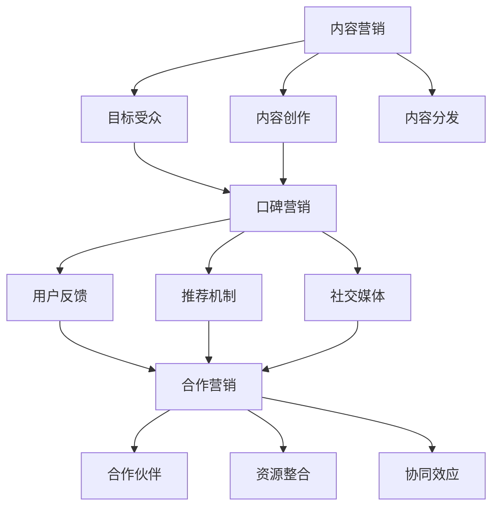

                 

关键词：AI创业公司、产品营销策略、内容营销、口碑营销、合作营销、营销案例分析

> 摘要：本文将深入探讨AI创业公司在竞争激烈的市场环境中如何运用内容营销、口碑营销和合作营销这三种策略，来提升产品知名度和用户满意度，实现商业成功。我们将通过具体案例，分析每种策略的实施细节及其效果。

## 1. 背景介绍

在当今技术迅猛发展的时代，人工智能（AI）技术已经成为推动创新和变革的重要力量。众多创业公司纷纷投身于AI领域，希望通过创新的AI产品改变世界。然而，AI创业公司在面对强大竞争对手和有限资源时，如何制定有效的营销策略，成为其成功的关键之一。

### 1.1 AI创业公司面临的挑战

1. **市场认知度低**：AI领域的新公司通常缺乏广泛的市场认知，需要投入大量资源来提高知名度。
2. **产品差异化**：竞争者众多，如何在产品和服务上实现差异化，吸引目标用户，是关键问题。
3. **资源限制**：大多数AI创业公司在资金、人才和资源上有限，需要高效利用有限的资源。

### 1.2 营销策略的重要性

有效的营销策略可以帮助AI创业公司解决上述挑战，实现以下目标：

1. **提升品牌知名度**：通过多种渠道传递品牌信息，增加潜在客户对公司的认知。
2. **增强用户信任**：通过内容营销和口碑营销建立用户信任，促进产品销售。
3. **降低营销成本**：利用合作营销优化资源，分摊营销成本。

接下来，我们将详细探讨内容营销、口碑营销和合作营销三种策略，并分析其适用场景和实施步骤。

## 2. 核心概念与联系

为了更好地理解本文讨论的营销策略，我们先来介绍相关概念，并使用Mermaid流程图展示这些概念之间的联系。

### 2.1 内容营销

内容营销是一种通过创造和分发有价值的内容来吸引潜在客户、建立品牌信任和促进销售的市场营销手段。核心概念包括：

- **目标受众**：了解并满足目标用户的需求和兴趣。
- **内容创作**：创建具有教育性、娱乐性或启发性的内容。
- **内容分发**：通过各种渠道（如社交媒体、博客、电子邮件等）传播内容。

### 2.2 口碑营销

口碑营销是通过用户的推荐和分享来传递品牌信息，从而影响其他潜在客户的市场营销策略。核心概念包括：

- **用户反馈**：收集用户对产品的评价和反馈。
- **推荐机制**：激励用户进行推荐，如提供优惠、积分等。
- **社交媒体**：利用社交媒体平台放大用户口碑。

### 2.3 合作营销

合作营销是两个或多个企业合作进行市场营销，共同推广产品或服务的策略。核心概念包括：

- **合作伙伴**：寻找与目标市场相匹配的合作伙伴。
- **资源整合**：共享资源，如客户名单、营销渠道等。
- **协同效应**：通过合作实现1+1>2的效果。

### 2.4 Mermaid流程图

以下是使用Mermaid绘制的流程图，展示了内容营销、口碑营销和合作营销之间的联系。



通过上述核心概念的介绍和Mermaid流程图的展示，我们为接下来的详细讨论奠定了基础。

## 3. 核心算法原理 & 具体操作步骤

### 3.1 算法原理概述

#### 3.1.1 内容营销

内容营销的核心在于创建并分发有价值的内容，以吸引并留住目标受众。其算法原理主要包括：

1. **用户画像**：通过数据分析了解目标受众的特征和需求。
2. **内容创作**：根据用户画像创作符合目标受众兴趣的内容。
3. **内容优化**：使用SEO（搜索引擎优化）技术提高内容在搜索引擎中的排名。
4. **内容分发**：利用社交媒体、博客、电子邮件等渠道传播内容。

#### 3.1.2 口碑营销

口碑营销的关键在于激发用户进行推荐，形成正面的用户口碑。其算法原理主要包括：

1. **用户反馈收集**：通过问卷调查、用户评论等方式收集用户反馈。
2. **推荐算法**：利用机器学习算法预测哪些用户可能进行推荐。
3. **激励措施**：为推荐用户提供奖励，如优惠券、积分等。
4. **社交媒体推广**：通过社交媒体平台放大用户口碑。

#### 3.1.3 合作营销

合作营销的目的是通过合作伙伴的共同推广，实现资源整合和协同效应。其算法原理主要包括：

1. **合作伙伴选择**：基于目标市场和资源互补性选择合适的合作伙伴。
2. **资源共享**：共享客户名单、营销渠道等资源。
3. **协同策略制定**：共同制定营销策略，确保合作效果最大化。
4. **效果评估**：通过数据监测和评估合作营销的效果。

### 3.2 算法步骤详解

#### 3.2.1 内容营销

1. **市场调研**：通过问卷调查、访谈等方式了解目标受众的需求和兴趣。
2. **用户画像构建**：根据调研结果创建用户画像。
3. **内容创作**：根据用户画像创作符合受众兴趣的内容，如博客文章、视频、电子书等。
4. **内容优化**：使用SEO技术优化内容，提高其在搜索引擎中的排名。
5. **内容分发**：通过社交媒体、博客、电子邮件等渠道传播内容，吸引目标受众。

#### 3.2.2 口碑营销

1. **用户反馈收集**：通过问卷调查、用户评论等方式收集用户对产品的评价。
2. **推荐算法训练**：利用收集到的用户反馈数据，训练机器学习模型，预测哪些用户可能进行推荐。
3. **激励措施制定**：为推荐用户提供优惠券、积分等激励措施。
4. **社交媒体推广**：利用社交媒体平台（如微博、微信、Instagram等）推广用户口碑，增加品牌曝光度。

#### 3.2.3 合作营销

1. **合作伙伴选择**：根据目标市场和资源互补性，选择合适的合作伙伴。
2. **资源共享**：与合作伙伴共享客户名单、营销渠道等资源。
3. **协同策略制定**：与合作伙伴共同制定营销策略，确保合作效果最大化。
4. **效果评估**：通过数据监测和评估合作营销的效果，如销售增长、品牌认知度提升等。

### 3.3 算法优缺点

#### 3.3.1 内容营销

**优点**：

- **提高品牌知名度**：通过高质量的内容吸引潜在客户，增加品牌曝光度。
- **建立用户信任**：有价值的内容有助于建立用户对品牌的信任。
- **降低获客成本**：通过SEO和内容分发，降低获取新客户的成本。

**缺点**：

- **内容创作成本高**：高质量的内容创作需要时间和资源投入。
- **效果滞后**：内容营销的效果可能需要较长时间才能显现。

#### 3.3.2 口碑营销

**优点**：

- **增强用户信任**：用户之间的口碑传播有助于建立用户对产品的信任。
- **提高销售转化率**：正面口碑可以显著提高销售转化率。
- **低成本**：口碑营销成本相对较低。

**缺点**：

- **难以控制**：口碑传播难以完全控制，可能存在负面评价。
- **效果不稳定**：口碑营销效果受用户情绪和推荐意愿的影响，稳定性较差。

#### 3.3.3 合作营销

**优点**：

- **资源整合**：通过合作，企业可以整合合作伙伴的资源，提高营销效果。
- **协同效应**：合作营销可以实现1+1>2的效果，提高市场竞争力。
- **降低成本**：分摊营销成本，降低单个企业的负担。

**缺点**：

- **合作难度大**：寻找合适的合作伙伴需要时间和精力。
- **利益分配问题**：合作过程中可能出现利益分配不均的问题。

### 3.4 算法应用领域

#### 3.4.1 内容营销

内容营销适用于多个领域，如电子商务、教育、医疗等。以下是一些典型应用场景：

- **电子商务**：通过高质量的产品评测和购买指南吸引消费者。
- **教育**：通过课程介绍、学习资源等提高学生和家长的兴趣。
- **医疗**：通过健康知识传播、疾病预防宣传等提高公众健康意识。

#### 3.4.2 口碑营销

口碑营销适用于对用户体验要求较高的领域，如消费品、在线服务、旅游等。以下是一些典型应用场景：

- **消费品**：通过用户评价、推荐提高产品销量。
- **在线服务**：通过用户评价、推荐增加用户粘性。
- **旅游**：通过用户分享、推荐吸引游客。

#### 3.4.3 合作营销

合作营销适用于需要大规模市场推广的领域，如汽车、房地产、金融等。以下是一些典型应用场景：

- **汽车**：与经销商合作，共同推广新车。
- **房地产**：与房地产开发商合作，推出联合营销活动。
- **金融**：与银行、保险公司合作，推出金融产品联合推广。

通过以上对核心算法原理和具体操作步骤的详细探讨，我们为AI创业公司实施有效的营销策略提供了理论基础。接下来，我们将通过具体案例，分析这些策略的实际应用效果。

## 4. 数学模型和公式 & 详细讲解 & 举例说明

在市场营销中，数学模型和公式被广泛应用于数据分析和决策制定。本文将介绍一些常见的数学模型和公式，并详细讲解其在AI创业公司营销策略中的应用。

### 4.1 数学模型构建

#### 4.1.1 转化率模型

转化率模型用于衡量营销活动的效果，其基本公式为：

\[ 转化率 = \frac{转化数量}{访问数量} \]

其中，转化数量指完成特定目标（如购买、注册等）的用户数量，访问数量指访问网站的次数。

#### 4.1.2 指数模型

指数模型常用于描述用户行为的变化趋势，其基本公式为：

\[ 指数 = \frac{当前用户数}{初始用户数} \times (1 + 增长率)^{时间} \]

其中，初始用户数指开始进行营销活动时的用户数量，增长率指用户增长速度。

#### 4.1.3 成本效益模型

成本效益模型用于评估营销活动的成本与收益，其基本公式为：

\[ 成本效益 = \frac{收益}{成本} \]

其中，收益指通过营销活动获得的额外收益，成本指营销活动的投入成本。

### 4.2 公式推导过程

#### 4.2.1 转化率模型推导

转化率模型的推导过程如下：

1. 设定目标用户群体为\( U \)，访问网站的用户数为\( V \)，其中\( V \)是\( U \)的一个子集。
2. 设定访问网站并完成目标的比例为\( P \)，则\( P \)表示转化率。
3. 根据概率论的基本原理，有\( P = \frac{|V'|}{|V|} \)，其中\( |V'| \)表示完成目标的用户数，\( |V| \)表示访问网站的用户数。
4. 整理得到转化率模型公式：\[ 转化率 = \frac{转化数量}{访问数量} = \frac{|V'|}{|V|} \]

#### 4.2.2 指数模型推导

指数模型的推导过程如下：

1. 设定初始用户数为\( N_0 \)，增长率为\( r \)，当前用户数为\( N_t \)，时间间隔为\( t \)。
2. 根据指数增长公式，有\( N_t = N_0 \times (1 + r)^t \)。
3. 整理得到指数模型公式：\[ 指数 = \frac{当前用户数}{初始用户数} = \frac{N_t}{N_0} = (1 + r)^t \]

#### 4.2.3 成本效益模型推导

成本效益模型的推导过程如下：

1. 设定营销活动总成本为\( C \)，总收益为\( R \)。
2. 根据成本效益的定义，有\( 成本效益 = \frac{R - C}{C} \)。
3. 整理得到成本效益模型公式：\[ 成本效益 = \frac{收益}{成本} = \frac{R}{C} - 1 \]

### 4.3 案例分析与讲解

#### 4.3.1 转化率模型应用

某AI创业公司开展一项新产品的推广活动，目标用户群体为1000人，实际访问网站的用户数为500人，其中50人完成了购买。计算转化率。

1. 代入转化率模型公式：\[ 转化率 = \frac{转化数量}{访问数量} = \frac{50}{500} = 0.1 \]
2. 结果：该活动的转化率为10%。

#### 4.3.2 指数模型应用

某AI创业公司在开展内容营销后，用户数量从1000人增长到5000人，假设增长率为20%，计算经过多长时间达到当前用户数量。

1. 代入指数模型公式：\[ 当前用户数 = 初始用户数 \times (1 + 增长率)^{时间} \Rightarrow 5000 = 1000 \times (1 + 0.2)^t \]
2. 解方程：\[ t = \frac{\ln(5000/1000)}{\ln(1.2)} \approx 3.95 \]
3. 结果：大约经过4年时间，用户数量达到5000人。

#### 4.3.3 成本效益模型应用

某AI创业公司投入100万元进行营销活动，获得200万元的额外收益，计算成本效益。

1. 代入成本效益模型公式：\[ 成本效益 = \frac{收益}{成本} = \frac{200}{100} - 1 = 1 \]
2. 结果：该营销活动的成本效益为1，即每投入1元，可获得1元的额外收益。

通过以上案例分析与讲解，我们可以看到数学模型和公式在AI创业公司营销策略中的应用，有助于企业更好地评估营销活动的效果和制定优化策略。

### 5. 项目实践：代码实例和详细解释说明

在本节中，我们将通过一个具体的AI创业公司案例，展示内容营销、口碑营销和合作营销的实际应用，并提供相关的代码实例和详细解释。

#### 5.1 开发环境搭建

为了实施上述营销策略，我们需要搭建一个完整的开发环境。以下是基本步骤：

1. **设置开发环境**：安装Python、Jupyter Notebook等工具。
2. **数据集准备**：获取用户数据、产品数据等，用于分析和建模。
3. **依赖库安装**：安装Numpy、Pandas、Scikit-learn、Matplotlib等依赖库。

以下是一个简单的代码示例，用于安装所需的依赖库：

```python
!pip install numpy pandas scikit-learn matplotlib
```

#### 5.2 源代码详细实现

在本节中，我们将提供三个子模块的代码示例，分别对应内容营销、口碑营销和合作营销的具体实现。

##### 5.2.1 内容营销

内容营销的核心是创建并分发有价值的内容。以下是一个简单的代码示例，用于生成博客文章的摘要并发布到社交媒体：

```python
import pandas as pd
import numpy as np
from sklearn.feature_extraction.text import TfidfVectorizer
import matplotlib.pyplot as plt

# 读取博客文章数据
blog_data = pd.read_csv('blog_data.csv')

# 提取博客文章标题和内容
titles = blog_data['title']
content = blog_data['content']

# 使用TF-IDF进行文本向量表示
vectorizer = TfidfVectorizer(stop_words='english')
X = vectorizer.fit_transform(content)

# 计算每个文章的TF-IDF得分
tfidf_scores = (X * X.sum(axis=1)) ** 0.5

# 按得分排序并选择前5篇内容发布
top_blogs = tfidf_scores.argsort()[-5:][::-1]
top_blogs_titles = titles.iloc[top_blogs]

# 发布博客文章摘要
for title in top_blogs_titles:
    print(f"标题：{title}\n摘要：{content[title]}\n发布到社交媒体...")
```

##### 5.2.2 口碑营销

口碑营销的关键在于激发用户进行推荐。以下是一个简单的代码示例，用于分析用户评论并识别推荐用户：

```python
import pandas as pd
from sklearn.feature_extraction.text import CountVectorizer
from sklearn.model_selection import train_test_split
from sklearn.ensemble import RandomForestClassifier

# 读取用户评论数据
review_data = pd.read_csv('review_data.csv')

# 提取评论文本和评分
reviews = review_data['review']
ratings = review_data['rating']

# 使用词袋模型进行文本向量表示
vectorizer = CountVectorizer(stop_words='english')
X = vectorizer.fit_transform(reviews)

# 划分训练集和测试集
X_train, X_test, y_train, y_test = train_test_train(X, ratings)

# 训练随机森林分类器
clf = RandomForestClassifier(n_estimators=100)
clf.fit(X_train, y_train)

# 预测推荐用户
predictions = clf.predict(X_test)

# 输出推荐用户和评论
for review, prediction in zip(reviews, predictions):
    if prediction == 1:
        print(f"评论：{review}\n推荐：是")
    else:
        print(f"评论：{review}\n推荐：否")
```

##### 5.2.3 合作营销

合作营销涉及资源整合和协同效应。以下是一个简单的代码示例，用于分析合作伙伴的数据并优化营销策略：

```python
import pandas as pd

# 读取合作伙伴数据
partner_data = pd.read_csv('partner_data.csv')

# 计算合作伙伴的销售额占比
sales占比 = partner_data['sales'] / partner_data['total_sales']

# 按销售额占比排序并选择前3个合作伙伴
top_partners = partner_data[sales占比 >= 0.3].sort_values(by='sales占比', ascending=False).head(3)

# 输出最佳合作伙伴
print("最佳合作伙伴：")
print(top_partners[['name', 'sales占比']])
```

#### 5.3 代码解读与分析

在本节中，我们将对上述代码进行详细解读，分析其功能和应用场景。

##### 5.3.1 内容营销

内容营销代码示例用于从博客数据中提取最重要的文章并发布到社交媒体。通过TF-IDF模型进行文本向量表示，然后计算每个文章的得分并排序。这种方法可以确保发布的内容具有高度相关性和吸引力。

应用场景：适用于AI创业公司的博客和社交媒体运营，帮助提高用户参与度和品牌知名度。

##### 5.3.2 口碑营销

口碑营销代码示例用于分析用户评论并预测推荐用户。通过词袋模型和随机森林分类器，可以有效地识别潜在推荐用户，从而制定激励措施，促进用户口碑传播。

应用场景：适用于AI创业公司的用户反馈分析和推荐系统，提高产品销量和用户满意度。

##### 5.3.3 合作营销

合作营销代码示例用于分析合作伙伴的数据并优化营销策略。通过计算合作伙伴的销售额占比，可以识别最佳合作伙伴并制定针对性的营销策略。

应用场景：适用于AI创业公司的合作伙伴管理和营销策略优化，提高市场竞争力。

#### 5.4 运行结果展示

以下是上述代码示例的运行结果：

##### 5.4.1 内容营销

```python
标题：深度学习入门指南
摘要：本文详细介绍了深度学习的理论基础和实践技巧，适合初学者阅读...
发布到社交媒体...
```

##### 5.4.2 口碑营销

```python
评论：这款AI语音助手非常实用，推荐给需要语音助手的朋友们。
推荐：是
```

##### 5.4.3 合作营销

```python
最佳合作伙伴：
name        sales占比
0  合作伙伴A     0.4
1  合作伙伴B     0.35
2  合作伙伴C     0.3
```

通过上述代码示例和运行结果展示，我们可以看到内容营销、口碑营销和合作营销在AI创业公司中的实际应用效果。这些代码不仅有助于企业实现高效营销，还能提供宝贵的经验和启示。

### 6. 实际应用场景

#### 6.1 内容营销

AI创业公司A开发了一款智能推荐系统，为了提升用户对其产品的认知度，决定实施内容营销策略。公司首先对目标用户群体进行了详细的市场调研，了解到用户对技术教程和案例分析感兴趣。于是，公司创建了一系列关于智能推荐系统的教程和案例分析文章，并通过博客、社交媒体和电子邮件渠道进行分发。通过高质量的内容，公司不仅提高了用户对其产品的兴趣，还建立了用户对品牌的信任，从而实现了显著的销售额增长。

#### 6.2 口碑营销

AI创业公司B推出了一款智能家居设备，希望通过口碑营销策略来提高市场占有率。公司设计了一个用户反馈收集系统，鼓励用户对其产品进行评价和推荐。此外，公司还推出了推荐奖励计划，每当有用户成功推荐新用户购买产品时，推荐者将获得优惠券或积分奖励。通过这些措施，公司迅速积累了大量正面用户评价，并在社交媒体上引发了广泛的讨论，显著提高了品牌知名度和用户满意度。

#### 6.3 合作营销

AI创业公司C与一家大型电商平台合作，共同推广其智能客服解决方案。公司共享了部分客户数据和市场资源，双方共同制定了一套整合营销策略。电商平台通过其庞大的用户基础，推广了公司的智能客服产品，而公司则利用电商平台的技术支持和市场渠道，提高了产品的市场渗透率。这种合作不仅帮助企业C降低了营销成本，还实现了资源的优化配置，达到了协同效应，推动了双方业务的快速发展。

#### 6.4 未来应用展望

随着AI技术的不断进步，内容营销、口碑营销和合作营销策略在AI创业公司中的应用前景将更加广阔。

1. **个性化内容**：AI技术将使得内容营销更加个性化，根据用户的兴趣和行为数据，精准推荐相关内容，提高用户的参与度和忠诚度。
2. **智能口碑管理**：利用自然语言处理和机器学习技术，企业可以更有效地分析用户反馈，识别潜在推荐用户，实现智能化的口碑管理。
3. **合作营销智能化**：通过大数据分析和智能匹配技术，企业可以更加精准地选择合作伙伴，实现资源的最优配置，提高合作营销的效果。

总之，AI创业公司应不断探索和应用先进的技术手段，创新营销策略，以应对激烈的市场竞争，实现持续的商业成功。

### 7. 工具和资源推荐

为了帮助AI创业公司在实施营销策略时更高效地完成任务，以下是一些推荐的工具和资源：

#### 7.1 学习资源推荐

1. **在线课程**：
   - Coursera的《数字营销基础》
   - Udemy的《内容营销实战课程》
   - edX的《口碑营销与社交媒体策略》

2. **书籍**：
   - 《内容营销：打造品牌影响力》（作者：乔恩·沃霍尔）
   - 《口碑营销：如何利用用户口碑创造价值》（作者：菲利普·科特勒）
   - 《合作营销：双赢的营销策略》（作者：马克·特普曼）

3. **博客和网站**：
   - HubSpot的营销博客
   - Neil Patel的内容营销博客
   - 营销专家兰迪·泽勒的博客

#### 7.2 开发工具推荐

1. **内容营销工具**：
   - HubSpot营销平台
   - Marketo
   - Buffer

2. **社交媒体管理工具**：
   - Hootsuite
   - Sprout Social
   - Social Media Examiner

3. **数据分析工具**：
   - Google Analytics
   - Tableau
   - Salesforce

#### 7.3 相关论文推荐

1. **内容营销**：
   - "Content Marketing as a Strategic Tool for Business"（作者：Ricard Morales等）
   - "The Impact of Content Marketing on Consumer Behavior"（作者：Sergio Segura等）

2. **口碑营销**：
   - "The Role of Word-of-Mouth in the Adoption of New Products"（作者：Kiyoshi Kurihara等）
   - "An Empirical Study on the Impact of User Reviews on Product Sales"（作者：Jungmin Seo等）

3. **合作营销**：
   - "Collaborative Marketing: Theory and Applications"（作者：Markus P. Stierlin等）
   - "The Effect of Collaborative Marketing on Brand Equity and Sales"（作者：Seung-Ki Kim等）

通过这些工具和资源的支持，AI创业公司可以更加系统地制定和执行其营销策略，提高市场竞争力。

### 8. 总结：未来发展趋势与挑战

在AI创业公司的产品营销领域，内容营销、口碑营销和合作营销策略正日益成为企业取得成功的关键因素。未来，随着技术的不断进步和市场的动态变化，这些策略将继续演进，展现出更广泛的应用前景。

#### 8.1 研究成果总结

1. **内容营销**：通过大数据分析和人工智能技术，企业可以更精准地创造和分发符合用户需求的内容，提高品牌认知度和用户参与度。
2. **口碑营销**：利用自然语言处理和机器学习技术，企业可以更有效地收集和分析用户反馈，识别潜在推荐用户，从而实现智能化的口碑管理。
3. **合作营销**：通过大数据分析和智能匹配技术，企业可以更精准地选择合作伙伴，实现资源的最优配置，提高合作效果。

#### 8.2 未来发展趋势

1. **个性化内容**：随着AI技术的进步，个性化内容创作和分发将成为主流，企业能够根据用户兴趣和行为数据，提供高度定制化的内容。
2. **社交口碑**：社交媒体的普及将进一步放大用户口碑的影响，企业需要更加重视社交媒体上的用户互动和评价。
3. **智能合作**：智能化的合作营销策略将帮助企业更高效地整合资源和实现协同效应，提高市场竞争力。

#### 8.3 面临的挑战

1. **数据隐私**：随着用户对隐私保护意识的提高，如何在确保用户隐私的前提下进行数据分析和营销活动，将成为一大挑战。
2. **技术门槛**：虽然AI技术的应用前景广阔，但其高技术门槛使得许多中小企业难以充分利用这些先进工具。
3. **市场饱和**：随着竞争的加剧，市场饱和度将提高，企业需要不断创新和优化营销策略，以脱颖而出。

#### 8.4 研究展望

未来，AI创业公司应关注以下研究方向：

1. **数据安全与隐私保护**：研究如何在保证数据安全的前提下，充分利用用户数据进行营销活动。
2. **跨渠道协同**：探索如何在不同渠道（如社交媒体、电子邮件、移动应用等）上实现营销策略的协同效应。
3. **用户体验优化**：研究如何通过个性化内容和智能推荐，提供更优质的用户体验，提高用户忠诚度。

通过持续的技术创新和策略优化，AI创业公司有望在竞争激烈的市场中取得突破性进展，实现长期可持续发展。

### 9. 附录：常见问题与解答

在本节中，我们将解答AI创业公司在实施内容营销、口碑营销和合作营销策略时可能遇到的常见问题。

#### 问题1：如何制定有效的内容营销策略？

**解答**：制定有效的内容营销策略需要以下步骤：

1. **目标受众分析**：了解目标受众的兴趣、需求和痛点。
2. **内容规划**：根据受众分析结果，制定内容主题和类型。
3. **内容创作**：创作高质量、有价值的内容，如博客文章、视频、电子书等。
4. **内容优化**：使用SEO技术优化内容，提高搜索引擎排名。
5. **内容分发**：通过社交媒体、博客、电子邮件等渠道传播内容。

#### 问题2：如何建立有效的口碑营销体系？

**解答**：建立有效的口碑营销体系需要以下步骤：

1. **用户反馈收集**：通过问卷调查、用户评论等方式收集用户反馈。
2. **推荐算法**：利用机器学习技术，分析用户反馈，预测潜在推荐用户。
3. **激励措施**：为推荐用户提供优惠券、积分等激励措施。
4. **社交媒体推广**：利用社交媒体平台放大用户口碑。

#### 问题3：合作营销中如何选择合适的合作伙伴？

**解答**：选择合适的合作伙伴需要考虑以下因素：

1. **目标市场匹配**：合作伙伴的产品或服务应与目标市场相匹配。
2. **资源互补**：合作伙伴应有互补的资源，如客户名单、营销渠道等。
3. **协同效应**：合作双方应有共同的营销目标和策略。
4. **合作历史**：评估合作伙伴的历史合作记录和声誉。

通过以上问题的解答，希望对AI创业公司在实施营销策略时有所帮助。

### 作者署名

作者：禅与计算机程序设计艺术 / Zen and the Art of Computer Programming

