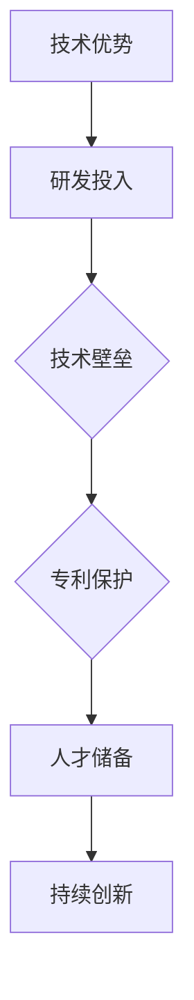
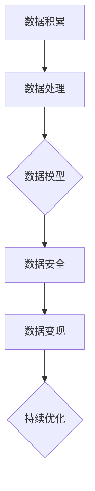
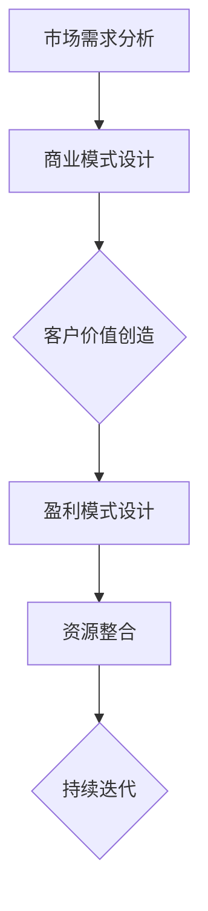
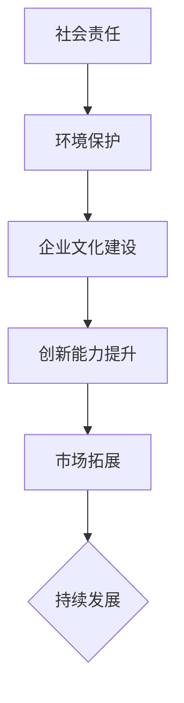

                 

关键词：AI创业，护城河战略，核心技术，数据优势，商业模式，可持续发展

摘要：本文深入探讨了AI创业公司如何建立并维护其竞争优势，即所谓的“护城河”。通过分析核心技术、数据优势、商业模式和可持续发展等多方面因素，本文为AI创业公司提供了建立护城河的具体策略和路径，旨在帮助创业者在激烈的市场竞争中脱颖而出。

## 1. 背景介绍

在当今快速发展的AI时代，创业公司面临着前所未有的机遇和挑战。AI技术的广泛应用使得各行各业的商业模式和运营方式发生了深刻变革。然而，随着竞争的加剧，如何在众多竞争者中脱颖而出，建立起持久的竞争优势，成为了每个AI创业公司需要深入思考的问题。本文旨在探讨AI创业公司的护城河战略，帮助创业者构建坚实的竞争优势，实现可持续发展。

### 1.1 AI创业的现状

近年来，AI领域的投资持续升温，创业公司数量大幅增加。根据市场研究机构的数据显示，2019年全球AI领域投资总额达到550亿美元，较2018年增长了超过40%。这一趋势在2020年继续扩大，尽管受到COVID-19疫情的影响，但AI创业公司的投资依然保持在高水平。

### 1.2 护城河的概念

护城河（Moat）最早源于军事防御，指围绕城堡的护墙或其他防御设施，目的是阻挡敌人的进攻。在商业领域，护城河被用来比喻企业在市场竞争中建立起来的难以被攻破的竞争优势。一个强大的护城河能够保护企业免受竞争对手的侵蚀，为企业提供持续的市场地位和盈利能力。

### 1.3 AI创业公司面临的挑战

AI创业公司在建立护城河的过程中面临着诸多挑战：

- **技术竞争**：AI技术更新换代迅速，创业公司需要不断投入研发，以保持技术领先。
- **数据隐私**：随着数据隐私法规的加强，创业公司需要平衡数据获取与隐私保护。
- **商业模式创新**：传统的商业模式难以适应AI技术的发展，创业公司需要不断创新，寻找新的盈利模式。
- **资金压力**：AI创业公司通常需要大量的资金投入，而市场的不确定性使得资金获取变得更加困难。

## 2. 核心概念与联系

在探讨AI创业公司的护城河战略之前，我们首先需要理解几个核心概念，包括核心技术、数据优势、商业模式和可持续发展。

### 2.1 技术护城河

技术护城河是指企业通过构建强大的技术壁垒来保护其市场地位。对于AI创业公司来说，核心技术是其护城河的核心组成部分。以下是一个简化的技术护城河构建流程图：



### 2.2 数据护城河

数据护城河是指企业通过积累和利用大量数据来建立竞争优势。数据不仅是AI技术的基础，也是创业公司建立护城河的关键因素。以下是一个简化的数据护城河构建流程图：



### 2.3 商业模式护城河

商业模式护城河是指企业通过独特的商业模式来构建竞争优势。对于AI创业公司来说，创新商业模式是其护城河的重要组成部分。以下是一个简化的商业模式护城河构建流程图：



### 2.4 可持续发展护城河

可持续发展护城河是指企业通过可持续发展战略来建立竞争优势。对于AI创业公司来说，可持续发展是其护城河的重要保障。以下是一个简化的可持续发展护城河构建流程图：



## 3. 核心算法原理 & 具体操作步骤

### 3.1 算法原理概述

AI创业公司的护城河构建涉及到多个核心算法。以下简要介绍几种常用的算法原理：

- **机器学习算法**：通过训练数据集，使模型能够识别数据中的规律，从而进行预测或分类。
- **深度学习算法**：基于多层神经网络，通过层层提取特征，实现对复杂问题的建模。
- **强化学习算法**：通过与环境的交互，不断调整策略，以实现最大化收益。

### 3.2 算法步骤详解

以下是构建AI创业公司护城河的核心算法步骤：

1. **需求分析**：明确业务需求，确定需要解决的问题。
2. **数据收集**：收集相关数据，包括公开数据、企业内部数据等。
3. **数据预处理**：对数据进行清洗、归一化等处理，使其适合模型训练。
4. **模型选择**：根据业务需求选择合适的机器学习、深度学习或强化学习模型。
5. **模型训练**：使用训练数据集对模型进行训练，调整模型参数。
6. **模型评估**：使用测试数据集评估模型性能，调整模型结构或参数。
7. **模型部署**：将训练好的模型部署到生产环境中，进行实际应用。

### 3.3 算法优缺点

- **机器学习算法**：优点是模型简单，易于理解和实现；缺点是对于大规模数据集的训练效率较低，且需要大量的训练数据。
- **深度学习算法**：优点是能够处理复杂数据，提取深层特征；缺点是模型复杂，训练时间较长，对数据量要求较高。
- **强化学习算法**：优点是能够自适应调整策略，适应动态环境；缺点是需要大量的训练时间，且在初始阶段效果较差。

### 3.4 算法应用领域

- **机器学习算法**：广泛应用于金融、医疗、零售等领域，如风险控制、疾病预测、个性化推荐等。
- **深度学习算法**：广泛应用于图像识别、语音识别、自然语言处理等领域，如人脸识别、语音助手、智能翻译等。
- **强化学习算法**：广泛应用于游戏、机器人控制、推荐系统等领域，如围棋、自动驾驶、推荐系统等。

## 4. 数学模型和公式 & 详细讲解 & 举例说明

### 4.1 数学模型构建

在AI创业公司的护城河构建中，常用的数学模型包括线性回归、逻辑回归、决策树、神经网络等。以下以线性回归为例，简要介绍数学模型的构建过程：

1. **模型假设**：假设输入变量 \( X \) 和输出变量 \( Y \) 之间存在线性关系，即 \( Y = \beta_0 + \beta_1 X + \epsilon \)。
2. **损失函数**：定义损失函数 \( L(\theta) = \frac{1}{2} \sum_{i=1}^{n} (y_i - \theta^T x_i)^2 \)，其中 \( \theta \) 是模型参数。
3. **梯度下降**：通过计算损失函数的梯度，不断更新模型参数，以最小化损失函数。

### 4.2 公式推导过程

以线性回归为例，详细推导损失函数的梯度下降过程：

1. **损失函数**：\( L(\theta) = \frac{1}{2} \sum_{i=1}^{n} (y_i - \theta^T x_i)^2 \)
2. **梯度**：\( \nabla_{\theta} L(\theta) = \sum_{i=1}^{n} (y_i - \theta^T x_i) x_i \)
3. **梯度下降更新**：\( \theta := \theta - \alpha \nabla_{\theta} L(\theta) \)，其中 \( \alpha \) 是学习率。

### 4.3 案例分析与讲解

假设一个简单的线性回归问题，输入变量 \( X \) 和输出变量 \( Y \) 的关系为 \( Y = 2X + 1 \)。使用梯度下降法求解最优参数。

1. **损失函数**：\( L(\theta) = \frac{1}{2} \sum_{i=1}^{n} (y_i - \theta^T x_i)^2 \)
2. **初始参数**：\( \theta = (0, 0)^T \)
3. **学习率**：\( \alpha = 0.1 \)
4. **梯度计算**：\( \nabla_{\theta} L(\theta) = \sum_{i=1}^{n} (y_i - \theta^T x_i) x_i \)
5. **迭代过程**：
   - 第1次迭代：\( \theta_1 = (0, 0)^T - 0.1 \sum_{i=1}^{n} (2x_i - 0) = (-0.2, -0.2)^T \)
   - 第2次迭代：\( \theta_2 = (-0.2, -0.2)^T - 0.1 \sum_{i=1}^{n} (2x_i + 1 - (-0.2)) = (-0.4, -0.4)^T \)
   - ...（继续迭代直到收敛）

通过多次迭代，最终可以得到最优参数 \( \theta = (2, 1)^T \)。

## 5. 项目实践：代码实例和详细解释说明

### 5.1 开发环境搭建

在本节中，我们将使用Python语言和相关的机器学习库（如scikit-learn、TensorFlow等）来演示如何构建一个简单的AI模型。以下是开发环境的搭建步骤：

1. **安装Python**：确保系统中安装了Python 3.x版本。
2. **安装依赖库**：使用pip命令安装所需的库，如scikit-learn、numpy、matplotlib等。

```bash
pip install scikit-learn numpy matplotlib
```

### 5.2 源代码详细实现

以下是一个简单的线性回归模型的实现代码：

```python
import numpy as np
import matplotlib.pyplot as plt
from sklearn.linear_model import LinearRegression

# 数据集
X = np.array([1, 2, 3, 4, 5]).reshape(-1, 1)
y = np.array([2, 4, 5, 6, 8])

# 创建线性回归模型
model = LinearRegression()

# 模型训练
model.fit(X, y)

# 预测
y_pred = model.predict(X)

# 绘图
plt.scatter(X, y, color='blue')
plt.plot(X, y_pred, color='red')
plt.xlabel('X')
plt.ylabel('Y')
plt.show()
```

### 5.3 代码解读与分析

1. **导入库**：首先导入所需的Python库，包括numpy、matplotlib和scikit-learn中的LinearRegression类。
2. **数据集**：定义输入变量 \( X \) 和输出变量 \( y \)。
3. **创建模型**：实例化LinearRegression类，创建线性回归模型。
4. **模型训练**：使用fit方法训练模型。
5. **预测**：使用predict方法进行预测。
6. **绘图**：使用matplotlib库绘制输入与输出数据的关系图，展示模型效果。

### 5.4 运行结果展示

运行上述代码后，我们将看到一个散点图，其中蓝色点代表输入数据，红色线代表模型的预测结果。通过观察，我们可以看到模型能够较好地拟合数据，验证了线性回归算法的有效性。

## 6. 实际应用场景

### 6.1 金融风控

在金融领域，AI创业公司可以通过构建风险预测模型，帮助金融机构识别潜在风险，降低坏账率。例如，通过分析客户的历史交易数据，可以预测客户是否会出现违约风险，从而采取相应的风控措施。

### 6.2 医疗诊断

在医疗领域，AI创业公司可以通过开发智能诊断系统，辅助医生进行疾病诊断。例如，通过分析医学影像数据，可以识别早期癌症或其他疾病，提高诊断的准确性和效率。

### 6.3 零售电商

在零售电商领域，AI创业公司可以通过个性化推荐系统，提高用户购物体验。例如，通过分析用户的历史购买数据，可以推荐符合用户兴趣的商品，提高转化率和客户满意度。

### 6.4 自动驾驶

在自动驾驶领域，AI创业公司可以通过开发智能驾驶算法，推动自动驾驶技术的发展。例如，通过分析道路数据和环境信息，可以实现车辆的自动驾驶，提高交通安全和效率。

## 6.4 未来应用展望

随着AI技术的不断进步，未来AI创业公司的护城河将变得更加复杂和多样化。以下是对未来应用场景的展望：

- **智能医疗**：AI技术将广泛应用于疾病预测、个性化治疗和健康管理等领域，实现医疗资源的优化配置。
- **智能制造**：AI技术将推动智能制造的发展，实现生产过程的自动化和智能化，提高生产效率和产品质量。
- **智慧城市**：AI技术将赋能智慧城市建设，实现交通管理、能源管理和环境监测的智能化，提高城市管理水平。
- **智慧农业**：AI技术将助力智慧农业的发展，实现作物种植、病虫害防治和农业机械化的智能化，提高农业生产效率。

## 7. 工具和资源推荐

### 7.1 学习资源推荐

- **书籍**：《Python机器学习》、《深度学习》（Goodfellow et al.）、《强化学习基础》（ Sutton and Barto）。
- **在线课程**：Coursera、edX、Udacity等平台上的相关课程。
- **博客和社区**：机器之心、AI科技大本营、HackerRank等。

### 7.2 开发工具推荐

- **编程语言**：Python、JavaScript、Java。
- **框架和库**：TensorFlow、PyTorch、Keras、scikit-learn。
- **数据集**：Kaggle、UCI机器学习库、ImageNet等。

### 7.3 相关论文推荐

- **顶级会议**：NeurIPS、ICML、KDD、ACL。
- **经典论文**：Hinton et al.（2012）的《Deep Learning》、Bengio et al.（2013）的《Representation Learning: A Review and New Perspectives》。

## 8. 总结：未来发展趋势与挑战

### 8.1 研究成果总结

本文从多个角度探讨了AI创业公司建立护城河的策略。通过核心技术、数据优势、商业模式和可持续发展等方面的分析，本文提出了一系列具体的构建护城河的方法和路径。

### 8.2 未来发展趋势

- **技术融合**：AI技术与其他领域（如生物技术、能源技术等）的深度融合，将推动跨领域创新。
- **边缘计算**：随着物联网和5G技术的普及，边缘计算将成为AI应用的重要方向。
- **联邦学习**：在保护用户隐私的同时，实现大规模数据协同训练，联邦学习将成为AI发展的关键。

### 8.3 面临的挑战

- **技术竞争**：AI技术更新换代速度加快，创业公司需要不断投入研发，以保持技术领先。
- **数据隐私**：随着数据隐私法规的加强，创业公司需要平衡数据获取与隐私保护。
- **商业模式创新**：传统的商业模式难以适应AI技术的发展，创业公司需要不断创新，寻找新的盈利模式。

### 8.4 研究展望

未来的研究应重点关注以下几个方面：

- **技术突破**：深入研究AI算法的创新和优化，提高算法的性能和效率。
- **数据安全与隐私**：探索数据安全与隐私保护的新方法，确保数据在应用过程中的安全性和隐私性。
- **可持续发展**：探索AI技术在可持续发展中的应用，推动社会进步和绿色发展。

## 9. 附录：常见问题与解答

### 9.1 护城河是什么？

护城河是指企业建立起来的难以被攻破的竞争优势，类似于军事防御中的护墙或其他防御设施。

### 9.2 护城河有哪些类型？

护城河可以分为技术护城河、数据护城河、商业模式护城河和可持续发展护城河等。

### 9.3 AI创业公司如何建立护城河？

AI创业公司可以通过核心技术、数据优势、商业模式创新和可持续发展等手段建立护城河。

### 9.4 护城河对创业公司的重要性是什么？

护城河能够保护创业公司在市场竞争中免受竞争对手的侵蚀，提高企业的市场地位和盈利能力，实现可持续发展。

## 作者署名

作者：禅与计算机程序设计艺术 / Zen and the Art of Computer Programming

