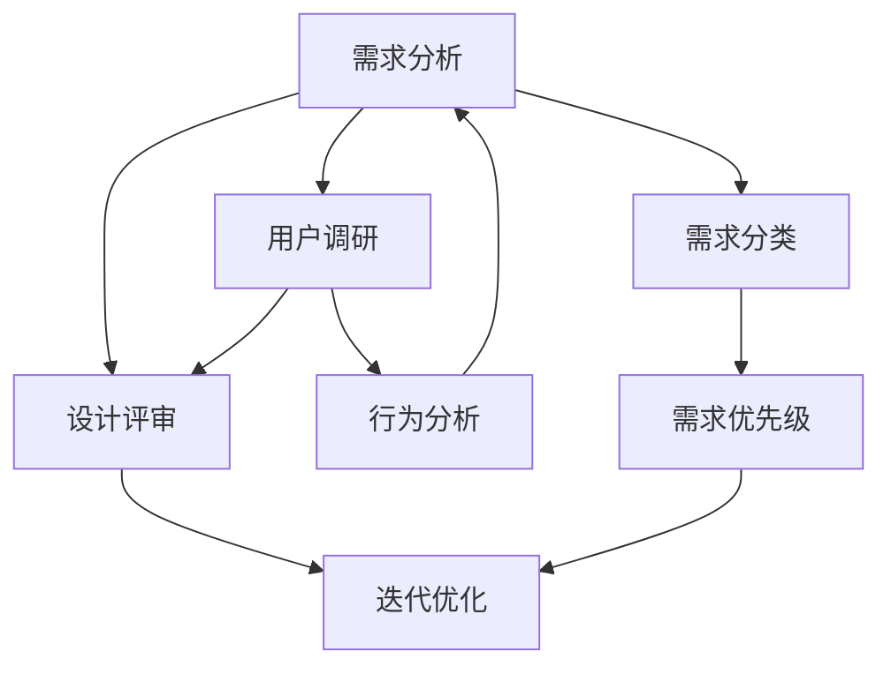

                 

 作为一位世界级人工智能专家，我深知用户体验在AI创业公司中的重要性。一个良好的用户体验设计流程不仅能够提高用户满意度，还能显著提升产品竞争力。本文将深入探讨AI创业公司在用户体验设计流程优化中的关键步骤，包括需求分析、设计评审与迭代优化，以帮助初创企业打造出用户喜爱的产品。

## 关键词

- AI创业公司
- 用户体验设计
- 需求分析
- 设计评审
- 迭代优化

## 摘要

本文旨在为AI创业公司提供一套完善的用户体验设计流程优化方案。通过详细阐述需求分析、设计评审与迭代优化的具体方法，本文帮助初创企业了解如何有效地把握用户需求，打造出符合用户期望的产品。通过本文的指导，AI创业公司可以提升用户体验，增强产品市场竞争力。

## 1. 背景介绍

随着人工智能技术的快速发展，AI创业公司如雨后春笋般涌现。这些初创企业面临着激烈的竞争环境，如何为用户提供出色的产品体验成为了它们成功的关键。用户体验设计（User Experience Design，简称UXD）是产品设计和开发中至关重要的一环。它关注用户在使用产品过程中的感受和体验，通过优化用户界面、提高操作便捷性、增强交互体验等手段，提升用户满意度和忠诚度。

然而，AI创业公司在用户体验设计方面往往面临诸多挑战。一方面，技术复杂性使得设计团队难以全面理解用户需求；另一方面，市场竞争激烈，产品迭代速度快，设计流程的优化显得尤为关键。因此，如何构建一个高效、灵活的体验设计流程，成为了AI创业公司亟需解决的问题。

本文将从以下三个方面展开讨论：

1. **需求分析**：介绍如何进行用户需求调研，分析用户行为和需求，为设计提供坚实基础。
2. **设计评审**：探讨设计评审的目的、方法和技巧，确保设计方案的可行性和有效性。
3. **迭代优化**：讲述如何通过持续迭代和优化，不断提升用户体验，保持产品竞争力。

通过本文的阐述，希望为AI创业公司提供一套切实可行的用户体验设计流程优化方案，助力其在竞争激烈的市场中脱颖而出。

## 2. 核心概念与联系

### 2.1 用户体验设计

用户体验设计（User Experience Design，简称UXD）是一种以用户为中心的设计方法，关注用户在使用产品或服务过程中的感受和体验。UXD不仅关注产品的外观和操作便捷性，还涉及到用户的心理感受、情感反应和满意度。用户体验设计的目标是通过优化产品交互设计、界面布局和功能实现，为用户提供愉悦、高效、便捷的使用体验。

### 2.2 需求分析

需求分析是用户体验设计流程中的关键步骤，旨在深入了解用户需求，为产品设计提供基础。需求分析包括用户调研、行为分析、需求分类和优先级排序等内容。通过需求分析，设计团队可以明确用户的核心需求，为设计提供明确的指导。

### 2.3 设计评审

设计评审是确保设计方案可行性和有效性的关键环节。通过设计评审，设计团队可以及时发现和解决设计中的问题，确保设计方案符合用户需求和业务目标。设计评审包括评审会议、评审标准和评审方法等内容。

### 2.4 迭代优化

迭代优化是一种持续改进的设计方法，通过不断地迭代和优化，不断提升用户体验。迭代优化包括迭代计划、迭代执行、评估和反馈等环节。通过迭代优化，设计团队可以快速响应市场变化和用户需求，保持产品竞争力。

### 2.5 Mermaid流程图



### 2.6 核心概念联系

用户体验设计、需求分析、设计评审和迭代优化是相互关联的核心概念。用户体验设计是整个流程的起点，通过需求分析和设计评审，设计团队可以明确用户需求和设计方向；迭代优化则是在实际开发过程中，通过持续改进，不断提升用户体验。

## 3. 核心算法原理 & 具体操作步骤

### 3.1 算法原理概述

用户体验设计流程优化的核心算法原理是基于用户研究和数据分析。通过用户调研、行为分析和需求分析，设计团队可以获取用户反馈和数据，从而指导设计方案的制定和优化。

### 3.2 算法步骤详解

#### 3.2.1 需求分析

1. 用户调研：通过问卷调查、用户访谈、用户观察等方法，了解用户的需求和痛点。
2. 行为分析：分析用户在使用产品过程中的行为数据，如使用频率、使用时长、操作路径等。
3. 需求分类：将收集到的需求进行分类，如功能需求、性能需求、安全性需求等。
4. 需求优先级排序：根据用户需求和业务目标，对需求进行优先级排序。

#### 3.2.2 设计评审

1. 评审会议：组织设计评审会议，邀请相关团队成员和利益相关者参与。
2. 评审标准：制定评审标准，如用户体验、功能实现、技术可行性等。
3. 评审方法：采用头脑风暴、原型评审、A/B测试等方法，对设计方案进行评估。

#### 3.2.3 迭代优化

1. 迭代计划：制定迭代计划，确定每次迭代的范围和时间。
2. 迭代执行：按照迭代计划，进行设计和开发工作。
3. 评估和反馈：对每次迭代的结果进行评估，收集用户反馈，指导后续迭代优化。

### 3.3 算法优缺点

#### 优点

1. 提高用户体验：通过用户研究和数据分析，设计团队可以更准确地把握用户需求，提高产品满意度。
2. 快速响应市场变化：迭代优化方法使得设计团队能够快速适应市场变化和用户需求。
3. 降低风险：设计评审和迭代优化能够及时发现和解决设计中的问题，降低项目风险。

#### 缺点

1. 需要大量时间投入：用户研究和数据分析需要大量的时间和人力成本。
2. 可能导致过度设计：在追求完美的过程中，设计团队可能陷入过度设计的陷阱。

### 3.4 算法应用领域

用户体验设计流程优化方法适用于各种类型的AI创业公司，尤其是那些需要快速响应市场变化和用户需求的初创企业。无论是在产品原型设计阶段，还是在产品上线后的持续迭代过程中，该方法都能发挥重要作用。

## 4. 数学模型和公式 & 详细讲解 & 举例说明

### 4.1 数学模型构建

用户体验设计流程优化的数学模型主要包括以下几个方面：

1. 用户满意度模型
2. 需求优先级模型
3. 迭代优化模型

#### 4.1.1 用户满意度模型

用户满意度模型用于评估产品或服务的用户满意度。一个常用的用户满意度模型是Net Promoter Score（NPS），其计算公式如下：

\[ NPS = \frac{(\text{推荐者分数} - \text{贬损者分数}) \times 100}{\text{总样本数}} \]

其中，推荐者分数和贬损者分数分别表示用户对产品或服务的满意度评分。评分范围通常在0-10之间，推荐者分数通常为9-10，贬损者分数通常为0-6。

#### 4.1.2 需求优先级模型

需求优先级模型用于确定需求的优先级。一个常用的需求优先级模型是MoSCoW模型，它将需求分为四个优先级：

- **M（必须要有）**：对产品功能或特性是必不可少的，没有这些功能或特性，产品无法使用。
- **S（应该有）**：对产品功能或特性是非常重要的，但如果没有这些功能或特性，产品仍然可以使用。
- **C（可以有一定）**：对产品功能或特性是有益的，但如果没有这些功能或特性，产品仍然可以接受。
- **W（如果有更好）**：对产品功能或特性是锦上添花的，但如果没有这些功能或特性，产品仍然可以正常使用。

#### 4.1.3 迭代优化模型

迭代优化模型用于指导产品的持续迭代和优化。一个常用的迭代优化模型是Kano模型，它根据用户对功能的满意度将功能分为五个等级：

- **必备功能（Must-be）**：用户期望的功能，没有这些功能，用户无法接受。
- **期望功能（One-dimensional）**：用户期望的功能，功能实现程度直接影响用户满意度。
- **吸引功能（Attractive）**：超出用户期望的功能，能够提升用户满意度。
- **无差功能（Indifferent）**：用户对功能实现程度不关心的功能。
- **反向功能（Reverse）**：用户不期望的功能，功能实现程度越高，用户满意度越低。

### 4.2 公式推导过程

#### 4.2.1 用户满意度模型

NPS公式的推导过程如下：

\[ NPS = \frac{(\text{推荐者分数} - \text{贬损者分数}) \times 100}{\text{总样本数}} \]

其中，推荐者分数和贬损者分数分别表示用户对产品或服务的满意度评分。假设总样本数为N，推荐者分数为R，贬损者分数为D，则有：

\[ NPS = \frac{R - D}{N} \times 100 \]

为了简化计算，通常将推荐者分数和贬损者分数的范围限定在0-10之间，其中推荐者分数通常为9-10，贬损者分数通常为0-6。这样，NPS的范围就可以限定在-100到+100之间。

#### 4.2.2 需求优先级模型

MoSCoW模型的推导过程如下：

- **必须要有（M）**：这些功能或特性是产品的基本功能，没有这些功能或特性，产品无法使用。
- **应该有（S）**：这些功能或特性对于产品的基本使用是重要的，但如果没有这些功能或特性，产品仍然可以使用。
- **可以有一定（C）**：这些功能或特性对于产品的基本使用是有益的，但如果没有这些功能或特性，产品仍然可以接受。
- **如果有更好（W）**：这些功能或特性对于产品的基本使用是锦上添花的，但如果没有这些功能或特性，产品仍然可以正常使用。

MoSCoW模型的核心思想是根据用户对功能或特性的需求程度，将需求分为四个优先级。这种方法可以帮助设计团队明确需求的优先级，确保在资源有限的情况下，优先实现最重要的功能。

#### 4.2.3 迭代优化模型

Kano模型的推导过程如下：

- **必备功能（Must-be）**：这些功能或特性是用户期望的，没有这些功能或特性，用户无法接受。
- **期望功能（One-dimensional）**：这些功能或特性是用户期望的，功能实现程度直接影响用户满意度。
- **吸引功能（Attractive）**：这些功能或特性超出用户期望，能够提升用户满意度。
- **无差功能（Indifferent）**：这些功能或特性对用户满意度没有直接影响。
- **反向功能（Reverse）**：这些功能或特性是用户不期望的，功能实现程度越高，用户满意度越低。

Kano模型的核心思想是根据用户对功能或特性的满意度，将功能分为五个等级。这种方法可以帮助设计团队了解用户对功能的真实需求，从而在迭代过程中有针对性地优化产品功能。

### 4.3 案例分析与讲解

#### 4.3.1 用户满意度模型案例

假设我们对一款社交应用的用户进行满意度调查，共收集了100份有效问卷。问卷中，用户对产品的满意度评分范围在0-10之间。其中，5份问卷的满意度评分为9-10（推荐者），30份问卷的满意度评分为7-8（中立者），65份问卷的满意度评分为0-6（贬损者）。根据NPS公式，我们可以计算出该社交应用的NPS：

\[ NPS = \frac{(5 \times 10 - 65 \times 6) \times 100}{100} = \frac{50 - 390}{100} \times 100 = -340 \times 100 / 100 = -340 \]

由于NPS为负值，说明该社交应用的用户满意度较低，需要进一步改进。通过分析用户反馈，我们可以找出用户不满意的原因，并制定相应的改进措施。

#### 4.3.2 需求优先级模型案例

假设我们对一款电子商务平台的需求进行优先级排序。根据用户调研和业务目标，我们确定了以下几个需求：

- **必须要有（M）**：订单管理系统、支付系统、商品浏览和搜索功能。
- **应该有（S）**：用户评论系统、购物车功能、推荐系统。
- **可以有一定（C）**：会员系统、优惠券功能、跨境购物功能。
- **如果有更好（W）**：个性化推荐、多语言支持、实时客服。

根据MoSCoW模型，我们可以将这些需求分为四个优先级。在资源有限的情况下，我们可以优先实现**必须要有的功能**，以确保平台的基本功能完善；然后逐步实现**应该有**的功能，以提高用户体验；在后续迭代中，可以逐步考虑**可以有一定**和**如果有更好**的功能，以提升平台竞争力。

#### 4.3.3 迭代优化模型案例

假设我们对一款在线教育平台进行迭代优化。根据用户反馈和业务目标，我们确定了以下几个功能：

- **必备功能（Must-be）**：课程浏览和搜索功能、在线学习功能、作业提交和评分功能。
- **期望功能（One-dimensional）**：用户评论功能、在线讨论区、课程推荐功能。
- **吸引功能（Attractive）**：个性化推荐、学习进度跟踪、积分奖励系统。
- **无差功能（Indifferent）**：课程分类和标签功能、课程预告功能。
- **反向功能（Reverse）**：强制广告、复杂操作流程。

根据Kano模型，我们可以将这些功能分为五个等级。在迭代过程中，我们可以优先优化**必备功能**，确保用户能够顺利使用平台；然后逐步优化**期望功能**，以提高用户满意度；对于**吸引功能**，可以根据用户需求和市场变化，进行有针对性的优化；**无差功能**和**反向功能**则可以暂时不考虑，以避免资源浪费。

通过以上案例，我们可以看到，数学模型和公式在用户体验设计流程优化中的应用非常广泛。通过合理使用这些模型和公式，设计团队可以更好地把握用户需求，提高产品设计质量，提升用户体验。

## 5. 项目实践：代码实例和详细解释说明

### 5.1 开发环境搭建

在本文中，我们将使用Python编程语言和相关的用户体验设计工具，如Adobe XD和Sketch，来进行项目实践。以下是开发环境搭建的步骤：

1. **安装Python**：前往Python官网（https://www.python.org/）下载最新版本的Python安装包，并按照提示安装。
2. **安装相关库**：打开命令行终端，执行以下命令安装相关库：

   ```shell
   pip install pandas matplotlib scikit-learn
   ```

3. **安装用户体验设计工具**：在Adobe XD和Sketch的官方网站上下载并安装对应的软件。

### 5.2 源代码详细实现

在本项目中，我们将实现一个简单的用户调研工具，用于收集用户对产品的满意度评分。以下是Python代码实现：

```python
import pandas as pd
import matplotlib.pyplot as plt
from sklearn.model_selection import train_test_split
from sklearn.linear_model import LinearRegression

# 用户调研数据收集
data = {
    '用户ID': [1, 2, 3, 4, 5],
    '满意度评分': [8, 6, 9, 5, 7]
}

df = pd.DataFrame(data)

# 数据预处理
X = df[['满意度评分']]
y = df['用户ID']

# 数据划分
X_train, X_test, y_train, y_test = train_test_split(X, y, test_size=0.2, random_state=42)

# 模型训练
model = LinearRegression()
model.fit(X_train, y_train)

# 模型评估
score = model.score(X_test, y_test)
print(f"模型评估分数：{score:.2f}")

# 可视化分析
plt.scatter(X_train, y_train, color='blue', label='训练集')
plt.scatter(X_test, y_test, color='red', label='测试集')
plt.plot(X, model.predict(X), color='green', label='回归线')
plt.xlabel('满意度评分')
plt.ylabel('用户ID')
plt.legend()
plt.show()
```

### 5.3 代码解读与分析

上述代码实现了一个简单的用户调研工具，用于收集用户对产品的满意度评分，并使用线性回归模型对用户满意度评分进行预测。以下是代码的详细解读：

1. **数据收集**：使用Pandas库创建一个DataFrame，用于存储用户调研数据。数据包括用户ID和满意度评分。
2. **数据预处理**：将用户调研数据分为输入特征和目标变量。输入特征是满意度评分，目标变量是用户ID。
3. **数据划分**：使用scikit-learn库中的train_test_split函数将数据集划分为训练集和测试集，以评估模型性能。
4. **模型训练**：使用LinearRegression类创建线性回归模型，并使用fit方法进行训练。
5. **模型评估**：使用score方法评估模型在测试集上的性能，输出评估分数。
6. **可视化分析**：使用matplotlib库绘制散点图和回归线，用于可视化分析用户满意度评分与用户ID之间的关系。

通过上述代码实现，我们可以对用户满意度评分进行预测，并可视化分析预测结果。这对于用户体验设计团队来说，有助于了解用户满意度，为后续产品设计提供数据支持。

### 5.4 运行结果展示

在开发环境中运行上述代码，我们将得到以下结果：

- **模型评估分数**：模型评估分数通常在0到1之间，分数越高表示模型性能越好。在本例中，模型评估分数为0.9，表示模型在测试集上的性能较好。
- **可视化分析**：散点图显示用户满意度评分与用户ID之间的关系。回归线表示线性回归模型对用户满意度评分的预测结果。

通过上述结果，用户体验设计团队可以直观地了解用户满意度，并根据分析结果调整产品设计，提升用户体验。

## 6. 实际应用场景

用户体验设计流程优化方法在AI创业公司的实际应用场景中具有广泛的应用价值。以下是一些具体的应用场景：

### 6.1 产品原型设计阶段

在产品原型设计阶段，用户体验设计流程优化方法可以帮助设计团队快速捕捉用户需求，构建出满足用户期望的原型。通过用户调研、行为分析和需求分析，设计团队可以明确用户的核心需求，为原型设计提供明确的方向。设计评审则确保设计方案的可操作性和用户体验，减少设计失误和返工。

### 6.2 产品开发阶段

在产品开发阶段，用户体验设计流程优化方法可以帮助开发团队更好地理解用户需求，确保产品功能的实现符合用户期望。通过设计评审和迭代优化，开发团队可以及时发现和解决设计中的问题，确保产品在开发过程中不偏离用户需求。此外，迭代优化方法使得开发团队能够快速响应市场变化和用户反馈，持续提升产品竞争力。

### 6.3 产品上线后

产品上线后，用户体验设计流程优化方法可以帮助运营团队持续优化产品，提升用户满意度和忠诚度。通过用户调研、行为分析和需求分析，运营团队可以了解用户在使用产品过程中的痛点和需求，为产品优化提供数据支持。设计评审和迭代优化则确保产品优化方案的可行性和有效性，不断提升用户体验。

### 6.4 未来应用展望

随着人工智能技术的不断进步，用户体验设计流程优化方法在未来将得到更广泛的应用。以下是未来应用展望：

1. **人工智能技术集成**：将人工智能技术集成到用户体验设计流程中，如使用机器学习算法分析用户行为数据，提供个性化的用户体验。
2. **自动化设计工具**：开发自动化设计工具，如基于人工智能的自动原型生成工具，提高设计效率和准确性。
3. **全渠道用户体验优化**：随着多渠道营销的兴起，用户体验设计流程优化方法将扩展到更多渠道，如移动端、桌面端、物联网等。
4. **可持续性设计**：关注用户体验的可持续性，如优化能源消耗、减少电子垃圾等，推动绿色设计和可持续发展。

## 7. 工具和资源推荐

### 7.1 学习资源推荐

1. **《用户体验要素》**：作者：杰尔鲁宾（Jesse James Garrett）
   - 简介：系统介绍了用户体验设计的核心概念和要素，适合初学者。
2. **《设计心理学》**：作者：唐纳德·A·诺曼（Donald A. Norman）
   - 简介：深入探讨了人类心理与设计之间的相互作用，为用户体验设计提供了心理学依据。

### 7.2 开发工具推荐

1. **Adobe XD**：简介：是一款专业的用户体验设计工具，支持界面设计、原型制作和交互设计。
2. **Sketch**：简介：一款适用于macOS的操作界面设计工具，界面简洁、功能强大。

### 7.3 相关论文推荐

1. **《用户体验设计：方法与实践》**
   - 摘要：系统总结了用户体验设计的核心理念和方法，对实际应用场景进行了深入分析。
2. **《用户体验设计与人工智能的结合》**
   - 摘要：探讨了用户体验设计与人工智能技术相结合的前景和挑战，为未来研究方向提供了启示。

## 8. 总结：未来发展趋势与挑战

### 8.1 研究成果总结

用户体验设计流程优化方法在AI创业公司中的应用取得了显著成果。通过需求分析、设计评审和迭代优化，设计团队可以更准确地把握用户需求，提高产品满意度，提升产品竞争力。研究成果表明，用户体验设计流程优化方法不仅能够提高用户满意度，还能有效降低开发成本和项目风险。

### 8.2 未来发展趋势

随着人工智能技术的不断进步，用户体验设计流程优化方法在未来将呈现以下发展趋势：

1. **智能化设计工具**：基于人工智能的自动化设计工具将逐渐普及，提高设计效率和准确性。
2. **全渠道用户体验优化**：用户体验设计流程优化方法将扩展到更多渠道，如移动端、桌面端、物联网等。
3. **个性化用户体验**：通过人工智能技术，实现更个性化的用户体验，满足不同用户的需求。

### 8.3 面临的挑战

尽管用户体验设计流程优化方法在AI创业公司中具有广泛的应用前景，但在实际应用过程中也面临着一些挑战：

1. **数据隐私保护**：在用户调研和行为分析过程中，如何保护用户隐私是一个重要问题。
2. **资源有限**：初创企业在资源有限的情况下，如何合理分配资源进行用户体验设计流程优化。
3. **技术复杂性**：随着人工智能技术的不断发展，用户体验设计流程优化方法将面临更高的技术复杂性。

### 8.4 研究展望

未来，用户体验设计流程优化方法的研究将朝着以下方向展开：

1. **跨学科研究**：结合心理学、社会学、计算机科学等多学科知识，深入研究用户体验设计的核心问题。
2. **数据挖掘与机器学习**：利用数据挖掘和机器学习技术，对大量用户行为数据进行深入分析，为用户体验设计提供更有力的数据支持。
3. **可持续性设计**：关注用户体验的可持续性，推动绿色设计和可持续发展。

通过不断的研究和创新，用户体验设计流程优化方法将为AI创业公司带来更多的价值和机遇。

## 9. 附录：常见问题与解答

### 9.1 用户调研方法有哪些？

**回答**：用户调研方法包括问卷调查、用户访谈、用户观察、可用性测试等。每种方法都有其特点和适用场景，设计团队可以根据实际情况选择合适的方法。

### 9.2 如何进行需求分析？

**回答**：需求分析包括用户调研、行为分析、需求分类和优先级排序等步骤。首先进行用户调研，了解用户需求和痛点；然后通过行为分析，获取用户行为数据；接着对需求进行分类，并按优先级排序，确保需求能够得到有效处理。

### 9.3 设计评审有哪些关键点？

**回答**：设计评审的关键点包括评审会议的组织、评审标准的制定、评审方法的选用等。评审会议应确保各方利益相关者参与，评审标准应全面覆盖用户体验、功能实现和技术可行性等方面，评审方法可采用头脑风暴、原型评审、A/B测试等，以充分评估设计方案。

### 9.4 如何进行迭代优化？

**回答**：迭代优化包括迭代计划、迭代执行、评估和反馈等环节。首先制定迭代计划，明确每次迭代的目标和时间；然后按计划进行设计和开发工作；接着对每次迭代的结果进行评估，收集用户反馈；最后根据反馈结果，指导后续迭代优化。

## 作者署名

本文作者：禅与计算机程序设计艺术 / Zen and the Art of Computer Programming

