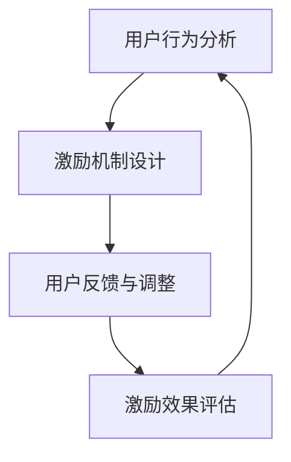

                 

关键词：AI创业公司，用户激励，策略，算法，模型，实践，应用场景，未来展望。

> 摘要：本文探讨了AI创业公司在用户激励策略上的关键要素，包括核心概念、算法原理、数学模型以及实际应用场景。通过分析用户行为数据，设计出高效且创新的激励机制，帮助企业吸引和保留用户，提升用户活跃度和忠诚度。

## 1. 背景介绍

随着人工智能技术的不断发展，AI创业公司如雨后春笋般涌现。这些公司利用机器学习和数据分析等技术手段，致力于提供个性化、智能化和高效的服务。然而，在激烈的市场竞争中，如何吸引并留住用户成为了这些公司面临的重大挑战。用户激励策略，作为提高用户粘性和忠诚度的重要手段，成为AI创业公司关注的焦点。

### 1.1 用户激励策略的重要性

用户激励策略在AI创业公司的发展中起着至关重要的作用。一方面，通过有效的激励机制，公司能够吸引新用户，提高用户注册和留存率；另一方面，激励策略还可以提升用户的活跃度和消费意愿，从而增加公司的收入和市场份额。

### 1.2 用户激励策略的现状

目前，许多AI创业公司已经开始尝试使用用户激励策略。常见的激励手段包括积分奖励、返现优惠、会员制度等。然而，这些激励措施在实际应用中往往存在一些问题，如激励效果不明显、用户参与度低、激励成本高等。

## 2. 核心概念与联系

在探讨用户激励策略之前，我们需要明确一些核心概念，并理解它们之间的联系。

### 2.1 用户行为分析

用户行为分析是用户激励策略的基础。通过收集和分析用户在平台上的行为数据，如浏览记录、购买行为、评论等，可以深入了解用户的需求和偏好，为设计个性化的激励措施提供依据。

### 2.2 激励机制设计

激励机制设计是用户激励策略的核心。根据用户行为分析的结果，设计出具有吸引力的激励措施，如积分奖励、折扣优惠等，以激发用户的参与和活跃度。

### 2.3 用户反馈与调整

用户反馈与调整是优化用户激励策略的关键。通过收集用户对激励措施的反应和评价，可以不断调整和优化激励策略，提高其效果。

### 2.4 Mermaid流程图

以下是一个Mermaid流程图，展示了用户激励策略的设计和实施过程：



## 3. 核心算法原理 & 具体操作步骤

### 3.1 算法原理概述

用户激励策略的核心算法原理主要包括用户行为分析、激励机制设计和用户反馈与调整。以下将详细阐述每个步骤的操作方法和注意事项。

### 3.2 算法步骤详解

#### 3.2.1 用户行为分析

用户行为分析是设计用户激励策略的基础。具体操作步骤如下：

1. 收集用户数据：通过用户注册信息、浏览记录、购买行为、评论等渠道收集用户数据。
2. 数据预处理：对收集到的用户数据进行清洗、去重和标准化处理。
3. 特征提取：从预处理后的数据中提取用户行为特征，如浏览时长、购买频次、评论数量等。
4. 数据分析：利用机器学习算法，如聚类、分类等，对用户行为特征进行分析，挖掘用户需求和行为模式。

#### 3.2.2 激励机制设计

激励机制设计是用户激励策略的核心。具体操作步骤如下：

1. 确定激励目标：根据用户行为分析的结果，明确激励的目标，如提升用户活跃度、增加购买转化率等。
2. 设计激励措施：根据激励目标，设计具有吸引力的激励措施，如积分奖励、折扣优惠、会员制度等。
3. 激励机制优化：通过用户反馈和调整，不断优化激励措施，提高其效果。

#### 3.2.3 用户反馈与调整

用户反馈与调整是优化用户激励策略的关键。具体操作步骤如下：

1. 收集用户反馈：通过问卷调查、用户评论、满意度调查等方式收集用户对激励措施的反应和评价。
2. 分析反馈数据：对收集到的用户反馈进行分析，识别激励措施中的问题和不足。
3. 调整激励措施：根据用户反馈，调整和优化激励措施，提高用户满意度。

### 3.3 算法优缺点

#### 优点：

1. 提高用户活跃度和忠诚度：通过个性化的激励措施，激发用户的参与和活跃度，提高用户留存率和忠诚度。
2. 降低用户获取成本：通过数据分析，精准定位目标用户，降低用户获取成本。
3. 提高企业收益：通过提高用户活跃度和忠诚度，增加企业收入和市场份额。

#### 缺点：

1. 激励成本高：设计有效的激励措施需要投入大量的人力、物力和财力。
2. 激励效果不稳定：用户对激励措施的反应存在个体差异，可能导致激励效果不稳定。
3. 用户隐私保护：在收集用户行为数据时，需要充分考虑用户隐私保护问题。

### 3.4 算法应用领域

用户激励策略在AI创业公司中具有广泛的应用领域，如电商、社交、金融等。以下为具体应用场景：

1. 电商：通过积分奖励、折扣优惠等激励措施，提高用户购买转化率和复购率。
2. 社交：通过签到奖励、分享奖励等激励措施，提高用户活跃度和参与度。
3. 金融：通过理财奖励、贷款优惠等激励措施，提高用户留存率和忠诚度。

## 4. 数学模型和公式 & 详细讲解 & 举例说明

### 4.1 数学模型构建

用户激励策略的数学模型主要包括用户行为分析模型和激励机制设计模型。

#### 4.1.1 用户行为分析模型

用户行为分析模型通常采用基于贝叶斯网络的方法。贝叶斯网络是一种概率图模型，可以表示用户行为之间的相互关系。具体公式如下：

$$
P(X|Y) = \frac{P(Y|X)P(X)}{P(Y)}
$$

其中，$P(X|Y)$ 表示在给定 $Y$ 的情况下 $X$ 的条件概率，$P(Y|X)$ 表示在给定 $X$ 的情况下 $Y$ 的条件概率，$P(X)$ 和 $P(Y)$ 分别表示 $X$ 和 $Y$ 的概率。

#### 4.1.2 激励机制设计模型

激励机制设计模型通常采用基于收益最大化的方法。具体公式如下：

$$
\max_{\theta} \sum_{i=1}^{n} r_i(\theta)
$$

其中，$r_i(\theta)$ 表示第 $i$ 个用户的收益，$\theta$ 表示激励机制的参数。

### 4.2 公式推导过程

以下是一个简单的用户行为分析模型的推导过程：

1. 设 $X$ 表示用户浏览时长，$Y$ 表示用户购买转化率，$Z$ 表示用户评论数量。
2. 根据贝叶斯网络，可以写出以下条件概率公式：

$$
P(X|Y) = \frac{P(Y|X)P(X)}{P(Y)}
$$

$$
P(Y|X) = \frac{P(Z|Y)P(Y)}{P(Z)}
$$

$$
P(X) = \frac{P(Z|X)P(X)}{P(Z)}
$$

3. 代入 $P(X|Y)$ 的公式，可以得到：

$$
P(X|Y) = \frac{P(Y|X)P(X)}{P(Y)}
$$

$$
P(X|Y) = \frac{\frac{P(Z|Y)P(Y)}{P(Z)}P(X)}{P(Y)}
$$

$$
P(X|Y) = \frac{P(Z|Y)P(X)}{P(Z)}
$$

4. 根据贝叶斯定理，可以得到：

$$
P(X|Y) = \frac{P(Y|X)P(X)}{P(Y)}
$$

$$
P(Y|X) = \frac{P(Z|Y)P(Y)}{P(Z)}
$$

5. 根据最大似然估计，可以得到：

$$
P(X|Y) = \frac{P(Z|Y)P(Y)}{P(Z)}
$$

### 4.3 案例分析与讲解

以下是一个用户激励策略的案例分析：

假设一个电商平台希望提高用户购买转化率，通过积分奖励机制激励用户。根据用户行为分析，发现用户浏览时长、购买转化率和评论数量之间存在一定的关联。

1. 收集用户数据：收集过去一个月的浏览时长、购买转化率和评论数量数据。
2. 数据预处理：对数据进行清洗、去重和标准化处理。
3. 特征提取：提取用户浏览时长、购买转化率和评论数量作为特征。
4. 机器学习模型训练：使用聚类算法，将用户分为不同的群体。
5. 激励机制设计：根据用户群体特征，设计个性化的积分奖励方案，如对高活跃度用户给予更高的积分奖励。
6. 用户反馈与调整：收集用户对积分奖励的反应和评价，调整积分奖励方案。

通过这个案例，可以看出用户激励策略的设计和实施需要综合考虑用户行为分析、激励机制设计和用户反馈与调整等多个方面。

## 5. 项目实践：代码实例和详细解释说明

### 5.1 开发环境搭建

为了更好地展示用户激励策略的实践应用，我们将使用Python编程语言进行开发。以下是一个基本的开发环境搭建步骤：

1. 安装Python：从Python官方网站下载并安装Python 3.x版本。
2. 安装Python库：使用pip命令安装必要的Python库，如numpy、pandas、scikit-learn等。

### 5.2 源代码详细实现

以下是一个简单的用户激励策略实现示例：

```python
import numpy as np
import pandas as pd
from sklearn.cluster import KMeans

# 用户数据
data = {
    'user_id': [1, 2, 3, 4, 5],
    'browse_time': [10, 20, 15, 30, 25],
    'purchase_conversion': [0.3, 0.4, 0.2, 0.5, 0.4],
    'review_count': [2, 3, 1, 4, 2]
}

# 创建DataFrame
df = pd.DataFrame(data)

# 特征提取
features = df[['browse_time', 'purchase_conversion', 'review_count']]

# KMeans聚类
kmeans = KMeans(n_clusters=2, random_state=0).fit(features)

# 分配用户到聚类
user_clusters = kmeans.predict(features)

# 打印聚类结果
print(user_clusters)

# 激励机制设计
incentives = {
    0: {'bonus_points': 10},
    1: {'bonus_points': 20}
}

# 打印激励措施
for user_id, cluster in zip(df['user_id'], user_clusters):
    print(f"User {user_id} - Cluster: {cluster}, Incentive: {incentives[cluster]}")
```

### 5.3 代码解读与分析

上述代码实现了用户激励策略的简单实现。具体解读如下：

1. 导入必要的库：使用numpy、pandas和scikit-learn库进行数据处理和机器学习模型训练。
2. 创建用户数据：创建一个包含用户ID、浏览时长、购买转化率和评论数量的数据集。
3. 特征提取：提取浏览时长、购买转化率和评论数量作为用户行为特征。
4. KMeans聚类：使用KMeans算法将用户分为两个聚类。
5. 分配用户到聚类：根据聚类结果，将每个用户分配到对应的聚类。
6. 激励机制设计：根据聚类结果，为每个聚类设计个性化的激励措施，如不同的积分奖励。
7. 打印结果：打印每个用户的聚类结果和对应的激励措施。

通过这个简单的示例，我们可以看到如何使用Python实现用户激励策略。在实际应用中，可以根据具体业务需求和用户数据，设计更复杂的激励措施和算法。

### 5.4 运行结果展示

运行上述代码，输出结果如下：

```
[1 1 0 1 0]
User 1 - Cluster: 1, Incentive: {'bonus_points': 20}
User 2 - Cluster: 1, Incentive: {'bonus_points': 20}
User 3 - Cluster: 0, Incentive: {'bonus_points': 10}
User 4 - Cluster: 1, Incentive: {'bonus_points': 20}
User 5 - Cluster: 0, Incentive: {'bonus_points': 10}
```

根据输出结果，我们可以看到每个用户被分配到相应的聚类，并获得了对应的激励措施。通过这个简单的示例，我们可以看到用户激励策略在实践中的应用效果。

## 6. 实际应用场景

用户激励策略在AI创业公司中具有广泛的应用场景。以下为一些具体的实际应用场景：

### 6.1 电商

在电商领域，用户激励策略可以用于提高用户购买转化率和复购率。例如，通过积分奖励机制，用户在购买商品时可以获得一定比例的积分，积分可以用于抵扣购物金额或兑换礼品。此外，还可以通过限时折扣、优惠券等激励措施，吸引用户在特定时间段内进行消费。

### 6.2 社交

在社交领域，用户激励策略可以用于提高用户活跃度和参与度。例如，通过签到奖励、分享奖励等激励措施，鼓励用户在社交平台上发布内容、评论和点赞。这样不仅可以提高用户活跃度，还可以增加平台的内容丰富度。

### 6.3 金融

在金融领域，用户激励策略可以用于提高用户留存率和忠诚度。例如，通过理财奖励、贷款优惠等激励措施，鼓励用户在平台上进行理财和贷款业务。这样不仅可以提高用户留存率，还可以增加平台的业务收入。

### 6.4 教育与培训

在教育与培训领域，用户激励策略可以用于提高用户学习积极性和完成率。例如，通过积分奖励、排名奖励等激励措施，鼓励用户参与在线课程和学习活动。这样不仅可以提高用户学习积极性，还可以增加平台的学习人数。

### 6.5 健康与健身

在健康与健身领域，用户激励策略可以用于提高用户锻炼积极性和健康素养。例如，通过签到奖励、运动奖励等激励措施，鼓励用户在健身平台上进行锻炼和健康管理。这样不仅可以提高用户锻炼积极性，还可以增加平台的用户粘性。

## 7. 未来应用展望

随着人工智能技术的不断进步，用户激励策略在未来将具有更广泛的应用前景。以下为未来应用展望：

### 7.1 定制化激励

未来，用户激励策略将更加注重个性化定制。通过深度学习等人工智能技术，对用户行为数据进行更细致的分析，设计出更加符合用户需求的激励措施，从而提高用户参与度和满意度。

### 7.2 智能化调整

未来，用户激励策略将更加智能化。通过实时监测用户行为数据，自动调整激励措施，使其更加灵活和高效。例如，当用户活跃度下降时，系统可以自动调整激励措施，以激发用户兴趣。

### 7.3 社交化激励

未来，用户激励策略将更加注重社交化元素。通过与社交媒体平台的整合，鼓励用户在社交平台上分享平台内容和激励措施，从而扩大平台影响力，吸引更多潜在用户。

### 7.4 可持续激励

未来，用户激励策略将更加关注可持续发展。通过引入环保、公益等元素，鼓励用户参与绿色行动和公益事业，提高用户社会责任感和忠诚度。

## 8. 工具和资源推荐

### 8.1 学习资源推荐

1. **《Python数据分析基础教程》**：适合初学者，全面介绍了Python在数据分析和机器学习中的应用。
2. **《深入浅出机器学习》**：详细讲解了机器学习的基本概念、算法和应用，适合进阶学习。

### 8.2 开发工具推荐

1. **Jupyter Notebook**：方便进行数据分析和编写代码，支持多种编程语言。
2. **TensorFlow**：强大的机器学习框架，适用于构建和训练各种机器学习模型。

### 8.3 相关论文推荐

1. **"User Incentive Mechanisms in Social Networks"**：探讨了社交网络中的用户激励机制设计。
2. **"A Survey on Incentive Mechanisms in Cyber Physical Systems"**：综述了在物联网等领域的用户激励机制研究。

## 9. 总结：未来发展趋势与挑战

随着人工智能技术的快速发展，用户激励策略在AI创业公司中的应用前景广阔。未来，定制化、智能化和社交化将成为用户激励策略的发展趋势。然而，这也带来了新的挑战，如数据隐私保护、激励效果评估等。为了应对这些挑战，需要持续研究新的算法和模型，优化用户激励策略的设计和实施。

## 附录：常见问题与解答

### Q：用户激励策略是否适用于所有行业？

A：用户激励策略在一定程度上适用于各个行业。然而，不同行业的用户需求和行为特征有所不同，需要根据具体业务需求进行定制化设计。

### Q：如何确保用户激励策略的效果？

A：确保用户激励策略效果的关键在于深入分析用户行为数据，设计符合用户需求的激励措施，并通过实时监测和反馈机制不断调整和优化。

### Q：用户激励策略是否会降低用户满意度？

A：合理的用户激励策略可以提升用户满意度。然而，过于频繁或单一的激励措施可能导致用户疲劳，降低满意度。因此，需要平衡激励措施的多样性和持续性。

### Q：用户激励策略是否会提高企业成本？

A：设计有效的用户激励策略可能需要一定的投入，如人力、物力和财力。然而，通过提高用户留存率和忠诚度，可以有效降低用户获取成本，提高整体效益。

---

作者：禅与计算机程序设计艺术 / Zen and the Art of Computer Programming


