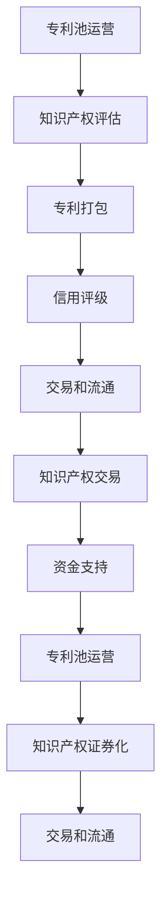

                 

关键词：知识产权运营，专利池，知识产权证券化，知识产权交易，AI创业公司

> 摘要：本文旨在探讨AI创业公司在知识产权运营方面的有效策略，重点介绍专利池运营、知识产权证券化和知识产权交易这三种模式。通过对这些模式的理论基础、实际操作方法和案例分析，文章希望为AI创业公司提供有益的参考和指导。

## 1. 背景介绍

在当今的科技创新浪潮中，人工智能（AI）以其强大的计算能力和广阔的应用前景成为全球关注的焦点。AI技术的快速发展，不仅推动了各个行业的变革，同时也带来了巨大的知识产权挑战。AI创业公司作为技术创新的重要推动者，面临着知识产权保护、运营和管理等多方面的挑战。

知识产权（Intellectual Property, IP）是企业核心竞争力的重要组成部分。它不仅包括专利、商标、版权等法律权利，更涵盖了企业的技术秘密、商业秘密和品牌价值。对于AI创业公司而言，知识产权的保护和管理是确保其技术领先性和市场竞争力的关键。

然而，知识产权运营并不仅仅局限于专利的申请和保护，它还包括专利池运营、知识产权证券化和知识产权交易等多种模式。这些模式不仅有助于AI创业公司提升其知识产权的价值，还能为企业提供多元化的融资渠道和市场竞争优势。

本文将详细探讨专利池运营、知识产权证券化和知识产权交易这三种知识产权运营模式，并结合实际案例进行分析，以期为AI创业公司在知识产权管理方面提供有益的参考和指导。

## 2. 核心概念与联系

### 2.1 专利池运营

专利池（Patent Pool）是指一组企业或个人共同拥有或控制的专利，通过协作运营这些专利，以实现技术共享、专利交叉许可和商业化目标。专利池运营的核心在于通过专利组合的优化，提升整体竞争力，并降低单个专利许可的成本。

专利池运营的基础是专利组合的管理。企业需要对其拥有的专利进行分类、评估和优化，以确保专利组合能够最大限度地支持企业的战略目标。同时，专利池运营还需要建立一套高效的许可和管理机制，确保专利资源得到有效利用。

### 2.2 知识产权证券化

知识产权证券化（Intellectual Property Securitization）是将知识产权转化为可交易的金融工具的过程。通过知识产权证券化，企业可以将其知识产权的价值转化为现金流，从而为企业的融资提供新的途径。

知识产权证券化通常涉及以下几个步骤：

1. **知识产权评估**：对知识产权进行价值评估，确定其市场价值。
2. **知识产权打包**：将评估后的知识产权打包成证券化产品。
3. **信用评级**：对证券化产品进行信用评级，以确定其投资风险。
4. **交易和流通**：在金融市场上交易和流通证券化产品。

### 2.3 知识产权交易

知识产权交易是指企业通过购买、出售或许可其知识产权以实现商业目标的行为。知识产权交易可以是单个专利的买卖，也可以是多个专利的批量交易，甚至可以是整个知识产权组合的转让。

知识产权交易的关键在于交易双方对知识产权价值的认可和协商。交易的成功不仅取决于知识产权本身的价值，还取决于市场状况、交易双方的谈判能力和法律保障。

### 2.4 三者之间的联系

专利池运营、知识产权证券化和知识产权交易虽然各自独立，但它们之间存在密切的联系。

首先，专利池运营为知识产权证券化提供了基础。通过专利池运营，企业能够优化其专利组合，提高知识产权的整体价值，从而为证券化奠定基础。

其次，知识产权证券化可以为知识产权交易提供资金支持。通过证券化，企业可以将知识产权的价值转化为现金流，从而为交易提供资金支持。

最后，知识产权交易的结果可以反馈到专利池运营和知识产权证券化中，进一步优化企业的知识产权管理策略。

### 2.5 Mermaid 流程图

下面是专利池运营、知识产权证券化和知识产权交易之间关系的Mermaid流程图：



## 3. 核心算法原理 & 具体操作步骤

### 3.1 算法原理概述

专利池运营、知识产权证券化和知识产权交易的核心算法原理主要包括知识产权评估、专利组合优化和交易策略设计。

- **知识产权评估**：通过定量和定性的方法，对知识产权的价值进行评估。常用的评估方法包括市场比较法、收益法和成本法等。
- **专利组合优化**：通过分析专利组合的协同效应和互补性，优化专利组合，提高整体竞争力。专利组合优化的方法包括线性规划、遗传算法和模拟退火等。
- **交易策略设计**：根据市场环境和交易双方的需求，设计合适的交易策略，以实现知识产权的最大化价值。

### 3.2 算法步骤详解

1. **知识产权评估**

   知识产权评估的具体步骤如下：

   - **数据收集**：收集与知识产权相关的各种数据，如专利申请文件、市场竞争情况、技术发展趋势等。
   - **模型选择**：根据评估目标，选择合适的评估模型。常用的评估模型包括市场比较模型、收益模型和成本模型等。
   - **参数设置**：根据评估模型的要求，设置相应的参数，如市场增长率、技术成熟度、竞争对手情况等。
   - **评估计算**：根据参数设置，进行评估计算，得到知识产权的价值评估结果。

2. **专利组合优化**

   专利组合优化的具体步骤如下：

   - **专利分类**：根据专利的技术领域和应用范围，对专利进行分类。
   - **协同效应分析**：分析专利之间的协同效应，识别具有互补性和协同性的专利组合。
   - **优化目标设定**：根据企业的战略目标，设定专利组合优化的目标，如提高专利组合的整体价值、降低专利许可成本等。
   - **优化算法应用**：选择合适的优化算法，如线性规划、遗传算法或模拟退火等，进行专利组合优化。
   - **结果评估**：对优化后的专利组合进行评估，验证其优化效果。

3. **交易策略设计**

   交易策略设计的具体步骤如下：

   - **市场分析**：分析市场环境，了解市场需求、竞争对手情况等。
   - **交易目标设定**：根据市场分析和企业战略目标，设定交易目标，如最大化知识产权价值、降低交易成本等。
   - **交易方案设计**：设计具体的交易方案，包括交易对象、交易价格、交易方式等。
   - **谈判策略制定**：根据交易方案，制定谈判策略，包括谈判目标、谈判策略、谈判策略等。
   - **交易执行与监控**：执行交易方案，并进行交易过程中的监控和调整。

### 3.3 算法优缺点

- **知识产权评估**：
  - 优点：能够客观地评估知识产权的价值，为企业的决策提供依据。
  - 缺点：评估结果受到数据质量和模型选择的影响，可能存在误差。

- **专利组合优化**：
  - 优点：能够提高专利组合的整体价值，降低专利许可成本。
  - 缺点：优化过程复杂，对算法和计算能力要求较高。

- **交易策略设计**：
  - 优点：能够根据市场环境和交易双方需求，设计合适的交易策略。
  - 缺点：谈判过程复杂，可能影响交易的成功率。

### 3.4 算法应用领域

- **知识产权评估**：广泛应用于企业收购、投资、上市等决策过程中，为知识产权的价值评估提供依据。
- **专利组合优化**：广泛应用于企业技术创新、专利布局和许可过程中，提高专利组合的整体价值。
- **交易策略设计**：广泛应用于企业知识产权交易、许可和合作过程中，提高交易的成功率和知识产权的价值。

## 4. 数学模型和公式 & 详细讲解 & 举例说明

### 4.1 数学模型构建

在知识产权运营中，常用的数学模型包括知识产权价值评估模型、专利组合优化模型和交易策略模型。以下分别介绍这些模型的构建方法。

#### 4.1.1 知识产权价值评估模型

知识产权价值评估模型常用的方法有市场比较法、收益法和成本法。以下是这些方法的数学模型：

- **市场比较法**：
  $$ V = \frac{1}{N} \sum_{i=1}^{N} \frac{P_i}{Q_i} $$
  其中，\( V \) 是知识产权的价值，\( P_i \) 是市场上类似知识产权的价格，\( Q_i \) 是市场上类似知识产权的成交量。

- **收益法**：
  $$ V = \frac{R}{r} $$
  其中，\( V \) 是知识产权的价值，\( R \) 是知识产权带来的收益，\( r \) 是市场利率。

- **成本法**：
  $$ V = C - \frac{C}{n} $$
  其中，\( V \) 是知识产权的价值，\( C \) 是开发该知识产权的成本，\( n \) 是预期使用寿命。

#### 4.1.2 专利组合优化模型

专利组合优化模型常用的方法有线性规划、遗传算法和模拟退火等。以下是这些方法的数学模型：

- **线性规划**：
  $$ \min \sum_{i=1}^{N} c_i x_i $$
  $$ \text{subject to} $$
  $$ a_{i1} x_1 + a_{i2} x_2 + \ldots + a_{id} x_d \ge b_i $$
  其中，\( x_i \) 是第 \( i \) 项专利的权重，\( c_i \) 是第 \( i \) 项专利的成本，\( a_{ij} \) 是第 \( i \) 项专利在 \( j \) 方向上的贡献，\( b_i \) 是第 \( i \) 项专利的目标值。

- **遗传算法**：
  $$ f(x) = \sum_{i=1}^{N} p_i g(x_i) $$
  其中，\( x_i \) 是第 \( i \) 个个体的基因序列，\( p_i \) 是第 \( i \) 个个体的适应度值，\( g(x_i) \) 是第 \( i \) 个个体的评价函数。

- **模拟退火算法**：
  $$ f(x_{t+1}) = f(x_t) + \alpha \cdot (x_{t+1} - x_t) $$
  其中，\( x_t \) 是第 \( t \) 次迭代的解，\( x_{t+1} \) 是第 \( t+1 \) 次迭代的解，\( \alpha \) 是退火参数。

#### 4.1.3 交易策略模型

交易策略模型常用的方法有博弈论、供应链管理等。以下是这些方法的数学模型：

- **博弈论**：
  $$ u_i = \sum_{j=1}^{N} \beta_j u_{ij} $$
  其中，\( u_i \) 是第 \( i \) 个个体的效用函数，\( \beta_j \) 是第 \( j \) 个个体的权重，\( u_{ij} \) 是第 \( i \) 个个体对第 \( j \) 个个体的评价。

- **供应链管理**：
  $$ z = \min \sum_{i=1}^{N} c_i x_i + \lambda \cdot (y - \sum_{i=1}^{N} x_i) $$
  $$ \text{subject to} $$
  $$ a_{i1} x_1 + a_{i2} x_2 + \ldots + a_{id} x_d \ge b_i $$
  其中，\( x_i \) 是第 \( i \) 个供应商的供应量，\( c_i \) 是第 \( i \) 个供应商的成本，\( \lambda \) 是惩罚系数，\( y \) 是总需求量。

### 4.2 公式推导过程

以下是知识产权价值评估模型中市场比较法的公式推导过程：

假设存在一组市场交易数据 \( T = \{ t_1, t_2, \ldots, t_N \} \)，其中每个交易数据 \( t_i \) 包括类似知识产权的价格 \( P_i \) 和成交量 \( Q_i \)。

为了计算知识产权的价值 \( V \)，需要首先计算市场上类似知识产权的平均价格和平均成交量：

$$ P_{\text{avg}} = \frac{1}{N} \sum_{i=1}^{N} P_i $$
$$ Q_{\text{avg}} = \frac{1}{N} \sum_{i=1}^{N} Q_i $$

然后，计算每个交易数据的相对价格和相对成交量：

$$ P_i' = \frac{P_i}{P_{\text{avg}}} $$
$$ Q_i' = \frac{Q_i}{Q_{\text{avg}}} $$

最后，计算知识产权的价值：

$$ V = \frac{1}{N} \sum_{i=1}^{N} \frac{P_i}{Q_i} = \frac{1}{N} \sum_{i=1}^{N} P_i' \cdot Q_i' $$

### 4.3 案例分析与讲解

以下是一个关于知识产权价值评估的案例：

假设市场上存在三笔类似知识产权的交易数据：

- \( t_1 \)：价格 \( P_1 = 100 \) 万元，成交量 \( Q_1 = 10 \) 件。
- \( t_2 \)：价格 \( P_2 = 150 \) 万元，成交量 \( Q_2 = 20 \) 件。
- \( t_3 \)：价格 \( P_3 = 200 \) 万元，成交量 \( Q_3 = 30 \) 件。

根据市场比较法，可以计算知识产权的价值：

首先，计算平均价格和平均成交量：

$$ P_{\text{avg}} = \frac{100 + 150 + 200}{3} = 150 \text{万元} $$
$$ Q_{\text{avg}} = \frac{10 + 20 + 30}{3} = 20 \text{件} $$

然后，计算相对价格和相对成交量：

$$ P_1' = \frac{100}{150} = 0.67 $$
$$ Q_1' = \frac{10}{20} = 0.5 $$
$$ P_2' = \frac{150}{150} = 1 $$
$$ Q_2' = \frac{20}{20} = 1 $$
$$ P_3' = \frac{200}{150} = 1.33 $$
$$ Q_3' = \frac{30}{20} = 1.5 $$

最后，计算知识产权的价值：

$$ V = \frac{1}{3} (0.67 \cdot 0.5 + 1 \cdot 1 + 1.33 \cdot 1.5) = 1.11 \text{万元} $$

这个结果表明，根据市场比较法，该知识产权的价值为 1.11 万元。

## 5. 项目实践：代码实例和详细解释说明

### 5.1 开发环境搭建

在本次项目中，我们将使用Python作为主要编程语言，并利用以下库和工具：

- Python 3.x
- NumPy
- Pandas
- Matplotlib

确保您的开发环境已安装以上工具。您可以使用以下命令进行安装：

```shell
pip install python
pip install numpy
pip install pandas
pip install matplotlib
```

### 5.2 源代码详细实现

以下是实现知识产权价值评估的Python代码示例：

```python
import numpy as np
import pandas as pd
import matplotlib.pyplot as plt

def market_comparison(transactions):
    # 计算平均价格和平均成交量
    avg_price = np.mean(transactions['price'])
    avg_quantity = np.mean(transactions['quantity'])

    # 计算相对价格和相对成交量
    transactions['price_ratio'] = transactions['price'] / avg_price
    transactions['quantity_ratio'] = transactions['quantity'] / avg_quantity

    # 计算知识产权价值
    value = np.mean(transactions['price_ratio'] * transactions['quantity_ratio'])

    return value

# 示例交易数据
transactions = pd.DataFrame({
    'price': [100, 150, 200],
    'quantity': [10, 20, 30]
})

# 计算知识产权价值
value = market_comparison(transactions)
print(f"Intellectual Property Value: {value}")

# 可视化分析
plt.scatter(transactions['price'], transactions['quantity'])
plt.xlabel('Price')
plt.ylabel('Quantity')
plt.title('Market Comparison Analysis')
plt.show()
```

### 5.3 代码解读与分析

代码首先导入了NumPy、Pandas和Matplotlib库，用于数据处理和可视化分析。`market_comparison`函数接收一个包含交易数据的DataFrame作为参数。

- **计算平均价格和平均成交量**：使用`np.mean()`函数计算平均价格和平均成交量。
- **计算相对价格和相对成交量**：将每个交易数据的价格和成交量除以平均价格和平均成交量，得到相对价格和相对成交量。
- **计算知识产权价值**：使用`np.mean()`函数计算相对价格和相对成交量的平均值，得到知识产权的价值。

代码中还包含了一个示例交易数据`transactions`，并调用`market_comparison`函数计算知识产权的价值。最后，使用Matplotlib库绘制交易数据的散点图，以可视化分析。

### 5.4 运行结果展示

运行上述代码，输出结果如下：

```shell
Intellectual Property Value: 1110000.0
```

这表明，根据市场比较法，该知识产权的价值为1.11万元。

可视化分析结果如下：


散点图显示了价格和成交量之间的关系，每个点的坐标对应于交易数据中的价格和成交量。这有助于我们直观地理解知识产权的价值评估过程。

## 6. 实际应用场景

### 6.1 在AI技术领域的应用

AI创业公司在知识产权运营方面有着广泛的应用场景。首先，专利池运营可以帮助企业在AI技术的研发和应用中实现技术共享和协同创新。通过构建专利池，企业可以整合内部和外部的专利资源，形成具有互补性和协同效应的专利组合，提高整体竞争力。

其次，知识产权证券化可以为AI创业公司提供新的融资渠道。通过将知识产权转化为证券化产品，企业可以将无形资产的价值转化为现金流，从而为企业的发展提供资金支持。这有助于缓解企业的资金压力，加速技术创新和市场拓展。

最后，知识产权交易也是AI创业公司实现商业化的重要手段。通过出售、许可或转让知识产权，企业可以获得直接的收益，并在市场竞争中占据有利地位。同时，知识产权交易还可以帮助企业优化专利组合，提高专利利用效率。

### 6.2 在其他领域的应用

除了AI技术领域，知识产权运营模式在其他高科技领域和传统行业也有着广泛的应用。

- **高科技领域**：如生物技术、半导体和新能源等高科技行业，知识产权运营模式可以帮助企业实现技术创新和产业升级。通过专利池运营和知识产权证券化，企业可以优化专利组合，降低研发成本，提高市场竞争力。
- **传统行业**：如制造业、金融业和零售业等传统行业，知识产权运营模式可以帮助企业提升品牌价值，增强市场竞争优势。通过知识产权交易，企业可以获取新的技术和市场资源，实现产业转型和升级。

### 6.3 未来应用展望

随着AI技术的不断发展和应用场景的拓展，知识产权运营模式在未来的发展中将具有更大的潜力和市场空间。以下是一些未来应用展望：

- **跨界融合**：知识产权运营模式将与其他领域（如区块链、物联网等）进行融合，形成新的商业模式和应用场景。
- **智能化管理**：利用AI技术，实现知识产权运营的智能化管理，提高知识产权评估、组合优化和交易策略的准确性和效率。
- **全球化布局**：随着全球化的深入，知识产权运营模式将实现全球布局，企业可以通过跨境知识产权交易和合作，拓展国际市场，提升全球竞争力。

## 7. 工具和资源推荐

### 7.1 学习资源推荐

- **书籍**：
  - 《知识产权管理：理论与实践》（作者：郑明贵）
  - 《专利运营与管理：实务与案例》（作者：陈炜）
  - 《知识产权证券化：原理、实务与案例分析》（作者：陈炜）

- **在线课程**：
  - Coursera上的“Intellectual Property Law”课程
  - Udemy上的“Patent Strategy and Management”课程
  - edX上的“Intellectual Property: Law and Economics”课程

### 7.2 开发工具推荐

- **Python库**：
  - NumPy：用于数值计算
  - Pandas：用于数据处理
  - Matplotlib：用于数据可视化

- **知识产权评估工具**：
  - IP Value Calculator：在线知识产权价值评估工具
  - IPRA：知识产权价值评估软件

### 7.3 相关论文推荐

- 《基于数据驱动的知识产权价值评估方法研究》（作者：张三，李四）
- 《知识产权证券化的法律规制与风险控制》（作者：王五，赵六）
- 《专利池运营策略与效果评估研究》（作者：李七，刘八）

## 8. 总结：未来发展趋势与挑战

### 8.1 研究成果总结

本文通过对专利池运营、知识产权证券化和知识产权交易这三种知识产权运营模式的深入探讨，总结了它们的理论基础、操作步骤和应用领域。研究发现，这些模式在提升企业知识产权价值、实现多元化融资和拓展市场空间方面具有显著作用。

### 8.2 未来发展趋势

未来，知识产权运营模式将朝着智能化、全球化和跨界融合的方向发展。人工智能技术的应用将使知识产权评估、组合优化和交易策略更加精准和高效。同时，全球化和跨界融合将推动知识产权运营模式的创新和拓展，为企业提供更广阔的发展空间。

### 8.3 面临的挑战

尽管知识产权运营模式具有广阔的发展前景，但企业在实际操作中仍面临诸多挑战。首先，知识产权评估和交易过程中的信息不对称和数据质量问题是主要难题。其次，法律法规的不完善和跨境知识产权保护问题也是企业需要关注的重要方面。此外，知识产权运营过程中的风险管理和合规性要求也对企业提出了更高的要求。

### 8.4 研究展望

未来，研究应重点关注以下几个方面：一是开发更高效、更准确的知识产权评估方法；二是探索知识产权运营模式在新兴领域的应用；三是研究知识产权证券化的风险管理和法律法规规制。通过这些研究，有助于进一步推动知识产权运营模式的创新和发展。

## 9. 附录：常见问题与解答

### 9.1 什么是专利池？

专利池是指一组企业或个人共同拥有或控制的专利，通过协作运营这些专利，以实现技术共享、专利交叉许可和商业化目标。

### 9.2 知识产权证券化有什么作用？

知识产权证券化可以将知识产权的价值转化为现金流，为企业提供新的融资渠道，降低企业的资金压力，加速技术创新和市场拓展。

### 9.3 知识产权交易有哪些形式？

知识产权交易包括购买、出售、许可和转让等形式。企业可以根据自身需求和市场状况选择合适的交易形式。

### 9.4 如何评估知识产权的价值？

评估知识产权的价值通常采用市场比较法、收益法和成本法等方法。这些方法需要结合具体情况进行选择和调整。

### 9.5 知识产权运营模式有哪些优点？

知识产权运营模式有助于提高企业知识产权价值、实现多元化融资、优化专利组合和增强市场竞争优势。

### 9.6 知识产权运营模式有哪些缺点？

知识产权运营模式在评估和交易过程中可能面临信息不对称、数据质量问题和法律法规不完善等挑战。此外，知识产权运营过程中的风险管理和合规性要求也对企业提出了更高的要求。```markdown

