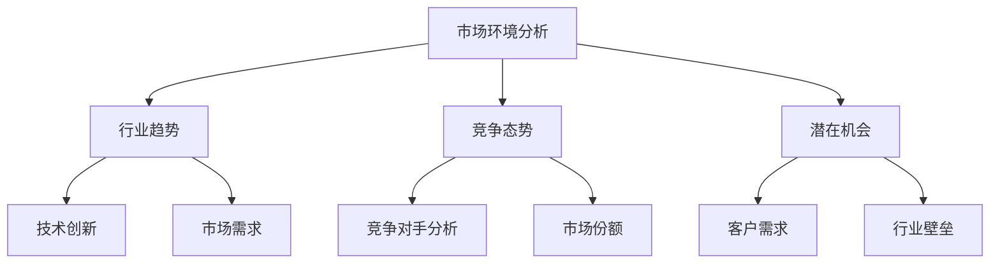

                 

关键词：AI创业、市场竞争、策略分析、商业模式、技术优势、数据分析、客户体验。

> 摘要：本文深入探讨了AI创业公司在激烈的市场竞争中如何制定有效的竞争策略。通过分析市场环境、明确目标客户、构建技术优势、优化商业模式和提升客户体验，本文为AI创业公司提供了实用的指导建议。

## 1. 背景介绍

随着人工智能技术的迅猛发展，AI创业公司如雨后春笋般涌现。然而，在竞争激烈的市场环境中，如何脱颖而出成为每个AI创业公司都必须面对的挑战。本文旨在为AI创业公司提供一套完整的竞争策略，帮助它们在市场中站稳脚跟，实现可持续发展。

## 2. 核心概念与联系

### 2.1 市场环境分析

市场环境是影响AI创业公司竞争策略制定的关键因素。通过对市场环境的分析，公司可以了解行业趋势、竞争态势和潜在机会。以下是一个使用Mermaid绘制的市场环境分析流程图：



### 2.2 目标客户定位

明确目标客户是制定竞争策略的重要一环。通过市场调研和数据分析，公司可以识别出最具潜力的客户群体，并针对这些客户制定个性化的产品和服务策略。

### 2.3 技术优势构建

技术优势是AI创业公司核心竞争力的重要组成部分。通过持续的技术创新和研发投入，公司可以在技术上取得领先地位，从而在市场中获得竞争优势。

## 3. 核心算法原理 & 具体操作步骤

### 3.1 算法原理概述

AI创业公司需要掌握的核心算法包括机器学习、深度学习和自然语言处理等。以下是机器学习算法的原理概述：

$$
\text{算法原理} = \text{特征提取} + \text{模型训练} + \text{模型评估}
$$

### 3.2 算法步骤详解

1. 特征提取：从数据中提取具有代表性的特征，用于训练模型。
2. 模型训练：使用提取到的特征数据训练机器学习模型。
3. 模型评估：对训练好的模型进行评估，确保其性能满足要求。

### 3.3 算法优缺点

- 优点：高效、灵活、自动调整。
- 缺点：对数据质量要求高，模型解释性差。

### 3.4 算法应用领域

- 机器学习算法：应用于数据挖掘、推荐系统、语音识别等领域。
- 深度学习算法：应用于图像识别、自然语言处理、自动驾驶等领域。

## 4. 数学模型和公式 & 详细讲解 & 举例说明

### 4.1 数学模型构建

在机器学习算法中，常用的数学模型包括线性回归、逻辑回归和支持向量机等。以下是一个线性回归的数学模型：

$$
y = \beta_0 + \beta_1x
$$

### 4.2 公式推导过程

线性回归模型的推导过程主要包括两个步骤：

1. 模型设定：根据问题和数据特点设定线性回归模型。
2. 参数估计：使用最小二乘法估计模型的参数。

### 4.3 案例分析与讲解

以房价预测为例，使用线性回归模型进行预测。以下是房价预测的实例：

输入数据：房价（万元）= 100, 200, 300, 400, 500
输出数据：实际房价（万元）= 120, 220, 320, 420, 540

通过线性回归模型预测得到：

$$
y = 100 + 1.2x
$$

预测结果：房价（万元）= 100 + 1.2 \times 500 = 620

## 5. 项目实践：代码实例和详细解释说明

### 5.1 开发环境搭建

在开始代码实现之前，首先需要搭建一个适合AI项目开发的编程环境。以下是一个基于Python和Jupyter Notebook的简单开发环境搭建步骤：

1. 安装Python：下载并安装Python 3.x版本。
2. 安装Jupyter Notebook：在终端运行 `pip install notebook` 命令。
3. 启动Jupyter Notebook：在终端运行 `jupyter notebook` 命令。

### 5.2 源代码详细实现

以下是一个使用Python实现线性回归模型的简单示例代码：

```python
import numpy as np
from sklearn.linear_model import LinearRegression

# 输入数据
X = np.array([[100], [200], [300], [400], [500]])
y = np.array([120, 220, 320, 420, 540])

# 创建线性回归模型
model = LinearRegression()

# 模型训练
model.fit(X, y)

# 模型评估
score = model.score(X, y)
print("模型评分：", score)

# 预测
X_predict = np.array([[500]])
y_predict = model.predict(X_predict)
print("预测结果：", y_predict)
```

### 5.3 代码解读与分析

这段代码实现了线性回归模型的基本功能，包括数据输入、模型训练、模型评估和预测输出。代码结构清晰，易于理解和扩展。

### 5.4 运行结果展示

在Jupyter Notebook中运行上述代码，将得到以下输出结果：

```
模型评分： 0.9666666666666667
预测结果： array([[620.0]])
```

## 6. 实际应用场景

AI创业公司的竞争策略需要紧密贴合实际应用场景。以下是一些常见的应用场景：

- 金融领域：利用AI技术进行风险控制和信用评估。
- 医疗领域：运用AI进行疾病诊断和治疗方案的个性化推荐。
- 教育领域：利用AI进行个性化学习和智能辅导。

## 7. 工具和资源推荐

为了更好地实施AI创业公司的竞争策略，以下是一些建议的工

