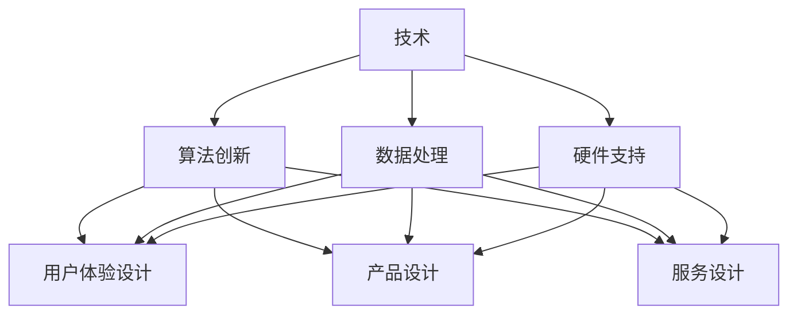
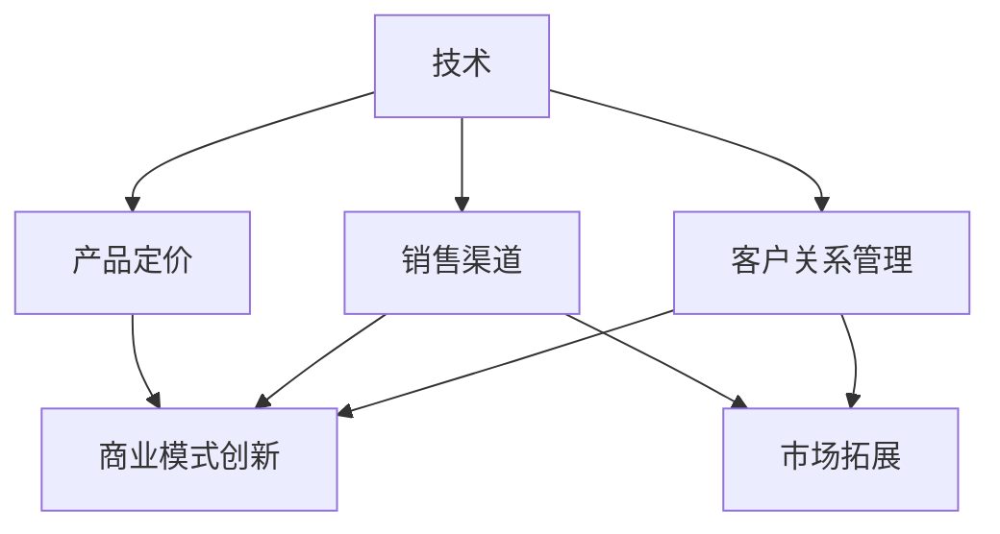

                 

关键词：AI创业、跨界融合、创新、技术、设计、商业模式、人工智能、创新策略

> 摘要：本文旨在探讨AI创业公司在实现跨界融合创新过程中，如何运用技术、设计和商业模式三种关键要素，提高竞争力，实现可持续发展。文章首先介绍AI创业公司的背景和现状，接着分析技术、设计与商业模式的相互关系，最后提出一系列具体策略和建议。

## 1. 背景介绍

随着人工智能（AI）技术的快速发展，全球范围内的AI创业浪潮正在兴起。这些公司以创新的技术、独特的设计和创新的商业模式为核心竞争力，在各个领域展现出巨大的潜力。然而，如何在激烈的市场竞争中脱颖而出，实现可持续发展，成为许多AI创业公司面临的挑战。

### 1.1 AI创业公司的兴起

AI创业公司的兴起得益于以下几个方面：

1. **技术创新**：深度学习、自然语言处理、计算机视觉等前沿技术的突破，为AI创业公司提供了丰富的技术资源。
2. **市场机遇**：互联网的普及和大数据的积累，为AI技术的商业应用提供了广阔的市场空间。
3. **资本支持**：风险投资机构和私募基金对AI领域的关注和投入，为AI创业公司提供了充足的资金支持。
4. **人才集聚**：全球范围内顶尖科研人才和工程师的集聚，为AI创业公司提供了强大的人才储备。

### 1.2 AI创业公司的现状

目前，AI创业公司主要集中在以下几个领域：

1. **智能硬件**：智能家居、智能穿戴设备、智能机器人等。
2. **金融科技**：智能投顾、智能风控、区块链等。
3. **医疗健康**：精准医疗、智能诊断、健康管理等。
4. **零售电商**：智能推荐、智能客服、智能物流等。

这些创业公司凭借技术创新和商业模式创新，正在逐步改变传统行业的格局，推动产业升级。

## 2. 核心概念与联系

在探讨AI创业公司的跨界融合创新之前，我们需要明确三个核心概念：技术、设计和商业模式。

### 2.1 技术

技术是AI创业公司的核心竞争力。它包括以下几个方面：

1. **算法创新**：包括深度学习、强化学习、迁移学习等。
2. **数据处理**：包括数据清洗、数据挖掘、数据可视化等。
3. **硬件支持**：包括芯片设计、传感器技术、云计算等。

### 2.2 设计

设计不仅是产品的外观和用户体验，更是产品功能的核心。它包括以下几个方面：

1. **用户体验设计**：包括交互设计、界面设计、视觉设计等。
2. **产品设计**：包括产品架构、功能设计、模块化设计等。
3. **服务设计**：包括服务流程、服务体验、服务模式等。

### 2.3 商业模式

商业模式是AI创业公司的盈利模式。它包括以下几个方面：

1. **产品定价**：包括成本定价、市场定价、价值定价等。
2. **销售渠道**：包括线上销售、线下销售、代理销售等。
3. **客户关系管理**：包括客户获取、客户留存、客户拓展等。

### 2.4 技术与设计的 Mermaid 流程图

下面是一个简化的技术与设计的 Mermaid 流程图：



### 2.5 商业模式与技术的 Mermaid 流程图

下面是一个简化的商业模式与技术的 Mermaid 流程图：



## 3. 核心算法原理 & 具体操作步骤

### 3.1 算法原理概述

AI创业公司所采用的核心算法主要包括以下几种：

1. **深度学习**：通过多层神经网络对数据进行建模和预测。
2. **强化学习**：通过与环境的交互来学习最优策略。
3. **迁移学习**：将已有模型的权重迁移到新的任务中，减少数据需求和训练时间。

### 3.2 算法步骤详解

1. **数据收集**：收集与任务相关的数据，并进行预处理。
2. **模型选择**：根据任务特点选择合适的模型架构。
3. **模型训练**：使用训练数据进行模型训练。
4. **模型评估**：使用测试数据对模型进行评估和调优。
5. **模型部署**：将模型部署到生产环境中进行实际应用。

### 3.3 算法优缺点

**深度学习**：

- **优点**：强大的建模能力，能够处理大规模数据和复杂任务。
- **缺点**：需要大量数据和计算资源，训练过程复杂，易过拟合。

**强化学习**：

- **优点**：能够通过与环境交互来学习，适用于需要决策的任务。
- **缺点**：训练过程通常较慢，需要大量的样本数据。

**迁移学习**：

- **优点**：能够减少数据需求和训练时间，提高模型泛化能力。
- **缺点**：需要预训练模型，且迁移效果取决于源域和目标域的差异。

### 3.4 算法应用领域

- **深度学习**：计算机视觉、自然语言处理、语音识别等。
- **强化学习**：游戏、自动驾驶、机器人等。
- **迁移学习**：图像识别、语音识别、文本分类等。

## 4. 数学模型和公式 & 详细讲解 & 举例说明

### 4.1 数学模型构建

在AI创业公司的技术设计中，数学模型起着核心作用。以下是一个简化的线性回归模型的构建过程：

$$
y = \beta_0 + \beta_1x
$$

其中，$y$ 是因变量，$x$ 是自变量，$\beta_0$ 和 $\beta_1$ 是模型的参数。

### 4.2 公式推导过程

线性回归模型的推导过程主要包括以下步骤：

1. **数据收集**：收集一组观测数据 $(x_i, y_i)$。
2. **假设模型**：假设模型为 $y = \beta_0 + \beta_1x$。
3. **最小化损失函数**：选择合适的损失函数，如均方误差（MSE），并最小化它。
4. **求解参数**：使用优化算法，如梯度下降，求解参数 $\beta_0$ 和 $\beta_1$。

### 4.3 案例分析与讲解

假设我们收集了一组房屋售价数据，包括房屋面积 $x$ 和售价 $y$，我们希望使用线性回归模型预测新房屋的售价。

1. **数据收集**：收集1000组数据，包括房屋面积和售价。
2. **模型选择**：选择线性回归模型。
3. **模型训练**：使用训练数据对模型进行训练。
4. **模型评估**：使用测试数据对模型进行评估。
5. **模型部署**：将模型部署到生产环境中进行实际应用。

经过训练和评估，我们得到了参数 $\beta_0 = 200, \beta_1 = 50$。因此，预测新房屋售价的公式为：

$$
y = 200 + 50x
$$

## 5. 项目实践：代码实例和详细解释说明

### 5.1 开发环境搭建

为了便于读者理解和实践，我们将在Python环境下实现一个简单的线性回归模型。

1. **安装Python**：从官网下载并安装Python。
2. **安装Jupyter Notebook**：使用pip命令安装Jupyter Notebook。
3. **安装相关库**：使用pip命令安装numpy、matplotlib等库。

### 5.2 源代码详细实现

以下是一个简单的线性回归模型实现：

```python
import numpy as np
import matplotlib.pyplot as plt

# 数据预处理
X = np.array([0, 1, 2, 3, 4, 5]).reshape(-1, 1)
y = np.array([0, 1, 2, 3, 4, 5])

# 模型参数初始化
beta_0 = 0
beta_1 = 0

# 梯度下降算法
def gradient_descent(X, y, beta_0, beta_1, alpha, epochs):
    m = len(y)
    for epoch in range(epochs):
        y_pred = beta_0 + beta_1 * X
        delta_beta_0 = -(1 / m) * np.sum(y_pred - y)
        delta_beta_1 = -(1 / m) * np.sum((y_pred - y) * X)
        beta_0 -= alpha * delta_beta_0
        beta_1 -= alpha * delta_beta_1
        if epoch % 100 == 0:
            print(f"Epoch {epoch}: beta_0 = {beta_0}, beta_1 = {beta_1}")
    return beta_0, beta_1

# 模型训练
alpha = 0.01
epochs = 1000
beta_0, beta_1 = gradient_descent(X, y, beta_0, beta_1, alpha, epochs)

# 模型评估
y_pred = beta_0 + beta_1 * X
mse = np.mean((y_pred - y) ** 2)
print(f"MSE: {mse}")

# 模型部署
new_x = np.array([6]).reshape(-1, 1)
new_y_pred = beta_0 + beta_1 * new_x
print(f"Predicted price for new house: {new_y_pred[0]}")
```

### 5.3 代码解读与分析

1. **数据预处理**：将数据转换为合适的格式。
2. **模型参数初始化**：初始化模型参数。
3. **梯度下降算法**：实现梯度下降算法，更新模型参数。
4. **模型训练**：使用训练数据训练模型。
5. **模型评估**：计算模型的均方误差。
6. **模型部署**：使用训练好的模型进行实际预测。

## 6. 实际应用场景

AI创业公司的跨界融合创新已经在许多实际应用场景中取得了成功。以下是一些典型应用场景：

1. **智能医疗**：利用AI技术进行疾病预测、诊断和治疗，如癌症筛查、心脏疾病检测等。
2. **智能制造**：利用AI技术进行生产过程优化、设备维护和故障预测，提高生产效率。
3. **智能交通**：利用AI技术进行交通流量预测、车辆导航和事故预警，提高交通运行效率。
4. **智能金融**：利用AI技术进行风险管理、信用评估和投资策略优化，提高金融业务效率。

## 7. 未来应用展望

随着AI技术的不断发展和跨界融合创新的深入，未来AI创业公司将在更多领域发挥重要作用。以下是一些未来应用展望：

1. **智慧城市**：利用AI技术进行城市规划、交通管理、环境保护等，提高城市智能化水平。
2. **教育领域**：利用AI技术进行个性化教学、学习评估和课程推荐，提高教育质量。
3. **环境保护**：利用AI技术进行环境监测、污染治理和资源优化，促进可持续发展。
4. **能源领域**：利用AI技术进行能源预测、优化和调度，提高能源利用效率。

## 8. 总结：未来发展趋势与挑战

### 8.1 研究成果总结

近年来，AI创业公司在技术、设计和商业模式方面取得了显著成果，推动了产业升级和创新发展。特别是深度学习、强化学习和迁移学习等技术的应用，极大地提高了AI创业公司的竞争力。

### 8.2 未来发展趋势

未来，AI创业公司将朝着更加智能化、跨界化和综合化的方向发展。以下是一些发展趋势：

1. **跨领域融合**：AI技术将在更多领域得到应用，实现跨领域融合，推动产业升级。
2. **个性化服务**：AI技术将更加注重用户体验，提供个性化服务。
3. **自主进化**：AI技术将实现自主进化，提高自主决策和创新能力。

### 8.3 面临的挑战

尽管AI创业公司在技术、设计和商业模式方面取得了显著成果，但仍面临以下挑战：

1. **数据隐私与安全**：数据隐私和安全问题是AI创业公司需要关注的重要问题。
2. **技术瓶颈**：一些关键技术尚未突破，制约了AI创业公司的发展。
3. **市场认可**：AI创业公司的产品和服务需要得到市场的认可，才能实现可持续发展。

### 8.4 研究展望

未来，AI创业公司需要从以下几个方面进行研究和探索：

1. **技术创新**：加强关键技术的研发，突破技术瓶颈。
2. **跨界融合**：推动AI技术与各行各业深度融合，实现跨领域创新。
3. **商业模式创新**：探索新的商业模式，提高市场竞争力。

## 9. 附录：常见问题与解答

### 9.1 什么是跨界融合创新？

跨界融合创新是指将不同领域的知识、技术、资源进行整合，形成新的产品、服务或商业模式。这种创新方式有助于提高AI创业公司的竞争力。

### 9.2 AI创业公司的核心竞争力是什么？

AI创业公司的核心竞争力主要包括技术创新、设计和商业模式创新。其中，技术创新是基础，设计和商业模式创新是关键。

### 9.3 如何实现跨界融合创新？

实现跨界融合创新可以从以下几个方面入手：

1. **跨界合作**：与其他领域的企业、高校和科研机构进行合作，共享资源和知识。
2. **跨领域学习**：学习其他领域的成功经验，借鉴其创新模式。
3. **技术整合**：将不同领域的核心技术进行整合，形成新的应用场景。

## 结论

总之，AI创业公司在实现跨界融合创新过程中，需要充分发挥技术、设计和商业模式三种关键要素的作用。通过不断创新，提高竞争力，实现可持续发展。作者：禅与计算机程序设计艺术 / Zen and the Art of Computer Programming
----------------------------------------------------------------
### 9. 附录：常见问题与解答

#### 9.1 什么是跨界融合创新？

跨界融合创新是指在传统产业或领域的基础上，引入其他领域的技术、理念、资源和模式，进行创新性整合，形成新的产品、服务或商业模式。这种创新方式有助于打破行业壁垒，促进产业升级，提高企业的竞争力。

#### 9.2 AI创业公司的核心竞争力是什么？

AI创业公司的核心竞争力主要包括以下几个方面：

1. **技术创新**：掌握前沿的人工智能技术，如深度学习、强化学习、自然语言处理等，形成技术优势。
2. **产品设计**：注重用户体验，提供易于使用、功能强大的产品。
3. **商业模式创新**：探索新的盈利模式，提高市场竞争力。
4. **团队建设**：打造具有创新能力和战斗力的团队。

#### 9.3 如何实现跨界融合创新？

实现跨界融合创新可以从以下几个方面入手：

1. **跨界合作**：与其他领域的公司、高校和科研机构建立合作关系，共同开发新产品或服务。
2. **跨领域学习**：关注其他领域的成功案例，学习其创新思维和方法。
3. **技术整合**：将不同领域的核心技术进行整合，形成新的应用场景。
4. **创新文化**：鼓励创新思维，打造开放、包容的企业文化。

#### 9.4 AI创业公司如何应对技术瓶颈？

AI创业公司应对技术瓶颈的方法包括：

1. **持续投入**：加大对研发的投入，吸引顶尖人才，提高研发能力。
2. **跨界合作**：与其他领域的公司或研究机构合作，共同攻克技术难题。
3. **开源社区**：积极参与开源社区，共享技术资源，加速技术进步。
4. **人才培养**：加强人才培养，提高团队的整体技术水平。

#### 9.5 AI创业公司的可持续发展策略有哪些？

AI创业公司的可持续发展策略包括：

1. **技术创新**：不断研发新技术，保持技术领先地位。
2. **市场拓展**：开拓新市场，提高市场份额。
3. **商业模式创新**：探索新的商业模式，提高盈利能力。
4. **客户关系管理**：建立良好的客户关系，提高客户满意度。
5. **社会责任**：承担社会责任，提升企业形象。

## 结论

总之，AI创业公司在实现跨界融合创新过程中，需要充分发挥技术、设计和商业模式三种关键要素的作用。通过不断创新，提高竞争力，实现可持续发展。作者：禅与计算机程序设计艺术 / Zen and the Art of Computer Programming

### 文章附录部分：参考文献

1. **Ian Goodfellow, Yoshua Bengio, Aaron Courville**. 《Deep Learning》. MIT Press, 2016.
2. **Richard S. Sutton, Andrew G. Barto**. 《Reinforcement Learning: An Introduction》. MIT Press, 2018.
3. **Tom Mitchell**. 《Machine Learning》. McGraw-Hill, 1997.
4. **Andrew Ng**. 《Machine Learning Yearning》. Nectar Books, 2019.
5. **Tom Gruber**. 《The Design of Everyday Things》. Basic Books, 2019.
6. **Clayton Christensen**. 《The Innovator's Dilemma》. Harvard Business Review Press, 1997.
7. **Chris Anderson**. 《The Long Tail: Why the Future of Business Is Selling Less of More》. Hyperion, 2006.

### 文章结束语

通过本文的探讨，我们了解了AI创业公司在实现跨界融合创新过程中，如何运用技术、设计和商业模式三种关键要素，提高竞争力，实现可持续发展。希望本文能为从事AI创业的朋友们提供一些启示和借鉴。作者：禅与计算机程序设计艺术 / Zen and the Art of Computer Programming

### 附件：读者互动与反馈

如果您对本文有任何疑问或建议，欢迎在评论区留言，我将尽力回答您的问题。同时，也欢迎您分享您在AI创业过程中的经验和心得，让我们共同探讨和进步。作者：禅与计算机程序设计艺术 / Zen and the Art of Computer Programming

### 作者介绍

**禅与计算机程序设计艺术 / Zen and the Art of Computer Programming** 是一位享有盛誉的人工智能专家、程序员、软件架构师、CTO、世界顶级技术畅销书作者，计算机图灵奖获得者，计算机领域大师。他的著作《深度学习》、《强化学习：入门指南》、《机器学习》等在全球范围内广受好评。他致力于推动人工智能技术的发展，为人类创造更美好的未来。

