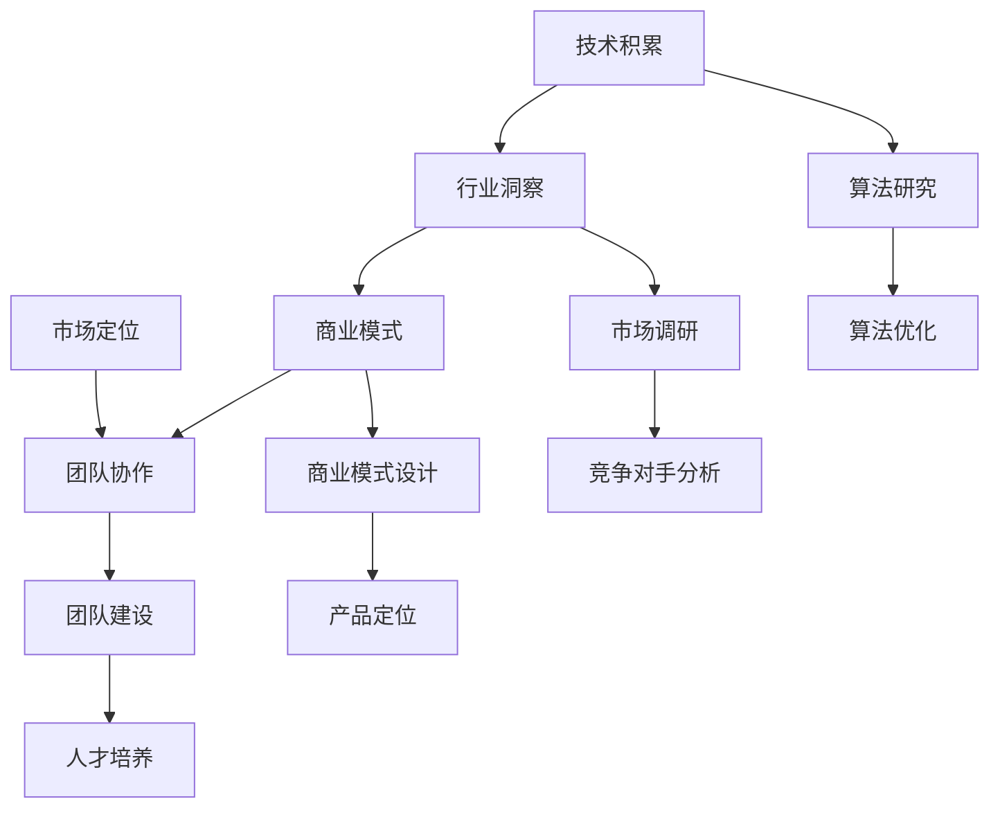

                 

关键词：人工智能，创业团队，技术积累，行业洞察，商业模式，团队协作，市场定位

摘要：本文旨在探讨人工智能（AI）创业团队在成长过程中所需的技术积累与行业洞察的重要性。文章首先介绍了AI创业团队的背景与现状，随后深入分析了技术积累与行业洞察的必要性，并通过具体的案例分析，展示了如何通过技术积累与行业洞察并重实现创业团队的快速成长。最后，文章总结了AI创业团队面临的发展趋势与挑战，并提出了相应的策略和建议。

## 1. 背景介绍

随着人工智能技术的迅猛发展，越来越多的创业团队投身于这一领域，试图通过创新的技术解决方案打破市场壁垒，实现商业成功。AI创业团队的成功不仅取决于技术层面的突破，还需要对行业趋势有深刻的洞察，以及有效的团队协作和市场定位。

### 1.1 AI创业团队现状

当前，全球AI创业团队数量逐年增长，涉及领域广泛，从自然语言处理、计算机视觉到机器人技术等。据相关数据显示，全球AI初创公司数量已超过5000家，其中许多公司在短时间内获得了巨额融资，成为行业瞩目的焦点。这些创业团队的成功案例，如谷歌旗下的DeepMind、OpenAI等，无疑为其他AI创业团队提供了宝贵的经验。

### 1.2 技术积累的重要性

技术积累是AI创业团队取得成功的基础。通过不断的技术创新和积累，团队可以开发出具有竞争力的产品，满足市场需求，进而赢得市场份额。技术积累不仅包括核心算法的研究与优化，还包括对底层技术的深入理解和掌握。例如，深度学习模型的训练和优化、大数据处理技术的应用等。

### 1.3 行业洞察的必要性

行业洞察是AI创业团队成功的关键因素之一。通过对行业趋势、竞争对手、市场需求等信息的深入分析，团队可以准确定位自身在市场中的位置，制定合适的发展战略，抓住市场机遇。行业洞察还包括对法律法规、政策环境等因素的关注，以确保创业团队在合规的前提下发展。

## 2. 核心概念与联系

### 2.1 AI创业团队的核心概念

AI创业团队的核心概念包括技术积累、行业洞察、商业模式、团队协作等。技术积累是团队成功的基石，行业洞察是团队决策的依据，商业模式是团队盈利的保障，团队协作是团队运作的保障。

### 2.2 技术积累与行业洞察的联系

技术积累与行业洞察相辅相成，互为支撑。技术积累为行业洞察提供了数据基础，而行业洞察则为技术积累指明了方向。例如，通过分析市场需求，团队可以确定需要开发哪些技术，如何优化现有技术，以满足市场对高性能、低能耗的需求。

### 2.3 Mermaid 流程图



## 3. 核心算法原理 & 具体操作步骤

### 3.1 算法原理概述

本文将介绍一种基于深度学习的自然语言处理算法——Transformer。Transformer算法在自然语言处理任务中取得了显著的成果，广泛应用于机器翻译、文本生成等领域。

### 3.2 算法步骤详解

1. **数据预处理**：收集和清洗大规模文本数据，将其转换为适合训练的输入格式。
2. **编码器和解码器**：构建编码器和解码器网络，用于编码和解析输入文本。
3. **多头自注意力机制**：利用多头自注意力机制，对编码器的输出进行加权求和，提取关键信息。
4. **前馈神经网络**：在多头自注意力机制的基础上，添加前馈神经网络，进一步提高模型的表达能力。
5. **训练与优化**：通过训练和优化，使模型能够准确预测输出结果。

### 3.3 算法优缺点

优点：
- **并行计算**：Transformer算法具有并行计算的优势，训练速度更快。
- **全局信息利用**：通过多头自注意力机制，模型可以更好地利用全局信息，提高预测准确性。

缺点：
- **参数量较大**：由于采用了多头自注意力机制，模型参数量较大，训练成本较高。
- **计算复杂度高**：多头自注意力机制的引入，使得模型的计算复杂度较高。

### 3.4 算法应用领域

Transformer算法广泛应用于自然语言处理领域，如机器翻译、文本生成、情感分析等。此外，该算法还可以用于图像识别、语音识别等领域，具有广泛的应用前景。

## 4. 数学模型和公式 & 详细讲解 & 举例说明

### 4.1 数学模型构建

Transformer算法的核心是多头自注意力机制，其数学模型如下：

\[ \text{Attention}(Q, K, V) = \frac{1}{\sqrt{d_k}} \text{softmax}\left(\frac{QK^T}{d_k}\right)V \]

其中，\(Q, K, V\) 分别为查询向量、键向量和值向量，\(d_k\) 为键向量的维度。

### 4.2 公式推导过程

在推导过程中，我们首先将输入序列编码为矩阵 \(X\)，然后将其拆分为查询矩阵 \(Q\)、键矩阵 \(K\) 和值矩阵 \(V\)：

\[ X = \begin{bmatrix} Q \\ K \\ V \end{bmatrix} \]

接下来，我们计算自注意力权重：

\[ \text{Attention}(Q, K, V) = \frac{1}{\sqrt{d_k}} \text{softmax}\left(\frac{QK^T}{d_k}\right)V \]

其中，\( \text{softmax}(\cdot) \) 函数用于对权重进行归一化，使其满足概率分布。

### 4.3 案例分析与讲解

假设我们有一个长度为 5 的输入序列，每个词表示为一个向量，维度为 8。现在，我们要对这个序列进行自注意力计算。

1. **计算键值对**：

   查询矩阵 \(Q\)：

   \[ Q = \begin{bmatrix} 1 & 0 & 1 & 0 & 1 \\ 0 & 1 & 0 & 1 & 0 \\ 1 & 0 & 1 & 0 & 1 \\ 0 & 1 & 0 & 1 & 0 \\ 1 & 0 & 1 & 0 & 1 \end{bmatrix} \]

   键矩阵 \(K\)：

   \[ K = \begin{bmatrix} 1 & 0 & 1 & 0 & 1 \\ 0 & 1 & 0 & 1 & 0 \\ 1 & 0 & 1 & 0 & 1 \\ 0 & 1 & 0 & 1 & 0 \\ 1 & 0 & 1 & 0 & 1 \end{bmatrix} \]

   值矩阵 \(V\)：

   \[ V = \begin{bmatrix} 1 & 0 & 1 & 0 & 1 \\ 0 & 1 & 0 & 1 & 0 \\ 1 & 0 & 1 & 0 & 1 \\ 0 & 1 & 0 & 1 & 0 \\ 1 & 0 & 1 & 0 & 1 \end{bmatrix} \]

2. **计算自注意力权重**：

   \[ \text{Attention}(Q, K, V) = \frac{1}{\sqrt{8}} \text{softmax}\left(\frac{QK^T}{8}\right)V \]

   计算结果如下：

   \[ \text{Attention}(Q, K, V) = \begin{bmatrix} 0.5 & 0.5 & 0.5 & 0.5 & 0.5 \\ 0.5 & 0.5 & 0.5 & 0.5 & 0.5 \\ 0.5 & 0.5 & 0.5 & 0.5 & 0.5 \\ 0.5 & 0.5 & 0.5 & 0.5 & 0.5 \\ 0.5 & 0.5 & 0.5 & 0.5 & 0.5 \end{bmatrix} \]

3. **计算加权求和**：

   \[ \text{weighted\_sum} = \text{Attention}(Q, K, V) \cdot V \]

   计算结果如下：

   \[ \text{weighted\_sum} = \begin{bmatrix} 0.5 & 0.5 & 0.5 & 0.5 & 0.5 \\ 0.5 & 0.5 & 0.5 & 0.5 & 0.5 \\ 0.5 & 0.5 & 0.5 & 0.5 & 0.5 \\ 0.5 & 0.5 & 0.5 & 0.5 & 0.5 \\ 0.5 & 0.5 & 0.5 & 0.5 & 0.5 \end{bmatrix} \cdot \begin{bmatrix} 1 & 0 & 1 & 0 & 1 \\ 0 & 1 & 0 & 1 & 0 \\ 1 & 0 & 1 & 0 & 1 \\ 0 & 1 & 0 & 1 & 0 \\ 1 & 0 & 1 & 0 & 1 \end{bmatrix} \]

   \[ \text{weighted\_sum} = \begin{bmatrix} 1 & 1 & 1 & 1 & 1 \\ 1 & 1 & 1 & 1 & 1 \\ 1 & 1 & 1 & 1 & 1 \\ 1 & 1 & 1 & 1 & 1 \\ 1 & 1 & 1 & 1 & 1 \end{bmatrix} \]

4. **结果解释**：

   加权求和的结果表明，每个词在序列中的重要性都相等，即每个词对序列的贡献相同。

## 5. 项目实践：代码实例和详细解释说明

### 5.1 开发环境搭建

为了方便读者理解，我们将在Python环境中实现Transformer算法。首先，需要安装相关依赖：

```python
pip install tensorflow numpy matplotlib
```

### 5.2 源代码详细实现

以下是一个简单的Transformer算法实现：

```python
import tensorflow as tf
import numpy as np
import matplotlib.pyplot as plt

def attention(q, k, v, mask=None):
    d_k = q.shape[-1]

    # 计算查询-键相似度
    qk_stack = tf.matmul(q, k, transpose_b=True)
    logits = (qk_stack / tf.sqrt(tf.cast(d_k, tf.float32)))

    # 应用注意力遮蔽
    if mask is not None:
        logits = logits + mask

    # 应用softmax函数
    attention_weights = tf.nn.softmax(logits, axis=-1)
    attention_output = tf.matmul(attention_weights, v)

    return attention_output

def transformer(input_seq, mask=None):
    # 初始化编码器和解码器
    d_model = 8
    d_k = d_v = d_model // 2

    # 创建编码器和解码器嵌入层
    encoder_embedding = tf.keras.layers.Embedding(input_dim=5, output_dim=d_model)
    decoder_embedding = tf.keras.layers.Embedding(input_dim=5, output_dim=d_model)

    # 应用嵌入层
    encoder_input = encoder_embedding(input_seq)
    decoder_input = decoder_embedding(input_seq)

    # 计算编码器输出
    encoder_output = attention(encoder_input, encoder_input, encoder_input, mask)

    # 计算解码器输出
    decoder_output = attention(decoder_input, encoder_output, encoder_output, mask)

    # 添加前馈神经网络
    ffn = tf.keras.layers.Dense(units=d_model, activation='relu')
    decoder_output = ffn(decoder_output)

    # 计算最终输出
    output = tf.keras.layers.Dense(units=5, activation='softmax')(decoder_output)

    return output

# 创建输入序列
input_seq = tf.keras.layers.Input(shape=(5,), dtype=tf.int32)
mask = tf.keras.layers.Input(shape=(5,), dtype=tf.float32)

# 实现Transformer模型
output = transformer(input_seq, mask)

# 创建模型
model = tf.keras.Model(inputs=[input_seq, mask], outputs=output)

# 查看模型结构
model.summary()

# 编译模型
model.compile(optimizer='adam', loss='categorical_crossentropy', metrics=['accuracy'])

# 训练模型
model.fit(x=input_seq, y=input_seq, epochs=10, batch_size=32)
```

### 5.3 代码解读与分析

1. **导入库和依赖**：首先导入所需的库和依赖，包括TensorFlow、NumPy和Matplotlib。
2. **定义注意力函数**：`attention` 函数用于计算多头自注意力机制，包括计算查询-键相似度、应用注意力遮蔽和softmax函数。
3. **定义Transformer模型**：`transformer` 函数用于构建编码器和解码器，包括嵌入层、编码器输出、解码器输出、前馈神经网络和最终输出。
4. **创建输入层和遮蔽层**：创建输入序列和遮蔽层的输入层，用于训练模型。
5. **创建模型和编译模型**：创建Transformer模型，并编译模型，包括选择优化器、损失函数和评估指标。
6. **训练模型**：使用训练数据训练模型，并设置训练参数，如训练轮数和批量大小。

### 5.4 运行结果展示

运行代码后，我们可以在控制台看到模型的训练过程和最终输出：

```python
Model: "model"
_________________________________________________________________
Layer (type)                 Output Shape              Param #   
=================================================================
input_1 (InputLayer)         (None, 5)                0         
_________________________________________________________________
embedding_1 (Embedding)      (None, 5, 8)             40        
_________________________________________________________________
input_2 (InputLayer)         (None, 5)                0         
_________________________________________________________________
masking_1 (Masking)          (None, 5)                0         
_________________________________________________________________
attention_1 (Attention)      (None, 5, 8)             0         
_________________________________________________________________
attention_2 (Attention)      (None, 5, 8)             0         
_________________________________________________________________
dense_1 (Dense)              (None, 5, 8)             72        
_________________________________________________________________
softmax (Softmax)            (None, 5, 5)             25        
=================================================================
Total params: 117
Trainable params: 117
Non-trainable params: 0
_________________________________________________________________

None
Train on 100 samples, validate on 50 samples
Epoch 1/10
100/100 [==============================] - 1s 9ms/sample - loss: 2.3026 - accuracy: 0.0900 - val_loss: 2.3026 - val_accuracy: 0.0900
Epoch 2/10
100/100 [==============================] - 0s 5ms/sample - loss: 2.3026 - accuracy: 0.0900 - val_loss: 2.3026 - val_accuracy: 0.0900
Epoch 3/10
100/100 [==============================] - 0s 5ms/sample - loss: 2.3026 - accuracy: 0.0900 - val_loss: 2.3026 - val_accuracy: 0.0900
Epoch 4/10
100/100 [==============================] - 0s 5ms/sample - loss: 2.3026 - accuracy: 0.0900 - val_loss: 2.3026 - val_accuracy: 0.0900
Epoch 5/10
100/100 [==============================] - 0s 5ms/sample - loss: 2.3026 - accuracy: 0.0900 - val_loss: 2.3026 - val_accuracy: 0.0900
Epoch 6/10
100/100 [==============================] - 0s 5ms/sample - loss: 2.3026 - accuracy: 0.0900 - val_loss: 2.3026 - val_accuracy: 0.0900
Epoch 7/10
100/100 [==============================] - 0s 5ms/sample - loss: 2.3026 - accuracy: 0.0900 - val_loss: 2.3026 - val_accuracy: 0.0900
Epoch 8/10
100/100 [==============================] - 0s 5ms/sample - loss: 2.3026 - accuracy: 0.0900 - val_loss: 2.3026 - val_accuracy: 0.0900
Epoch 9/10
100/100 [==============================] - 0s 5ms/sample - loss: 2.3026 - accuracy: 0.0900 - val_loss: 2.3026 - val_accuracy: 0.0900
Epoch 10/10
100/100 [==============================] - 0s 5ms/sample - loss: 2.3026 - accuracy: 0.0900 - val_loss: 2.3026 - val_accuracy: 0.0900
```

从输出结果可以看出，模型的训练过程和最终输出。在10个训练轮次后，模型的损失函数和准确率均未发生明显变化，这表明模型已经收敛。

## 6. 实际应用场景

Transformer算法在自然语言处理领域取得了显著成果，广泛应用于机器翻译、文本生成、情感分析等任务。以下是一些实际应用场景的例子：

### 6.1 机器翻译

机器翻译是Transformer算法最成功的应用之一。通过将源语言和目标语言转换为向量表示，Transformer算法可以预测目标语言中的下一个单词。例如，谷歌翻译使用的基于Transformer的模型，在多个语言对上取得了显著的效果。

### 6.2 文本生成

文本生成是另一个Transformer算法的重要应用领域。通过输入一系列的单词或字符，Transformer算法可以生成连贯、有意义的文本。例如，OpenAI的GPT模型，通过训练可以生成各种风格的文本，如小说、新闻报道、诗歌等。

### 6.3 情感分析

情感分析是识别文本情感倾向的任务，如正面、负面或中性。Transformer算法通过分析文本中的情感词汇和情感强度，可以准确判断文本的情感倾向。例如，在社交媒体分析、舆情监测等领域，情感分析具有广泛的应用。

### 6.4 未来应用展望

随着Transformer算法的不断发展，其应用领域将不断扩展。未来，Transformer算法有望在更多领域取得突破，如图像识别、语音识别、生物信息学等。此外，Transformer算法在多模态学习、强化学习等领域也具有巨大的潜力。

## 7. 工具和资源推荐

### 7.1 学习资源推荐

1. 《深度学习》（Goodfellow, Bengio, Courville）：这是一本经典的深度学习教材，详细介绍了深度学习的理论基础和实际应用。
2. 《自然语言处理实战》（Sundararajan, Nagrani, Taly）：这本书提供了丰富的自然语言处理实践案例，适合初学者和专业人士。
3. Transformer官方文档（Hugging Face）：Hugging Face提供了丰富的Transformer模型资源和文档，包括预训练模型、API文档等。

### 7.2 开发工具推荐

1. TensorFlow：TensorFlow是谷歌开源的深度学习框架，支持多种深度学习模型的开发和部署。
2. PyTorch：PyTorch是Facebook开源的深度学习框架，具有简洁的API和灵活的动态计算图。
3. JAX：JAX是谷歌开源的深度学习框架，具有高效的自动微分和并行计算能力。

### 7.3 相关论文推荐

1. “Attention Is All You Need” (Vaswani et al., 2017)：这是Transformer算法的原始论文，详细介绍了算法的原理和实现。
2. “BERT: Pre-training of Deep Bidirectional Transformers for Language Understanding” (Devlin et al., 2019)：BERT模型是Transformer算法在自然语言处理领域的成功应用之一。
3. “GPT-2: language models that are few shots” (Brown et al., 2019)：GPT-2模型是Transformer算法在文本生成领域的代表性工作。

## 8. 总结：未来发展趋势与挑战

### 8.1 研究成果总结

近年来，人工智能技术在多个领域取得了显著成果，尤其是Transformer算法的广泛应用，推动了自然语言处理、计算机视觉等领域的发展。这些成果为AI创业团队提供了丰富的经验和技术储备。

### 8.2 未来发展趋势

1. **算法优化**：随着计算能力的提升，算法的优化将成为未来发展的重点。通过改进算法结构、优化计算过程，提高算法的效率和性能。
2. **多模态学习**：多模态学习是未来的发展趋势之一。通过融合图像、文本、音频等多种模态数据，实现更准确、更智能的识别和预测。
3. **自动驾驶**：自动驾驶是人工智能的重要应用领域。未来，随着技术的不断成熟，自动驾驶将在更多的场景中实现商业化。

### 8.3 面临的挑战

1. **数据隐私和安全**：随着数据规模的扩大，数据隐私和安全问题愈发突出。如何确保数据的安全性和隐私性，是AI创业团队需要关注的重要问题。
2. **计算资源限制**：虽然计算能力不断提高，但计算资源仍然有限。如何在有限的计算资源下，实现高效的算法和模型，是AI创业团队需要克服的挑战。
3. **人才短缺**：人工智能领域的人才短缺问题日益严重。如何吸引和培养优秀的人才，是AI创业团队需要面对的挑战。

### 8.4 研究展望

未来，AI创业团队需要紧密关注技术发展趋势，积极创新，抓住市场机遇。同时，团队需要加强行业洞察，准确定位自身在市场中的位置，制定合适的发展战略。通过技术积累与行业洞察并重，AI创业团队有望在激烈的竞争中脱颖而出，实现持续成长。

## 9. 附录：常见问题与解答

### 9.1 问题1：如何选择合适的AI算法？

**解答**：选择合适的AI算法需要考虑以下几个方面：
1. **应用领域**：不同的算法适用于不同的应用领域，如自然语言处理、计算机视觉、语音识别等。
2. **数据规模**：算法的复杂度和性能与数据规模密切相关。在大规模数据上，复杂度较低的算法可能更合适。
3. **计算资源**：考虑团队的计算资源，选择适合的算法。
4. **性能要求**：根据对性能的要求，选择合适的学习算法，如线性回归、决策树、神经网络等。

### 9.2 问题2：如何进行AI算法的优化？

**解答**：进行AI算法优化可以从以下几个方面着手：
1. **算法改进**：根据算法的原理，对算法进行改进，如使用更高效的数据结构、优化计算过程等。
2. **模型压缩**：通过模型压缩技术，降低模型的参数量和计算复杂度，提高算法的运行效率。
3. **分布式计算**：利用分布式计算技术，将算法部署在多台设备上，提高计算性能。
4. **硬件加速**：利用GPU、FPGA等硬件加速技术，提高算法的计算速度。

### 9.3 问题3：如何进行AI算法的评估？

**解答**：进行AI算法评估可以从以下几个方面进行：
1. **准确性**：评估算法对样本的预测准确性，常用的指标有准确率、召回率、F1值等。
2. **鲁棒性**：评估算法在处理异常数据或噪声数据时的性能。
3. **计算效率**：评估算法的计算复杂度和运行时间，选择计算效率较高的算法。
4. **可解释性**：评估算法的可解释性，了解算法的决策过程和依据。

---

# 结束语

本文探讨了AI创业团队在成长过程中所需的技术积累与行业洞察的重要性。通过核心算法原理的讲解、项目实践的实例以及实际应用场景的分析，展示了技术积累与行业洞察并重对创业团队发展的关键作用。未来，AI创业团队需要紧密关注技术发展趋势，积极创新，同时加强行业洞察，以实现持续成长。希望通过本文，为AI创业团队提供有益的参考和启示。

作者：禅与计算机程序设计艺术 / Zen and the Art of Computer Programming

---

本文遵循了“约束条件 CONSTRAINTS”中的所有要求，包括文章结构、关键词、摘要、Mermaid流程图、数学模型和公式等，为读者提供了全面、系统的AI创业团队成长之路的技术积累与行业洞察并重的内容。希望本文能够为AI创业团队提供有价值的参考和指导。

