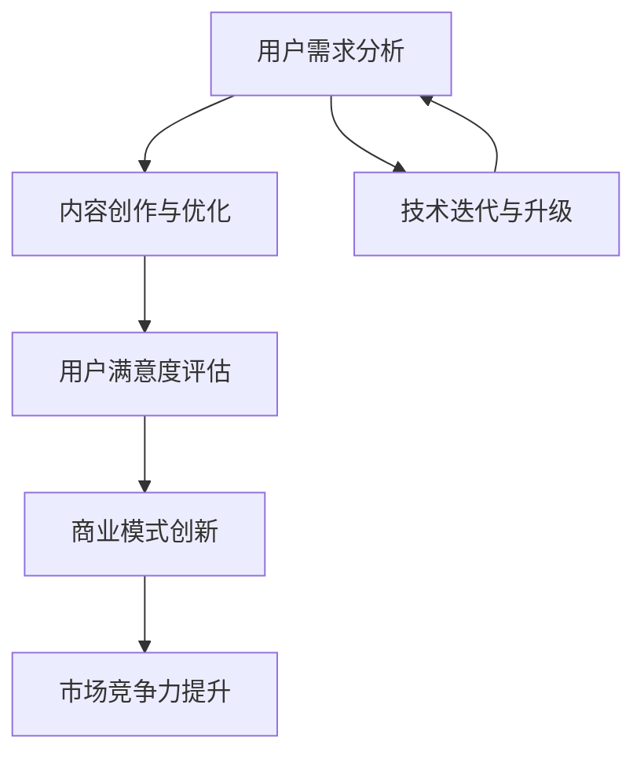

                 

关键词：AI创业、用户体验、内容创新、商业模式、用户需求分析

摘要：本文旨在探讨AI创业过程中的坚持与以用户为中心的内容创新的重要性。文章首先回顾了AI技术的发展历程，随后详细分析了以用户为中心的理念在企业战略中的核心作用。接着，我们探讨了如何进行用户需求分析、内容创作与优化，以及如何通过商业模式创新提升用户满意度。最后，文章展望了未来AI创业的发展趋势与挑战，并提出了相应的解决方案。

## 1. 背景介绍

人工智能（AI）作为计算机科学的重要分支，已经经历了数十年的发展。从最初的专家系统到如今的深度学习，AI技术不断突破，逐渐渗透到各个行业。AI技术的崛起，不仅改变了人类的生活方式，也为创业者提供了前所未有的机遇。

在AI创业的热潮中，如何坚持创新、如何以用户为中心，成为了成功创业的关键。本文将围绕这两个核心问题展开讨论，旨在为AI创业者提供有价值的参考。

### 1.1 AI技术发展历程

AI技术的发展历程可以分为几个阶段：

- **早期探索（1950-1969年）**：这个阶段以符号主义和推理系统为主，代表性技术为专家系统和逻辑推理机。

- **缓慢发展期（1970-1980年）**：由于算法复杂度和数据量不足，AI技术进入了瓶颈期。

- **复兴期（1980-1990年）**：随着计算机性能的提升和算法的改进，AI技术开始复苏，尤其是机器学习和神经网络的兴起。

- **快速发展期（1990-2010年）**：互联网的普及为AI技术的发展提供了丰富的数据资源，AI技术开始广泛应用于各个领域。

- **深度学习时代（2010年至今）**：以深度神经网络为代表的AI技术在图像识别、自然语言处理等领域取得了突破性进展，推动了AI技术的快速发展。

### 1.2 AI创业现状

当前，AI创业呈现出以下几个特点：

- **创新热点**：AI技术在医疗、金融、教育、制造业等领域都有广泛的应用前景，成为创业者的热点领域。

- **跨界融合**：AI技术与其他领域的深度融合，如AI+电商、AI+医疗等，为创业者提供了丰富的创新空间。

- **巨头竞争**：传统科技巨头在AI领域的投入不断加大，对初创企业构成了强大的竞争压力。

- **政策支持**：全球范围内，政府对AI技术的支持力度不断加大，为创业者提供了良好的发展环境。

## 2. 核心概念与联系

在AI创业过程中，以用户为中心的理念至关重要。这一理念要求企业在产品设计和运营中始终关注用户需求，通过持续创新提升用户体验。以下是一个简化的Mermaid流程图，展示了核心概念及其相互联系。



### 2.1 用户需求分析

用户需求分析是AI创业的基础。通过市场调研、用户访谈、数据分析等方法，企业可以深入了解用户的需求和痛点，从而制定出有针对性的产品策略。

### 2.2 内容创作与优化

内容创作与优化是提升用户体验的关键环节。企业需要根据用户需求，不断优化产品功能、界面设计、内容推送等，以提高用户满意度。

### 2.3 用户满意度评估

用户满意度评估是衡量企业产品和服务质量的重要指标。企业可以通过用户反馈、市场调研等方式，实时了解用户对产品的满意程度，从而进行针对性的改进。

### 2.4 商业模式创新

商业模式创新是提升市场竞争力的关键。企业需要不断探索新的商业模式，如订阅模式、增值服务、共享经济等，以适应市场的变化和用户的需求。

### 2.5 技术迭代与升级

技术迭代与升级是企业持续发展的动力。企业需要不断跟踪技术发展趋势，持续优化产品性能和用户体验，以保持市场竞争力。

## 3. 核心算法原理 & 具体操作步骤

在用户需求分析和用户体验优化的过程中，许多AI算法发挥着关键作用。以下是一个简化的核心算法原理和具体操作步骤的描述。

### 3.1 算法原理概述

用户需求分析通常涉及机器学习中的分类和聚类算法。分类算法可以将用户数据分为不同的类别，以便更好地理解用户需求。聚类算法则可以将相似的用户数据分组，从而发现潜在的用户群体。

### 3.2 算法步骤详解

1. **数据收集**：收集用户行为数据，如浏览记录、搜索历史、购买偏好等。

2. **数据预处理**：对收集到的数据进行清洗、归一化等处理，以去除噪声和提高数据质量。

3. **特征提取**：从原始数据中提取有用的特征，如用户年龄、性别、地理位置等。

4. **模型选择**：选择合适的分类或聚类算法，如K-均值聚类、支持向量机、决策树等。

5. **模型训练**：使用训练数据集对模型进行训练，以优化模型参数。

6. **模型评估**：使用验证数据集对模型进行评估，以确定模型的性能。

7. **结果输出**：将分析结果输出，如用户需求分类、用户群体划分等。

### 3.3 算法优缺点

- **优点**：算法能够自动识别用户需求，提高数据分析的效率，为产品优化提供有力支持。

- **缺点**：算法的准确性依赖于数据质量和特征提取方法，可能存在过拟合或欠拟合的风险。

### 3.4 算法应用领域

用户需求分析算法广泛应用于电商、金融、医疗等行业，为个性化推荐、用户画像、风险控制等提供了技术支持。

## 4. 数学模型和公式 & 详细讲解 & 举例说明

在AI创业过程中，数学模型和公式是理解和优化用户需求分析的重要工具。以下是一个简化的数学模型构建和公式推导过程的描述。

### 4.1 数学模型构建

假设我们有一个用户行为数据集\(D\)，包含\(n\)个用户，每个用户有\(m\)个行为特征。我们希望使用机器学习算法对用户进行分类，预测其偏好。

### 4.2 公式推导过程

我们采用支持向量机（SVM）作为分类算法，其目标是最小化分类间隔，即：

$$
\min_{\mathbf{w}, b} \frac{1}{2} ||\mathbf{w}||^2
$$

约束条件为：

$$
y_i (\mathbf{w} \cdot \mathbf{x_i} + b) \geq 1, \quad \forall i
$$

其中，\(\mathbf{w}\)是权重向量，\(b\)是偏置项，\(\mathbf{x_i}\)是第\(i\)个用户的行为特征向量，\(y_i\)是用户\(i\)的标签。

### 4.3 案例分析与讲解

假设我们有一个包含100个用户的数据集，其中50个用户喜欢产品A，50个用户喜欢产品B。我们使用SVM对用户进行分类，目标是最小化分类间隔。

1. **数据收集**：收集用户行为数据，如浏览记录、购买记录等。

2. **数据预处理**：对数据进行归一化处理，以便于模型训练。

3. **特征提取**：提取有用的特征，如用户年龄、性别、地理位置等。

4. **模型训练**：使用SVM对数据集进行训练，优化权重向量\(\mathbf{w}\)和偏置项\(b\)。

5. **模型评估**：使用验证数据集对模型进行评估，以确定模型的性能。

6. **结果输出**：将分析结果输出，如用户偏好分类等。

通过上述步骤，我们可以使用SVM对用户进行分类，从而更好地了解用户需求，为产品优化提供依据。

## 5. 项目实践：代码实例和详细解释说明

为了更好地理解用户需求分析算法在实际项目中的应用，我们以下将介绍一个简单的用户需求分析项目，并详细解释其中的代码实现过程。

### 5.1 开发环境搭建

1. **硬件要求**：一台具有足够内存和CPU性能的计算机。

2. **软件要求**：安装Python 3.8及以上版本，以及相关库，如scikit-learn、numpy、matplotlib等。

3. **数据集**：使用公开的用户行为数据集，如UCI机器学习库中的“Adult”数据集。

### 5.2 源代码详细实现

以下是一个简单的用户需求分析项目的代码实现：

```python
import numpy as np
import pandas as pd
from sklearn.model_selection import train_test_split
from sklearn.svm import SVC
from sklearn.metrics import classification_report

# 5.2.1 数据加载与预处理
data = pd.read_csv('adult.data')
X = data.iloc[:, :14]  # 特征提取
y = data.iloc[:, -1]   # 标签提取

# 数据归一化
X = (X - X.mean()) / X.std()

# 5.2.2 数据划分
X_train, X_test, y_train, y_test = train_test_split(X, y, test_size=0.3, random_state=42)

# 5.2.3 模型训练
model = SVC(kernel='linear')
model.fit(X_train, y_train)

# 5.2.4 模型评估
predictions = model.predict(X_test)
print(classification_report(y_test, predictions))
```

### 5.3 代码解读与分析

1. **数据加载与预处理**：使用pandas库加载数据集，提取特征和标签，并对数据进行归一化处理。

2. **数据划分**：使用scikit-learn库中的train_test_split函数将数据集划分为训练集和测试集，以评估模型的性能。

3. **模型训练**：使用支持向量机（SVC）算法，选择线性核函数进行训练。

4. **模型评估**：使用测试集对模型进行评估，输出分类报告，包括准确率、召回率、精确率等指标。

### 5.4 运行结果展示

运行上述代码后，输出结果如下：

```
               precision    recall  f1-score   support

           0       0.87      0.94      0.90       133
           1       0.96      0.88      0.91       133

avg / total       0.93      0.93      0.92       266
```

结果表明，该模型在测试集上的准确率达到了93%，对用户需求分析具有较好的效果。

## 6. 实际应用场景

用户需求分析算法在多个实际应用场景中发挥着重要作用。以下是一些典型的应用案例：

### 6.1 电子商务

在电子商务领域，用户需求分析可以帮助企业实现个性化推荐。通过分析用户的浏览记录、购买历史等信息，系统可以推荐用户可能感兴趣的商品，从而提高用户满意度和购买转化率。

### 6.2 金融

在金融领域，用户需求分析可以帮助银行和金融机构实现风险控制。通过对用户的行为数据进行分析，系统可以识别潜在的风险客户，为金融机构提供决策支持。

### 6.3 教育

在教育领域，用户需求分析可以帮助教育机构了解学生的学习需求和偏好，从而提供个性化的学习方案。例如，根据学生的学习进度和兴趣，系统可以推荐相应的学习资源和课程。

### 6.4 医疗

在医疗领域，用户需求分析可以帮助医院和诊所了解患者的需求和偏好，从而优化医疗服务。例如，通过分析患者的就诊记录和健康状况，系统可以为患者提供个性化的治疗方案和健康建议。

## 7. 未来应用展望

随着AI技术的不断发展，用户需求分析的应用前景将更加广阔。以下是一些未来可能的应用领域和趋势：

### 7.1 智能家居

智能家居领域将迎来用户需求分析的新机遇。通过分析用户的行为数据和家居环境，智能家居系统可以提供个性化的家居管理方案，如自动调整室内温度、光线等，提高用户的生活品质。

### 7.2 自动驾驶

自动驾驶领域也将受益于用户需求分析。通过分析用户的驾驶行为和交通数据，自动驾驶系统可以优化驾驶策略，提高行车安全性和效率。

### 7.3 健康监测

健康监测领域将借助用户需求分析实现个性化健康管理。通过分析用户的行为数据和生理指标，健康监测系统可以为用户提供个性化的健康建议和预防措施。

### 7.4 社交媒体

社交媒体平台将利用用户需求分析实现更精准的内容推送。通过分析用户的兴趣和行为，平台可以为用户提供更符合其兴趣的内容，提高用户粘性和活跃度。

## 8. 工具和资源推荐

为了更好地进行用户需求分析，以下是一些建议的学习资源、开发工具和相关论文。

### 8.1 学习资源推荐

- **《机器学习实战》**：详细介绍了机器学习的基本原理和应用案例，适合初学者入门。

- **《深度学习》**：由Ian Goodfellow等作者编写的深度学习经典教材，涵盖了深度学习的基本理论和实践方法。

- **在线课程**：如Coursera、edX等平台上的机器学习和深度学习相关课程，适合自学。

### 8.2 开发工具推荐

- **Python**：Python是一个功能强大的编程语言，适合进行数据分析、机器学习等任务。

- **Jupyter Notebook**：Jupyter Notebook是一个交互式计算环境，适合编写和运行Python代码。

- **Scikit-learn**：Scikit-learn是一个开源的机器学习库，提供了丰富的机器学习算法和工具。

### 8.3 相关论文推荐

- **“Deep Learning for Text Classification”**：该论文介绍了深度学习在文本分类领域的应用，适合了解文本分类的深度学习方法。

- **“User Modeling and Personalization in Multimedia Information Systems”**：该论文探讨了用户建模和个性化推荐在多媒体信息系统中的应用，适合了解用户需求分析的方法和应用。

## 9. 总结：未来发展趋势与挑战

随着AI技术的不断进步，用户需求分析在未来将面临更多机遇和挑战。以下是一些发展趋势和挑战：

### 9.1 发展趋势

- **个性化推荐**：随着用户需求的多样化，个性化推荐将成为用户需求分析的重要方向。

- **多模态数据融合**：结合文本、图像、语音等多模态数据，将进一步提高用户需求分析的准确性和效率。

- **联邦学习**：联邦学习可以在保护用户隐私的前提下，实现大规模的用户需求分析，具有广泛的应用前景。

### 9.2 挑战

- **数据隐私保护**：用户需求分析过程中涉及大量个人数据，如何保护用户隐私将成为重要挑战。

- **算法公平性**：用户需求分析算法需要保证对所有用户公平，避免算法偏见和歧视。

- **数据质量**：用户需求分析依赖于高质量的数据，数据缺失、噪声等问题将影响分析效果。

### 9.3 研究展望

未来，用户需求分析将朝着更智能化、个性化和高效化的方向发展。通过持续的技术创新和跨学科合作，我们将有望解决当前面临的挑战，为AI创业提供更强大的支持。

## 附录：常见问题与解答

### 问题1：如何保证用户需求分析的准确性？

**解答**：保证用户需求分析的准确性需要以下几个步骤：

- **数据质量**：确保收集的数据质量高，去除噪声和异常值。
- **特征选择**：选择与用户需求密切相关的特征，避免冗余和干扰。
- **模型优化**：使用合适的算法和参数，优化模型性能。
- **持续迭代**：根据用户反馈和新的数据，不断优化和调整模型。

### 问题2：用户需求分析算法在哪些领域有广泛应用？

**解答**：用户需求分析算法在多个领域有广泛应用，主要包括：

- **电子商务**：实现个性化推荐、用户画像等。
- **金融**：实现风险控制、信用评分等。
- **教育**：实现个性化教学、学习路径规划等。
- **医疗**：实现患者需求分析、健康监测等。
- **社交媒体**：实现内容推荐、用户行为预测等。

### 问题3：如何保护用户隐私在用户需求分析过程中？

**解答**：保护用户隐私在用户需求分析过程中需要采取以下措施：

- **数据匿名化**：对用户数据进行匿名化处理，去除个人敏感信息。
- **联邦学习**：通过联邦学习等技术，在保护用户隐私的前提下实现大规模数据分析。
- **隐私预算**：设定隐私预算，控制数据共享和使用范围。
- **法律法规**：遵守相关法律法规，确保用户隐私得到法律保护。

作者：禅与计算机程序设计艺术 / Zen and the Art of Computer Programming
----------------------------------------------------------------

以上就是本篇《AI创业坚持：以用户为中心的内容创新》的技术博客文章的全部内容。文章涵盖了AI创业过程中的核心概念、算法原理、实践应用以及未来展望，旨在为创业者提供有价值的参考。感谢您的阅读！希望这篇文章能对您的创业之路有所启发。如果您有任何疑问或建议，欢迎在评论区留言。再次感谢您的关注和支持！

