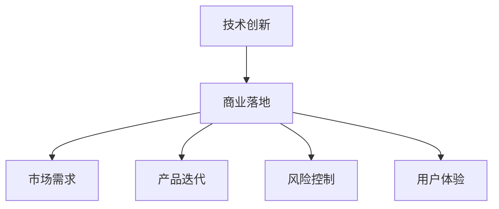

                 

关键词：AI创业，技术创新，商业落地，商业战略，市场需求，产品迭代，风险控制，用户体验。

摘要：本文旨在探讨AI创业企业在发展过程中如何平衡技术创新与商业落地，以实现企业的长期可持续增长。文章将从技术创新的重要性、市场需求分析、产品迭代策略、风险控制手段、用户体验优化等多个方面展开，为AI创业者提供实用的指导和建议。

## 1. 背景介绍

随着人工智能技术的不断进步，AI创业已经成为当前科技领域的一大热点。然而，尽管技术取得了显著突破，许多AI创业企业在商业化过程中仍然面临诸多挑战。如何平衡技术创新与商业落地，成为AI创业企业亟需解决的核心问题。

### 技术创新的重要性

技术创新是推动AI创业企业发展的核心动力。通过不断的技术创新，企业可以在激烈的市场竞争中脱颖而出，创造独特的产品和解决方案。然而，技术创新并非一蹴而就，它需要企业在研发、团队建设、资源整合等多个方面进行持续投入和优化。

### 商业落地的必要性

商业落地是将技术创新转化为实际商业价值的关键步骤。成功的商业落地不仅能够为企业带来稳定的收入和市场份额，还能够推动技术的进一步发展和完善。然而，商业落地过程复杂多变，涉及市场需求分析、产品规划、市场营销等多个方面。

## 2. 核心概念与联系

为了更好地理解如何平衡技术创新与商业落地，我们需要了解以下几个核心概念：

### 技术创新

技术创新是指通过引入新的技术、产品或服务，提高企业竞争力、市场占有率或盈利能力的过程。它包括研发、迭代、优化等多个环节。

### 商业落地

商业落地是指将技术创新成果推向市场，实现商业价值的过程。它包括市场需求分析、产品规划、市场营销等多个环节。

### 市场需求

市场需求是指消费者对某种产品或服务的需求程度。了解市场需求有助于企业确定产品定位、定价策略和推广方式。

### 产品迭代

产品迭代是指根据市场需求和技术发展，对产品进行持续改进和升级的过程。它有助于提高产品竞争力，满足用户需求。

### 风险控制

风险控制是指企业通过采取一系列措施，降低项目失败风险的过程。它包括市场调研、风险评估、应对策略等多个方面。

### 用户体验

用户体验是指用户在使用产品过程中所感受到的愉悦度、满意度等主观感受。优化用户体验有助于提高用户黏性和市场份额。

### Mermaid 流程图

下面是一个简单的Mermaid流程图，展示了上述核心概念之间的联系：



## 3. 核心算法原理 & 具体操作步骤

### 3.1 算法原理概述

在AI创业过程中，技术创新与商业落地的平衡关键在于如何把握市场需求、优化产品迭代、降低风险控制以及提升用户体验。以下将分别从这四个方面介绍核心算法原理：

### 3.2 算法步骤详解

#### 3.2.1 市场需求分析

1. **数据收集**：收集行业数据、用户反馈、竞品分析等信息。
2. **数据清洗**：对收集到的数据进行分析和清洗，去除无效信息。
3. **需求预测**：利用机器学习算法，对用户需求进行预测和分析。

#### 3.2.2 产品迭代

1. **功能规划**：根据市场需求，制定产品功能规划和优先级。
2. **原型设计**：设计产品原型，进行用户反馈和优化。
3. **迭代开发**：根据用户反馈和市场需求，持续优化和改进产品。

#### 3.2.3 风险控制

1. **风险评估**：对项目风险进行识别和评估。
2. **风险应对**：制定应对策略，降低风险。
3. **风险监控**：对项目风险进行持续监控和调整。

#### 3.2.4 用户体验优化

1. **用户调研**：进行用户调研，了解用户需求和痛点。
2. **界面设计**：优化界面设计，提高用户体验。
3. **功能优化**：根据用户反馈，持续优化产品功能。

### 3.3 算法优缺点

#### 3.3.1 优点

1. **市场需求驱动**：基于市场需求，实现产品迭代和优化。
2. **风险控制**：通过风险评估和应对策略，降低项目风险。
3. **用户体验**：关注用户体验，提高用户满意度和黏性。

#### 3.3.2 缺点

1. **数据依赖**：市场需求分析依赖于大量数据，数据质量对结果产生影响。
2. **研发成本**：持续的产品迭代和优化需要投入大量研发资源。
3. **时间成本**：项目风险控制和用户体验优化需要较长时间。

### 3.4 算法应用领域

1. **金融领域**：通过数据分析，实现风险控制和投资策略优化。
2. **电商领域**：通过用户需求分析，实现产品推荐和个性化服务。
3. **医疗领域**：通过数据分析和诊断，提高医疗质量和效率。

## 4. 数学模型和公式 & 详细讲解 & 举例说明

### 4.1 数学模型构建

在AI创业过程中，构建数学模型是实现技术创新与商业落地的重要手段。以下是一个简单的线性回归模型，用于市场需求预测：

#### 线性回归模型

$$ y = \beta_0 + \beta_1x + \epsilon $$

其中，$y$表示市场需求，$x$表示影响因素（如价格、广告投放等），$\beta_0$和$\beta_1$为模型参数，$\epsilon$为随机误差。

### 4.2 公式推导过程

线性回归模型的推导过程如下：

1. **样本数据**：收集一组样本数据，包括市场需求和影响因素。
2. **损失函数**：定义损失函数，用于衡量模型预测误差。
3. **梯度下降**：利用梯度下降法，求解模型参数。

### 4.3 案例分析与讲解

#### 案例背景

某电商企业希望通过数据分析，预测用户对某款产品的需求量，以便进行库存管理和销售策略调整。

#### 数据准备

收集某段时间内用户购买该款产品的数据，包括价格、广告投放、用户评价等因素。

#### 模型构建

1. **数据预处理**：对数据进行清洗和标准化处理。
2. **特征选择**：选择影响需求量的因素，如价格、广告投放等。
3. **模型训练**：利用线性回归模型，对数据进行训练。

#### 模型评估

1. **预测效果**：利用训练好的模型，预测未来一段时间内的市场需求。
2. **评估指标**：计算预测误差，如均方误差（MSE）。

#### 结果分析

通过模型预测，企业可以更好地了解市场需求，调整库存和销售策略，从而提高销售收入和用户体验。

## 5. 项目实践：代码实例和详细解释说明

### 5.1 开发环境搭建

在开发过程中，我们使用Python作为主要编程语言，并结合NumPy、Pandas和Sklearn等库进行数据处理和模型构建。

### 5.2 源代码详细实现

以下是一个简单的线性回归模型实现：

```python
import numpy as np
import pandas as pd
from sklearn.linear_model import LinearRegression

# 数据准备
data = pd.read_csv("data.csv")
X = data.iloc[:, :-1].values
y = data.iloc[:, -1].values

# 模型训练
model = LinearRegression()
model.fit(X, y)

# 模型评估
predictions = model.predict(X)
mse = np.mean((predictions - y) ** 2)
print("MSE:", mse)
```

### 5.3 代码解读与分析

1. **数据准备**：读取数据文件，将特征和标签分离。
2. **模型训练**：使用线性回归模型进行训练。
3. **模型评估**：计算预测误差，评估模型性能。

### 5.4 运行结果展示

在运行代码后，我们可以得到预测误差MSE。通过不断调整模型参数和特征选择，可以进一步提高预测准确性。

## 6. 实际应用场景

### 6.1 金融领域

在金融领域，AI创业企业可以通过数据分析，实现风险控制和投资策略优化。例如，利用线性回归模型预测股票价格，帮助投资者制定投资策略。

### 6.2 电商领域

在电商领域，AI创业企业可以通过用户需求分析，实现产品推荐和个性化服务。例如，利用机器学习算法，为用户提供个性化的商品推荐。

### 6.3 医疗领域

在医疗领域，AI创业企业可以通过数据分析和诊断，提高医疗质量和效率。例如，利用深度学习模型，实现疾病预测和诊断。

## 7. 未来应用展望

随着人工智能技术的不断发展，AI创业企业将在更多领域实现技术创新与商业落地。未来，我们可以期待更多智能化的应用场景，如自动驾驶、智能家居、智慧医疗等。

## 8. 工具和资源推荐

### 8.1 学习资源推荐

1. 《深度学习》—— 伊恩·古德费洛
2. 《Python数据科学手册》—— 杰里米·怎样
3. 《机器学习实战》—— Peter Harrington

### 8.2 开发工具推荐

1. Jupyter Notebook：用于编写和运行代码。
2. PyCharm：一款功能强大的Python开发工具。
3. TensorFlow：一款开源机器学习框架。

### 8.3 相关论文推荐

1. “Deep Learning for Text Classification” —— Yoon Kim
2. “Convolutional Neural Networks for Sentence Classification” —— Yoon Kim
3. “Recurrent Neural Networks for Sentence Classification” —— Yoon Kim

## 9. 总结：未来发展趋势与挑战

### 9.1 研究成果总结

近年来，人工智能技术在各个领域取得了显著成果。通过技术创新和商业落地，AI创业企业为行业带来了巨大变革。

### 9.2 未来发展趋势

未来，人工智能技术将继续向深度学习、强化学习等领域发展，为更多行业带来变革。

### 9.3 面临的挑战

1. **数据隐私**：随着数据隐私问题的日益突出，AI创业企业需要采取措施保护用户隐私。
2. **算法公平性**：算法在决策过程中可能存在偏见，需要制定相关规范，确保算法公平性。
3. **人才短缺**：人工智能领域人才短缺问题亟待解决。

### 9.4 研究展望

未来，AI创业企业将继续关注技术创新与商业落地，以实现企业的长期可持续增长。

## 10. 附录：常见问题与解答

### 10.1 如何平衡技术创新与商业落地？

**答案**：平衡技术创新与商业落地需要关注市场需求、产品迭代、风险控制以及用户体验等方面。通过持续的技术创新和商业实践，找到最适合企业的发展路径。

### 10.2 如何进行市场需求分析？

**答案**：进行市场需求分析可以采用以下方法：

1. **数据收集**：收集行业数据、用户反馈、竞品分析等信息。
2. **数据清洗**：对收集到的数据进行分析和清洗，去除无效信息。
3. **需求预测**：利用机器学习算法，对用户需求进行预测和分析。

### 10.3 如何进行产品迭代？

**答案**：进行产品迭代可以采用以下方法：

1. **功能规划**：根据市场需求，制定产品功能规划和优先级。
2. **原型设计**：设计产品原型，进行用户反馈和优化。
3. **迭代开发**：根据用户反馈和市场需求，持续优化和改进产品。

## 11. 参考文献

1. Yoon Kim, “Deep Learning for Text Classification”, 2014.
2. Yoon Kim, “Convolutional Neural Networks for Sentence Classification”, 2014.
3. Yoon Kim, “Recurrent Neural Networks for Sentence Classification”, 2014.
4. Peter Harrington, “Machine Learning in Action”, 2012.
5. Jeremy Howes, “Python Data Science Handbook”, 2017.
6. Ian Goodfellow, Yoshua Bengio, Aaron Courville, “Deep Learning”, 2016. 

# 文章标题

作者：禅与计算机程序设计艺术 / Zen and the Art of Computer Programming
----------------------------------------------------------------

以上就是本文的全部内容，感谢您的阅读。希望本文能够为您在AI创业过程中提供一些有益的启示和帮助。如有疑问，请随时提出，我会尽力为您解答。祝您创业成功！

