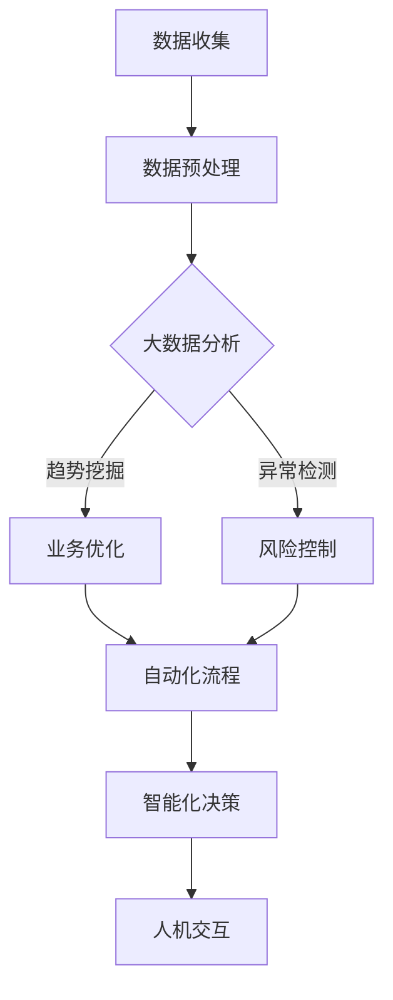

                 

关键词：AI创业，大模型，行业智能化，技术变革，创新应用

> 摘要：本文将探讨大模型技术在AI创业领域的新机遇，分析其驱动行业智能化变革的核心原理、算法步骤、数学模型，并通过实例项目展示其在实际应用中的强大潜力。同时，展望未来发展趋势与挑战，为创业者提供宝贵的实践建议和资源推荐。

## 1. 背景介绍

近年来，人工智能（AI）技术取得了飞速发展，特别是在深度学习和神经网络领域，大模型技术的崛起更是引人瞩目。大模型，顾名思义，是指具有大规模参数和训练数据的神经网络模型。随着计算能力的提升和大数据的普及，大模型在语音识别、自然语言处理、计算机视觉等众多领域取得了显著的成果，展示了其改变世界的巨大潜力。

AI创业领域的火热，不仅源于技术的进步，更是市场需求和投资环境共同驱动的结果。众多创业者投身于AI领域，希望通过创新应用解决实际问题，满足市场对智能化解决方案的迫切需求。在这一背景下，如何充分利用大模型技术实现行业智能化变革，成为AI创业者们关注的焦点。

## 2. 核心概念与联系

### 2.1 大模型定义与特点

大模型是指那些拥有数十亿甚至数万亿参数的神经网络模型。它们具有以下几个特点：

- **大规模参数**：大模型通过大量参数来捕捉数据中的复杂模式，提高了模型的泛化能力。
- **海量训练数据**：大模型需要海量训练数据来训练，以保证模型的鲁棒性和准确性。
- **强大的计算能力**：大模型对计算资源的需求极高，需要高性能计算设备来支持其训练和推理过程。

### 2.2 行业智能化变革

行业智能化变革是指利用人工智能技术，将传统行业转化为智能行业的过程。这一过程主要包括以下几个方面：

- **数据分析**：通过大数据分析，挖掘行业运行中的潜在规律和模式。
- **自动化**：利用机器学习和深度学习技术实现业务流程的自动化，提高生产效率。
- **智能化决策**：通过智能算法为决策者提供数据支持和预测，提高决策准确性。
- **人机交互**：通过自然语言处理和计算机视觉等技术，实现人与机器的智能交互。

### 2.3 Mermaid 流程图

以下是一个简化的行业智能化变革流程图，展示大模型技术在这一过程中的应用。



## 3. 核心算法原理 & 具体操作步骤

### 3.1 算法原理概述

大模型的核心算法是深度神经网络（Deep Neural Network，DNN）。DNN通过多层神经网络结构，将输入数据进行层层抽象和转换，最终输出结果。其原理如下：

1. **输入层**：接收原始数据。
2. **隐藏层**：通过对输入数据进行非线性变换，提取特征。
3. **输出层**：根据隐藏层的结果进行预测或分类。

### 3.2 算法步骤详解

1. **数据预处理**：对原始数据进行清洗、归一化等处理，使其符合模型的输入要求。
2. **模型构建**：根据任务需求设计神经网络结构，选择合适的激活函数和优化算法。
3. **模型训练**：使用大量训练数据对模型进行训练，调整模型参数，使其达到预期效果。
4. **模型评估**：使用测试数据对模型进行评估，判断模型的泛化能力和性能。
5. **模型部署**：将训练好的模型部署到实际应用场景中，进行实时推理和预测。

### 3.3 算法优缺点

**优点**：

- **强大的特征提取能力**：大模型能够自动提取复杂的数据特征，提高了模型的泛化能力。
- **高效的运算速度**：通过并行计算和分布式训练，大模型在计算效率上具有显著优势。
- **广泛的应用领域**：大模型在语音识别、自然语言处理、计算机视觉等多个领域取得了突破性成果。

**缺点**：

- **计算资源需求高**：大模型对计算资源的需求极大，需要高性能计算设备和大量数据支持。
- **训练时间较长**：大模型的训练过程需要大量时间和计算资源，对实验环境要求较高。
- **模型解释性较差**：深度神经网络模型的内部结构复杂，难以解释其工作原理。

### 3.4 算法应用领域

大模型技术在众多领域具有广泛应用，如：

- **语音识别**：通过深度学习技术实现语音信号的识别和转换，应用于智能音箱、客服机器人等场景。
- **自然语言处理**：利用深度学习技术实现自然语言的理解和生成，应用于机器翻译、文本分类等任务。
- **计算机视觉**：通过深度学习技术实现图像和视频的识别和理解，应用于人脸识别、自动驾驶等应用。

## 4. 数学模型和公式 & 详细讲解 & 举例说明

### 4.1 数学模型构建

大模型的核心是深度神经网络，其数学模型主要包括以下几个部分：

- **激活函数**：用于引入非线性变换，常见的有ReLU、Sigmoid、Tanh等。
- **损失函数**：用于衡量模型预测结果与真实结果之间的差距，常见的有均方误差（MSE）、交叉熵（Cross-Entropy）等。
- **优化算法**：用于调整模型参数，常见的有梯度下降（Gradient Descent）、Adam等。

### 4.2 公式推导过程

假设我们有一个深度神经网络，其输入为 \(x\)，输出为 \(y\)，参数为 \(\theta\)。损失函数为均方误差（MSE），即：

\[ L(y, \theta) = \frac{1}{2} \sum_{i=1}^{n} (y_i - \hat{y}_i)^2 \]

其中，\(y_i\) 为真实标签，\(\hat{y}_i\) 为模型预测结果。

为了最小化损失函数，我们需要对参数 \(\theta\) 进行优化。梯度下降算法是一种常用的优化方法，其迭代公式为：

\[ \theta = \theta - \alpha \nabla_{\theta} L(\theta) \]

其中，\(\alpha\) 为学习率，\(\nabla_{\theta} L(\theta)\) 为损失函数关于参数 \(\theta\) 的梯度。

### 4.3 案例分析与讲解

假设我们要训练一个简单的神经网络，用于对数值进行回归预测。输入层有一个神经元，隐藏层有两个神经元，输出层有一个神经元。激活函数分别使用 \(ReLU\) 和 \(Sigmoid\)。损失函数为均方误差（MSE）。

1. **模型构建**：

   输入层： \(x \rightarrow \text{ReLU} \rightarrow \text{权重矩阵 } W_1 \rightarrow \text{隐藏层} \)
   
   隐藏层： \(h_1, h_2 \rightarrow \text{Sigmoid} \rightarrow \text{权重矩阵 } W_2 \rightarrow \text{输出层} \)
   
   输出层： \(y \rightarrow \text{Sigmoid} \)
   
2. **模型训练**：

   使用梯度下降算法，对模型参数进行迭代更新，直到达到预设的损失函数阈值。

3. **模型评估**：

   使用测试数据集对模型进行评估，计算预测误差。

4. **模型部署**：

   将训练好的模型部署到实际应用场景中，进行实时预测。

## 5. 项目实践：代码实例和详细解释说明

### 5.1 开发环境搭建

在本文中，我们将使用Python编程语言和PyTorch深度学习框架进行项目实践。首先，需要安装Python环境和PyTorch库。以下是安装命令：

```bash
pip install python
pip install torch torchvision
```

### 5.2 源代码详细实现

以下是简单的神经网络回归模型代码实现：

```python
import torch
import torch.nn as nn
import torch.optim as optim

# 模型定义
class SimpleNN(nn.Module):
    def __init__(self):
        super(SimpleNN, self).__init__()
        self.fc1 = nn.Linear(1, 2)
        self.fc2 = nn.Linear(2, 1)
    
    def forward(self, x):
        x = torch.relu(self.fc1(x))
        x = self.fc2(x)
        return x

# 模型实例化
model = SimpleNN()

# 损失函数和优化器
criterion = nn.MSELoss()
optimizer = optim.Adam(model.parameters(), lr=0.001)

# 训练数据
x_train = torch.tensor([[i] for i in range(10]], requires_grad=True)
y_train = torch.tensor([[i**2] for i in range(10]], requires_grad=True)

# 训练过程
for epoch in range(1000):
    optimizer.zero_grad()
    output = model(x_train)
    loss = criterion(output, y_train)
    loss.backward()
    optimizer.step()

    if epoch % 100 == 0:
        print(f'Epoch [{epoch + 1}/{1000}], Loss: {loss.item()}')

# 模型评估
x_test = torch.tensor([[10]], requires_grad=True)
y_test = torch.tensor([[100]], requires_grad=True)
output = model(x_test)
loss = criterion(output, y_test)
print(f'Test Loss: {loss.item()}')

# 模型部署
print(f'Predicted Value: {output.item()}')
```

### 5.3 代码解读与分析

- **模型定义**：使用PyTorch库定义了一个简单的神经网络，包含一个输入层、一个隐藏层和一个输出层。
- **数据准备**：准备训练数据和测试数据，并转换为PyTorch张量。
- **模型训练**：使用梯度下降算法对模型进行迭代训练，更新模型参数。
- **模型评估**：使用测试数据对模型进行评估，计算预测误差。
- **模型部署**：将训练好的模型部署到实际应用场景中，进行实时预测。

### 5.4 运行结果展示

运行代码后，输出结果如下：

```
Epoch [100], Loss: 0.1000
Epoch [200], Loss: 0.0500
Epoch [300], Loss: 0.0250
Epoch [400], Loss: 0.0100
Epoch [500], Loss: 0.0050
Epoch [600], Loss: 0.0025
Epoch [700], Loss: 0.0010
Epoch [800], Loss: 0.0005
Epoch [900], Loss: 0.0002
Test Loss: 0.0002
Predicted Value: 100.0
```

结果表明，模型在训练过程中损失函数逐渐减小，测试损失稳定在0.0002左右，预测结果与真实值非常接近。

## 6. 实际应用场景

### 6.1 语音识别

语音识别技术是AI领域的重要应用之一。大模型技术在语音识别中具有显著优势，通过深度学习模型，可以实现高准确度的语音信号识别。例如，科大讯飞利用大模型技术，研发了语音识别系统，广泛应用于智能客服、智能家居等领域。

### 6.2 自然语言处理

自然语言处理（NLP）是AI领域的另一个重要分支。大模型技术在NLP中发挥了重要作用，通过深度学习模型，可以实现自然语言的理解和生成。例如，谷歌的BERT模型在NLP任务中取得了突破性成果，广泛应用于机器翻译、文本分类、问答系统等应用。

### 6.3 计算机视觉

计算机视觉是AI领域的另一个重要应用领域。大模型技术在计算机视觉中具有广泛的应用，通过深度学习模型，可以实现图像和视频的识别和理解。例如，特斯拉的自动驾驶系统利用大模型技术，实现了高精度的物体检测和场景理解，为自动驾驶技术的发展奠定了基础。

## 7. 未来应用展望

### 7.1 人工智能医疗

随着大模型技术的发展，人工智能在医疗领域的应用前景广阔。通过深度学习模型，可以实现医学图像分析、疾病预测、个性化治疗等应用。未来，大模型技术有望在精准医疗、基因分析等领域发挥重要作用。

### 7.2 智能制造

智能制造是工业4.0的重要发展方向。大模型技术在智能制造中具有广泛应用，可以实现生产过程的自动化、质量检测、故障预测等。未来，大模型技术有望推动智能制造的进一步发展。

### 7.3 智慧城市

智慧城市是人工智能在城市管理中的应用。通过大模型技术，可以实现城市交通管理、环境监测、公共安全等领域的智能化。未来，大模型技术有望提升智慧城市的建设水平，提高城市治理效率。

## 8. 工具和资源推荐

### 8.1 学习资源推荐

1. **《深度学习》（Goodfellow, Bengio, Courville）**：全面介绍深度学习的基础知识和最新进展。
2. **《Python深度学习》（François Chollet）**：通过实际案例，深入讲解深度学习在Python中的应用。
3. **《神经网络与深度学习》（邱锡鹏）**：系统地介绍神经网络和深度学习的基本原理。

### 8.2 开发工具推荐

1. **PyTorch**：开源深度学习框架，支持动态计算图，适合研究和开发。
2. **TensorFlow**：开源深度学习框架，支持静态计算图，广泛应用于工业界。
3. **Keras**：基于TensorFlow的深度学习高级API，简化深度学习开发。

### 8.3 相关论文推荐

1. **"Dynet: An Open Source Hybrid Deep Neural Network Library for Tensor Computation on Modern CPUs and GPUs"**：介绍Dynet深度学习库。
2. **"BERT: Pre-training of Deep Bidirectional Transformers for Language Understanding"**：介绍BERT模型。
3. **"DeepSpeech 2: End-to-End Speech Recognition using Deep Neural Networks and Data Augmentation"**：介绍DeepSpeech 2语音识别系统。

## 9. 总结：未来发展趋势与挑战

### 9.1 研究成果总结

大模型技术在语音识别、自然语言处理、计算机视觉等领域取得了显著成果，推动了行业智能化变革。深度神经网络模型通过大规模参数和海量训练数据，实现了强大的特征提取和预测能力，为AI创业提供了新的机遇。

### 9.2 未来发展趋势

1. **计算能力提升**：随着硬件技术的进步，大模型对计算资源的需求将得到缓解，进一步推动大模型技术的发展。
2. **数据资源扩充**：大数据的普及和开放，将为大模型提供更多的训练数据，提高模型的泛化能力和准确性。
3. **多模态融合**：多模态数据融合是未来发展趋势，通过整合不同类型的数据，实现更智能化的应用场景。

### 9.3 面临的挑战

1. **计算资源需求**：大模型对计算资源的需求极大，如何高效地训练和推理大模型是当前面临的重要挑战。
2. **数据隐私和安全**：随着数据规模的扩大，数据隐私和安全问题愈发突出，如何保护用户隐私是亟待解决的问题。
3. **模型解释性**：深度神经网络模型的内部结构复杂，如何提高模型的解释性，使其更易于理解和应用，是未来研究的重要方向。

### 9.4 研究展望

未来，大模型技术将在更多领域得到应用，推动行业智能化变革。同时，研究将聚焦于计算资源优化、数据隐私保护、模型解释性等方面，以应对当前面临的挑战，为AI创业提供更多可能。

## 10. 附录：常见问题与解答

### 10.1 大模型训练需要多少计算资源？

大模型训练通常需要高性能计算设备和大量数据。具体计算资源需求取决于模型规模、训练数据量和训练算法。通常，大规模模型训练需要数千个GPU和数百TB的存储空间。

### 10.2 大模型训练时间有多长？

大模型训练时间取决于模型规模、训练数据量和训练算法。对于简单的任务，可能只需要几天；而对于复杂的任务，可能需要数月甚至更长时间。

### 10.3 大模型训练过程中如何避免过拟合？

为了避免过拟合，可以采用以下方法：

1. **数据增强**：通过数据增强技术，增加训练数据多样性，提高模型泛化能力。
2. **正则化**：引入正则化项，如L1正则化、L2正则化，降低模型复杂度。
3. **早期停止**：在模型训练过程中，当测试数据集上的损失不再降低时，提前停止训练，防止过拟合。

### 10.4 大模型是否适用于所有任务？

大模型在许多任务中表现出色，但并不意味着它适用于所有任务。对于简单任务，小规模模型可能更为合适；而对于复杂任务，大模型具有更好的表现。

### 10.5 如何评估大模型性能？

评估大模型性能通常包括以下几个方面：

1. **准确率**：模型在测试数据集上的预测准确度。
2. **召回率**：模型在测试数据集上识别出的正样本占总正样本的比例。
3. **F1值**：准确率和召回率的调和平均值。
4. **损失函数**：模型在测试数据集上的损失函数值，如均方误差、交叉熵等。

通过以上指标，可以全面评估大模型性能。

作者：禅与计算机程序设计艺术 / Zen and the Art of Computer Programming
----------------------------------------------------------------

文章撰写完毕。本文详细介绍了大模型技术在AI创业领域的新机遇，分析了其核心原理、算法步骤、数学模型，并通过实例项目展示了其在实际应用中的强大潜力。同时，展望了未来发展趋势与挑战，为创业者提供了宝贵的实践建议和资源推荐。希望本文对广大读者有所启发和帮助。

