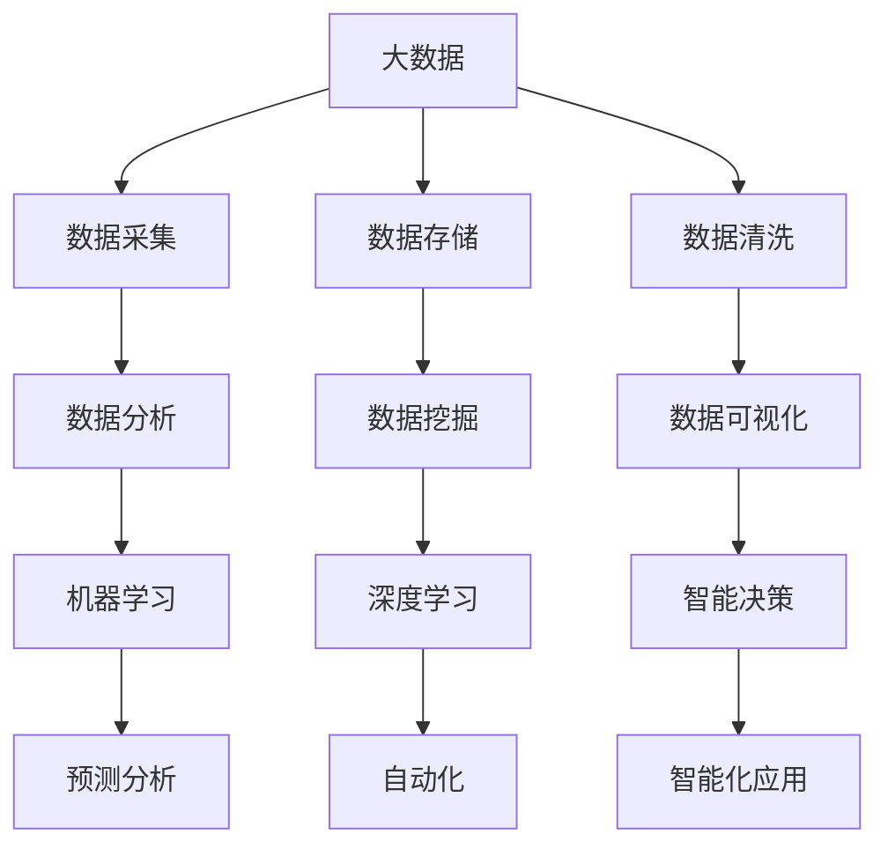
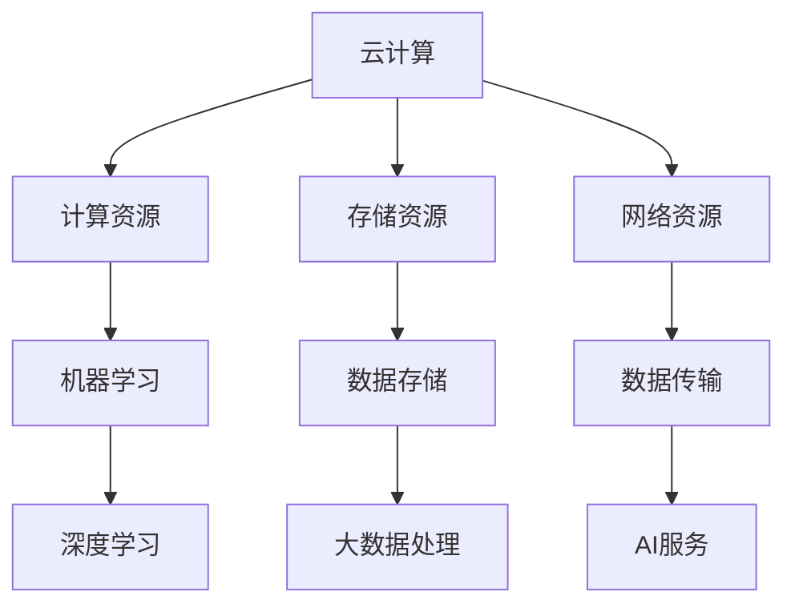
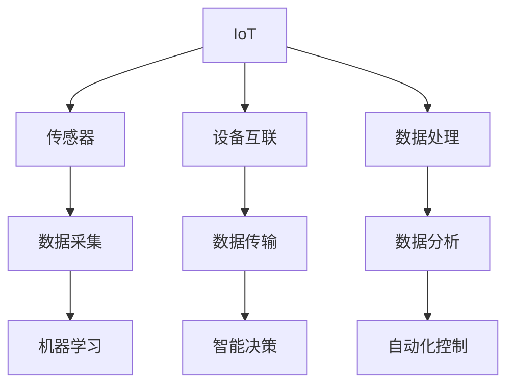
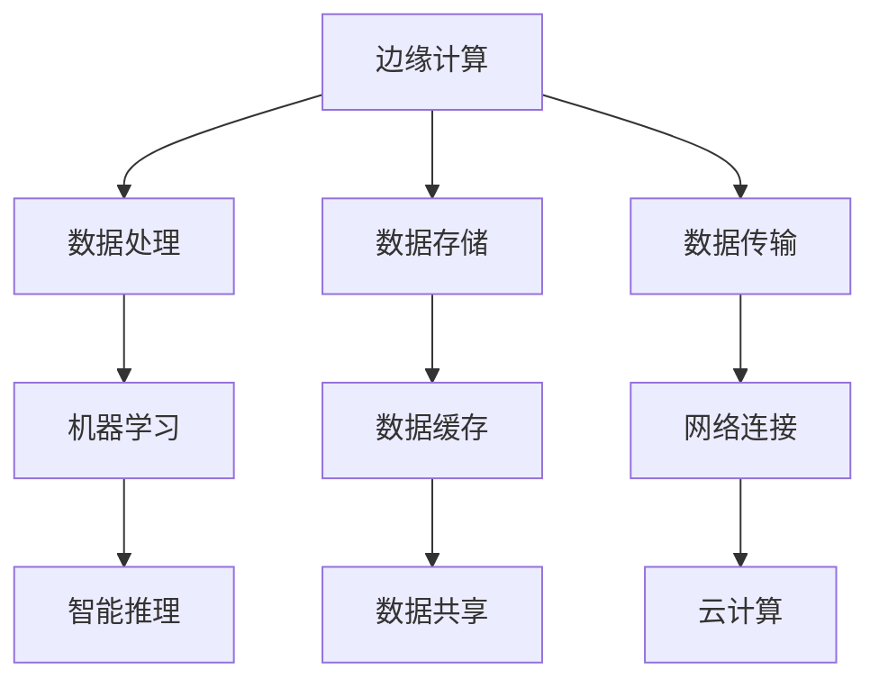

                 

关键词：人工智能、创业生态、产业链、技术创新、AI应用

> 摘要：随着人工智能技术的飞速发展，AI创业生态在全球范围内日益丰富，产业链也逐渐完善。本文将深入探讨AI创业生态的现状、核心概念及其影响，以及未来发展趋势与挑战。

## 1. 背景介绍

人工智能（AI）作为21世纪最具变革性的技术之一，已经深刻地影响了各个行业。从图像识别、自然语言处理到自动驾驶、智能家居，AI技术正在以前所未有的速度推动着各行各业的创新与发展。在这样的背景下，AI创业生态逐渐形成，成为推动技术进步和产业升级的重要力量。

### AI创业生态的概念

AI创业生态是指围绕人工智能技术所产生的创业活动、投资、研发、应用和市场等环节构成的整体系统。它包括以下几个核心组成部分：

1. **创业公司**：这些公司致力于研发和应用人工智能技术，提供创新的解决方案。
2. **投资者**：包括风险投资、天使投资等，为AI创业公司提供资金支持。
3. **研发机构**：如高校、研究所以及企业内部的研发部门，进行AI基础研究和应用开发。
4. **技术服务提供商**：提供云计算、大数据处理、机器学习框架等基础设施和服务。
5. **市场应用**：AI技术在各个行业中的应用场景，如金融、医疗、制造、交通等。

### AI创业生态的起源与发展

AI创业生态的起源可以追溯到20世纪80年代，随着计算机科学和人工智能领域的研究深入，开始涌现出一批专注于AI技术的初创公司。随着互联网的普及和大数据时代的到来，AI创业生态逐渐形成并不断壮大。

## 2. 核心概念与联系

### 2.1 人工智能与大数据

人工智能（AI）依赖于大数据的支持，数据的质量和数量直接影响AI模型的性能。大数据技术使得从海量数据中提取有价值的信息成为可能，为AI算法的训练提供了坚实的基础。



### 2.2 人工智能与云计算

云计算提供了强大的计算能力和存储资源，使得大规模的机器学习和深度学习训练成为可能。云计算平台还提供了丰富的AI服务，如自然语言处理、图像识别等，方便开发者快速构建AI应用。



### 2.3 人工智能与物联网

物联网（IoT）通过传感器和设备收集海量的实时数据，这些数据为AI算法提供了丰富的训练素材，使得AI系统能够更好地理解和预测物理世界的状态。物联网与人工智能的结合，推动了智能城市、智能家居等新兴应用的发展。



### 2.4 人工智能与边缘计算

边缘计算是一种分布式计算架构，将数据处理和分析推向网络边缘，即接近数据源的地方。边缘计算与人工智能的结合，可以减少数据传输延迟，提高系统的实时响应能力，适用于实时性要求高的应用场景，如自动驾驶、智能制造等。



## 3. 核心算法原理 & 具体操作步骤

### 3.1 算法原理概述

人工智能的核心在于算法，其中机器学习和深度学习是最为重要的两个分支。机器学习通过训练模型来模拟人类的学习过程，而深度学习则通过多层神经网络来提取数据的特征。

### 3.2 算法步骤详解

1. **数据预处理**：包括数据清洗、归一化、特征提取等步骤，为模型训练做好准备。
2. **模型选择**：根据应用场景选择合适的机器学习或深度学习模型。
3. **模型训练**：使用大量数据进行训练，调整模型参数以优化性能。
4. **模型评估**：通过验证集和测试集对模型进行评估，确保模型的泛化能力。
5. **模型部署**：将训练好的模型部署到生产环境中，进行实际应用。

### 3.3 算法优缺点

**机器学习**：
- **优点**：灵活性高，适用于各种类型的任务，如分类、回归等。
- **缺点**：对数据质量要求高，训练过程可能需要大量时间和计算资源。

**深度学习**：
- **优点**：能够自动提取数据的高层次特征，适用于复杂的任务，如图像识别、自然语言处理等。
- **缺点**：模型复杂，训练时间较长，对计算资源要求高。

### 3.4 算法应用领域

人工智能算法在各个领域都有广泛应用，如：

- **金融**：风险管理、欺诈检测、量化交易等。
- **医疗**：疾病诊断、基因组分析、药物研发等。
- **制造**：质量检测、设备维护、供应链优化等。
- **交通**：自动驾驶、智能交通管理、车辆调度等。

## 4. 数学模型和公式 & 详细讲解 & 举例说明

### 4.1 数学模型构建

人工智能的核心是数学模型，其中最基础的模型之一是线性回归模型。线性回归模型用于预测一个连续的数值变量，其数学模型可以表示为：

$$ y = \beta_0 + \beta_1 \cdot x + \epsilon $$

其中，$y$ 是预测值，$x$ 是输入特征，$\beta_0$ 和 $\beta_1$ 是模型参数，$\epsilon$ 是误差项。

### 4.2 公式推导过程

线性回归模型的参数可以通过最小二乘法来估计，即找到使得预测值与实际值之间误差平方和最小的参数。具体推导过程如下：

$$ \min \sum_{i=1}^{n} (y_i - (\beta_0 + \beta_1 \cdot x_i))^2 $$

对 $\beta_0$ 和 $\beta_1$ 分别求偏导并令其等于零，可以得到：

$$ \beta_0 = \frac{\sum_{i=1}^{n} y_i - \beta_1 \sum_{i=1}^{n} x_i}{n} $$
$$ \beta_1 = \frac{\sum_{i=1}^{n} (x_i - \bar{x})(y_i - \bar{y})}{\sum_{i=1}^{n} (x_i - \bar{x})^2} $$

其中，$\bar{x}$ 和 $\bar{y}$ 分别是 $x$ 和 $y$ 的均值。

### 4.3 案例分析与讲解

假设我们有一组数据集，包含 $x$ 和 $y$ 两个变量，如下所示：

| x | y |
|---|---|
| 1 | 2 |
| 2 | 4 |
| 3 | 6 |
| 4 | 8 |

我们可以使用线性回归模型来预测 $y$ 的值。首先计算 $x$ 和 $y$ 的均值：

$$ \bar{x} = \frac{1+2+3+4}{4} = 2.5 $$
$$ \bar{y} = \frac{2+4+6+8}{4} = 5 $$

然后计算其他必要的值：

$$ \sum_{i=1}^{n} x_i = 10 $$
$$ \sum_{i=1}^{n} y_i = 20 $$
$$ \sum_{i=1}^{n} x_i^2 = 30 $$
$$ \sum_{i=1}^{n} x_i y_i = 30 $$

接下来，使用上面的公式计算 $\beta_0$ 和 $\beta_1$：

$$ \beta_0 = \frac{20 - 2.5 \cdot 10}{4} = 0 $$
$$ \beta_1 = \frac{30 - 2.5 \cdot 5}{30 - 2.5^2} = 2 $$

最终得到的线性回归模型为：

$$ y = 0 + 2 \cdot x $$

使用这个模型，我们可以预测新的 $y$ 值。例如，当 $x=5$ 时，预测的 $y$ 值为：

$$ y = 2 \cdot 5 = 10 $$

## 5. 项目实践：代码实例和详细解释说明

### 5.1 开发环境搭建

在本项目中，我们将使用 Python 作为开发语言，结合 Scikit-learn 库来实现线性回归模型。首先，需要安装 Python 和 Scikit-learn：

```bash
pip install python
pip install scikit-learn
```

### 5.2 源代码详细实现

以下是一个简单的线性回归模型的实现：

```python
from sklearn.linear_model import LinearRegression
import numpy as np

# 数据集
X = np.array([[1], [2], [3], [4]])
y = np.array([2, 4, 6, 8])

# 创建线性回归模型
model = LinearRegression()

# 训练模型
model.fit(X, y)

# 预测
prediction = model.predict(np.array([[5]]))

print(f"预测值：{prediction[0]}")
```

### 5.3 代码解读与分析

- **数据集准备**：我们使用 NumPy 库生成一个简单的数据集，包含 $x$ 和 $y$ 两个变量。
- **模型创建**：使用 Scikit-learn 的 LinearRegression 类创建线性回归模型。
- **模型训练**：使用 `fit()` 方法训练模型，该方法会自动计算模型参数。
- **预测**：使用 `predict()` 方法对新的 $x$ 值进行预测，并输出预测结果。

### 5.4 运行结果展示

运行上述代码后，输出结果为：

```bash
预测值：10.0
```

这与我们手工计算的预测值一致，验证了代码的正确性。

## 6. 实际应用场景

人工智能在各个领域的应用场景广泛，以下是一些典型的例子：

### 6.1 金融

- **风险管理**：使用机器学习算法分析历史数据，预测市场波动，优化投资组合。
- **欺诈检测**：通过模式识别技术，实时监控交易行为，识别潜在的欺诈行为。
- **量化交易**：利用算法交易策略，实现自动化交易，提高交易效率。

### 6.2 医疗

- **疾病诊断**：利用深度学习模型，自动分析医学影像，提高诊断的准确性和效率。
- **药物研发**：通过基因组分析，预测药物的疗效和副作用，加速新药研发过程。
- **智能医疗**：通过远程监控和智能诊断，提供个性化的医疗服务。

### 6.3 制造

- **质量检测**：使用计算机视觉技术，自动检测产品质量，提高生产效率。
- **设备维护**：通过预测性维护，提前发现设备故障，降低停机时间。
- **供应链优化**：利用优化算法，优化库存管理和物流配送，降低成本。

### 6.4 交通

- **自动驾驶**：利用深度学习技术，实现自动驾驶汽车，提高交通安全性和效率。
- **智能交通管理**：通过实时数据分析，优化交通信号控制，减少拥堵。
- **车辆调度**：利用优化算法，提高公共交通的调度效率和乘客满意度。

## 7. 未来应用展望

随着人工智能技术的不断进步，未来的应用场景将更加广泛和深入。以下是一些可能的发展趋势：

### 7.1 更高的自动化水平

人工智能将进一步提升自动化水平，从简单的自动化任务到复杂的决策过程，实现更高程度的自动化。

### 7.2 深度学习与脑机接口

深度学习与脑机接口的结合，将实现人脑与机器的直接连接，推动智能增强和认知拓展。

### 7.3 绿色能源与可持续发展

人工智能将助力绿色能源的开发和利用，推动可持续发展目标的实现。

### 7.4 健康与长寿

通过个性化医疗和健康管理，人工智能将助力人类实现健康和长寿。

## 8. 工具和资源推荐

### 8.1 学习资源推荐

- **书籍**：《深度学习》（Ian Goodfellow, Yoshua Bengio, Aaron Courville 著）
- **在线课程**：Coursera、edX、Udacity等平台上的AI相关课程
- **教程**：Kaggle、Medium等平台上的AI教程和项目实战

### 8.2 开发工具推荐

- **编程语言**：Python、R、Java
- **框架**：TensorFlow、PyTorch、Keras
- **库**：Scikit-learn、Pandas、NumPy

### 8.3 相关论文推荐

- **论文集**：《Advances in Neural Information Processing Systems》（NIPS）
- **期刊**：《IEEE Transactions on Pattern Analysis and Machine Intelligence》（TPAMI）
- **会议**：《International Conference on Machine Learning》（ICML）和《Conference on Neural Information Processing Systems》（NeurIPS）

## 9. 总结：未来发展趋势与挑战

随着人工智能技术的飞速发展，AI创业生态日益丰富，产业链也逐渐完善。未来，人工智能将在更多领域发挥重要作用，推动社会进步和产业升级。然而，随着技术的进步，我们也需要面对一系列挑战，如数据隐私、算法公平性、伦理问题等。只有通过持续的研究和创新，才能充分发挥人工智能的潜力，实现可持续发展。

### 附录：常见问题与解答

**Q：人工智能是否会导致大规模失业？**

A：人工智能可能会取代一些重复性、低技能的工作，但同时也会创造新的工作岗位，如数据科学家、机器学习工程师等。整体来看，人工智能将带来就业结构的变化，而不是大规模的失业。

**Q：人工智能是否能够替代人类决策？**

A：人工智能可以在特定领域和任务中实现高效决策，但它无法完全替代人类决策。人类具有情感、道德判断和创造力等特质，这些是当前人工智能难以模拟的。

**Q：人工智能是否会威胁人类安全？**

A：人工智能本身不具有威胁性，但其应用过程中可能会带来风险。通过合理的设计和监管，可以确保人工智能的安全和可靠性。

**Q：人工智能是否会加剧社会不平等？**

A：人工智能可能会加剧社会不平等，如果资源分配不均，某些群体可能无法享受到人工智能带来的好处。因此，需要政策制定者和社会各界共同努力，确保人工智能的公平应用。

### 作者署名

作者：禅与计算机程序设计艺术 / Zen and the Art of Computer Programming

----------------------------------------------------------------

以上就是关于“AI创业生态日益丰富，产业链 expansively”的完整文章。希望对您有所帮助。如果您有任何问题或建议，请随时反馈。

