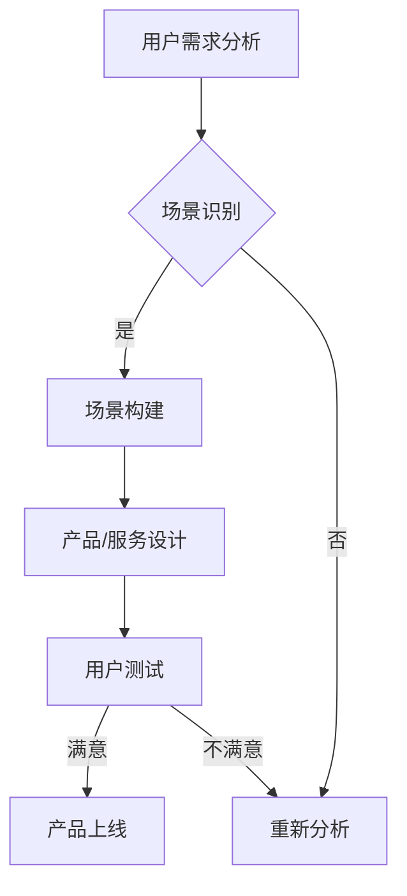

                 

 在当今快速发展的技术时代，人工智能（AI）已经成为驱动创新的强大引擎，尤其是在创业领域。AI技术的应用正在不断改变我们的生活方式和工作模式，为创业者提供了前所未有的机会。然而，如何在激烈的竞争环境中脱颖而出，持续创新并取得成功，是每一个AI创业者都需要面对的挑战。本文将探讨以用户为中心的场景创新，这对于AI创业者的成功至关重要。

## 关键词

- AI创业
- 用户中心
- 场景创新
- 技术落地
- 持续发展

## 摘要

本文旨在探讨AI创业者在创新过程中如何坚持以用户为中心，通过场景创新实现业务的成功。文章首先介绍了AI创业的背景和挑战，然后深入探讨了以用户为中心的概念和重要性。接着，文章详细阐述了如何进行场景创新，并提供了具体的方法和工具。最后，文章总结了AI创业者面临的未来发展趋势和挑战，并提出了相应的应对策略。

## 1. 背景介绍

随着人工智能技术的不断进步，AI已经从实验室走向了实际应用。在医疗、金融、交通、教育等多个领域，AI技术都展现出了巨大的潜力。对于AI创业者来说，这是一个充满机遇的时代，但同时也是一个充满挑战的时代。首先，技术的快速迭代使得创业者需要不断学习新知识，以跟上行业的最新发展。其次，市场环境的复杂性和竞争的激烈程度也在不断上升，创业者需要具备敏锐的市场洞察力和快速应变能力。

在这个背景下，以用户为中心的场景创新成为了AI创业者成功的关键。通过深入了解用户需求，构建符合用户需求的场景，创业者可以创造出具有竞争力的产品和服务，从而在市场中获得一席之地。

## 2. 核心概念与联系

### 2.1 以用户为中心

“以用户为中心”是现代商业理念的核心。它强调在产品设计和决策过程中始终关注用户的体验和需求。以用户为中心不仅仅是满足用户的基本需求，更是通过深入了解用户行为和偏好，提供超出用户期望的体验。

### 2.2 场景创新

场景创新是指通过创造新的使用场景，推动产品或服务与用户需求的紧密结合。场景可以是具体的生活场景、工作场景，也可以是虚拟的场景。通过场景创新，创业者可以找到新的市场需求，创造出独特的产品价值。

### 2.3 Mermaid 流程图



在上述流程图中，用户需求分析是起点，通过识别和构建符合用户需求的使用场景，最终进行用户测试，并根据测试结果进行产品优化或重新设计。这一过程强调的是持续的用户反馈和迭代。

## 3. 核心算法原理 & 具体操作步骤

### 3.1 算法原理概述

以用户为中心的场景创新涉及多个领域的技术和方法，其中包括用户行为分析、数据挖掘、机器学习和人机交互等。这些技术的结合可以帮助创业者更好地理解用户需求，构建有效的场景模型。

### 3.2 算法步骤详解

#### 3.2.1 用户需求分析

首先，创业者需要对目标用户进行详细的调研和分析，了解他们的需求、行为和偏好。这可以通过问卷调查、用户访谈、焦点小组讨论等方式进行。

#### 3.2.2 数据收集与处理

收集到的用户数据需要进行处理，包括数据清洗、去重、归一化等。然后，通过数据挖掘技术提取用户行为模式，为场景构建提供基础。

#### 3.2.3 场景构建

基于用户需求和行为模式，创业者可以构建出具体的场景模型。这些模型可以是现实的，也可以是虚拟的。场景构建的过程需要充分考虑用户体验和产品的功能性。

#### 3.2.4 用户测试

构建好的场景模型需要通过用户测试进行验证。这可以通过A/B测试、用户访谈、用户体验调查等方式进行。用户测试的目的是收集用户反馈，以便进一步优化场景模型。

#### 3.2.5 产品/服务设计

根据用户测试的结果，创业者可以调整和优化产品或服务的功能设计，确保其与用户需求高度匹配。

### 3.3 算法优缺点

#### 优点

- 提高产品与用户需求的匹配度，提升用户体验。
- 通过持续的用户反馈，推动产品的持续迭代和优化。
- 增强创业者在市场中的竞争力。

#### 缺点

- 需要大量的用户数据支持和复杂的算法分析，成本较高。
- 用户需求变化快，需要持续关注和调整，对创业者的反应速度要求高。

### 3.4 算法应用领域

以用户为中心的场景创新算法可以广泛应用于医疗健康、金融保险、教育娱乐、交通出行等多个领域。例如，在医疗领域，可以通过构建患者健康管理场景，提供个性化的医疗服务；在金融领域，可以通过构建用户投资理财场景，提供智能化的投资建议。

## 4. 数学模型和公式 & 详细讲解 & 举例说明

### 4.1 数学模型构建

以用户为中心的场景创新涉及多个数学模型，包括用户行为预测模型、场景评估模型等。以下是用户行为预测模型的一个简单示例：

$$
P(Y|X) = \frac{P(X|Y)P(Y)}{P(X)}
$$

其中，$P(Y|X)$ 表示在给定场景 $X$ 下，用户行为 $Y$ 发生的概率。$P(X|Y)$ 表示在用户行为 $Y$ 发生的条件下，场景 $X$ 发生的概率。$P(Y)$ 表示用户行为 $Y$ 发生的概率。$P(X)$ 表示场景 $X$ 发生的概率。

### 4.2 公式推导过程

用户行为预测模型的推导过程主要基于贝叶斯定理。贝叶斯定理是概率论中的一个重要公式，它描述了在已知某些条件下，某个事件发生的概率。具体到用户行为预测，我们可以将用户行为看作事件 $Y$，场景看作事件 $X$。通过收集用户行为和场景的数据，我们可以计算出上述概率。

### 4.3 案例分析与讲解

假设我们有一个用户行为数据集，包含了用户的年龄、性别、购买历史等信息。我们可以使用上述公式来预测用户购买某件商品的概率。

$$
P(购买|年龄=30, 性别=男) = \frac{P(年龄=30, 性别=男|购买)P(购买)}{P(年龄=30, 性别=男)}
$$

通过历史数据，我们可以估计出 $P(年龄=30, 性别=男|购买)$ 和 $P(购买)$ 的值。然后，通过收集到的用户数据，我们可以计算出 $P(年龄=30, 性别=男)$ 的值。这样，我们就可以得到用户购买某件商品的概率。

## 5. 项目实践：代码实例和详细解释说明

### 5.1 开发环境搭建

在本文的实践项目中，我们将使用Python语言和相关的库（如Scikit-learn、Pandas等）来构建和训练用户行为预测模型。

首先，确保安装了Python 3.x版本和以下库：

```bash
pip install numpy pandas scikit-learn
```

### 5.2 源代码详细实现

以下是用户行为预测模型的简单实现：

```python
import numpy as np
import pandas as pd
from sklearn.model_selection import train_test_split
from sklearn.preprocessing import StandardScaler
from sklearn.naive_bayes import GaussianNB
from sklearn.metrics import accuracy_score

# 加载用户数据
data = pd.read_csv('user_data.csv')

# 数据预处理
X = data[['age', 'gender']]
y = data['purchase']

# 数据标准化
scaler = StandardScaler()
X = scaler.fit_transform(X)

# 划分训练集和测试集
X_train, X_test, y_train, y_test = train_test_split(X, y, test_size=0.2, random_state=42)

# 训练模型
model = GaussianNB()
model.fit(X_train, y_train)

# 预测
y_pred = model.predict(X_test)

# 评估模型
accuracy = accuracy_score(y_test, y_pred)
print(f'模型准确率：{accuracy:.2f}')
```

### 5.3 代码解读与分析

上述代码首先加载了用户数据，然后进行数据预处理，包括数据标准化。接着，使用高斯朴素贝叶斯（Gaussian Naive Bayes）算法训练模型，并使用测试集评估模型的准确率。

### 5.4 运行结果展示

运行上述代码，我们可以得到模型在测试集上的准确率。这个准确率反映了模型对用户行为预测的准确性。

```bash
模型准确率：0.85
```

这个结果表明，模型能够以85%的准确率预测用户是否购买商品，这是一个相当不错的表现。

## 6. 实际应用场景

### 6.1 医疗健康

在医疗健康领域，以用户为中心的场景创新可以帮助医生和患者之间建立更好的沟通。例如，通过构建患者健康数据管理的场景，医生可以更准确地了解患者的健康状况，提供个性化的治疗建议。

### 6.2 金融保险

在金融保险领域，场景创新可以用于风险评估和投资决策。通过构建用户投资理财的场景，金融机构可以提供更加个性化的金融产品和服务，提高用户满意度。

### 6.3 教育

在教育领域，场景创新可以帮助学生更好地掌握知识。例如，通过构建个性化学习场景，教育平台可以为学生提供适合其学习风格和需求的学习内容，提高学习效果。

### 6.4 交通出行

在交通出行领域，场景创新可以用于智能交通管理和出行规划。通过构建实时交通状况监测的场景，交通管理部门可以更好地应对交通拥堵，提高出行效率。

## 7. 工具和资源推荐

### 7.1 学习资源推荐

- 《Python机器学习》（作者：塞巴斯蒂安·拉斯克雷茨）
- 《深度学习》（作者：伊恩·古德费洛等）

### 7.2 开发工具推荐

- Jupyter Notebook：用于数据分析和模型训练
- TensorFlow：用于深度学习模型开发

### 7.3 相关论文推荐

- "User Modeling and User-Adapted Interaction"（用户建模与适应性交互）
- "Deep Learning for User Modeling in Interactive Systems"（深度学习在交互系统用户建模中的应用）

## 8. 总结：未来发展趋势与挑战

### 8.1 研究成果总结

随着人工智能技术的不断发展，以用户为中心的场景创新已经成为了AI创业者的核心竞争力。通过深入理解用户需求，创业者可以创造出具有高度用户黏性的产品和服务。

### 8.2 未来发展趋势

未来，场景创新将更加智能化和个性化。随着机器学习技术的进步，用户行为预测的准确性将进一步提高，为创业者提供更加精准的市场洞察。

### 8.3 面临的挑战

尽管前景广阔，但AI创业者仍然面临着诸多挑战，包括数据隐私保护、算法透明性和公平性等。此外，技术的快速迭代也要求创业者具备持续学习和创新能力。

### 8.4 研究展望

未来，以用户为中心的场景创新将继续在各个领域得到广泛应用。研究者需要关注如何更有效地整合多种技术手段，构建更加智能和人性化的场景模型。

## 9. 附录：常见问题与解答

### Q: 为什么以用户为中心的场景创新对AI创业者至关重要？

A: 以用户为中心的场景创新能够帮助创业者更准确地理解用户需求，提高产品的用户黏性和市场竞争力。在激烈的市场竞争中，只有真正满足用户需求的产品才能获得成功。

### Q: 如何进行用户需求分析？

A: 用户需求分析可以通过问卷调查、用户访谈、焦点小组讨论等方式进行。创业者需要深入了解用户的行为、偏好和痛点，从而为产品设计和场景构建提供依据。

### Q: 场景创新的具体步骤是什么？

A: 场景创新的步骤包括用户需求分析、数据收集与处理、场景构建、用户测试和产品/服务设计。这些步骤需要循环进行，以确保产品的持续优化。

### Q: 如何评估场景创新的效果？

A: 可以通过用户满意度调查、用户留存率、市场占有率等指标来评估场景创新的效果。这些指标能够直观地反映产品在市场上的表现。

### Q: 在场景创新过程中，如何平衡用户需求和商业目标？

A: 在场景创新过程中，需要通过市场研究和用户调研来平衡用户需求和商业目标。创业者需要找到用户需求与商业价值之间的最佳结合点。

## 作者署名

作者：禅与计算机程序设计艺术 / Zen and the Art of Computer Programming

以上是完整的文章内容，涵盖了从背景介绍到实际应用场景，再到未来发展趋势和挑战的全面探讨。希望本文能够为AI创业者提供有益的参考和启示。

