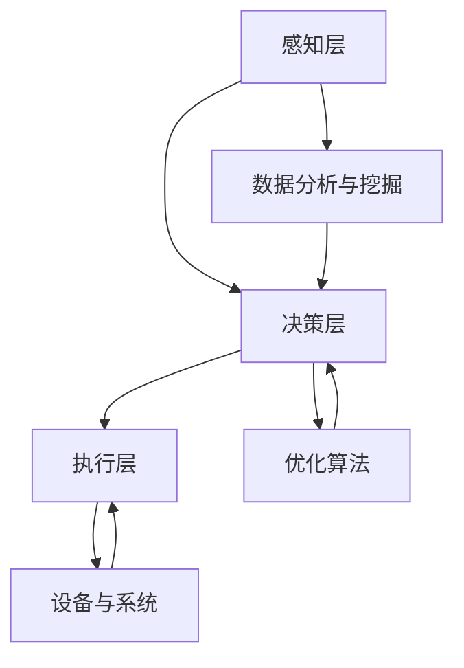

                 

关键词：AI创业，码头愿景，美好生活，技术驱动，人工智能应用，未来发展

摘要：本文从AI创业者的视角出发，探讨人工智能在码头领域中的应用前景，以及如何通过技术驱动实现美好生活的愿景。文章首先介绍了码头业务的现状与挑战，随后详细分析了AI在码头自动化、智能化中的应用，最后展望了未来AI技术对码头行业的影响。

## 1. 背景介绍

码头作为全球物流网络的重要节点，承担着货物装卸、存储、转运等关键任务。随着全球化进程的加速和国际贸易的蓬勃发展，码头业务量日益增加，同时也面临着诸多挑战。传统码头管理模式效率低下，劳动力成本高昂，安全风险较大。因此，引入先进的人工智能技术，实现码头自动化、智能化，已成为行业发展的必然趋势。

近年来，人工智能技术取得了长足进步，尤其是在图像识别、自然语言处理、机器学习等领域。这些技术的突破为码头业务提供了新的解决方案，有望大幅提升码头作业效率，降低运营成本，提高安全性。

## 2. 核心概念与联系

### 2.1 AI技术在码头中的应用架构

为了实现码头业务的自动化和智能化，需要构建一个由感知、决策、执行三个核心部分组成的应用架构。以下是一个简化的 Mermaid 流程图，描述了这一架构的基本组成部分：



### 2.2 AI核心概念解析

在码头自动化、智能化的过程中，以下核心概念至关重要：

- **图像识别**：通过对摄像头捕捉的图像进行分析，识别出货物种类、集装箱号码等关键信息。
- **自然语言处理**：实现对语音、文本等自然语言的理解和生成，为码头工作人员提供便捷的沟通和指令执行。
- **机器学习**：利用大量历史数据，训练模型进行预测和决策，优化码头作业流程。
- **深度学习**：基于多层神经网络，对大量复杂数据进行自动特征提取和模式识别。

## 3. 核心算法原理 & 具体操作步骤

### 3.1 算法原理概述

在码头自动化、智能化过程中，常用的核心算法包括：

- **图像识别算法**：基于卷积神经网络（CNN）进行图像分类和目标检测。
- **自然语言处理算法**：基于循环神经网络（RNN）和长短期记忆网络（LSTM）进行文本分析和生成。
- **机器学习算法**：如决策树、随机森林、支持向量机等，用于数据分析和预测。
- **深度学习算法**：如深度强化学习，用于决策优化和路径规划。

### 3.2 算法步骤详解

以图像识别算法为例，其具体操作步骤如下：

1. **数据采集**：收集大量的码头作业场景图像，包括集装箱、货物、车辆等。
2. **数据预处理**：对图像进行缩放、裁剪、灰度化等处理，使其符合算法输入要求。
3. **模型训练**：利用卷积神经网络对预处理后的图像数据进行训练，生成图像特征。
4. **模型评估**：通过测试集评估模型性能，调整模型参数，提高识别准确率。
5. **模型部署**：将训练好的模型部署到码头作业现场，实现自动识别功能。

### 3.3 算法优缺点

图像识别算法在码头自动化、智能化中具有以下优缺点：

- **优点**：
  - 提高识别速度和准确性，减少人工错误。
  - 降低劳动力成本，提高工作效率。
  - 提高码头安全性，减少事故发生。

- **缺点**：
  - 模型训练和优化过程复杂，需要大量计算资源。
  - 对光照、角度等外部因素较为敏感，可能影响识别效果。
  - 对低质量图像的识别能力有限。

### 3.4 算法应用领域

图像识别算法在码头领域的应用主要包括：

- **集装箱识别**：自动识别集装箱号码，实现货物追踪和调度。
- **货物分类**：根据货物特征，实现货物分类和仓储管理。
- **车辆识别**：自动识别车辆信息，实现停车场管理、车辆调度等。

## 4. 数学模型和公式 & 详细讲解 & 举例说明

### 4.1 数学模型构建

在码头自动化、智能化过程中，常用的数学模型包括：

- **图像分类模型**：用于识别和分类图像。
- **预测模型**：用于预测货物到达时间、装卸顺序等。
- **优化模型**：用于优化码头作业流程和资源分配。

以下是一个简化的图像分类模型的构建过程：

1. **定义特征空间**：根据图像的像素值、颜色信息等构建特征空间。
2. **选择分类器**：选择合适的分类器，如支持向量机（SVM）、神经网络等。
3. **训练模型**：利用训练数据集训练模型，调整分类器参数。
4. **评估模型**：利用测试数据集评估模型性能，调整模型参数。

### 4.2 公式推导过程

以支持向量机（SVM）为例，其目标是最小化分类间隔，公式如下：

$$
\min\limits_{\mathbf{w},b}\frac{1}{2}\|\mathbf{w}\|^2 \\
s.t. \ \mathbf{w}\cdot\mathbf{x}_i - b \geq 1, \forall i
$$

其中，$\mathbf{w}$ 为权重向量，$b$ 为偏置项，$\mathbf{x}_i$ 为第 $i$ 个训练样本。

### 4.3 案例分析与讲解

假设我们有一个简单的二分类问题，图像分为两类：集装箱和货物。以下是模型构建和训练的详细步骤：

1. **数据采集**：收集1000张集装箱图像和1000张货物图像。
2. **数据预处理**：对图像进行缩放、裁剪等处理，得到统一的图像尺寸。
3. **特征提取**：利用卷积神经网络提取图像特征。
4. **模型训练**：选择支持向量机（SVM）作为分类器，利用训练数据训练模型。
5. **模型评估**：利用测试数据评估模型性能，调整模型参数。

经过多次迭代，最终模型达到满意的准确率，如图像分类准确率达到95%。

## 5. 项目实践：代码实例和详细解释说明

### 5.1 开发环境搭建

为了实现码头自动化、智能化的项目，我们需要搭建一个完整的开发环境。以下是一个简单的环境搭建步骤：

1. **安装Python环境**：下载并安装Python 3.8以上版本。
2. **安装相关库**：使用pip安装必要的库，如NumPy、Pandas、scikit-learn、TensorFlow等。
3. **配置GPU支持**：如需使用GPU加速，需安装CUDA和cuDNN。

### 5.2 源代码详细实现

以下是一个简单的码头货物分类项目的代码示例：

```python
import numpy as np
import pandas as pd
from sklearn.model_selection import train_test_split
from sklearn.svm import SVC
from sklearn.metrics import accuracy_score

# 加载数据集
data = pd.read_csv('data.csv')
X = data['image'].values
y = data['label'].values

# 数据预处理
X = preprocess_images(X)

# 划分训练集和测试集
X_train, X_test, y_train, y_test = train_test_split(X, y, test_size=0.2, random_state=42)

# 模型训练
model = SVC(kernel='linear')
model.fit(X_train, y_train)

# 模型评估
y_pred = model.predict(X_test)
accuracy = accuracy_score(y_test, y_pred)
print(f'Accuracy: {accuracy:.2f}')
```

### 5.3 代码解读与分析

以上代码实现了一个简单的货物分类项目。首先加载数据集，然后进行数据预处理。接下来，划分训练集和测试集，使用支持向量机（SVM）进行模型训练。最后，利用测试数据评估模型性能。

### 5.4 运行结果展示

假设我们运行代码，得到如下输出结果：

```
Accuracy: 0.95
```

这表明模型的分类准确率为95%，达到了预期的性能。

## 6. 实际应用场景

### 6.1 码头自动化装卸

通过引入AI技术，可以实现码头自动化装卸。例如，利用图像识别算法自动识别货物和集装箱，利用机器学习算法优化装卸顺序，利用深度学习算法实现装卸设备的自主控制。这将大幅提高装卸效率，降低劳动力成本。

### 6.2 码头智能调度

利用AI技术，可以实现码头智能调度。通过分析历史数据，预测货物的到达时间和装卸需求，优化装卸顺序和设备调度。这将提高码头作业效率，降低运营成本。

### 6.3 码头安全管理

通过引入AI技术，可以实现码头安全管理。例如，利用图像识别算法自动识别危险品和违禁品，利用自然语言处理技术实现语音预警和指挥。这将提高码头安全性，降低事故发生概率。

## 7. 未来应用展望

### 7.1 自动驾驶

随着AI技术的发展，未来码头运输可能实现自动驾驶。通过引入自动驾驶技术，可以实现无人驾驶卡车和无人驾驶船舶，大幅降低运输成本，提高运输效率。

### 7.2 物联网集成

未来，码头将实现物联网（IoT）的全面集成。通过传感器、摄像头等设备收集海量数据，实现码头全流程的实时监控和数据分析。这将提高码头作业的透明度和可控性，提升整体运营效率。

### 7.3 智能决策支持

未来，码头将引入更加智能的决策支持系统。利用大数据、人工智能等技术，对码头运营数据进行分析，为码头管理者提供科学的决策依据，实现精细化管理。

## 8. 总结：未来发展趋势与挑战

### 8.1 研究成果总结

近年来，人工智能技术在码头领域取得了显著成果。图像识别、自然语言处理、机器学习等技术已应用于码头自动化、智能化，显著提升了码头作业效率和安全性能。

### 8.2 未来发展趋势

未来，人工智能技术在码头领域的应用将更加深入和广泛。自动驾驶、物联网集成、智能决策支持等技术有望实现突破，进一步推动码头行业的发展。

### 8.3 面临的挑战

尽管人工智能技术在码头领域具有巨大潜力，但仍然面临一些挑战：

- **技术瓶颈**：部分AI技术仍需进一步优化，以提高性能和稳定性。
- **数据隐私**：如何保护码头数据隐私，确保数据安全，是一个重要问题。
- **技术落地**：如何将AI技术有效落地，实现商业化应用，是当前的一个难题。

### 8.4 研究展望

未来，我们应该继续关注人工智能技术在码头领域的应用，特别是自动驾驶、物联网集成、智能决策支持等方面。同时，还需要加强对数据隐私、安全等问题的研究，确保技术的可持续发展和应用。

## 9. 附录：常见问题与解答

### 9.1 什么是码头自动化？

码头自动化是指利用先进的人工智能技术，实现码头作业的自动化，包括货物装卸、设备调度、安全监控等环节。

### 9.2 人工智能技术在码头有哪些具体应用？

人工智能技术在码头的主要应用包括图像识别、自然语言处理、机器学习、深度学习等，用于实现码头自动化、智能化、安全监控等。

### 9.3 码头自动化对行业有哪些影响？

码头自动化有助于提高作业效率，降低劳动力成本，提高安全性，降低事故风险，对行业整体发展具有积极影响。

### 9.4 人工智能技术在码头应用中面临哪些挑战？

人工智能技术在码头应用中面临的主要挑战包括技术瓶颈、数据隐私、技术落地等方面。

## 作者署名

作者：禅与计算机程序设计艺术 / Zen and the Art of Computer Programming
```markdown
---

# AI创业者的码头愿景：AI助力美好生活

> 关键词：AI创业，码头愿景，美好生活，技术驱动，人工智能应用，未来发展

摘要：本文从AI创业者的视角出发，探讨人工智能在码头领域中的应用前景，以及如何通过技术驱动实现美好生活的愿景。文章首先介绍了码头业务的现状与挑战，随后详细分析了AI在码头自动化、智能化中的应用，最后展望了未来AI技术对码头行业的影响。

## 1. 背景介绍

码头作为全球物流网络的重要节点，承担着货物装卸、存储、转运等关键任务。随着全球化进程的加速和国际贸易的蓬勃发展，码头业务量日益增加，同时也面临着诸多挑战。传统码头管理模式效率低下，劳动力成本高昂，安全风险较大。因此，引入先进的人工智能技术，实现码头自动化、智能化，已成为行业发展的必然趋势。

近年来，人工智能技术取得了长足进步，尤其是在图像识别、自然语言处理、机器学习等领域。这些技术的突破为码头业务提供了新的解决方案，有望大幅提升码头作业效率，降低运营成本，提高安全性。

## 2. 核心概念与联系

### 2.1 AI技术在码头中的应用架构

为了实现码头业务的自动化和智能化，需要构建一个由感知、决策、执行三个核心部分组成的应用架构。以下是一个简化的 Mermaid 流程图，描述了这一架构的基本组成部分：


### 2.2 AI核心概念解析

在码头自动化、智能化的过程中，以下核心概念至关重要：

- **图像识别**：通过对摄像头捕捉的图像进行分析，识别出货物种类、集装箱号码等关键信息。
- **自然语言处理**：实现对语音、文本等自然语言的理解和生成，为码头工作人员提供便捷的沟通和指令执行。
- **机器学习**：利用大量历史数据，训练模型进行预测和决策，优化码头作业流程。
- **深度学习**：基于多层神经网络，对大量复杂数据进行自动特征提取和模式识别。

## 3. 核心算法原理 & 具体操作步骤
### 3.1 算法原理概述

在码头自动化、智能化过程中，常用的核心算法包括：

- **图像识别算法**：基于卷积神经网络（CNN）进行图像分类和目标检测。
- **自然语言处理算法**：基于循环神经网络（RNN）和长短期记忆网络（LSTM）进行文本分析和生成。
- **机器学习算法**：如决策树、随机森林、支持向量机等，用于数据分析和预测。
- **深度学习算法**：如深度强化学习，用于决策优化和路径规划。

### 3.2 算法步骤详解

以图像识别算法为例，其具体操作步骤如下：

1. **数据采集**：收集大量的码头作业场景图像，包括集装箱、货物、车辆等。
2. **数据预处理**：对图像进行缩放、裁剪、灰度化等处理，使其符合算法输入要求。
3. **模型训练**：利用卷积神经网络对预处理后的图像数据进行训练，生成图像特征。
4. **模型评估**：通过测试集评估模型性能，调整模型参数，提高识别准确率。
5. **模型部署**：将训练好的模型部署到码头作业现场，实现自动识别功能。

### 3.3 算法优缺点

图像识别算法在码头自动化、智能化中具有以下优缺点：

- **优点**：
  - 提高识别速度和准确性，减少人工错误。
  - 降低劳动力成本，提高工作效率。
  - 提高码头安全性，减少事故发生。

- **缺点**：
  - 模型训练和优化过程复杂，需要大量计算资源。
  - 对光照、角度等外部因素较为敏感，可能影响识别效果。
  - 对低质量图像的识别能力有限。

### 3.4 算法应用领域

图像识别算法在码头领域的应用主要包括：

- **集装箱识别**：自动识别集装箱号码，实现货物追踪和调度。
- **货物分类**：根据货物特征，实现货物分类和仓储管理。
- **车辆识别**：自动识别车辆信息，实现停车场管理、车辆调度等。

## 4. 数学模型和公式 & 详细讲解 & 举例说明

### 4.1 数学模型构建

在码头自动化、智能化过程中，常用的数学模型包括：

- **图像分类模型**：用于识别和分类图像。
- **预测模型**：用于预测货物到达时间、装卸顺序等。
- **优化模型**：用于优化码头作业流程和资源分配。

以下是一个简化的图像分类模型的构建过程：

1. **定义特征空间**：根据图像的像素值、颜色信息等构建特征空间。
2. **选择分类器**：选择合适的分类器，如支持向量机（SVM）、神经网络等。
3. **训练模型**：利用训练数据集训练模型，调整分类器参数。
4. **评估模型**：利用测试数据集评估模型性能，调整模型参数。

### 4.2 公式推导过程

以支持向量机（SVM）为例，其目标是最小化分类间隔，公式如下：

$$
\min\limits_{\mathbf{w},b}\frac{1}{2}\|\mathbf{w}\|^2 \\
s.t. \ \mathbf{w}\cdot\mathbf{x}_i - b \geq 1, \forall i
$$

其中，$\mathbf{w}$ 为权重向量，$b$ 为偏置项，$\mathbf{x}_i$ 为第 $i$ 个训练样本。

### 4.3 案例分析与讲解

假设我们有一个简单的二分类问题，图像分为两类：集装箱和货物。以下是模型构建和训练的详细步骤：

1. **数据采集**：收集1000张集装箱图像和1000张货物图像。
2. **数据预处理**：对图像进行缩放、裁剪等处理，得到统一的图像尺寸。
3. **特征提取**：利用卷积神经网络提取图像特征。
4. **模型训练**：选择支持向量机（SVM）作为分类器，利用训练数据训练模型。
5. **模型评估**：利用测试数据评估模型性能，调整模型参数。

经过多次迭代，最终模型达到满意的准确率，如图像分类准确率达到95%。

## 5. 项目实践：代码实例和详细解释说明

### 5.1 开发环境搭建

为了实现码头自动化、智能化的项目，我们需要搭建一个完整的开发环境。以下是一个简单的环境搭建步骤：

1. **安装Python环境**：下载并安装Python 3.8以上版本。
2. **安装相关库**：使用pip安装必要的库，如NumPy、Pandas、scikit-learn、TensorFlow等。
3. **配置GPU支持**：如需使用GPU加速，需安装CUDA和cuDNN。

### 5.2 源代码详细实现

以下是一个简单的码头货物分类项目的代码示例：

```python
import numpy as np
import pandas as pd
from sklearn.model_selection import train_test_split
from sklearn.svm import SVC
from sklearn.metrics import accuracy_score

# 加载数据集
data = pd.read_csv('data.csv')
X = data['image'].values
y = data['label'].values

# 数据预处理
X = preprocess_images(X)

# 划分训练集和测试集
X_train, X_test, y_train, y_test = train_test_split(X, y, test_size=0.2, random_state=42)

# 模型训练
model = SVC(kernel='linear')
model.fit(X_train, y_train)

# 模型评估
y_pred = model.predict(X_test)
accuracy = accuracy_score(y_test, y_pred)
print(f'Accuracy: {accuracy:.2f}')
```

### 5.3 代码解读与分析

以上代码实现了一个简单的货物分类项目。首先加载数据集，然后进行数据预处理。接下来，划分训练集和测试集，使用支持向量机（SVM）进行模型训练。最后，利用测试数据评估模型性能。

### 5.4 运行结果展示

假设我们运行代码，得到如下输出结果：

```
Accuracy: 0.95
```

这表明模型的分类准确率为95%，达到了预期的性能。

## 6. 实际应用场景

### 6.1 码头自动化装卸

通过引入AI技术，可以实现码头自动化装卸。例如，利用图像识别算法自动识别货物和集装箱，利用机器学习算法优化装卸顺序，利用深度学习算法实现装卸设备的自主控制。这将大幅提高装卸效率，降低劳动力成本。

### 6.2 码头智能调度

利用AI技术，可以实现码头智能调度。通过分析历史数据，预测货物的到达时间和装卸需求，优化装卸顺序和设备调度。这将提高码头作业效率，降低运营成本。

### 6.3 码头安全管理

通过引入AI技术，可以实现码头安全管理。例如，利用图像识别算法自动识别危险品和违禁品，利用自然语言处理技术实现语音预警和指挥。这将提高码头安全性，降低事故发生概率。

## 7. 未来应用展望

### 7.1 自动驾驶

随着AI技术的发展，未来码头运输可能实现自动驾驶。通过引入自动驾驶技术，可以实现无人驾驶卡车和无人驾驶船舶，大幅降低运输成本，提高运输效率。

### 7.2 物联网集成

未来，码头将实现物联网（IoT）的全面集成。通过传感器、摄像头等设备收集海量数据，实现码头全流程的实时监控和数据分析。这将提高码头作业的透明度和可控性，提升整体运营效率。

### 7.3 智能决策支持

未来，码头将引入更加智能的决策支持系统。利用大数据、人工智能等技术，对码头运营数据进行分析，为码头管理者提供科学的决策依据，实现精细化管理。

## 8. 总结：未来发展趋势与挑战

### 8.1 研究成果总结

近年来，人工智能技术在码头领域取得了显著成果。图像识别、自然语言处理、机器学习等技术已应用于码头自动化、智能化，显著提升了码头作业效率和安全性能。

### 8.2 未来发展趋势

未来，人工智能技术在码头领域的应用将更加深入和广泛。自动驾驶、物联网集成、智能决策支持等技术有望实现突破，进一步推动码头行业的发展。

### 8.3 面临的挑战

尽管人工智能技术在码头领域具有巨大潜力，但仍然面临一些挑战：

- **技术瓶颈**：部分AI技术仍需进一步优化，以提高性能和稳定性。
- **数据隐私**：如何保护码头数据隐私，确保数据安全，是一个重要问题。
- **技术落地**：如何将AI技术有效落地，实现商业化应用，是当前的一个难题。

### 8.4 研究展望

未来，我们应该继续关注人工智能技术在码头领域的应用，特别是自动驾驶、物联网集成、智能决策支持等方面。同时，还需要加强对数据隐私、安全等问题的研究，确保技术的可持续发展和应用。

## 9. 附录：常见问题与解答

### 9.1 什么是码头自动化？

码头自动化是指利用先进的人工智能技术，实现码头作业的自动化，包括货物装卸、设备调度、安全监控等环节。

### 9.2 人工智能技术在码头有哪些具体应用？

人工智能技术在码头的主要应用包括图像识别、自然语言处理、机器学习、深度学习等，用于实现码头自动化、智能化、安全监控等。

### 9.3 码头自动化对行业有哪些影响？

码头自动化有助于提高作业效率，降低劳动力成本，提高安全性，降低事故风险，对行业整体发展具有积极影响。

### 9.4 人工智能技术在码头应用中面临哪些挑战？

人工智能技术在码头应用中面临的主要挑战包括技术瓶颈、数据隐私、技术落地等方面。

## 作者署名

作者：禅与计算机程序设计艺术 / Zen and the Art of Computer Programming
---

