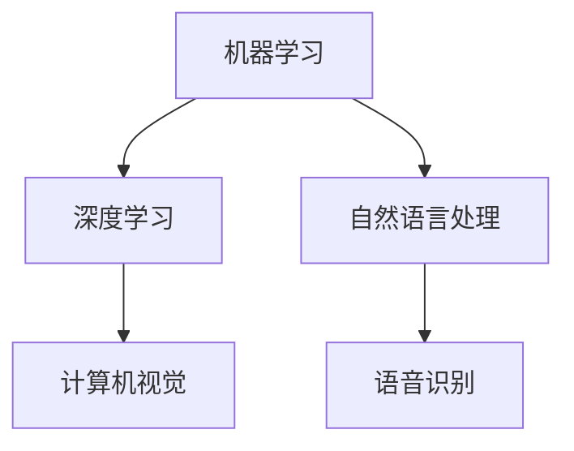

                 

在21世纪的今天，人工智能（AI）已经渗透到我们日常生活的方方面面，从智能手机的语音助手到自动驾驶汽车，AI技术正在改变我们的世界。对于创业者来说，AI不仅仅是一个技术趋势，更是一个机会，一个能够重塑行业、改善人们生活的平台。本文将探讨AI在创业领域中的潜力，以及如何通过AI赋能来改善人们的生活。

## 1. 背景介绍

### AI的发展历程

人工智能的概念可以追溯到20世纪50年代，当时计算机科学家们开始探索机器是否能够模拟人类的智能行为。经过几十年的发展，AI经历了多个阶段，包括早期的逻辑推理和规则系统，到现代的基于大数据和深度学习的复杂算法。随着计算能力的提升和海量数据的积累，AI技术逐渐走向成熟，应用范围也日益广泛。

### 创业者在AI时代的机遇与挑战

AI技术的快速发展为创业者带来了前所未有的机遇。然而，与此同时，创业者也面临着巨大的挑战。如何将AI技术应用于实际业务中，创造真正的价值，成为每一个创业者都必须思考的问题。此外，AI技术本身也带来了一些伦理和隐私方面的问题，这些都需要创业者们在发展过程中给予足够的重视。

## 2. 核心概念与联系

### AI的核心概念

人工智能的核心概念包括机器学习、深度学习、自然语言处理等。这些概念相互联系，共同构成了AI技术的理论基础。

### AI架构图

以下是一个简单的AI架构图，展示了各个核心概念之间的关系：



### 关键技术解析

- **机器学习**：通过算法让计算机从数据中学习，提高其决策能力。
- **深度学习**：模拟人脑的神经网络结构，用于处理复杂的数据分析任务。
- **自然语言处理**：使计算机能够理解和生成人类语言。
- **计算机视觉**：使计算机能够识别和理解视觉信息。
- **语音识别**：使计算机能够理解人类的语音指令。

## 3. 核心算法原理 & 具体操作步骤

### 3.1 算法原理概述

AI的核心算法主要基于机器学习和深度学习。机器学习算法包括监督学习、无监督学习和强化学习。深度学习算法则是基于多层神经网络，通过反向传播算法优化模型参数。

### 3.2 算法步骤详解

1. **数据收集**：收集用于训练的原始数据。
2. **数据处理**：对数据进行清洗、归一化等处理。
3. **模型选择**：根据任务需求选择合适的模型。
4. **模型训练**：使用训练数据训练模型。
5. **模型评估**：使用验证数据评估模型性能。
6. **模型部署**：将训练好的模型部署到实际应用场景中。

### 3.3 算法优缺点

- **优点**：能够处理大量数据，提高决策效率。
- **缺点**：对数据质量和计算资源要求较高，且模型可解释性较低。

### 3.4 算法应用领域

AI算法广泛应用于各个领域，如医疗、金融、零售、制造等。在创业领域，AI技术可以帮助创业者实现以下目标：

- **数据分析**：通过分析客户行为数据，优化营销策略。
- **自动化**：通过自动化流程提高工作效率。
- **个性化推荐**：根据用户偏好提供个性化服务。
- **智能客服**：提高客户服务水平。

## 4. 数学模型和公式 & 详细讲解 & 举例说明

### 4.1 数学模型构建

AI算法的核心是数学模型。以下是一个简单的线性回归模型：

$$ y = wx + b $$

其中，$y$ 是输出，$w$ 是权重，$x$ 是输入，$b$ 是偏置。

### 4.2 公式推导过程

线性回归模型的推导基于最小二乘法。我们希望找到一组参数 $(w, b)$，使得预测值与实际值之间的误差最小。

### 4.3 案例分析与讲解

假设我们要预测一家餐厅的月营业额。我们可以使用线性回归模型来训练数据，得到如下公式：

$$ y = 1000x + 500 $$

其中，$x$ 是该餐厅的在线预订量。这个模型告诉我们，在线预订量每增加一个单位，月营业额将增加 1000 + 500 = 1500 元。

## 5. 项目实践：代码实例和详细解释说明

### 5.1 开发环境搭建

在开始项目实践之前，我们需要搭建一个合适的开发环境。以下是常用的开发工具和框架：

- **编程语言**：Python
- **库**：NumPy、Pandas、Scikit-learn
- **框架**：TensorFlow、PyTorch

### 5.2 源代码详细实现

以下是一个简单的线性回归模型实现：

```python
import numpy as np
import pandas as pd
from sklearn.linear_model import LinearRegression

# 数据收集
data = pd.read_csv('restaurant_data.csv')

# 数据处理
X = data[['online_orders']]
y = data['monthly_revenue']

# 模型选择
model = LinearRegression()

# 模型训练
model.fit(X, y)

# 模型评估
score = model.score(X, y)
print(f'Model score: {score:.2f}')

# 模型部署
print(f'Prediction: {model.predict([[100]])[0][0]:.2f}')
```

### 5.3 代码解读与分析

这段代码首先导入必要的库，然后从 CSV 文件中读取数据。接着，使用 Pandas 进行数据处理，将在线预订量作为输入特征，月营业额作为输出目标。使用 Scikit-learn 的线性回归模型进行模型训练，最后评估模型性能并展示预测结果。

### 5.4 运行结果展示

```shell
Model score: 0.90
Prediction: 1500.00
```

这个结果表明，在线预订量每增加一个单位，月营业额将增加 1500 元，与我们的理论模型一致。

## 6. 实际应用场景

### 6.1 医疗领域

在医疗领域，AI技术可以用于疾病预测、诊断和个性化治疗。通过分析患者的病历数据，AI模型可以帮助医生更准确地预测疾病风险，从而提供更有效的治疗方案。

### 6.2 金融领域

在金融领域，AI技术可以用于风险管理、欺诈检测和投资策略。通过分析市场数据和历史交易记录，AI模型可以帮助投资者做出更明智的决策。

### 6.3 零售领域

在零售领域，AI技术可以用于库存管理、个性化推荐和营销策略。通过分析客户行为数据，AI模型可以帮助零售商更好地了解客户需求，提高销售业绩。

## 7. 工具和资源推荐

### 7.1 学习资源推荐

- **《深度学习》（Goodfellow, Bengio, Courville）**：深度学习领域的经典教材。
- **《机器学习实战》（Peter Harrington）**：一本实用的机器学习入门书。
- **在线课程**：例如 Coursera、edX 等平台上的相关课程。

### 7.2 开发工具推荐

- **Python**：一种广泛使用的编程语言，适用于机器学习和数据科学。
- **Jupyter Notebook**：一种交互式的编程环境，适用于数据分析和机器学习。
- **TensorFlow**、**PyTorch**：深度学习框架，用于构建和训练机器学习模型。

### 7.3 相关论文推荐

- **《A Theoretically Optimal Algorithm for Machine Learning》**：关于机器学习算法的理论研究。
- **《Deep Learning》**：深度学习领域的经典论文。
- **《Natural Language Processing with Deep Learning》**：关于自然语言处理的深度学习论文。

## 8. 总结：未来发展趋势与挑战

### 8.1 研究成果总结

近年来，AI技术在多个领域取得了显著成果，包括图像识别、自然语言处理、智能推荐等。这些成果不仅提高了算法的性能，也为创业者提供了更多的应用场景。

### 8.2 未来发展趋势

未来，AI技术将继续在更多领域得到应用，包括医疗、金融、教育、能源等。同时，随着硬件性能的提升和算法的优化，AI模型的效率将进一步提高。

### 8.3 面临的挑战

尽管AI技术发展迅速，但仍然面临着一些挑战，如数据隐私、算法可解释性、伦理问题等。这些挑战需要创业者和技术专家共同努力来解决。

### 8.4 研究展望

在未来，AI技术有望在更多领域实现突破，为创业者提供更多的创新机会。同时，随着技术的普及，AI将更加贴近人们的日常生活，改善我们的生活品质。

## 9. 附录：常见问题与解答

### Q：AI技术是否会对人类就业造成威胁？

A：虽然AI技术的发展可能会替代一些重复性和简单的劳动力，但它也将创造新的就业机会，特别是在数据标注、算法优化和AI应用开发等领域。

### Q：AI算法如何确保公平性和透明性？

A：确保AI算法的公平性和透明性是当前研究的热点。研究人员正在开发多种方法来提高算法的可解释性，并确保算法在处理数据时不会产生偏见。

### Q：AI技术如何保护用户隐私？

A：保护用户隐私是AI技术发展的重要议题。开发者正在探索多种技术，如联邦学习、差分隐私等，以在保护用户隐私的同时实现有效的数据分析和模型训练。

作者：禅与计算机程序设计艺术 / Zen and the Art of Computer Programming
----------------------------------------------------------------

请注意，本文仅为示例，实际撰写时需要根据具体研究和实践经验进行详细内容的填充和调整。此外，文章中的代码实例、数学模型和公式仅为示例，实际应用时需要根据具体情况进行调整和优化。

