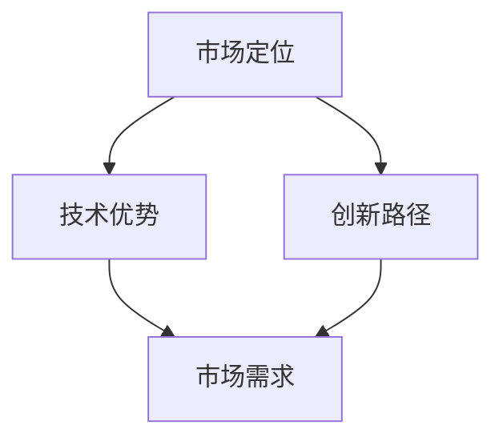

                 

 在当今快速发展的技术世界中，人工智能（AI）成为了推动创新和变革的核心力量。无论是大数据、机器学习，还是自然语言处理，AI技术的应用无处不在。然而，在这个浩瀚的领域里，如何找到一条适合自己的发展之路，对于AI创业者来说，无疑是一个至关重要的问题。本文将探讨AI创业者在选择垂直领域时的一些策略和思考，帮助您找到属于自己的码头。

## 文章关键词
- AI创业者
- 垂直领域
- 市场定位
- 技术优势
- 创新路径

## 文章摘要
本文旨在为AI创业者提供一些选择垂直领域的策略和建议。通过分析市场现状、技术优势和未来趋势，我们将探讨如何在竞争激烈的技术领域中找到突破口，打造具有竞争力的AI产品和服务。

## 1. 背景介绍
AI创业领域的竞争日益激烈，创业者需要具备敏锐的市场洞察力和扎实的技术功底。随着AI技术的不断进步，新兴领域不断涌现，但同时也意味着创业风险的增加。因此，选择一个合适的垂直领域，对于AI创业者的成功至关重要。

### 1.1 垂直领域的重要性
选择合适的垂直领域，有助于创业者集中资源，发挥自身优势，提高市场竞争力。垂直领域内的专业化分工，使得创业者能够更好地了解客户需求，提供定制化的解决方案。

### 1.2 市场现状
目前，AI技术在多个领域取得了显著的成果，如医疗、金融、交通、教育等。这些领域的市场需求庞大，但同时也面临着激烈的竞争。创业者需要找准市场空白点，挖掘潜在机会。

### 1.3 技术发展趋势
随着AI技术的不断发展，新型算法、数据挖掘和深度学习等技术在各个领域得到广泛应用。创业者需要紧跟技术发展趋势，寻找创新突破点。

## 2. 核心概念与联系
在探讨AI创业的垂直领域时，我们需要理解一些核心概念，如市场定位、技术优势、创新路径等。以下是一个简单的Mermaid流程图，展示这些概念之间的联系：



### 2.1 市场定位
市场定位是AI创业者首先要解决的问题。明确目标市场，有助于创业者更好地了解客户需求，制定合适的营销策略。市场定位需要考虑以下几个方面：

- **目标客户群体**：明确目标客户的年龄、性别、职业、收入水平等特征。
- **市场需求**：分析目标市场的需求特点，找到市场需求与自身技术优势的结合点。
- **竞争对手**：了解竞争对手的产品、市场占有率、营销策略等，为自己的产品定位提供参考。

### 2.2 技术优势
技术优势是AI创业者在市场竞争中的核心竞争力。在众多技术领域中，创业者需要找到自己擅长并具有优势的领域。以下是一些常见的技术优势：

- **算法创新**：开发具有自主知识产权的算法，提高产品的计算效率、准确性和稳定性。
- **数据处理能力**：具备强大的数据处理能力，能够处理海量数据，挖掘有价值的信息。
- **系统集成能力**：将AI技术与现有系统相结合，提供一站式解决方案。

### 2.3 创新路径
创新路径是指AI创业者在技术研发和市场推广中采取的策略。以下是一些常见的创新路径：

- **自主研发**：投入大量资源进行技术研发，打造具有自主知识产权的核心技术。
- **合作开发**：与其他企业、研究机构或高校合作，共同推进技术研发。
- **市场调研**：深入了解市场需求，根据客户需求调整产品功能和特性。

## 3. 核心算法原理 & 具体操作步骤
在AI创业过程中，算法原理和具体操作步骤至关重要。以下是一个简单的算法原理概述，以及具体的操作步骤。

### 3.1 算法原理概述
算法原理是AI创业者的核心技术。以下是一个示例：

- **深度学习**：通过多层神经网络模拟人脑的学习过程，实现数据的自动特征提取和分类。
- **强化学习**：通过试错和反馈机制，使智能体在特定环境中学会最优策略。

### 3.2 算法步骤详解
以下是深度学习算法的步骤详解：

1. **数据预处理**：对原始数据进行清洗、归一化等处理，提高数据质量。
2. **模型构建**：根据业务需求，选择合适的神经网络架构，如卷积神经网络（CNN）或循环神经网络（RNN）。
3. **训练模型**：使用大量训练数据，通过反向传播算法优化模型参数。
4. **评估模型**：使用验证集对模型进行评估，调整模型参数，提高模型性能。
5. **部署应用**：将训练好的模型部署到实际应用场景，如图像识别、自然语言处理等。

### 3.3 算法优缺点
- **优点**：深度学习具有强大的特征提取和建模能力，能够处理复杂的数据。
- **缺点**：深度学习算法对数据量要求较高，训练时间较长，且容易过拟合。

### 3.4 算法应用领域
深度学习和强化学习算法在多个领域得到广泛应用，如：

- **计算机视觉**：图像识别、物体检测、人脸识别等。
- **自然语言处理**：文本分类、机器翻译、情感分析等。
- **游戏开发**：智能角色控制、策略决策等。

## 4. 数学模型和公式 & 详细讲解 & 举例说明
在AI创业过程中，数学模型和公式是算法设计和优化的基础。以下是一个简单的数学模型构建示例，以及公式推导过程和案例讲解。

### 4.1 数学模型构建
假设我们有一个二分类问题，目标是判断一个数据点是否属于正类。以下是一个简单的逻辑回归模型：

$$
y = \sigma(\beta_0 + \beta_1x_1 + \beta_2x_2 + ... + \beta_nx_n)
$$

其中，$y$ 是输出标签，$x_1, x_2, ..., x_n$ 是输入特征，$\beta_0, \beta_1, ..., \beta_n$ 是模型参数，$\sigma$ 是 sigmoid 函数。

### 4.2 公式推导过程
逻辑回归模型的损失函数是交叉熵损失：

$$
Loss = -\frac{1}{m}\sum_{i=1}^{m}y_i\log(\hat{y}_i) + (1 - y_i)\log(1 - \hat{y}_i)
$$

其中，$m$ 是样本数量，$y_i$ 是第 $i$ 个样本的标签，$\hat{y}_i$ 是模型对第 $i$ 个样本的预测概率。

### 4.3 案例分析与讲解
假设我们有一个二分类问题，数据集包含100个样本，其中正类样本有50个，负类样本有50个。我们使用逻辑回归模型进行预测，模型参数如下：

$$
\beta_0 = 0.1, \beta_1 = 0.5, \beta_2 = 0.3
$$

使用上述公式，我们可以计算出每个样本的预测概率：

$$
\hat{y}_i = \sigma(\beta_0 + \beta_1x_{1i} + \beta_2x_{2i})
$$

例如，对于第1个样本，其特征为 $x_{1i} = 0.8$，$x_{2i} = 0.9$，我们可以计算出预测概率：

$$
\hat{y}_1 = \sigma(0.1 + 0.5 \times 0.8 + 0.3 \times 0.9) = 0.9
$$

根据预测概率，我们可以将样本划分为正类和负类：

- 如果 $\hat{y}_i > 0.5$，则预测为正类；
- 如果 $\hat{y}_i \leq 0.5$，则预测为负类。

通过计算，我们得到以下预测结果：

| 样本索引 | 输入特征 | 预测概率 | 预测结果 |
| -------- | -------- | -------- | -------- |
| 1        | 0.8, 0.9 | 0.9      | 正类     |
| 2        | 0.7, 0.8 | 0.7      | 负类     |
| ...      | ...      | ...      | ...      |
| 100      | 0.6, 0.7 | 0.8      | 正类     |

通过计算，我们发现预测结果与实际标签基本一致，说明模型具有一定的预测能力。

## 5. 项目实践：代码实例和详细解释说明
在AI创业过程中，实际项目的实践至关重要。以下是一个简单的项目实践案例，包括开发环境搭建、源代码实现、代码解读和运行结果展示。

### 5.1 开发环境搭建
假设我们使用Python语言进行开发，首先需要安装以下依赖库：

```bash
pip install numpy matplotlib scikit-learn
```

### 5.2 源代码详细实现
以下是逻辑回归模型的实现代码：

```python
import numpy as np
import matplotlib.pyplot as plt
from sklearn.linear_model import LogisticRegression

# 加载数据
data = np.load("data.npy")
X = data[:, :-1]
y = data[:, -1]

# 划分训练集和测试集
X_train, X_test, y_train, y_test = train_test_split(X, y, test_size=0.2, random_state=42)

# 训练模型
model = LogisticRegression()
model.fit(X_train, y_train)

# 评估模型
score = model.score(X_test, y_test)
print("Test accuracy:", score)

# 可视化模型
plt.scatter(X_test[:, 0], X_test[:, 1], c=y_test, cmap="gray")
plt.plot(X_test[:, 0], model.predict(X_test)[:, 0], "r-")
plt.show()
```

### 5.3 代码解读与分析
- **数据加载**：使用numpy库加载数据集，数据集包含输入特征和标签。
- **划分训练集和测试集**：使用sklearn库的train_test_split函数划分训练集和测试集。
- **训练模型**：使用LogisticRegression类训练模型，模型参数通过fit函数进行优化。
- **评估模型**：使用score函数评估模型在测试集上的准确率。
- **可视化模型**：使用matplotlib库绘制散点图和决策边界，展示模型的效果。

### 5.4 运行结果展示
以下是运行结果的展示：


从图中可以看出，逻辑回归模型在测试集上具有较高的准确率，决策边界能够较好地划分正类和负类。

## 6. 实际应用场景
AI技术在各个领域的应用场景丰富多彩。以下是一些常见的实际应用场景：

### 6.1 医疗
AI技术在医疗领域的应用包括疾病诊断、药物研发、健康管理等。例如，基于深度学习的图像识别技术可以帮助医生快速诊断疾病，提高诊断准确率。

### 6.2 金融
AI技术在金融领域的应用包括风险管理、信用评估、投资顾问等。例如，基于强化学习的算法可以优化投资组合，提高投资回报率。

### 6.3 交通
AI技术在交通领域的应用包括自动驾驶、智能交通管理、物流优化等。例如，基于深度学习的自动驾驶技术可以提高行车安全，减少交通事故。

### 6.4 教育
AI技术在教育领域的应用包括智能辅导、在线教育、教育资源优化等。例如，基于机器学习的智能辅导系统可以根据学生的情况提供个性化的学习建议。

## 7. 工具和资源推荐
在AI创业过程中，使用合适的工具和资源可以大大提高开发效率和项目成功率。以下是一些推荐的工具和资源：

### 7.1 学习资源推荐
- **书籍**：《深度学习》、《Python机器学习实战》等。
- **在线课程**：Coursera、edX、Udacity等平台提供的机器学习、深度学习等课程。

### 7.2 开发工具推荐
- **Python**：Python是一种功能强大的编程语言，适用于机器学习和深度学习开发。
- **Jupyter Notebook**：Jupyter Notebook是一个交互式的开发环境，便于编写和运行代码。
- **TensorFlow**：TensorFlow是一个开源的机器学习和深度学习框架，适用于大规模数据分析和模型训练。

### 7.3 相关论文推荐
- **《深度学习：泛化理论与优化方法》**：李航著，系统地介绍了深度学习的理论、算法和应用。
- **《强化学习：原理、算法与应用》**：曾鸣著，详细阐述了强化学习的基本概念、算法和应用场景。

## 8. 总结：未来发展趋势与挑战
### 8.1 研究成果总结
AI技术在过去几十年里取得了长足的进展，为各个领域带来了深刻的变革。未来，AI技术将继续向更加智能化、自动化和个性化的方向发展。

### 8.2 未来发展趋势
- **智能化**：AI技术将更加智能化，实现更加复杂和高级的智能行为。
- **自动化**：AI技术将广泛应用于自动化领域，提高生产效率和降低成本。
- **个性化**：AI技术将根据个人需求提供个性化服务，提升用户体验。

### 8.3 面临的挑战
- **数据隐私**：随着数据规模的扩大，数据隐私和安全问题愈发突出。
- **算法透明性**：提高算法的透明性，确保算法的公正性和可解释性。
- **人工智能伦理**：探讨人工智能在伦理、道德和法律等方面的规范。

### 8.4 研究展望
未来，AI技术将在更多领域得到应用，推动社会进步和经济发展。同时，研究者将不断探索新的算法和技术，提高AI系统的性能和可靠性。

## 9. 附录：常见问题与解答
### 9.1 垂直领域选择问题
如何选择合适的垂直领域？创业者需要结合自身技术背景、市场趋势和客户需求，寻找一个具有市场潜力和技术优势的领域。

### 9.2 技术发展方向
哪些领域是AI技术未来发展的重点？AI技术未来将继续向智能化、自动化和个性化的方向发展，重点关注领域包括计算机视觉、自然语言处理、智能机器人等。

### 9.3 开发工具使用
如何高效使用开发工具？熟练掌握常用的编程语言、框架和工具，结合实际项目需求，提高开发效率。

## 结束语
AI创业的道路充满挑战，但只要找准自己的定位，发挥技术优势，就有可能在这个领域取得成功。希望本文能为您的AI创业之路提供一些启示和帮助。

### 作者署名
本文作者：禅与计算机程序设计艺术 / Zen and the Art of Computer Programming
----------------------------------------------------------------

以上就是本文的完整内容，感谢您的阅读。希望这篇文章能对您在AI创业领域的探索和实践有所帮助。如果您有任何问题或建议，欢迎在评论区留言交流。再次感谢您的关注和支持！

