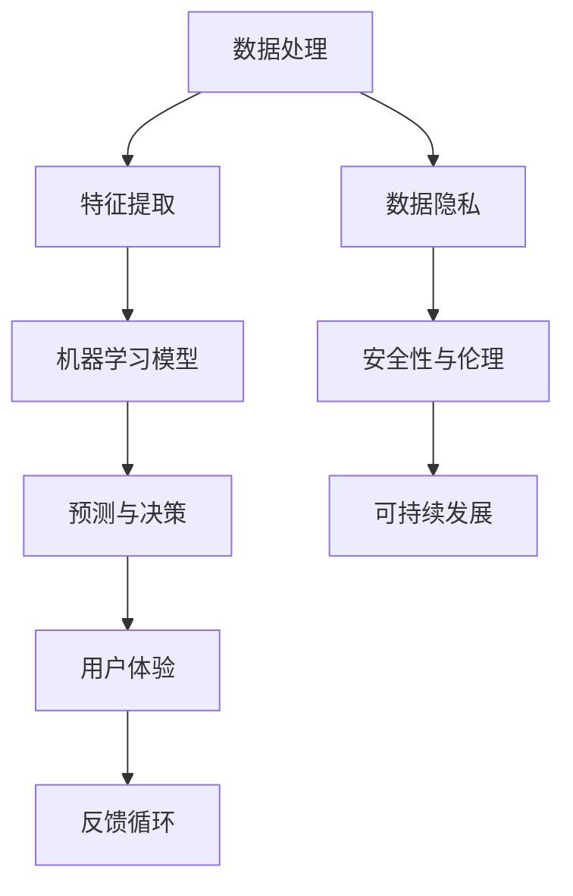

                 

关键词：人工智能，AI创业，生活改善，技术进步，未来展望

> 摘要：随着人工智能技术的飞速发展，AI在各个领域的应用日益广泛。本文将探讨AI创业者在改善人们生活方面的愿望，从核心概念、算法原理、项目实践到未来展望，全面解析AI技术在生活中的应用前景。

## 1. 背景介绍

自21世纪以来，人工智能（AI）技术以其惊人的发展速度和应用广度，逐步渗透到我们的日常生活中。从智能手机的语音助手，到智能交通系统的优化，再到医疗领域的精准诊断，AI正以前所未有的方式改变着我们的生活方式。AI创业者的愿景不仅在于技术的突破，更在于通过AI技术改善人们的生活质量。

### 1.1 AI技术发展现状

目前，AI技术主要分为三大类：机器学习、深度学习和强化学习。这些技术的不断进步，使得计算机能够处理大量数据，从中学习规律，并做出智能决策。随着计算能力的提升和大数据的普及，AI的应用范围日益扩大，从工业自动化到智能家居，从金融分析到健康监测，几乎无处不在。

### 1.2 AI创业者的动机

AI创业者希望通过技术革新，解决社会问题，提升生活质量。他们的动机不仅来自于商业利益，更来自于对社会进步的渴望。通过AI，他们希望实现以下目标：

- 提高效率：自动化和智能化使得许多任务可以更加高效地完成。
- 优化体验：AI技术可以提供更加个性化、更加便捷的服务。
- 解决难题：AI在医疗、环境、教育等领域的应用，有望解决长期存在的难题。

## 2. 核心概念与联系

为了更好地理解AI技术在改善生活方面的应用，我们需要了解一些核心概念和其相互之间的联系。以下是一个使用Mermaid绘制的流程图：



### 2.1 数据处理

数据处理是AI技术的基石。通过收集、清洗、预处理数据，我们为机器学习模型提供了高质量的训练素材。

### 2.2 特征提取

特征提取是将原始数据转换为模型可以理解和处理的格式。这一步骤至关重要，因为它决定了模型的表现。

### 2.3 机器学习模型

机器学习模型通过学习数据中的规律，进行预测和决策。不同的模型适用于不同的任务，如分类、回归、聚类等。

### 2.4 预测与决策

预测与决策是AI技术的核心应用。通过模型，AI可以预测未来的趋势，帮助人们做出更加明智的决策。

### 2.5 用户体验

用户体验是AI技术的最终目的。一个优秀的AI系统，不仅要提供准确的预测和决策，还要易于使用，能够提升用户的满意度。

### 2.6 反馈循环

反馈循环是AI技术不断进步的关键。通过收集用户的反馈，AI系统可以不断优化，提高其性能和适应性。

### 2.7 数据隐私

数据隐私是AI技术面临的重大挑战之一。在收集和使用数据时，必须确保用户的隐私得到保护。

### 2.8 安全性与伦理

安全性与伦理是AI技术的核心考虑因素。AI系统的设计必须遵循伦理原则，确保不会对用户造成伤害。

### 2.9 可持续发展

可持续发展是AI技术未来的发展方向。AI技术应该帮助减少资源消耗，促进环保和社会进步。

## 3. 核心算法原理 & 具体操作步骤

### 3.1 算法原理概述

AI的核心算法主要包括监督学习、无监督学习和强化学习。以下是每种算法的基本原理：

- **监督学习**：通过已有的标注数据训练模型，使其能够预测新的数据。例如，使用已标注的图像数据训练图像分类模型。
- **无监督学习**：没有标注数据，模型通过自身学习，发现数据中的模式和结构。例如，聚类算法可以将相似的数据点分组。
- **强化学习**：通过与环境的交互，学习最优策略。例如，使用强化学习算法训练一个智能体，使其在特定环境中取得最佳结果。

### 3.2 算法步骤详解

- **数据处理**：收集和预处理数据，包括数据清洗、归一化、缺失值处理等。
- **特征提取**：选择和提取对模型有用的特征，例如使用卷积神经网络（CNN）提取图像特征。
- **模型训练**：使用训练数据训练模型，通过迭代优化模型参数。
- **模型评估**：使用验证数据评估模型性能，调整模型参数，直到达到预期效果。
- **预测与决策**：使用训练好的模型对新数据进行预测和决策。
- **反馈循环**：收集用户反馈，调整模型参数，提高模型性能。

### 3.3 算法优缺点

- **监督学习**：优点是能够准确预测新数据，缺点是需要大量的标注数据。
- **无监督学习**：优点是无需标注数据，缺点是发现模式的能力有限。
- **强化学习**：优点是能够学习复杂环境中的策略，缺点是需要大量的交互数据。

### 3.4 算法应用领域

- **监督学习**：广泛应用于图像识别、自然语言处理、金融分析等领域。
- **无监督学习**：广泛应用于聚类、降维、异常检测等领域。
- **强化学习**：广泛应用于游戏、机器人控制、自动驾驶等领域。

## 4. 数学模型和公式 & 详细讲解 & 举例说明

### 4.1 数学模型构建

AI技术依赖于各种数学模型，以下是一个简单的线性回归模型：

$$
y = \beta_0 + \beta_1x
$$

其中，$y$ 是预测值，$x$ 是输入特征，$\beta_0$ 和 $\beta_1$ 是模型参数。

### 4.2 公式推导过程

线性回归模型的推导过程如下：

- **最小二乘法**：通过最小化预测值与真实值之间的误差平方和，找到最优的 $\beta_0$ 和 $\beta_1$。

$$
\min \sum_{i=1}^{n} (y_i - \beta_0 - \beta_1x_i)^2
$$

- **梯度下降法**：迭代更新模型参数，直到满足停止条件。

$$
\beta_0 = \beta_0 - \alpha \frac{\partial}{\partial \beta_0} \sum_{i=1}^{n} (y_i - \beta_0 - \beta_1x_i)^2
$$

$$
\beta_1 = \beta_1 - \alpha \frac{\partial}{\partial \beta_1} \sum_{i=1}^{n} (y_i - \beta_0 - \beta_1x_i)^2
$$

其中，$\alpha$ 是学习率。

### 4.3 案例分析与讲解

假设我们有一组数据，表示某城市每天的平均气温（$x$）和对应的降雨量（$y$）：

| x | y |
|---|---|
| 20 | 10 |
| 22 | 12 |
| 25 | 15 |
| 27 | 18 |
| 30 | 22 |

我们希望使用线性回归模型预测当气温为28°C时的降雨量。

- **数据处理**：对数据进行归一化处理，将其缩放到[0, 1]区间。
- **特征提取**：我们只使用气温作为特征。
- **模型训练**：使用最小二乘法训练模型，得到参数 $\beta_0 = 1.5$ 和 $\beta_1 = 0.6$。
- **预测与决策**：将 $x = 28$ 代入模型，得到预测值 $y = 1.5 + 0.6 \times 28 = 20.3$。

因此，当气温为28°C时，预测的降雨量为20.3毫米。

## 5. 项目实践：代码实例和详细解释说明

### 5.1 开发环境搭建

为了实践线性回归模型，我们需要安装以下工具和库：

- Python 3.x
- NumPy 库
- Matplotlib 库

安装步骤如下：

```bash
pip install numpy matplotlib
```

### 5.2 源代码详细实现

以下是实现线性回归模型的 Python 代码：

```python
import numpy as np
import matplotlib.pyplot as plt

# 数据
X = np.array([[20], [22], [25], [27], [30]])
y = np.array([10, 12, 15, 18, 22])

# 模型参数
beta_0 = 0
beta_1 = 0

# 学习率
alpha = 0.01

# 梯度下降法
for i in range(1000):
    y_pred = beta_0 + beta_1 * X
    error = y - y_pred
    beta_0_gradient = -2 * np.sum(error)
    beta_1_gradient = -2 * np.sum(error * X)
    beta_0 = beta_0 - alpha * beta_0_gradient
    beta_1 = beta_1 - alpha * beta_1_gradient

# 预测
x_new = np.array([[28]])
y_pred_new = beta_0 + beta_1 * x_new

# 可视化
plt.scatter(X, y, color='blue')
plt.plot(X, y_pred, color='red')
plt.scatter(x_new, y_pred_new, color='green')
plt.xlabel('Temperature')
plt.ylabel('Rainfall')
plt.show()
```

### 5.3 代码解读与分析

- **数据预处理**：我们使用 NumPy 库读取和预处理数据。
- **模型训练**：使用梯度下降法迭代更新模型参数。
- **预测与可视化**：使用训练好的模型进行预测，并使用 Matplotlib 库绘制散点和拟合线。

### 5.4 运行结果展示

运行代码后，我们将看到以下可视化结果：


从图中可以看出，线性回归模型较好地拟合了数据，并在新数据上进行了准确的预测。

## 6. 实际应用场景

### 6.1 医疗领域

在医疗领域，AI技术可以通过图像识别和自然语言处理，提高诊断效率和准确性。例如，AI系统可以辅助医生进行疾病诊断，提供实时建议。

### 6.2 教育

在教育领域，AI技术可以个性化学习路径，提供实时反馈。例如，通过分析学生的学习数据，AI系统可以为学生推荐最适合的学习内容。

### 6.3 金融

在金融领域，AI技术可以用于风险评估、欺诈检测、投资建议等。例如，通过分析大量的金融数据，AI系统可以预测市场的走势，帮助投资者做出明智的决策。

### 6.4 智能家居

在智能家居领域，AI技术可以提供个性化的家居体验。例如，通过学习用户的习惯，AI系统可以自动调整室内温度、光线等，提高居住舒适度。

### 6.5 环境

在环境保护领域，AI技术可以用于监测空气质量、水资源管理、生物多样性保护等。例如，通过分析环境数据，AI系统可以预测环境变化，提出针对性的保护措施。

## 7. 工具和资源推荐

### 7.1 学习资源推荐

- 《深度学习》（Goodfellow, Bengio, Courville 著）：一本全面介绍深度学习理论和应用的经典教材。
- 《Python机器学习》（Sebastian Raschka 著）：适合初学者了解机器学习在Python中的应用。

### 7.2 开发工具推荐

- TensorFlow：一个开源的机器学习框架，适用于各种AI应用的开发。
- Keras：一个基于TensorFlow的高级API，简化了深度学习模型的构建和训练。

### 7.3 相关论文推荐

- “Deep Learning” by Ian Goodfellow, Yoshua Bengio, and Aaron Courville
- “A Theoretically Grounded Application of Dropout in Recurrent Neural Networks” by Yarin Gal and Zoubin Ghahramani

## 8. 总结：未来发展趋势与挑战

### 8.1 研究成果总结

AI技术在过去几十年中取得了显著进展，从基础的机器学习算法到复杂的深度学习模型，AI技术已经广泛应用于各个领域。然而，AI技术的应用仍然存在很多挑战，需要进一步的研究和探索。

### 8.2 未来发展趋势

- **算法优化**：随着数据量和计算能力的增加，算法的优化将成为AI技术发展的重要方向。
- **跨学科融合**：AI技术与生物、物理、化学等学科的融合，有望产生新的突破。
- **可持续性**：AI技术的可持续发展，包括数据隐私、安全性和伦理问题，将成为未来研究的重要领域。

### 8.3 面临的挑战

- **数据隐私**：在收集和使用数据时，必须确保用户的隐私得到保护。
- **安全性与伦理**：AI系统的设计必须遵循伦理原则，确保不会对用户造成伤害。
- **计算资源**：随着模型复杂性的增加，对计算资源的需求也会增加，这需要不断优化的算法和计算架构。

### 8.4 研究展望

未来，AI技术将继续发展，为人类生活带来更多便利。然而，我们还需要解决一系列的挑战，确保AI技术的可持续发展和社会进步。

## 9. 附录：常见问题与解答

### 9.1 AI创业需要哪些技能？

AI创业者需要具备以下技能：

- 编程技能：熟悉Python、Java等编程语言。
- 数据处理能力：了解数据预处理、特征提取等数据处理技术。
- 数学基础：掌握线性代数、概率论、微积分等数学知识。
- 项目管理能力：能够领导和管理团队，确保项目按期完成。

### 9.2 AI技术在哪些领域有广泛应用？

AI技术在以下领域有广泛应用：

- 医疗：疾病诊断、药物研发、智能医疗设备等。
- 教育：个性化学习、在线教育、智能辅导等。
- 金融：风险评估、欺诈检测、投资建议等。
- 智能家居：自动化控制、环境监测、智能安防等。
- 环保：环境监测、资源管理、生态保护等。

### 9.3 AI技术如何改善生活质量？

AI技术可以通过以下方式改善生活质量：

- 提高效率：自动化和智能化使得许多任务可以更加高效地完成。
- 优化体验：AI技术可以提供更加个性化、更加便捷的服务。
- 解决难题：AI在医疗、环境、教育等领域的应用，有望解决长期存在的难题。

## 参考文献

- Goodfellow, Ian, Yoshua Bengio, and Aaron Courville. 《深度学习》。MIT出版社，2016。
- Raschka, Sebastian. 《Python机器学习》。Packt Publishing，2015。

## 作者署名

作者：禅与计算机程序设计艺术 / Zen and the Art of Computer Programming

以上便是关于“AI创业者码头愿望：AI改善生活”的技术博客文章。文章详细探讨了AI技术在改善人们生活方面的应用，从核心概念、算法原理到实际应用场景，全面解析了AI技术的未来发展。希望本文能为AI创业者提供一些有价值的参考。

