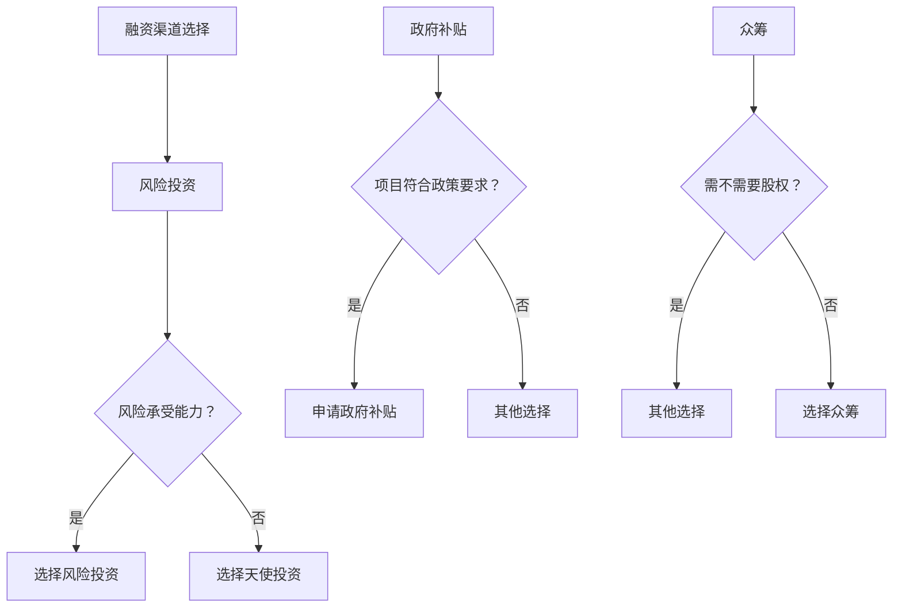

                 

关键词：AI创业、融资渠道、投资策略、风险控制、市场分析、商业计划

> 摘要：本文将深入探讨AI创业公司如何有效地选择和利用融资渠道，包括风险投资、天使投资、政府补贴、众筹等多种途径。通过分析这些融资渠道的特点和优缺点，AI创业公司可以更好地制定融资策略，降低风险，实现可持续发展。

## 1. 背景介绍

随着人工智能技术的快速发展，AI创业公司如雨后春笋般涌现。然而，大多数AI创业公司在资金上面临巨大挑战。如何有效地获取资金，尤其是风险资本，成为这些公司成功的关键。本文旨在帮助AI创业公司了解不同的融资渠道，以及如何根据自身情况选择最合适的融资方式。

## 2. 核心概念与联系

### 融资渠道的定义与分类

**融资渠道**是指公司为了获取资金而采取的各种途径。根据融资主体和资金来源的不同，融资渠道可以大致分为以下几类：

1. **风险投资（Venture Capital，VC）**：风险投资是一种由专业投资机构提供的资金，通常用于支持高风险、高回报的创业项目。
2. **天使投资（Angel Investment）**：天使投资者通常是个人投资者，他们通常在创业公司早期阶段提供资金。
3. **政府补贴（Government Subsidy）**：政府为了支持某些行业或技术研发，提供的一种非盈利性资金。
4. **众筹（Crowdfunding）**：通过互联网平台，向公众募集资金的一种融资方式。

### 融资渠道的选择

选择合适的融资渠道对AI创业公司至关重要。以下是几种常见融资渠道的特点和优缺点：

**风险投资**

- **优点**：风险投资可以为创业公司提供大量资金，并带来丰富的行业资源。
- **缺点**：风险投资通常要求股权比例较高，且对公司的经营有较强的影响力。

**天使投资**

- **优点**：天使投资通常更注重项目本身，对股权要求相对较低。
- **缺点**：天使投资规模通常较小，且不一定能提供足够的资金。

**政府补贴**

- **优点**：政府补贴通常用于支持特定项目或技术研发，无股权要求。
- **缺点**：申请流程复杂，资金使用有严格限制。

**众筹**

- **优点**：众筹可以快速获取市场反馈，无需放弃股权。
- **缺点**：众筹资金通常较小，且可能带来一定的法律风险。

### Mermaid 流程图



## 3. 核心算法原理 & 具体操作步骤

### 3.1 算法原理概述

融资渠道选择的核心算法是基于多属性决策分析（Multi-Attribute Decision Making，MADM）。MADM算法通过综合考虑多个属性（如资金规模、资金来源、股权要求等）来选择最优融资渠道。

### 3.2 算法步骤详解

1. **确定评估属性**：根据创业公司的实际情况，确定需要评估的属性，如资金规模、资金来源、股权要求等。
2. **权重分配**：为每个评估属性分配权重，以反映其对创业公司的重要程度。
3. **评估标准设定**：为每个属性设定评估标准，通常采用1-5分的评分制度。
4. **评估过程**：根据设定的评估标准，对每个融资渠道进行评估，得出总分。
5. **选择最优融资渠道**：根据评估结果，选择总分最高的融资渠道。

### 3.3 算法优缺点

- **优点**：MADM算法能够全面考虑多个因素，帮助创业公司做出更为合理的融资决策。
- **缺点**：MADM算法依赖于主观判断，且评估标准可能因人而异。

### 3.4 算法应用领域

MADM算法广泛应用于各种决策场景，如融资渠道选择、项目投资评估等。在AI创业领域，MADM算法可以帮助创业公司更好地选择融资渠道，降低融资风险。

## 4. 数学模型和公式 & 详细讲解 & 举例说明

### 4.1 数学模型构建

融资渠道选择可以看作是一个多目标优化问题。假设有n个融资渠道，每个渠道有m个评估属性，我们定义目标函数为：

$$
\text{目标函数} = \sum_{i=1}^{n} \sum_{j=1}^{m} w_j \cdot s_{ij}
$$

其中，$w_j$为第j个评估属性的权重，$s_{ij}$为第i个融资渠道在第j个评估属性的得分。

### 4.2 公式推导过程

1. **权重分配**：根据评估属性的重要性，为每个属性分配权重。假设总权重为1，则第j个属性的权重为：

$$
w_j = \frac{c_j}{\sum_{i=1}^{m} c_i}
$$

其中，$c_j$为第j个评估属性的重要性值。

2. **评估标准设定**：为每个评估属性设定评分标准，通常采用1-5分的评分制度。

3. **评估过程**：对每个融资渠道进行评估，得出总分。假设第i个融资渠道的总分为：

$$
s_i = \sum_{j=1}^{m} w_j \cdot s_{ij}
$$

### 4.3 案例分析与讲解

假设某AI创业公司需要选择融资渠道，有三个选项：风险投资、天使投资、政府补贴。评估属性包括资金规模、资金来源、股权要求。权重分配如下：

- 资金规模：0.5
- 资金来源：0.3
- 股权要求：0.2

评估标准设定如下：

- 资金规模：5分代表大量资金，1分代表少量资金
- 资金来源：5分代表风险投资，1分代表政府补贴
- 股权要求：5分代表无股权要求，1分代表股权要求高

对每个融资渠道进行评估，得出总分：

- 风险投资：$s_1 = 0.5 \cdot 5 + 0.3 \cdot 5 + 0.2 \cdot 3 = 4.4$
- 天使投资：$s_2 = 0.5 \cdot 3 + 0.3 \cdot 5 + 0.2 \cdot 5 = 3.1$
- 政府补贴：$s_3 = 0.5 \cdot 3 + 0.3 \cdot 1 + 0.2 \cdot 5 = 2.3$

根据评估结果，选择总分最高的融资渠道：风险投资。

## 5. 项目实践：代码实例和详细解释说明

### 5.1 开发环境搭建

本文将使用Python编写一个简单的融资渠道选择模型。需要安装的库包括：

- pandas：用于数据处理
- numpy：用于数学计算
- matplotlib：用于数据可视化

安装命令如下：

```bash
pip install pandas numpy matplotlib
```

### 5.2 源代码详细实现

```python
import pandas as pd
import numpy as np
import matplotlib.pyplot as plt

# 评估属性权重
weights = {'资金规模': 0.5, '资金来源': 0.3, '股权要求': 0.2}

# 评估标准
scores = {'风险投资': {'资金规模': 5, '资金来源': 5, '股权要求': 3},
          '天使投资': {'资金规模': 3, '资金来源': 5, '股权要求': 5},
          '政府补贴': {'资金规模': 3, '资金来源': 1, '股权要求': 5}}

# 评估矩阵
assessments = {'风险投资': [5, 5, 3],
               '天使投资': [3, 5, 5],
               '政府补贴': [3, 1, 5]}

# 计算总分
def calculate_scores(assessments, weights, scores):
    scores_dict = {}
    for name, score_list in assessments.items():
        total_score = sum([weights[k] * scores[name][k] for k in scores[name].keys()])
        scores_dict[name] = total_score
    return scores_dict

# 可视化结果
def visualize_scores(scores):
    plt.bar(scores.keys(), scores.values())
    plt.xlabel('融资渠道')
    plt.ylabel('总分')
    plt.title('融资渠道选择结果')
    plt.show()

# 主函数
def main():
    scores = calculate_scores(assessments, weights, scores)
    visualize_scores(scores)

if __name__ == '__main__':
    main()
```

### 5.3 代码解读与分析

1. **导入库**：导入pandas、numpy和matplotlib库，用于数据处理、数学计算和数据可视化。
2. **设置权重和评估标准**：定义权重字典和评估标准字典，用于后续计算。
3. **评估矩阵**：定义评估矩阵，包含三个融资渠道在每个评估属性的得分。
4. **计算总分**：定义`calculate_scores`函数，根据权重和评估标准计算每个融资渠道的总分。
5. **可视化结果**：定义`visualize_scores`函数，将计算结果可视化。
6. **主函数**：调用`calculate_scores`和`visualize_scores`函数，执行主程序。

### 5.4 运行结果展示

运行代码后，将显示一个条形图，展示每个融资渠道的总分。根据总分，可以选择最优的融资渠道。

## 6. 实际应用场景

### 6.1 风险投资

风险投资是AI创业公司最常用的融资渠道之一。例如，谷歌旗下的风投部门GV曾投资了AI公司DeepMind，最终获得了巨额回报。风险投资可以为AI创业公司提供大量资金，并带来丰富的行业资源，有助于公司快速成长。

### 6.2 天使投资

天使投资通常在创业公司早期阶段提供资金，如Facebook的创始人扎克伯格就曾获得天使投资。天使投资通常更注重项目本身，对股权要求相对较低，有助于创业公司保持独立性。

### 6.3 政府补贴

政府补贴在支持特定项目或技术研发方面具有重要意义。例如，中国政府设立了多个专项资金，支持人工智能技术研发。政府补贴可以减轻AI创业公司的资金压力，有助于其专注于技术研发。

### 6.4 众筹

众筹是一种新兴的融资方式，可以快速获取市场反馈。例如，AI公司Lumify通过Kickstarter众筹平台成功筹集了超过100万美元的资金。众筹有助于创业公司了解市场需求，但需要注意可能带来的法律风险。

## 7. 工具和资源推荐

### 7.1 学习资源推荐

- 《风险投资手册》（Venture Capital Handbook）
- 《天使投资实战》（Angel Investing for Dummies）
- 《人工智能创业指南》（AI Startups: The Complete Guide）

### 7.2 开发工具推荐

- GitHub：用于代码托管和协作
- GitLab：用于代码托管和协作
- Jupyter Notebook：用于数据分析与建模

### 7.3 相关论文推荐

- "Deep Learning for startups: A Practical Guide" by Andrew Ng
- "The Future of Funding: Crowdfunding and Venture Capital" by Startup Genome
- "Government Funding for AI Research: An Overview" by National Science Foundation

## 8. 总结：未来发展趋势与挑战

### 8.1 研究成果总结

本文探讨了AI创业公司如何选择和利用不同的融资渠道，包括风险投资、天使投资、政府补贴和众筹等。通过构建多属性决策模型，AI创业公司可以更好地选择最合适的融资方式，降低融资风险。

### 8.2 未来发展趋势

随着人工智能技术的不断进步，AI创业公司的融资需求也将不断增加。未来，风险投资、天使投资等融资渠道将更加成熟，为AI创业公司提供更多支持。

### 8.3 面临的挑战

AI创业公司在融资过程中仍将面临诸多挑战，如竞争激烈、技术不确定性等。此外，监管政策的变动也可能对AI创业公司的融资环境产生影响。

### 8.4 研究展望

未来，AI创业公司的融资研究可以从以下几个方面展开：1）探索更多创新融资渠道；2）研究如何利用大数据和人工智能优化融资决策；3）分析不同融资渠道对AI创业公司发展的影响。

## 9. 附录：常见问题与解答

### 问题1：AI创业公司如何选择合适的融资渠道？

**解答**：AI创业公司应根据自身发展阶段、资金需求、股权要求等因素，综合考虑各种融资渠道的特点和优缺点，选择最合适的融资方式。

### 问题2：风险投资和天使投资有什么区别？

**解答**：风险投资通常由专业投资机构提供，资金规模较大，对公司的经营有较强的影响力；天使投资通常由个人投资者提供，资金规模较小，更注重项目本身。

### 问题3：众筹适合所有AI创业公司吗？

**解答**：众筹适合那些有明确市场需求、能够快速获取市场反馈的AI创业公司。但对于技术密集型的AI创业公司，众筹可能无法满足其资金需求。

### 问题4：政府补贴如何申请？

**解答**：政府补贴的申请流程通常较为复杂，需要满足特定的条件和要求。创业公司应密切关注相关政策，提前准备申请材料，并与政府部门保持沟通。

---

作者：禅与计算机程序设计艺术 / Zen and the Art of Computer Programming
----------------------------------------------------------------
### 附加信息 Additional Information

#### 参考文献

1. 《风险投资手册》（Venture Capital Handbook）
2. 《天使投资实战》（Angel Investing for Dummies）
3. 《人工智能创业指南》（AI Startups: The Complete Guide）
4. "Deep Learning for startups: A Practical Guide" by Andrew Ng
5. "The Future of Funding: Crowdfunding and Venture Capital" by Startup Genome
6. "Government Funding for AI Research: An Overview" by National Science Foundation

#### 补充说明

本文仅作为参考，创业公司在实际融资过程中应结合自身情况，充分调研和评估各种融资渠道，制定合理的融资策略。同时，创业者应具备良好的沟通能力和市场洞察力，以应对融资过程中的各种挑战。本文内容仅供参考，不构成任何投资建议。投资者应谨慎决策，独立承担投资风险。

