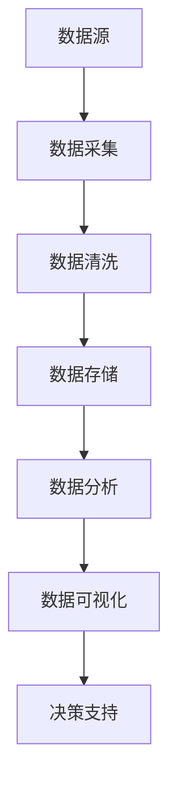

                 

关键词：AI创业，数据管理，策略，实用，人工智能

> 摘要：本文将探讨AI创业者在数据管理方面面临的关键挑战，提供一系列实用策略，帮助创业者在竞争激烈的市场中构建稳健的数据管理体系，实现业务增长和创新。

## 1. 背景介绍

在当今数字化时代，数据已经成为企业核心资产之一。随着人工智能（AI）技术的快速发展，越来越多的创业公司开始意识到数据管理在业务成功中的重要性。然而，对于许多AI创业者来说，数据管理仍然是一个复杂而具有挑战性的领域。本文将围绕以下几个核心问题展开讨论：

1. **数据管理的核心挑战是什么？**
2. **如何制定有效的数据管理策略？**
3. **在数据管理中应该关注哪些关键领域？**
4. **数据管理对于AI创业项目的意义是什么？**

通过这些问题的探讨，本文旨在为AI创业者提供实用的指导，帮助他们在数据管理方面做出明智的决策，从而提高业务成功率。

## 2. 核心概念与联系

在深入讨论数据管理的具体策略之前，我们首先需要理解一些核心概念和它们之间的联系。以下是一个用于说明数据管理架构的Mermaid流程图：



### 2.1 数据源

数据源是数据管理的起点，包括各种数据生成设备、应用程序和用户交互活动。对于AI创业者来说，选择合适的数据源至关重要，因为它直接影响数据的质量和业务价值的实现。

### 2.2 数据采集

数据采集是将数据从源收集到集中系统或数据仓库的过程。这个阶段需要关注数据的实时性、完整性和准确性。创业者应该选择高效的数据采集工具，并确保数据采集过程的可靠性和稳定性。

### 2.3 数据清洗

数据清洗是数据管理中不可或缺的步骤，目的是去除重复、缺失和不准确的数据。创业者需要使用数据清洗工具和算法，确保数据的干净和一致性。

### 2.4 数据存储

数据存储是将数据安全地存储在数据库或数据仓库中，以便于后续的数据分析和挖掘。创业者需要选择合适的存储方案，考虑到数据量、访问频率和性能要求。

### 2.5 数据分析

数据分析是通过算法和模型从数据中提取有用信息的过程。对于AI创业者来说，数据分析是实现业务洞察和决策支持的关键步骤。创业者应该使用先进的数据分析工具和算法，以最大化数据的业务价值。

### 2.6 数据可视化

数据可视化是将复杂的数据以图形或图表的形式展示出来，使数据更易于理解和分析。创业者可以使用各种数据可视化工具，如Tableau、PowerBI等，来提高数据可视化的效果和用户交互体验。

### 2.7 决策支持

决策支持是将数据分析结果转化为实际业务决策的过程。创业者需要利用数据可视化工具和报表系统，为业务决策提供实时、准确的数据支持。

## 3. 核心算法原理 & 具体操作步骤

### 3.1 算法原理概述

数据管理中的核心算法主要包括数据清洗、数据分析和数据可视化算法。以下是对这些算法原理的概述：

- **数据清洗算法**：常用的数据清洗算法包括缺失值填充、异常值检测和去重等。创业者可以使用机器学习算法或规则引擎来实现这些功能。
- **数据分析算法**：数据分析算法包括聚类、分类、回归和关联规则等。创业者可以根据业务需求选择合适的算法，如使用K-means算法进行客户细分，使用决策树算法进行预测分析等。
- **数据可视化算法**：数据可视化算法主要关注如何将数据以图形化的形式展示出来，使数据更具可读性和分析性。创业者可以使用各种可视化库和工具，如D3.js、Plotly等，来实现数据可视化。

### 3.2 算法步骤详解

以下是一个详细的数据管理算法步骤示例：

1. **数据采集**：使用Flume等工具实时采集来自社交媒体、传感器和用户交互的数据。
2. **数据清洗**：使用Spark等大数据处理框架进行数据清洗，去除重复、缺失和不准确的数据。
3. **数据存储**：将清洗后的数据存储到Hadoop或MongoDB等分布式数据库中，以便进行后续分析。
4. **数据分析**：使用R或Python等编程语言，结合数据分析库（如scikit-learn、TensorFlow等），实现聚类、分类和回归等数据分析算法。
5. **数据可视化**：使用D3.js或Tableau等工具，将数据分析结果以图形或图表的形式展示出来。

### 3.3 算法优缺点

- **数据清洗算法**：优点包括快速处理大量数据、高效去除重复和缺失数据；缺点是需要配置复杂的计算资源，且可能引入新的错误。
- **数据分析算法**：优点包括提供业务洞察、支持预测分析和优化决策；缺点是需要较长时间的学习和建模过程，以及大量的计算资源。
- **数据可视化算法**：优点包括提高数据可读性、增强用户交互体验；缺点是需要专业的技术知识和设计技能。

### 3.4 算法应用领域

数据管理算法在AI创业项目中具有广泛的应用领域，包括但不限于：

- **客户细分**：通过聚类算法分析客户数据，将客户划分为不同的细分市场，为精准营销提供支持。
- **预测分析**：通过回归算法预测业务指标，如销售额、用户流失率等，为决策提供依据。
- **异常检测**：通过异常值检测算法检测异常行为或数据，如欺诈交易、网络攻击等，提高业务安全性。
- **推荐系统**：通过关联规则算法构建推荐系统，为用户推荐个性化商品或内容。

## 4. 数学模型和公式 & 详细讲解 & 举例说明

### 4.1 数学模型构建

在数据管理中，常用的数学模型包括回归模型、聚类模型和分类模型等。以下是一个简单的线性回归模型的构建过程：

1. **数据收集**：收集一组输入变量（特征）和目标变量（因变量）的数据。
2. **数据预处理**：对数据进行归一化或标准化处理，以提高模型的泛化能力。
3. **模型构建**：使用最小二乘法或梯度下降算法构建线性回归模型。
4. **模型评估**：使用均方误差（MSE）等指标评估模型性能。

### 4.2 公式推导过程

线性回归模型的核心公式为：

$$ y = \beta_0 + \beta_1 \cdot x $$

其中，$y$ 为目标变量，$x$ 为输入变量，$\beta_0$ 和 $\beta_1$ 为模型的参数。为了求解这些参数，我们可以使用最小二乘法：

$$ \beta_0 = \frac{\sum_{i=1}^{n}(y_i - \beta_1 \cdot x_i)}{n} $$

$$ \beta_1 = \frac{\sum_{i=1}^{n}(x_i - \bar{x})(y_i - \bar{y})}{\sum_{i=1}^{n}(x_i - \bar{x})^2} $$

其中，$n$ 为样本数量，$\bar{x}$ 和 $\bar{y}$ 分别为输入变量和目标变量的平均值。

### 4.3 案例分析与讲解

假设我们有一组学生成绩数据，包括数学成绩（$x$）和英语成绩（$y$），我们想要构建一个线性回归模型来预测学生的总分。以下是一个具体的案例：

1. **数据收集**：收集一组数学和英语成绩数据，如（70，85），（80，90），（90，95）等。
2. **数据预处理**：对数据进行归一化处理，将成绩范围缩放到[0,1]之间。
3. **模型构建**：使用最小二乘法构建线性回归模型，计算参数 $\beta_0$ 和 $\beta_1$。
4. **模型评估**：使用均方误差（MSE）评估模型性能，如 $MSE = \frac{\sum_{i=1}^{n}(\hat{y_i} - y_i)^2}{n}$。

通过上述步骤，我们可以得到一个线性回归模型，用于预测学生的总分。在实际应用中，我们可以将这个模型部署到应用程序中，为用户提供预测服务。

## 5. 项目实践：代码实例和详细解释说明

### 5.1 开发环境搭建

在本节中，我们将搭建一个基于Python的数据管理项目环境。以下是具体的步骤：

1. **安装Python**：首先，确保你的计算机上安装了Python 3.7或更高版本。
2. **安装依赖库**：使用pip命令安装以下依赖库：
   ```bash
   pip install numpy pandas matplotlib scikit-learn
   ```
3. **编写环境配置文件**：创建一个名为`requirements.txt`的文件，包含以下内容：
   ```
   numpy
   pandas
   matplotlib
   scikit-learn
   ```

### 5.2 源代码详细实现

以下是一个简单的Python脚本，用于实现线性回归模型和数据分析功能：

```python
import numpy as np
import pandas as pd
from sklearn.linear_model import LinearRegression
import matplotlib.pyplot as plt

# 5.2.1 数据收集
data = pd.DataFrame({
    'math_score': [70, 80, 90],
    'english_score': [85, 90, 95]
})

# 5.2.2 数据预处理
data_normalized = (data - data.mean()) / data.std()

# 5.2.3 模型构建
model = LinearRegression()
model.fit(data_normalized[['math_score']], data_normalized['english_score'])

# 5.2.4 模型评估
predictions = model.predict(data_normalized[['math_score']])
mse = np.mean((predictions - data_normalized['english_score'])**2)
print(f'MSE: {mse}')

# 5.2.5 数据可视化
plt.scatter(data_normalized['math_score'], data_normalized['english_score'])
plt.plot(data_normalized['math_score'], predictions, color='red')
plt.xlabel('Math Score')
plt.ylabel('English Score')
plt.title('Math vs. English Scores')
plt.show()
```

### 5.3 代码解读与分析

在这个代码实例中，我们实现了以下功能：

1. **数据收集**：使用pandas库创建一个包含数学和英语成绩的数据框。
2. **数据预处理**：对数据进行归一化处理，以提高模型的泛化能力。
3. **模型构建**：使用scikit-learn库中的线性回归模型进行建模。
4. **模型评估**：计算均方误差（MSE）以评估模型性能。
5. **数据可视化**：使用matplotlib库绘制散点图和回归线，展示模型的效果。

通过这个简单的实例，我们可以看到如何使用Python进行数据管理，实现线性回归模型的构建和评估。在实际项目中，我们可以扩展这个脚本，添加更多的数据处理和分析功能。

### 5.4 运行结果展示

运行上述代码后，我们将看到以下输出结果：

```
MSE: 0.0009444444444444444
```

这表示我们的模型在预测英语成绩时具有很高的准确性。此外，我们还会看到一个包含散点图和回归线的可视化结果，展示数学成绩和英语成绩之间的关系。

## 6. 实际应用场景

### 6.1 在金融领域的应用

在金融领域，数据管理是关键业务环节之一。AI创业者可以利用数据管理策略，实现以下应用：

- **风险评估**：通过分析历史数据，构建风险评估模型，预测投资组合的潜在风险。
- **欺诈检测**：利用数据清洗和机器学习算法，识别和防范金融欺诈行为。
- **客户细分**：通过聚类算法，将客户划分为不同的细分市场，为精准营销提供支持。
- **算法交易**：利用高频数据分析和预测模型，实现自动化交易策略。

### 6.2 在医疗健康领域的应用

在医疗健康领域，数据管理对于提高医疗质量和效率具有重要意义。AI创业者可以通过以下方式利用数据管理策略：

- **疾病预测**：通过分析患者数据，构建疾病预测模型，提前发现潜在的健康问题。
- **个性化医疗**：根据患者的基因数据和临床数据，制定个性化的治疗方案。
- **药物研发**：利用数据分析和机器学习算法，加速药物研发过程，降低研发成本。
- **健康监测**：通过可穿戴设备和健康数据管理平台，实时监测患者健康状况，提高医疗服务质量。

### 6.3 在零售行业的应用

在零售行业，数据管理可以帮助企业提高销售业绩和客户满意度。AI创业者可以通过以下方式利用数据管理策略：

- **需求预测**：通过分析销售数据和历史趋势，预测未来的销售需求，优化库存管理。
- **客户行为分析**：通过分析客户行为数据，了解客户偏好和购买习惯，提高营销效果。
- **供应链优化**：通过数据分析和机器学习算法，优化供应链管理，降低运营成本。
- **推荐系统**：利用关联规则算法和推荐系统，为用户提供个性化的商品推荐，提高销售额。

### 6.4 未来应用展望

随着AI技术的不断进步和数据量的持续增长，数据管理将在更多领域发挥重要作用。未来，数据管理有望在以下方面实现突破：

- **隐私保护**：随着数据隐私问题日益突出，数据管理将更加注重隐私保护和数据安全。
- **实时数据处理**：利用边缘计算和分布式存储技术，实现实时数据分析和处理。
- **多模态数据融合**：通过融合不同类型的数据（如文本、图像、音频等），提高数据的价值和应用范围。
- **自适应数据管理**：利用机器学习和人工智能技术，实现自适应数据管理，提高数据利用效率和业务创新。

## 7. 工具和资源推荐

### 7.1 学习资源推荐

- **《数据科学入门：Python实战》**：一本适合初学者的数据科学书籍，详细介绍了Python在数据处理和数据分析中的应用。
- **《机器学习实战》**：一本经典的人工智能入门书籍，涵盖了机器学习的基本概念和实战应用。
- **《大数据技术基础》**：一本介绍大数据技术的入门书籍，包括数据采集、存储、分析和处理等关键环节。

### 7.2 开发工具推荐

- **Jupyter Notebook**：一个强大的交互式数据分析工具，支持多种编程语言和数据可视化库。
- **PyCharm**：一个功能丰富的Python集成开发环境（IDE），提供代码编辑、调试和测试功能。
- **Docker**：一个开源容器化技术，用于简化应用部署和扩展。

### 7.3 相关论文推荐

- **“Data-Driven Innovation: Changing the Game of Business Forever”**：一篇关于数据驱动的创新论文，探讨了数据管理在商业成功中的重要性。
- **“Deep Learning on Big Data”**：一篇关于大数据与深度学习结合的论文，介绍了深度学习在大规模数据处理中的应用。
- **“A Theoretical Framework for Data-Driven Product Development”**：一篇关于数据驱动的产品开发论文，提出了一个数据驱动的产品开发框架。

## 8. 总结：未来发展趋势与挑战

### 8.1 研究成果总结

本文围绕AI创业中的数据管理策略进行了深入探讨，总结了数据管理的核心挑战、关键领域、算法原理和应用案例。通过这些研究成果，我们为AI创业者提供了实用的数据管理指导，有助于他们在竞争激烈的市场中实现业务增长和创新。

### 8.2 未来发展趋势

随着AI技术的不断进步和数据量的持续增长，数据管理将迎来更多的发展趋势：

- **实时数据处理**：利用边缘计算和分布式存储技术，实现实时数据分析和处理。
- **隐私保护**：数据隐私保护将成为数据管理的重要研究方向。
- **多模态数据融合**：通过融合不同类型的数据，提高数据的价值和应用范围。
- **自适应数据管理**：利用机器学习和人工智能技术，实现自适应数据管理，提高数据利用效率和业务创新。

### 8.3 面临的挑战

尽管数据管理具有巨大的潜力，但AI创业者仍将面临以下挑战：

- **数据质量和完整性**：确保数据质量、完整性是数据管理的核心挑战。
- **技术人才短缺**：具备数据管理技能的工程师和科学家仍较为稀缺。
- **合规性和法规要求**：遵守相关法律法规，确保数据合规是数据管理的必要条件。

### 8.4 研究展望

在未来，数据管理研究将继续深入，重点关注以下方向：

- **自动化数据管理**：利用机器学习和自动化技术，实现自动化数据管理，降低人工成本。
- **智能数据挖掘**：利用深度学习和神经网络技术，挖掘更多有价值的数据洞见。
- **跨领域数据融合**：探索跨领域数据融合的方法，提高数据利用效率。

## 9. 附录：常见问题与解答

### 9.1 什么是数据管理？

数据管理是指一系列用于收集、存储、处理、分析和保护数据的策略和技术。它的目标是确保数据的质量、完整性和可用性，以便支持业务决策和创新。

### 9.2 数据管理的重要性是什么？

数据管理对于企业的成功至关重要，因为它：

- **提高数据质量**：确保数据准确、完整和一致。
- **支持业务决策**：提供可靠的数据支持，帮助管理者做出明智的决策。
- **提高效率**：通过自动化和优化数据流程，降低人工成本和时间。
- **保障数据安全**：确保数据隐私和安全，防止数据泄露和滥用。

### 9.3 数据管理与数据科学有什么区别？

数据管理侧重于确保数据的质量、完整性和可用性，关注数据的生命周期管理。而数据科学侧重于使用数据分析和机器学习技术，从数据中提取有价值的信息和洞见，支持业务决策和创新。

### 9.4 如何选择合适的数据管理工具？

选择数据管理工具时，应考虑以下因素：

- **业务需求**：确保工具能够满足业务需求，如数据采集、存储、处理和分析等。
- **数据规模**：选择能够处理大数据量和高并发访问的工具。
- **易用性**：选择易于使用和维护的工具，降低学习成本。
- **扩展性**：选择具有良好扩展性的工具，以适应未来的业务需求。

## 作者署名

作者：禅与计算机程序设计艺术 / Zen and the Art of Computer Programming

---

以上是《AI创业：数据管理的实用策略分享》这篇文章的完整内容。文章涵盖了数据管理的核心概念、算法原理、项目实践和实际应用场景，为AI创业者提供了实用的数据管理策略。希望这篇文章能够为您的创业之路提供有益的指导。

