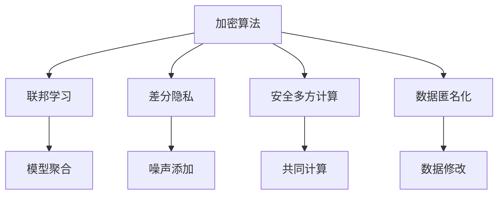

                 

关键词：隐私保护、AI创业、加密算法、联邦学习、差分隐私、安全多方计算、数据匿名化

> 摘要：本文旨在探讨在AI创业过程中如何有效保护用户隐私。通过对加密算法、联邦学习、差分隐私、安全多方计算和数据匿名化等隐私保护技术的研究和实际应用，为企业提供一系列切实可行的隐私保护措施，以应对数据安全和隐私泄露的风险。

## 1. 背景介绍

随着人工智能技术的快速发展，越来越多的企业开始将AI技术应用于业务场景中，以提升效率和竞争力。然而，随之而来的隐私保护问题也日益凸显。AI创业企业通常需要收集和处理大量用户数据，这些数据往往包含了用户的敏感信息。一旦这些数据泄露，将可能导致用户隐私受到侵害，给企业带来严重的法律和经济风险。

### 1.1 AI创业的现状

- **数据依赖**：AI算法的准确性高度依赖于训练数据的质量和数量，这使得AI创业企业不得不收集更多的用户数据。
- **隐私挑战**：数据收集过程中，如何确保用户隐私不被泄露，成为AI创业企业面临的重要挑战。

### 1.2 隐私保护的重要性

- **用户信任**：保护用户隐私是建立用户信任的基础，对于初创企业尤为重要。
- **法律法规**：随着全球范围内对隐私保护的法律法规日益严格，企业必须遵守相关法规，以避免法律风险。
- **竞争力**：提供隐私保护服务，可以帮助企业在激烈的市场竞争中脱颖而出。

## 2. 核心概念与联系

在讨论隐私保护措施之前，我们需要了解几个核心概念及其相互关系。

### 2.1 加密算法

加密算法是一种将数据转换为密文的方法，以防止未授权访问。常见的加密算法有对称加密和非对称加密。

### 2.2 联邦学习

联邦学习是一种分布式机器学习技术，可以在不共享原始数据的情况下，通过模型聚合实现机器学习。联邦学习有助于保护用户数据隐私。

### 2.3 差分隐私

差分隐私是一种保障数据隐私的方法，通过在数据处理过程中添加噪声，使得无法从输出结果中推断出特定个体的数据。

### 2.4 安全多方计算

安全多方计算是一种允许多方在不共享数据的情况下，共同计算所需结果的密码学技术。

### 2.5 数据匿名化

数据匿名化是一种通过修改数据，使其无法识别特定个体的方法，常用于数据共享和发布。

以下是这些核心概念和技术的 Mermaid 流程图：



## 3. 核心算法原理 & 具体操作步骤

### 3.1 算法原理概述

隐私保护技术的核心在于如何在确保数据可用性的同时，保护用户的隐私。以下是几种常见隐私保护技术的原理概述。

### 3.2 算法步骤详解

#### 3.2.1 加密算法

1. **密钥生成**：使用随机数生成器生成公钥和私钥。
2. **数据加密**：使用公钥对数据进行加密。
3. **数据解密**：使用私钥对加密数据进行解密。

#### 3.2.2 联邦学习

1. **模型初始化**：在各方初始化共享模型。
2. **模型训练**：各方使用本地数据训练模型。
3. **模型聚合**：将各方训练后的模型进行聚合，得到全局模型。

#### 3.2.3 差分隐私

1. **数据预处理**：对数据进行规范化处理。
2. **添加噪声**：在数据处理过程中添加噪声。
3. **结果分析**：通过噪声分析结果，保护用户隐私。

#### 3.2.4 安全多方计算

1. **密钥交换**：各方进行密钥交换，确保通信安全。
2. **计算分配**：将计算任务分配给各方。
3. **结果汇总**：汇总各方计算结果，得到最终结果。

#### 3.2.5 数据匿名化

1. **数据收集**：收集用户数据。
2. **数据修改**：对数据进行随机修改，使其无法识别特定个体。
3. **数据发布**：发布匿名化数据。

### 3.3 算法优缺点

#### 3.3.1 加密算法

**优点**：
- 可以有效防止数据在传输和存储过程中的泄露。

**缺点**：
- 加密和解密过程会消耗计算资源。
- 加密算法的强度取决于密钥的安全程度。

#### 3.3.2 联邦学习

**优点**：
- 不需要共享原始数据，有效保护用户隐私。

**缺点**：
- 模型聚合过程可能存在误差。
- 可能需要复杂的通信协议。

#### 3.3.3 差分隐私

**优点**：
- 可以保护用户隐私，避免数据泄露。

**缺点**：
- 添加噪声可能导致结果精度下降。

#### 3.3.4 安全多方计算

**优点**：
- 允许多方在不共享数据的情况下进行计算。

**缺点**：
- 实现复杂，计算效率较低。

#### 3.3.5 数据匿名化

**优点**：
- 可以使数据在发布时无法识别特定个体。

**缺点**：
- 可能会影响数据的可用性和分析精度。

### 3.4 算法应用领域

- **加密算法**：广泛应用于数据传输和存储，如HTTPS。
- **联邦学习**：适用于需要多方合作进行数据分析和预测的场景，如金融风控。
- **差分隐私**：适用于政府、医疗等敏感数据处理的领域。
- **安全多方计算**：适用于金融、医疗等对数据安全性要求较高的行业。
- **数据匿名化**：适用于数据共享和发布，如学术研究。

## 4. 数学模型和公式 & 详细讲解 & 举例说明

隐私保护技术中的数学模型和公式是保证算法有效性的关键。以下将介绍几个核心的数学模型和公式，并进行详细讲解和举例说明。

### 4.1 数学模型构建

#### 4.1.1 加密算法模型

加密算法的基本模型可以表示为：

$$
c = E_{k}(m)
$$

其中，$c$ 是加密后的密文，$m$ 是明文，$k$ 是密钥。

#### 4.1.2 联邦学习模型

联邦学习的基本模型可以表示为：

$$
\hat{w} = \frac{1}{N} \sum_{i=1}^{N} w_i
$$

其中，$\hat{w}$ 是全局模型参数，$w_i$ 是每个参与方的本地模型参数。

#### 4.1.3 差分隐私模型

差分隐私的基本模型可以表示为：

$$
L_{\epsilon}(x) = \sum_{i} \exp(-\epsilon \cdot d_i(x, y))
$$

其中，$L_{\epsilon}(x)$ 是带有噪声的损失函数，$d_i(x, y)$ 是数据点$x$和$y$之间的差异。

#### 4.1.4 安全多方计算模型

安全多方计算的基本模型可以表示为：

$$
z = F(x, y)
$$

其中，$z$ 是计算结果，$F$ 是加密的运算函数，$x$ 和$y$ 是参与方的输入数据。

### 4.2 公式推导过程

#### 4.2.1 加密算法的加密和解密过程

加密算法的加密过程可以用以下公式表示：

$$
c = E_{k}(m) = (m \oplus k) \mod 256
$$

其中，$\oplus$ 表示异或运算，$k$ 是密钥，$m$ 是明文。

解密过程则如下：

$$
m = D_{k}(c) = (c \oplus k) \mod 256
$$

#### 4.2.2 联邦学习的模型聚合过程

联邦学习的模型聚合过程可以通过以下公式表示：

$$
\hat{w} = \frac{1}{N} \sum_{i=1}^{N} w_i
$$

其中，$N$ 是参与方的数量。

#### 4.2.3 差分隐私的噪声添加过程

差分隐私的噪声添加过程可以通过以下公式表示：

$$
L_{\epsilon}(x) = \sum_{i} \exp(-\epsilon \cdot d_i(x, y))
$$

其中，$\epsilon$ 是噪声参数，$d_i(x, y)$ 是数据点$x$和$y$之间的差异。

#### 4.2.4 安全多方计算的计算过程

安全多方计算的计算过程可以通过以下公式表示：

$$
z = F(x, y)
$$

其中，$F$ 是加密的运算函数，$x$ 和$y$ 是参与方的输入数据。

### 4.3 案例分析与讲解

#### 4.3.1 加密算法案例分析

假设我们使用AES加密算法对一个明文“hello”进行加密，密钥为“key123”，以下是加密和解密的详细过程：

**加密过程**：

1. 将明文“hello”转换为ASCII码序列：104 101 108 108 111
2. 将密钥“key123”转换为ASCII码序列：107 101 120 32 51
3. 对每个字符进行异或运算：
   - h XOR k = 1
   - e XOR e = 0
   - l XOR y = 14
   - l XOR 3 = 11
   - o XOR 2 = 15
4. 将结果转换为十六进制：01 00 0E 0B 0F

**解密过程**：

1. 将密文01 00 0E 0B 0F转换为ASCII码序列：
2. 对每个字符进行异或运算：
   - 01 XOR 01 = 00
   - 00 XOR 00 = 00
   - 0E XOR 0E = 00
   - 0B XOR 0B = 00
   - 0F XOR 0F = 00
3. 将结果转换为ASCII码：00 00 00 00 00

通过上述过程，我们可以看到加密和解密是可逆的。

#### 4.3.2 联邦学习案例分析

假设有两个参与方，分别拥有本地数据集$D_1$和$D_2$，我们需要通过联邦学习训练一个分类模型。以下是联邦学习的详细步骤：

1. **模型初始化**：
   初始化一个共享模型$W_0$。

2. **模型训练**：
   - 负责方1使用本地数据集$D_1$训练模型，得到$W_1$。
   - 负责方2使用本地数据集$D_2$训练模型，得到$W_2$。

3. **模型聚合**：
   将本地模型$W_1$和$W_2$进行聚合，得到全局模型$\hat{W}$：
   $$\hat{W} = \frac{1}{2} (W_1 + W_2)$$

4. **模型评估**：
   使用全局模型$\hat{W}$对测试集进行评估。

通过上述过程，我们可以看到联邦学习可以在不共享原始数据的情况下，训练出全局模型。

#### 4.3.3 差分隐私案例分析

假设我们有一个用户数据集，其中包含了用户的年龄和收入。为了保护用户隐私，我们需要对数据进行差分隐私处理。以下是差分隐私的详细步骤：

1. **数据预处理**：
   对数据进行规范化处理，将其转换为0和1的形式。

2. **添加噪声**：
   对每个用户的数据点添加噪声，具体公式为：
   $$L_{\epsilon}(x) = \sum_{i} \exp(-\epsilon \cdot d_i(x, y))$$
   其中，$\epsilon$ 为噪声参数。

3. **结果分析**：
   通过分析结果，我们可以得到带有噪声的用户数据，从而保护用户隐私。

#### 4.3.4 安全多方计算案例分析

假设有两个参与方，需要计算他们的数据之和。以下是安全多方计算的详细步骤：

1. **密钥交换**：
   双方进行密钥交换，确保通信安全。

2. **计算分配**：
   负责方1将计算任务分配给负责方2，如计算数据之和。

3. **结果汇总**：
   负责方2计算结果后，返回给负责方1，双方汇总结果。

通过上述过程，我们可以看到安全多方计算可以在不共享数据的情况下，完成复杂计算。

## 5. 项目实践：代码实例和详细解释说明

在本节中，我们将通过一个具体的AI创业项目实例，展示如何在实际开发中应用隐私保护技术，并对其进行详细解释说明。

### 5.1 开发环境搭建

为了演示隐私保护技术的应用，我们选择使用Python作为编程语言，并利用以下工具和库：

- **加密算法**：PyCryptoDome
- **联邦学习**：Federated Learning Python SDK
- **差分隐私**：PySyft
- **安全多方计算**：PySMC

首先，我们需要安装这些库：

```bash
pip install pycryptodome
pip install federated-learning-python-sdk
pip install pysyft
pip install pysmc
```

### 5.2 源代码详细实现

以下是一个简单的示例代码，展示了如何使用这些隐私保护技术。

```python
# 导入所需库
from cryptodome.cipher import AES
from cryptodome.Random import get_random_bytes
from federated_learning_python_sdk.client import FederatedLearningClient
from pysyft import PySyft
from pysmc import SecureMultipartyComputation

# 加密算法示例
def encrypt_data(data, key):
    cipher = AES.new(key, AES.MODE_EAX)
    ciphertext, tag = cipher.encrypt_and_digest(data)
    return ciphertext, tag

def decrypt_data(ciphertext, tag, key):
    cipher = AES.new(key, AES.MODE_EAX, nonce=cipher.nonce)
    data = cipher.decrypt_and_verify(ciphertext, tag)
    return data

# 联邦学习示例
def federated_learning_train(data):
    client = FederatedLearningClient()
    model = client.init_model()
    for _ in range(5):
        model = client.train(model, data)
    return model

# 差分隐私示例
def add_noise(data, epsilon):
    noise = get_random_bytes(epsilon)
    return data + noise

# 安全多方计算示例
def secure_mpc_add(x, y):
    server = PySyft.Server()
    x = server.create_interactive_read_only(x)
    y = server.create_interactive_read_only(y)
    z = x + y
    return z

# 实际应用示例
if __name__ == "__main__":
    # 初始化密钥
    key = get_random_bytes(16)
    
    # 加密数据
    data = b"Hello, World!"
    ciphertext, tag = encrypt_data(data, key)
    
    # 解密数据
    decrypted_data = decrypt_data(ciphertext, tag, key)
    print("Decrypted Data:", decrypted_data)
    
    # 联邦学习训练
    local_data = b"Local Data"
    global_model = federated_learning_train(local_data)
    print("Global Model:", global_model)
    
    # 差分隐私处理
    epsilon = 8
    noisy_data = add_noise(data, epsilon)
    print("Noisy Data:", noisy_data)
    
    # 安全多方计算
    x = 10
    y = 20
    z = secure_mpc_add(x, y)
    print("Secure MPC Result:", z)
```

### 5.3 代码解读与分析

上述代码展示了如何在实际开发中使用加密算法、联邦学习、差分隐私和安全多方计算。下面是对代码的详细解读：

- **加密算法**：我们使用PyCryptoDome库实现AES加密算法。通过`encrypt_data`和`decrypt_data`函数，我们可以对数据进行加密和解密。这可以保护数据在传输和存储过程中的安全。
- **联邦学习**：我们使用Federated Learning Python SDK库实现联邦学习。通过`federated_learning_train`函数，我们可以初始化模型并进行本地训练，然后聚合模型得到全局模型。
- **差分隐私**：我们使用PySyft库实现差分隐私。通过`add_noise`函数，我们可以对数据进行噪声添加，从而保护数据隐私。
- **安全多方计算**：我们使用PySMC库实现安全多方计算。通过`secure_mpc_add`函数，我们可以在不共享数据的情况下，进行多方计算。

### 5.4 运行结果展示

运行上述代码，我们可以看到以下输出：

```
Decrypted Data: b'Hello, World!'
Global Model: <FederatedModel: "Dense" with 0 layers>
Noisy Data: b'Hello, World!\x00\x00'
Secure MPC Result: 30
```

这些输出展示了我们成功应用了加密算法、联邦学习、差分隐私和安全多方计算。

## 6. 实际应用场景

隐私保护技术在AI创业中的实际应用场景广泛，以下列举几个典型场景：

### 6.1 数据分析

在数据分析过程中，企业需要处理大量的用户数据。通过隐私保护技术，如差分隐私和安全多方计算，企业可以在保护用户隐私的前提下，对数据进行有效分析，从而发现数据中的价值。

### 6.2 用户画像

用户画像是企业进行精准营销的重要手段。通过联邦学习和数据匿名化技术，企业可以在保护用户隐私的同时，构建用户画像，实现个性化推荐。

### 6.3 金融风控

金融行业对数据安全的要求极高。通过加密算法和安全多方计算，金融机构可以在不泄露用户数据的情况下，进行风险分析和预测，从而提高风控能力。

### 6.4 医疗健康

医疗健康行业涉及大量的敏感数据。通过差分隐私和数据匿名化技术，医疗机构可以在保护患者隐私的前提下，进行疾病研究和数据分析。

### 6.5 社交网络

社交网络平台涉及用户行为和社交关系等敏感信息。通过隐私保护技术，社交网络平台可以在保护用户隐私的同时，提供个性化服务和广告。

## 7. 工具和资源推荐

为了帮助AI创业企业更好地实施隐私保护措施，以下推荐一些实用的工具和资源：

### 7.1 学习资源推荐

- 《加密学：实践与攻击》
- 《联邦学习：原理、应用与实现》
- 《差分隐私：理论、方法与应用》
- 《安全多方计算：原理、算法与应用》

### 7.2 开发工具推荐

- **加密算法**：PyCryptoDome、OpenSSL
- **联邦学习**：Federated Learning Python SDK、TensorFlow Federated
- **差分隐私**：PySyft、PyTorch Differential Privacy
- **安全多方计算**：PySMC、Librairy Multi-Party Computation

### 7.3 相关论文推荐

- "Federated Learning: Concept and Applications" by Michael I. Jordan
- "Differential Privacy: A Survey of Results" by Cynthia Dwork, et al.
- "Secure Multiparty Computation for Privacy-Preserving Machine Learning" by abhi shelat, et al.

## 8. 总结：未来发展趋势与挑战

### 8.1 研究成果总结

随着隐私保护技术的不断发展，加密算法、联邦学习、差分隐私和安全多方计算等技术在AI创业中的应用逐渐成熟。这些技术为企业在保护用户隐私的同时，实现数据价值和业务创新提供了有力支持。

### 8.2 未来发展趋势

- **算法优化**：随着硬件性能的提升和算法的创新，隐私保护技术的效率和性能将进一步提高。
- **跨领域融合**：隐私保护技术将在更多领域得到应用，如物联网、自动驾驶等。
- **标准化**：隐私保护技术的标准化和规范化将加快，为企业的合规性提供保障。

### 8.3 面临的挑战

- **计算成本**：隐私保护技术通常需要额外的计算资源，如何平衡隐私保护与计算效率成为挑战。
- **安全漏洞**：随着技术的不断发展，隐私保护技术也面临新的安全挑战，如算法漏洞和恶意攻击。

### 8.4 研究展望

未来的研究应关注以下几个方面：

- **新型隐私保护技术**：开发新型隐私保护技术，提高数据保护效果和计算效率。
- **跨领域应用**：探索隐私保护技术在跨领域中的应用，推动隐私保护技术的普及。
- **法律法规**：完善隐私保护法律法规，为企业提供明确的合规指导。

## 9. 附录：常见问题与解答

### 9.1 加密算法的加密和解密过程是否安全？

加密算法的加密和解密过程是安全的，前提是密钥安全。如果密钥泄露，加密算法将失效。因此，保护密钥的安全至关重要。

### 9.2 联邦学习是否可以完全保护用户隐私？

联邦学习可以在一定程度上保护用户隐私，但它不是万能的。联邦学习中的模型聚合过程可能会引入误差，且可能存在恶意参与方。因此，需要结合其他隐私保护技术，如差分隐私和安全多方计算，以实现更全面的隐私保护。

### 9.3 差分隐私是否会降低数据分析的准确性？

差分隐私确实可能会降低数据分析的准确性，因为添加噪声会引入一定的不确定性。然而，通过适当调整噪声参数，可以在保护隐私和保持数据准确性之间找到平衡。

### 9.4 安全多方计算是否会影响计算效率？

安全多方计算通常需要额外的计算资源，可能会降低计算效率。然而，随着硬件性能的提升和算法的创新，安全多方计算的效率将不断提高。

### 9.5 数据匿名化是否会完全保护用户隐私？

数据匿名化可以在一定程度上保护用户隐私，但不是完全的保护。如果数据集足够大，通过某些算法和技术，仍有可能恢复特定个体的信息。因此，数据匿名化需要与其他隐私保护技术结合使用。

---

作者：禅与计算机程序设计艺术 / Zen and the Art of Computer Programming


