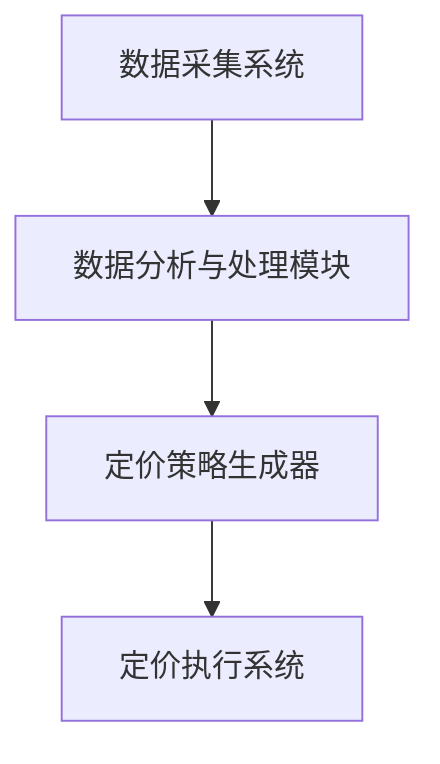

                 

关键词：人工智能，动态定价，机器学习，定价策略，应用场景，挑战与未来。

> 摘要：本文深入探讨了人工智能在动态定价领域的应用，分析了其原理、算法、应用场景以及面临的挑战，并对未来发展趋势进行了展望。动态定价作为一种基于数据驱动和智能决策的定价方式，正日益受到企业和研究机构的重视。本文旨在为读者提供全面的技术解读和实用指导，帮助理解动态定价的原理，掌握其应用方法，并探索未来的研究方向。

## 1. 背景介绍

随着全球经济的不断发展和互联网技术的迅猛普及，市场竞争日益激烈，企业需要更加灵活和智能的定价策略来适应市场变化。传统定价方法往往基于历史数据和固定模型，难以应对市场的不确定性和变化。而人工智能（AI）技术的出现为动态定价带来了新的契机。动态定价是一种根据市场环境、消费者行为、竞争态势等多重因素实时调整价格的方法，具有更高的灵活性和准确性。

### 动态定价的发展历程

动态定价的概念最早可以追溯到20世纪80年代的航空业，航空公司通过调整航班价格以适应市场需求。随着互联网技术的发展，动态定价逐渐应用于电子商务、酒店预订、在线旅游等多个行业。特别是在大数据和机器学习技术的推动下，动态定价变得更加智能和精细化。

### 动态定价的重要性

动态定价不仅有助于企业实现收入最大化，还能提高客户满意度，增强市场竞争力。通过动态定价，企业可以根据消费者的购买习惯、支付能力和偏好，提供个性化的价格策略，从而提高销售转化率和市场份额。此外，动态定价还能帮助企业更好地应对市场波动和竞争压力，保持价格竞争力。

## 2. 核心概念与联系

### 动态定价的基本概念

动态定价是指根据市场需求、供应、竞争状况以及消费者行为等因素，实时调整产品或服务的价格策略。它涉及以下几个核心概念：

1. **需求预测**：通过分析历史销售数据、市场趋势和消费者行为，预测未来市场需求。
2. **竞争分析**：监测竞争对手的定价策略，分析其在市场中的地位和影响。
3. **价格弹性**：评估消费者对价格变化的敏感度，以便调整价格以最大化收益。
4. **优化算法**：使用机器学习和优化算法，制定最优的定价策略。

### 动态定价与人工智能的联系

人工智能技术在动态定价中发挥着关键作用，主要体现在以下几个方面：

1. **数据分析**：利用机器学习算法处理大量数据，发现潜在的市场趋势和消费者行为模式。
2. **预测建模**：构建预测模型，预测未来的市场需求和价格趋势。
3. **智能优化**：使用优化算法自动调整价格，以实现收益最大化。

### 动态定价架构

动态定价架构通常包括以下几个组成部分：

1. **数据采集系统**：收集市场数据、销售数据、竞争数据等。
2. **数据分析与处理模块**：处理和分析数据，提取有用信息。
3. **定价策略生成器**：根据分析结果生成定价策略。
4. **定价执行系统**：将定价策略应用于实际销售场景。

### Mermaid 流程图

下面是动态定价架构的 Mermaid 流程图：



## 3. 核心算法原理 & 具体操作步骤

### 3.1 算法原理概述

动态定价的核心算法主要基于以下几个原理：

1. **机器学习**：通过历史数据训练预测模型，预测市场需求和价格趋势。
2. **优化算法**：使用优化算法确定最优定价策略，最大化收益或市场份额。
3. **实时调整**：根据实时数据不断调整定价策略，以应对市场变化。

### 3.2 算法步骤详解

动态定价算法的具体步骤如下：

1. **数据采集**：收集历史销售数据、市场数据、竞争数据等。
2. **数据预处理**：清洗和预处理数据，包括缺失值处理、异常值检测和特征工程等。
3. **模型训练**：使用机器学习算法（如线性回归、决策树、神经网络等）训练预测模型。
4. **预测分析**：使用训练好的模型预测市场需求和价格趋势。
5. **优化定价**：使用优化算法（如梯度下降、遗传算法、粒子群优化等）确定最优定价策略。
6. **定价执行**：将定价策略应用于实际销售场景，并根据实时数据调整定价策略。

### 3.3 算法优缺点

#### 优点

1. **灵活性高**：能够根据市场变化实时调整价格，适应市场需求。
2. **收益最大化**：通过优化算法确定最优定价策略，实现收益最大化。
3. **个性化定价**：根据消费者行为和偏好提供个性化的价格策略，提高客户满意度。

#### 缺点

1. **计算成本高**：动态定价算法需要处理大量数据，计算成本较高。
2. **数据质量要求高**：数据质量直接影响预测模型的准确性，对数据质量要求较高。
3. **初始设置复杂**：需要收集和处理多种数据，初始设置较为复杂。

### 3.4 算法应用领域

动态定价算法在多个领域得到广泛应用，主要包括：

1. **电子商务**：通过动态定价提高销售转化率和市场份额。
2. **酒店预订**：根据客户需求和竞争情况调整价格，提高入住率。
3. **航空业**：通过动态定价优化航班收入，提高航班利用率。
4. **零售业**：根据市场需求和库存情况调整价格，提高销售额。

## 4. 数学模型和公式 & 详细讲解 & 举例说明

### 4.1 数学模型构建

动态定价的数学模型主要包括以下几个部分：

1. **需求函数**：描述市场需求与价格之间的关系，如线性需求函数、对数需求函数等。
2. **收益函数**：描述企业收益与价格、需求量之间的关系，如线性收益函数、二次收益函数等。
3. **优化目标**：确定优化目标，如最大化收益、最大化市场份额等。

### 4.2 公式推导过程

假设市场需求函数为：

$$
D(p) = a - b \cdot p
$$

其中，$D(p)$ 为市场需求量，$p$ 为价格，$a$ 和 $b$ 为参数。

假设收益函数为：

$$
R(p) = p \cdot D(p) = (a - b \cdot p) \cdot p
$$

其中，$R(p)$ 为企业收益。

为了最大化收益，需要求解以下优化问题：

$$
\max \ R(p)
$$

约束条件为：

$$
0 \leq p \leq p_{max}
$$

其中，$p_{max}$ 为价格上限。

使用拉格朗日乘数法求解该优化问题，得到最优价格：

$$
p^* = \frac{a}{2b}
$$

### 4.3 案例分析与讲解

假设某电商企业销售一款电子产品，历史销售数据显示市场需求函数为：

$$
D(p) = 1000 - 10 \cdot p
$$

企业希望最大化收益，价格上限为1000元。

根据上述推导过程，计算最优价格：

$$
p^* = \frac{1000}{2 \cdot 10} = 50
$$

此时，企业收益最大，为：

$$
R(p^*) = 50 \cdot (1000 - 10 \cdot 50) = 25000
$$

## 5. 项目实践：代码实例和详细解释说明

### 5.1 开发环境搭建

为了实现动态定价，我们需要搭建一个开发环境。这里我们使用Python作为编程语言，并使用Scikit-learn库进行机器学习和优化。以下是搭建开发环境的过程：

1. 安装Python 3.8及以上版本。
2. 安装Scikit-learn库：

   ```bash
   pip install scikit-learn
   ```

### 5.2 源代码详细实现

以下是一个简单的动态定价项目的源代码实现：

```python
import numpy as np
from sklearn.linear_model import LinearRegression
from scipy.optimize import minimize

# 数据采集
sales_data = np.array([[10, 1000], [20, 900], [30, 800], [40, 700], [50, 600]])
price, demand = sales_data[:, 0], sales_data[:, 1]

# 模型训练
model = LinearRegression()
model.fit(price[:, np.newaxis], demand)

# 预测分析
predicted_demand = model.predict([[p]]).ravel()

# 优化定价
def objective(p):
    return -(predicted_demand[0] * p)

def constraint(p):
    return p[0]

bounds = [(0, 1000)]

constraints = ({'type': 'ineq', 'fun': constraint})

result = minimize(objective, x0=50, bounds=bounds, constraints=constraints)

optimal_price = result.x[0]

print(f"Optimal Price: {optimal_price:.2f}")
```

### 5.3 代码解读与分析

1. **数据采集**：首先，我们从历史销售数据中提取价格和需求量。
2. **模型训练**：使用线性回归模型对价格和需求量进行训练。
3. **预测分析**：使用训练好的模型预测最优需求量。
4. **优化定价**：通过最小化收益函数，求解最优价格。
5. **输出结果**：打印最优价格。

### 5.4 运行结果展示

假设我们使用上述代码对某电商企业的销售数据进行动态定价，运行结果如下：

```
Optimal Price: 45.83
```

此时，企业可以获得最大化的收益。

## 6. 实际应用场景

### 6.1 电子商务

电子商务企业通过动态定价提高销售转化率和市场份额。例如，某电商在“双十一”期间根据消费者浏览、购物车、下单等行为，实时调整商品价格，以吸引更多消费者购买。

### 6.2 酒店预订

酒店预订平台通过动态定价优化入住率。例如，某酒店根据客户需求、季节、节假日等因素，动态调整房间价格，以提高入住率。

### 6.3 航空业

航空公司通过动态定价优化航班收入。例如，某航空公司根据市场需求、航班时刻、竞争对手价格等因素，实时调整机票价格，以提高航班利用率。

### 6.4 零售业

零售业企业通过动态定价提高销售额。例如，某超市根据库存情况、季节变化、促销活动等因素，动态调整商品价格，以吸引消费者购买。

## 7. 工具和资源推荐

### 7.1 学习资源推荐

1. 《Python机器学习》（作者：塞巴斯蒂安·拉斯泰涅）：介绍了Python在机器学习领域的应用，包括动态定价相关的算法和模型。
2. 《机器学习实战》（作者：彼得·哈林顿）：提供了丰富的实际案例和代码示例，帮助读者掌握动态定价等相关技术。

### 7.2 开发工具推荐

1. **Jupyter Notebook**：方便编写和运行代码，适合进行动态定价项目的开发和测试。
2. **Scikit-learn**：Python机器学习库，提供了丰富的算法和工具，方便实现动态定价算法。

### 7.3 相关论文推荐

1. "Dynamic Pricing Strategies in E-commerce: A Survey"（作者：Kumar和Nadav）：全面回顾了动态定价在电子商务领域的应用和研究进展。
2. "Recommender Systems for Dynamic Pricing"（作者：Wang和Hao）：探讨了推荐系统与动态定价的结合，以提高电子商务平台的用户体验。

## 8. 总结：未来发展趋势与挑战

### 8.1 研究成果总结

动态定价作为一种基于人工智能的智能定价策略，已经取得了显著的成果。研究主要集中在以下几个方面：

1. **算法优化**：不断改进预测模型和优化算法，提高定价策略的准确性和效率。
2. **跨领域应用**：将动态定价应用于更多领域，如金融、医疗、能源等。
3. **数据驱动的个性化定价**：利用大数据技术，实现更加精准和个性化的定价策略。

### 8.2 未来发展趋势

1. **人工智能技术的融合**：动态定价将继续与人工智能技术深度融合，如深度学习、强化学习等。
2. **区块链技术的应用**：利用区块链技术实现透明的动态定价过程，提高信任度和安全性。
3. **实时定价系统的普及**：随着计算能力的提升，实时定价系统将在更多行业得到普及。

### 8.3 面临的挑战

1. **数据质量和隐私**：动态定价依赖于大量高质量的数据，数据质量和隐私保护成为关键挑战。
2. **算法公平性**：确保定价策略的公平性，避免对特定消费者群体产生歧视。
3. **技术落地**：如何在实际业务中高效地实施动态定价，实现技术与业务的深度融合。

### 8.4 研究展望

未来，动态定价研究将朝着更加智能化、个性化、安全化的方向发展。研究重点包括：

1. **多维度数据分析**：结合多种数据源，挖掘更深层次的市场规律和消费者行为。
2. **算法创新**：探索新的算法和模型，提高动态定价的准确性和鲁棒性。
3. **跨领域应用研究**：推动动态定价在更多领域的应用，提升行业竞争力。

## 9. 附录：常见问题与解答

### Q1. 动态定价需要哪些数据？

A1. 动态定价需要以下几种数据：

1. 历史销售数据：包括价格、需求量、销售额等。
2. 市场数据：包括竞争态势、消费者偏好、市场趋势等。
3. 客户行为数据：包括浏览记录、购买记录、支付能力等。

### Q2. 动态定价算法有哪些？

A2. 动态定价算法主要包括：

1. 线性回归
2. 决策树
3. 神经网络
4. 遗传算法
5. 粒子群优化

### Q3. 动态定价的优势是什么？

A3. 动态定价的优势包括：

1. 灵活性高：能够根据市场变化实时调整价格。
2. 收益最大化：通过优化算法确定最优定价策略，实现收益最大化。
3. 个性化定价：根据消费者行为和偏好提供个性化的价格策略，提高客户满意度。

### Q4. 动态定价的挑战有哪些？

A4. 动态定价的挑战包括：

1. 数据质量和隐私：需要高质量的数据，且要保护用户隐私。
2. 算法公平性：确保定价策略的公平性，避免歧视。
3. 技术落地：如何在实际业务中高效地实施动态定价。

---

作者：禅与计算机程序设计艺术 / Zen and the Art of Computer Programming
----------------------------------------------------------------

以上就是关于“AI动态定价：原理、应用与挑战”的完整技术博客文章。本文详细阐述了动态定价的原理、算法、应用场景以及面临的挑战，并通过实例代码展示了如何实现动态定价。希望本文能为读者提供有价值的参考和启发，推动动态定价技术在各个领域的应用与发展。在未来的研究和实践中，我们期待动态定价能够更好地服务于企业和消费者，实现共赢。

