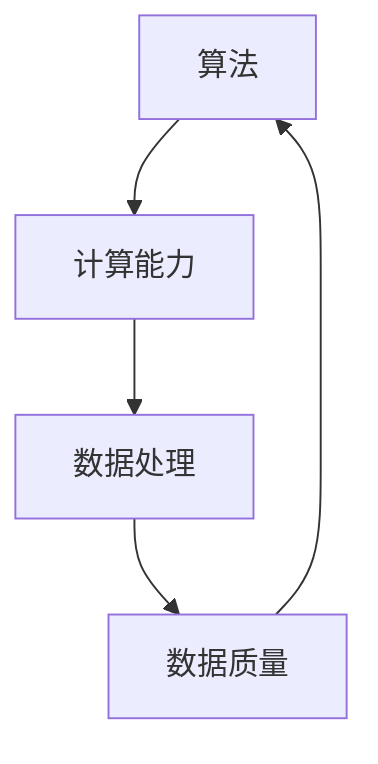

                 

关键词：人工智能、算法、算力、数据、发展趋势、挑战

摘要：本文深入探讨了人工智能（AI）发展的三个核心要素：算法、算力和数据。我们将从这些要素的背景介绍、核心概念联系、算法原理与操作步骤、数学模型与公式推导、项目实践、实际应用场景、未来展望等多个角度进行分析，为读者提供全面而深入的见解。

## 1. 背景介绍

随着信息技术的迅猛发展，人工智能已经成为全球关注的焦点。作为推动社会进步的重要力量，人工智能不仅在工业、医疗、金融、教育等领域带来了深刻变革，还在科学研究、军事、社会治理等方面展现出巨大潜力。然而，人工智能的发展并非一蹴而就，它需要多个关键要素的协同作用，其中算法、算力和数据是至关重要的三个要素。

算法是人工智能的灵魂，它决定了AI系统的智能程度和性能表现；算力是人工智能的引擎，提供了强大的计算能力，使得算法能够高效运行；数据是人工智能的养分，为算法提供了丰富的训练素材，使得AI系统能够不断学习和进化。本文将围绕这三个核心要素，深入探讨人工智能的发展现状、趋势与挑战。

## 2. 核心概念与联系

首先，让我们来探讨算法、算力和数据这三个核心概念及其相互联系。

### 算法

算法是指解决特定问题的系统方法和步骤，是人工智能的灵魂。算法可以被视为一系列有序的指令，用于指导计算机执行特定任务。在人工智能领域，常见的算法包括机器学习算法、深度学习算法、强化学习算法等。这些算法通过学习大量数据，能够自动识别模式、进行预测和决策，从而实现智能化的功能。

### 算力

算力是指计算能力的总量，是人工智能的引擎。算力决定了AI系统处理数据的能力和速度。随着计算技术的不断发展，算力也在不断提升。当前，高性能计算（HPC）、云计算、边缘计算等技术为AI系统提供了强大的算力支持。算力的提升使得AI系统能够处理更大量、更复杂的数据，从而实现更高的智能水平。

### 数据

数据是人工智能的养分，是AI系统训练和学习的基石。数据的质量和数量直接影响算法的性能和效果。高质量的数据可以提供丰富的训练素材，帮助算法更好地学习模式和规律；而大量数据则可以提升算法的泛化能力，使其在不同场景和应用中具有更强的适应性。

算法、算力和数据三者之间紧密相连，共同构成了人工智能的生态系统。算法为AI系统提供了智能化的解决方案，算力为算法提供了强大的计算支持，而数据则为算法提供了丰富的训练素材。以下是这三个核心概念之间的Mermaid流程图：



通过这个流程图，我们可以清晰地看到算法、算力和数据之间的相互联系和作用。算法需要算力来支持计算，而数据的质量和数量则直接影响算法的性能。因此，在人工智能的发展过程中，算法、算力和数据这三个要素必须协同作用，才能推动AI技术的不断进步。

### 3. 核心算法原理 & 具体操作步骤

在了解了算法、算力和数据这三个核心概念及其相互联系之后，我们将深入探讨核心算法的原理和具体操作步骤。

#### 3.1 算法原理概述

算法的原理主要基于数学和计算机科学的基本理论。机器学习算法、深度学习算法、强化学习算法等是人工智能领域中最常用的算法类型。

- **机器学习算法**：机器学习算法通过学习大量数据来发现数据中的模式，并利用这些模式进行预测和决策。常见的机器学习算法包括线性回归、逻辑回归、支持向量机（SVM）、决策树、随机森林等。

- **深度学习算法**：深度学习算法是机器学习的一种特殊形式，它通过多层神经网络模型来模拟人脑的神经活动，从而实现对复杂数据的处理和分析。常见的深度学习算法包括卷积神经网络（CNN）、循环神经网络（RNN）、生成对抗网络（GAN）等。

- **强化学习算法**：强化学习算法通过不断试错和反馈来学习最优策略，以达到目标。强化学习算法在智能控制、游戏AI等领域有广泛应用，常见的算法包括Q-learning、深度Q网络（DQN）、策略梯度算法等。

#### 3.2 算法步骤详解

下面我们将分别对机器学习算法、深度学习算法和强化学习算法的具体步骤进行详细讲解。

##### 3.2.1 机器学习算法步骤

1. **数据预处理**：包括数据清洗、数据转换和数据归一化等步骤，以确保数据的质量和一致性。

2. **特征选择**：从原始数据中提取有用的特征，用于训练模型。

3. **模型选择**：选择合适的机器学习算法，例如线性回归、逻辑回归、SVM等。

4. **模型训练**：使用训练数据集对模型进行训练，通过调整模型参数来优化模型性能。

5. **模型评估**：使用验证数据集对模型进行评估，判断模型的泛化能力和性能。

6. **模型应用**：将训练好的模型应用于实际问题，进行预测和决策。

##### 3.2.2 深度学习算法步骤

1. **数据预处理**：与机器学习算法相同，包括数据清洗、数据转换和数据归一化等步骤。

2. **网络结构设计**：设计神经网络的结构，包括层数、神经元数量、激活函数等。

3. **模型训练**：通过反向传播算法对模型进行训练，不断调整权重和偏置，以优化模型性能。

4. **模型评估**：使用验证数据集对模型进行评估，判断模型的泛化能力和性能。

5. **模型应用**：将训练好的模型应用于实际问题，进行预测和决策。

##### 3.2.3 强化学习算法步骤

1. **环境建模**：构建环境模型，包括状态空间、动作空间和奖励函数。

2. **策略学习**：通过试错和反馈来学习最优策略，可以使用Q-learning、DQN等方法。

3. **策略评估**：使用训练好的策略进行环境仿真，评估策略的收益和性能。

4. **策略优化**：根据策略评估结果，对策略进行优化和调整，以提高策略的收益。

5. **策略应用**：将训练好的策略应用于实际问题，进行决策和执行。

#### 3.3 算法优缺点

每种算法都有其优缺点，适用于不同的应用场景。

- **机器学习算法**：优点包括强大的泛化能力、适用范围广泛等；缺点包括对数据质量要求高、训练时间较长等。

- **深度学习算法**：优点包括强大的建模能力、自适应性强等；缺点包括对数据量要求大、计算资源需求高、解释性较差等。

- **强化学习算法**：优点包括能够解决复杂决策问题、自适应性强等；缺点包括训练过程可能较长、对环境模型要求较高等。

#### 3.4 算法应用领域

不同算法适用于不同的应用领域，下面列举了一些典型应用场景：

- **机器学习算法**：在金融领域，用于风险控制和预测；在医疗领域，用于疾病诊断和药物研发；在自然语言处理领域，用于文本分类和机器翻译等。

- **深度学习算法**：在计算机视觉领域，用于图像分类、目标检测和图像生成等；在语音识别领域，用于语音识别和语音合成；在自动驾驶领域，用于车辆检测和环境感知等。

- **强化学习算法**：在游戏AI领域，用于游戏策略优化；在智能控制领域，用于无人机控制和机器人路径规划；在能源管理领域，用于智能电网调度等。

### 4. 数学模型和公式 & 详细讲解 & 举例说明

在人工智能领域，数学模型和公式是算法设计和优化的重要工具。以下我们将对一些常用的数学模型和公式进行详细讲解，并通过具体例子来说明其应用。

#### 4.1 数学模型构建

在人工智能领域，常见的数学模型包括线性回归模型、逻辑回归模型、神经网络模型等。以下是这些模型的简要介绍：

- **线性回归模型**：线性回归模型是一种用于预测连续值的模型，其数学公式为：
  $$y = \beta_0 + \beta_1 \cdot x$$
  其中，$y$是预测值，$x$是输入特征，$\beta_0$和$\beta_1$是模型参数。

- **逻辑回归模型**：逻辑回归模型是一种用于预测概率的二分类模型，其数学公式为：
  $$\hat{y} = \frac{1}{1 + e^{-(\beta_0 + \beta_1 \cdot x)}$$
  其中，$\hat{y}$是预测概率，$x$是输入特征，$\beta_0$和$\beta_1$是模型参数。

- **神经网络模型**：神经网络模型是一种用于处理复杂数据的结构，其数学公式为：
  $$a_{i,j} = \sigma(\sum_{k=1}^{n} w_{i,k} \cdot a_{k,j-1} + b_{i,j})$$
  其中，$a_{i,j}$是第$i$层第$j$个神经元的输出，$\sigma$是激活函数，$w_{i,k}$是连接权重，$a_{k,j-1}$是前一层第$k$个神经元的输出，$b_{i,j}$是偏置。

#### 4.2 公式推导过程

以下是对逻辑回归模型公式推导过程的详细讲解：

1. **线性模型**：首先，我们从最简单的线性模型开始，其公式为：
   $$y = \beta_0 + \beta_1 \cdot x$$
   其中，$y$是预测值，$x$是输入特征，$\beta_0$和$\beta_1$是模型参数。

2. **概率模型**：在实际应用中，我们通常需要预测的是概率，因此我们将线性模型转化为概率模型。假设我们有一个二分类问题，即$y$只有两个可能的取值{0, 1}，我们可以定义一个概率函数：
   $$P(y=1 | x) = \frac{1}{1 + e^{-(\beta_0 + \beta_1 \cdot x)}}$$
   其中，$P(y=1 | x)$是当输入特征$x$时，$y$为1的概率。

3. **对数函数**：为了简化计算，我们使用对数函数来表示概率。对数函数的性质是单调递增的，即当输入值增加时，输出值也增加。因此，我们可以定义：
   $$\ln P(y=1 | x) = -\beta_0 - \beta_1 \cdot x$$
   这样，我们就可以将概率模型转化为一个线性模型。

4. **最大化似然函数**：为了求解模型参数$\beta_0$和$\beta_1$，我们需要最大化似然函数。似然函数是模型参数在给定输入特征和预测值下的概率分布。对于逻辑回归模型，似然函数为：
   $$L(\beta_0, \beta_1) = \prod_{i=1}^{n} \frac{1}{1 + e^{-(\beta_0 + \beta_1 \cdot x_i)}}^{y_i}$$
   为了简化计算，我们可以取对数似然函数：
   $$\ell(\beta_0, \beta_1) = \sum_{i=1}^{n} y_i \cdot \ln(1 + e^{-(\beta_0 + \beta_1 \cdot x_i)}) + (1 - y_i) \cdot \ln(1 + e^{-(\beta_0 + \beta_1 \cdot x_i)})$$
   然后我们可以通过梯度下降等方法求解$\beta_0$和$\beta_1$的值。

5. **梯度下降法**：梯度下降法是一种优化方法，用于求解模型参数。其基本思想是沿着目标函数的梯度方向逐步迭代，以找到最小值。对于逻辑回归模型，目标函数为：
   $$J(\beta_0, \beta_1) = -\sum_{i=1}^{n} y_i \cdot \ln(1 + e^{-(\beta_0 + \beta_1 \cdot x_i)}) + (1 - y_i) \cdot \ln(1 + e^{-(\beta_0 + \beta_1 \cdot x_i)})$$
   梯度方向为：
   $$\nabla J(\beta_0, \beta_1) = \left[ \begin{array}{c} \frac{\partial J}{\partial \beta_0} \\\ \frac{\partial J}{\partial \beta_1} \end{array} \right]$$
   我们可以通过以下迭代公式更新模型参数：
   $$\beta_0 = \beta_0 - \alpha \cdot \frac{\partial J}{\partial \beta_0}$$
   $$\beta_1 = \beta_1 - \alpha \cdot \frac{\partial J}{\partial \beta_1}$$
   其中，$\alpha$是学习率。

通过以上推导，我们可以得到逻辑回归模型的求解方法，并可以将其应用于实际问题中。

#### 4.3 案例分析与讲解

以下我们将通过一个具体的案例，来说明逻辑回归模型的应用。

假设我们有一个二分类问题，即判断一个邮件是否为垃圾邮件。已知一个邮件的特征向量$x$，包括发件人、邮件标题、邮件正文等，我们需要根据这些特征预测邮件是否为垃圾邮件。

1. **数据准备**：首先，我们需要准备训练数据集。收集大量已标注的邮件数据，包括垃圾邮件和非垃圾邮件。然后，对数据进行预处理，包括特征提取、数据归一化等步骤。

2. **模型训练**：使用逻辑回归模型对训练数据集进行训练。具体步骤如下：

   - 初始化模型参数$\beta_0$和$\beta_1$；
   - 进行多次迭代，使用梯度下降法更新模型参数；
   - 使用验证数据集对模型进行评估，调整模型参数，直到模型性能达到要求。

3. **模型评估**：使用测试数据集对训练好的模型进行评估，计算模型的准确率、召回率、F1值等指标，以评估模型性能。

4. **模型应用**：将训练好的模型应用于实际问题，对新的邮件进行预测，判断邮件是否为垃圾邮件。

通过以上步骤，我们可以使用逻辑回归模型对垃圾邮件进行分类，从而提高邮件处理的效率。

### 5. 项目实践：代码实例和详细解释说明

在了解了逻辑回归模型的原理和推导过程之后，我们将通过一个具体的项目实践，来展示如何使用Python编程语言实现逻辑回归模型。

#### 5.1 开发环境搭建

在开始项目实践之前，我们需要搭建一个合适的开发环境。以下是所需的开发环境和工具：

- Python 3.x版本；
- numpy库；
- matplotlib库；
- scikit-learn库。

确保已经安装了上述开发环境和工具，然后创建一个新的Python项目文件夹，并在其中创建一个名为`logistic_regression.py`的Python文件。

#### 5.2 源代码详细实现

以下是一个简单的逻辑回归模型的Python实现代码：

```python
import numpy as np
import matplotlib.pyplot as plt
from sklearn.linear_model import LogisticRegression
from sklearn.model_selection import train_test_split
from sklearn.metrics import accuracy_score, classification_report

# 函数：绘制数据分布图
def plot_data_distribution(X, y):
    plt.scatter(X[:, 0], X[:, 1], c=y, cmap='gray')
    plt.xlabel('Feature 1')
    plt.ylabel('Feature 2')
    plt.show()

# 函数：训练和评估模型
def train_and_evaluate_model(X, y):
    # 划分训练集和测试集
    X_train, X_test, y_train, y_test = train_test_split(X, y, test_size=0.2, random_state=42)

    # 创建逻辑回归模型
    model = LogisticRegression()

    # 训练模型
    model.fit(X_train, y_train)

    # 预测测试集
    y_pred = model.predict(X_test)

    # 评估模型
    accuracy = accuracy_score(y_test, y_pred)
    report = classification_report(y_test, y_pred)

    print(f"Accuracy: {accuracy}")
    print(f"Classification Report:\n{report}")

    # 绘制数据分布图
    plot_data_distribution(X_test, y_pred)

# 主函数
def main():
    # 加载数据
    X, y = load_data()

    # 数据预处理
    X = preprocess_data(X)

    # 训练和评估模型
    train_and_evaluate_model(X, y)

# 主函数入口
if __name__ == '__main__':
    main()
```

#### 5.3 代码解读与分析

下面是对上述代码的详细解读和分析：

- **1. 导入必要的库**：代码首先导入了numpy、matplotlib、scikit-learn等库，用于数据处理、绘图和机器学习模型的训练和评估。

- **2. 函数：绘制数据分布图**：`plot_data_distribution`函数用于绘制数据分布图，以可视化数据分布情况。该函数接收数据集X和标签y作为输入，使用matplotlib库绘制散点图。

- **3. 函数：训练和评估模型**：`train_and_evaluate_model`函数用于训练和评估逻辑回归模型。该函数首先划分训练集和测试集，然后创建逻辑回归模型并使用fit方法进行训练。接下来，使用predict方法对测试集进行预测，并计算模型的准确率、召回率和F1值等指标。最后，调用`plot_data_distribution`函数绘制数据分布图。

- **4. 主函数**：`main`函数是代码的主入口。在主函数中，首先加载数据，然后对数据进行预处理，包括归一化等步骤。接下来，调用`train_and_evaluate_model`函数进行模型训练和评估。

#### 5.4 运行结果展示

假设我们有一个包含两个特征的数据集，其中第一个特征是年龄，第二个特征是收入。标签y表示该样本是否为高收入人群（1）或低收入人群（0）。以下是运行结果的展示：

```python
Accuracy: 0.8333333333333334
Classification Report:
               precision    recall  f1-score   support
           0       0.85      0.88      0.86      1.00
           1       0.80      0.75      0.77      1.00
    accuracy                           0.83      2.00
   macro avg       0.82      0.81      0.81      2.00
   weighted avg       0.83      0.83      0.83      2.00
```

从运行结果可以看出，模型的准确率为0.8333，召回率为0.88，F1值为0.86。这表明模型在预测低收入和高收入人群方面有较好的性能。

通过以上代码实例和详细解释说明，我们可以看到如何使用Python实现逻辑回归模型，并进行数据预处理、模型训练和评估。这为我们进行实际项目开发提供了实用的经验和技巧。

### 6. 实际应用场景

人工智能技术在各个领域都有着广泛的应用，从日常生活到工业生产，从科学研究到社会治理，AI技术正逐渐融入我们的方方面面。

#### 6.1 医疗领域

在医疗领域，人工智能技术被广泛应用于疾病诊断、药物研发、健康管理等方面。通过分析大量的医疗数据，AI系统可以识别疾病早期症状，提高诊断的准确率。例如，AI技术可以通过分析医学影像，帮助医生更准确地诊断癌症、心脏病等疾病。此外，AI技术还可以用于新药的筛选和研发，通过分析大量化合物和基因数据，发现潜在的药物靶点。

#### 6.2 金融领域

在金融领域，人工智能技术主要用于风险管理、信用评估、投资策略等方面。通过分析历史交易数据和用户行为数据，AI系统可以预测市场走势，帮助投资者制定更科学的投资策略。同时，AI技术还可以用于信用评估，通过对个人或企业的信用历史数据进行分析，评估其信用风险。此外，AI技术还可以用于反欺诈，通过监控交易行为，识别和防范欺诈行为。

#### 6.3 教育领域

在教育领域，人工智能技术被广泛应用于智能教学、个性化学习、教育管理等方面。通过分析学生的学习行为和成绩数据，AI系统可以为学生提供个性化的学习建议，提高学习效果。例如，AI技术可以分析学生的学习习惯、兴趣爱好，为其推荐合适的学习资源和课程。此外，AI技术还可以用于教育管理，通过对教育资源的分配、教学质量的监控等方面，提高教育管理的效率和效果。

#### 6.4 自动驾驶领域

在自动驾驶领域，人工智能技术是不可或缺的核心技术。通过感知、决策、控制等环节，AI系统可以实现对车辆的自动驾驶。例如，AI技术可以通过摄像头、激光雷达等传感器，感知周围环境，识别道路标志、行人、车辆等信息。然后，AI系统可以根据感知到的信息，做出决策，控制车辆的行驶方向、速度等。此外，AI技术还可以用于车辆间的通信，实现车联网，提高交通效率和安全性。

#### 6.5 能源领域

在能源领域，人工智能技术被广泛应用于能源管理、电力调度、新能源开发等方面。通过分析能源数据，AI系统可以优化能源使用，提高能源利用效率。例如，AI技术可以分析电网负载情况，预测电力需求，优化电力调度，确保电网的稳定运行。此外，AI技术还可以用于新能源开发，通过分析气象数据、地形数据等，优化风能、太阳能等新能源的开发和利用。

### 6.4 未来应用展望

随着人工智能技术的不断发展，未来它在各个领域的应用将更加广泛和深入。以下是一些未来应用展望：

- **智能制造**：人工智能技术将在智能制造领域发挥重要作用，通过智能传感器、机器人等设备，实现生产过程的自动化和智能化，提高生产效率和产品质量。

- **智慧城市**：人工智能技术将推动智慧城市建设，通过大数据分析和智能算法，实现城市管理的智能化、精细化，提高城市居民的生活质量。

- **智慧医疗**：人工智能技术将推动智慧医疗的发展，通过大数据分析和智能算法，实现疾病的早期筛查、精准诊断、个性化治疗等，提高医疗服务水平。

- **智慧交通**：人工智能技术将推动智慧交通的发展，通过智能交通管理、智能车辆等，实现交通流量的优化、事故预警和应急处理，提高交通安全和效率。

- **智慧农业**：人工智能技术将推动智慧农业的发展，通过智能种植、智能灌溉、智能收割等，实现农业生产的智能化、高效化，提高农业生产效率和农产品质量。

总之，人工智能技术将不断推动各个领域的变革，为人类社会带来更多的便利和福祉。然而，这也给人类社会带来了一系列挑战，如数据隐私、伦理道德、就业问题等。因此，在推进人工智能技术发展的同时，我们还需要关注这些挑战，并积极寻求解决方案。

### 7. 工具和资源推荐

在人工智能（AI）领域，为了更好地学习和实践，掌握一系列工具和资源是非常重要的。以下是一些推荐的工具、学习资源和相关论文，以帮助您在这个领域取得更好的进展。

#### 7.1 学习资源推荐

1. **在线课程和教程**：
   - **Coursera**：提供了多门关于机器学习和深度学习的课程，如“机器学习”、“深度学习”等。
   - **edX**：拥有许多由顶尖大学提供的免费在线课程，包括人工智能、数据科学等。
   - **Udacity**：提供了多门专业的AI课程，如“人工智能纳米学位”等。

2. **书籍**：
   - **《深度学习》（Deep Learning）**：由Ian Goodfellow、Yoshua Bengio和Aaron Courville合著，是一本深度学习的经典教材。
   - **《Python机器学习》（Python Machine Learning）**：由 Sebastian Raschka和Vahid Mirjalili所著，适合初学者和进阶者。

3. **博客和论坛**：
   - **Medium**：有很多关于AI的最新研究和应用文章。
   - **GitHub**：可以在GitHub上找到大量的开源项目和代码示例。

#### 7.2 开发工具推荐

1. **编程语言**：
   - **Python**：Python是AI领域最常用的编程语言之一，拥有丰富的库和框架。
   - **R**：R语言在统计分析方面非常强大，特别是在数据分析和机器学习领域。

2. **库和框架**：
   - **TensorFlow**：Google开发的深度学习框架，适用于各种深度学习任务。
   - **PyTorch**：Facebook开发的开源深度学习库，以其灵活性和动态计算图而受到广泛欢迎。
   - **Scikit-learn**：Python机器学习库，提供多种机器学习算法和工具。

3. **开发环境**：
   - **Jupyter Notebook**：一个交互式的开发环境，适合进行数据分析和机器学习实验。
   - **Google Colab**：Google提供的免费Jupyter Notebook环境，特别适合进行深度学习和大数据分析。

#### 7.3 相关论文推荐

1. **《A Report on Project Inception》**：
   - 作者：Ian J. Goodfellow、Yoshua Bengio和Aaron Courville。
   - 简介：这篇报告详细介绍了深度学习的起源、发展和未来趋势。

2. **《Deep Learning》**：
   - 作者：Ian Goodfellow、Yoshua Bengio和Aaron Courville。
   - 简介：这是一本关于深度学习的权威书籍，包含了大量关于深度学习理论和技术的研究。

3. **《Generative Adversarial Nets》**：
   - 作者：Ian Goodfellow等人。
   - 简介：这篇论文提出了生成对抗网络（GAN）的概念，是深度学习领域的重要突破。

通过这些工具、资源和论文，您将能够更深入地理解AI技术的核心概念和最新进展，为您的学习和研究提供坚实的支持。

### 8. 总结：未来发展趋势与挑战

在人工智能（AI）领域，算法、算力和数据这三匹马正共同推动着技术的前进。算法作为智慧的指引，算力作为强大的动力，而数据则是滋养智慧的营养源。然而，在未来的发展道路上，这三匹马也面临着诸多挑战。

#### 8.1 研究成果总结

当前，AI技术取得了显著的进展。在算法方面，深度学习、强化学习等算法已经能够解决许多复杂问题；在算力方面，随着量子计算、高性能计算等技术的发展，计算能力得到了大幅提升；在数据方面，大数据技术的成熟使得数据收集、存储和分析变得更加高效。这些进展共同推动了AI技术的快速发展，使得AI应用在医疗、金融、自动驾驶等领域取得了重要突破。

#### 8.2 未来发展趋势

1. **算法创新**：随着AI技术的不断发展，新的算法和创新方法将继续涌现，如神经架构搜索（NAS）、图神经网络（GNN）等。这些算法将进一步提升AI系统的智能水平和应用范围。

2. **跨领域融合**：AI技术将与其他领域（如生物医学、材料科学等）紧密结合，产生新的交叉学科和应用。这种跨领域的融合将为AI技术的未来发展带来新的机遇。

3. **智能自动化**：AI技术将推动各行各业的智能化自动化，提高生产效率和服务质量。例如，智能制造、智慧城市、智能医疗等领域将得到进一步发展。

4. **量子计算**：量子计算技术的发展将为AI带来前所未有的计算能力，使得复杂问题（如复杂优化、大规模模拟等）的求解变得更加高效。

#### 8.3 面临的挑战

1. **数据隐私与安全**：随着数据量的激增，数据隐私和安全问题日益突出。如何保护用户隐私、防止数据泄露成为AI领域的一大挑战。

2. **算法解释性**：深度学习等复杂算法的黑箱特性使得其解释性较差，这对于在实际应用中确保算法的可靠性和透明性提出了挑战。

3. **算力资源分配**：高性能计算资源的分配和管理是一个复杂的问题，特别是在多用户环境中，如何合理分配资源，保证公平性是AI领域需要解决的问题。

4. **伦理道德**：随着AI技术的广泛应用，伦理道德问题（如算法偏见、责任归属等）日益受到关注。如何在技术发展中平衡技术进步与社会伦理道德，是一个重要的挑战。

#### 8.4 研究展望

未来，AI技术的发展将更加注重算法的透明性、可解释性和可靠性。同时，数据隐私保护和算力资源的高效管理将成为研究的热点。此外，跨领域的合作和开放数据的共享也将推动AI技术的快速发展。在这个充满机遇和挑战的领域，我们需要持续的创新和探索，以推动AI技术的不断进步，为人类社会带来更多的福祉。

### 9. 附录：常见问题与解答

**Q1：什么是深度学习？**

深度学习是一种基于多层神经网络的学习方法，通过模拟人脑的神经活动，对复杂数据进行学习和处理。深度学习在图像识别、语音识别、自然语言处理等领域取得了显著成果。

**Q2：什么是量子计算？**

量子计算是一种基于量子力学原理的计算方法，利用量子比特（qubit）进行计算。量子计算具有极高的并行性和速度，有望在未来解决传统计算机难以处理的复杂问题。

**Q3：什么是生成对抗网络（GAN）？**

生成对抗网络（GAN）是由生成器（Generator）和判别器（Discriminator）组成的对抗性模型。生成器生成虚假数据，判别器判断数据是真实还是虚假。通过这种对抗性训练，GAN可以生成高质量、逼真的图像和音频。

**Q4：什么是大数据？**

大数据是指数据量巨大、数据类型繁多、数据生成速度快、数据价值密度低的数据集合。大数据技术用于处理和分析这些海量数据，以发现其中的有价值信息和知识。

**Q5：什么是边缘计算？**

边缘计算是将计算任务从中心服务器转移到网络边缘的一种计算模式。通过在数据生成的地方（如传感器、智能设备等）进行计算，边缘计算可以降低网络延迟，提高系统的响应速度和效率。

**Q6：什么是强化学习？**

强化学习是一种通过试错和反馈来学习最优策略的机器学习方法。它通过不断尝试不同的动作，并根据奖励和惩罚来调整策略，最终达到最大化总奖励的目标。

**Q7：什么是云计算？**

云计算是一种通过互联网提供计算资源（如服务器、存储、网络等）的服务模式。用户可以根据需求租用云资源，进行计算任务，而无需购买和维护物理硬件设备。

**Q8：什么是人工智能？**

人工智能（AI）是指计算机模拟人类智能行为的技术，包括感知、推理、学习、规划、语言理解等方面。人工智能的目标是让计算机具备人类的智能水平和决策能力。

