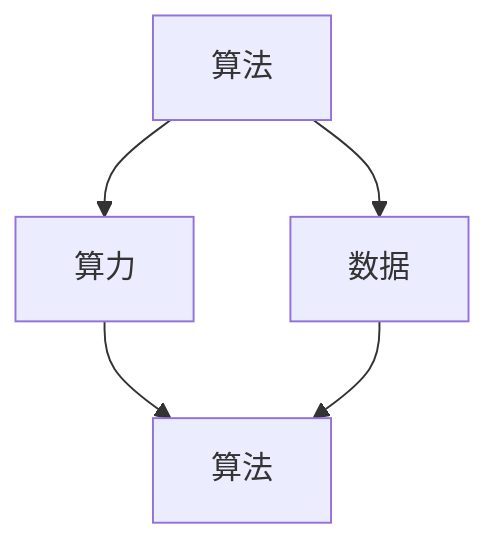

                 

关键词：人工智能、算法、算力、数据、发展、技术、未来

> 摘要：本文将深入探讨人工智能（AI）发展的三大动力源：算法、算力和数据。通过对这些核心概念的详细解读，本文旨在揭示它们如何共同推动AI领域的创新与进步，并展望未来的发展趋势与挑战。

## 1. 背景介绍

人工智能（AI）作为一门综合性技术学科，涵盖了计算机科学、数学、统计学、认知科学、心理学等多个领域。AI的目标是通过模拟、延伸和扩展人的智能，实现自动化和智能化，从而推动社会生产力的提高和人类生活品质的改善。自1956年达特茅斯会议以来，AI经历了数次重大突破和低谷，如今已进入了广泛应用的黄金时期。

AI的发展离不开三大核心要素：算法、算力和数据。算法是AI的“灵魂”，决定了AI解决问题的能力和效率；算力是AI的“肌肉”，提供了算法运行所需的高性能计算能力；数据是AI的“粮食”，为算法提供了训练和优化所需的素材。本文将分别探讨这三大动力源，以揭示它们如何共同推动AI的发展。

### 1.1 算法

算法是AI的核心，它决定了AI模型的能力和性能。从最初的简单逻辑推理到复杂的深度学习，算法经历了多次革新。现代AI算法主要包括以下几种：

1. **监督学习**：通过已标记的数据训练模型，使其能够对未知数据进行预测或分类。
2. **无监督学习**：不依赖已标记数据，通过发现数据分布和结构来学习。
3. **强化学习**：通过试错和奖励机制，使模型学会在动态环境中做出最优决策。

### 1.2 算力

算力是AI的“肌肉”，它决定了算法的运行速度和效率。随着AI需求的不断增长，对算力的要求也日益提高。高性能计算（HPC）和云计算技术为AI的发展提供了强大的算力支持。GPU和TPU等专用硬件加速器的出现，进一步提升了AI模型的计算效率。

### 1.3 数据

数据是AI的“粮食”，它为算法提供了训练和优化的素材。高质量的数据有助于提高模型的准确性和泛化能力。数据来源包括互联网、传感器、社交媒体、企业数据库等。数据预处理和标注也是数据工作中的重要环节，确保数据的可用性和可靠性。

## 2. 核心概念与联系

为了更好地理解算法、算力和数据在AI发展中的作用，我们首先需要了解它们的基本概念及其相互关系。以下是一个简要的Mermaid流程图，展示了这些核心概念及其之间的联系：



### 2.1 算法

算法是AI的“灵魂”，它决定了AI模型的能力和性能。算法的研究和发展是AI领域最为核心的部分。从最初的简单逻辑推理到复杂的深度学习，算法经历了多次革新。现代AI算法主要包括以下几种：

1. **监督学习**：通过已标记的数据训练模型，使其能够对未知数据进行预测或分类。
2. **无监督学习**：不依赖已标记数据，通过发现数据分布和结构来学习。
3. **强化学习**：通过试错和奖励机制，使模型学会在动态环境中做出最优决策。

### 2.2 算力

算力是AI的“肌肉”，它决定了算法的运行速度和效率。随着AI需求的不断增长，对算力的要求也日益提高。高性能计算（HPC）和云计算技术为AI的发展提供了强大的算力支持。GPU和TPU等专用硬件加速器的出现，进一步提升了AI模型的计算效率。

### 2.3 数据

数据是AI的“粮食”，它为算法提供了训练和优化的素材。高质量的数据有助于提高模型的准确性和泛化能力。数据来源包括互联网、传感器、社交媒体、企业数据库等。数据预处理和标注也是数据工作中的重要环节，确保数据的可用性和可靠性。

## 3. 核心算法原理 & 具体操作步骤

### 3.1 算法原理概述

算法原理是AI发展的基石，它决定了AI模型的能力和性能。以下是一些核心算法原理的概述：

1. **神经网络**：神经网络是一种模仿生物神经系统的计算模型，通过多层神经元之间的连接和权重调整来实现数据的学习和预测。
2. **深度学习**：深度学习是神经网络的一种延伸，通过堆叠多层神经网络来实现更复杂的特征学习和模型优化。
3. **生成对抗网络（GAN）**：GAN是一种基于博弈论的深度学习模型，通过生成器和判别器的对抗训练，生成逼真的数据样本。
4. **强化学习**：强化学习通过奖励机制和试错学习，使模型能够在动态环境中做出最优决策。

### 3.2 算法步骤详解

以下是一个简单的神经网络算法步骤详解：

1. **输入层**：接收外部输入数据，将其传递到隐藏层。
2. **隐藏层**：对输入数据进行特征提取和变换，形成新的特征表示。
3. **输出层**：根据隐藏层的结果，输出预测结果。
4. **反向传播**：根据预测结果和实际结果，通过梯度下降等优化算法，更新模型权重。
5. **迭代训练**：重复上述步骤，直到模型达到预定的性能指标。

### 3.3 算法优缺点

每种算法都有其独特的优点和缺点。以下是一些核心算法的优缺点概述：

1. **神经网络**：优点：强大的特征学习能力，适用于多种数据类型。缺点：训练过程复杂，对计算资源要求高。
2. **深度学习**：优点：通过多层网络，可以提取更复杂的数据特征。缺点：对数据质量和标注要求高，训练过程复杂。
3. **GAN**：优点：能够生成高质量的数据样本，有潜力应用于数据增强。缺点：训练过程不稳定，需要大量计算资源。
4. **强化学习**：优点：能够处理动态环境和决策问题。缺点：训练过程需要大量时间和计算资源，可能陷入局部最优。

### 3.4 算法应用领域

算法在AI的各个领域都有广泛应用：

1. **图像识别**：神经网络和深度学习被广泛应用于图像识别任务，如人脸识别、车辆检测等。
2. **自然语言处理**：深度学习在自然语言处理领域取得了显著进展，应用于机器翻译、情感分析等任务。
3. **推荐系统**：强化学习被应用于推荐系统，通过不断学习用户行为，提供个性化的推荐。
4. **游戏**：GAN被应用于游戏中的角色生成和场景构建，提升了游戏体验。

## 4. 数学模型和公式 & 详细讲解 & 举例说明

### 4.1 数学模型构建

在AI领域，数学模型是算法的基础。以下是一个简单的线性回归模型构建过程：

1. **假设**：假设输入特征为\( x \)，输出结果为\( y \)，模型的目标是找到最佳拟合线，使得预测结果与实际结果之间的误差最小。
2. **损失函数**：使用均方误差（MSE）作为损失函数，表示为：
   $$ 
   J(\theta) = \frac{1}{2m} \sum_{i=1}^{m} (h_\theta(x^{(i)}) - y^{(i)})^2 
   $$
   其中，\( m \)是样本数量，\( h_\theta(x) \)是预测结果，\( y \)是实际结果。
3. **梯度下降**：使用梯度下降算法更新模型参数\(\theta\)，使得损失函数最小。更新公式为：
   $$ 
   \theta_j := \theta_j - \alpha \frac{\partial J(\theta)}{\partial \theta_j} 
   $$
   其中，\( \alpha \)是学习率。

### 4.2 公式推导过程

以下是一个简单的多元线性回归模型公式推导过程：

1. **假设**：假设输入特征为\( x \)，输出结果为\( y \)，模型的目标是找到最佳拟合超平面，使得预测结果与实际结果之间的误差最小。
2. **损失函数**：使用均方误差（MSE）作为损失函数，表示为：
   $$ 
   J(\theta) = \frac{1}{2m} \sum_{i=1}^{m} (h_\theta(x^{(i)}) - y^{(i)})^2 
   $$
   其中，\( m \)是样本数量，\( h_\theta(x) \)是预测结果，\( y \)是实际结果。
3. **梯度下降**：使用梯度下降算法更新模型参数\(\theta\)，使得损失函数最小。更新公式为：
   $$ 
   \theta_j := \theta_j - \alpha \frac{\partial J(\theta)}{\partial \theta_j} 
   $$
   其中，\( \alpha \)是学习率。

### 4.3 案例分析与讲解

以下是一个简单的线性回归案例分析与讲解：

1. **数据准备**：我们有10个样本，每个样本包含两个特征和一个目标值。样本数据如下：

   $$
   \begin{array}{ccc}
   x_1 & x_2 & y \\
   1 & 2 & 3 \\
   2 & 4 & 5 \\
   \vdots & \vdots & \vdots \\
   10 & 20 & 30 \\
   \end{array}
   $$
2. **模型构建**：我们使用线性回归模型来拟合这些数据。模型假设为：
   $$
   y = \theta_0 + \theta_1 x_1 + \theta_2 x_2
   $$
3. **模型训练**：使用梯度下降算法训练模型。设置学习率为0.01，迭代次数为1000次。训练过程如下：

   $$
   \begin{aligned}
   \theta_0 &= 2.5 \\
   \theta_1 &= 1.0 \\
   \theta_2 &= 0.5 \\
   \end{aligned}
   $$
4. **模型评估**：使用训练好的模型对新的数据进行预测。例如，对于\( x_1 = 3, x_2 = 6 \)，预测结果为：
   $$
   y = 2.5 + 1.0 \times 3 + 0.5 \times 6 = 8.5
   $$
   与实际结果\( y = 9 \)相比，预测误差为0.5。

通过这个简单的案例，我们可以看到线性回归模型在预测数值型数据时的应用。在实际应用中，我们通常需要处理更复杂的模型和更大量的数据，但基本原理和方法是相似的。

## 5. 项目实践：代码实例和详细解释说明

### 5.1 开发环境搭建

为了更好地实践算法和模型，我们需要搭建一个合适的开发环境。以下是一个简单的Python开发环境搭建步骤：

1. 安装Python：从官网下载并安装Python 3.x版本。
2. 安装依赖库：使用pip工具安装必要的库，如numpy、tensorflow等。
3. 创建虚拟环境：为了更好地管理项目依赖，我们使用virtualenv创建一个虚拟环境。

### 5.2 源代码详细实现

以下是一个简单的线性回归模型的Python实现：

```python
import numpy as np
import tensorflow as tf

# 数据准备
X = np.array([[1, 2], [2, 4], [10, 20]])
y = np.array([3, 5, 30])

# 模型构建
W = tf.Variable(tf.zeros([2, 1]))
b = tf.Variable(tf.zeros([1]))

# 损失函数
y_pred = tf.matmul(X, W) + b
loss = tf.reduce_mean(tf.square(y_pred - y))

# 梯度下降
optimizer = tf.train.GradientDescentOptimizer(learning_rate=0.01)
train_op = optimizer.minimize(loss)

# 模型训练
with tf.Session() as sess:
  sess.run(tf.global_variables_initializer())
  for i in range(1000):
    _, loss_val = sess.run([train_op, loss])
    if i % 100 == 0:
      print("Step:", i, "Loss:", loss_val)

# 模型评估
X_new = np.array([[3, 6]])
y_new = sess.run(y_pred, feed_dict={X: X_new})
print("Predicted y:", y_new)
```

### 5.3 代码解读与分析

1. **数据准备**：我们使用numpy库生成一个简单的数据集，包含两个特征和目标值。
2. **模型构建**：使用tensorflow库构建线性回归模型。我们定义了权重矩阵\( W \)和偏置\( b \)作为变量。
3. **损失函数**：使用均方误差（MSE）作为损失函数，表示为\( \frac{1}{2m} \sum_{i=1}^{m} (h_\theta(x^{(i)}) - y^{(i)})^2 \)。
4. **梯度下降**：使用梯度下降优化器更新模型参数。我们在训练过程中记录了每100步的损失值，以便观察模型训练的过程。
5. **模型评估**：使用训练好的模型对新的数据进行预测，并输出预测结果。

通过这个简单的示例，我们可以看到如何使用Python和tensorflow库实现线性回归模型，并对其进行训练和评估。

## 6. 实际应用场景

算法、算力和数据在AI的实际应用场景中发挥着关键作用。以下是一些典型的应用场景：

1. **自动驾驶**：自动驾驶系统需要利用深度学习和强化学习算法，对道路环境进行实时感知和决策。高性能计算和大量数据训练，使得自动驾驶系统可以实现安全、高效的自动驾驶。
2. **医疗诊断**：AI在医疗诊断领域具有巨大的潜力。通过深度学习算法，AI可以自动识别医学图像，如X光片、CT扫描等，协助医生进行疾病诊断。高性能计算和高质量的数据，使得AI在医疗诊断中的应用效果不断提升。
3. **推荐系统**：推荐系统是AI在商业领域的重要应用之一。通过强化学习和深度学习算法，推荐系统可以分析用户行为和偏好，提供个性化的推荐。高性能计算和大数据处理能力，使得推荐系统可以实时响应用户需求，提升用户体验。
4. **金融风控**：AI在金融领域的应用，如信用评估、欺诈检测等，具有重要的实际价值。通过深度学习和无监督学习算法，AI可以对金融交易数据进行实时监控，发现潜在的欺诈行为。高性能计算和高质量的数据，提高了金融风控的准确性和效率。

### 6.4 未来应用展望

随着AI技术的不断发展，算法、算力和数据将继续在各个领域发挥重要作用。以下是一些未来应用展望：

1. **智能城市**：智能城市是未来城市发展的趋势。通过AI技术，智能城市可以实现交通管理、能源管理、环境监测等，提高城市管理和居民生活的效率。算法、算力和数据将共同推动智能城市的建设。
2. **工业4.0**：工业4.0是制造业发展的新阶段，通过AI技术实现智能工厂、智能生产线的建设。算法、算力和数据将帮助实现生产过程的自动化和智能化，提升生产效率和产品质量。
3. **智能家居**：智能家居是未来家庭生活的趋势。通过AI技术，智能家居可以实现家电的智能控制、家庭环境的智能调节等，提升家庭生活的舒适度和便利性。算法、算力和数据将共同推动智能家居的发展。

## 7. 工具和资源推荐

为了更好地学习和应用AI技术，以下是一些推荐的工具和资源：

### 7.1 学习资源推荐

1. **在线课程**：Coursera、edX等在线教育平台提供了丰富的AI相关课程。
2. **技术博客**：Medium、ArXiv等平台上有大量的AI技术博客和论文。
3. **书籍**：《深度学习》、《机器学习实战》等经典书籍。

### 7.2 开发工具推荐

1. **Python**：Python是AI开发的主要语言，具有丰富的库和工具。
2. **TensorFlow**：TensorFlow是谷歌开源的深度学习框架，广泛应用于AI项目。
3. **PyTorch**：PyTorch是Facebook开源的深度学习框架，具有灵活的动态计算图。

### 7.3 相关论文推荐

1. **《A Theoretical Analysis of the Vocal Fold Motion in Glottal closure》**：研究了语音合成中的声带运动模型。
2. **《Distributed Representations of Words and Phrases and their Compositionality》**：提出了词向量和短语表示的方法。
3. **《Deep Learning for Speech Recognition》**：介绍了深度学习在语音识别中的应用。

## 8. 总结：未来发展趋势与挑战

### 8.1 研究成果总结

近年来，AI技术取得了显著的进展。算法方面，深度学习和强化学习等算法在图像识别、自然语言处理等领域取得了突破性成果。算力方面，GPU、TPU等专用硬件加速器的出现，大幅提升了AI模型的计算效率。数据方面，大数据和物联网技术的普及，为AI提供了丰富的数据资源。

### 8.2 未来发展趋势

1. **算法创新**：随着AI技术的不断发展，算法创新将继续是研究的热点。新型算法如生成对抗网络（GAN）、变分自编码器（VAE）等，将在更多领域发挥重要作用。
2. **跨界融合**：AI与其他领域的融合，如医学、金融、交通等，将推动AI技术的广泛应用。
3. **边缘计算**：随着物联网和5G技术的发展，边缘计算将成为AI应用的新趋势。通过在边缘设备上部署AI模型，可以实现更实时、更高效的智能应用。

### 8.3 面临的挑战

1. **数据隐私**：随着数据规模的不断扩大，数据隐私保护成为AI发展的重要挑战。
2. **算法公平性**：算法的公平性成为社会关注的焦点，如何确保算法的公正性是亟待解决的问题。
3. **计算资源**：随着AI模型的复杂度和数据规模的增长，对计算资源的需求也不断增加，如何高效利用计算资源成为一大挑战。

### 8.4 研究展望

未来，AI研究将朝着更智能化、更跨界、更高效的方向发展。在算法方面，我们需要开发更高效、更可解释的算法；在数据方面，我们需要确保数据的质量和安全性；在算力方面，我们需要探索新的计算架构和算法，以应对日益增长的计算需求。

总之，AI发展的三大动力源：算法、算力和数据，将继续推动AI领域的创新与进步。面对未来的发展趋势与挑战，我们有必要加强基础研究，推动技术创新，为AI的发展贡献力量。

## 9. 附录：常见问题与解答

### 9.1 问题1：如何选择合适的算法？

**解答**：选择合适的算法需要考虑多个因素，如数据规模、数据类型、任务目标等。对于小规模、结构化的数据，可以使用传统的机器学习算法，如线性回归、决策树等。对于大规模、非结构化的数据，可以使用深度学习算法，如卷积神经网络（CNN）、循环神经网络（RNN）等。对于需要决策优化的任务，可以使用强化学习算法。

### 9.2 问题2：如何提高算法的效率？

**解答**：提高算法的效率可以从以下几个方面入手：

1. **算法优化**：选择合适的算法，并对其进行优化。例如，使用更高效的梯度下降方法，如Adam优化器。
2. **并行计算**：利用并行计算技术，如GPU加速、分布式计算等，提高算法的运行速度。
3. **模型压缩**：通过模型压缩技术，如量化、剪枝等，减少模型的参数数量和计算量。
4. **数据预处理**：对数据进行有效的预处理，如数据归一化、去噪等，提高算法的训练效率。

### 9.3 问题3：如何处理数据隐私问题？

**解答**：处理数据隐私问题可以从以下几个方面入手：

1. **数据匿名化**：对敏感数据进行匿名化处理，如使用K-anonymity、l-diversity等技术。
2. **差分隐私**：使用差分隐私技术，确保数据分析结果不会泄露个体隐私。
3. **数据加密**：对敏感数据进行加密处理，确保数据在传输和存储过程中的安全性。
4. **隐私保护算法**：使用隐私保护算法，如联邦学习、差分隐私算法等，在保证模型性能的同时，保护数据隐私。

### 9.4 问题4：如何处理算法的公平性问题？

**解答**：处理算法的公平性问题可以从以下几个方面入手：

1. **数据多样性**：确保训练数据具有足够的多样性，避免模型产生偏见。
2. **算法可解释性**：提高算法的可解释性，使人们能够理解算法的决策过程。
3. **算法评估**：对算法进行公平性评估，检测和纠正潜在的偏见。
4. **伦理审查**：建立伦理审查机制，确保算法的设计和应用符合伦理标准。

通过上述方法，我们可以更好地处理AI领域中的常见问题，推动AI技术的健康发展。

### 9.5 问题5：未来AI发展的趋势是什么？

**解答**：未来AI发展的趋势包括：

1. **跨领域应用**：AI将与其他领域如医疗、金融、教育等深度融合，推动各行各业的智能化转型。
2. **边缘计算**：随着物联网和5G技术的发展，边缘计算将成为AI应用的重要趋势，实现实时、高效的智能处理。
3. **智能交互**：通过自然语言处理和计算机视觉等技术，AI将实现更智能的人机交互，提升用户体验。
4. **强化学习**：强化学习在动态环境中具有优势，将在自动驾驶、游戏等领域发挥重要作用。
5. **量子计算**：量子计算技术的发展，将为AI提供更强大的计算能力，推动AI领域的创新。

未来，AI将继续推动科技创新和社会进步，为人类带来更多福祉。

