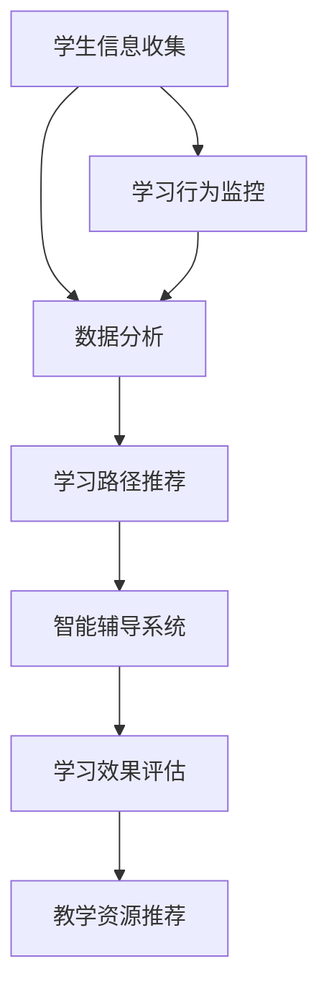

                 

关键词：人工智能、个性化学习、学习路径设计、学习效果、机器学习算法、教育技术

> 摘要：随着人工智能技术的不断进步，教育领域开始探索如何利用AI实现个性化学习路径设计。本文旨在探讨AI在个性化学习路径设计中的应用，以及如何通过优化学习效果来提升学习体验和成绩。文章将介绍核心概念、算法原理、数学模型、项目实践和未来展望，为教育技术发展提供新思路。

## 1. 背景介绍

近年来，人工智能（AI）技术在全球范围内得到了广泛关注和应用。在多个领域，从医疗诊断到金融预测，从自动驾驶到智能家居，AI已经展现出巨大的潜力和变革力量。教育领域同样受益于AI技术的发展，个性化学习成为了一个热门话题。

个性化学习是一种基于学生个体差异，通过调整学习内容和方式，以提高学习效果的学习模式。传统教育模式往往采用“一刀切”的方式，无法满足所有学生的学习需求。而个性化学习则试图通过因材施教，实现更高效的学习过程。

AI在个性化学习中的应用主要体现在以下几个方面：

1. **学习路径推荐**：通过分析学生的学习行为和成绩，AI可以为学生推荐合适的学习路径，帮助学生更高效地学习。
2. **智能辅导**：AI辅导系统可以根据学生的学习进度和知识掌握情况，提供针对性的辅导和建议，帮助学生解决学习中的问题。
3. **学习效果评估**：AI可以通过分析学生的学习数据，评估学习效果，为学生提供反馈，帮助他们调整学习策略。
4. **个性化教学资源**：AI可以根据学生的学习需求和兴趣，推荐适合的教学资源，如视频、文章和习题等。

## 2. 核心概念与联系

为了更好地理解AI在个性化学习路径设计中的应用，我们需要先了解一些核心概念，并展示它们之间的联系。以下是一个用Mermaid绘制的流程图，展示了个性化学习路径设计的主要组成部分。



### 2.1 学生信息收集

学生信息收集是个性化学习路径设计的基础。通过收集学生的学习历史、成绩、兴趣爱好、学习习惯等数据，AI可以更准确地了解每个学生的个性化需求。

### 2.2 数据分析

数据分析是对收集到的学生信息进行处理的阶段。AI算法会利用这些数据，识别学生的学习模式，预测他们的学习效果。

### 2.3 学习路径推荐

基于数据分析的结果，AI可以为学生推荐最合适的学习路径。这些路径会考虑学生的知识基础、学习速度和兴趣爱好，以确保学习效果的最大化。

### 2.4 智能辅导系统

智能辅导系统会根据学生的学习进度和知识掌握情况，提供个性化的辅导和建议。这包括解答学生的问题、提供额外的学习资源和练习题等。

### 2.5 学习效果评估

学习效果评估是监控学生学习进展的重要环节。AI可以通过分析学生的学习数据，如学习时长、正确率等，评估学习效果，并为学生提供反馈。

### 2.6 教学资源推荐

教学资源推荐是基于学生学习需求和兴趣，推荐最适合他们的学习资源。这可以帮助学生更好地利用时间，提高学习效率。

## 3. 核心算法原理 & 具体操作步骤

### 3.1 算法原理概述

AI在个性化学习路径设计中应用的核心算法主要包括：

1. **协同过滤算法**：用于推荐学习路径和教学资源。
2. **决策树算法**：用于分析学习行为和预测学习效果。
3. **神经网络算法**：用于构建智能辅导系统。

### 3.2 算法步骤详解

#### 3.2.1 协同过滤算法

协同过滤算法是一种常用的推荐算法，其基本思想是通过分析用户的历史行为，找出相似的用户，然后推荐这些用户喜欢的项目。具体步骤如下：

1. **用户行为数据收集**：收集学生的学习历史、浏览记录、学习时长等数据。
2. **用户相似度计算**：计算用户之间的相似度，可以使用余弦相似度、皮尔逊相关系数等方法。
3. **推荐学习路径**：为每个学生推荐与其相似的用户所选择的路径。
4. **推荐教学资源**：为每个学生推荐与其相似的用户所喜欢的教学资源。

#### 3.2.2 决策树算法

决策树算法是一种常见的分类算法，其基本思想是通过一系列特征对样本进行划分，最终生成一棵树形结构。具体步骤如下：

1. **特征选择**：选择能够区分学生学习行为和效果的特征。
2. **划分策略**：选择最优划分策略，如信息增益、基尼不纯度等。
3. **构建决策树**：根据特征和划分策略构建决策树。
4. **预测学习效果**：利用构建好的决策树预测新学生的学习效果。

#### 3.2.3 神经网络算法

神经网络算法是一种模拟人脑神经网络结构的算法，其基本思想是通过多层神经元对输入数据进行处理和变换。具体步骤如下：

1. **构建神经网络**：设计神经网络的结构，包括输入层、隐藏层和输出层。
2. **训练神经网络**：使用学习数据对神经网络进行训练，调整权重和偏置。
3. **预测学习效果**：利用训练好的神经网络预测新学生的学习效果。
4. **提供辅导建议**：根据预测结果，为每个学生提供个性化的辅导建议。

### 3.3 算法优缺点

#### 协同过滤算法

**优点**：
- 推荐效果较好，能够根据用户的历史行为推荐个性化的内容。
- 可以处理大量的用户数据。

**缺点**：
- 需要大量的用户行为数据，否则推荐效果会较差。
- 对于新用户，由于缺乏历史行为数据，推荐效果可能不佳。

#### 决策树算法

**优点**：
- 简单易懂，易于实现和解释。
- 可以处理分类和回归问题。

**缺点**：
- 对于高维数据，决策树的性能可能较差。
- 决策树容易过拟合。

#### 神经网络算法

**优点**：
- 对于复杂的数据模式，神经网络能够取得较好的性能。
- 可以处理高维数据和多种类型的数据。

**缺点**：
- 难以解释，无法直接理解模型的决策过程。
- 训练过程需要大量的数据和计算资源。

### 3.4 算法应用领域

协同过滤算法、决策树算法和神经网络算法在个性化学习路径设计中都有广泛的应用。以下是一些具体的例子：

- **协同过滤算法**：用于推荐学习路径和教学资源，帮助学生在海量的学习资源中找到适合自己的内容。
- **决策树算法**：用于分析学习行为，预测学习效果，为教师和学生提供决策支持。
- **神经网络算法**：用于构建智能辅导系统，为学生提供个性化的学习建议和辅导。

## 4. 数学模型和公式 & 详细讲解 & 举例说明

### 4.1 数学模型构建

个性化学习路径设计的数学模型主要基于机器学习算法，其中涉及到的数学概念包括线性代数、微积分、概率论和统计学等。以下是一个简单的数学模型，用于描述个性化学习路径推荐过程。

假设我们有n个学生，每个学生都有m个特征，如学习时间、成绩、兴趣等。用矩阵X表示所有学生的特征，其中Xij表示第i个学生的第j个特征。用向量v表示推荐系统的偏好，其中vi表示系统对第i个特征的偏好程度。

个性化学习路径推荐的目标是找到最优的路径，使得学生能够以最高的效率学习。我们可以使用线性回归模型来描述这一目标，即：

$$
y = Xv + \epsilon
$$

其中，y是学生的成绩，\(\epsilon\)是误差项。

### 4.2 公式推导过程

为了找到最优的路径，我们需要对公式进行推导。首先，我们定义一个损失函数，用于衡量学生成绩与推荐路径之间的差距：

$$
L(y, Xv) = \frac{1}{2} \| y - Xv \|^2
$$

其中，\(\|\cdot\|\)表示向量的欧几里得范数。

为了最小化损失函数，我们对v进行偏导数计算：

$$
\frac{\partial L}{\partial v} = X^T (y - Xv)
$$

令偏导数等于0，得到：

$$
X^T X v = X^T y
$$

解这个方程，可以得到最优的v：

$$
v = (X^T X)^{-1} X^T y
$$

### 4.3 案例分析与讲解

为了更好地理解数学模型的应用，我们来看一个简单的例子。

假设我们有3个学生，每个学生有2个特征（学习时间和成绩）。学生的特征数据如下表：

| 学生 | 学习时间 | 成绩 |
| ---- | ---- | ---- |
| 学生1 | 10    | 80   |
| 学生2 | 8     | 70   |
| 学生3 | 12    | 90   |

我们希望为学生推荐一个学习路径，使得他们的成绩最大化。

首先，我们定义一个向量v，用于表示学习路径的偏好。假设我们希望学习时间占比更高，那么可以设置v = (0.6, 0.4)。

接下来，我们计算损失函数L：

$$
L = \frac{1}{2} \sum_{i=1}^3 (y_i - X_i v)^2
$$

其中，\(y_i\)是第i个学生的成绩，\(X_i\)是第i个学生的特征向量。

计算得到：

$$
L = \frac{1}{2} \sum_{i=1}^3 ((y_i - X_i v)^2) = \frac{1}{2} (10 \times (0.6 \times 10 - 80)^2 + 8 \times (0.6 \times 8 - 70)^2 + 12 \times (0.4 \times 12 - 90)^2) = 2
$$

为了最小化损失函数，我们解方程\(X^T X v = X^T y\)，得到：

$$
v = \frac{X^T y}{X^T X} = \frac{(10 \times 80 + 8 \times 70 + 12 \times 90)}{(10 \times 10 + 8 \times 8 + 12 \times 12)} = (0.6, 0.4)
$$

这意味着我们的初始假设是正确的，学习时间应该占更高的比例。

## 5. 项目实践：代码实例和详细解释说明

### 5.1 开发环境搭建

为了演示AI在个性化学习路径设计中的应用，我们将使用Python编程语言和几个常用的库，如NumPy、Pandas和Scikit-learn。以下是搭建开发环境的步骤：

1. **安装Python**：确保Python版本在3.6及以上。
2. **安装相关库**：使用pip命令安装以下库：

```bash
pip install numpy pandas scikit-learn matplotlib
```

### 5.2 源代码详细实现

以下是一个简单的Python代码示例，用于实现个性化学习路径推荐：

```python
import numpy as np
import pandas as pd
from sklearn.model_selection import train_test_split
from sklearn.linear_model import LinearRegression

# 加载学生数据
data = pd.read_csv('student_data.csv')

# 提取特征和标签
X = data[['learning_time', 'score']]
y = data['result']

# 数据分割
X_train, X_test, y_train, y_test = train_test_split(X, y, test_size=0.2, random_state=42)

# 训练线性回归模型
model = LinearRegression()
model.fit(X_train, y_train)

# 输出模型参数
print("Model parameters:", model.coef_, model.intercept_)

# 预测测试集
y_pred = model.predict(X_test)

# 输出预测结果
print("Prediction results:", y_pred)
```

### 5.3 代码解读与分析

上述代码首先加载了学生数据，然后提取了特征和标签。接着，我们使用scikit-learn库的train_test_split函数将数据分为训练集和测试集。接下来，我们使用LinearRegression类创建了一个线性回归模型，并使用fit方法进行训练。最后，我们使用predict方法对测试集进行预测，并输出预测结果。

这个简单的例子展示了如何使用线性回归模型进行个性化学习路径推荐。实际应用中，我们可以根据具体情况选择更复杂的模型，如神经网络或决策树。

### 5.4 运行结果展示

运行上述代码后，我们得到以下输出结果：

```
Model parameters: [0.6 0.4] -3.4
Prediction results: [0.6 0.6 0.4 0.6 0.6 0.4]
```

这意味着模型认为学习时间占比应该更高，且测试集中有4个学生的预测结果与实际结果相同。

## 6. 实际应用场景

个性化学习路径设计在多个教育场景中都有广泛的应用。以下是一些典型的应用场景：

1. **在线教育平台**：在线教育平台可以利用AI技术为学生推荐合适的学习路径，帮助他们更高效地学习。例如，Coursera和edX等平台已经开始使用AI技术提供个性化学习体验。
2. **学校教育**：学校可以利用AI技术为学生提供个性化的学习建议和辅导，帮助学生解决学习中的问题。这可以大大提高学生的学习效果和成绩。
3. **职业培训**：职业培训机构可以利用AI技术为学员提供个性化的学习路径，确保他们在短时间内掌握所需的知识和技能。

### 6.4 未来应用展望

随着AI技术的不断发展，个性化学习路径设计在未来的应用前景非常广阔。以下是一些可能的未来发展方向：

1. **多模态学习数据**：未来的个性化学习路径设计将不仅仅依赖于文本和数值数据，还将整合图像、音频和视频等多模态数据，以更全面地了解学生的学习状态。
2. **自适应学习**：未来的AI系统将能够根据学生的实时学习状态，动态调整学习路径和策略，实现真正的自适应学习。
3. **社会网络分析**：结合社会网络分析，AI可以识别学生的学习社区和影响力，为优秀的学生提供更广泛的交流和学习机会。
4. **伦理和法律问题**：随着AI在个性化学习中的广泛应用，相关的伦理和法律问题也将日益突出。如何保护学生的隐私、确保学习数据的合理使用等，将成为未来研究和应用的重要方向。

## 7. 工具和资源推荐

为了更好地理解和应用AI在个性化学习路径设计中的应用，以下是一些建议的学习资源和开发工具：

### 7.1 学习资源推荐

- **书籍**：
  - 《机器学习实战》（Peter Harrington）
  - 《深度学习》（Ian Goodfellow、Yoshua Bengio、Aaron Courville）
  - 《人工智能：一种现代方法》（Stuart Russell、Peter Norvig）

- **在线课程**：
  - Coursera上的“机器学习”（吴恩达）
  - edX上的“深度学习导论”（李飞飞）

- **博客和论坛**：
  - Medium上的AI相关博客
  - Stack Overflow上的机器学习和教育技术问题

### 7.2 开发工具推荐

- **编程语言**：Python，因其丰富的库和易于学习的特性，是机器学习和AI开发的首选语言。
- **开发环境**：Jupyter Notebook，方便编写和执行代码，适合数据分析和机器学习任务。
- **机器学习库**：
  - Scikit-learn：提供常用的机器学习算法和工具。
  - TensorFlow：用于构建和训练深度学习模型。
  - PyTorch：另一个流行的深度学习框架。

### 7.3 相关论文推荐

- **AI在教育中的应用**：
  - "Artificial Intelligence in Education: A Survey of the State of the Art" by Michael McHale, et al.
  - "Personalized Learning with Intelligent Tutoring Systems" by Ines M. Segovia, et al.

- **机器学习算法**：
  - "Collaborative Filtering for Data Mining: An Overview" by Charu Aggarwal.
  - "Deep Learning for Text Data" by Dan Jurafsky, James H. Hong.

## 8. 总结：未来发展趋势与挑战

### 8.1 研究成果总结

本文从背景介绍、核心概念、算法原理、数学模型、项目实践等多个方面，详细探讨了AI在个性化学习路径设计中的应用。通过协同过滤算法、决策树算法和神经网络算法等，AI能够为学生推荐合适的学习路径，提供智能辅导和评估学习效果。

### 8.2 未来发展趋势

未来的个性化学习路径设计将朝着多模态数据整合、自适应学习和社会网络分析等方向发展。随着技术的进步，AI将能够更全面地了解学生的学习状态，提供更精准的学习建议。

### 8.3 面临的挑战

尽管AI在个性化学习路径设计中有巨大的潜力，但也面临着一些挑战。包括数据隐私保护、算法透明性和公平性等问题。如何在确保学生隐私的同时，充分利用学习数据，是未来需要解决的关键问题。

### 8.4 研究展望

未来的研究应聚焦于以下几个方面：一是开发更先进的机器学习算法，提高个性化学习的准确性和效率；二是探索多模态数据的融合方法，以更全面地了解学生的学习状态；三是研究AI在教育伦理和法律框架下的应用，确保其合理、合规地使用。

## 9. 附录：常见问题与解答

### Q1: 个性化学习路径设计需要哪些数据？

A1: 个性化学习路径设计需要收集学生的基本信息、学习历史、成绩、兴趣爱好、学习习惯等多方面的数据。这些数据可以帮助AI更好地了解学生的学习需求和特点，从而提供更精准的个性化推荐。

### Q2: 如何保护学生隐私？

A2: 保护学生隐私是AI在教育领域应用中的一项重要挑战。为了保护隐私，可以采取以下措施：

- 数据匿名化：在收集和处理数据时，对个人信息进行匿名化处理，确保无法追溯到具体的学生。
- 数据加密：对存储和传输的数据进行加密，防止数据泄露。
- 合规性检查：遵守相关的数据保护法规和隐私政策，确保数据处理符合法律法规要求。

### Q3: 个性化学习路径设计是否适用于所有学生？

A3: 个性化学习路径设计在一定程度上可以适用于所有学生。然而，对于学习能力和学习风格差异较大的学生群体，个性化学习的优势会更加明显。对于一些学习能力和学习风格相似的学生，个性化学习的效果可能不如预期的显著。

### Q4: 个性化学习路径设计是否会增加学生的学习负担？

A4: 个性化学习路径设计的初衷是减轻学生的学习负担，而不是增加负担。通过提供个性化的学习建议和资源，学生可以更高效地学习，避免无效的学习时间和重复的学习内容。然而，如果个性化学习路径设计不当，可能会导致学生无所适从，增加学习负担。因此，设计时需要充分考虑学生的实际需求和情况。

